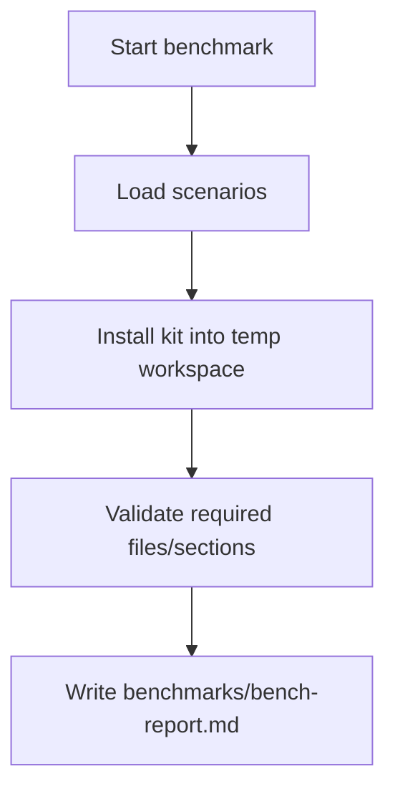
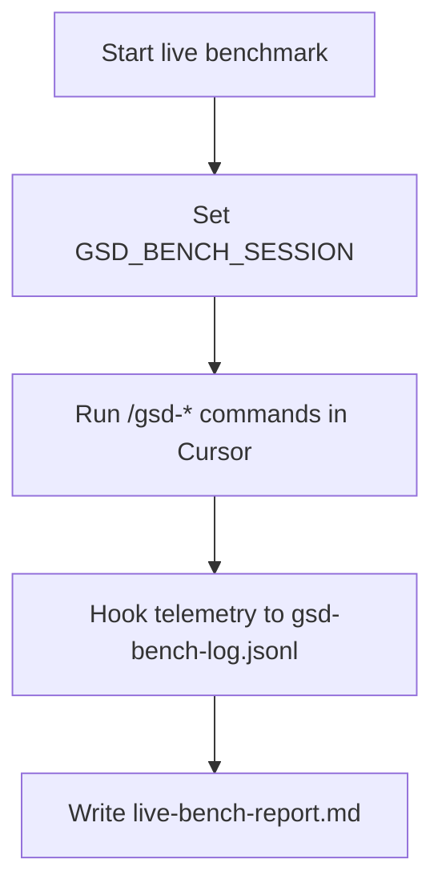
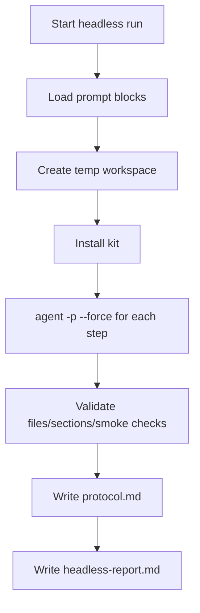
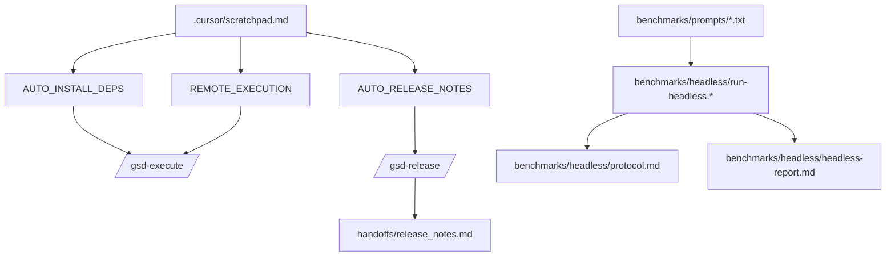
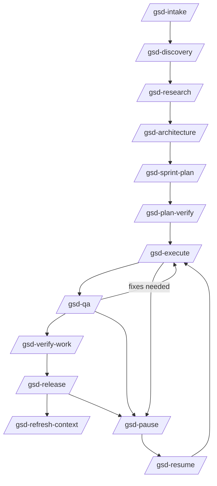
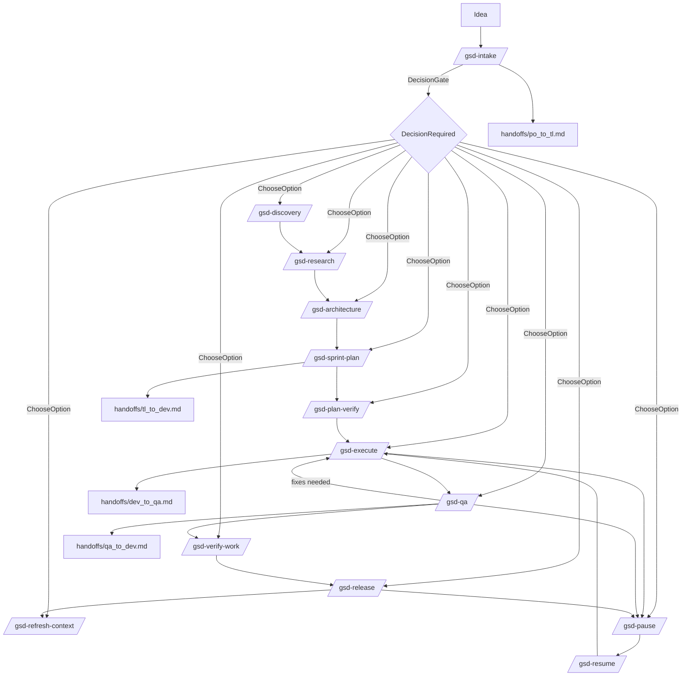

# Cursor-GSD-Team Kit

Drop-in template repo that implements a structured GSD workflow in Cursor:
intake -> discovery -> architecture -> sprint plan -> execute -> QA -> release,
with pause/resume, decision gates, and persistent artifacts.

## Quick start

1. Use `/gsd-intake` to capture the idea and kick off questions.
2. Continue with `/gsd-discovery`, `/gsd-architecture`, `/gsd-sprint-plan`.
3. Execute work with `/gsd-execute`, verify via `/gsd-qa`, finalize via
   `/gsd-release`.
4. Use `/gsd-pause` anytime and `/gsd-resume` to continue from artifacts.
5. Use `/gsd-refresh-context` to compact state and prevent context rot.

## Repository layout (what is what)

### GSD tooling (engine)
- `.cursor/` — commands, rules, agents, hooks, skills, scratchpad config.
- `.github/workflows/` — CI/CD templates driven by `docs/engineering/runbook.md`.
- `gsd-installer.*` — installers for adding this kit to other repos.
- `scripts/` — helper scripts (e.g., release notes generator).

### GSD artifacts (project memory)
- `docs/` — product + engineering docs (vision, architecture, decisions, state).
- `sprints/` — sprint planning, tasks, progress, QA, UAT.
- `handoffs/` — role-to-role handoff notes.
- `decisions/` — decision records (DEC-xxxx).
- `milestones/` — milestone tracking (optional).

### Examples and code
- `examples/` — reference apps created by benchmarks or demos.

### Testing and benchmarks
- `tests/` — test harness for kit verification.
- `benchmarks/` — scenario, live, prompted, and headless benchmark runners.

### Misc
- `Plan.md` — original master plan for the kit.
- `.gitignore` — ignores generated reports, temp folders, and telemetry.

## Voice input (multilingual)

Voice is only an input layer. It produces text that feeds the same workflow:

- Option A: OS dictation (no setup, language support varies by OS)
- Option B: Cursor voice (if available)
- Option C: Local STT (whisper / whisper.cpp style dictation)

Recommended reliability pattern for slash commands:

- Bind a text expander or hotkey to insert `/gsd-intake ` (or any command).
- Dictate only the content after the command.

## CI/CD via runbook

Workflows in `.github/workflows/` read command keys from
`docs/engineering/runbook.md`. If a key is not set (or is a placeholder),
the workflow skips the step and exits successfully.

Supported keys:

- `TEST_COMMAND`
- `LINT_COMMAND`
- `TYPECHECK_COMMAND`
- `DEPLOY_STAGING_COMMAND`
- `DEPLOY_PROD_COMMAND`

## Installer / updater

Use one of the installers below to add this kit to an existing repo or
bootstrap an empty one:

- Windows: `gsd-installer.ps1`
- macOS/Linux: `gsd-installer.sh`
- Python fallback: `gsd-installer.py`

Modes:

- `missing` copies only files that do not exist
- `overwrite` replaces existing files
- `interactive` prompts per file

Backup option:

- Use `--backup` (or choose when prompted) to save existing files into
  `gsd-backups/<timestamp>/` before overwriting.

Examples:

- `powershell -ExecutionPolicy Bypass -File gsd-installer.ps1 --target "C:\path\to\repo" --mode missing`
- `powershell -ExecutionPolicy Bypass -File gsd-installer.ps1 --target "C:\path\to\repo" --mode overwrite --backup`
- `sh gsd-installer.sh --target "/path/to/repo" --mode missing`
- `sh gsd-installer.sh --target "/path/to/repo" --mode overwrite --backup`

## Benchmarks

Use the benchmark harness to compare kit changes over time.

- Windows: `powershell -ExecutionPolicy Bypass -File benchmarks/run-bench.ps1`
- macOS/Linux: `sh benchmarks/run-bench.sh`

Reports are written to `benchmarks/bench-report.md`.

### Benchmark run diagrams

## Live benchmarks

Live benchmarks capture real agent runs in Cursor via hook telemetry.

- Windows: `powershell -ExecutionPolicy Bypass -File benchmarks/live/run-live-bench.ps1`
- macOS/Linux: `sh benchmarks/live/run-live-bench.sh`

Reports are written to `benchmarks/live/live-bench-report.md`.

## Prompted benchmark runs

Use the prompt runner to step through a scenario like a human would by
submitting each `/gsd-*` command in order.

- Windows:
  `powershell -ExecutionPolicy Bypass -File benchmarks/prompts/run-prompts.ps1 -PromptFile benchmarks/prompts/S4_webview_api_app.txt -Clipboard`
- macOS/Linux:
  `sh benchmarks/prompts/run-prompts.sh benchmarks/prompts/S4_webview_api_app.txt --clipboard`

## Fully automated benchmark runs (Headless CLI)

This uses Cursor CLI in non-interactive mode.

- Windows: `powershell -ExecutionPolicy Bypass -File benchmarks/headless/run-headless.ps1 -PromptFile benchmarks/prompts/S4_webview_api_app.txt -ScenarioFile benchmarks/scenarios/S4_webview_api_app.scn`
- macOS/Linux: `sh benchmarks/headless/run-headless.sh benchmarks/prompts/S4_webview_api_app.txt benchmarks/scenarios/S4_webview_api_app.scn`

Dependencies:
- Cursor CLI (`agent`)
- ripgrep (`rg`)

Outputs:
- `benchmarks/headless/headless-report.md`
- `benchmarks/headless/protocol.md` (step prompts + AI response summaries)
Per-run artifacts:
- `benchmarks/runs/headless-<timestamp>/workspace/`
- `benchmarks/runs/headless-<timestamp>/reports/`

## Autonomous dependency installs

To enable fully autonomous dependency and runtime installs, set in
`.cursor/scratchpad.md`:

- `AUTO_INSTALL_DEPS=1`

When enabled, the agent may install required dependencies using the relevant
package manager without asking.

## Remote / Docker execution

To allow the agent to use remote or Docker servers for builds/tests, set:

- `REMOTE_EXECUTION=1` in `.cursor/scratchpad.md`
- Configure servers in `.cursor/remote.json`

This only enables usage; you still control which servers are listed.

## Release notes automation

Enable automatic release notes:

- Set `AUTO_RELEASE_NOTES=1` in `.cursor/scratchpad.md`
- Run the generator (optional manual step):
  - Windows: `powershell -ExecutionPolicy Bypass -File scripts/generate-release-notes.ps1`
  - macOS/Linux: `sh scripts/generate-release-notes.sh`

The generator writes to `handoffs/release_notes.md` and includes:
- Sprint summary
- Last 20 git commit messages (if in a git repo)
- QA findings
- Runbook notes

## Automation modes

Configure in `.cursor/scratchpad.md`:

- `AUTO_FLOW_MODE=auto_until_decision` to run phases until a decision gate.
- `PHASE_MODE=interactive|auto` to control per-phase prompting.
- `PERMISSION_MODE=interactive|auto` to reduce routine permission prompts.

### Scratchpad reference

- `GSD_CONTEXT_STRICT=0|1` — enforce context refresh after code edits.
- `LOOP_UNTIL_GREEN=0|1` — optional test loop when commands are set.
- `RUN_TESTS_ON_EDIT=0|1` — run tests after edits.
- `DONE=0|1` — stop hook loops.
- `GSD_BENCH_SESSION=<id>` — live benchmark session id.
- `AUTO_FLOW_MODE=manual|auto_until_decision`
- `PHASE_MODE=interactive|auto`
- `PERMISSION_MODE=interactive|auto`
- `AUTO_INSTALL_DEPS=0|1`
- `AUTO_RELEASE_NOTES=0|1`
- `REMOTE_EXECUTION=0|1`
- `REMOTE_CONFIG=.cursor/remote.json`

## Recent changes (latest additions)

- Headless CLI benchmark runner with protocol output.
- Headless run validation: required files, sections, and smoke checks.
- Prompted scenario files for code benchmarks.
- Autonomous dependency installs (`AUTO_INSTALL_DEPS=1`).
- Automated release notes (`AUTO_RELEASE_NOTES=1`).
- Optional remote/Docker execution (`REMOTE_EXECUTION=1` + `remote.json`).

## How-to examples

### Example 1: New web app idea

1. Run `/gsd-intake` and describe the idea in one sentence.
2. Answer the PO questions until `docs/product/*` are filled.
3. Run `/gsd-research` to capture risks and patterns.
4. Run `/gsd-architecture` and `/gsd-sprint-plan` to create `sprints/S0001/*`.
5. Run `/gsd-plan-verify` to confirm task coverage.
6. Run `/gsd-execute` to implement tasks and update `state.md`.
7. Run `/gsd-qa` and record findings.
8. Run `/gsd-verify-work` for UAT.
9. Run `/gsd-release` and update `runbook.md`.
10. Run `/gsd-refresh-context` to compact context.

### Example 2: Pause and resume

1. Run `/gsd-pause` to write `handoffs/resume_brief.md`.
2. Later, run `/gsd-resume` to load the context pack.
3. Continue with the appropriate phase.

### Example 3: Map an existing project

1. Run `/gsd-map-codebase` before any planning.
2. Review `docs/engineering/codebase-map.md` and `dependencies.json`.
3. Continue with `/gsd-intake` or `/gsd-architecture`.

### Example 4: Headless benchmark run

1. Install Cursor CLI and `rg` (ripgrep).
2. Run:
   `powershell -ExecutionPolicy Bypass -File benchmarks/headless/run-headless.ps1 -PromptFile benchmarks/prompts/S4_webview_api_app.txt -ScenarioFile benchmarks/scenarios/S4_webview_api_app.scn`
3. Read:
   `benchmarks/headless/headless-report.md` and `benchmarks/headless/protocol.md`.

## Features (full list)

- **Structured GSD workflow** with explicit phases and artifacts.
- **Artifact-first memory**: everything important is persisted in files.
- **Decision gate**: escalation to `decisions/DEC-xxxx.md`.
- **Pause/resume**: checkpoint and resume brief support.
- **Context refresh**: compact `state.md` and decisions.
- **Voice input** supported as an input layer.
- **CI/CD templates** driven by runbook commands.
- **Hooks** for safety and context hygiene.
- **Benchmarks** for repeatable validation and telemetry.
- **Headless CLI** support for automation.
- **Research phase** and plan verification loop.
- **Phase context** files for preferences and constraints.
- **Quick mode** for small tasks.
- **Milestones** for larger multi-phase work.
- **Map codebase** for existing projects.
- **Remote/Docker execution** (optional).

## Commands (what they do)

- `/gsd-intake`: capture idea, ask questions, write vision/backlog/acceptance.
- `/gsd-discovery`: collect design/UX references, update vision/backlog.
- `/gsd-architecture`: define architecture, risks, and decisions.
- `/gsd-sprint-plan`: create sprint + tasks + handoff to dev.
- `/gsd-plan-verify`: verify sprint tasks cover acceptance criteria.
- `/gsd-execute`: implement tasks; update summary/state.
- `/gsd-qa`: test plan + findings + handoff back to dev.
- `/gsd-verify-work`: user acceptance testing (UAT).
- `/gsd-release`: release notes + runbook updates.
- `/gsd-pause`: checkpoint + resume brief.
- `/gsd-resume`: load context pack and continue.
- `/gsd-refresh-context`: compact state + decisions + summary.
- `/gsd-research`: research patterns, risks, and dependencies.
- `/gsd-map-codebase`: map existing repos before changes.
- `/gsd-quick`: short path for small tasks.
- `/gsd-phase-context`: phase-specific preferences and constraints.
- `/gsd-milestone-start`: initialize milestone tracking.
- `/gsd-milestone-complete`: finalize milestone summary.
- `/gsd-auto`: run phases until decision gate.

## Full workflow example (end-to-end)

This example shows when each command is best used and what it produces.

1. **/gsd-intake**  
   Use when you have only an idea.  
   Output: `docs/product/vision.md`, `docs/product/backlog.md`,
   `docs/product/acceptance.md`, `handoffs/po_to_tl.md`.

2. **/gsd-discovery**  
   Use when you need UX references or scope refinements.  
   Output: updates to `vision.md` + `backlog.md`, refreshes `po_to_tl.md`.

3. **/gsd-research**  
   Use when you need patterns, risks, and dependency notes.  
   Output: `docs/engineering/research.md`, `decisions.md`, `state.md`.

4. **/gsd-architecture**  
   Use when you need a concrete technical approach and risk notes.  
   Output: `docs/engineering/architecture.md`, `decisions.md`, `state.md`.

5. **/gsd-sprint-plan**  
   Use when architecture is stable and you want a task list.  
   Output: `sprints/S0001/sprint.md`, `tasks.md`, `progress.md`,
   `handoffs/tl_to_dev.md`.

6. **/gsd-plan-verify**  
   Use to confirm tasks cover acceptance criteria.  
   Output: `sprints/S0001/plan-verify.json`, `state.md`.

7. **/gsd-execute**  
   Use to implement tasks.  
   Output: code changes, `sprints/S0001/summary.md`, `state.md`,
   `handoffs/dev_to_qa.md` (when ready).

8. **/gsd-qa**  
   Use to verify and document findings.  
   Output: `sprints/S0001/qa-findings.md`, `handoffs/qa_to_dev.md`,
   updates to `state.md`.

9. **/gsd-verify-work**  
   Use for user acceptance testing (UAT).  
   Output: `sprints/S0001/uat.json`, `uat.md`, `state.md`.

10. **/gsd-release**  
   Use to prepare release notes and finalize runbook commands.  
   Output: `handoffs/release_notes.md`, updated `runbook.md`, updated `state.md`.

11. **/gsd-refresh-context**  
   Use after major changes to keep context compact.  
   Output: compacted `state.md`, `decisions.md`, updated sprint summary.

12. **/gsd-pause**  
   Use any time you need to stop safely.  
   Output: `handoffs/resume_brief.md`, updated `progress.md` and `state.md`.

13. **/gsd-resume**  
    Use to restart work from artifacts only.  
    Output: updated `state.md` if needed, and a clear next step.

## Full flow diagram

## Rules (what they enforce)

- `gsd-core.mdc`: phase flow, context pack, pause/resume, remote usage.
- `gsd-quality.mdc`: small steps, tests/quality, optional auto-install.
- `gsd-handoffs.mdc`: handoffs + state updates required.
- `gsd-escalation.mdc`: decision gate and stop conditions.

## Hooks (what they do)

- `beforeShellExecution`: block dangerous commands.
- `beforeReadFile`: warn on secret-like files.
- `afterFileEdit`: track code edits vs context refresh.
- `stop`: remind to refresh context when needed.

## Artifacts (single source of truth)

- `docs/product/*`: vision, backlog, acceptance.
- `docs/engineering/*`: architecture, decisions, state, runbook.
- `sprints/Sxxxx/*`: sprint scope, tasks, progress, QA findings, summary.
- `decisions/*`: decision records.
- `handoffs/*`: role-to-role transfer notes.
