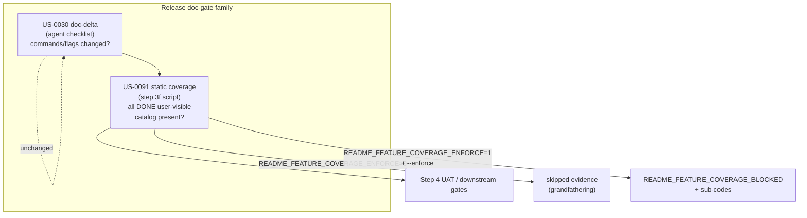

# Architecture archive pack (2026-06-25)

- Rollover trigger: `ARCH_HOT_MAX_LINES=3000, ARCH_HOT_MAX_STORY_SECTIONS=120`
- Source: `docs/engineering/architecture.md`
- Archived units (oldest first, contiguous prefix): 1
- Retained units in hot file: 15
- First archived heading: `# US-0091: README ↔ backlog feature coverage backfill + blocking drift gate`
- Last archived heading: `# US-0091: README ↔ backlog feature coverage backfill + blocking drift gate`
- Verification tuple (mandatory):
  - archived_body_lines=171
  - preamble_lines=10
  - retained_body_lines=2881

---

# US-0091: README ↔ backlog feature coverage backfill + blocking drift gate

## Overview

**Composes on `# US-0077`** (dual-README audience — **`DEC-0059`**) and **extends the
release doc-gate family** alongside **US-0030** (delta-driven command/flag documentation
gate). `US-0030` blocks README/runbook **deltas** when commands/flags change; **US-0091**
blocks **missing initial blurbs** for DONE user-visible work items. Audit, backfill, and
blocking validator ship atomically in one story.

Binding decision: **`DEC-0074`**. Research anchor: **`R-0074`**. Open
`decisions/DEC-0074.md` for normative predicate, reason codes, grandfathering, and
parity inventory.

## Gate composition diagram

**Remediation vocabulary** (runbook subsection):

| Gate | Question answered | Remediation |
|------|-------------------|-------------|
| US-0030 delta | Did this sprint change commands/flags without README/runbook update? | Update README/runbook for changed surfaces |
| US-0091 static | Does every DONE user-visible item have a README blurb + DEV row? | Backfill root + DEV shard; set `user_visible:` marker |

## Minimal architecture

### A. Predicate and backlog marker (DEC-0074 §1–§2)

- Canonical input: backlog block field **`user_visible: true|false`**.
- In-scope: **DONE** + explicit `true` or migration-heuristic pass (H1–H8) when
  `README_FEATURE_COVERAGE_ENFORCE=0`.
- Out-of-scope: explicit `false` or pure-internal surfaces (H5 without H6).
- Ambiguous (H7 on stories) → **`README_FEATURE_COVERAGE_INPUT_INVALID`**.
- When **`README_FEATURE_COVERAGE_ENFORCE=1`**: heuristic disabled; unset → fail closed.

**Heuristic table H1–H8** — verbatim in **`DEC-0074` §2** and **`R-0074`** research
extension.

### B. Three-file coverage target (DEC-0074 §3)

| File | Role |
|------|------|
| Root **`README.md`** | Operator blurbs under existing `USER_*` H2s |
| **`template/README.md`** | Byte parity with root (**US-0017**) |
| **`docs/developer/README.md`** | `DEV_*` traceability rows (id + US/DEC + scratchpad flags) |

Backfill: 1–2 sentence operator blurbs; no new H2 literals. Profile budgets enforced via
`doc_profile_lib` composition.

### C. Section-affinity manifest (DEC-0074 §4)

**`docs/engineering/context/readme-section-affinity.json`** (active + `template/` mirror)
maps work-item tags → `root_h2` + `dev_h2`. Classifier: first matching tag from summary
keywords / slash-command; fallback `slash_command` if H1 else `governance`.

### D. Validator (DEC-0074 §5–§6)

**`scripts/validate_readme_feature_coverage.py`** + **`scripts/readme_feature_coverage_lib.py`**
(stdlib-only).

| Flag | Purpose |
|------|---------|
| `--self-test` | Predicate matrix + schema stability |
| `--report` | Stable JSON (`coverage_total` / `coverage_present` / `coverage_missing`) |
| `--audit-out PATH` | Gap artifact for execute phase |
| `--enforce` | Blocking mode (release step 3f) |

**Reason codes**: umbrella **`README_FEATURE_COVERAGE_BLOCKED`** + sub-codes per AC-5
(gap, parity fail, input invalid, profile violation).

### E. Release wiring — step 3f (DEC-0074 §7)

After **3e** legacy drift, before step **4** UAT in `.cursor/commands/release.md`
(active + `template/`):

- Read merged scratchpad **`README_FEATURE_COVERAGE_ENFORCE`** (default **`0`**).
- When **`0`**: skip with `skipped` evidence (grandfathering).
- When **`1`**: `python scripts/validate_readme_feature_coverage.py --repo . --enforce`.

**Not** wired into `validate-and-push` (wrong lifecycle).

### F. Grandfathering (DEC-0074 §8)

Scratchpad **`README_FEATURE_COVERAGE_ENFORCE=0|1`** (default **`0`** until backfill
completes). Same-sprint flip **0→1** with backfill merge — no retroactive `/release`
block on pre-backfill DONE items.

### G. Template parity inventory (DEC-0074 §9)

Extend **`check_intake_template_parity.py --scope=readme-feature-coverage`**:

| Active | Template |
|--------|----------|
| `scripts/validate_readme_feature_coverage.py` | `template/scripts/...` |
| `scripts/readme_feature_coverage_lib.py` | `template/scripts/...` |
| `docs/engineering/context/readme-section-affinity.json` | `template/docs/engineering/context/...` |
| `.cursor/commands/release.md` (step 3f) | `template/.cursor/commands/release.md` |
| `docs/engineering/runbook.md` (subsection) | `template/docs/engineering/runbook.md` |
| `installer-owned-paths.manifest` (script paths) | `template/.../installer-owned-paths.manifest` |

Compose with **US-0017** README byte guard — do not duplicate parity logic inside validator.

**Harness**: **`§27U`** in `tests/run-tests.ps1` + `tests/run-tests.sh`.

**Active-only**: `# US-0091` (this section), `tests/fixtures/readme_feature_coverage/`,
generated `readme-feature-coverage-audit.json`.

## Risks (architecture-resolved)

| ID | Mitigation |
|----|------------|
| R1 False positives | Explicit markers + H7 fail-closed |
| R2 README bloat | 1–2 sentence blurbs + profile budget check |
| R3 Parity drift | US-0017 + scoped parity script |
| R4 Retroactive lock-in | `README_FEATURE_COVERAGE_ENFORCE=0` until flip |
| R5 US-0071 leakage | Command/flag tokens in root; metadata scanner on changed paths |
| R6 Heuristic ambiguity | enforce=1 disables heuristic |
| R7 Delta vs static confusion | Runbook remediation table above |

## AC traceability

| AC | Architecture anchor |
|----|---------------------|
| AC-1 Predicate | §A + DEC-0074 §1–§2 |
| AC-2 Audit report | §D (`--report` / `--audit-out`) |
| AC-3 Three-file backfill | §B |
| AC-4 Audience boundaries | §B, §C, DEC-0059 |
| AC-5 Validator + reason codes | §D + DEC-0074 §6 |
| AC-6 Release gate | §E (step 3f) |
| AC-7 Idempotent `--report` | §D |
| AC-8 US-0071 hygiene | §B (blurb preference) |
| AC-9 Template parity | §G |
| AC-10 Grandfathering DEC | §F + **`DEC-0074`** |

## Atomic task seeds (for `/sprint-plan`)

| # | Seed | AC | Surfaces |
|---|------|----|----------|
| 1 | Implement `readme_feature_coverage_lib.py` — predicate H1–H8, backlog parser, affinity resolver, README index | AC-1, AC-2 | `scripts/` + `template/scripts/` |
| 2 | Implement `validate_readme_feature_coverage.py` CLI (`--self-test`, `--report`, `--audit-out`, `--enforce`) | AC-5, AC-7 | `scripts/` + `template/scripts/` |
| 3 | Ship `readme-section-affinity.json` manifest | AC-2, AC-4 | `docs/engineering/context/` + `template/` |
| 4 | One-time audit + three-file backfill (root + template + DEV shard) | AC-2, AC-3, AC-4, AC-8 | README family + backlog `user_visible:` markers |
| 5 | Release step **3f** + runbook subsection (delta vs static table) | AC-6 | `.cursor/commands/release.md` + runbook + `template/` |
| 6 | Scratchpad `README_FEATURE_COVERAGE_ENFORCE` + example parity | AC-10 | scratchpad active + template examples |
| 7 | Extend `check_intake_template_parity.py --scope=readme-feature-coverage` | AC-9 | parity script + `template/` |
| 8 | Installer manifest entries for new scripts | AC-9 | `installer-owned-paths.manifest` + `template/` |
| 9 | Fixtures `tests/fixtures/readme_feature_coverage/` + harness **§27U** | AC-5, AC-7, AC-9 | tests active-only |
| 10 | Architecture linkage assert (this section references US-0030, DEC-0059, US-0017, US-0071) | AC-10 | read-only check |

**Task count**: 10 seeds. `SPRINT_MAX_TASKS=12` — no auto-split expected.

## Related

- **`US-0030`** — delta gate (unchanged)
- **`US-0077`** / **`DEC-0059`** — audience profiles
- **`US-0017`** — template drift guard
- **`US-0071`** — user-visible metadata sanitization
- **`R-0074`** — research anchor

