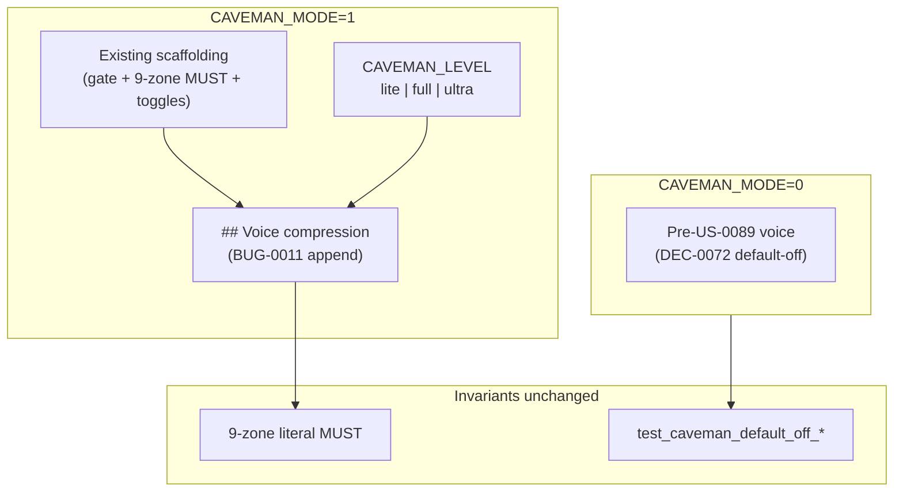

# Architecture archive pack (2026-06-28)

- Rollover trigger: `ARCH_HOT_MAX_LINES=3000, ARCH_HOT_MAX_STORY_SECTIONS=120`
- Source: `docs/engineering/architecture.md`
- Archived units (oldest first, contiguous prefix): 2
- Retained units in hot file: 13
- First archived heading: `# BUG-0011: Caveman voice-compression rules missing from caveman.mdc`
- Last archived heading: `# US-0092: Full-autonomy `/auto` mode + outer driver + self-verification`
- Verification tuple (mandatory):
  - archived_body_lines=375
  - preamble_lines=10
  - retained_body_lines=2781

---

# BUG-0011: Caveman voice-compression rules missing from caveman.mdc

## Overview

**`BUG-0011`** completes **US-0089** response-side Caveman delivery by appending
actionable voice-compression directives to `.cursor/rules/caveman.mdc`. **US-0089** /
**DEC-0072** shipped scaffolding only (gates, 9-zone literal invariant, toggles) —
with **`CAVEMAN_MODE=1`** replies stayed verbose because no rule text instructed
drop-filler, fragment, or level semantics.

Binding decision: **`DEC-0077`** (composes on **`DEC-0072`** — forward-link, no rewrite).
Research anchor: **`R-0077`**. Open `decisions/DEC-0077.md` for normative voice-section
outline, SHA bump policy, contract markers, and runbook extension.

**`# US-0089`** §6 cross-link amended (voice rules delivered here; qualitative brevity
remains operator-verified).

## Voice delivery diagram



## Minimal architecture

### A. Voice section append (DEC-0077 §2)

Append to **`.cursor/rules/caveman.mdc`** + **`template/.cursor/rules/caveman.mdc`**
(byte-identical pair). **Preserve** all pre-voice scaffolding verbatim.

**Locked section heading**:

```text
## Voice compression (when CAVEMAN_MODE=1)
```

**Subsections** (order normative — see **`DEC-0077`** §2 table):

1. `### Precedence` — voice rules override conflicting user-rule prose style when
   `CAVEMAN_MODE=1` (reply voice only).
2. `### Intensity levels` — `lite` / `full` / `ultra` table; kit-native examples.
3. `### Drop rules` — filler/hedging/fragments.
4. `### Auto-Clarity` — security/destructive/ambiguous pause + resume.
5. `### Persistence` — active every response while mode on.
6. `### Ultra and literal regions` — **pointer stub** to existing 9-zone MUST (no duplicate list).

### B. Level semantics (DEC-0077 §3)

| Level | Semantics |
|-------|-----------|
| `lite` | Drop filler; grammatical sentences |
| `full` | Drop articles; fragments OK |
| `ultra` | Abbreviate prose words only; literals byte-exact |

### C. SHA dual-layer + contract markers (DEC-0077 §4–§5)

1. Bump `_CAVEMAN_RULE_BASELINE_SHA256` in `test_caveman_compress_input_rule_byte_identity`
   to post-voice digest (pre-voice: `E10EFC32C628E790E69E2393F381108FE0B1F16E0BCDCFFFC162EFF6F91E47DE`).
2. Add nine `test_caveman_voice_*` subtests (token-presence; see **`DEC-0077`** §5).
3. **Do not modify** `test_caveman_default_off_*` bodies or non-substitution pinned sentence.

### D. Runbook extension (DEC-0077 §7)

Under **`### Caveman mode (US-0089)`** (active + `template/`):

- **`#### Voice compression levels`** — compact 2-row before/after table + pointer to rule file.
- **`### Caveman input compression (US-0090)`** — **untouched**.

### E. Harness §30A (DEC-0077 §6)

| Surface | Requirement |
|---------|-------------|
| `tests/run-tests.ps1` + `.sh` | New **§30A** — `Voice compression rule markers (BUG-0011)` |
| Scope | `pytest -k caveman_voice` (or equivalent prefix filter) |

Existing caveman harness sections: **unchanged**.

### F. Template parity inventory (DEC-0077 §9)

**Positive (byte-identical after voice delivery)**:

1. `.cursor/rules/caveman.mdc` ↔ `template/.cursor/rules/caveman.mdc`
2. `docs/engineering/runbook.md` ↔ `template/docs/engineering/runbook.md` (Caveman subsection only)

**Active-only**: `# BUG-0011`, `test_caveman_voice_*`, §30A, `# US-0089` §6 cross-link.

**No new** `check_intake_template_parity.py` scope.

## Risks (architecture-resolved)

| ID | Mitigation |
|----|------------|
| R1 US-0090 SHA break | Intentional baseline bump (§C) |
| R2 Literal garbling | Unchanged 9-zone MUST + ultra stub (§A.6) |
| R3 User-rule conflict | `### Precedence` (§A.1) |
| R4 Ultra abbreviates reason codes | Forbidden; stub defers to 9-zone (§A.6) |
| R5 Runbook drift | Summary table only; rule normative (§D) |
| R6 Pinned test regression | `test_caveman_default_off_*` bodies frozen (§C.3) |

## AC traceability

| AC | Architecture anchor |
|----|---------------------|
| AC-1 Voice section in `caveman.mdc` | §A, §B + **DEC-0077** §2–§3 |
| AC-2 Template byte parity | §F |
| AC-3 User-rule precedence | §A.1 + **DEC-0077** §2 |
| AC-4 Ultra/literal deferral stub | §A.6 + **DEC-0077** §2 |
| AC-5 `test_caveman_voice_*` + SHA bump | §C + **DEC-0077** §4–§5 |
| AC-6 Runbook voice levels | §D + **DEC-0077** §7 |
| AC-7 Default-off invariants preserved | §C.3 + **DEC-0077** §4 |
| AC-8 Harness §30A + operator UAT | §E + **DEC-0077** §6 |

## Atomic task seeds (for `/sprint-plan`)

| # | Seed | AC | Surfaces |
|---|------|----|----------|
| 1 | Append voice section to `caveman.mdc` per **DEC-0077** §2 outline (active + template byte-identical) | AC-1, AC-2, AC-3, AC-4 | `.cursor/rules/` + `template/.cursor/rules/` |
| 2 | Extend runbook `#### Voice compression levels` (2-row table + rule pointer) | AC-6 | runbook active + `template/` |
| 3 | Add nine `test_caveman_voice_*` subtests in `auto_command_contract_test.py` | AC-5 | tests active-only |
| 4 | Bump `_CAVEMAN_RULE_BASELINE_SHA256` in `test_caveman_compress_input_rule_byte_identity` | AC-5 | tests active-only |
| 5 | Harness **§30A** in `run-tests.ps1` + `.sh` | AC-8 | tests active-only |
| 6 | Regression guard — `test_caveman_default_off_*` bodies unchanged | AC-7 | tests active-only |
| 7 | Sprint UAT operator voice spot-check (`CAVEMAN_MODE=1` visibly shorter prose; literals intact) | AC-8 | UAT docs |
| 8 | Architecture linkage assert (this section + **DEC-0077** + `# US-0089` §6 cross-link) | AC-1 | read-only check |

**Task count**: 8 seeds. `SPRINT_MAX_TASKS=12` — no auto-split expected.

## Related

- **`US-0089`** / **`DEC-0072`** — scaffolding (composes, not rewritten)
- **`US-0090`** / **`DEC-0073`** — input compression (orthogonal)
- **`US-0088`** — non-suppressible gate vocabulary
- **`US-0017`** — template drift guard (`caveman.mdc` parity)
- **`R-0077`** — research anchor

---

# US-0092: Full-autonomy `/auto` mode + outer driver + self-verification

## Overview

**`US-0092`** closes the gap left by **`US-0088`** where continuous `/auto` and backlog drain are **documented** but Cursor often stops after one phase unless the operator manually re-invokes `/auto`. Ships **opt-in** **`AUTO_FLOW_MODE=full_autonomy`** (exact literal, **default-off**) with: (1) a **stdlib outer-driver script**; (2) expanded **`/verify-work`** / **`/qa`** self-verify via build/test/API/browser/health probes; (3) bounded block auto-resolve; (4) drain-without-pause; (5) **`TOKEN_PROFILE`** orthogonality audit.

**Spawn-only** (**`BUG-0006`** / **`US-0069`**) is **unchanged**: outer driver **loops invocations**, never substitutes for phase-role subagents.

Binding decision: **`DEC-0078`**. Research anchor: **`R-0078`**. Composes on **`# US-0088`**, **`DEC-0062`**, **`DEC-0047`**, **`DEC-0048`** — forward-links only; no rewrite of prior decision bodies.

## Assumption challenge and alternatives

| Option | Summary | Verdict |
|--------|---------|---------|
| A | **Shipped stdlib `scripts/auto_outer_driver.py`** — polls **`resume_brief`** + **`state.md`**, re-invokes **`/auto`** until deterministic stop | **Preferred** — satisfies AC-2 “not operator-manual-only”. |
| B | **Documented Cursor hook only** (operator copies `/auto` each turn) | **Rejected as sole delivery** — **US-0088** Option B allowed as equivalence class but **US-0092** requires shipped script. |
| C | **`/loop` command composition** | **Rejected** — in-session cadence, not cross-turn lifecycle with **DEC-0038** / **DEC-0069** boundary refresh. |
| D | **`TOKEN_PROFILE=lean`** as automation proxy | **Rejected** — operator hard constraint; **`TOKEN_PROFILE`** = context breadth / token cost **only** (**DEC-0062**). |

## Scratchpad contract (AC-1)

### `AUTO_FLOW_MODE` enum (architecture-locked)

| Value | Semantics |
|-------|-----------|
| **`manual`** | Default when unset. |
| **`auto_until_decision`** | Unchanged — continuous until **`decision_gate`**. |
| **`full_autonomy`** | Outer-driver loop + relaxable transient stops + drain-without-pause; **default-off**. |

### New keys (architecture-locked)

| Key | Default | Role |
|-----|---------|------|
| **`AUTO_BLOCK_RETRY_MAX`** | **`3`** | Per **`(story_id, stop_reason)`** recoverable retries before **`BLOCK_RETRY_CAP_EXHAUSTED`** (exit **6**). |
| **`AUTO_OUTER_DRIVER_TIMEOUT_SECONDS`** | unset | Optional hook timeout → exit **124**. |

### Interaction matrix (unchanged semantics unless noted)

| Key | Under **`full_autonomy`** |
|-----|---------------------------|
| **`PHASE_MODE`** / **`PERMISSION_MODE`** | Orthogonal — no substitution. |
| **`AUTO_BACKLOG_DRAIN`** / **`AUTO_BUG_QUEUE`** | Compose per **US-0044** / **US-0087** mutex. |
| **`AUTO_LOOP_MAX_CYCLES`** / **`AUTO_BACKLOG_MAX_STORIES`** | Hard caps — unchanged. |
| **`AUTO_IMPLEMENTATION_LOOP`** | When **`1`**, UAT/QA fail triggers inner remediation loop. |
| **`TOKEN_PROFILE`** | **`lean` \| `balanced` \| `full`** — context breadth / token cost **only**; see § TOKEN_PROFILE orthogonality. |
| **`RELEASE_PUBLISH_MODE=auto`** | Explicit opt-in for publish — unchanged default-off. |

## Outer-driver script API (AC-2)

**Path**: **`scripts/auto_outer_driver.py`** (active + **`template/scripts/`**).

**Stdlib-only**: **`argparse`**, **`json`**, **`hashlib`**, **`pathlib`**, **`subprocess`**, **`re`**, **`datetime`**.

**Activation gate**: require merged scratchpad **`AUTO_FLOW_MODE=full_autonomy`** — else exit **2** **`AUTO_FLOW_MODE_NOT_FULL_AUTONOMY`**.

**Argv**:

| Flag | Purpose |
|------|---------|
| **`--repo PATH`** | Repository root (default `.`). |
| **`--max-cycles INT`** | Override **`AUTO_LOOP_MAX_CYCLES`**. |
| **`--max-stories INT`** | Override **`AUTO_BACKLOG_MAX_STORIES`**. |
| **`--dry-run`** | Emit planned invocations only. |
| **`--invoke-cmd TEXT`** | Shell prefix for documented **`/auto`** hook; default prints normative **`/auto …`** line. |

**Loop body**: read **`resume_brief`** → invoke hook → parse **`state.md`** boundary → branch (continue / drain-advance / block-retry / exit).

**Exit codes**:

| Code | Meaning |
|------|---------|
| **0** | **`completed`** |
| **1** | Hard stop — **`decision_gate`**, unrecoverable **`error`**, isolation/strict-proof, security deny |
| **2** | Configuration — mode not **`full_autonomy`** |
| **3** | **`loop_max`** |
| **4** | **`BACKLOG_MAX_STORIES_REACHED`** |
| **5** | **`pause_request`** / **`AUTO_PAUSE_REQUEST`** |
| **6** | **`BLOCK_RETRY_CAP_EXHAUSTED`** |
| **124** | Hook timeout |

**Runbook**: subsection **`### Full-autonomy outer driver (US-0092)`** — enable keys → **`python scripts/auto_outer_driver.py --repo .`** once → interpret exit table.

## Stop matrix (AC-7)

**Invariant**: **`full_autonomy`** relaxes **recoverable transient stops** and **operator re-invocation**, not **governance gates**.

| Condition | **US-0088** | **`full_autonomy` delta** | Operator notify |
|-----------|-------------|---------------------------|-----------------|
| Next phase, no hard stop | Continue inner `/auto` | Outer driver **re-invokes** when Cursor ends turn early | Quiet OK if **`AUTO_QUIET=1`** |
| **`decision_gate`** | Hard stop | **No change — hard** | Always |
| Unrecoverable **`error`** | Hard stop | **No change — hard** | Always |
| Critical **`missing_input`** | Hard stop | **No change — hard** | Always |
| Transient **`missing_input`** (recoverable) | Hard stop | **Relaxable** — bounded block-retry | Notify on cap |
| **`pause_request`** | Hard stop | **No change — hard** | Always |
| **`loop_max`** | Hard stop | **No change — hard** | Always |
| **`blocked`** — transient/sync | Hard stop | **Relaxable** when recoverable | Notify on cap |
| **`blocked`** — isolation/strict-proof/ownership | Hard stop | **No change — hard** | Always |
| UAT/QA fail | Hard stop (operator) | **Relaxable** when **`AUTO_IMPLEMENTATION_LOOP=1`** | Notify on cap |
| Segment complete + **`AUTO_BACKLOG_DRAIN=1`** | Advance (may need manual re-**`/auto`**) | **Drain-without-pause** — immediate next item | Segment handoff notify |
| **`BACKLOG_MAX_STORIES_REACHED`** | Hard stop | **No change — hard** | Always |
| **`AUTO_SCHEDULER_CONFLICT`** | Hard stop | **No change — hard** | Always |
| **`RELEASE_PUBLISH_MODE=auto`** | Explicit opt-in | **No change — hard default-off** | Always on publish |
| Security deny (**.env`**, intake mutation) | Hard deny | **No change — hard** | Always |

## UAT probe contract (AC-3)

**Resolver lib**: **`scripts/uat_probe_lib.py`** (+ **`template/scripts/`**). **`/verify-work`** and **`/qa`** share resolver.

| Probe kind | Resolves when | Evidence |
|------------|---------------|----------|
| **`build`** | Stack profile maps build script | **`uat.json`** `probe_results[]`, **`qa-findings.md`** |
| **`test`** | **`TEST_COMMAND`** or profile default (**DEC-0048**) | Same + stdout/stderr path refs |
| **`api_health`** | URL/health in acceptance or **`runtime-connectivity.md`** | Status code + latency |
| **`process_health`** | Startup command in acceptance (**DEC-0047**) | Retry ledger snippet |
| **`browser_smoke`** | Web stack + optional **`PLAYWRIGHT_*`** / curl fallback | Screenshot/path ref optional |
| **`cli_smoke`** | CLI + expected exit/output in acceptance | Exit code + truncated stdout |
| **`manual_operator`** | Human judgment required | **`UAT_PROBE_UNRESOLVED`** unless operator maps probe |

**Fail-closed reason codes**: **`UAT_PROBE_UNRESOLVED`**, **`UAT_STACK_PROFILE_UNKNOWN`**, **`UAT_PROBE_TIMEOUT`**, **`UAT_PROBE_FAILED`**, **`UAT_PROBE_FORBIDDEN`**, **`UAT_PROBE_PASS`**.

**Stack profile resolution**: **`package.json`**, **`pyproject.toml`**, **`go.mod`**, **`pom.xml`**, **`*.csproj`**, scratchpad **`TEST_COMMAND`**, **`docs/engineering/runtime-connectivity.md`**. Generated-project fast path when **`stack_profile=generated`** (**US-0065** / **US-0066**).

## Block-retry ledger (AC-4)

**Path**: **`handoffs/auto_block_retry/<orchestrator_run_id>.jsonl`** — append-only; names-only; no secrets.

**Record fields**: `attempt_id`, `timestamp`, `orchestrator_run_id`, `story_id`, `stop_reason`, `reason_code`, `remediation_action`, `outcome`, `outer_cycle_index`, `implementation_loop_index`.

**Cap interaction**:

| Cap | Scope |
|-----|-------|
| **`AUTO_LOOP_MAX_CYCLES`** | Outer **`/auto`** invocations (incl. drain advances) |
| **`AUTO_IMPLEMENTATION_LOOP`** | Inner **`execute`↔`qa`↔`verify-work`** when **`1`** |
| **`AUTO_BLOCK_RETRY_MAX`** | Per **`(story_id, stop_reason)`** recoverable retries |
| **`AUTO_BACKLOG_MAX_STORIES`** | Drain breadth — exit **4** |

## Drain-without-pause (AC-5)

Segment completion + drain policy → outer driver schedules next OPEN story/bug **immediately** without operator pause. **`resume_brief`** + **`state.md`** refresh per **DEC-0069** at every boundary.

## TOKEN_PROFILE orthogonality audit (AC-6)

**Hard rule**: **`TOKEN_PROFILE=lean|balanced|full`** affects **context breadth / token cost only** — never automation level, phase depth, drain, outer-driver invocation, or **`AUTO_FLOW_MODE`**.

**Grep scope**: scratchpad comments (active + template + local example), **`auto-orchestration-reference.md`**, **`runbook.md`** (fix “automation breadth” conflict), **`README.md`** family, **`auto.md`** cross-refs.

**Forbidden patterns** (contract negative): `automation breadth`, `lowers default automation`, `TOKEN_PROFILE.*drain`, `TOKEN_PROFILE.*outer`, `TOKEN_PROFILE.*full_autonomy`, `lean.*less automation`, `full.*more automation`.

## Security (AC-10)

No auto-read **`.env`**, no intake evidence mutation, no publish without **`RELEASE_PUBLISH_MODE=auto`**. Ledgers names-only.

## Contract-test expectations (AC-8)

- Positive: **`AUTO_FLOW_MODE=full_autonomy`** literal in scratchpad comment block.
- Positive: **`TOKEN_PROFILE controls context breadth / token cost only`**.
- Positive: drain-advance-without-operator phrases.
- Positive (post-execute): **`scripts/auto_outer_driver.py`** exists + runbook **`Full-autonomy outer driver (US-0092)`**.
- Negative: runbook must not contain **`lowers default automation breadth`** after fix.

## Surfaces (execute phase)

| Path | Change |
|------|--------|
| **`scripts/auto_outer_driver.py`** | New stdlib outer driver |
| **`scripts/uat_probe_lib.py`** | Shared probe resolver |
| Scratchpad + template | **`full_autonomy`** enum + new keys |
| **`.cursor/commands/auto.md`**, **`auto-orchestration-reference.md`** | Stop matrix § **US-0092** |
| **`.cursor/commands/verify-work.md`**, **`qa.md`** | Self-verify excerpt |
| **`docs/engineering/runbook.md`** | Outer-driver recipe + orthography fix |
| **`tests/auto_command_contract_test.py`** | Markers per AC-8 |
| **`template/`** | Parity for all touched surfaces (**US-0017**) |

## Risks

| Risk | Mitigation |
|------|------------|
| Infinite driver loop | **`AUTO_LOOP_MAX_CYCLES`** + exit codes |
| Self-verify false PASS | Fail closed **`UAT_PROBE_UNRESOLVED`** |
| TOKEN_PROFILE doc drift | AC-6 grep + contract tests |
| Security (secrets/publish) | Hard deny-list + **`RELEASE_PUBLISH_MODE`** default |
| Partial delivery (flags without driver) | Single-story vertical contract |

## AC traceability

| AC | Architecture anchor |
|----|---------------------|
| AC-1 Scratchpad flow mode | § Scratchpad contract |
| AC-2 Outer-driver script | § Outer-driver script API |
| AC-3 Self-verify | § UAT probe contract |
| AC-4 Block auto-resolve | § Block-retry ledger |
| AC-5 Drain-without-pause | § Drain-without-pause |
| AC-6 TOKEN_PROFILE audit | § TOKEN_PROFILE orthogonality audit |
| AC-7 Stop matrix docs | § Stop matrix |
| AC-8 Contract tests | § Contract-test expectations |
| AC-9 Template parity | § Surfaces |
| AC-10 Security | § Security |

## Atomic task seeds (for `/sprint-plan`)

| # | Seed | AC | Surfaces |
|---|------|----|----------|
| 1 | Scratchpad **`AUTO_FLOW_MODE`** enum + **`AUTO_BLOCK_RETRY_MAX`** / **`AUTO_OUTER_DRIVER_TIMEOUT_SECONDS`** (active + template + local example) | AC-1 | scratchpad family |
| 2 | Implement **`scripts/auto_outer_driver.py`** (stdlib, argv/exit codes, activation gate) | AC-2 | `scripts/` + `template/scripts/` |
| 3 | Implement **`scripts/uat_probe_lib.py`** + wire **`/verify-work`** / **`/qa`** command excerpts | AC-3 | scripts + commands + template |
| 4 | Block-retry ledger writer + cap interaction in driver/orchestrator docs | AC-4 | `handoffs/auto_block_retry/`, auto docs |
| 5 | Drain-without-pause branch in outer driver + **DEC-0069** boundary refresh | AC-5 | driver + resume_brief pairing |
| 6 | TOKEN_PROFILE orthography audit + grep fixes (runbook conflict, README family) | AC-6 | docs + scratchpad comments |
| 7 | Stop matrix in **`auto.md`**, **`auto-orchestration-reference.md`** | AC-7 | commands + reference + template |
| 8 | Contract tests in **`auto_command_contract_test.py`** | AC-8 | tests active-only |
| 9 | Template parity + installer manifest entries | AC-9 | template + parity script |
| 10 | Runbook **`### Full-autonomy outer driver (US-0092)`** + security deny-list callout | AC-2, AC-10 | runbook + template |

**Task count**: 10 seeds. `SPRINT_MAX_TASKS=12` — no auto-split expected.

## Decision linkage

- Research: **`R-0078`**
- Decision: **`DEC-0078`**
- Related: **`US-0088`**, **`US-0044`**, **`US-0065`**, **`US-0066`**, **`US-0080`**, **`US-0087`**, **`DEC-0062`**, **`DEC-0047`**, **`DEC-0048`**, **`DEC-0069`**, **`DEC-0038`**, **`US-0048`**, **`US-0056`**

