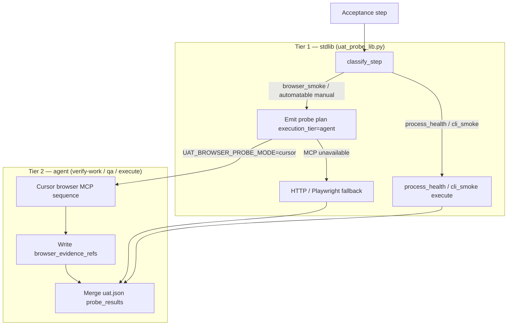

# Architecture archive pack (2026-06-28)

- Rollover trigger: `ARCH_HOT_MAX_LINES=3000, ARCH_HOT_MAX_STORY_SECTIONS=120`
- Source: `docs/engineering/architecture.md`
- Archived units (oldest first, contiguous prefix): 1
- Retained units in hot file: 13
- First archived heading: `# US-0093: Cursor browser-integrated UAT self-test`
- Last archived heading: `# US-0093: Cursor browser-integrated UAT self-test`
- Verification tuple (mandatory):
  - archived_body_lines=200
  - preamble_lines=10
  - retained_body_lines=2912

---

# US-0093: Cursor browser-integrated UAT self-test

## Overview

**`US-0093`** closes the execution gap left by **`US-0092`** / **`DEC-0078`**: **`scripts/uat_probe_lib.py`** classifies **`browser_smoke`**, **`process_health`**, and **`cli_smoke`** steps but returns **`UAT_PROBE_UNRESOLVED`** at execution; **`manual_operator`** UI/workflow steps are never auto-run. Ships a **two-tier contract** so **`/verify-work`**, **`/qa`**, and **`/execute`** drive **Cursor built-in browser MCP** as the **primary** web self-test path, with deterministic HTTP / Playwright subprocess fallbacks when MCP is unavailable.

**Spawn-only** (**`BUG-0006`** / **`US-0048`**) is **unchanged**: stdlib lib **never** invokes browser MCP; phase subagents own Tier 2 execution.

Binding decision: **`DEC-0079`**. Research anchor: **`R-0079`**. Composes on **`# US-0092`** / **`DEC-0078`**, **`US-0065`**, **`US-0066`** — forward-links only; security deny-list and fail-closed vocabulary **not weakened**.

## Assumption challenge and alternatives

| Option | Summary | Verdict |
|--------|---------|---------|
| A | **Two-tier**: stdlib classify + subprocess; agent owns Cursor browser MCP | **Preferred** — satisfies operator intake + **BUG-0006**. |
| B | **Stdlib Playwright as primary** | **Rejected** — operator locks Cursor browser (**R-0041**). |
| C | **Lib calls browser MCP directly** | **Rejected** — violates spawn-only. |
| D | **Silent PASS when MCP unavailable** | **Rejected** — fail closed **`UAT_BROWSER_UNAVAILABLE`**. |
| E | **LLM command inference for `cli_smoke`** | **Rejected** — deterministic regex parse only. |

## Two-tier execution diagram

## Scratchpad contract (AC-1)

| Key | Values | Default | Role |
|-----|--------|---------|------|
| **`UAT_BROWSER_PROBE_MODE`** | **`cursor`** \| **`http_fallback`** \| **`playwright_fallback`** | **`cursor`** | Primary probe path |
| **`UAT_BROWSER_FALLBACK_CHAIN`** | **`0`** \| **`1`** | **`1`** (CI + default) | HTTP → Playwright after MCP unavailable |
| **`UAT_PROCESS_HEALTH_POLL_SECONDS`** | int | **`60`** | Readiness poll cap |
| **`UAT_PROCESS_HEALTH_POLL_INTERVAL_SECONDS`** | int | **`2`** | Poll interval |
| **`DEV_SERVER_PORT`** | int | unset | Port inference override |
| **`DEV_SERVER_COMMAND`** | command | unset | Startup command override |

**Orthogonal**: **`PERMISSION_MODE`**, Cursor browser approval modes, **`runtime-connectivity.md`** health URLs.

## Agent-browser MCP sequence (AC-2)

Normative subsection **`### Browser UAT self-test (US-0093)`** in **`verify-work.md`**, **`qa.md`**, **`execute.md`** (active + **`template/`**):

1. Resolve URL from **`runtime-connectivity.md`** or dev-server signals.
2. **`browser_navigate`** — respect origin allowlist.
3. Map automatable verbs → **`browser_click`** / **`browser_type`** / **`browser_scroll`** — no credential fill.
4. **`browser_screenshot`** → **`sprints/Sxxxx/evidence/browser/<probe_id>-<seq>.png`** (max **5**).
5. Console + network summary path refs (no inline secrets).
6. Verdict + **`browser_evidence_refs`** — PASS requires refs in **`cursor`** mode.
7. MCP unavailable → **`UAT_BROWSER_UNAVAILABLE`** + fallback chain (§ Fallback).

**Write-back**: in-place **`uat.json`** update; optional **`uat_probe_lib.py --merge-result <fragment.json>`** validates evidence-required-on-PASS.

## `manual_operator` verb routing (AC-3)

**Precedence: judgment deny signals win** over automatable UI signals.

| Signal | Tokens | Route |
|--------|--------|-------|
| Judgment-only | `visually`, `aesthetically`, `operator confirms`, `subjective`, `human judgment`, `eyeball`, `approve layout` | **`manual_operator`** → unresolved |
| Forbidden | `.env`, `password`, `credential`, `api key`, `intake_evidence` | **`UAT_PROBE_FORBIDDEN`** |
| Automatable UI | `click`, `fill`, `navigate`, `smoke`, `form`, `submit`, `button`, `page load`, `scroll`, `ui`, `browser` | Reclass → **`browser_smoke`** |
| Generic manual | `manual`, `operator`, `human`, `judgment` (no UI verbs) | **`manual_operator`** → unresolved |

## Fallback selection (AC-2, AC-6)

| Mode | Primary | Chain |
|------|---------|-------|
| **`cursor`** | Agent MCP | HTTP → Playwright when **`UAT_BROWSER_FALLBACK_CHAIN=1`** |
| **`http_fallback`** | Stdlib GET | Fail **`UAT_BROWSER_PROBE_FAILED`** |
| **`playwright_fallback`** | Playwright subprocess | HTTP if missing → **`UAT_BROWSER_UNAVAILABLE`** |

**MCP-unavailable**: **`CI=true`**, **`GITHUB_ACTIONS=true`**, missing browser MCP in tool inventory, or origin allowlist block → record **`UAT_BROWSER_UNAVAILABLE`**, enter fallback.

## Stub completion (AC-4)

**`process_health`**: extract startup command (backtick, quoted, regex, **`package.json`**, **`DEV_SERVER_COMMAND`**); poll health URL until 2xx or cap; verdict **`UAT_PROBE_PASS`** \| **`UAT_PROBE_TIMEOUT`** \| **`UAT_PROBE_FAILED`**.

**`cli_smoke`**: backtick command + exit-code assertion; optional stdout substring match; no LLM inference.

## Evidence schema (AC-5)

**Layout**: **`sprints/Sxxxx/evidence/browser/`**.

**`browser_evidence_refs`** fields: **`navigation_url`**, **`screenshots[]`** (max 5), **`console_summary`**, **`network_summary`** — paths/counts only, no secrets.

**`qa-findings.md`**: mirror under **Runtime browser evidence** (**US-0065** AC-6).

Full JSON shape — **`DEC-0079`** §7 and **`R-0079`** Q5.

## Reason codes (AC-6)

New codes (extend **DEC-0078** family):

| Code | When |
|------|------|
| **`UAT_BROWSER_UNAVAILABLE`** | MCP unavailable; fallback not run |
| **`UAT_BROWSER_PROBE_FAILED`** | Browser/fallback assertion or missing evidence |
| **`UAT_BROWSER_PROBE_TIMEOUT`** | Bounded timeout exceeded |

Existing codes unchanged. Extend **`--self-test`**.

## Security (AC-7)

No **`.env`** auto-read, no credential auto-fill, no intake evidence mutation. **`UAT_PROBE_FORBIDDEN`** unchanged. **DEC-0078** deny-list **not weakened**.

## Operator docs (AC-8)

Runbook + **`auto-orchestration-reference.md`**: enable keys, dev-server detection, evidence paths, CI **`http_fallback`** recipe, **`@browser`** manual override.

## Contract-test expectations (AC-9)

- Positive: **`UAT_BROWSER_PROBE_MODE`** in scratchpad comment block.
- Positive: **`browser_evidence_refs`** in verify-work + qa excerpts.
- Positive: **`UAT_BROWSER_UNAVAILABLE`**, **`UAT_BROWSER_PROBE_FAILED`**, **`UAT_BROWSER_PROBE_TIMEOUT`** in lib + docs.
- Negative: docs must **not** imply stdlib alone PASSes **`browser_smoke`** in **`cursor`** mode without evidence refs.
- Harness: **`pytest -k us0093`**; optional **§32** in run-tests scripts.

## Template parity (AC-10)

**`check_intake_template_parity.py --scope=us-0093`** — 8-row inventory per **`DEC-0079`** §11. Compose **US-0017** — no duplicate parity logic.

## Surfaces (execute phase)

| Path | Change |
|------|--------|
| **`scripts/uat_probe_lib.py`** | Verb routing, stub completion, mode keys, reason codes, **`--merge-result`** |
| **`.cursor/commands/verify-work.md`**, **`qa.md`**, **`execute.md`** | Browser UAT subsection |
| Scratchpad + template | Mode keys + poll defaults |
| **`docs/engineering/runbook.md`**, **`auto-orchestration-reference.md`** | Operator recipe |
| **`tests/auto_command_contract_test.py`** | **`test_us0093_*`** markers |
| **`template/`** | Parity for all touched surfaces |

## Risks

| Risk | Mitigation |
|------|------------|
| False PASS without agent evidence | Evidence-required-on-PASS + **`--merge-result`** validation |
| Over-automation of judgment steps | Verb routing table; judgment tokens win |
| MCP unavailable in CI | **`http_fallback`** mode + **`UAT_BROWSER_UNAVAILABLE`** |
| Secret exposure via browser forms | **`UAT_PROBE_FORBIDDEN`** + no credential fill |
| Partial stub delivery | Single-story vertical contract |

## AC traceability

| AC | Architecture anchor |
|----|---------------------|
| AC-1 Scratchpad mode key | § Scratchpad contract |
| AC-2 `browser_smoke` executes | § Two-tier diagram, § Agent-browser MCP sequence |
| AC-3 Automatable manual routing | § `manual_operator` verb routing |
| AC-4 Stub completion | § Stub completion |
| AC-5 Evidence contract | § Evidence schema |
| AC-6 Reason codes | § Reason codes |
| AC-7 Security | § Security |
| AC-8 Runbook + reference | § Operator docs |
| AC-9 Contract tests | § Contract-test expectations |
| AC-10 Template parity | § Template parity |

## Atomic task seeds (for `/sprint-plan`)

| # | Seed | AC | Surfaces |
|---|------|----|----------|
| 1 | Scratchpad **`UAT_BROWSER_PROBE_MODE`** + poll/fallback keys (active + template + local example) | AC-1 | scratchpad family |
| 2 | Extend **`uat_probe_lib.py`**: mode resolution, **`execution_tier`**, verb routing, **`--merge-result`** | AC-2, AC-3 | `scripts/` + template |
| 3 | Agent-browser MCP sequence in **`verify-work.md`**, **`qa.md`**, **`execute.md`** | AC-2 | commands + template |
| 4 | Complete **`process_health`** + **`cli_smoke`** execution branches | AC-4 | `uat_probe_lib.py` |
| 5 | Evidence schema + **`browser_evidence_refs`** + **`qa-findings.md`** mirror | AC-5 | uat.json contract + docs |
| 6 | New reason codes **`UAT_BROWSER_*`** + **`--self-test`** fixtures | AC-6 | lib + commands |
| 7 | HTTP / Playwright fallback chain + MCP-unavailable heuristic | AC-2, AC-6 | lib + runbook |
| 8 | Runbook + **`auto-orchestration-reference.md`** operator recipe | AC-8 | docs + template |
| 9 | Contract tests **`test_us0093_*`** + optional harness **§32** | AC-9 | tests |
| 10 | Template parity **`--scope=us-0093`** + security deny-list assert | AC-7, AC-10 | parity script + template |

**Task count**: 10 seeds. `SPRINT_MAX_TASKS=12` — no auto-split expected.

## Decision linkage

- Research: **`R-0079`**
- Decision: **`DEC-0079`**
- Related: **`US-0092`**, **`US-0065`**, **`US-0066`**, **`US-0088`**, **`DEC-0078`**, **`R-0041`**, **`US-0048`**, **`BUG-0006`**

