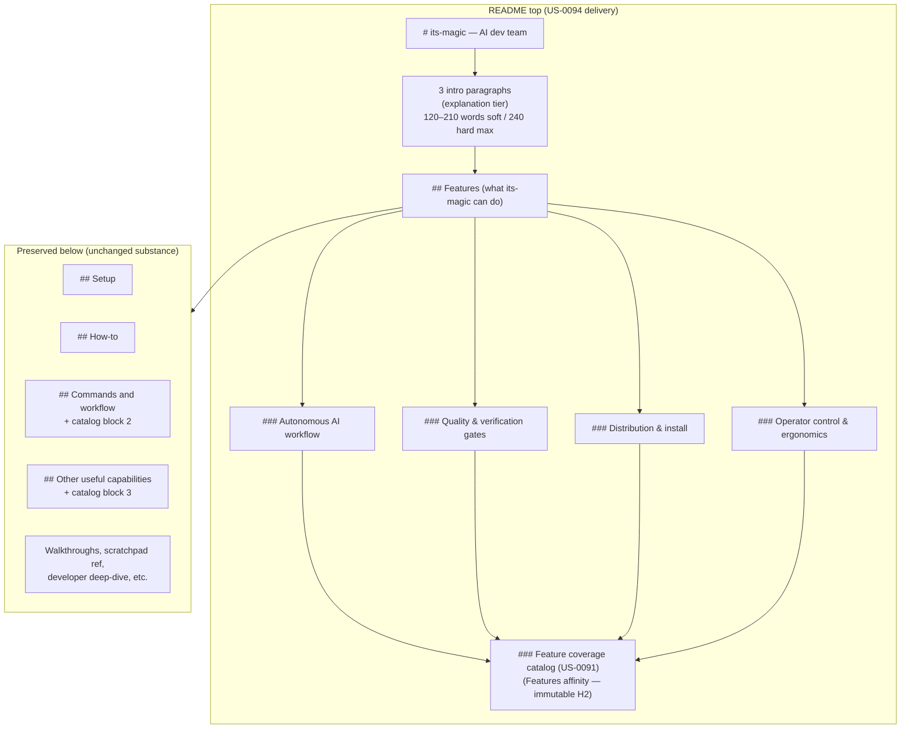
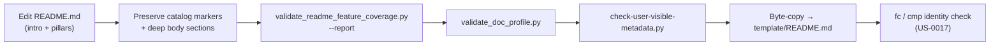

# Architecture archive pack (2026-06-28)

- Rollover trigger: `ARCH_HOT_MAX_LINES=3000, ARCH_HOT_MAX_STORY_SECTIONS=120`
- Source: `docs/engineering/architecture.md`
- Archived units (oldest first, contiguous prefix): 1
- Retained units in hot file: 13
- First archived heading: `# US-0094: README visionary intro + tiered feature hierarchy`
- Last archived heading: `# US-0094: README visionary intro + tiered feature hierarchy`
- Verification tuple (mandatory):
  - archived_body_lines=204
  - preamble_lines=10
  - retained_body_lines=2984

---

# US-0094: README visionary intro + tiered feature hierarchy

## Overview

**Composes on `# US-0091`** (static feature-coverage gate — **`DEC-0074`**), **`# US-0077`**
(dual-README audience — **`DEC-0059`**), **`# US-0017`** (root/template byte parity), and
**`# US-0092`** (full-autonomy messaging — **`DEC-0078`**). Delivery is **documentation-only**:
rewrite the README opening (intro + four pillar teasers) without relocating catalog anchors or
inventing new `USER_*` H2 literals.

**No companion `DEC-xxxx` required** — narrative information architecture is locked by discovery,
vision, backlog, and **`R-0080`** Q1–Q4. **`DEC-0074`** is **not amended** (coverage validator
remains orthogonal to intro/pillar semantics per **`R-0080`** Q3).

Research anchor: **`R-0080`**.

## Information architecture diagram

**Edit surfaces**: root **`README.md`** only during authoring; **`template/README.md`** receives
byte-copy after edit (**US-0017**). **`docs/developer/README.md`** body unchanged (**AC-10**).

## Intro contract (pre-`## Features`)

| Constraint | Soft target | Hard max (execute MUST NOT exceed) |
|------------|-------------|-------------------------------------|
| Paragraph count | 3 (discovery lock) | 3 |
| Words per paragraph | 40–70 | 80 |
| Total intro words | 120–210 | 240 |
| Lines per paragraph (≤90 cols wrap) | 2–3 | 4 |
| Total intro lines (non-blank) | 8–10 | 12 |
| Optional DEV cross-link | ≤25 words in ¶2 or ¶3 | 1 sentence only |

**Paragraph semantics** (discovery lock — replace generic tagline at lines 5–9):

1. Operator as **dreamer/customer** + role-based AI team (PO, Tech Lead, Dev, QA, Release, Curator).
2. **Artifact-first** phased workflow `/intake`→`/release` + pause/resume/decision gates.
3. Opt-in **`AUTO_FLOW_MODE=full_autonomy`** + outer driver + `/auto` backlog drain (**US-0092**,
   **default-off** pairing mandatory per **DEC-0078**).

**Calibration**: discovery draft = **129 words** / 3 paragraphs — within soft target; execute may
vary ±10% word count but MUST stay within hard max.

**Validation**: manual AC-1 review + `validate_doc_profile.py` (H2 only) +
`check-user-visible-metadata.py`. No new scripted intro-length gate (**R-0080** Q2).

## Pillar contract (`###` under `## Features` only)

Four pillars — **exact titles** (discovery lock):

| Pillar | Teaser scope (3–6 id-free bullets each) |
|--------|-------------------------------------------|
| **Autonomous AI workflow** | `/intake`→`/release` lifecycle, `/auto`, pause/resume, decision gates, team mode, backlog/bug drain, **`AUTO_FLOW_MODE=full_autonomy`** + outer driver |
| **Quality & verification gates** | 3-layer quality chain, `/qa` / `/verify-work` / `/uat`, release gates, plan-verify, metadata guard, browser UAT |
| **Distribution & install** | npm / npx / Chocolatey / Homebrew, `its-magic --target` modes, lifecycle QA matrix, multi-target publish |
| **Operator control & ergonomics** | scratchpad flags, guided intake packs, Caveman voice/compression, **`TOKEN_PROFILE`** cost profiles, voice input, permissions |

**Pillar bullet rules**:

1. **Id-free teasers** — cite commands/flags/outcomes by name; MUST NOT copy catalog
   `US-xxxx`/`BUG-xxxx` lines.
2. **Optional one-line cross-link** per pillar — plain-language pointer to the catalog block in
   its parent H2 (navigation only; no anchor moves).
3. **No new `##` H2 literals** — pillars are **`###` H3** only (**DEC-0059** H2 budget unchanged).

**Full-autonomy placement** (AC-8): intro ¶3 (primary) + **P1** pillar bullet (secondary) +
existing **`US-0092`** catalog line in Commands affinity (tertiary); not appendix-only.

## Catalog immutability (DEC-0074 §4 composed — no amendment)

Three **`### Feature coverage catalog (US-0091)`** blocks remain in **affinity-home parent H2s**.
Cross-H2 catalog moves are **forbidden**. Reorder within block is OK.

| Catalog block marker | Parent H2 (structural home — immutable) | ~items | Pillar cross-link |
|---------------------|----------------------------------------|--------|-------------------|
| `<!-- readme-feature-coverage-catalog -->` (~line 27) | **`Features (what its-magic can do)`** | 20 | **P3** primary; **P2** (`/acceptance`) |
| same marker (~line 1139) | **`Commands and workflow`** | ~60 | **P1** + **P2** |
| same marker (~line 1339) | **`Other useful capabilities`** | ~24 | **P4** primary |

**Pillar-to-catalog thematic map** (teaser cross-links only — normative table in **`R-0080`** Q1):

| Pillar | Primary catalog parent H2 | Representative IDs (stay in home H2) |
|--------|---------------------------|----------------------------------------|
| **P1 Autonomous AI workflow** | Commands and workflow | `US-0092`, `US-0088`, `US-0044`, `US-0087`, `BUG-0006` |
| **P2 Quality & verification gates** | Commands + Features (`/acceptance`) | `US-0091`, `US-0093`, `US-0071`, `US-0030`, `US-0065` |
| **P3 Distribution & install** | Features (primary) + Commands scatter | `US-0009`, `US-0008`, `US-0016`, `BUG-0001`, `BUG-0009` |
| **P4 Operator control & ergonomics** | Other useful capabilities | `US-0089`, `US-0090`, `US-0080`, `US-0013`, `US-0073` |

Structural affinity resolver: **`docs/engineering/context/readme-section-affinity.json`**.

## Diataxis tier map

| Diataxis mode | README region | US-0094 action | Boundary example |
|---------------|---------------|----------------|------------------|
| **Explanation** | 3 intro paragraphs before `## Features` | **NEW** — visionary promise | **In**: “artifact-first memory lives in repo files.” **Out**: install command tables |
| **Summary** | Four `###` pillars under `## Features` | **NEW** — 3–6 teaser bullets each | **In**: “Run `/auto` to drain backlog (opt-in full autonomy).” **Out**: full `/auto` flag matrix |
| **Reference** | Three catalog blocks | **PRESERVED** — 104-item id index | **In**: `- \`/auto\` — … (\`US-0092\`).` **Out**: duplicating in pillar bullets |
| **How-to** | `## Setup`, `## How-to` | **PRESERVED** | **In**: `its-magic --target . --mode missing`. **Out**: upgrade steps in P3 pillar |
| **Tutorial** | `## Walkthrough examples` | **PRESERVED** | **In**: numbered phase walkthrough. **Out**: walkthrough steps in intro |

**Anti-patterns (execute guards)**:

- Pillar tier must not become a second catalog (encyclopedic `US-xxxx` lists).
- Intro must not include install/CI procedure steps.
- Full-autonomy value prop must not live only in developer deep-dive (**AC-8**).

## Execute workflow

**Baseline** (pre-edit): `coverage_missing=[]`, `coverage_total=104`; root === template (byte-identical).

**Post-edit gates** (all MUST pass before commit):

1. `python scripts/validate_readme_feature_coverage.py --repo . --report` → `coverage_missing=[]`
2. `python scripts/validate_doc_profile.py` → PASS for active profile cell
3. `python scripts/check-user-visible-metadata.py` → PASS on changed README paths
4. Root **`README.md`** === **`template/README.md`** (byte-identical)

**No new scripts, parity scopes, or release-gate wiring** — US-0094 is narrative IA atop existing
**DEC-0074** / **DEC-0059** validators.

## Risks

| Risk | Mitigation |
|------|------------|
| **R1** Pillar/catalog duplication | Id-free teaser bullets only; catalog remains authoritative index |
| **R2** Affinity break on catalog relocation | Cross-H2 moves forbidden; post-edit `--report` gate |
| **R3** Intro bloat vs budgets | 3-paragraph / 240-word hard max; no 4th paragraph or intro bullet list |
| **R4** Active/template drift | Single-source edit + byte-copy + identity check before commit |
| **R5** Autonomy overclaim | Default-off / opt-in pairing in intro ¶3 + **DEC-0078** compliance |
| **R6** Silent deletion of operator detail | AC-3 manual review; deep sections preserved below new tiers |

## AC traceability

| AC | Architecture anchor |
|----|---------------------|
| AC-1 Framework purpose lead | § Intro contract |
| AC-2 Tiered hierarchy | § Pillar contract |
| AC-3 Detail preservation | § Information architecture diagram (preserved subtree) |
| AC-4 Coverage re-audit | § Execute workflow (gate 1) |
| AC-5 Root/template parity | § Execute workflow (gates 4) |
| AC-6 Audience profile | § Pillar contract (no new H2); § Execute workflow (gate 2) |
| AC-7 Metadata hygiene | § Execute workflow (gate 3) |
| AC-8 Full-autonomy messaging | § Intro contract ¶3; § Pillar contract (P1 placement) |
| AC-9 Regression guards | § Execute workflow; existing US-0017 / coverage contract tests |
| AC-10 DEV shard unchanged | § Overview (edit surfaces) |

## Atomic task seeds (for `/sprint-plan`)

| # | Seed | AC | Surfaces |
|---|------|----|----------|
| 1 | Replace pre-`## Features` intro (3 ¶ discovery copy within word budget) | AC-1 | `README.md` |
| 2 | Insert 4 pillar `###` sections with id-free teaser bullets under `## Features` | AC-2 | `README.md` |
| 3 | Verify deep body sections preserved (Setup, How-to, Commands, walkthroughs, etc.) | AC-3 | `README.md` |
| 4 | Post-edit `validate_readme_feature_coverage.py --report` → zero gaps | AC-4 | `scripts/` (read-only gate) |
| 5 | Byte-copy `README.md` → `template/README.md` + identity check | AC-5 | root + `template/` |
| 6 | `validate_doc_profile.py` pass (H2 budget unchanged) | AC-6 | `scripts/` (read-only gate) |
| 7 | `check-user-visible-metadata.py` pass on changed README paths | AC-7 | `scripts/` (read-only gate) |
| 8 | Full-autonomy placement audit (intro ¶3 + P1 + catalog tertiary) | AC-8 | `README.md` |
| 9 | Regression guards — US-0017 / readme-feature-coverage contract tests green | AC-9 | `tests/` (read-only gate) |
| 10 | DEV shard body unchanged; optional ≤1-sentence cross-link in intro only | AC-10 | `docs/developer/README.md` (read-only) |

**Task count**: 10 seeds. `SPRINT_MAX_TASKS=12` — no auto-split expected.

## Decision linkage

- Research: **`R-0080`**
- **No new DEC** — discovery locks + this section suffice (**R-0080** Q3); **`DEC-0074`** not amended
- Composed: **`DEC-0074`** (catalog immutability), **`DEC-0059`** (H2 vocabulary), **`US-0017`** (parity),
  **`DEC-0078`** (full-autonomy default-off), **`R-0054`** (Diataxis tiers)
- Related: **`US-0091`**, **`US-0077`**, **`US-0092`**, **`US-0071`**, **`US-0030`**

