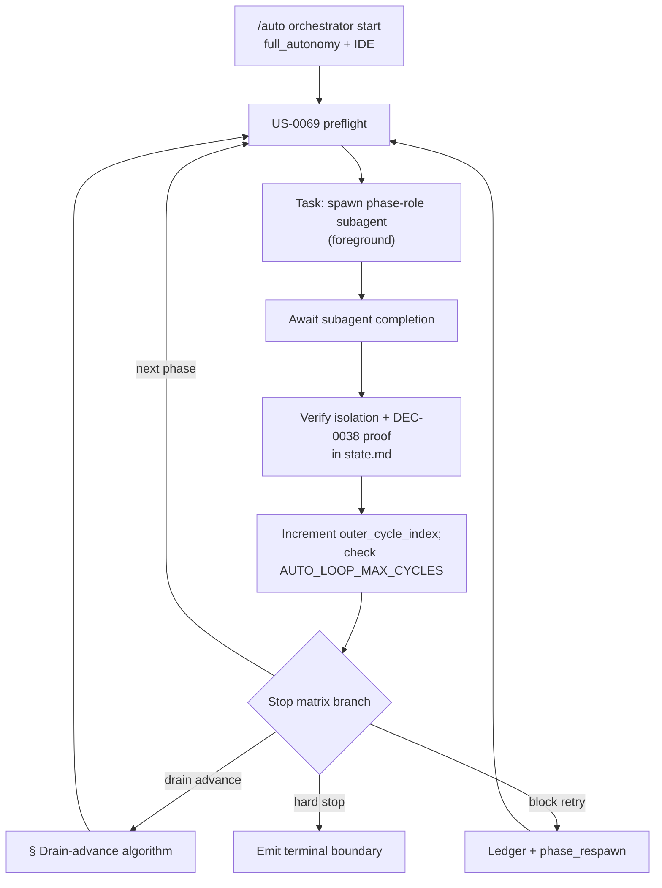
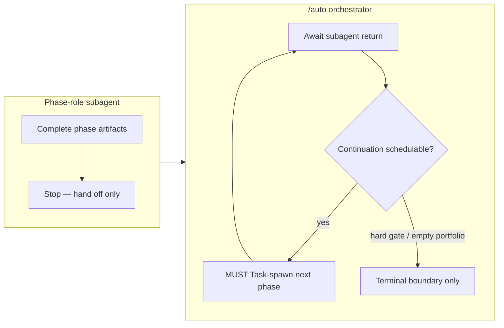

# Architecture archive pack (2026-06-28)

- Rollover trigger: `ARCH_HOT_MAX_LINES=3000, ARCH_HOT_MAX_STORY_SECTIONS=120`
- Source: `docs/engineering/architecture.md`
- Archived units (oldest first, contiguous prefix): 2
- Retained units in hot file: 12
- First archived heading: `# US-0095: Native in-Cursor `/auto` auto-chaining (no outer driver required)`
- Last archived heading: `# BUG-0012: Native-chain orchestrator compliance regression (post-US-0095)`
- Verification tuple (mandatory):
  - archived_body_lines=397
  - preamble_lines=10
  - retained_body_lines=2854

---

# US-0095: Native in-Cursor `/auto` auto-chaining (no outer driver required)

## Overview

**`US-0095`** closes the operator-experience gap left by **`US-0092`** / **`DEC-0078`**: operators enabling **`AUTO_FLOW_MODE=full_autonomy`** + backlog drain in Cursor IDE still hit **`stop_reason=completed (segment exhausted)`** after one orchestrator turn and are told to re-run `/auto` or **`python scripts/auto_outer_driver.py`**. Ships a **Cursor-native auto-chain** so one `/auto` invocation **continues in-chat** across (1) all intersected lifecycle phases per **reference Step 5**, and (2) backlog-drain segment boundaries — **without** mandatory outer driver or manual re-invocation between segments.

**Spawn-only** (**`BUG-0006`** / **`US-0069`**) is **unchanged**: orchestrator **schedules** phase-role subagents only; native chain is a **foreground sequential Task loop**, not in-band phase execution.

Binding decision: **`DEC-0080`**. Research anchor: **`R-0081`**. Composes on **`# US-0092`** / **`DEC-0078`**, **`# US-0088`**, **`BUG-0006`** — forward-links only; outer driver **not removed**.

## Assumption challenge and alternatives

| Option | Summary | Verdict |
|--------|---------|---------|
| A | **Foreground sequential Task/subagent loop** within one `/auto` session | **Preferred** — matches Cursor subagent foreground mode; preserves **BUG-0006**. |
| B | **Background subagent + poll/`Await`** | **Rejected** — nondeterministic boundary ordering. |
| C | **Orchestrator in-band phase execution** | **Rejected** — **`AUTO_ORCHESTRATOR_PHASE_EXECUTION`** (**BUG-0006**). |
| D | **Outer-driver-only continuation (IDE)** | **Rejected as primary** — remains fallback per § Fallback boundary. |
| E | **Cursor hooks (`subagentStop` follow-up)** | **Deferred** — non-portable; optional operator overlay later. |

## Native in-chat auto-chain contract (AC-1, AC-3)

### Activation gate

| # | Condition |
|---|-----------|
| 1 | Merged scratchpad **`AUTO_FLOW_MODE=full_autonomy`** (exact literal) |
| 2 | Invocation context = **Cursor IDE** (default Agent panel `/auto` without `--invoke-cmd`) |
| 3 | Task tool available for foreground subagent spawn |

Set **`native_chain_active=true`** in `state.md` phase boundary when all hold.

### Continuation loop (reference Step 5 — IDE primary)

**Loop invariants**:

1. Orchestrator **must not** stop after one phase or one story segment solely due to Cursor turn boundaries when continuation is schedulable.
2. Each phase completes only via **fresh subagent spawn** + artifacts — orchestrator does not substitute.
3. **`stop_reason=completed (segment exhausted)`** is **invalid** when next phase, drain target, or relaxable retry is schedulable.

### Fail-closed: `NATIVE_CHAIN_UNAVAILABLE`

Emit when Task tool denied, spawn depth limit hit, or IDE context cannot schedule foreground subagent:

- **`stop_reason`**: hard stop (unrecoverable for native path)
- **Remediation prose**: one-line **optional** suggestion — `python scripts/auto_outer_driver.py --repo .` for headless/CI or when native chain unavailable — **not mandatory tone**
- **Non-suppressible** under **`AUTO_QUIET=1`**

## IDE drain-advance-without-pause (AC-2, AC-7)

Deterministic **7-step** algorithm when **`full_autonomy`** + drain policy active. Composes **US-0044**, **US-0087**, **DEC-0069**, **reference Step 5** item 5.

### Trigger (all required)

- `stop_phase=refresh-context` (or story terminal when omitted from plan)
- `stop_reason=completed` (not hard gate)
- **`AUTO_BACKLOG_DRAIN=1`** or bug-queue active (**US-0087** mutex unchanged)
- Budget not exhausted (`backlog_drain_stories_remaining_budget > 0` or bug-queue remaining)

### Algorithm (orchestrator scheduling — normative)

| Step | Action |
|------|--------|
| **1** | **READ** latest phase-boundary block in `docs/engineering/state.md` (`stop_phase`, `stop_reason`, `story_id`, `sprint_id`, `orchestrator_run_id`, `backlog_drain_stories_remaining_budget`, `bug_queue_remaining`) |
| **2** | **ASSERT** **DEC-0069** pairing — completed phase refreshed `resume_brief` + `state.md`; stale → **`RESUME_BRIEF_STALE`** (fail-closed, no advance) |
| **3** | **SELECT** next work item — story: decrement budget, select OPEN story per `AUTO_STORY_SELECTION`; bug: ascending **`BUG-####`** per **US-0087**; empty portfolio → `drain_terminated=true`, `drain_terminated_reason=no_open_stories` |
| **4** | **RELOAD** scratchpad; **MATERIALIZE** `resolved_phase_plan` (**US-0070**); intersect with segment entry phase |
| **5** | **PREPEND** `handoffs/resume_brief.md` — `story_id`/`bug_id`, `intended_resume_phase`, unchanged `orchestrator_run_id`, drain counters |
| **6** | **APPEND** `state.md` materialization breadcrumb for new segment |
| **7** | **IMMEDIATELY** spawn first phase subagent — **no** operator re-`/auto`, **no** mandatory outer-driver instruction |

**Required doc literals** (contract-test anchors): **`drain-advance-without-pause`**, **`immediately`**, **`without operator re-`/auto`**`, **`same /auto orchestrator session`**, **`foreground sequential`**, **`Native in-chat auto-chain`**.

## Unified cap + ledger (AC-4, AC-10)

IDE native chain and **`scripts/auto_outer_driver.py`** share **one accounting model** — no desync between paths.

| Cap / artifact | Semantics |
|----------------|-----------|
| **`AUTO_LOOP_MAX_CYCLES`** | Each phase spawn + each drain advance = **1** `outer_cycle_index` increment |
| **`AUTO_IMPLEMENTATION_LOOP`** | Inner remediation cycles → `implementation_loop_index`; hard stop at cap |
| **`AUTO_BLOCK_RETRY_MAX`** | Shared ledger **`handoffs/auto_block_retry/<orchestrator_run_id>.jsonl`** |
| **`AUTO_BACKLOG_MAX_STORIES`** | `backlog_drain_stories_remaining_budget` decremented at segment advance |
| **`remediation_action`** | New values: `phase_respawn`, `native_chain_continue`, `drain_advance` (+ existing `outer_reinvoke`) |

**State breadcrumb fields** (each `full_autonomy` phase boundary):

- **`native_chain_active`**: `true` \| `false`
- **`outer_cycle_index`**: int ≥ 0
- **`implementation_loop_index`**: int ≥ 0

**Ordering**: **`AUTO_LOOP_MAX_CYCLES`** first → **`AUTO_IMPLEMENTATION_LOOP`** + **`AUTO_BLOCK_RETRY_MAX`** before recoverable retry → unrecoverable bypass ledger.

## Stop matrix (AC-4)

**Invariant**: native chain **does not weaken** **DEC-0078** hard gates. Only **operator re-invocation** and **segment-exhausted terminal semantics** change under IDE primary path.

| Condition | Native chain behavior |
|-----------|----------------------|
| Next intersected phase, no hard stop | **Continue in-chat** — schedule spawn (not segment exhausted) |
| **`decision_gate`**, isolation/strict-proof, security deny | **Hard stop** — unchanged |
| **`BACKLOG_MAX_STORIES_REACHED`**, **`loop_max`**, unrecoverable **`error`**, **`pause_request`** | **Hard stop** — unchanged |
| Relaxable transient stops (**DEC-0078**) | Bounded ledger retry → `phase_respawn` / `native_chain_continue` |
| Segment complete + drain enabled | **Drain-advance** § algorithm — immediate in-chat continuation |
| Task spawn denied | **`NATIVE_CHAIN_UNAVAILABLE`** — hard for native path |

## Fallback boundary matrix (AC-5)

| Context | Native chain | Outer driver | Messaging |
|---------|--------------|--------------|-----------|
| **Cursor IDE + `full_autonomy`** | **Primary** | **Optional fallback** | No mandatory outer-driver drain recipe |
| **Headless / CI** | Unavailable | **Recommended** | Runbook: headless primary |
| **`--invoke-cmd`** | N/A | **Required** | Document bridge |
| **`NATIVE_CHAIN_UNAVAILABLE`** | Stops | Suggested (optional tone) | Non-suppressible |

**Execute demotion** (README ¶3 + pillar bullet per **US-0094** follow-on): primary recipe = **"run `/auto` once in Cursor"**; outer driver = **"optional — headless/CI or when native chain unavailable"**. Autonomy headline preserved; default-off pairing mandatory (**DEC-0078**).

## `AUTO_QUIET` messaging (AC-6)

| Event | `AUTO_QUIET=0` | `AUTO_QUIET=1` |
|-------|----------------|----------------|
| Routine phase PASS | May notify | Suppress |
| In-chat phase continuation | Compact breadcrumb OK | Suppress |
| Drain advance | Segment notify OK | Suppress routine prose; **no** outer-driver wait |
| Gates, caps, errors, **`NATIVE_CHAIN_UNAVAILABLE`** | **Always** | **Always** |

**Forbidden** in IDE-primary `full_autonomy` prose: mandatory `run the outer driver`; `re-run /auto` between drain segments; `segment exhausted` as terminal when continuation pending; unqualified `python scripts/auto_outer_driver.py`.

## Contract tests + parity (AC-8, AC-9)

**Run**: `pytest -k us0095 tests/auto_command_contract_test.py`

| Test | AC | Key assertions |
|------|-----|----------------|
| `test_us0095_native_in_chat_auto_chain_markers` | AC-1 | `Native in-chat auto-chain`, `foreground sequential`, `same /auto orchestrator session`, `NATIVE_CHAIN_UNAVAILABLE` |
| `test_us0095_ide_drain_advance_without_outer_driver` | AC-2 | `drain-advance-without-pause`, `immediately`, `without operator re-`/auto``; no mandatory outer-driver in IDE-primary section |
| `test_us0095_outer_driver_fallback_not_mandatory_ide` | AC-5 | `optional` / `fallback` adjacent to outer-driver in README + runbook |
| `test_us0095_spawn_only_regression` | AC-3 | **BUG-0006** forbidden patterns; native chain section introduces none |
| `test_us0095_auto_quiet_no_outer_driver_mandatory` | AC-6 | Quiet suppression table; cap/gate errors non-suppressible |
| `test_us0095_resume_brief_pairing_markers` | AC-7 | **DEC-0069** refresh before in-chat continuation |
| `test_us0095_template_parity_auto_surfaces` | AC-9 | Active ↔ `template/` for touched surfaces |

**Touch inventory** (8 surfaces per **`R-0081`** Q6): `auto.md`, `auto-orchestration-reference.md`, runbook § US-0095, README family, `resume_brief` pairing (reference only), contract tests, `architecture.md` `# US-0095`, scratchpad comments only if new keys (none expected).

## Risks

| Risk | Mitigation |
|------|------------|
| **R1** Cursor spawn depth limits | **`NATIVE_CHAIN_UNAVAILABLE`** + optional fallback hint |
| **R2** Docs vs behavior drift | `test_us0095_*` + forbidden-pattern grep |
| **R3** Spawn-only violation | **US-0069** checks + **BUG-0006** regression |
| **R4** Stale `resume_brief` | **`RESUME_BRIEF_STALE`** fail-closed |
| **R5** IDE vs headless confusion | Fallback matrix § |
| **R6** Cap desync | Unified ledger § |

## AC traceability

| AC | Architecture anchor |
|----|---------------------|
| AC-1 Native in-chat auto-chain | § Native in-chat auto-chain contract |
| AC-2 IDE drain-without-pause | § IDE drain-advance-without-pause |
| AC-3 Spawn-only preserved | § Native in-chat auto-chain contract (invariants) |
| AC-4 Hard gates unchanged | § Stop matrix |
| AC-5 Outer driver demoted | § Fallback boundary matrix |
| AC-6 `AUTO_QUIET` | § `AUTO_QUIET` messaging |
| AC-7 DEC-0069 pairing | § IDE drain-advance step 2 |
| AC-8 Contract tests | § Contract tests + parity |
| AC-9 Template parity | § Contract tests (`test_us0095_template_parity_auto_surfaces`) |
| AC-10 Caps + security | § Unified cap + ledger; **DEC-0078** deny-list unchanged |

## Atomic task seeds (for `/sprint-plan`)

| # | Seed | AC | Surfaces |
|---|------|----|----------|
| 1 | Add **`Native in-chat auto-chain (US-0095)`** § to `auto.md` — activation gate, continuation loop, forbidden turn-boundary semantics | AC-1 | `.cursor/commands/auto.md` + template |
| 2 | Amend **`auto-orchestration-reference.md`** Step 5 — IDE primary path, foreground sequential spawn loop literals | AC-1 | reference active + template |
| 3 | Document **7-step drain-advance algorithm** + required literals in reference + `auto.md` IDE-primary section | AC-2 | reference, `auto.md` |
| 4 | Confirm **stop matrix** hard gates in docs — no relaxation of `decision_gate`, isolation, security deny | AC-4 | reference, `auto.md` |
| 5 | Runbook: new **`### Native in-chat auto-chain (US-0095)`**; demote **`### Full-autonomy outer driver (US-0092)`** to fallback; primary/fallback table | AC-5 | `runbook.md` + template |
| 6 | README intro ¶3 + pillar demotion — `/auto` once primary; outer driver optional/fallback (**US-0094** touch) | AC-5 | `README.md`, `template/README.md` |
| 7 | **`AUTO_QUIET`** suppression table + forbidden grep patterns in reference | AC-6 | reference, `auto.md` |
| 8 | **DEC-0069** pairing mandate before in-chat continuation in reference | AC-7 | reference, `auto.md` |
| 9 | Implement six **`test_us0095_*`** contract subtests + `pytest -k us0095` green | AC-8 | `tests/auto_command_contract_test.py` |
| 10 | Template parity for touched surfaces; state breadcrumb field docs (`native_chain_active`, cycle indices); cap/ledger `remediation_action` values | AC-9, AC-10 | template mirrors, reference, `state.md` comments if needed |

**Task count**: 10 seeds. `SPRINT_MAX_TASKS=12` — no auto-split expected.

## Decision linkage

- Decision: **`DEC-0080`**
- Research: **`R-0081`**
- Composed: **`DEC-0078`**, **`US-0088`**, **`BUG-0006`**, **`DEC-0069`**, **`DEC-0038`**, **`US-0044`**, **`US-0087`**
- Related: **`US-0092`**, **`US-0094`**, **`US-0023`**, **`US-0048`**, **`US-0056`**, **`US-0069`**

# BUG-0012: Native-chain orchestrator compliance regression (post-US-0095)

## Overview

**`BUG-0012`** closes a **contract-vs-runtime gap** after **US-0095** / **DEC-0080** / **S0084** (released **2026-06-07**). Static **`test_us0095_*`** contract tests pass, but operators enabling **`AUTO_FLOW_MODE=full_autonomy`** + **`AUTO_BACKLOG_DRAIN=1`** observe orchestrator stops after every story segment with mandatory re-**`/auto`** prose despite schedulable drain-advance continuation.

**Root cause** (**`R-0083`**): orchestrator **agent compliance gap** — no executable continuation hook; residual **US-0088** Option B / **US-0092** outer-driver re-invoke prose primes turn-boundary stop; drain-advance **step 7** spawn skipped; **`native_chain_active`** reflects gate eligibility only.

Binding decision: **`DEC-0081`** (amends **`DEC-0080`** enforcement layer only). Research anchor: **`R-0083`**. **Not** re-litigation of **US-0095** intent.

## Assumption challenge and alternatives

| Option | Summary | Verdict |
|--------|---------|---------|
| A | **Strengthen orchestrator command-spec compliance** — explicit MUST Task-spawn mandate, demote Option B, negative contract tests, continuation-truth breadcrumbs | **Preferred** — minimal diff; preserves **DEC-0080** contract |
| B | **New stdlib hook/script** enforcing orchestrator loop at runtime | **Rejected** — Cursor has no hook for in-chat agent behavior; same compliance problem |
| C | **Re-open US-0095** as feature story | **Rejected** — feature delivered; this is regression fix |
| D | **Outer driver as IDE primary** (revert **DEC-0080**) | **Rejected** — contradicts operator expectation and **US-0095** closure |

## Orchestrator compliance contract (AC-1, AC-2, AC-3)

### Actor distinction (spawn-only preserved)

**Phase-role commands** correctly say "stop and require next phase in fresh subagent" — orchestrator **must not** treat that as run terminal when next phase or drain target is schedulable (**BUG-0006** unchanged: orchestrator schedules, never executes phase deliverables).

### Orchestrator continuation mandate

After foreground subagent completion, when **any** of (a) next intersected phase exists, (b) drain policy selects another OPEN story/bug, (c) relaxable stop within retry budget — orchestrator **MUST**:

1. **Task-spawn** next phase-role subagent (**US-0069** preflight).
2. **Not** emit mandatory re-**`/auto`**, **`auto_outer_driver.py`**, or **`segment exhausted`** terminal prose.
3. Increment **`outer_cycle_index`**; check **`AUTO_LOOP_MAX_CYCLES`**.

**Required doc literals**: **`orchestrator MUST Task-spawn`**, **`post-subagent continuation`**, **`phase-role stop is not run terminal`**.

### Native-chain precedence over US-0088 Option B (AC-2)

Under **`AUTO_FLOW_MODE=full_autonomy`** + IDE + Task available:

| Surface | Amendment |
|---------|-----------|
| **`auto.md`** § Continuous multi-phase (US-0088 matrix) | Native chain **must** continue in-chat — not "stop segment; operator may advance" |
| **`auto.md`** § Steps item 5 | Option B outer-driver equivalence scoped to **`NATIVE_CHAIN_UNAVAILABLE`** / headless/CI only |
| **`auto-orchestration-reference.md`** full-autonomy matrix | Outer-driver re-invoke row = **fallback** — not IDE-primary |

**Required doc literal**: **`native chain supersedes Option B`**.

### Drain-advance step 7 enforcement (AC-3)

Between **DEC-0080** algorithm steps **6** and **7**:

- **Forbidden**: operator wait, hand-off-to-operator prose, **`stop_reason=completed (segment exhausted)`** when `backlog_drain_stories_remaining_budget > 0` and eligible OPEN item exists.
- **Required**: immediate Task-spawn of first phase of next segment.
- **Attestation**: `drain_advance_action=spawned` in `state.md` boundary on successful advance.

## Continuation-truth breadcrumbs (AC-4)

Amend **DEC-0080** §3 breadcrumb semantics:

| Field | Semantics |
|-------|-----------|
| **`native_chain_active`** | Gate eligibility (**`full_autonomy`** + IDE + Task) — unchanged |
| **`native_chain_continuing`** | Orchestrator scheduled spawn/advance **this** boundary |
| **`drain_advance_action`** | `spawned` \| `skipped` \| `not_applicable` — step 7 outcome |

**Invariant**: `native_chain_continuing=true` ⇒ no mandatory re-**`/auto`** prose; `stop_reason` ≠ `completed (segment exhausted)` when continuation pending.

## Forbidden-prose negative enforcement (AC-5, AC-6)

**Negative grep scope**: **`auto.md`** + **`auto-orchestration-reference.md`** normative blocks under **`full_autonomy`** / native-chain sections.

| Forbidden pattern | Notes |
|-------------------|-------|
| Mandatory `re-run /auto` between drain segments | Includes operator-facing end-of-run templates |
| `segment exhausted` as terminal when continuation pending | Invalid under **`full_autonomy`** |
| Mandatory `run the outer driver` in IDE-primary path | Outer driver = **optional** / **fallback** only |
| Unqualified `python scripts/auto_outer_driver.py` | Must have **optional** / **fallback** qualifier |

**Preserved**: seven **`test_us0095_*`** subtests remain green — additive **`test_bug0012_*`** layer only.

## Contract tests (AC-5)

**Run**: `pytest -k bug0012 tests/auto_command_contract_test.py`

| Test | AC | Key assertions |
|------|-----|----------------|
| `test_bug0012_forbidden_drain_stop_prose_negative_grep` | AC-5, AC-6 | Negative grep forbidden patterns in native-chain + full_autonomy blocks |
| `test_bug0012_orchestrator_post_subagent_spawn_mandate` | AC-1 | **`orchestrator MUST Task-spawn`** after subagent return when schedulable |
| `test_bug0012_drain_advance_step7_no_stop_between_6_and_7` | AC-3 | Step 6→7 immediate spawn — no operator stop between |
| `test_bug0012_native_chain_precedence_over_option_b` | AC-2 | Native chain primary supersedes US-0088 Option B under **`full_autonomy`** |

## `resume_brief` + reference alignment (AC-7)

**DEC-0069** pairing contract: orchestrator **MUST Task-spawn** next phase — **`/auto`** is orchestrator context label, not operator re-invocation instruction.

**Touch surfaces**: `handoffs/resume_brief.md` template pairing lines; reference drain-advance + continuation sections.

## Operator E2E recipe (AC-8)

Runbook § **BUG-0012 regression verify**:

1. Scratchpad: **`AUTO_FLOW_MODE=full_autonomy`**, **`AUTO_BACKLOG_DRAIN=1`**, **`AUTO_BACKLOG_MAX_STORIES≥2`**, **`AUTO_QUIET=1`**.
2. Backlog: **≥2 OPEN stories**.
3. Single **`/auto`** in Cursor IDE Agent panel.
4. Complete **story A** through **`refresh-context`**.
5. **Pass**: orchestrator drain-advances to **story B** first phase **without** operator re-**`/auto`** and **without** forbidden terminal prose.
6. Evidence: `state.md` shows `drain_advance_action=spawned`, `native_chain_continuing=true`; `resume_brief` top pointer advances `story_id`.

## Template parity (AC-8)

**Touch inventory** (6 surfaces): `auto.md` (+ template), reference excerpts (+ template), `resume_brief` pairing contract, contract tests, architecture `# BUG-0012`, runbook E2E subsection (+ template).

**Parity scope**: `--scope=bug-0012`.

## Non-goals

- Weakening **BUG-0006** spawn-only or **DEC-0078** hard gates.
- Removing outer driver (optional fallback preserved).
- Changing **US-0096** delivery modes.
- Modifying **DEC-0038** strict-proof tuple schema (additive breadcrumb fields only).

## Risks

| Risk | Mitigation |
|------|------------|
| **R1** Doc fix passes tests; runtime still stops | Operator E2E recipe + `native_chain_continuing` attestation |
| **R2** Over-broad edits relax hard gates | Explicit **DEC-0078** unchanged assertion in contract tests |
| **R3** Phase-role vs orchestrator conflation | Actor distinction diagram + mandate literals |
| **R4** **AUTO_QUIET=1** messaging ambiguity | Scheduling independent of quiet; forbidden wait prose |
| **R5** Cursor spawn depth | **`NATIVE_CHAIN_UNAVAILABLE`** unchanged |

## AC traceability

| AC | Architecture anchor |
|----|---------------------|
| AC-1 Orchestrator MUST Task-spawn mandate | § Orchestrator compliance contract |
| AC-2 Native chain precedence over Option B | § Native-chain precedence |
| AC-3 Drain-advance step 7 no-stop | § Drain-advance step 7 enforcement |
| AC-4 Continuation-truth breadcrumbs | § Continuation-truth breadcrumbs |
| AC-5 Four `test_bug0012_*` contract tests | § Contract tests |
| AC-6 Forbidden-prose negative grep | § Forbidden-prose negative enforcement |
| AC-7 `resume_brief` spawn wording | § `resume_brief` + reference alignment |
| AC-8 Runbook multi-segment E2E + parity | § Operator E2E recipe; § Template parity |

## Atomic task seeds (for `/sprint-plan`)

| # | Seed | AC | Surfaces |
|---|------|----|----------|
| 1 | Add orchestrator-only **MUST Task-spawn** continuation block to `auto.md` — actor distinction, post-subagent loop, forbidden turn-boundary stop | AC-1 | `.cursor/commands/auto.md` + template |
| 2 | Scope US-0088 matrix + Steps Option B to **`NATIVE_CHAIN_UNAVAILABLE`** / headless only; add **`native chain supersedes Option B`** literal | AC-2 | `auto.md`, reference active + template |
| 3 | Harden drain-advance algorithm — no operator stop between steps 6–7; `drain_advance_action` attestation docs | AC-3, AC-4 | reference, `auto.md`, `state.md` breadcrumb comments |
| 4 | Add `native_chain_continuing` + `drain_advance_action` to state boundary field docs and resume_brief pairing spawn wording | AC-4, AC-7 | reference, `resume_brief` template, `auto.md` |
| 5 | Implement four **`test_bug0012_*`** contract subtests + `pytest -k bug0012` green | AC-5 | `tests/auto_command_contract_test.py` |
| 6 | Negative grep forbidden drain-stop prose across full_autonomy normative blocks | AC-6 | contract tests (subtest 1), `auto.md`, reference |
| 7 | Runbook § **BUG-0012 regression verify** — multi-segment operator E2E recipe | AC-8 | `runbook.md` + template |
| 8 | Template parity `--scope=bug-0012`; preserve all **`test_us0095_*`** green; architecture + DEC linkage assert | AC-8 | template mirrors, parity script, read-only assert |

**Task count**: 8 seeds. `SPRINT_MAX_TASKS=12` — no auto-split expected.

## Decision linkage

- Decision: **`DEC-0081`**
- Amends: **`DEC-0080`**
- Research: **`R-0083`**
- Composed: **`DEC-0078`**, **`BUG-0006`**, **`DEC-0069`**, **`DEC-0038`**, **`US-0095`**
- Related: **`US-0088`**, **`US-0092`**, **`US-0044`**, **`R-0081`**

