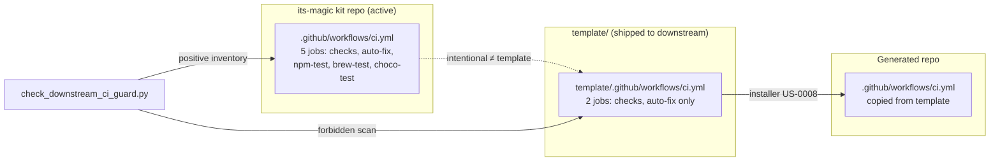
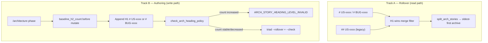
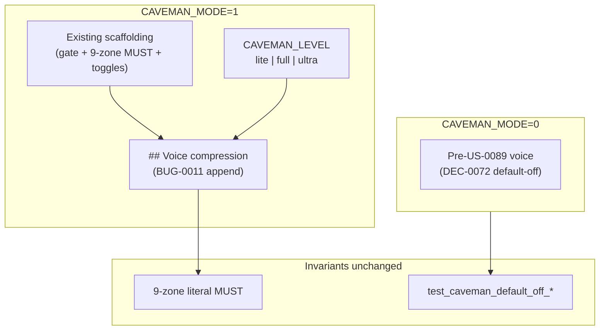
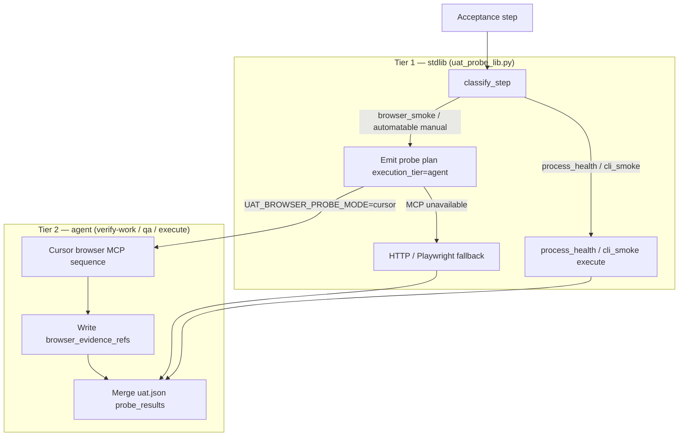
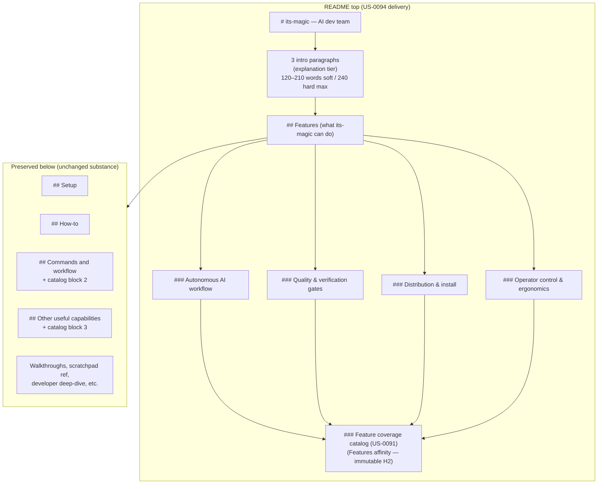
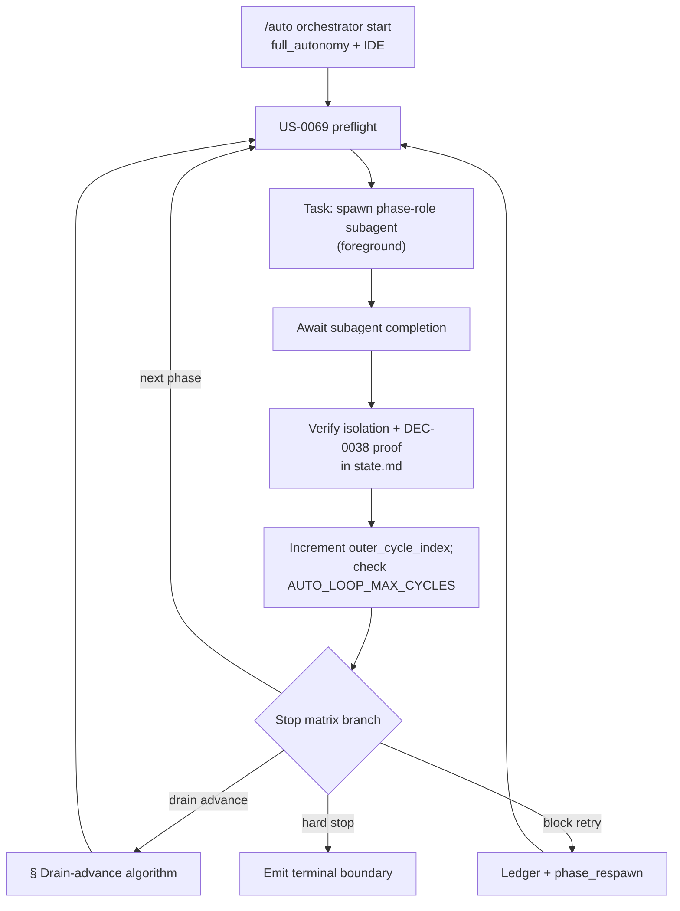
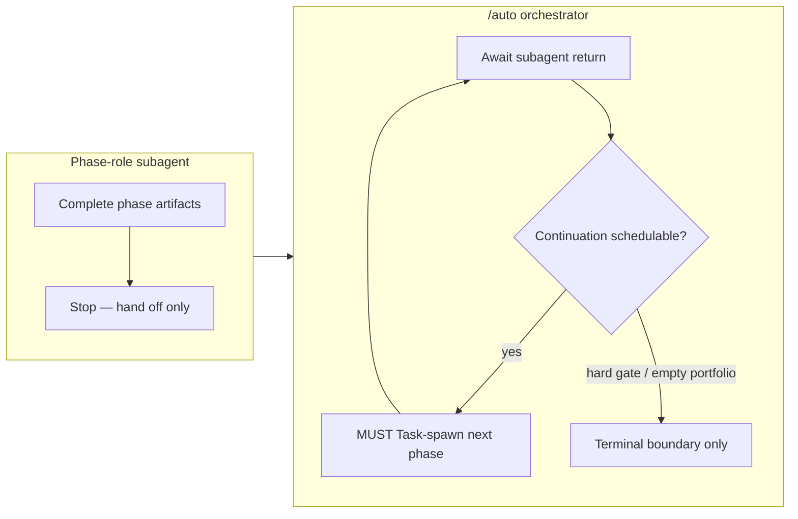
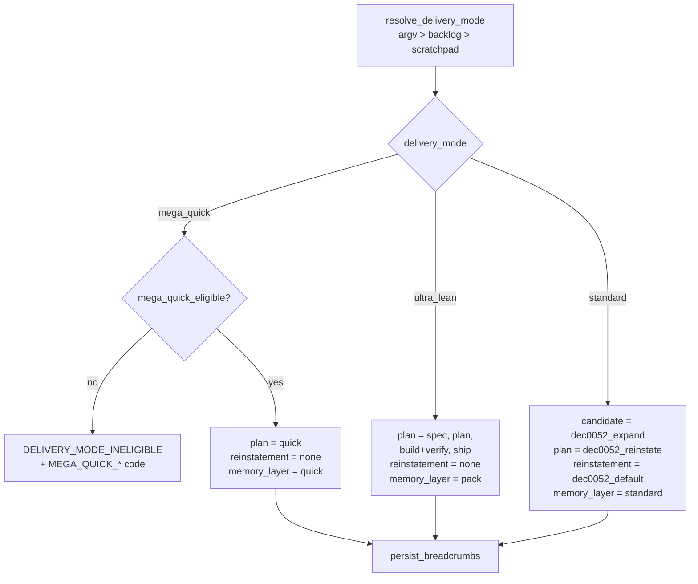

# Architecture

## Overview

US-0018 adds a fourth installer mode (`--mode upgrade`) that safely updates its-magic framework files in a target repo while preserving user data files. The design introduces three new concepts: file classification, version tracking, and an upgrade flow algorithm.

The existing installer architecture (Node.js CLI wrapper → OS-specific installer script → file copy loop) remains unchanged. Upgrade mode is an additional branch in the existing mode switch, using the same file listing and copy infrastructure.

---

# BUG-0009: Downstream-safe template CI vs kit-internal active CI

## Overview

**`BUG-0009`** closes a template-leak defect where byte-identical
`template/.github/workflows/ci.yml` ↔ `.github/workflows/ci.yml` copies kit-only
self-packaging jobs (`npm-test`, `brew-test`, `choco-test`) into every downstream repo
via **US-0008** installer copy, breaking CI in all its-magic-created projects.

Binding decision: **`DEC-0075`**. Research anchor: **`R-0075`**. Open
`decisions/DEC-0075.md` for normative CI split, US-0017 negative-parity exceptions,
drift guard contract, and bootstrap semantics.

## CI split diagram



## Minimal architecture

### A. In-place job subtraction (DEC-0075 §1)

- **Template** `ci.yml`: retain `checks` + `auto-fix`; remove packaging job blocks.
- **Active** `ci.yml`: retain all five jobs for kit self-distribution.
- Filename stays **`ci.yml`**; manifest entries unchanged; `deploy.yml` untouched.

### B. US-0017 negative-parity exceptions (DEC-0075 §2)

| Path | Rule |
|------|------|
| `template/.github/workflows/ci.yml` | Must **not** byte-match active after fix |
| `.github/workflows/ci.yml` (active) | Must retain packaging jobs |
| `template/docs/engineering/runbook.md` | `TEST_COMMAND:` empty on ship (may differ from active) |
| Guard scripts | Byte-identical active + `template/` |

**Do not** add `check_intake_template_parity.py --scope=ci-downstream`.

### C. Drift guard (DEC-0075 §3–§4)

**`scripts/check_downstream_ci_guard.py`** + **`scripts/downstream_ci_guard_lib.py`**
(stdlib-only; lib split locked).

**Forbidden in template `ci.yml`**: job ids `npm-test`, `brew-test`, `choco-test`;
substrings `npm pack`, `its-magic-*.tgz`, `installer.sh`, `packaging/chocolatey`,
`packaging/homebrew`, `choco pack`, `brew style`.

**Required in active `ci.yml`**: all five job ids.

**Reason codes**: `DOWNSTREAM_CI_FORBIDDEN_PATTERN`, `DOWNSTREAM_CI_JOB_LEAK`,
`KIT_CI_PACKAGING_JOBS_MISSING`.

**Harness**: **`§28B`**. **Contract tests**: `test_bug0009_*` in
`tests/auto_command_contract_test.py`.

### D. checks green-by-default (DEC-0075 §5)

Both active and template `checks` jobs:

- Empty/skipped runbook commands → **PASS** + summary **`no tests configured yet`**.
- Fail step only when configured test/lint returns `failure`.
- Post-**US-0063** bootstrap: real configured failures still fail.

### E. Runbook bootstrap (DEC-0075 §6)

- Template runbook: **`TEST_COMMAND:`** empty on ship.
- Active runbook: keep powershell harness.
- **US-0063** stack-aware bootstrap unchanged.

### F. Install smoke (DEC-0075 §7)

Extend **`tests/installer_completeness_bug0003_test.py`**:

- `missing` + `upgrade` modes → installed `ci.yml` jobs ⊆ `{checks, auto-fix}`.

Add guard scripts to **`installer-owned-paths.manifest`**.

### G. Template parity inventory (DEC-0075 §8)

**Positive (active + `template/` byte-identical)**:

1. `scripts/check_downstream_ci_guard.py`
2. `scripts/downstream_ci_guard_lib.py`
3. Runbook remediation subsection (except `TEST_COMMAND:` header)
4. `installer-owned-paths.manifest` guard entries
5. `check_intake_template_parity.py --scope=downstream-ci-guard`

**Active-only**: `# BUG-0009`, workflow YAML edits, test extensions.

### H. Operator docs (DEC-0075 §9)

Upgrade remediation blurb in README + runbook + release-notes template (verbatim in DEC).

## Risks (architecture-resolved)

| ID | Mitigation |
|----|------------|
| R1 Active CI strip | Template-only forbidden scan + active positive inventory |
| R2 Stale repos | Upgrade remediation copy; accepted scope |
| R3 Wrong file copied | Install-completeness job-inventory tests |
| R4 Post-bootstrap false green | Fail only on configured command failure |
| R5 Runbook validator | Re-run `validate_doc_profile.py` in sprint QA |

## AC traceability

| AC | Architecture anchor |
|----|---------------------|
| AC-1 Template CI downstream-safe | §A |
| AC-2 Active kit CI retains packaging | §A, §C |
| AC-3 Drift guard + §28B | §C |
| AC-4 checks green-by-default | §D |
| AC-5 Empty template TEST_COMMAND | §E |
| AC-6 Install/upgrade smoke | §F |
| AC-7 US-0017 negative parity | §B, §C, §G |
| AC-8 Operator remediation docs | §H |

## Atomic task seeds (for `/sprint-plan`)

| # | Seed | AC | Surfaces |
|---|------|----|----------|
| 1 | Template `ci.yml` — subtract packaging jobs; harden `checks` summary/fail semantics | AC-1, AC-4 | `template/.github/workflows/ci.yml` |
| 2 | Active `ci.yml` — harden `checks` only; preserve five jobs | AC-2, AC-4 | `.github/workflows/ci.yml` |
| 3 | Template runbook — empty `TEST_COMMAND:` header | AC-5 | `template/docs/engineering/runbook.md` |
| 4 | Implement `downstream_ci_guard_lib.py` + `check_downstream_ci_guard.py` | AC-3, AC-7 | `scripts/` + `template/scripts/` |
| 5 | Contract tests `test_bug0009_*` in `auto_command_contract_test.py` | AC-3, AC-7 | tests active-only |
| 6 | Harness **§28B** in run-tests PS1/SH | AC-3 | tests active-only |
| 7 | Extend `installer_completeness_bug0003_test.py` job inventory | AC-6 | tests active-only |
| 8 | Installer manifest + parity `--scope=downstream-ci-guard` | AC-6, AC-7 | manifest + parity script + `template/` |
| 9 | README + runbook remediation blurb | AC-8 | README + runbook + `template/` runbook |
| 10 | Architecture linkage assert (this section + DEC-0075 refs) | AC-7 | read-only check |

**Task count**: 10 seeds. `SPRINT_MAX_TASKS=12` — no auto-split expected.

## Related

- **`US-0007`**, **`US-0009`** — kit self-distribution CI
- **`US-0008`** — installer copy model
- **`US-0017`** — template drift guard (negative-parity exceptions)
- **`US-0018`** — upgrade/clean re-copy
- **`US-0063`** / **`DEC-0056`** — runbook bootstrap
- **`BUG-0003`** / **`DEC-0066`** — install-completeness fixture class
- **`R-0075`** — research anchor

# BUG-0010: Dual-level architecture story headings and diff-gated H1 enforcement

## Overview

**`BUG-0010`** closes a triad archiver defect where `scripts/enforce-triad-hot-surface.py`
only recognizes H1 `# US-xxxx` story boundaries. Repos with H2 `## US-xxxx` sections hit
`STATE_ARCHIVE_BOUNDARY_AMBIGUOUS` when `architecture.md` exceeds `ARCH_HOT_MAX_LINES`
because `split_arch_stories` finds zero archivable chunks.

Binding decision: **`DEC-0076`**. Research anchor: **`R-0076`**. Open
`decisions/DEC-0076.md` for normative dual-level regex, H1-wins precedence, diff-gated
forward enforcement, and harness **§29A** contract.

## Dual-track fix diagram



## Minimal architecture

### A. Dual-level regex (DEC-0076 §1)

Replace monolithic `STORY_HEADING` with:

```text
STORY_HEADING_H1 = ^# (?:US|BUG)-\d{4}\s*[:\u2014\-].+$
STORY_HEADING_H2 = ^## US-\d{4}\s*[:\u2014\-].+$
```

### B. H1-wins merge algorithm (DEC-0076 §2)

1. Collect `(idx, story_id, level)` for all H1/H2 story-heading matches.
2. Drop H2 candidates whose `story_id` has any H1 in file.
3. Sort by `idx`; slice blocks between boundaries (unchanged rollover loop).

Kit-repo regression anchor: **26** H1 + **5** H2 (`US-0067`..`0070`, `US-0083` gate).

### C. Diff-gated forward enforcement (DEC-0076 §3–§4)

In-place extension of `enforce-triad-hot-surface.py`:

- `count_h2_story_headings(text)` — count `STORY_HEADING_H2` matches.
- `check_arch_heading_policy(after, baseline_h2_count)` — fail when count **increases**.
- `/architecture` step 9: capture baseline **before** append; run policy check **after** rollover.

**Reason codes**: `ARCH_STORY_HEADING_LEVEL_INVALID` (new); `STATE_ARCHIVE_BOUNDARY_AMBIGUOUS`
and `ARTIFACT_HOT_SURFACE_OVERSIZE` unchanged.

### D. Command contract (DEC-0076 §3, §6)

`.cursor/commands/architecture.md` (+ `template/`):

- Mandate H1 `# US-xxxx` for story sections; `# BUG-xxxx` for bug sections.
- Reference `ARCH_STORY_HEADING_LEVEL_INVALID` as non-suppressible stop token.
- Document baseline capture + heading policy check in triad gate step 9.

### E. Regression matrix + harness §29A (DEC-0076 §5)

| Surface | Requirement |
|---------|-------------|
| `enforce-triad-hot-surface.py --self-test` | Extend with `##`-only, mixed, idempotent, enforcement-delta, inner-`##` classes |
| `tests/auto_command_contract_test.py` | Add `test_bug0010_*` prefix subtests |
| `tests/run-tests.ps1` + `.sh` | New section **§29A** (`pytest -k bug0010` or equivalent) |
| `tests/fixtures/triad_arch_headings/` | Optional minimal fixtures (sprint may add) |

Existing triad harness block: **unchanged** (additive §29A only).

### F. Template parity inventory (DEC-0076 §6)

**Positive (active + `template/` byte-identical)**:

1. `scripts/enforce-triad-hot-surface.py`
2. `.cursor/commands/architecture.md` (H1 mandate + policy check text)
3. `docs/engineering/runbook.md` (triad subsection extension)

**Active-only**: `# BUG-0010`, test extensions, §29A harness wiring.

**No new** `check_intake_template_parity.py` scope.

### G. Operator docs (DEC-0076 §7)

Runbook triad subsection: legacy `## US-` rollover note + optional `##`→`#` normalization
guidance (verbatim in DEC-0076 §7).

## Risks (architecture-resolved)

| ID | Mitigation |
|----|------------|
| R1 Double-count H1+H2 | H1-wins filter (§B) |
| R2 Split on inner `##` | `## US-\d{4}` regex only (§A) |
| R3 Block legitimate subheadings | Diff-gated policy (§C) |
| R4 Template script drift | Byte-identical active + `template/` (§F) |
| R5 DEC-0054 §2 drift | Doc-only amendment (DEC-0076 §8) |

## AC traceability

| AC | Architecture anchor |
|----|---------------------|
| AC-1 `## US-` backward-compat rollover | §A, §B, §E |
| AC-2 H1 `# US-` non-regression | §A, §E |
| AC-3 Mixed-file H1-wins precedence | §B, §E |
| AC-4 Diff-gated enforcement | §C |
| AC-5 Command H1 mandate + parity | §D, §F |
| AC-6 Self-test + contract tests + §29A | §E |
| AC-7 `# BUG-` H1 rollover + script parity | §A, §F |
| AC-8 Operator runbook remediation | §G |

## Atomic task seeds (for `/sprint-plan`)

| # | Seed | AC | Surfaces |
|---|------|----|----------|
| 1 | Implement `STORY_HEADING_H1`/`H2` + H1-wins `split_arch_stories` merge | AC-1, AC-2, AC-3, AC-7 | `scripts/enforce-triad-hot-surface.py` + `template/scripts/` |
| 2 | Add `count_h2_story_headings` + `check_arch_heading_policy` + CLI hook | AC-4 | same script (active + `template/`) |
| 3 | Extend `--self-test` with dual-level fixture classes | AC-1, AC-2, AC-3, AC-6 | same script |
| 4 | Update `.cursor/commands/architecture.md` H1 mandate + policy step | AC-4, AC-5 | `.cursor/commands/` + `template/.cursor/commands/` |
| 5 | Contract tests `test_bug0010_*` in `auto_command_contract_test.py` | AC-5, AC-6 | tests active-only |
| 6 | Harness **§29A** in run-tests PS1/SH | AC-6 | tests active-only |
| 7 | Optional `tests/fixtures/triad_arch_headings/` minimal fixtures | AC-1, AC-3 | tests active-only |
| 8 | Runbook triad subsection — legacy `## US-` + remediation blurb | AC-8 | runbook active + `template/` |
| 9 | Architecture linkage assert (this section + DEC-0076 refs) | AC-5 | read-only check |

**Task count**: 9 seeds. `SPRINT_MAX_TASKS=12` — no auto-split expected.

## Related

- **`US-0072`** / **`DEC-0054`** — triad hot-surface compaction
- **`DEC-0043`** — artifact ownership (history-preserving appends)
- **`US-0017`** — template drift guard (script mirror)
- **`US-0061`** — cross-phase ownership
- **`R-0076`** — research anchor

# BUG-0011: Caveman voice-compression rules missing from caveman.mdc

## Overview

**`BUG-0011`** completes **US-0089** response-side Caveman delivery by appending
actionable voice-compression directives to `.cursor/rules/caveman.mdc`. **US-0089** /
**DEC-0072** shipped scaffolding only (gates, 9-zone literal invariant, toggles) —
with **`CAVEMAN_MODE=1`** replies stayed verbose because no rule text instructed
drop-filler, fragment, or level semantics.

Binding decision: **`DEC-0077`** (composes on **`DEC-0072`** — forward-link, no rewrite).
Research anchor: **`R-0077`**. Open `decisions/DEC-0077.md` for normative voice-section
outline, SHA bump policy, contract markers, and runbook extension.

**`# US-0089`** §6 cross-link amended (voice rules delivered here; qualitative brevity
remains operator-verified).

## Voice delivery diagram



## Minimal architecture

### A. Voice section append (DEC-0077 §2)

Append to **`.cursor/rules/caveman.mdc`** + **`template/.cursor/rules/caveman.mdc`**
(byte-identical pair). **Preserve** all pre-voice scaffolding verbatim.

**Locked section heading**:

```text
## Voice compression (when CAVEMAN_MODE=1)
```

**Subsections** (order normative — see **`DEC-0077`** §2 table):

1. `### Precedence` — voice rules override conflicting user-rule prose style when
   `CAVEMAN_MODE=1` (reply voice only).
2. `### Intensity levels` — `lite` / `full` / `ultra` table; kit-native examples.
3. `### Drop rules` — filler/hedging/fragments.
4. `### Auto-Clarity` — security/destructive/ambiguous pause + resume.
5. `### Persistence` — active every response while mode on.
6. `### Ultra and literal regions` — **pointer stub** to existing 9-zone MUST (no duplicate list).

### B. Level semantics (DEC-0077 §3)

| Level | Semantics |
|-------|-----------|
| `lite` | Drop filler; grammatical sentences |
| `full` | Drop articles; fragments OK |
| `ultra` | Abbreviate prose words only; literals byte-exact |

### C. SHA dual-layer + contract markers (DEC-0077 §4–§5)

1. Bump `_CAVEMAN_RULE_BASELINE_SHA256` in `test_caveman_compress_input_rule_byte_identity`
   to post-voice digest (pre-voice: `E10EFC32C628E790E69E2393F381108FE0B1F16E0BCDCFFFC162EFF6F91E47DE`).
2. Add nine `test_caveman_voice_*` subtests (token-presence; see **`DEC-0077`** §5).
3. **Do not modify** `test_caveman_default_off_*` bodies or non-substitution pinned sentence.

### D. Runbook extension (DEC-0077 §7)

Under **`### Caveman mode (US-0089)`** (active + `template/`):

- **`#### Voice compression levels`** — compact 2-row before/after table + pointer to rule file.
- **`### Caveman input compression (US-0090)`** — **untouched**.

### E. Harness §30A (DEC-0077 §6)

| Surface | Requirement |
|---------|-------------|
| `tests/run-tests.ps1` + `.sh` | New **§30A** — `Voice compression rule markers (BUG-0011)` |
| Scope | `pytest -k caveman_voice` (or equivalent prefix filter) |

Existing caveman harness sections: **unchanged**.

### F. Template parity inventory (DEC-0077 §9)

**Positive (byte-identical after voice delivery)**:

1. `.cursor/rules/caveman.mdc` ↔ `template/.cursor/rules/caveman.mdc`
2. `docs/engineering/runbook.md` ↔ `template/docs/engineering/runbook.md` (Caveman subsection only)

**Active-only**: `# BUG-0011`, `test_caveman_voice_*`, §30A, `# US-0089` §6 cross-link.

**No new** `check_intake_template_parity.py` scope.

## Risks (architecture-resolved)

| ID | Mitigation |
|----|------------|
| R1 US-0090 SHA break | Intentional baseline bump (§C) |
| R2 Literal garbling | Unchanged 9-zone MUST + ultra stub (§A.6) |
| R3 User-rule conflict | `### Precedence` (§A.1) |
| R4 Ultra abbreviates reason codes | Forbidden; stub defers to 9-zone (§A.6) |
| R5 Runbook drift | Summary table only; rule normative (§D) |
| R6 Pinned test regression | `test_caveman_default_off_*` bodies frozen (§C.3) |

## AC traceability

| AC | Architecture anchor |
|----|---------------------|
| AC-1 Voice section in `caveman.mdc` | §A, §B + **DEC-0077** §2–§3 |
| AC-2 Template byte parity | §F |
| AC-3 User-rule precedence | §A.1 + **DEC-0077** §2 |
| AC-4 Ultra/literal deferral stub | §A.6 + **DEC-0077** §2 |
| AC-5 `test_caveman_voice_*` + SHA bump | §C + **DEC-0077** §4–§5 |
| AC-6 Runbook voice levels | §D + **DEC-0077** §7 |
| AC-7 Default-off invariants preserved | §C.3 + **DEC-0077** §4 |
| AC-8 Harness §30A + operator UAT | §E + **DEC-0077** §6 |

## Atomic task seeds (for `/sprint-plan`)

| # | Seed | AC | Surfaces |
|---|------|----|----------|
| 1 | Append voice section to `caveman.mdc` per **DEC-0077** §2 outline (active + template byte-identical) | AC-1, AC-2, AC-3, AC-4 | `.cursor/rules/` + `template/.cursor/rules/` |
| 2 | Extend runbook `#### Voice compression levels` (2-row table + rule pointer) | AC-6 | runbook active + `template/` |
| 3 | Add nine `test_caveman_voice_*` subtests in `auto_command_contract_test.py` | AC-5 | tests active-only |
| 4 | Bump `_CAVEMAN_RULE_BASELINE_SHA256` in `test_caveman_compress_input_rule_byte_identity` | AC-5 | tests active-only |
| 5 | Harness **§30A** in `run-tests.ps1` + `.sh` | AC-8 | tests active-only |
| 6 | Regression guard — `test_caveman_default_off_*` bodies unchanged | AC-7 | tests active-only |
| 7 | Sprint UAT operator voice spot-check (`CAVEMAN_MODE=1` visibly shorter prose; literals intact) | AC-8 | UAT docs |
| 8 | Architecture linkage assert (this section + **DEC-0077** + `# US-0089` §6 cross-link) | AC-1 | read-only check |

**Task count**: 8 seeds. `SPRINT_MAX_TASKS=12` — no auto-split expected.

## Related

- **`US-0089`** / **`DEC-0072`** — scaffolding (composes, not rewritten)
- **`US-0090`** / **`DEC-0073`** — input compression (orthogonal)
- **`US-0088`** — non-suppressible gate vocabulary
- **`US-0017`** — template drift guard (`caveman.mdc` parity)
- **`R-0077`** — research anchor

---

# US-0092: Full-autonomy `/auto` mode + outer driver + self-verification

## Overview

**`US-0092`** closes the gap left by **`US-0088`** where continuous `/auto` and backlog drain are **documented** but Cursor often stops after one phase unless the operator manually re-invokes `/auto`. Ships **opt-in** **`AUTO_FLOW_MODE=full_autonomy`** (exact literal, **default-off**) with: (1) a **stdlib outer-driver script**; (2) expanded **`/verify-work`** / **`/qa`** self-verify via build/test/API/browser/health probes; (3) bounded block auto-resolve; (4) drain-without-pause; (5) **`TOKEN_PROFILE`** orthogonality audit.

**Spawn-only** (**`BUG-0006`** / **`US-0069`**) is **unchanged**: outer driver **loops invocations**, never substitutes for phase-role subagents.

Binding decision: **`DEC-0078`**. Research anchor: **`R-0078`**. Composes on **`# US-0088`**, **`DEC-0062`**, **`DEC-0047`**, **`DEC-0048`** — forward-links only; no rewrite of prior decision bodies.

## Assumption challenge and alternatives

| Option | Summary | Verdict |
|--------|---------|---------|
| A | **Shipped stdlib `scripts/auto_outer_driver.py`** — polls **`resume_brief`** + **`state.md`**, re-invokes **`/auto`** until deterministic stop | **Preferred** — satisfies AC-2 “not operator-manual-only”. |
| B | **Documented Cursor hook only** (operator copies `/auto` each turn) | **Rejected as sole delivery** — **US-0088** Option B allowed as equivalence class but **US-0092** requires shipped script. |
| C | **`/loop` command composition** | **Rejected** — in-session cadence, not cross-turn lifecycle with **DEC-0038** / **DEC-0069** boundary refresh. |
| D | **`TOKEN_PROFILE=lean`** as automation proxy | **Rejected** — operator hard constraint; **`TOKEN_PROFILE`** = context breadth / token cost **only** (**DEC-0062**). |

## Scratchpad contract (AC-1)

### `AUTO_FLOW_MODE` enum (architecture-locked)

| Value | Semantics |
|-------|-----------|
| **`manual`** | Default when unset. |
| **`auto_until_decision`** | Unchanged — continuous until **`decision_gate`**. |
| **`full_autonomy`** | Outer-driver loop + relaxable transient stops + drain-without-pause; **default-off**. |

### New keys (architecture-locked)

| Key | Default | Role |
|-----|---------|------|
| **`AUTO_BLOCK_RETRY_MAX`** | **`3`** | Per **`(story_id, stop_reason)`** recoverable retries before **`BLOCK_RETRY_CAP_EXHAUSTED`** (exit **6**). |
| **`AUTO_OUTER_DRIVER_TIMEOUT_SECONDS`** | unset | Optional hook timeout → exit **124**. |

### Interaction matrix (unchanged semantics unless noted)

| Key | Under **`full_autonomy`** |
|-----|---------------------------|
| **`PHASE_MODE`** / **`PERMISSION_MODE`** | Orthogonal — no substitution. |
| **`AUTO_BACKLOG_DRAIN`** / **`AUTO_BUG_QUEUE`** | Compose per **US-0044** / **US-0087** mutex. |
| **`AUTO_LOOP_MAX_CYCLES`** / **`AUTO_BACKLOG_MAX_STORIES`** | Hard caps — unchanged. |
| **`AUTO_IMPLEMENTATION_LOOP`** | When **`1`**, UAT/QA fail triggers inner remediation loop. |
| **`TOKEN_PROFILE`** | **`lean` \| `balanced` \| `full`** — context breadth / token cost **only**; see § TOKEN_PROFILE orthogonality. |
| **`RELEASE_PUBLISH_MODE=auto`** | Explicit opt-in for publish — unchanged default-off. |

## Outer-driver script API (AC-2)

**Path**: **`scripts/auto_outer_driver.py`** (active + **`template/scripts/`**).

**Stdlib-only**: **`argparse`**, **`json`**, **`hashlib`**, **`pathlib`**, **`subprocess`**, **`re`**, **`datetime`**.

**Activation gate**: require merged scratchpad **`AUTO_FLOW_MODE=full_autonomy`** — else exit **2** **`AUTO_FLOW_MODE_NOT_FULL_AUTONOMY`**.

**Argv**:

| Flag | Purpose |
|------|---------|
| **`--repo PATH`** | Repository root (default `.`). |
| **`--max-cycles INT`** | Override **`AUTO_LOOP_MAX_CYCLES`**. |
| **`--max-stories INT`** | Override **`AUTO_BACKLOG_MAX_STORIES`**. |
| **`--dry-run`** | Emit planned invocations only. |
| **`--invoke-cmd TEXT`** | Shell prefix for documented **`/auto`** hook; default prints normative **`/auto …`** line. |

**Loop body**: read **`resume_brief`** → invoke hook → parse **`state.md`** boundary → branch (continue / drain-advance / block-retry / exit).

**Exit codes**:

| Code | Meaning |
|------|---------|
| **0** | **`completed`** |
| **1** | Hard stop — **`decision_gate`**, unrecoverable **`error`**, isolation/strict-proof, security deny |
| **2** | Configuration — mode not **`full_autonomy`** |
| **3** | **`loop_max`** |
| **4** | **`BACKLOG_MAX_STORIES_REACHED`** |
| **5** | **`pause_request`** / **`AUTO_PAUSE_REQUEST`** |
| **6** | **`BLOCK_RETRY_CAP_EXHAUSTED`** |
| **124** | Hook timeout |

**Runbook**: subsection **`### Full-autonomy outer driver (US-0092)`** — enable keys → **`python scripts/auto_outer_driver.py --repo .`** once → interpret exit table.

## Stop matrix (AC-7)

**Invariant**: **`full_autonomy`** relaxes **recoverable transient stops** and **operator re-invocation**, not **governance gates**.

| Condition | **US-0088** | **`full_autonomy` delta** | Operator notify |
|-----------|-------------|---------------------------|-----------------|
| Next phase, no hard stop | Continue inner `/auto` | Outer driver **re-invokes** when Cursor ends turn early | Quiet OK if **`AUTO_QUIET=1`** |
| **`decision_gate`** | Hard stop | **No change — hard** | Always |
| Unrecoverable **`error`** | Hard stop | **No change — hard** | Always |
| Critical **`missing_input`** | Hard stop | **No change — hard** | Always |
| Transient **`missing_input`** (recoverable) | Hard stop | **Relaxable** — bounded block-retry | Notify on cap |
| **`pause_request`** | Hard stop | **No change — hard** | Always |
| **`loop_max`** | Hard stop | **No change — hard** | Always |
| **`blocked`** — transient/sync | Hard stop | **Relaxable** when recoverable | Notify on cap |
| **`blocked`** — isolation/strict-proof/ownership | Hard stop | **No change — hard** | Always |
| UAT/QA fail | Hard stop (operator) | **Relaxable** when **`AUTO_IMPLEMENTATION_LOOP=1`** | Notify on cap |
| Segment complete + **`AUTO_BACKLOG_DRAIN=1`** | Advance (may need manual re-**`/auto`**) | **Drain-without-pause** — immediate next item | Segment handoff notify |
| **`BACKLOG_MAX_STORIES_REACHED`** | Hard stop | **No change — hard** | Always |
| **`AUTO_SCHEDULER_CONFLICT`** | Hard stop | **No change — hard** | Always |
| **`RELEASE_PUBLISH_MODE=auto`** | Explicit opt-in | **No change — hard default-off** | Always on publish |
| Security deny (**.env`**, intake mutation) | Hard deny | **No change — hard** | Always |

## UAT probe contract (AC-3)

**Resolver lib**: **`scripts/uat_probe_lib.py`** (+ **`template/scripts/`**). **`/verify-work`** and **`/qa`** share resolver.

| Probe kind | Resolves when | Evidence |
|------------|---------------|----------|
| **`build`** | Stack profile maps build script | **`uat.json`** `probe_results[]`, **`qa-findings.md`** |
| **`test`** | **`TEST_COMMAND`** or profile default (**DEC-0048**) | Same + stdout/stderr path refs |
| **`api_health`** | URL/health in acceptance or **`runtime-connectivity.md`** | Status code + latency |
| **`process_health`** | Startup command in acceptance (**DEC-0047**) | Retry ledger snippet |
| **`browser_smoke`** | Web stack + optional **`PLAYWRIGHT_*`** / curl fallback | Screenshot/path ref optional |
| **`cli_smoke`** | CLI + expected exit/output in acceptance | Exit code + truncated stdout |
| **`manual_operator`** | Human judgment required | **`UAT_PROBE_UNRESOLVED`** unless operator maps probe |

**Fail-closed reason codes**: **`UAT_PROBE_UNRESOLVED`**, **`UAT_STACK_PROFILE_UNKNOWN`**, **`UAT_PROBE_TIMEOUT`**, **`UAT_PROBE_FAILED`**, **`UAT_PROBE_FORBIDDEN`**, **`UAT_PROBE_PASS`**.

**Stack profile resolution**: **`package.json`**, **`pyproject.toml`**, **`go.mod`**, **`pom.xml`**, **`*.csproj`**, scratchpad **`TEST_COMMAND`**, **`docs/engineering/runtime-connectivity.md`**. Generated-project fast path when **`stack_profile=generated`** (**US-0065** / **US-0066**).

## Block-retry ledger (AC-4)

**Path**: **`handoffs/auto_block_retry/<orchestrator_run_id>.jsonl`** — append-only; names-only; no secrets.

**Record fields**: `attempt_id`, `timestamp`, `orchestrator_run_id`, `story_id`, `stop_reason`, `reason_code`, `remediation_action`, `outcome`, `outer_cycle_index`, `implementation_loop_index`.

**Cap interaction**:

| Cap | Scope |
|-----|-------|
| **`AUTO_LOOP_MAX_CYCLES`** | Outer **`/auto`** invocations (incl. drain advances) |
| **`AUTO_IMPLEMENTATION_LOOP`** | Inner **`execute`↔`qa`↔`verify-work`** when **`1`** |
| **`AUTO_BLOCK_RETRY_MAX`** | Per **`(story_id, stop_reason)`** recoverable retries |
| **`AUTO_BACKLOG_MAX_STORIES`** | Drain breadth — exit **4** |

## Drain-without-pause (AC-5)

Segment completion + drain policy → outer driver schedules next OPEN story/bug **immediately** without operator pause. **`resume_brief`** + **`state.md`** refresh per **DEC-0069** at every boundary.

## TOKEN_PROFILE orthogonality audit (AC-6)

**Hard rule**: **`TOKEN_PROFILE=lean|balanced|full`** affects **context breadth / token cost only** — never automation level, phase depth, drain, outer-driver invocation, or **`AUTO_FLOW_MODE`**.

**Grep scope**: scratchpad comments (active + template + local example), **`auto-orchestration-reference.md`**, **`runbook.md`** (fix “automation breadth” conflict), **`README.md`** family, **`auto.md`** cross-refs.

**Forbidden patterns** (contract negative): `automation breadth`, `lowers default automation`, `TOKEN_PROFILE.*drain`, `TOKEN_PROFILE.*outer`, `TOKEN_PROFILE.*full_autonomy`, `lean.*less automation`, `full.*more automation`.

## Security (AC-10)

No auto-read **`.env`**, no intake evidence mutation, no publish without **`RELEASE_PUBLISH_MODE=auto`**. Ledgers names-only.

## Contract-test expectations (AC-8)

- Positive: **`AUTO_FLOW_MODE=full_autonomy`** literal in scratchpad comment block.
- Positive: **`TOKEN_PROFILE controls context breadth / token cost only`**.
- Positive: drain-advance-without-operator phrases.
- Positive (post-execute): **`scripts/auto_outer_driver.py`** exists + runbook **`Full-autonomy outer driver (US-0092)`**.
- Negative: runbook must not contain **`lowers default automation breadth`** after fix.

## Surfaces (execute phase)

| Path | Change |
|------|--------|
| **`scripts/auto_outer_driver.py`** | New stdlib outer driver |
| **`scripts/uat_probe_lib.py`** | Shared probe resolver |
| Scratchpad + template | **`full_autonomy`** enum + new keys |
| **`.cursor/commands/auto.md`**, **`auto-orchestration-reference.md`** | Stop matrix § **US-0092** |
| **`.cursor/commands/verify-work.md`**, **`qa.md`** | Self-verify excerpt |
| **`docs/engineering/runbook.md`** | Outer-driver recipe + orthography fix |
| **`tests/auto_command_contract_test.py`** | Markers per AC-8 |
| **`template/`** | Parity for all touched surfaces (**US-0017**) |

## Risks

| Risk | Mitigation |
|------|------------|
| Infinite driver loop | **`AUTO_LOOP_MAX_CYCLES`** + exit codes |
| Self-verify false PASS | Fail closed **`UAT_PROBE_UNRESOLVED`** |
| TOKEN_PROFILE doc drift | AC-6 grep + contract tests |
| Security (secrets/publish) | Hard deny-list + **`RELEASE_PUBLISH_MODE`** default |
| Partial delivery (flags without driver) | Single-story vertical contract |

## AC traceability

| AC | Architecture anchor |
|----|---------------------|
| AC-1 Scratchpad flow mode | § Scratchpad contract |
| AC-2 Outer-driver script | § Outer-driver script API |
| AC-3 Self-verify | § UAT probe contract |
| AC-4 Block auto-resolve | § Block-retry ledger |
| AC-5 Drain-without-pause | § Drain-without-pause |
| AC-6 TOKEN_PROFILE audit | § TOKEN_PROFILE orthogonality audit |
| AC-7 Stop matrix docs | § Stop matrix |
| AC-8 Contract tests | § Contract-test expectations |
| AC-9 Template parity | § Surfaces |
| AC-10 Security | § Security |

## Atomic task seeds (for `/sprint-plan`)

| # | Seed | AC | Surfaces |
|---|------|----|----------|
| 1 | Scratchpad **`AUTO_FLOW_MODE`** enum + **`AUTO_BLOCK_RETRY_MAX`** / **`AUTO_OUTER_DRIVER_TIMEOUT_SECONDS`** (active + template + local example) | AC-1 | scratchpad family |
| 2 | Implement **`scripts/auto_outer_driver.py`** (stdlib, argv/exit codes, activation gate) | AC-2 | `scripts/` + `template/scripts/` |
| 3 | Implement **`scripts/uat_probe_lib.py`** + wire **`/verify-work`** / **`/qa`** command excerpts | AC-3 | scripts + commands + template |
| 4 | Block-retry ledger writer + cap interaction in driver/orchestrator docs | AC-4 | `handoffs/auto_block_retry/`, auto docs |
| 5 | Drain-without-pause branch in outer driver + **DEC-0069** boundary refresh | AC-5 | driver + resume_brief pairing |
| 6 | TOKEN_PROFILE orthography audit + grep fixes (runbook conflict, README family) | AC-6 | docs + scratchpad comments |
| 7 | Stop matrix in **`auto.md`**, **`auto-orchestration-reference.md`** | AC-7 | commands + reference + template |
| 8 | Contract tests in **`auto_command_contract_test.py`** | AC-8 | tests active-only |
| 9 | Template parity + installer manifest entries | AC-9 | template + parity script |
| 10 | Runbook **`### Full-autonomy outer driver (US-0092)`** + security deny-list callout | AC-2, AC-10 | runbook + template |

**Task count**: 10 seeds. `SPRINT_MAX_TASKS=12` — no auto-split expected.

## Decision linkage

- Research: **`R-0078`**
- Decision: **`DEC-0078`**
- Related: **`US-0088`**, **`US-0044`**, **`US-0065`**, **`US-0066`**, **`US-0080`**, **`US-0087`**, **`DEC-0062`**, **`DEC-0047`**, **`DEC-0048`**, **`DEC-0069`**, **`DEC-0038`**, **`US-0048`**, **`US-0056`**

# US-0093: Cursor browser-integrated UAT self-test

## Overview

**`US-0093`** closes the execution gap left by **`US-0092`** / **`DEC-0078`**: **`scripts/uat_probe_lib.py`** classifies **`browser_smoke`**, **`process_health`**, and **`cli_smoke`** steps but returns **`UAT_PROBE_UNRESOLVED`** at execution; **`manual_operator`** UI/workflow steps are never auto-run. Ships a **two-tier contract** so **`/verify-work`**, **`/qa`**, and **`/execute`** drive **Cursor built-in browser MCP** as the **primary** web self-test path, with deterministic HTTP / Playwright subprocess fallbacks when MCP is unavailable.

**Spawn-only** (**`BUG-0006`** / **`US-0048`**) is **unchanged**: stdlib lib **never** invokes browser MCP; phase subagents own Tier 2 execution.

Binding decision: **`DEC-0079`**. Research anchor: **`R-0079`**. Composes on **`# US-0092`** / **`DEC-0078`**, **`US-0065`**, **`US-0066`** — forward-links only; security deny-list and fail-closed vocabulary **not weakened**.

## Assumption challenge and alternatives

| Option | Summary | Verdict |
|--------|---------|---------|
| A | **Two-tier**: stdlib classify + subprocess; agent owns Cursor browser MCP | **Preferred** — satisfies operator intake + **BUG-0006**. |
| B | **Stdlib Playwright as primary** | **Rejected** — operator locks Cursor browser (**R-0041**). |
| C | **Lib calls browser MCP directly** | **Rejected** — violates spawn-only. |
| D | **Silent PASS when MCP unavailable** | **Rejected** — fail closed **`UAT_BROWSER_UNAVAILABLE`**. |
| E | **LLM command inference for `cli_smoke`** | **Rejected** — deterministic regex parse only. |

## Two-tier execution diagram



## Scratchpad contract (AC-1)

| Key | Values | Default | Role |
|-----|--------|---------|------|
| **`UAT_BROWSER_PROBE_MODE`** | **`cursor`** \| **`http_fallback`** \| **`playwright_fallback`** | **`cursor`** | Primary probe path |
| **`UAT_BROWSER_FALLBACK_CHAIN`** | **`0`** \| **`1`** | **`1`** (CI + default) | HTTP → Playwright after MCP unavailable |
| **`UAT_PROCESS_HEALTH_POLL_SECONDS`** | int | **`60`** | Readiness poll cap |
| **`UAT_PROCESS_HEALTH_POLL_INTERVAL_SECONDS`** | int | **`2`** | Poll interval |
| **`DEV_SERVER_PORT`** | int | unset | Port inference override |
| **`DEV_SERVER_COMMAND`** | command | unset | Startup command override |

**Orthogonal**: **`PERMISSION_MODE`**, Cursor browser approval modes, **`runtime-connectivity.md`** health URLs.

## Agent-browser MCP sequence (AC-2)

Normative subsection **`### Browser UAT self-test (US-0093)`** in **`verify-work.md`**, **`qa.md`**, **`execute.md`** (active + **`template/`**):

1. Resolve URL from **`runtime-connectivity.md`** or dev-server signals.
2. **`browser_navigate`** — respect origin allowlist.
3. Map automatable verbs → **`browser_click`** / **`browser_type`** / **`browser_scroll`** — no credential fill.
4. **`browser_screenshot`** → **`sprints/Sxxxx/evidence/browser/<probe_id>-<seq>.png`** (max **5**).
5. Console + network summary path refs (no inline secrets).
6. Verdict + **`browser_evidence_refs`** — PASS requires refs in **`cursor`** mode.
7. MCP unavailable → **`UAT_BROWSER_UNAVAILABLE`** + fallback chain (§ Fallback).

**Write-back**: in-place **`uat.json`** update; optional **`uat_probe_lib.py --merge-result <fragment.json>`** validates evidence-required-on-PASS.

## `manual_operator` verb routing (AC-3)

**Precedence: judgment deny signals win** over automatable UI signals.

| Signal | Tokens | Route |
|--------|--------|-------|
| Judgment-only | `visually`, `aesthetically`, `operator confirms`, `subjective`, `human judgment`, `eyeball`, `approve layout` | **`manual_operator`** → unresolved |
| Forbidden | `.env`, `password`, `credential`, `api key`, `intake_evidence` | **`UAT_PROBE_FORBIDDEN`** |
| Automatable UI | `click`, `fill`, `navigate`, `smoke`, `form`, `submit`, `button`, `page load`, `scroll`, `ui`, `browser` | Reclass → **`browser_smoke`** |
| Generic manual | `manual`, `operator`, `human`, `judgment` (no UI verbs) | **`manual_operator`** → unresolved |

## Fallback selection (AC-2, AC-6)

| Mode | Primary | Chain |
|------|---------|-------|
| **`cursor`** | Agent MCP | HTTP → Playwright when **`UAT_BROWSER_FALLBACK_CHAIN=1`** |
| **`http_fallback`** | Stdlib GET | Fail **`UAT_BROWSER_PROBE_FAILED`** |
| **`playwright_fallback`** | Playwright subprocess | HTTP if missing → **`UAT_BROWSER_UNAVAILABLE`** |

**MCP-unavailable**: **`CI=true`**, **`GITHUB_ACTIONS=true`**, missing browser MCP in tool inventory, or origin allowlist block → record **`UAT_BROWSER_UNAVAILABLE`**, enter fallback.

## Stub completion (AC-4)

**`process_health`**: extract startup command (backtick, quoted, regex, **`package.json`**, **`DEV_SERVER_COMMAND`**); poll health URL until 2xx or cap; verdict **`UAT_PROBE_PASS`** \| **`UAT_PROBE_TIMEOUT`** \| **`UAT_PROBE_FAILED`**.

**`cli_smoke`**: backtick command + exit-code assertion; optional stdout substring match; no LLM inference.

## Evidence schema (AC-5)

**Layout**: **`sprints/Sxxxx/evidence/browser/`**.

**`browser_evidence_refs`** fields: **`navigation_url`**, **`screenshots[]`** (max 5), **`console_summary`**, **`network_summary`** — paths/counts only, no secrets.

**`qa-findings.md`**: mirror under **Runtime browser evidence** (**US-0065** AC-6).

Full JSON shape — **`DEC-0079`** §7 and **`R-0079`** Q5.

## Reason codes (AC-6)

New codes (extend **DEC-0078** family):

| Code | When |
|------|------|
| **`UAT_BROWSER_UNAVAILABLE`** | MCP unavailable; fallback not run |
| **`UAT_BROWSER_PROBE_FAILED`** | Browser/fallback assertion or missing evidence |
| **`UAT_BROWSER_PROBE_TIMEOUT`** | Bounded timeout exceeded |

Existing codes unchanged. Extend **`--self-test`**.

## Security (AC-7)

No **`.env`** auto-read, no credential auto-fill, no intake evidence mutation. **`UAT_PROBE_FORBIDDEN`** unchanged. **DEC-0078** deny-list **not weakened**.

## Operator docs (AC-8)

Runbook + **`auto-orchestration-reference.md`**: enable keys, dev-server detection, evidence paths, CI **`http_fallback`** recipe, **`@browser`** manual override.

## Contract-test expectations (AC-9)

- Positive: **`UAT_BROWSER_PROBE_MODE`** in scratchpad comment block.
- Positive: **`browser_evidence_refs`** in verify-work + qa excerpts.
- Positive: **`UAT_BROWSER_UNAVAILABLE`**, **`UAT_BROWSER_PROBE_FAILED`**, **`UAT_BROWSER_PROBE_TIMEOUT`** in lib + docs.
- Negative: docs must **not** imply stdlib alone PASSes **`browser_smoke`** in **`cursor`** mode without evidence refs.
- Harness: **`pytest -k us0093`**; optional **§32** in run-tests scripts.

## Template parity (AC-10)

**`check_intake_template_parity.py --scope=us-0093`** — 8-row inventory per **`DEC-0079`** §11. Compose **US-0017** — no duplicate parity logic.

## Surfaces (execute phase)

| Path | Change |
|------|--------|
| **`scripts/uat_probe_lib.py`** | Verb routing, stub completion, mode keys, reason codes, **`--merge-result`** |
| **`.cursor/commands/verify-work.md`**, **`qa.md`**, **`execute.md`** | Browser UAT subsection |
| Scratchpad + template | Mode keys + poll defaults |
| **`docs/engineering/runbook.md`**, **`auto-orchestration-reference.md`** | Operator recipe |
| **`tests/auto_command_contract_test.py`** | **`test_us0093_*`** markers |
| **`template/`** | Parity for all touched surfaces |

## Risks

| Risk | Mitigation |
|------|------------|
| False PASS without agent evidence | Evidence-required-on-PASS + **`--merge-result`** validation |
| Over-automation of judgment steps | Verb routing table; judgment tokens win |
| MCP unavailable in CI | **`http_fallback`** mode + **`UAT_BROWSER_UNAVAILABLE`** |
| Secret exposure via browser forms | **`UAT_PROBE_FORBIDDEN`** + no credential fill |
| Partial stub delivery | Single-story vertical contract |

## AC traceability

| AC | Architecture anchor |
|----|---------------------|
| AC-1 Scratchpad mode key | § Scratchpad contract |
| AC-2 `browser_smoke` executes | § Two-tier diagram, § Agent-browser MCP sequence |
| AC-3 Automatable manual routing | § `manual_operator` verb routing |
| AC-4 Stub completion | § Stub completion |
| AC-5 Evidence contract | § Evidence schema |
| AC-6 Reason codes | § Reason codes |
| AC-7 Security | § Security |
| AC-8 Runbook + reference | § Operator docs |
| AC-9 Contract tests | § Contract-test expectations |
| AC-10 Template parity | § Template parity |

## Atomic task seeds (for `/sprint-plan`)

| # | Seed | AC | Surfaces |
|---|------|----|----------|
| 1 | Scratchpad **`UAT_BROWSER_PROBE_MODE`** + poll/fallback keys (active + template + local example) | AC-1 | scratchpad family |
| 2 | Extend **`uat_probe_lib.py`**: mode resolution, **`execution_tier`**, verb routing, **`--merge-result`** | AC-2, AC-3 | `scripts/` + template |
| 3 | Agent-browser MCP sequence in **`verify-work.md`**, **`qa.md`**, **`execute.md`** | AC-2 | commands + template |
| 4 | Complete **`process_health`** + **`cli_smoke`** execution branches | AC-4 | `uat_probe_lib.py` |
| 5 | Evidence schema + **`browser_evidence_refs`** + **`qa-findings.md`** mirror | AC-5 | uat.json contract + docs |
| 6 | New reason codes **`UAT_BROWSER_*`** + **`--self-test`** fixtures | AC-6 | lib + commands |
| 7 | HTTP / Playwright fallback chain + MCP-unavailable heuristic | AC-2, AC-6 | lib + runbook |
| 8 | Runbook + **`auto-orchestration-reference.md`** operator recipe | AC-8 | docs + template |
| 9 | Contract tests **`test_us0093_*`** + optional harness **§32** | AC-9 | tests |
| 10 | Template parity **`--scope=us-0093`** + security deny-list assert | AC-7, AC-10 | parity script + template |

**Task count**: 10 seeds. `SPRINT_MAX_TASKS=12` — no auto-split expected.

## Decision linkage

- Research: **`R-0079`**
- Decision: **`DEC-0079`**
- Related: **`US-0092`**, **`US-0065`**, **`US-0066`**, **`US-0088`**, **`DEC-0078`**, **`R-0041`**, **`US-0048`**, **`BUG-0006`**

# US-0094: README visionary intro + tiered feature hierarchy

## Overview

**Composes on `# US-0091`** (static feature-coverage gate — **`DEC-0074`**), **`# US-0077`**
(dual-README audience — **`DEC-0059`**), **`# US-0017`** (root/template byte parity), and
**`# US-0092`** (full-autonomy messaging — **`DEC-0078`**). Delivery is **documentation-only**:
rewrite the README opening (intro + four pillar teasers) without relocating catalog anchors or
inventing new `USER_*` H2 literals.

**No companion `DEC-xxxx` required** — narrative information architecture is locked by discovery,
vision, backlog, and **`R-0080`** Q1–Q4. **`DEC-0074`** is **not amended** (coverage validator
remains orthogonal to intro/pillar semantics per **`R-0080`** Q3).

Research anchor: **`R-0080`**.

## Information architecture diagram



**Edit surfaces**: root **`README.md`** only during authoring; **`template/README.md`** receives
byte-copy after edit (**US-0017**). **`docs/developer/README.md`** body unchanged (**AC-10**).

## Intro contract (pre-`## Features`)

| Constraint | Soft target | Hard max (execute MUST NOT exceed) |
|------------|-------------|-------------------------------------|
| Paragraph count | 3 (discovery lock) | 3 |
| Words per paragraph | 40–70 | 80 |
| Total intro words | 120–210 | 240 |
| Lines per paragraph (≤90 cols wrap) | 2–3 | 4 |
| Total intro lines (non-blank) | 8–10 | 12 |
| Optional DEV cross-link | ≤25 words in ¶2 or ¶3 | 1 sentence only |

**Paragraph semantics** (discovery lock — replace generic tagline at lines 5–9):

1. Operator as **dreamer/customer** + role-based AI team (PO, Tech Lead, Dev, QA, Release, Curator).
2. **Artifact-first** phased workflow `/intake`→`/release` + pause/resume/decision gates.
3. Opt-in **`AUTO_FLOW_MODE=full_autonomy`** + outer driver + `/auto` backlog drain (**US-0092**,
   **default-off** pairing mandatory per **DEC-0078**).

**Calibration**: discovery draft = **129 words** / 3 paragraphs — within soft target; execute may
vary ±10% word count but MUST stay within hard max.

**Validation**: manual AC-1 review + `validate_doc_profile.py` (H2 only) +
`check-user-visible-metadata.py`. No new scripted intro-length gate (**R-0080** Q2).

## Pillar contract (`###` under `## Features` only)

Four pillars — **exact titles** (discovery lock):

| Pillar | Teaser scope (3–6 id-free bullets each) |
|--------|-------------------------------------------|
| **Autonomous AI workflow** | `/intake`→`/release` lifecycle, `/auto`, pause/resume, decision gates, team mode, backlog/bug drain, **`AUTO_FLOW_MODE=full_autonomy`** + outer driver |
| **Quality & verification gates** | 3-layer quality chain, `/qa` / `/verify-work` / `/uat`, release gates, plan-verify, metadata guard, browser UAT |
| **Distribution & install** | npm / npx / Chocolatey / Homebrew, `its-magic --target` modes, lifecycle QA matrix, multi-target publish |
| **Operator control & ergonomics** | scratchpad flags, guided intake packs, Caveman voice/compression, **`TOKEN_PROFILE`** cost profiles, voice input, permissions |

**Pillar bullet rules**:

1. **Id-free teasers** — cite commands/flags/outcomes by name; MUST NOT copy catalog
   `US-xxxx`/`BUG-xxxx` lines.
2. **Optional one-line cross-link** per pillar — plain-language pointer to the catalog block in
   its parent H2 (navigation only; no anchor moves).
3. **No new `##` H2 literals** — pillars are **`###` H3** only (**DEC-0059** H2 budget unchanged).

**Full-autonomy placement** (AC-8): intro ¶3 (primary) + **P1** pillar bullet (secondary) +
existing **`US-0092`** catalog line in Commands affinity (tertiary); not appendix-only.

## Catalog immutability (DEC-0074 §4 composed — no amendment)

Three **`### Feature coverage catalog (US-0091)`** blocks remain in **affinity-home parent H2s**.
Cross-H2 catalog moves are **forbidden**. Reorder within block is OK.

| Catalog block marker | Parent H2 (structural home — immutable) | ~items | Pillar cross-link |
|---------------------|----------------------------------------|--------|-------------------|
| `<!-- readme-feature-coverage-catalog -->` (~line 27) | **`Features (what its-magic can do)`** | 20 | **P3** primary; **P2** (`/acceptance`) |
| same marker (~line 1139) | **`Commands and workflow`** | ~60 | **P1** + **P2** |
| same marker (~line 1339) | **`Other useful capabilities`** | ~24 | **P4** primary |

**Pillar-to-catalog thematic map** (teaser cross-links only — normative table in **`R-0080`** Q1):

| Pillar | Primary catalog parent H2 | Representative IDs (stay in home H2) |
|--------|---------------------------|----------------------------------------|
| **P1 Autonomous AI workflow** | Commands and workflow | `US-0092`, `US-0088`, `US-0044`, `US-0087`, `BUG-0006` |
| **P2 Quality & verification gates** | Commands + Features (`/acceptance`) | `US-0091`, `US-0093`, `US-0071`, `US-0030`, `US-0065` |
| **P3 Distribution & install** | Features (primary) + Commands scatter | `US-0009`, `US-0008`, `US-0016`, `BUG-0001`, `BUG-0009` |
| **P4 Operator control & ergonomics** | Other useful capabilities | `US-0089`, `US-0090`, `US-0080`, `US-0013`, `US-0073` |

Structural affinity resolver: **`docs/engineering/context/readme-section-affinity.json`**.

## Diataxis tier map

| Diataxis mode | README region | US-0094 action | Boundary example |
|---------------|---------------|----------------|------------------|
| **Explanation** | 3 intro paragraphs before `## Features` | **NEW** — visionary promise | **In**: “artifact-first memory lives in repo files.” **Out**: install command tables |
| **Summary** | Four `###` pillars under `## Features` | **NEW** — 3–6 teaser bullets each | **In**: “Run `/auto` to drain backlog (opt-in full autonomy).” **Out**: full `/auto` flag matrix |
| **Reference** | Three catalog blocks | **PRESERVED** — 104-item id index | **In**: `- \`/auto\` — … (\`US-0092\`).` **Out**: duplicating in pillar bullets |
| **How-to** | `## Setup`, `## How-to` | **PRESERVED** | **In**: `its-magic --target . --mode missing`. **Out**: upgrade steps in P3 pillar |
| **Tutorial** | `## Walkthrough examples` | **PRESERVED** | **In**: numbered phase walkthrough. **Out**: walkthrough steps in intro |

**Anti-patterns (execute guards)**:

- Pillar tier must not become a second catalog (encyclopedic `US-xxxx` lists).
- Intro must not include install/CI procedure steps.
- Full-autonomy value prop must not live only in developer deep-dive (**AC-8**).

## Execute workflow


**Baseline** (pre-edit): `coverage_missing=[]`, `coverage_total=104`; root === template (byte-identical).

**Post-edit gates** (all MUST pass before commit):

1. `python scripts/validate_readme_feature_coverage.py --repo . --report` → `coverage_missing=[]`
2. `python scripts/validate_doc_profile.py` → PASS for active profile cell
3. `python scripts/check-user-visible-metadata.py` → PASS on changed README paths
4. Root **`README.md`** === **`template/README.md`** (byte-identical)

**No new scripts, parity scopes, or release-gate wiring** — US-0094 is narrative IA atop existing
**DEC-0074** / **DEC-0059** validators.

## Risks

| Risk | Mitigation |
|------|------------|
| **R1** Pillar/catalog duplication | Id-free teaser bullets only; catalog remains authoritative index |
| **R2** Affinity break on catalog relocation | Cross-H2 moves forbidden; post-edit `--report` gate |
| **R3** Intro bloat vs budgets | 3-paragraph / 240-word hard max; no 4th paragraph or intro bullet list |
| **R4** Active/template drift | Single-source edit + byte-copy + identity check before commit |
| **R5** Autonomy overclaim | Default-off / opt-in pairing in intro ¶3 + **DEC-0078** compliance |
| **R6** Silent deletion of operator detail | AC-3 manual review; deep sections preserved below new tiers |

## AC traceability

| AC | Architecture anchor |
|----|---------------------|
| AC-1 Framework purpose lead | § Intro contract |
| AC-2 Tiered hierarchy | § Pillar contract |
| AC-3 Detail preservation | § Information architecture diagram (preserved subtree) |
| AC-4 Coverage re-audit | § Execute workflow (gate 1) |
| AC-5 Root/template parity | § Execute workflow (gates 4) |
| AC-6 Audience profile | § Pillar contract (no new H2); § Execute workflow (gate 2) |
| AC-7 Metadata hygiene | § Execute workflow (gate 3) |
| AC-8 Full-autonomy messaging | § Intro contract ¶3; § Pillar contract (P1 placement) |
| AC-9 Regression guards | § Execute workflow; existing US-0017 / coverage contract tests |
| AC-10 DEV shard unchanged | § Overview (edit surfaces) |

## Atomic task seeds (for `/sprint-plan`)

| # | Seed | AC | Surfaces |
|---|------|----|----------|
| 1 | Replace pre-`## Features` intro (3 ¶ discovery copy within word budget) | AC-1 | `README.md` |
| 2 | Insert 4 pillar `###` sections with id-free teaser bullets under `## Features` | AC-2 | `README.md` |
| 3 | Verify deep body sections preserved (Setup, How-to, Commands, walkthroughs, etc.) | AC-3 | `README.md` |
| 4 | Post-edit `validate_readme_feature_coverage.py --report` → zero gaps | AC-4 | `scripts/` (read-only gate) |
| 5 | Byte-copy `README.md` → `template/README.md` + identity check | AC-5 | root + `template/` |
| 6 | `validate_doc_profile.py` pass (H2 budget unchanged) | AC-6 | `scripts/` (read-only gate) |
| 7 | `check-user-visible-metadata.py` pass on changed README paths | AC-7 | `scripts/` (read-only gate) |
| 8 | Full-autonomy placement audit (intro ¶3 + P1 + catalog tertiary) | AC-8 | `README.md` |
| 9 | Regression guards — US-0017 / readme-feature-coverage contract tests green | AC-9 | `tests/` (read-only gate) |
| 10 | DEV shard body unchanged; optional ≤1-sentence cross-link in intro only | AC-10 | `docs/developer/README.md` (read-only) |

**Task count**: 10 seeds. `SPRINT_MAX_TASKS=12` — no auto-split expected.

## Decision linkage

- Research: **`R-0080`**
- **No new DEC** — discovery locks + this section suffice (**R-0080** Q3); **`DEC-0074`** not amended
- Composed: **`DEC-0074`** (catalog immutability), **`DEC-0059`** (H2 vocabulary), **`US-0017`** (parity),
  **`DEC-0078`** (full-autonomy default-off), **`R-0054`** (Diataxis tiers)
- Related: **`US-0091`**, **`US-0077`**, **`US-0092`**, **`US-0071`**, **`US-0030`**

# US-0095: Native in-Cursor `/auto` auto-chaining (no outer driver required)

## Overview

**`US-0095`** closes the operator-experience gap left by **`US-0092`** / **`DEC-0078`**: operators enabling **`AUTO_FLOW_MODE=full_autonomy`** + backlog drain in Cursor IDE still hit **`stop_reason=completed (segment exhausted)`** after one orchestrator turn and are told to re-run `/auto` or **`python scripts/auto_outer_driver.py`**. Ships a **Cursor-native auto-chain** so one `/auto` invocation **continues in-chat** across (1) all intersected lifecycle phases per **reference Step 5**, and (2) backlog-drain segment boundaries — **without** mandatory outer driver or manual re-invocation between segments.

**Spawn-only** (**`BUG-0006`** / **`US-0069`**) is **unchanged**: orchestrator **schedules** phase-role subagents only; native chain is a **foreground sequential Task loop**, not in-band phase execution.

Binding decision: **`DEC-0080`**. Research anchor: **`R-0081`**. Composes on **`# US-0092`** / **`DEC-0078`**, **`# US-0088`**, **`BUG-0006`** — forward-links only; outer driver **not removed**.

## Assumption challenge and alternatives

| Option | Summary | Verdict |
|--------|---------|---------|
| A | **Foreground sequential Task/subagent loop** within one `/auto` session | **Preferred** — matches Cursor subagent foreground mode; preserves **BUG-0006**. |
| B | **Background subagent + poll/`Await`** | **Rejected** — nondeterministic boundary ordering. |
| C | **Orchestrator in-band phase execution** | **Rejected** — **`AUTO_ORCHESTRATOR_PHASE_EXECUTION`** (**BUG-0006**). |
| D | **Outer-driver-only continuation (IDE)** | **Rejected as primary** — remains fallback per § Fallback boundary. |
| E | **Cursor hooks (`subagentStop` follow-up)** | **Deferred** — non-portable; optional operator overlay later. |

## Native in-chat auto-chain contract (AC-1, AC-3)

### Activation gate

| # | Condition |
|---|-----------|
| 1 | Merged scratchpad **`AUTO_FLOW_MODE=full_autonomy`** (exact literal) |
| 2 | Invocation context = **Cursor IDE** (default Agent panel `/auto` without `--invoke-cmd`) |
| 3 | Task tool available for foreground subagent spawn |

Set **`native_chain_active=true`** in `state.md` phase boundary when all hold.

### Continuation loop (reference Step 5 — IDE primary)



**Loop invariants**:

1. Orchestrator **must not** stop after one phase or one story segment solely due to Cursor turn boundaries when continuation is schedulable.
2. Each phase completes only via **fresh subagent spawn** + artifacts — orchestrator does not substitute.
3. **`stop_reason=completed (segment exhausted)`** is **invalid** when next phase, drain target, or relaxable retry is schedulable.

### Fail-closed: `NATIVE_CHAIN_UNAVAILABLE`

Emit when Task tool denied, spawn depth limit hit, or IDE context cannot schedule foreground subagent:

- **`stop_reason`**: hard stop (unrecoverable for native path)
- **Remediation prose**: one-line **optional** suggestion — `python scripts/auto_outer_driver.py --repo .` for headless/CI or when native chain unavailable — **not mandatory tone**
- **Non-suppressible** under **`AUTO_QUIET=1`**

## IDE drain-advance-without-pause (AC-2, AC-7)

Deterministic **7-step** algorithm when **`full_autonomy`** + drain policy active. Composes **US-0044**, **US-0087**, **DEC-0069**, **reference Step 5** item 5.

### Trigger (all required)

- `stop_phase=refresh-context` (or story terminal when omitted from plan)
- `stop_reason=completed` (not hard gate)
- **`AUTO_BACKLOG_DRAIN=1`** or bug-queue active (**US-0087** mutex unchanged)
- Budget not exhausted (`backlog_drain_stories_remaining_budget > 0` or bug-queue remaining)

### Algorithm (orchestrator scheduling — normative)

| Step | Action |
|------|--------|
| **1** | **READ** latest phase-boundary block in `docs/engineering/state.md` (`stop_phase`, `stop_reason`, `story_id`, `sprint_id`, `orchestrator_run_id`, `backlog_drain_stories_remaining_budget`, `bug_queue_remaining`) |
| **2** | **ASSERT** **DEC-0069** pairing — completed phase refreshed `resume_brief` + `state.md`; stale → **`RESUME_BRIEF_STALE`** (fail-closed, no advance) |
| **3** | **SELECT** next work item — story: decrement budget, select OPEN story per `AUTO_STORY_SELECTION`; bug: ascending **`BUG-####`** per **US-0087**; empty portfolio → `drain_terminated=true`, `drain_terminated_reason=no_open_stories` |
| **4** | **RELOAD** scratchpad; **MATERIALIZE** `resolved_phase_plan` (**US-0070**); intersect with segment entry phase |
| **5** | **PREPEND** `handoffs/resume_brief.md` — `story_id`/`bug_id`, `intended_resume_phase`, unchanged `orchestrator_run_id`, drain counters |
| **6** | **APPEND** `state.md` materialization breadcrumb for new segment |
| **7** | **IMMEDIATELY** spawn first phase subagent — **no** operator re-`/auto`, **no** mandatory outer-driver instruction |

**Required doc literals** (contract-test anchors): **`drain-advance-without-pause`**, **`immediately`**, **`without operator re-`/auto`**`, **`same /auto orchestrator session`**, **`foreground sequential`**, **`Native in-chat auto-chain`**.

## Unified cap + ledger (AC-4, AC-10)

IDE native chain and **`scripts/auto_outer_driver.py`** share **one accounting model** — no desync between paths.

| Cap / artifact | Semantics |
|----------------|-----------|
| **`AUTO_LOOP_MAX_CYCLES`** | Each phase spawn + each drain advance = **1** `outer_cycle_index` increment |
| **`AUTO_IMPLEMENTATION_LOOP`** | Inner remediation cycles → `implementation_loop_index`; hard stop at cap |
| **`AUTO_BLOCK_RETRY_MAX`** | Shared ledger **`handoffs/auto_block_retry/<orchestrator_run_id>.jsonl`** |
| **`AUTO_BACKLOG_MAX_STORIES`** | `backlog_drain_stories_remaining_budget` decremented at segment advance |
| **`remediation_action`** | New values: `phase_respawn`, `native_chain_continue`, `drain_advance` (+ existing `outer_reinvoke`) |

**State breadcrumb fields** (each `full_autonomy` phase boundary):

- **`native_chain_active`**: `true` \| `false`
- **`outer_cycle_index`**: int ≥ 0
- **`implementation_loop_index`**: int ≥ 0

**Ordering**: **`AUTO_LOOP_MAX_CYCLES`** first → **`AUTO_IMPLEMENTATION_LOOP`** + **`AUTO_BLOCK_RETRY_MAX`** before recoverable retry → unrecoverable bypass ledger.

## Stop matrix (AC-4)

**Invariant**: native chain **does not weaken** **DEC-0078** hard gates. Only **operator re-invocation** and **segment-exhausted terminal semantics** change under IDE primary path.

| Condition | Native chain behavior |
|-----------|----------------------|
| Next intersected phase, no hard stop | **Continue in-chat** — schedule spawn (not segment exhausted) |
| **`decision_gate`**, isolation/strict-proof, security deny | **Hard stop** — unchanged |
| **`BACKLOG_MAX_STORIES_REACHED`**, **`loop_max`**, unrecoverable **`error`**, **`pause_request`** | **Hard stop** — unchanged |
| Relaxable transient stops (**DEC-0078**) | Bounded ledger retry → `phase_respawn` / `native_chain_continue` |
| Segment complete + drain enabled | **Drain-advance** § algorithm — immediate in-chat continuation |
| Task spawn denied | **`NATIVE_CHAIN_UNAVAILABLE`** — hard for native path |

## Fallback boundary matrix (AC-5)

| Context | Native chain | Outer driver | Messaging |
|---------|--------------|--------------|-----------|
| **Cursor IDE + `full_autonomy`** | **Primary** | **Optional fallback** | No mandatory outer-driver drain recipe |
| **Headless / CI** | Unavailable | **Recommended** | Runbook: headless primary |
| **`--invoke-cmd`** | N/A | **Required** | Document bridge |
| **`NATIVE_CHAIN_UNAVAILABLE`** | Stops | Suggested (optional tone) | Non-suppressible |

**Execute demotion** (README ¶3 + pillar bullet per **US-0094** follow-on): primary recipe = **"run `/auto` once in Cursor"**; outer driver = **"optional — headless/CI or when native chain unavailable"**. Autonomy headline preserved; default-off pairing mandatory (**DEC-0078**).

## `AUTO_QUIET` messaging (AC-6)

| Event | `AUTO_QUIET=0` | `AUTO_QUIET=1` |
|-------|----------------|----------------|
| Routine phase PASS | May notify | Suppress |
| In-chat phase continuation | Compact breadcrumb OK | Suppress |
| Drain advance | Segment notify OK | Suppress routine prose; **no** outer-driver wait |
| Gates, caps, errors, **`NATIVE_CHAIN_UNAVAILABLE`** | **Always** | **Always** |

**Forbidden** in IDE-primary `full_autonomy` prose: mandatory `run the outer driver`; `re-run /auto` between drain segments; `segment exhausted` as terminal when continuation pending; unqualified `python scripts/auto_outer_driver.py`.

## Contract tests + parity (AC-8, AC-9)

**Run**: `pytest -k us0095 tests/auto_command_contract_test.py`

| Test | AC | Key assertions |
|------|-----|----------------|
| `test_us0095_native_in_chat_auto_chain_markers` | AC-1 | `Native in-chat auto-chain`, `foreground sequential`, `same /auto orchestrator session`, `NATIVE_CHAIN_UNAVAILABLE` |
| `test_us0095_ide_drain_advance_without_outer_driver` | AC-2 | `drain-advance-without-pause`, `immediately`, `without operator re-`/auto``; no mandatory outer-driver in IDE-primary section |
| `test_us0095_outer_driver_fallback_not_mandatory_ide` | AC-5 | `optional` / `fallback` adjacent to outer-driver in README + runbook |
| `test_us0095_spawn_only_regression` | AC-3 | **BUG-0006** forbidden patterns; native chain section introduces none |
| `test_us0095_auto_quiet_no_outer_driver_mandatory` | AC-6 | Quiet suppression table; cap/gate errors non-suppressible |
| `test_us0095_resume_brief_pairing_markers` | AC-7 | **DEC-0069** refresh before in-chat continuation |
| `test_us0095_template_parity_auto_surfaces` | AC-9 | Active ↔ `template/` for touched surfaces |

**Touch inventory** (8 surfaces per **`R-0081`** Q6): `auto.md`, `auto-orchestration-reference.md`, runbook § US-0095, README family, `resume_brief` pairing (reference only), contract tests, `architecture.md` `# US-0095`, scratchpad comments only if new keys (none expected).

## Risks

| Risk | Mitigation |
|------|------------|
| **R1** Cursor spawn depth limits | **`NATIVE_CHAIN_UNAVAILABLE`** + optional fallback hint |
| **R2** Docs vs behavior drift | `test_us0095_*` + forbidden-pattern grep |
| **R3** Spawn-only violation | **US-0069** checks + **BUG-0006** regression |
| **R4** Stale `resume_brief` | **`RESUME_BRIEF_STALE`** fail-closed |
| **R5** IDE vs headless confusion | Fallback matrix § |
| **R6** Cap desync | Unified ledger § |

## AC traceability

| AC | Architecture anchor |
|----|---------------------|
| AC-1 Native in-chat auto-chain | § Native in-chat auto-chain contract |
| AC-2 IDE drain-without-pause | § IDE drain-advance-without-pause |
| AC-3 Spawn-only preserved | § Native in-chat auto-chain contract (invariants) |
| AC-4 Hard gates unchanged | § Stop matrix |
| AC-5 Outer driver demoted | § Fallback boundary matrix |
| AC-6 `AUTO_QUIET` | § `AUTO_QUIET` messaging |
| AC-7 DEC-0069 pairing | § IDE drain-advance step 2 |
| AC-8 Contract tests | § Contract tests + parity |
| AC-9 Template parity | § Contract tests (`test_us0095_template_parity_auto_surfaces`) |
| AC-10 Caps + security | § Unified cap + ledger; **DEC-0078** deny-list unchanged |

## Atomic task seeds (for `/sprint-plan`)

| # | Seed | AC | Surfaces |
|---|------|----|----------|
| 1 | Add **`Native in-chat auto-chain (US-0095)`** § to `auto.md` — activation gate, continuation loop, forbidden turn-boundary semantics | AC-1 | `.cursor/commands/auto.md` + template |
| 2 | Amend **`auto-orchestration-reference.md`** Step 5 — IDE primary path, foreground sequential spawn loop literals | AC-1 | reference active + template |
| 3 | Document **7-step drain-advance algorithm** + required literals in reference + `auto.md` IDE-primary section | AC-2 | reference, `auto.md` |
| 4 | Confirm **stop matrix** hard gates in docs — no relaxation of `decision_gate`, isolation, security deny | AC-4 | reference, `auto.md` |
| 5 | Runbook: new **`### Native in-chat auto-chain (US-0095)`**; demote **`### Full-autonomy outer driver (US-0092)`** to fallback; primary/fallback table | AC-5 | `runbook.md` + template |
| 6 | README intro ¶3 + pillar demotion — `/auto` once primary; outer driver optional/fallback (**US-0094** touch) | AC-5 | `README.md`, `template/README.md` |
| 7 | **`AUTO_QUIET`** suppression table + forbidden grep patterns in reference | AC-6 | reference, `auto.md` |
| 8 | **DEC-0069** pairing mandate before in-chat continuation in reference | AC-7 | reference, `auto.md` |
| 9 | Implement six **`test_us0095_*`** contract subtests + `pytest -k us0095` green | AC-8 | `tests/auto_command_contract_test.py` |
| 10 | Template parity for touched surfaces; state breadcrumb field docs (`native_chain_active`, cycle indices); cap/ledger `remediation_action` values | AC-9, AC-10 | template mirrors, reference, `state.md` comments if needed |

**Task count**: 10 seeds. `SPRINT_MAX_TASKS=12` — no auto-split expected.

## Decision linkage

- Decision: **`DEC-0080`**
- Research: **`R-0081`**
- Composed: **`DEC-0078`**, **`US-0088`**, **`BUG-0006`**, **`DEC-0069`**, **`DEC-0038`**, **`US-0044`**, **`US-0087`**
- Related: **`US-0092`**, **`US-0094`**, **`US-0023`**, **`US-0048`**, **`US-0056`**, **`US-0069`**

# BUG-0012: Native-chain orchestrator compliance regression (post-US-0095)

## Overview

**`BUG-0012`** closes a **contract-vs-runtime gap** after **US-0095** / **DEC-0080** / **S0084** (released **2026-06-07**). Static **`test_us0095_*`** contract tests pass, but operators enabling **`AUTO_FLOW_MODE=full_autonomy`** + **`AUTO_BACKLOG_DRAIN=1`** observe orchestrator stops after every story segment with mandatory re-**`/auto`** prose despite schedulable drain-advance continuation.

**Root cause** (**`R-0083`**): orchestrator **agent compliance gap** — no executable continuation hook; residual **US-0088** Option B / **US-0092** outer-driver re-invoke prose primes turn-boundary stop; drain-advance **step 7** spawn skipped; **`native_chain_active`** reflects gate eligibility only.

Binding decision: **`DEC-0081`** (amends **`DEC-0080`** enforcement layer only). Research anchor: **`R-0083`**. **Not** re-litigation of **US-0095** intent.

## Assumption challenge and alternatives

| Option | Summary | Verdict |
|--------|---------|---------|
| A | **Strengthen orchestrator command-spec compliance** — explicit MUST Task-spawn mandate, demote Option B, negative contract tests, continuation-truth breadcrumbs | **Preferred** — minimal diff; preserves **DEC-0080** contract |
| B | **New stdlib hook/script** enforcing orchestrator loop at runtime | **Rejected** — Cursor has no hook for in-chat agent behavior; same compliance problem |
| C | **Re-open US-0095** as feature story | **Rejected** — feature delivered; this is regression fix |
| D | **Outer driver as IDE primary** (revert **DEC-0080**) | **Rejected** — contradicts operator expectation and **US-0095** closure |

## Orchestrator compliance contract (AC-1, AC-2, AC-3)

### Actor distinction (spawn-only preserved)



**Phase-role commands** correctly say "stop and require next phase in fresh subagent" — orchestrator **must not** treat that as run terminal when next phase or drain target is schedulable (**BUG-0006** unchanged: orchestrator schedules, never executes phase deliverables).

### Orchestrator continuation mandate

After foreground subagent completion, when **any** of (a) next intersected phase exists, (b) drain policy selects another OPEN story/bug, (c) relaxable stop within retry budget — orchestrator **MUST**:

1. **Task-spawn** next phase-role subagent (**US-0069** preflight).
2. **Not** emit mandatory re-**`/auto`**, **`auto_outer_driver.py`**, or **`segment exhausted`** terminal prose.
3. Increment **`outer_cycle_index`**; check **`AUTO_LOOP_MAX_CYCLES`**.

**Required doc literals**: **`orchestrator MUST Task-spawn`**, **`post-subagent continuation`**, **`phase-role stop is not run terminal`**.

### Native-chain precedence over US-0088 Option B (AC-2)

Under **`AUTO_FLOW_MODE=full_autonomy`** + IDE + Task available:

| Surface | Amendment |
|---------|-----------|
| **`auto.md`** § Continuous multi-phase (US-0088 matrix) | Native chain **must** continue in-chat — not "stop segment; operator may advance" |
| **`auto.md`** § Steps item 5 | Option B outer-driver equivalence scoped to **`NATIVE_CHAIN_UNAVAILABLE`** / headless/CI only |
| **`auto-orchestration-reference.md`** full-autonomy matrix | Outer-driver re-invoke row = **fallback** — not IDE-primary |

**Required doc literal**: **`native chain supersedes Option B`**.

### Drain-advance step 7 enforcement (AC-3)

Between **DEC-0080** algorithm steps **6** and **7**:

- **Forbidden**: operator wait, hand-off-to-operator prose, **`stop_reason=completed (segment exhausted)`** when `backlog_drain_stories_remaining_budget > 0` and eligible OPEN item exists.
- **Required**: immediate Task-spawn of first phase of next segment.
- **Attestation**: `drain_advance_action=spawned` in `state.md` boundary on successful advance.

## Continuation-truth breadcrumbs (AC-4)

Amend **DEC-0080** §3 breadcrumb semantics:

| Field | Semantics |
|-------|-----------|
| **`native_chain_active`** | Gate eligibility (**`full_autonomy`** + IDE + Task) — unchanged |
| **`native_chain_continuing`** | Orchestrator scheduled spawn/advance **this** boundary |
| **`drain_advance_action`** | `spawned` \| `skipped` \| `not_applicable` — step 7 outcome |

**Invariant**: `native_chain_continuing=true` ⇒ no mandatory re-**`/auto`** prose; `stop_reason` ≠ `completed (segment exhausted)` when continuation pending.

## Forbidden-prose negative enforcement (AC-5, AC-6)

**Negative grep scope**: **`auto.md`** + **`auto-orchestration-reference.md`** normative blocks under **`full_autonomy`** / native-chain sections.

| Forbidden pattern | Notes |
|-------------------|-------|
| Mandatory `re-run /auto` between drain segments | Includes operator-facing end-of-run templates |
| `segment exhausted` as terminal when continuation pending | Invalid under **`full_autonomy`** |
| Mandatory `run the outer driver` in IDE-primary path | Outer driver = **optional** / **fallback** only |
| Unqualified `python scripts/auto_outer_driver.py` | Must have **optional** / **fallback** qualifier |

**Preserved**: seven **`test_us0095_*`** subtests remain green — additive **`test_bug0012_*`** layer only.

## Contract tests (AC-5)

**Run**: `pytest -k bug0012 tests/auto_command_contract_test.py`

| Test | AC | Key assertions |
|------|-----|----------------|
| `test_bug0012_forbidden_drain_stop_prose_negative_grep` | AC-5, AC-6 | Negative grep forbidden patterns in native-chain + full_autonomy blocks |
| `test_bug0012_orchestrator_post_subagent_spawn_mandate` | AC-1 | **`orchestrator MUST Task-spawn`** after subagent return when schedulable |
| `test_bug0012_drain_advance_step7_no_stop_between_6_and_7` | AC-3 | Step 6→7 immediate spawn — no operator stop between |
| `test_bug0012_native_chain_precedence_over_option_b` | AC-2 | Native chain primary supersedes US-0088 Option B under **`full_autonomy`** |

## `resume_brief` + reference alignment (AC-7)

**DEC-0069** pairing contract: orchestrator **MUST Task-spawn** next phase — **`/auto`** is orchestrator context label, not operator re-invocation instruction.

**Touch surfaces**: `handoffs/resume_brief.md` template pairing lines; reference drain-advance + continuation sections.

## Operator E2E recipe (AC-8)

Runbook § **BUG-0012 regression verify**:

1. Scratchpad: **`AUTO_FLOW_MODE=full_autonomy`**, **`AUTO_BACKLOG_DRAIN=1`**, **`AUTO_BACKLOG_MAX_STORIES≥2`**, **`AUTO_QUIET=1`**.
2. Backlog: **≥2 OPEN stories**.
3. Single **`/auto`** in Cursor IDE Agent panel.
4. Complete **story A** through **`refresh-context`**.
5. **Pass**: orchestrator drain-advances to **story B** first phase **without** operator re-**`/auto`** and **without** forbidden terminal prose.
6. Evidence: `state.md` shows `drain_advance_action=spawned`, `native_chain_continuing=true`; `resume_brief` top pointer advances `story_id`.

## Template parity (AC-8)

**Touch inventory** (6 surfaces): `auto.md` (+ template), reference excerpts (+ template), `resume_brief` pairing contract, contract tests, architecture `# BUG-0012`, runbook E2E subsection (+ template).

**Parity scope**: `--scope=bug-0012`.

## Non-goals

- Weakening **BUG-0006** spawn-only or **DEC-0078** hard gates.
- Removing outer driver (optional fallback preserved).
- Changing **US-0096** delivery modes.
- Modifying **DEC-0038** strict-proof tuple schema (additive breadcrumb fields only).

## Risks

| Risk | Mitigation |
|------|------------|
| **R1** Doc fix passes tests; runtime still stops | Operator E2E recipe + `native_chain_continuing` attestation |
| **R2** Over-broad edits relax hard gates | Explicit **DEC-0078** unchanged assertion in contract tests |
| **R3** Phase-role vs orchestrator conflation | Actor distinction diagram + mandate literals |
| **R4** **AUTO_QUIET=1** messaging ambiguity | Scheduling independent of quiet; forbidden wait prose |
| **R5** Cursor spawn depth | **`NATIVE_CHAIN_UNAVAILABLE`** unchanged |

## AC traceability

| AC | Architecture anchor |
|----|---------------------|
| AC-1 Orchestrator MUST Task-spawn mandate | § Orchestrator compliance contract |
| AC-2 Native chain precedence over Option B | § Native-chain precedence |
| AC-3 Drain-advance step 7 no-stop | § Drain-advance step 7 enforcement |
| AC-4 Continuation-truth breadcrumbs | § Continuation-truth breadcrumbs |
| AC-5 Four `test_bug0012_*` contract tests | § Contract tests |
| AC-6 Forbidden-prose negative grep | § Forbidden-prose negative enforcement |
| AC-7 `resume_brief` spawn wording | § `resume_brief` + reference alignment |
| AC-8 Runbook multi-segment E2E + parity | § Operator E2E recipe; § Template parity |

## Atomic task seeds (for `/sprint-plan`)

| # | Seed | AC | Surfaces |
|---|------|----|----------|
| 1 | Add orchestrator-only **MUST Task-spawn** continuation block to `auto.md` — actor distinction, post-subagent loop, forbidden turn-boundary stop | AC-1 | `.cursor/commands/auto.md` + template |
| 2 | Scope US-0088 matrix + Steps Option B to **`NATIVE_CHAIN_UNAVAILABLE`** / headless only; add **`native chain supersedes Option B`** literal | AC-2 | `auto.md`, reference active + template |
| 3 | Harden drain-advance algorithm — no operator stop between steps 6–7; `drain_advance_action` attestation docs | AC-3, AC-4 | reference, `auto.md`, `state.md` breadcrumb comments |
| 4 | Add `native_chain_continuing` + `drain_advance_action` to state boundary field docs and resume_brief pairing spawn wording | AC-4, AC-7 | reference, `resume_brief` template, `auto.md` |
| 5 | Implement four **`test_bug0012_*`** contract subtests + `pytest -k bug0012` green | AC-5 | `tests/auto_command_contract_test.py` |
| 6 | Negative grep forbidden drain-stop prose across full_autonomy normative blocks | AC-6 | contract tests (subtest 1), `auto.md`, reference |
| 7 | Runbook § **BUG-0012 regression verify** — multi-segment operator E2E recipe | AC-8 | `runbook.md` + template |
| 8 | Template parity `--scope=bug-0012`; preserve all **`test_us0095_*`** green; architecture + DEC linkage assert | AC-8 | template mirrors, parity script, read-only assert |

**Task count**: 8 seeds. `SPRINT_MAX_TASKS=12` — no auto-split expected.

## Decision linkage

- Decision: **`DEC-0081`**
- Amends: **`DEC-0080`**
- Research: **`R-0083`**
- Composed: **`DEC-0078`**, **`BUG-0006`**, **`DEC-0069`**, **`DEC-0038`**, **`US-0095`**
- Related: **`US-0088`**, **`US-0092`**, **`US-0044`**, **`R-0081`**

# US-0096: Delivery modes — `DELIVERY_MODE` ultra_lean + mega_quick with layered memory

## Overview

**`US-0096`** closes the token-cost gap left by **`US-0080`** / **`DEC-0062`** (context breadth) and **DEC-0052** (non-skippable reinstatement): ships opt-in **`DELIVERY_MODE=standard|ultra_lean|mega_quick`** (default **`standard`**) controlling **lifecycle shape and artifact surfaces** while preserving near-same code quality. **`standard`** remains **byte-compatible** with today's full lifecycle. **Tranche A** universal wins (narrow-read, tighter default hot caps, delta handoffs, touch-graph reads) ship **always-on** without mode toggle.

Binding decision: **`DEC-0082`**. Research anchor: **`R-0082`**. Composes on **`DEC-0052`**, **`DEC-0062`**, **`DEC-0054`**, **`DEC-0080`** / **`DEC-0081`** — lean modes reduce per-story spawns; native chain + drain-advance **unchanged**.

## Assumption challenge and alternatives

| Option | Summary | Verdict |
|--------|---------|---------|
| A | **Separate `DELIVERY_MODE` axis** orthogonal to **`TOKEN_PROFILE`** / **`CAVEMAN_MODE`** | **Preferred** — matches **DEC-0062** / **DEC-0072** precedent. |
| B | **Extend `TOKEN_PROFILE=lean`** to skip phases | **Rejected** — conflates breadth vs lifecycle shape. |
| C | **Remove `standard` lifecycle** | **Rejected** — AC-2 byte-compatibility. |
| D | **Vector DB / embedding memory** | **Rejected** — file-based layers simpler, auditable, template-parity friendly (**R-0082**). |
| E | **Fourth triad member (`active-context.md`)** | **Rejected** — warm index only; **DEC-0054** unchanged. |

## Three-mode axis (AC-1)

| Mode | Phase plan | Primary artifacts | Spawn budget (typical story) |
|------|------------|-------------------|------------------------------|
| **`standard`** | Full **DEC-0052** chain | **`sprints/Sxxxx/`**, triad handoffs | ~11 phases (+ loops) |
| **`ultra_lean`** | **`spec→plan→build+verify→ship`** | **`work/US-xxxx/pack.json`**, **`active-context.md`** | 4 macro-phases (+ **`AUTO_IMPLEMENTATION_LOOP`**) |
| **`mega_quick`** | **`[quick]`** (+1 on test fail) | **`sprints/quick/Qxxxx/task.json`** | 1–2 |

**Non-substitution paragraph** (contract-test anchor — publish verbatim in reference + runbook):

> **`DELIVERY_MODE`** controls lifecycle shape and artifact surfaces only. **`TOKEN_PROFILE`** controls context breadth / token cost only (**DEC-0062**). **`CAVEMAN_MODE`** controls reply voice only (**DEC-0072**). None substitutes for another.

## Mode-scoped phase resolver — step 0 (AC-7, AC-2)

**Integration**: **`/auto`** plan materialization **before** **DEC-0052** (**`R-0082`** Q2).



**Required doc literals**: **`resolve_delivery_mode`**, **`reinstatement applies only when delivery_mode=standard`**, **`PHASE_POLICY_CONFLICT`**, **`DELIVERY_MODE_SWITCH_MID_STORY`**.

**`AUTO_PHASE_*`**: applies **only** when **`delivery_mode=standard`**. Non-standard + non-default **`AUTO_PHASE_*`** → **`PHASE_POLICY_CONFLICT`**.

**Standard regression guard**: unset or **`standard`** MUST materialize today's full chain — **`test_us0095_*`** + **`test_bug0012_*`** baselines preserved via **`test_us0096_standard_mode_baseline_markers_preserved`**.

## Tranche A universal wins (AC-3)

**Principle**: always-on — no **`DELIVERY_MODE`** toggle required.

| Key | Current | Tranche A default | Override |
|-----|---------|-------------------|----------|
| **`STATE_HOT_MAX_LINES`** | 1200 | **1000** | explicit wins |
| **`PO_TO_TL_HOT_MAX_LINES`** | 800 | **650** | explicit wins |
| **`ARCH_HOT_MAX_LINES`** | 3500 | **3000** | explicit wins |
| **`LEAN_COLD_READ_MAX_SECTIONS`** | unset | **4** | **`LEAN_COLD_READ_MAX_SECTIONS`** |
| **`LEAN_STATE_INDEX_ROWS`** | unset | **80** | **`LEAN_STATE_INDEX_ROWS`** |

**Behaviors** (all phase commands, active + `template/`):

1. **Narrow-read** — **`Inputs`** cite **`phase-context.md`** + story section anchor; forbid full-file reads when section heading exists.
2. **Delta handoffs** — append delta paragraphs only.
3. **Touch-graph reads** — runbook: **`codebase-map.md`** component slice + touched paths before execute.

**Target**: **≥10%** **`cache_read_tokens`** reduction on **`run_class_hash`-matched **`standard`** runs vs pre-US-0096 baseline.

## `ultra_lean` macro-lifecycle (AC-4)

| Macro | Merged phases | Role |
|-------|---------------|------|
| **`spec`** | intake + discovery | **po** |
| **`plan`** | research + architecture + sprint-plan | **tech-lead** |
| **`build+verify`** | execute + qa + verify-work | **dev** / **qa** |
| **`ship`** | release + refresh-context | **release** / **curator** |

**Invariants**: **`AUTO_IMPLEMENTATION_LOOP`** inside **`build+verify`**; no eleven-phase reinstatement; QA merges AC + UAT in one spawn.

**Required literals**: **`build+verify`**, **`AUTO_IMPLEMENTATION_LOOP`**, **`spec`**, **`plan`**, **`ship`**.

## Layered memory (AC-5)

### Memory tiers

| Tier | Path | Triad? | Cap |
|------|------|--------|-----|
| Hot index | **`handoffs/active-context.md`** | **No** | **`LEAN_STATE_INDEX_ROWS`** (default **80**) |
| Warm pack | **`work/<story_id>/pack.json`** | n/a | **16 KiB** soft |
| Cold sections | vision / architecture / decisions | n/a | **`LEAN_COLD_READ_MAX_SECTIONS`** (default **4**) |

### `pack.json` schema v1

Validator: **`scripts/pack_json_validate.py`** — reason codes **`PACK_*`**.

Required fields: **`schema_version`** (`"1"`), **`story_id`**, **`delivery_mode`**, **`status`**, **`ac[]`**, **`tasks[]`**, **`refs[]`**, **`deltas[]`**, **`memory_layer`** (`"pack"`).

### Coexistence (no destructive overlap)

| Mode | Authoritative surface |
|------|----------------------|
| **`standard`** | **`sprints/Sxxxx/tasks.md`** |
| **`ultra_lean`** | **`work/US-xxxx/pack.json`** `tasks[]` |
| **`mega_quick`** | **`sprints/quick/Qxxxx/task.json`** |

### `active-context.md` contract

- **Not** scanned by **`enforce-triad-hot-surface.py`**.
- Rollover triggers: segment **`refresh-context`** complete **or** line count **>** **`LEAN_STATE_INDEX_ROWS`** → archive **`handoffs/archive/active-context-<story_id>-<utc>.md`**.
- Oversize with **`LEAN_MEMORY_WRITE=1`** → **`ACTIVE_CONTEXT_OVERSIZE`** (fail closed).
- Hot index rows: **`story_id`**, **`delivery_mode`**, **`read_before_code[]`**, **`last_delta_utc`**, **`open_risks[]`** (max 3).

## `mega_quick` mode (AC-6)

**Routing**: **`/auto`** → enhanced **`/quick`** when eligible.

| # | Fail code | Rule |
|---|-----------|------|
| E1 | **`MEGA_QUICK_BUG_SEGMENT`** | Story-only |
| E2 | **`MEGA_QUICK_AC_TOO_BROAD`** | AC ≤ 3 |
| E3 | **`MEGA_QUICK_ARCHITECTURE_REQUIRED`** | No companion DEC required |
| E4 | **`MEGA_QUICK_SPRINT_EXISTS`** | No active **`Sxxxx`** |
| E5 | **`MEGA_QUICK_STORY_OVERRIDE`** | Row override consistent |
| E6 | **`MEGA_QUICK_MULTI_COMPONENT`** | Single component scope |
| E7 | **`MEGA_QUICK_GATE_ESCALATION`** | No elevated gates |

**Artifacts**: **`sprints/quick/Qxxxx/task.json`** + **`summary.md`**. Second spawn on test failure only. Closure: **`acceptance_met: true`** + green tests.

## Optional backlog routing (AC-8)

**`AUTO_DELIVERY_ROUTING=backlog_then_scratchpad`**: story row optional **`delivery_mode:`** field.

**Precedence**: argv **`delivery-mode=`** → story row → scratchpad **`DELIVERY_MODE`** → **`standard`**.

## Quality floor (AC-9)

All lean modes: tests before stop; AC in pack/task.json; new patterns → architecture/decision delta; **`active-context.md`** updated; no secrets/publish bypass.

## Run-class extension (AC-12)

Amend **DEC-0062**: add **`delivery_mode`** to sorted run-class object.

**Evidence**: **`handoffs/token_cost_runs/<orchestrator_run_id>.md`** rows include **`delivery_mode`** column.

**Invalid comparison**: **`ultra_lean`** vs **`standard`** same story → **`TOKEN_COST_RUN_CLASS_MISMATCH`**.

## Runbook operator recipes (AC-11)

| Mode | When to use | Avoid when |
|------|-------------|------------|
| **`standard`** | Full lifecycle, cross-cutting stories, companion DEC, release gates | N/A (default) |
| **`ultra_lean`** | P1 stories with clear AC, token budget pressure, institutional memory needed | Mid-story mode switch; no validator/index |
| **`mega_quick`** | ≤3 AC, single component, docs-only or tiny fix | Architecture-first; existing **`Sxxxx`**; bug segments |

## Contract tests + parity (AC-10)

**Run**: `pytest -k us0096 tests/auto_command_contract_test.py`

| Test | AC | Key assertions |
|------|-----|----------------|
| `test_us0096_delivery_mode_scratchpad_keys` | AC-1 | **`DELIVERY_MODE`**, **`LEAN_*`**, **`AUTO_DELIVERY_ROUTING`**, non-substitution |
| `test_us0096_standard_mode_baseline_markers_preserved` | AC-2 | **`test_us0095_*`** + **`test_bug0012_*`** green under **`standard`** |
| `test_us0096_mode_scoped_reinstatement_literals` | AC-7 | Reinstatement **only** when **`delivery_mode=standard`** |
| `test_us0096_ultra_lean_macro_phase_literals` | AC-4 | Four macro-phases + **`build+verify`** + **`AUTO_IMPLEMENTATION_LOOP`** |
| `test_us0096_mega_quick_routing_literals` | AC-6 | **`/quick`** path + seven **`MEGA_QUICK_*`** codes |
| `test_us0096_pack_json_schema_contract` | AC-5 | Schema fields + **`pack_json_validate.py`** + **`work/US-xxxx/pack.json`** |
| `test_us0096_active_context_contract` | AC-5 | Path, line budget, rollover; **not** triad member |
| `test_us0096_token_profile_orthogonality_paragraph` | AC-1 | Three-axis non-substitution in reference + runbook |

**`US0096_PAIRS`** (`check_intake_template_parity.py --scope=us-0096`):

| Active | Template |
|--------|----------|
| `.cursor/scratchpad.md` (via example) | `template/.cursor/scratchpad.local.example.md` |
| `.cursor/commands/auto.md` | `template/.cursor/commands/auto.md` |
| `docs/engineering/auto-orchestration-reference.md` | `template/docs/engineering/auto-orchestration-reference.md` |
| `docs/engineering/runbook.md` | `template/docs/engineering/runbook.md` |
| `.cursor/commands/quick.md` | `template/.cursor/commands/quick.md` |
| `scripts/check_intake_template_parity.py` | `template/scripts/check_intake_template_parity.py` |
| `scripts/pack_json_validate.py` (new) | `template/scripts/pack_json_validate.py` |

**Harness**: register **`§26Q`** in **`tests/run-tests.ps1`** / **`tests/run-tests.sh`**.

## Risks

| Risk | Mitigation |
|------|------------|
| **R1** Partial **`ultra_lean`** | Tranche B gated on validator + index |
| **R2** Triad confusion | Non-triad lock + contract test |
| **R3** **`standard`** regression | Baseline marker preservation test |
| **R4** False **`mega_quick`** routing | Seven fail-closed codes |
| **R5** **`build+verify`** complexity | Runbook E2E |

## AC traceability

| AC | Architecture anchor |
|----|---------------------|
| AC-1 Scratchpad contract | § Three-mode axis |
| AC-2 Standard unchanged | § Mode-scoped resolver; baseline test |
| AC-3 Tranche A wins | § Tranche A universal wins |
| AC-4 ultra_lean macro | § ultra_lean macro-lifecycle |
| AC-5 Layered memory | § Layered memory |
| AC-6 mega_quick | § mega_quick mode |
| AC-7 Mode-scoped resolver | § Mode-scoped phase resolver |
| AC-8 Backlog routing | § Optional backlog routing |
| AC-9 Quality floor | § Quality floor |
| AC-10 Contract tests | § Contract tests + parity |
| AC-11 Architecture + runbook | § Runbook operator recipes |
| AC-12 Token evidence | § Run-class extension |

## Atomic task seeds (for `/sprint-plan`)

**Tranche order**: A → B → C → D (execute ordering within sprint may interleave for dependency safety).

| # | Seed | AC | Surfaces |
|---|------|----|----------|
| 1 | **`DELIVERY_MODE`** + **`LEAN_*`** + **`AUTO_DELIVERY_ROUTING`** scratchpad keys + non-substitution paragraph (active + template example) | AC-1 | scratchpad example, reference, runbook |
| 2 | Tranche A: default hot-cap deltas, narrow-read in all phase commands, delta handoff guidance, touch-graph runbook § | AC-3 | phase commands active + template, runbook |
| 3 | Mode-scoped resolver step 0 in **`auto.md`** + reference; **`PHASE_POLICY_CONFLICT`**; standard reinstatement guard prose | AC-7, AC-2 | `auto.md`, reference |
| 4 | **`ultra_lean`** macro-phase table + role mapping + **`build+verify`** / **`AUTO_IMPLEMENTATION_LOOP`** literals | AC-4 | `auto.md`, reference |
| 5 | **`pack.json`** schema v1 + **`scripts/pack_json_validate.py`** + template mirror + **`PACK_*`** codes | AC-5 | `work/` convention, scripts |
| 6 | **`handoffs/active-context.md`** template + rollover contract + non-triad documentation | AC-5 | handoffs, runbook |
| 7 | **`mega_quick`** routing + seven eligibility codes + **`quick.md`** enhancements | AC-6 | `auto.md`, `quick.md` |
| 8 | **`AUTO_DELIVERY_ROUTING`** + backlog **`delivery_mode:`** row field + precedence docs | AC-8 | backlog schema docs, reference |
| 9 | Quality floor checklist in runbook + lean spawn read/write gates (**`LEAN_MEMORY_*`**) | AC-9 | runbook, reference |
| 10 | Eight **`test_us0096_*`** contract subtests | AC-10 | `tests/auto_command_contract_test.py` |
| 11 | **`US0096_PAIRS`** parity manifest + harness **§26Q** | AC-10 | parity script, run-tests |
| 12 | Runbook operator recipes + **`delivery_mode`** in **`run_class_hash`** + token-cost evidence column | AC-11, AC-12 | runbook, token-cost lib/docs |

**Task count**: 12 seeds. `SPRINT_MAX_TASKS=12` — at threshold; no auto-split unless execute discovers hidden scope.

## Decision linkage

- Decision: **`DEC-0082`**
- Amends: **`DEC-0062`** ( **`delivery_mode`** in run-class)
- Research: **`R-0082`**
- Composed: **`DEC-0052`**, **`DEC-0054`**, **`DEC-0080`**, **`DEC-0081`**, **`US-0053`**, **`US-0080`**, **`US-0072`**
- Related: **`US-0001`**, **`US-0092`**, **`US-0095`**, **`US-0094`**

# US-0097: Project-owned root README bootstrap + per-story/sprint growth

## Overview

**`US-0097`** completes **DEC-0045** / **US-0062** partial delivery: root **`README.md`** becomes **project-owned** (users + developers + growing feature catalog); framework encyclopedia lives only under **`its_magic/README.md`**. Ships bootstrap on first **`/execute`**, mandatory per-shipped-story catalog delta, non-destructive upgrade migration (**M1–M5**), and **gate separation** from **US-0091** / **DEC-0074** (framework paths reframed to **`its_magic/`** family).

Binding decision: **`DEC-0083`**. Research anchor: **`R-0084`**. Amends **`DEC-0045`**; reframes **DEC-0074** path scope without rewriting **DEC-0074** body.

## Assumption challenge and alternatives

| Option | Summary | Verdict |
|--------|---------|---------|
| A | **Remove root README from install** + execute-time bootstrap | **Preferred** — clean ownership split per **R-0084** Q1/Q4. |
| B | **Pointer stub at install** instead of bootstrap | **Rejected** — still ships framework artifact at root. |
| C | **Single combined README** for framework + project | **Rejected** — violates operator requirement and **DEC-0045**. |
| D | **Extend US-0091 validator** to cover both surfaces | **Rejected** — conflates predicates; split validators per **R-0084** Q6. |
| E | **Manual README updates only** (no execute/release gates) | **Rejected** — observed drift gap; fail-closed gates required. |

## Ownership matrix (AC-1, AC-5)

| Path | Owner | Install payload | Validator |
|------|-------|-----------------|-----------|
| Root **`README.md`** | **Project** | **Excluded** from **`[install_paths]`** | **`validate_project_readme_coverage.py`** |
| **`its_magic/README.md`** | **Framework** | **Included** | **`validate_readme_feature_coverage.py`** (**US-0091**) |
| **`template/its_magic/README.md`** | Framework kit source | Parity mirror | Install source only |
| **`template/README.md`** | Framework kit source | **Not** copied to consumer root | Out of scope for project gate |
| **`docs/developer/README.md`** | Framework DEV shard | Unchanged | **US-0091** only |

**Kit-repo exception**: **`FRAMEWORK_KIT_REPO=1`** (its-magic dev repo only) preserves dual-purpose root; consumer repos default **`0`**.

## Placeholder sentinel table (AC-2, AC-3)

| Signal | Rule | Verdict |
|--------|------|---------|
| **S1** | H1 `# its-magic — AI dev team` | placeholder |
| **S2** | `<!-- readme-feature-coverage-catalog -->` | placeholder |
| **S3** | Heading `Feature coverage catalog (US-0091)` | placeholder |
| **S4** | Byte-identical to **`template/README.md`** | placeholder |
| **S5** | No S1–S4 + custom title/purpose | **operator-authored** — preserve |

**Detection order**: **`FRAMEWORK_KIT_REPO=1`** → S1–S4 → S5.

**Hybrid fail-closed**: **`PROJECT_README_MIGRATION_AMBIGUOUS`**, **`PROJECT_README_SENTINEL_CONFLICT`**.

## Project README scaffold (AC-3, AC-5)

Bootstrap trigger: first **`/execute`** when root missing **or** any **S1–S4** matches.

```
# {Project Name}          ← vision.md H1
{1–3 sentence purpose}
## For users
## For developers
## Features
<!-- project-readme-feature-catalog -->
*Framework workflow commands: see [its_magic/README.md](its_magic/README.md).*
```

## Migration algorithm M1–M5 (AC-2)

| Step | Condition | Action |
|------|-----------|--------|
| **M1** | **`FRAMEWORK_KIT_REPO=1`** | Skip consumer migration |
| **M2** | Root **S5** | Preserve root; ensure **`its_magic/README.md`** |
| **M3** | Root **S1–S4**, **`its_magic/`** missing | Lift root → **`its_magic/README.md`** |
| **M4** | Root **S1–S4** after **M3** | Replace root with project scaffold |
| **M5** | Hybrid / ambiguous | Fail closed |

**Grandfathering**: **`PROJECT_README_ENFORCE=0`** until **`--report`** clean for explicit **`user_visible: true`** DONE rows.

## Execute step 23 (AC-3, AC-4, AC-8)

Placement: after step **22** (triad hot-surface).

| Sub-step | Contract |
|----------|----------|
| **23 preamble** | Read **`FRAMEWORK_KIT_REPO`**; skip **23a**/**23b** when **`1`**. |
| **23a Bootstrap** | Materialize scaffold when missing/placeholder. |
| **23b Delta (mandatory)** | ≥1 catalog bullet with **`\bUS-xxxx\b`** under **`<!-- project-readme-feature-catalog -->`**. Fail → **`PROJECT_README_DELTA_SKIPPED`**. |
| **23c Hygiene** | Compose with step **20** (**US-0071**). |

**Orthogonality**: step **16** (**US-0032**) — zero overhead when **`USER_GUIDE_MODE=0`**.

## Release step 3g (AC-4, AC-7)

Placement: **3e → 3f (framework) → 3g (project) → 4 (UAT)**.

When **`PROJECT_README_ENFORCE=1`**: **`python scripts/validate_project_readme_coverage.py --repo . --enforce`**.

When **`0`**: skip with **`PROJECT_README_ENFORCE_SKIPPED`** evidence (migration only).

Umbrella failure: **`PROJECT_README_COVERAGE_BLOCKED`** + **`PROJECT_README_COVERAGE_GAP:<US-xxxx>`**.

## Validators (AC-6)

| Validator | Paths | Predicate |
|-----------|-------|-----------|
| **`validate_readme_feature_coverage.py`** (**US-0091**) | **`its_magic/README.md`**, **`template/its_magic/README.md`**, **`docs/developer/README.md`** | DONE **`user_visible: true`** **framework** items |
| **`validate_project_readme_coverage.py`** (**US-0097**) | root **`README.md`** | DONE **`user_visible: true`** **project** items |

**Lib split**: **`project_readme_coverage_lib.py`** (sentinels, catalog extractor, predicate).

**`--report` schema v1** fields: **`report_schema_version`**, **`status`**, **`repo_root`**, **`catalog_marker_present`**, **`coverage_present[]`**, **`coverage_missing[]`**, **`coverage_total`**, **`gaps[]`**, **`framework_paths_excluded`**, **`kit_repo_skipped`**.

**Self-test**: **`[PROJECT_README_COVERAGE_SELF_TEST_OK]`**.

## Scratchpad keys (AC-7)

| Key | Default | Purpose |
|-----|---------|---------|
| **`PROJECT_README_ENFORCE`** | **`1`** post-bootstrap | Release **3g** toggle |
| **`FRAMEWORK_KIT_REPO`** | **`0`** | Kit-repo skip for bootstrap/delta/validator |

## Runbook operator recipes (AC-10)

| Scenario | Operator action |
|----------|-----------------|
| Fresh consumer repo | First **`/execute`** bootstraps project README; framework catalog in **`its_magic/`** |
| Legacy framework root README | Run **`upgrade`** — migration **M3**/**M4** lifts to **`its_magic/`** + project scaffold |
| Operator-authored root (S5) | Migration preserves root; adds **`its_magic/README.md`** if missing |
| Hybrid / ambiguous root | Fix manually per **`PROJECT_README_MIGRATION_AMBIGUOUS`** runbook § |
| Migration window | Set **`PROJECT_README_ENFORCE=0`**; backfill **`user_visible:`** markers; flip to **`1`** when **`--report`** clean |
| Kit repo dogfooding | Set **`FRAMEWORK_KIT_REPO=1`** — skip consumer bootstrap |

## Contract tests + parity (AC-9)

**Run**: `pytest -k us0097 tests/auto_command_contract_test.py`

| Test | AC | Key assertions |
|------|-----|----------------|
| `test_us0097_installer_manifest_no_root_readme` | AC-1 | Root excluded from **`[install_paths]`**; **`its_magic/README.md`** included |
| `test_us0097_execute_step23_literals` | AC-3, AC-4 | Step **23** bootstrap/delta/skip prose + reason codes |
| `test_us0097_release_step3g_literals` | AC-4, AC-7 | Step **3g** + **`PROJECT_README_ENFORCE`** + validator invocation |
| `test_us0097_placeholder_sentinel_table` | AC-2 | S1–S4 + S5 + ambiguous/hybrid literals |
| `test_us0097_framework_validator_paths_reframed` | AC-5, AC-6 | **US-0091** reads **`its_magic/README.md`** — not consumer root |
| `test_us0097_project_readme_enforce_scratchpad_keys` | AC-7 | **`PROJECT_README_ENFORCE`**, **`FRAMEWORK_KIT_REPO`** in scratchpad |
| `test_us0097_project_readme_coverage_validator_contract` | AC-6 | Script presence + self-test + report schema |
| `test_us0097_us0091_regression_guard` | AC-6 | Framework **3f** preserved; root removed from **US-0091** paths |

**`PROJECT_README_PAIRS`** (`check_intake_template_parity.py --scope=project-readme`):

| Active | Template |
|--------|----------|
| **`scripts/validate_project_readme_coverage.py`** | **`template/scripts/validate_project_readme_coverage.py`** |
| **`scripts/project_readme_coverage_lib.py`** | **`template/scripts/project_readme_coverage_lib.py`** |
| **`.cursor/commands/execute.md`** | **`template/.cursor/commands/execute.md`** |
| **`.cursor/commands/release.md`** | **`template/.cursor/commands/release.md`** |
| **`docs/engineering/runbook.md`** | **`template/docs/engineering/runbook.md`** |
| **`docs/engineering/context/installer-owned-paths.manifest`** | **`template/docs/engineering/context/installer-owned-paths.manifest`** |
| **`.cursor/scratchpad.local.example.md`** | **`template/.cursor/scratchpad.local.example.md`** |
| **`scripts/check_intake_template_parity.py`** | **`template/scripts/check_intake_template_parity.py`** |

**Harness**: register next free section in **`tests/run-tests.ps1`** / **`tests/run-tests.sh`**.

## Risks

| Risk | Mitigation |
|------|------------|
| **R1** Migration deletes operator prose | **S5** preserve + **M5** fail-closed |
| **R2** **US-0091** regression | Path table + **`test_us0097_us0091_regression_guard`** |
| **R3** Kit vs consumer | **`FRAMEWORK_KIT_REPO`** detection order |

## AC traceability

| AC | Architecture anchor |
|----|---------------------|
| AC-1 Installer ownership | § Ownership matrix |
| AC-2 Non-destructive migration | § Migration M1–M5; § Placeholder sentinels |
| AC-3 Execute bootstrap | § Execute step 23 (**23a**) |
| AC-4 Mandatory delta | § Execute step 23 (**23b**); § Release step **3g** |
| AC-5 Audience structure | § Project README scaffold; § Ownership matrix |
| AC-6 Split validators | § Validators |
| AC-7 Release gate + scratchpad | § Release step **3g**; § Scratchpad keys |
| AC-8 US-0071 hygiene | § Execute step 23 (**23c**) |
| AC-9 Contract tests | § Contract tests + parity |
| AC-10 Architecture + runbook | § Runbook operator recipes; this section + **`DEC-0083`** |

## Atomic task seeds (for `/sprint-plan`)

**Tranche order**: A → B → C → D.

| # | Seed | AC | Surfaces |
|---|------|----|----------|
| 1 | Remove root **`README.md`** from **`installer-owned-paths.manifest`** **`[install_paths]`**; confirm **`its_magic/README.md`** in manifest (active + template) | AC-1 | manifest, installer |
| 2 | Migration **M1–M5** + sentinel **S1–S5** in **`project_readme_coverage_lib.py`**; hybrid fail-closed reason codes; runbook migration § | AC-2 | lib, runbook |
| 3 | Project README bootstrap scaffold + vision.md H1/purpose sourcing helper | AC-3, AC-5 | lib, runbook |
| 4 | Execute step **23** (**23a**/**23b**/**23c**) in **`execute.md`** (active + template) + reason codes | AC-3, AC-4, AC-8 | execute.md |
| 5 | Release step **3g** in **`release.md`** (active + template) + gate order **3f→3g→4** | AC-4, AC-7 | release.md |
| 6 | Scratchpad **`PROJECT_README_ENFORCE`**, **`FRAMEWORK_KIT_REPO`** (active + template example) | AC-7 | scratchpad |
| 7 | Reframe **`validate_readme_feature_coverage.py`** / **US-0091** to **`its_magic/`** paths only; preserve release **3f** | AC-5, AC-6 | scripts, readme lib |
| 8 | **`validate_project_readme_coverage.py`** + **`project_readme_coverage_lib.py`** + **`--report`** schema v1 + **`FRAMEWORK_KIT_REPO`** skip | AC-6 | scripts |
| 9 | Eight **`test_us0097_*`** contract subtests | AC-9 | `tests/auto_command_contract_test.py` |
| 10 | **`PROJECT_README_PAIRS`** parity manifest + harness section | AC-9 | parity script, run-tests |
| 11 | Runbook operator recipes (bootstrap, migration, gate troubleshooting) | AC-10 | runbook |

**Task count**: 11 seeds. `SPRINT_MAX_TASKS=12` — under threshold; no auto-split.

## Decision linkage

- Decision: **`DEC-0083`**
- Amends: **`DEC-0045`**
- Reframes paths: **`DEC-0074`** (body unchanged)
- Research: **`R-0084`**
- Composed: **`DEC-0059`**, **`US-0030`**, **`US-0071`**, **`US-0017`**, **`US-0091`**
- Related: **`US-0062`**, **`US-0032`**, **`US-0077`**

# US-0098: Dev environment auto-launch profile (detect, persist, relaunch, connect)

## Overview

**`US-0098`** ships a default-off **dev-loop auto-launch profile**: when **`DEV_AUTO_LAUNCH_PROFILE=deterministic_v1`**, **`/execute`** detects/persists the dev runtime, runs bounded rebuild/restart after runtime/container surface changes (or explicit operator refresh), and surfaces a **Connect** block to the operator — distinct from **US-0065** phase QA, **US-0086** test routing, and **US-0067** release hints.

Binding decision: **`DEC-0084`**. Research anchor: **`R-0085`**. Composes on **US-0085** / **DEC-0071**, **US-0064**, **US-0086**, **US-0093** — no **`release-targets.json`** schema change.

## Assumption challenge and alternatives

| Option | Summary | Verdict |
|--------|---------|---------|
| A | **Default-off scratchpad gate** + local **`.cursor/dev-environment.json`** + execute step **24** | **Preferred** — manual parity when off; testable stdlib helper. |
| B | **Doc-only** profile (no helper) | **Rejected** — tier/detection/schema need contract tests per **R-0085** Q5. |
| C | **Mandatory `docker compose watch`** daemon | **Rejected** — v1 exclusion; bounded execute-triggered only. |
| D | **Extend `release-targets.json`** for dev profile | **Rejected** — **US-0064** schema unchanged; separate local artifact. |
| E | **Architecture-only** (no companion DEC) | **Rejected** — cross-cuts **≥3** delivered decisions per **R-0085** Q7. |

## Scratchpad keys (AC-1)

| Key | Values | Default | Purpose |
|-----|--------|---------|---------|
| **`DEV_AUTO_LAUNCH_PROFILE`** | **`off`** \| **`deterministic_v1`** | **`off`** | Master gate — zero overhead when **`off`** |
| **`DEV_ENVIRONMENT_CONFIG`** | repo-relative path | **`.cursor/dev-environment.json`** | Profile path override |

Orthogonal to **`AUTO_REMOTE_AUTOMATION_PROFILE`** (**US-0086**).

## Profile schema v1 (AC-2)

**Paths**: local **`.cursor/dev-environment.json`** (gitignored); committed **`template/.cursor/dev-environment.json.example`**.

| Field | Notes |
|-------|-------|
| **`schema_version`** | **`1`** |
| **`detected_mode`** | **`local`** \| **`docker-host-local`** \| **`docker`** \| **`ssh`** |
| **`operator_seeded`**, **`last_updated`** | Audit / idempotent merge |
| **`compose_file`**, **`service`**, **`target_id`** | Stack identity |
| **`connect`** | **`endpoint`**, **`health_path`**, **`*Env`** keys only — never secret values |
| **`rebuild_recipe`** | **`default_tier`** A/B/C; optional command templates; **`restart_on_source_change`** default **`false`** |
| **`env_refs`**, **`evidence_refs`** | Names-only env refs; append-only evidence |

**Git policy**: example tracked; local profile in **`.gitignore`** + **`.cursorignore`**.

## Detection matrix (AC-3, AC-6)

| Mode | Meaning |
|------|---------|
| **`local`** | Process dev server (**`DEV_SERVER_COMMAND`** / stack profile) |
| **`docker-host-local`** | Same-machine compose/docker — operator on Docker host, not SSH hop |
| **`docker`** / **`ssh`** | Remote targets when **US-0086** resolves (**US-0086** wins over **docker-host-local**) |

**Precedence**: profile off → skip; load profile → **US-0086** remote target → local compose + docker CLI → **`DEV_SERVER_*`** → fail **`DEV_ENV_DETECT_AMBIGUOUS`**.

## Tier A/B/C relaunch (AC-4, AC-8)

| Tier | Trigger surfaces | Recipe |
|------|------------------|--------|
| **A — rebuild** | `Dockerfile*`, lockfiles, `docker-compose*.yml`, dependency manifests | `docker compose build` + `up -d` |
| **B — restart** | Config-only (`*.env.example`, nginx/traefik, `application.y*ml`, docker entrypoints) | `docker compose restart <service>` |
| **C — local** | **`detected_mode=local`**; hot-reload source when A/B absent | **`DEV_SERVER_COMMAND`** / stack start |
| **Skip** | Docs/tests/handoffs unless runtime script matches | **`DEV_ENV_RELAUNCH_SKIPPED_NO_SURFACE`** |

**Highest tier wins**. **Bind-mount skip default**: source-only changes on **docker-host-local** skip unless **`restart_on_source_change=true`** or explicit refresh.

**Bounded safety**: **`retry_count`** max **2**; delays **5s**, **15s**; no unbounded watch v1.

## Execute step 24 (AC-4, AC-5, AC-7)

Placement: after step **23** (**US-0097**), before execute completion / QA handoff.

| Sub-step | Contract |
|----------|----------|
| **24 preamble** | Read gate + config path; skip **24a–24d** when **`off`**. |
| **24a Gate + load** | Schema validation; **`DEV_ENV_PROFILE_INVALID`** / **`DEV_ENV_PROFILE_MISSING`**. |
| **24b Detect + persist** | Detection precedence; idempotent profile merge. |
| **24c Relaunch** | Tier recipe when file-class match or explicit refresh; bounded retries. |
| **24d Connect + handoff** | Append evidence to **`handoffs/dev_to_qa.md`**. |

**Explicit refresh**: exact literal **`refresh dev environment`** (case-sensitive whole phrase). Always relaunch when profile on.

**`dev_to_qa.md` evidence tuple** (when step **24** runs and profile **on**):

| Field | Value |
|-------|-------|
| `dev_auto_launch_profile` | deterministic_v1 |
| `runtime_mode` | detected mode |
| `relaunch_tier` | A \| B \| C \| (none) |
| `relaunch_command` | names-only command string(s) |
| `relaunch_outcome` | success \| skipped \| failed |
| `retry_count` | 0..2 |
| `reason_code` | (none) or DEV_ENV_* |

**Connect block**: `runtime_mode`, `connect_endpoint`, `health_path`, `service_id`/`container_id`, `target_id`, `env_refs`, `relaunch_outcome`.

**Orthogonality**: step **18** (**US-0065**) QA autopilot; step **17** (**US-0084**) remote cues compose when both fire.

## Stdlib helper (AC-9)

**`scripts/dev_environment_lib.py`** (+ template mirror):

| API | Role |
|-----|------|
| **`load_profile`** | Parse + validate names-only schema |
| **`classify_touched_files`** | Tier A/B/C table |
| **`detect_mode`** | Precedence algorithm |
| **`build_relaunch_plan`** | Command list (no `.env` reads) |
| **`format_connect_block`** | Markdown Connect emission |
| **`--self-test`** | **`[DEV_ENVIRONMENT_SELF_TEST_OK]`** |

## Security (AC-2, AC-8) — US-0085 inheritance

Four layers: schema rejects secret literals; gitignore/cursorignore local profile; agent rules (no **`.env`** read); runtime subprocess inherits operator env only. Violation → **`DEV_ENV_SECRET_SURFACE_VIOLATION`**.

## Reason codes (AC-8)

**Profile**: **`DEV_ENV_PROFILE_DISABLED`**, **`DEV_ENV_PROFILE_INVALID`**, **`DEV_ENV_PROFILE_MISSING`**, **`DEV_ENV_DETECT_AMBIGUOUS`**, **`DEV_ENV_COMPOSE_UNRESOLVED`**, **`DEV_ENV_TARGET_DISABLED`**, **`DEV_ENV_SECRET_SURFACE_VIOLATION`**

**Relaunch**: **`DEV_ENV_RELAUNCH_SKIPPED_NO_SURFACE`**, **`DEV_ENV_RELAUNCH_SKIPPED_PROFILE_OFF`**, **`DEV_ENV_RELAUNCH_FAILED`**, **`DEV_ENV_RELAUNCH_RETRY_EXHAUSTED`**, **`DEV_ENV_RELAUNCH_TIMEOUT`**, **`DEV_ENV_CONNECT_UNAVAILABLE`**

## Runbook operator recipes (AC-10)

| Scenario | Operator action |
|----------|-----------------|
| Enable dev auto-launch | Set **`DEV_AUTO_LAUNCH_PROFILE=deterministic_v1`** in scratchpad |
| Seed profile | Provide compose service + **`*Env`** connect refs; agent writes **`.cursor/dev-environment.json`** |
| Force relaunch | Send exact phrase **`refresh dev environment`** |
| Profile off / manual mode | Leave **`DEV_AUTO_LAUNCH_PROFILE=off`** (default) — step **24** zero overhead |
| Ambiguous stack | Fix compose path or seed profile; remediate **`DEV_ENV_DETECT_AMBIGUOUS`** |
| Remote + local both on | **US-0086** remote wins — see precedence table |
| Bind-mount hot reload | Default skip on source-only docker changes; use refresh or **`restart_on_source_change=true`** |

## Contract tests + parity (AC-9)

**Run**: `pytest -k us0098 tests/auto_command_contract_test.py`

| Test | AC | Key assertions |
|------|-----|----------------|
| `test_us0098_dev_auto_launch_scratchpad_keys` | AC-1 | **`DEV_AUTO_LAUNCH_PROFILE`**, **`DEV_ENVIRONMENT_CONFIG`** in scratchpad |
| `test_us0098_execute_step24_literals` | AC-4 | Step **24** sub-steps + reason codes |
| `test_us0098_dev_environment_schema_contract` | AC-2 | Schema fields + example path + gitignore |
| `test_us0098_detection_mode_precedence_literals` | AC-3 | Four modes + **US-0086** precedence |
| `test_us0098_reason_code_inventory` | AC-8 | **`DEV_ENV_PROFILE_*`**, **`DEV_ENV_RELAUNCH_*`** families |
| `test_us0098_connect_block_field_literals` | AC-5 | Connect tuple field names |
| `test_us0098_refresh_dev_environment_phrase_literal` | AC-7 | Exact **`refresh dev environment`** phrase |
| `test_us0098_us0086_compose_no_schema_change` | AC-6 | **`release-targets.json`** schema unchanged |

**`DEV_ENVIRONMENT_PAIRS`** (`check_intake_template_parity.py --scope=dev-environment`):

| Active | Template |
|--------|----------|
| **`.cursor/commands/execute.md`** (step **24**) | **`template/.cursor/commands/execute.md`** |
| **`.cursor/scratchpad.md`** | **`template/.cursor/scratchpad.md`** |
| **`.cursor/scratchpad.local.example.md`** | **`template/.cursor/scratchpad.local.example.md`** |
| **`template/.cursor/dev-environment.json.example`** | (self — byte match) |
| **`scripts/dev_environment_lib.py`** | **`template/scripts/dev_environment_lib.py`** |
| **`docs/engineering/runbook.md`** | **`template/docs/engineering/runbook.md`** |
| **`docs/engineering/auto-orchestration-reference.md`** | **`template/docs/engineering/auto-orchestration-reference.md`** |
| **`.gitignore`** (dev-environment line) | **`template/.gitignore`** or documented exception |

**Harness**: register next free section in **`tests/run-tests.ps1`** / **`tests/run-tests.sh`**.

## Risks

| Risk | Mitigation |
|------|------------|
| **R1** Relaunch loops | **`retry_count`≤2** + idempotent writes |
| **R2** docker-host-local vs remote | Precedence + regression test |
| **R3** Secret leakage | Four-layer audit + gitignore |
| **R4** Step proliferation | Default-off gate |

## AC traceability

| AC | Architecture anchor |
|----|---------------------|
| AC-1 Default-off gate | § Scratchpad keys |
| AC-2 Profile schema | § Profile schema v1 |
| AC-3 Detection matrix | § Detection matrix |
| AC-4 Execute relaunch | § Execute step 24; § Tier A/B/C |
| AC-5 Connect surface | § Execute step 24 (**24d**); § Contract tests |
| AC-6 Composition | § Detection matrix; § Orthogonality |
| AC-7 Explicit refresh | § Execute step 24 |
| AC-8 Bounded safety + reason codes | § Tier A/B/C; § Reason codes |
| AC-9 Contract tests | § Contract tests + parity |
| AC-10 Architecture + runbook | § Runbook operator recipes; **`DEC-0084`** |

## Atomic task seeds (for `/sprint-plan`)

**Tranche order**: A → B → C → D.

| # | Seed | AC | Surfaces |
|---|------|----|----------|
| 1 | **`template/.cursor/dev-environment.json.example`** schema v1 + **`.gitignore`** / **`.cursorignore`** local profile lines (active + template) | AC-2 | example, ignore files |
| 2 | Scratchpad **`DEV_AUTO_LAUNCH_PROFILE`**, **`DEV_ENVIRONMENT_CONFIG`** (active + template + local example) | AC-1 | scratchpad |
| 3 | **`dev_environment_lib.py`**: **`load_profile`**, schema validation, security heuristics + **`--self-test`** | AC-2, AC-8 | scripts |
| 4 | **`detect_mode`** precedence + **`classify_touched_files`** Tier A/B/C + **`build_relaunch_plan`** | AC-3, AC-4 | lib |
| 5 | **`format_connect_block`** + reason-code registry constants | AC-5, AC-8 | lib |
| 6 | Execute step **24** (**24a–24d**) + **`dev_to_qa.md`** evidence tuple prose (active + template **`execute.md`**) | AC-4, AC-5, AC-7 | execute.md, handoffs contract |
| 7 | **`auto-orchestration-reference.md`** dev auto-launch § + **`runtime-connectivity.md`** cross-link (active + template) | AC-6 | docs |
| 8 | Eight **`test_us0098_*`** contract subtests | AC-9 | `tests/auto_command_contract_test.py` |
| 9 | **`DEV_ENVIRONMENT_PAIRS`** + **`check_intake_template_parity.py --scope=dev-environment`** | AC-9 | parity script |
| 10 | Runbook operator recipes (enable, seed, refresh, troubleshooting, precedence) | AC-10 | runbook |
| 11 | Harness section **§26W** (or next free) in **`tests/run-tests.ps1`** / **`tests/run-tests.sh`** | AC-9 | harness |

**Task count**: 11 seeds. `SPRINT_MAX_TASKS=12` — under threshold; no auto-split.

## Decision linkage

- Decision: **`DEC-0084`**
- Research: **`R-0085`**
- Composed: **`DEC-0071`** (US-0085), **US-0064**, **US-0086**, **US-0065**, **US-0093**
- Related: **US-0067**

# US-0099: Auto-bootstrap dev-environment profile on install/upgrade (non-destructive)

## Overview

**`US-0099`** closes the install-time gap left by **`US-0098`** / **`DEC-0084`**: when operators enable **`DEV_AUTO_LAUNCH_PROFILE=deterministic_v1`**, execute step **24** expects a loadable profile at **`DEV_ENVIRONMENT_CONFIG`** (default **`.cursor/dev-environment.json`**) but install/upgrade never materializes that gitignored local file — yielding **`DEV_ENV_PROFILE_MISSING`** until manual copy. Ship **non-destructive auto-bootstrap**: copy **`template/.cursor/dev-environment.json.example`** → resolved profile path on **`missing`**, **`upgrade`**, and **npm `postinstall`** **only when the target is absent**; **never** overwrite operator-customized profiles.

Binding decision: **`DEC-0084`** (amended § bootstrap posture — **no new `DEC-xxxx`**). Research anchor: **`R-0086`**. Composes on **`US-0098`**, **`US-0018`**, **`US-0085`**, **`DEC-0084`** gitignore posture — **no** profile schema v1 change; **no** execute step **24** semantic change.

## Assumption challenge and alternatives

| Option | Summary | Verdict |
|--------|---------|---------|
| A | **Copy-when-missing** from committed example via stdlib helper; single-sourced **`--bootstrap`** CLI | **Preferred** — idempotent; mirrors scratchpad-postinstall subprocess precedent (**R-0086**). |
| B | Add local profile to **`install_paths`** manifest row | **Rejected** — would overwrite on upgrade; violates non-destructive requirement. |
| C | Inline Node copy in **`postinstall.js`** only | **Rejected** — diverges from installer; dual maintenance. |
| D | Byte-compare / merge on existing file | **Rejected** — risks clobbering operator prose (**R-0086** Q7). |
| E | Auto-enable **`DEV_AUTO_LAUNCH_PROFILE`** on bootstrap | **Rejected** — default-off gate unchanged (**DEC-0084** §1). |
| F | Bootstrap **`remote.json`** the same way | **Rejected** — remote stays manual-seed (opt-in, default-off **US-0086**). |

## Hook placement (AC-1, AC-4)

**Installer (`missing` + `upgrade`)** — hook **after** **`run_scratchpad_postinstall`**, **before** **`bootstrap_runbook_commands`**:

```python
# installer.py — both missing and upgrade paths
if not run_scratchpad_postinstall(target_root, source_root, mode, print_ok=True):
    return 1
if not bootstrap_dev_environment_profile_installer_hook(target_root, source_root):
    return 1  # fail-closed on PATH_INVALID / SOURCE_MISSING only
# ... validate_install_completeness ...
runbook_ok, runbook_notes = bootstrap_runbook_commands(target_root)
```

| Surface | Role |
|---------|------|
| **`bootstrap_dev_environment_profile_installer_hook`** | Thin wrapper in **`installer.py`** — passes merged scratchpad from **`merge_scratchpad_layers`** |
| **`installer.ps1`** / **`installer.sh`** | **No new surface** — continue delegating to **`installer.py`** |
| **`bin/postinstall.js`** | After banner: resolve consumer repo root; **`spawnSync`** Python **`scripts/dev_environment_lib.py --bootstrap --target <repo> --source-root <template>`** |

**Postinstall repo detection**: walk up from **`process.cwd()`** max **6** parents for **`.cursor/scratchpad.md`** or **`its_magic/.its-magic-version`**; if none → **`[DEV_ENV_BOOTSTRAP_SKIP] no consumer repository detected`**, exit **0** (global npm edge case).

**Manifest policy**: local profile **not** in **`installer-owned-paths.manifest`** **`install_paths`** — bootstrap is runtime copy, not manifest row (**R-0086** Q4).

## Path resolution (AC-3)

1. Parse merged scratchpad **`DEV_ENVIRONMENT_CONFIG`** (Model B layers on disk after postinstall).
2. Absent or empty → **`DEFAULT_PROFILE_PATH`** (**`.cursor/dev-environment.json`**).
3. Reject absolute paths, **`..`** traversal, paths outside repo root, non-**`.json`** suffix → **`DEV_ENV_BOOTSTRAP_PATH_INVALID`** (no copy; no silent fallback when override present but invalid).
4. Source = **`{source_root}/.cursor/dev-environment.json.example`** only → missing source → **`DEV_ENV_BOOTSTRAP_SOURCE_MISSING`**.
5. Target exists (any bytes) → skip → **`DEV_ENV_BOOTSTRAP_SKIPPED_EXISTS`**; else **`shutil.copy2`** → **`DEV_ENV_BOOTSTRAP_COPIED`**.

**Idempotency rule**: existence check only — **no** byte comparison, merge, or timestamp refresh (**R-0086** Q7).

## Stdlib helper + CLI (AC-1, AC-3, AC-5)

Extend **`scripts/dev_environment_lib.py`** (+ **`template/scripts/`** mirror):

| Symbol | Contract |
|--------|----------|
| **`bootstrap_dev_environment_profile(target_root, source_root=None, scratchpad=None)`** | Returns **`(reason_code, log_channel)`** |
| **`resolve_profile_path(target_root, scratchpad)`** | Returns **`(Path \| None, error_code \| None)`** |
| **`--bootstrap`** | Run install-time bootstrap |
| **`--target`** | Consumer repo root (default **`cwd`**) |
| **`--source-root`** | Packaged template root (default **`<pkg>/template`**) |

**Exit codes**: **0** for **`COPIED`** or **`SKIPPED_EXISTS`**; **1** for **`PATH_INVALID`**, **`SOURCE_MISSING`**, or unexpected I/O.

**User-visible log tokens** (**DEC-0053** — no planning ids on operator channel):

| Outcome | Token |
|---------|-------|
| Copied | **`[DEV_ENV_BOOTSTRAP_OK] copied: <repo-relative-target>`** |
| Skipped | **`[DEV_ENV_BOOTSTRAP_OK] skipped: profile exists at <repo-relative-target>`** |
| Path invalid | **`[DEV_ENV_BOOTSTRAP_ERROR] DEV_ENV_BOOTSTRAP_PATH_INVALID`** (stderr) |
| Source missing | **`[DEV_ENV_BOOTSTRAP_ERROR] DEV_ENV_BOOTSTRAP_SOURCE_MISSING`** (stderr) |
| Postinstall no repo | **`[DEV_ENV_BOOTSTRAP_SKIP] no consumer repository detected`** (stdout; exit **0**) |

**npm postinstall soft-fail**: on exit **1**, log remediation hint but **do not** fail **`npm install`** lifecycle (matches scratchpad-postinstall posture).

## Reason codes — `DEV_ENV_BOOTSTRAP_*` (AC-2, AC-7)

Install-time family — distinct from runtime **`DEV_ENV_PROFILE_*`** / **`DEV_ENV_RELAUNCH_*`** (**DEC-0084** §10):

| Code | When |
|------|------|
| **`DEV_ENV_BOOTSTRAP_COPIED`** | Target absent; example copied successfully |
| **`DEV_ENV_BOOTSTRAP_SKIPPED_EXISTS`** | Target present; no disk mutation |
| **`DEV_ENV_BOOTSTRAP_PATH_INVALID`** | Malformed **`DEV_ENVIRONMENT_CONFIG`** override |
| **`DEV_ENV_BOOTSTRAP_SOURCE_MISSING`** | Example file absent at expected template path |

## Contrast: `remote.json` vs dev profile (AC-5)

| Artifact | Bootstrap on install? | Rationale |
|----------|----------------------|-----------|
| **`.cursor/dev-environment.json`** | **Yes** — copy-when-missing (**US-0099**) | **`DEV_AUTO_LAUNCH_PROFILE`** gate expects loadable file when enabled |
| **`.cursor/remote.json`** | **No** — manual seed | **`AUTO_REMOTE_AUTOMATION_PROFILE`** default-off; opt-in remote |

## Runbook operator UX delta (AC-6)

| Before (**US-0098**) | After (**US-0099**) |
|----------------------|---------------------|
| "Seed profile" = manual **`Copy-Item`** prerequisite | Bootstrap automatic on install/upgrade/postinstall |
| **`DEV_ENV_PROFILE_MISSING`** → manual copy first | Troubleshooting references auto-bootstrap + customize-after-bootstrap |

**Customize-after-bootstrap**: operator edits copied example (compose **`service`**, **`*Env`** connect refs) — not a prerequisite to enable the gate.

Update **`docs/engineering/runbook.md`** § Dev environment (active + **`template/`** mirror per **`DEV_ENVIRONMENT_PAIRS`** row 6).

## Contract tests + parity (AC-7)

**Run**: `pytest -k us0099 tests/auto_command_contract_test.py`

| Test | AC | Key assertions |
|------|-----|----------------|
| **`test_us0099_copy_when_missing`** | AC-1 | Absent target → **`--bootstrap`** creates file; **`DEV_ENV_BOOTSTRAP_COPIED`** token |
| **`test_us0099_skip_when_exists`** | AC-2 | Pre-seed customized bytes → unchanged; **`DEV_ENV_BOOTSTRAP_SKIPPED_EXISTS`** |
| **`test_us0099_upgrade_idempotent`** | AC-1, AC-2 | Double bootstrap → skip on second; no overwrite |
| **`test_us0099_path_override`** | AC-3 | Valid override copies; invalid → **`PATH_INVALID`**, no file |
| **`test_us0099_postinstall_parity`** | AC-4 | **`bin/postinstall.js`** contains **`--bootstrap`** + **`dev_environment_lib.py`** spawn literal |
| **`test_us0099_installer_hook_literals`** | AC-1 | **`installer.py`** hook after **`run_scratchpad_postinstall`**, before **`bootstrap_runbook_commands`** on **`missing`** + **`upgrade`** |
| **`test_us0099_bootstrap_reason_code_inventory`** | AC-7 | All four **`DEV_ENV_BOOTSTRAP_*`** constants in **`dev_environment_lib.py`** |

**`DEV_ENVIRONMENT_PAIRS`**: rows **1–8** **unchanged** from **US-0098**; **no new rows** for root-only **`installer.py`** / **`bin/postinstall.js`** — contract-test literal guards per **US-0097** installer-boundary precedent (**R-0086** Q6).

**Harness**: register next free section (**§26X** after **US-0098** §26W) in **`tests/run-tests.ps1`** / **`tests/run-tests.sh`**.

## Idempotency matrix (reference)

| Install mode | Target state | Path config | Expected outcome |
|--------------|--------------|-------------|------------------|
| **`missing`** | absent | default | **`DEV_ENV_BOOTSTRAP_COPIED`** |
| **`missing`** | absent | valid override | **`DEV_ENV_BOOTSTRAP_COPIED`** at override |
| **`missing`** | absent | invalid override | **`DEV_ENV_BOOTSTRAP_PATH_INVALID`** |
| **`missing`** / **`upgrade`** | present (any) | any | **`DEV_ENV_BOOTSTRAP_SKIPPED_EXISTS`** |
| **npm postinstall** | absent | default | **`DEV_ENV_BOOTSTRAP_COPIED`** |
| **Global npm** (no repo) | n/a | n/a | **`[DEV_ENV_BOOTSTRAP_SKIP]`** exit **0** |

Full matrix: **`R-0086`** Q7.

## Risks

| Risk | Mitigation |
|------|------------|
| **R1** Global-install / wrong cwd | **`[DEV_ENV_BOOTSTRAP_SKIP]`** path; runbook edge-case note |
| **R2** Accidental overwrite on upgrade | Existence-only skip; **`test_us0099_skip_when_exists`** + **`test_us0099_upgrade_idempotent`** mandatory |
| **R3** User-visible logs leak planning ids | **DEC-0053** scan on bootstrap tokens |
| **R4** Postinstall without merged scratchpad | Helper reads disk layers; default path when **`DEV_ENVIRONMENT_CONFIG`** unset |

## AC traceability

| AC | Architecture anchor |
|----|---------------------|
| AC-1 Copy-when-missing on installer | § Hook placement; § Stdlib helper |
| AC-2 Never overwrite | § Path resolution; § Idempotency matrix |
| AC-3 Path resolution | § Path resolution; § Reason codes |
| AC-4 npm postinstall parity | § Hook placement (**postinstall.js**) |
| AC-5 Example source contract | § Overview; § Contrast table |
| AC-6 Runbook customize-after-bootstrap | § Runbook operator UX delta |
| AC-7 Contract tests + parity | § Contract tests + parity |
| AC-8 Architecture + decision | **`DEC-0084`** amended § bootstrap posture; this section |

## Atomic task seeds (for `/sprint-plan`)

**Tranche order**: A → B → C → D (per **R-0086**).

| # | Seed | AC | Surfaces |
|---|------|----|----------|
| 1 | **`bootstrap_dev_environment_profile`**, **`resolve_profile_path`**, four **`DEV_ENV_BOOTSTRAP_*`** constants, **`--bootstrap`** / **`--target`** / **`--source-root`** CLI + log tokens | AC-1, AC-3, AC-5 | **`scripts/dev_environment_lib.py`**, template mirror |
| 2 | **`bootstrap_dev_environment_profile_installer_hook`** in **`installer.py`** after **`run_scratchpad_postinstall`**, before **`bootstrap_runbook_commands`** on **`missing`** + **`upgrade`** | AC-1, AC-2 | **`installer.py`** |
| 3 | **`bin/postinstall.js`**: repo-root walk + **`spawnSync`** **`--bootstrap`** subprocess | AC-4 | **`bin/postinstall.js`** |
| 4 | Runbook § Dev environment: customize-after-bootstrap; **`DEV_ENV_PROFILE_MISSING`** troubleshooting; bootstrap reason-code family (active + template) | AC-6 | **`docs/engineering/runbook.md`**, template mirror |
| 5 | **`test_us0099_copy_when_missing`**, **`test_us0099_upgrade_idempotent`** | AC-1 | **`tests/auto_command_contract_test.py`** |
| 6 | **`test_us0099_skip_when_exists`**, **`test_us0099_path_override`** | AC-2, AC-3 | tests |
| 7 | **`test_us0099_bootstrap_reason_code_inventory`**, **`test_us0099_installer_hook_literals`**, **`test_us0099_postinstall_parity`** | AC-7 | tests |
| 8 | Harness section **§26X** (next after §26W) in **`tests/run-tests.ps1`** / **`tests/run-tests.sh`** | AC-7 | harness |
| 9 | Verify **`check_intake_template_parity.py --scope=dev-environment`** still **PASS** (**`DEV_ENVIRONMENT_PAIRS`** unchanged) | AC-7 | parity script |

**Task count**: **9** seeds. **`SPRINT_MAX_TASKS=12`** — under threshold; no auto-split.

**AC coverage notes**: AC-1..AC-7 map to seeds **1–8**; AC-8 satisfied by this architecture section + **`DEC-0084`** amendment (not a dev task seed). Bijection: 8 ACs with implementation work → 9 seeds (AC-1 spans seeds **1**+**2**+**5**; AC-7 spans seeds **6**+**7**+**8**+**9**).

## Decision linkage

- Decision: **`DEC-0084`** (amended — bootstrap posture)
- Research: **`R-0086`**
- Composed: **`US-0098`**, **`US-0018`**, **`US-0085`**, **`DEC-0084`**
- Related: **`US-0062`** (installer manifest boundary)

# US-0100: Version-scoped release changelog and GitHub release-note attachment

## Overview

**`US-0100`** closes the operator gap where **US-0040** sprint-scoped notes and **`handoffs/release_queue.md`** track workflow releases but there is **no semver-aligned cumulative changelog** and **`scripts/release-all.sh`** still uses **`gh release create --generate-notes`**. Ship **version-scoped release documentation**: repo-root **`CHANGELOG.md`** (Keep a Changelog 1.1.0), per-version **`handoffs/releases/{semver}-release-notes.md`** as GitHub **`-F`** SOT, **`/release`** derivation hook after finalization, queue **`release_version`** binding, three-tier backfill, and **`RELEASE_CHANGELOG_*`** validators — composing with **US-0040**, **US-0054**, **US-0067**, and **US-0008** without replacing sprint notes.

Binding decision: **`DEC-0085`**. Research anchor: **`R-0087`**.

## Assumption challenge and alternatives

| Option | Summary | Verdict |
|--------|---------|---------|
| A | Explicit per-version markdown SOT + shared **`release_changelog_lib.py`**; **`gh -F`** attach | **Preferred** — fail-closed; simpler than runtime CHANGELOG parsing (**R-0087** Q4). |
| B | Extract GitHub body from **`CHANGELOG.md`** at attach time | **Rejected** — parsing fragility; dual maintenance. |
| C | Replace sprint **`Sxxxx`** notes with version docs | **Rejected** — breaks **US-0040** gates and **US-0067** operator hints. |
| D | Require semver on every **`/release`** | **Rejected** — blocks workflow-only releases (**75/78** rows blank **`release_version`**). |
| E | Default **`--generate-notes`** when file missing | **Rejected** — operator truthfulness; opt-in scratchpad only. |
| F | Assign all backfill rows to **`package.json`** semver | **Rejected** — loses per-sprint audit trail (**R-0087** Q1). |

## Artifact paths (AC-1, AC-2)

| Artifact | Path | Notes |
|----------|------|-------|
| Cumulative changelog | **`CHANGELOG.md`** | Mandatory **`## [Unreleased]`** + semver sections newest-first |
| Per-version body | **`handoffs/releases/{semver}-release-notes.md`** | GitHub **`-F`** SOT; semver stem without **`v`** |
| Sprint evidence | **`handoffs/releases/Sxxxx-release-notes.md`** | Unchanged (**US-0040**); derivation feed only |
| Backfill manifest | **`docs/engineering/context/release-version-backfill.manifest.yaml`** | Tier B operator overrides |
| Shared lib | **`scripts/release_changelog_lib.py`** | Active + **`template/scripts/`** mirror |
| Validator | **`scripts/release_changelog_validate.py`** | **`--enforce`**; 10 fail codes |
| Backfill | **`scripts/release_changelog_backfill.py`** | Tier A/B/C idempotent seed |
| Template stub | **`template/CHANGELOG.md`** | Header + empty **`[Unreleased]`** |
| Example | **`template/handoffs/releases/vX.Y.Z-release-notes.md.example`** | Pattern doc only |

## Derivation precedence (AC-3, AC-4)

```
sprint Sxxxx notes (## What's new, story_refs)
        ↓
backlog title/summary (US-xxxx / BUG-xxxx)
        ↓
queue story_refs (fallback)
        ↓
release_changelog_lib.build_version_doc(semver, sprint_ids[])
        ↓
handoffs/releases/{semver}-release-notes.md  ──→  gh -F
        ↓
promote_unreleased / append_unreleased → CHANGELOG.md
```

**Category map**: **US→Added**, **BUG→Fixed**, **`user_visible: false`→Changed** when in sprint refs.

## `[Unreleased]` promotion (AC-3)

| Trigger | **`CHANGELOG.md`** | Per-version file | Queue **`release_version`** |
|---------|-------------------|------------------|----------------------------|
| **`/release`** PASS, semver unknown | **`append_unreleased`** only | none | empty |
| **`/release`** PASS, semver explicit | **`promote_unreleased`** | create/update | set semver |
| **`release-all.sh`** post-**`npm version`** | promote **`NEW_VERSION`** | create/update | bind coalesced rows |

## Coalesce + backfill (AC-6)

- **Coalesce key**: normalized semver — dedupe work items; exemplar **`S0070`/`S0071`→`0.1.2-41`**
- **Fingerprint**: **`semver + sorted(work_item_ids)`** — idempotency (**L7**)
- **Three-tier backfill**: explicit queue semver → operator manifest → synthetic **`0.0.0-wf.{NNN}`** per sprint
- **Manifest schema**: **`schema_version: 1`**, **`entries[]`** with **`sprint_id`**, **`semver`**, optional **`notes`**

## `/release` touchpoint — step 19 (AC-3, AC-8)

After step **9** finalization and step **18** operator hints (**US-0067**), append **step 19** to **`.cursor/commands/release.md`** (+ template byte-identical):

| Sub-step | Action |
|----------|--------|
| **19a** | Resolve semver — queue **`release_version`** or empty |
| **19b** | **`derive_work_items`** + coalesce peers when semver known |
| **19c** | semver known → **`build_version_doc`** + **`promote_unreleased`** + **`bind_queue_release_version`**; else **`append_unreleased`** |
| **19d** | When **`RELEASE_CHANGELOG_ENFORCE=1`** (default **`1`**) → **`release_changelog_validate.py --enforce`**; record in **`release-findings.md`** § version-doc gates |

Doc writes are **not** publish — **`RELEASE_PUBLISH_MODE=disabled`** valid (**US-0054**).

## `release-all.sh` touchpoint (AC-5)

Replace L94–99 **`--generate-notes`** with:

1. Ensure **`handoffs/releases/${NEW_VERSION}-release-notes.md`** exists (derive/coalesce if needed via lib CLI)
2. **`python scripts/release_changelog_validate.py --repo . --enforce`**
3. **`gh release create "$TAG_NAME" -F "$VERSION_NOTES" --title "$TAG_NAME" $GH_PRERELEASE`**
4. Fail-closed **`RELEASE_CHANGELOG_VERSION_DOC_MISSING`** unless **`RELEASE_CHANGELOG_ALLOW_GENERATE_NOTES=1`**

## Scratchpad keys

| Key | Default | Role |
|-----|---------|------|
| **`RELEASE_CHANGELOG_ENFORCE`** | **`1`** | Validator at step **19d** + **`release-all.sh`** |
| **`RELEASE_CHANGELOG_ALLOW_GENERATE_NOTES`** | **`0`** | Opt-in **`--generate-notes`** fallback |

## Reason codes — `RELEASE_CHANGELOG_*` (AC-7)

Ten fail-closed codes per **`DEC-0085`** §9: **`VERSION_MISSING`**, **`DUPLICATE_VERSION`**, **`WORK_ITEM_GAP`**, **`ORDER_INVALID`**, **`UNRELEASED_MISSING`**, **`QUEUE_DRIFT`**, **`VERSION_DOC_MISSING`**, **`SPRINT_ORPHAN`**, **`BACKFILL_AMBIGUOUS`**, **`IDEMPOTENCY_VIOLATION`**. Informational: **`IDEMPOTENCY_OK`**.

## Contract tests + parity (AC-9)

**Run**: `pytest -k us0100 tests/auto_command_contract_test.py`

| Test | AC | Key assertions |
|------|-----|----------------|
| **`test_us0100_changelog_artifact_paths_literals`** | AC-1, AC-2 | **`CHANGELOG.md`**, **`{semver}-release-notes.md`**, manifest path literals in **`DEC-0085`** / architecture |
| **`test_us0100_release_changelog_lib_api_surface`** | AC-3, AC-7 | Required symbols in **`release_changelog_lib.py`** |
| **`test_us0100_reason_code_inventory`** | AC-7 | All 10 **`RELEASE_CHANGELOG_*`** fail codes in validator + lib |
| **`test_us0100_derivation_precedence_literals`** | AC-3, AC-4 | Precedence order documented in lib docstring or constants |
| **`test_us0100_release_step19_literals`** | AC-3, AC-8 | Step **19** sub-steps in active + template **`release.md`** |
| **`test_us0100_release_all_f_replace_literals`** | AC-5 | **`-F`**, **`--enforce`**, fail-closed branch in **`release-all.sh`** |
| **`test_us0100_backfill_manifest_schema_literals`** | AC-6 | Manifest **`schema_version`**, **`entries`** shape |
| **`test_us0100_unreleased_promotion_literals`** | AC-3 | **`[Unreleased]`**, **`promote_unreleased`**, **`append_unreleased`** literals |
| **`test_us0100_compose_us0040_sprint_notes_unchanged`** | AC-1 | **`Sxxxx-release-notes.md`** path preserved; no overwrite contract |
| **`test_us0100_template_parity_scope`** | AC-9 | **`RELEASE_CHANGELOG_PAIRS`** row in **`check_intake_template_parity.py`** |

**Harness**: add **§26Y** (or next free section) in **`tests/run-tests.ps1`** / **`tests/run-tests.sh`** for **`pytest -k us0100`**.

**Parity scope**: **`--scope=release-changelog`** — **`RELEASE_CHANGELOG_PAIRS`** table (scripts, **`CHANGELOG.md`**, **`release.md`** step **19**, **`release-all.sh`**, template example).

## Atomic task seeds (for `/sprint-plan`)

| # | AC | Summary |
|---|-----|---------|
| 1 | AC-3, AC-7 | **`release_changelog_lib.py`** — API surface + coalesce + fingerprint idempotency |
| 2 | AC-1 | **`CHANGELOG.md`** stub + **`template/CHANGELOG.md`** |
| 3 | AC-2 | Per-version path convention + **`vX.Y.Z-release-notes.md.example`** |
| 4 | AC-3, AC-4, AC-8 | **`/release`** step **19** (19a–19d) active + template **`release.md`** |
| 5 | AC-4 | Queue **`release_version`** binding via **`bind_queue_release_version`** |
| 6 | AC-7 | **`release_changelog_validate.py`** + 10 reason codes |
| 7 | AC-6 | **`release_changelog_backfill.py`** three-tier A/B/C |
| 8 | AC-6 | **`release-version-backfill.manifest.yaml`** + runbook operator guidance |
| 9 | AC-5 | **`release-all.sh`** **`-F`** replace **`--generate-notes`** + enforce preflight |
| 10 | AC-8 | **`docs/engineering/runbook.md`** version-doc workflow (active + template) |
| 11 | AC-9 | Ten **`test_us0100_*`** contract subtests |
| 12 | AC-9, AC-10 | **`RELEASE_CHANGELOG_PAIRS`** parity + harness **§26Y** |

**Task count**: **12** (`SPRINT_MAX_TASKS=12`, `within_limit=true` at threshold). **AC-10** pre-satisfied at architecture (**`DEC-0085`** + this section).

## Risks

| Risk | Mitigation |
|------|------------|
| **R1** Synthetic semver noise | Tier B manifest + **`remediation`** column labels |
| **R2** Promotion race on parallel sprints | Fingerprint idempotency per semver |
| **R3** Pre-release filename (**`0.1.2-41`**) | Semver stem filenames; **`test_us0100_changelog_artifact_paths_literals`** |
| **R4** **`--generate-notes`** fallback | Default fail-closed; **`RELEASE_CHANGELOG_ALLOW_GENERATE_NOTES=0`** |

## Decision linkage

- Decision: **`DEC-0085`**
- Research: **`R-0087`**
- Composed: **US-0040**, **US-0054** / **DEC-0036**, **US-0067**, **US-0008**
- Related: **US-0091**, **US-0097**

---

# US-0101: Per-phase model tier selection for subagents (MODEL_TIER + local catalog)

## Overview

**Composes on `# US-0080` / `DEC-0062`** (TOKEN_PROFILE orthogonality). This
section delivers the **model strength** axis: per-phase LLM tier selection
(`cheap`|`balanced`|`strong`) via stable Cursor aliases (`fast`/`inherit`/omit),
an optional operator-local slug catalog, template agent defaults using aliases
only (no hardcoded vendor slugs), and a provider-mode runbook for
`MODEL_PROVIDER_MODE=cursor|api`.

Binding decision: **`DEC-0086`** (composes `DEC-0062` without amending
TOKEN_PROFILE tier meanings). This section is a **self-contained summary**
for sprint planners; open `decisions/DEC-0086.md` for the normative statement,
alternatives, and risk resolutions.

## Tier contract (AC-1, AC-2)

### Scratchpad keys

| Key | Default | Role |
|-----|---------|------|
| **`MODEL_TIER_DEFAULT`** | **`balanced`** | Fallback when phase-specific key absent |
| **`MODEL_TIER_<PHASE>`** | *(per matrix)* | Per-phase tier override; `<PHASE>` = canonical phase id |
| **`MODEL_CATALOG`** | **`.cursor/model-catalog.local.json`** | Path to local slug catalog |
| **`MODEL_RESOLVE`** | **`alias_only`** | Resolution strategy (`alias_only` \| `local_catalog`) |
| **`MODEL_FALLBACK`** | **`inherit`** | Fallback when catalog lookup fails |
| **`MODEL_PROVIDER_MODE`** | **`cursor`** | Provider routing (`cursor` \| `api`) |

Merge precedence: **local > materialized > example** per **DEC-0055**.

### Default phase→tier matrix (architecture-locked)

| Tier | Phases |
|------|--------|
| **`cheap`** | `ask`, `refresh-context`, `memory-audit`, `status-reconcile`, `pause` |
| **`balanced`** | `intake`, `discovery`, `research`, `release`, `plan-verify` |
| **`strong`** | `architecture`, `execute`, `quick`, `qa`, `verify-work`, `security-review` |
| *(inherit parent)* | `auto` (orchestrator always inherits parent model) |

## Tier→alias resolution chain (AC-3)

| Tier | Cursor alias | Agent frontmatter |
|------|-------------|-------------------|
| **`cheap`** | **`fast`** | `model: fast` |
| **`balanced`** | **`inherit`** | `model: inherit` |
| **`strong`** | *(omit)* | No `model:` field — Cursor default resolution |

**Rationale (R-0088 Q1)**: No stable middle-tier alias exists in Cursor's public API as of 2026-06. `inherit` is the only stable non-vendor alias. `strong` omits the field so Cursor's default resolution applies (parent model or strongest available).

## Local catalog schema + resolver (AC-4)

### Schema v1

```json
{
  "schema_version": 1,
  "tiers": {
    "cheap": "<slug>",
    "balanced": "<slug>",
    "strong": "<slug>"
  },
  "notes": "optional free-text"
}
```

- Path: **`.cursor/model-catalog.local.json`** (gitignored)
- Example: **`.cursor/model-catalog.local.example.json`** (committed, placeholder values)
- All three tier keys required; values are opaque vendor slug strings

### Resolver algorithm

1. Read `MODEL_TIER_<PHASE>` from merged scratchpad → tier value
2. If `MODEL_RESOLVE=alias_only` (default): use built-in mapping (table above)
3. If `MODEL_RESOLVE=local_catalog`: load catalog JSON → lookup tier key → slug
4. If key missing → **`MODEL_SLUG_UNKNOWN`** fail-closed
5. If `MODEL_FALLBACK=inherit` and lookup fails → emit **`MODEL_RESOLVE_FALLBACK`** + use `inherit`
6. Unknown tier value → **`MODEL_TIER_INVALID`** fail-closed
7. Malformed catalog JSON → **`MODEL_CATALOG_INVALID`** fail-closed

## Template agent defaults (AC-5)

| Agent role | Tier | `model:` field |
|-----------|------|----------------|
| `curator` | cheap | `model: fast` |
| `po` | balanced | `model: inherit` |
| `release` | balanced | `model: inherit` |
| `tech-lead` | strong | *(omit)* |
| `dev` | strong | *(omit)* |
| `qa` | strong | *(omit)* |
| `security` | strong | *(omit)* |

**Forbidden in `template/.cursor/agents/`**: hardcoded vendor slugs (`composer-*`, `claude-*`, `gpt-*`, `opus-*`). Template files use aliases only.

## Provider mode runbook (AC-6)

| Mode | Description |
|------|-------------|
| **`cursor`** (default) | All subagents route through Cursor-managed infrastructure; tier aliases work as designed |
| **`api`** | Operator uses BYOK via Cursor Settings → Models → API Key |

**Known limitation (confirmed 2026-06)**: Subagents do NOT inherit custom API keys or base URLs — they always bill against Cursor plan. Workaround: use parent model + `inherit`, or run phases manually in separate chats.

**Non-substitution paragraph**: `MODEL_TIER` selects model strength; `TOKEN_PROFILE` selects context breadth; `DELIVERY_MODE` selects lifecycle shape. These are **independent axes** — none substitutes for another.

## Reason codes — `MODEL_TIER_*` / `MODEL_CATALOG_*` / `MODEL_RESOLVE_*` / `MODEL_SLUG_*` (AC-7)

| Code | Trigger |
|------|---------|
| **`MODEL_TIER_INVALID`** | Unknown tier value (not `cheap`/`balanced`/`strong`) |
| **`MODEL_CATALOG_INVALID`** | Malformed catalog JSON (parse error, missing `schema_version`) |
| **`MODEL_SLUG_UNKNOWN`** | Tier key missing from catalog when `MODEL_RESOLVE=local_catalog` |
| **`MODEL_RESOLVE_FALLBACK`** | Catalog lookup failed but `MODEL_FALLBACK=inherit` → reason + fallback |

## Contract tests + parity (AC-8)

**Run**: `pytest -k us0101 tests/auto_command_contract_test.py`

| Test | AC | Key assertions |
|------|-----|----------------|
| **`test_us0101_scratchpad_keys`** | AC-1 | `MODEL_TIER_<PHASE>` enum + `MODEL_TIER_DEFAULT` literals |
| **`test_us0101_default_matrix_literals`** | AC-2 | Phase→tier table matches architecture-locked matrix |
| **`test_us0101_token_profile_orthogonality`** | AC-6 | Grep confirms `MODEL_TIER` ≠ `TOKEN_PROFILE` |
| **`test_us0101_template_agent_model_aliases`** | AC-5 | Template agents use `fast`/`inherit`/omit only |
| **`test_us0101_forbidden_slug_grep`** | AC-5 | No vendor slugs in `template/.cursor/agents/` |
| **`test_us0101_catalog_schema_contract`** | AC-4 | Validates `.cursor/model-catalog.local.example.json` schema |
| **`test_us0101_provider_mode_literals`** | AC-6 | `MODEL_PROVIDER_MODE` enum + runbook refs |
| **`test_us0101_reason_code_inventory`** | AC-7 | All 4 fail-closed codes in validator + lib |

**Harness**: add **§26Z** (or next free section) in **`tests/run-tests.ps1`** / **`tests/run-tests.sh`** for **`pytest -k us0101`**.

**Parity scope**: **`--scope=model-tier`** — **`MODEL_TIER_PAIRS`** table (scripts, template agents, catalog example, scratchpad docs, runbook).

## Tranche ordering

| Tranche | Scope | Seeds |
|---------|-------|-------|
| **A** | Scratchpad + scratchpad docs | 1, 2 |
| **B** | Template agent defaults + catalog example | 3, 4 |
| **C** | Resolver lib + validator | 5, 6 |
| **D** | Runbook + provider-mode docs | 7, 8 |
| **E** | Contract tests + parity + harness | 9, 10 |

## Atomic task seeds (for `/sprint-plan`)

| # | AC | Tranche | Summary |
|---|-----|---------|---------|
| 1 | AC-1 | A | **Scratchpad keys** — `MODEL_TIER_*`, `MODEL_CATALOG`, `MODEL_RESOLVE`, `MODEL_FALLBACK`, `MODEL_PROVIDER_MODE` in `.cursor/scratchpad.md` + template docs |
| 2 | AC-2 | A | **Default phase→tier matrix** — document architecture-locked table in scratchpad comments + runbook |
| 3 | AC-5 | B | **Template agent `model:` defaults** — apply `model: fast`/`model: inherit`/omit to `.cursor/agents/*.mdc` + `template/.cursor/agents/*.mdc` |
| 4 | AC-4 | B | **Local catalog example** — `.cursor/model-catalog.local.example.json` + gitignore `.cursor/model-catalog.local.json` |
| 5 | AC-4, AC-7 | C | **`model_tier_lib.py`** — resolver algorithm + catalog schema validation + 4 reason codes |
| 6 | AC-7 | C | **`model_tier_validate.py`** — CLI validator (tier enum, catalog schema, phase key spelling, forbidden slug grep) |
| 7 | AC-6 | D | **Runbook provider-mode subsection** — `docs/engineering/runbook.md` + `auto-orchestration-reference.md` `MODEL_PROVIDER_MODE=cursor|api` + BYOK limitation + workaround recipes |
| 8 | AC-6 | D | **Non-substitution paragraph** — explicit `MODEL_TIER` ≠ `TOKEN_PROFILE` ≠ `DELIVERY_MODE` in runbook + scratchpad comments |
| 9 | AC-8 | E | **Eight `test_us0101_*` contract subtests** — scratchpad keys, matrix literals, orthogonality, template aliases, forbidden slug grep, catalog schema, provider mode, reason codes |
| 10 | AC-8, AC-9 | E | **`MODEL_TIER_PAIRS` parity + harness §26Z** — `check_intake_template_parity.py --scope=model-tier` + harness section |

**Task count**: **10** (`SPRINT_MAX_TASKS=12`, `within_limit=true`, under threshold — no auto-split). **AC-9** pre-satisfied at architecture (**`DEC-0086`** + this section).

## Risks

| Risk | Mitigation |
|------|------------|
| **R1** Cursor subagent BYOK limitation limits api-only mode value | Document limitation; provide workaround recipes |
| **R2** `inherit` unreliable on some billing plans | Framework alias layer degrades gracefully; `strong` omits field for best fallback |
| **R3** Parent agent can override subagent `model:` via Task tool | Document known Cursor behavior; stable alias layer still provides intent signal |
| **R4** Operator confusion between MODEL_TIER and TOKEN_PROFILE | Explicit non-substitution paragraph in runbook + scratchpad comments |

## Decision linkage

- Decision: **`DEC-0086`**
- Research: **`R-0088`**
- Composed: **DEC-0062** (TOKEN_PROFILE), **US-0069** (phase→role), **US-0003** (subagent defs), **US-0080** (TOKEN_PROFILE), **US-0092** (outer driver)
- Related: **US-0023**, **US-0048**

# US-0102: Direct per-phase model slug override and role-based catalog presets

## Overview

**Composes on `# US-0101` / `DEC-0086`** (tier baseline — **do not amend**). This section adds two optional operator overlays: **direct per-phase vendor slug assignment** (`MODEL_<PHASE>=<slug>`) and **role-based catalog presets** (`MODEL_RESOLVE=role_catalog`), while retaining the three-tier system as default/fallback.

Binding decision: **`DEC-0087`**. This section is a self-contained summary for sprint planners; open `decisions/DEC-0087.md` for the normative statement, alternatives, and risk resolutions.

## Assumption challenge and alternatives

| Option | Summary | Verdict |
|--------|---------|---------|
| A | **Extend `model_tier_lib.py`** with unified precedence + v2 catalog | **Preferred** — single resolver surface; backward compatible with US-0101 call sites. |
| B | **New `model_overrides_lib.py`** module | **Rejected** — duplicates tier logic; two validators to keep in sync. |
| C | **Role presets replace tiers** | **Rejected** — AC requires tier-only configs unchanged; migration forbidden. |
| D | **Hardcode vendor slugs in template agents** | **Rejected** — volatile IDs forbidden; local catalog + scratchpad.local only. |
| E | **Architecture-only (no companion DEC)** | **Rejected** — extends **DEC-0086** resolver contract and reason-code families. |

## Precedence chain (AC-1, AC-2, AC-4)

Normative resolution order for each canonical `phase_id`:

```
MODEL_<PHASE>  →  MODEL_TIER_<PHASE>  →  [role_catalog lookup]  →  MODEL_TIER_DEFAULT  →  Cursor alias
```

| Step | Condition | Action |
|------|-----------|--------|
| **1** | `MODEL_<PHASE>` non-empty | Return slug (validate per § Direct slug validation) or **`MODEL_OVERRIDE_SLUG_UNKNOWN`** |
| **2** | `MODEL_TIER_<PHASE>` set (or phase matrix default) | **DEC-0086** tier→alias / `local_catalog` tier lookup |
| **3** | `MODEL_RESOLVE=role_catalog` | Phase→logical role (**DEC-0051** + `AUTO_ROLE_*`) → catalog `roles[<key>]`; miss → **`MODEL_ROLE_SLUG_UNKNOWN`** → continue |
| **4** | `MODEL_TIER_DEFAULT` | **DEC-0086** tier chain |
| **5** | Fallback | **DEC-0086** §2 Cursor alias (`fast` / `inherit` / omit) |

When `MODEL_RESOLVE` is `alias_only` or `local_catalog`, step **3** is skipped.

## Scratchpad keys (AC-1, AC-5)

| Key | Default | Role |
|-----|---------|------|
| **`MODEL_<PHASE>`** | *(absent)* | Direct vendor slug; `<PHASE>` = same list as **DEC-0086** (includes **`ask`**, **`architecture`**, **`execute`**, …) |
| **`MODEL_RESOLVE`** | **`alias_only`** | **`alias_only`** \| **`local_catalog`** \| **`role_catalog`** |

**DEC-0086** keys unchanged. Merge precedence for scratchpad files: **local > materialized > example** (**DEC-0055**).

**Template policy (AC-7)**: `template/.cursor/scratchpad.md` shows `MODEL_TIER_*` keys and documents `MODEL_<PHASE>` in comments with `<your-vendor-slug>` placeholders — **no real vendor slugs**. Operator examples in `.cursor/scratchpad.local.md` only.

## Direct slug validation (AC-2, AC-8)

| `MODEL_RESOLVE` | Validation for `MODEL_<PHASE>` |
|-----------------|--------------------------------|
| **`alias_only`** | Non-empty string → return opaque slug |
| **`local_catalog`** / **`role_catalog`** | Slug must appear in catalog `tiers` values or `roles` values (when `roles` present) |

Unknown phase id, empty slug, or catalog miss (when validation required) → **`MODEL_OVERRIDE_SLUG_UNKNOWN`** with remediation text.

## Catalog schema v2 (AC-3, AC-6)

### v1 (unchanged)

Existing **DEC-0086** v1 schema continues to work — no `roles` section required.

### v2 (opt-in)

```json
{
  "schema_version": 2,
  "tiers": {
    "cheap": "<slug>",
    "balanced": "<slug>",
    "strong": "<slug>"
  },
  "roles": {
    "po": "<slug>",
    "sa": "<slug>",
    "dev": "<slug>",
    "dev_difficult": "<slug>",
    "qa": "<slug>",
    "security": "<slug>",
    "release": "<slug>"
  },
  "notes": "optional"
}
```

- **`tiers`**: all three keys required (same as v1).
- **`roles`**: optional; when present, all seven keys required with non-empty slugs.
- Role recommendations reference `ai_modell_auslegung_cursor_highend.md` (non-normative).
- Validator accepts **both** v1 and v2; v2 malformation → **`MODEL_CATALOG_SCHEMA_V2_INVALID`**.

**Committed examples** (placeholder slugs only):

| File | Purpose |
|------|---------|
| `.cursor/model-catalog.local.example.role-based-balanced.json` | Balanced role preset template |
| `.cursor/model-catalog.local.example.role-based-highend.json` | High-end role preset template |

## Role catalog resolver (AC-4)

Active when **`MODEL_RESOLVE=role_catalog`**.

### Phase → logical role (**DEC-0051**)

| phase_id | Default logical role | Policy override |
|----------|---------------------|-----------------|
| `intake`, `discovery` | `po` | — |
| `research` | `tech-lead` | `AUTO_ROLE_RESEARCH` |
| `architecture`, `sprint-plan` | `tech-lead` | — |
| `plan-verify` | `qa` | `AUTO_ROLE_PLAN_VERIFY` |
| `execute`, `quick` | `dev` | — |
| `qa`, `verify-work` | `qa` | — |
| `security-review` | `security` | — |
| `release` | `release` | — |
| `refresh-context` | `curator` | `AUTO_ROLE_REFRESH_CONTEXT` |
| `ask`, `memory-audit`, `status-reconcile`, `pause` | `dev` | cheap-phase worker default |
| `auto` | *(skip role lookup)* | inherits parent |

### Logical role → catalog `roles` key

| Logical role | Catalog key |
|--------------|-------------|
| `po` | `po` |
| `tech-lead` | `sa` |
| `dev`, `curator` | `dev` |
| `qa` | `qa` |
| `security` | `security` |
| `release` | `release` |

Operators assign **`dev_difficult`** slugs via direct override (`MODEL_EXECUTE=<slug>`) or tier **`strong`** + catalog tier mapping — no automatic phase→`dev_difficult` routing in v1.

## Backward compatibility (AC-6)

- Tier-only configurations (no `MODEL_<PHASE>` keys, `MODEL_RESOLVE=alias_only`, v1 catalog) behave identically to **US-0101** / **DEC-0086**.
- No migration required; v2 catalogs are opt-in.
- Contract test **`test_us0102_tier_only_backward_compat`** asserts pre-US-0102 resolution paths unchanged.

## Reason codes — new + extended (AC-8)

| Code | Trigger |
|------|---------|
| **`MODEL_OVERRIDE_SLUG_UNKNOWN`** | Direct slug validation failure (§ Direct slug validation) |
| **`MODEL_ROLE_SLUG_UNKNOWN`** | Role key missing from catalog when `MODEL_RESOLVE=role_catalog` |
| **`MODEL_CATALOG_SCHEMA_V2_INVALID`** | v2 schema validation failure |
| *(existing **DEC-0086** codes)* | Unchanged — tier/catalog/resolve family |

## Contract tests + parity (AC-9)

**Run**: `pytest -k us0102 tests/auto_command_contract_test.py`

| Test | AC | Key assertions |
|------|-----|----------------|
| **`test_us0102_direct_override_keys`** | AC-1 | `MODEL_<PHASE>` scratchpad key literals + phase id enum |
| **`test_us0102_precedence_chain`** | AC-2 | Deterministic 5-step precedence in resolver |
| **`test_us0102_catalog_schema_v2`** | AC-3 | v2 schema + v1 backward compat |
| **`test_us0102_role_catalog_resolver`** | AC-4 | Phase→role→slug when `role_catalog` |
| **`test_us0102_tier_only_backward_compat`** | AC-6 | Tier-only path matches **US-0101** baseline |
| **`test_us0102_no_vendor_slugs_in_template`** | AC-7 | No vendor slugs under `template/` |
| **`test_us0102_reason_codes`** | AC-8 | Three new codes in lib + validator |
| **`test_us0102_ask_phase_reinforcement`** | AC-5 | `MODEL_ASK` participates in step 1 |

**Parity scope**: **`check_intake_template_parity.py --scope=model-tier-overrides`** — extends **`--scope=model-tier`** with **`MODEL_TIER_OVERRIDES_PAIRS`** (scratchpad override docs, v2 catalog examples, resolver literals, runbook).

## Tranche ordering

| Tranche | Scope | Seeds |
|---------|-------|-------|
| **A** | Scratchpad keys + docs | 1, 2 |
| **B** | Catalog v2 examples + template placeholders | 3, 4 |
| **C** | Resolver + validator lib | 5, 6, 7 |
| **D** | Runbook + operator guide refs | 8 |
| **E** | Contract tests + parity + harness | 9, 10, 11 |

## Atomic task seeds (for `/sprint-plan`)

| # | AC | Tranche | Summary |
|---|-----|---------|---------|
| 1 | AC-1, AC-5 | A | **`MODEL_<PHASE>` scratchpad keys** — document in `.cursor/scratchpad.md` + `template/.cursor/scratchpad.md` (placeholder comments only; include `MODEL_ASK`) |
| 2 | AC-10 | A | **`MODEL_RESOLVE=role_catalog`** enum extension in scratchpad docs + precedence comment block |
| 3 | AC-3, AC-7 | B | **Catalog schema v2 examples** — `.cursor/model-catalog.local.example.role-based-balanced.json` + `.role-based-highend.json` (placeholder slugs) + template copies |
| 4 | AC-7 | B | **Template stability** — ensure `template/.cursor/scratchpad.md` tier-only examples; no vendor slugs in template catalog files |
| 5 | AC-2, AC-4, AC-6 | C | **`model_tier_lib.py` unified resolver** — 5-step precedence; `resolve_model_for_phase()` API; v1/v2 catalog load; phase→role mapping constants |
| 6 | AC-3, AC-8 | C | **Catalog v2 validation** — accept v1 unchanged; v2 `roles` optional section rules; **`MODEL_CATALOG_SCHEMA_V2_INVALID`** |
| 7 | AC-8 | C | **`model_tier_validate.py` extensions** — direct slug keys, precedence self-test, three new reason codes |
| 8 | AC-10 | D | **Runbook subsection** — direct override precedence, role catalog operator recipe, `ai_modell_auslegung_cursor_highend.md` reference (non-normative), backward-compat note |
| 9 | AC-9 | E | **Eight `test_us0102_*` contract subtests** — all markers per AC-9 table |
| 10 | AC-9 | E | **`MODEL_TIER_OVERRIDES_PAIRS` parity** — `check_intake_template_parity.py --scope=model-tier-overrides` |
| 11 | AC-9 | E | **Harness section** — add **§26AA** (or next free) in `tests/run-tests.ps1` / `tests/run-tests.sh` for `pytest -k us0102` |

**Task count**: **11** (`SPRINT_MAX_TASKS=12`, `within_limit=true` — no auto-split). **AC-10** architecture section pre-satisfied at **`/architecture`** (**`DEC-0087`** + this section).

## Risks

| Risk | Mitigation |
|------|------------|
| **R1** Precedence confusion (override vs tier vs role) | Locked 5-step chain + `test_us0102_precedence_chain` |
| **R2** Vendor slugs committed to template | Grep gate + placeholder-only examples |
| **R3** v1 catalog break on v2 validator | Explicit v1 path unchanged; regression test |
| **R4** Role mapping drift vs **DEC-0051** | Architecture-locked table + shared constants in lib |
| **R5** Isolation/spawn gates weakened by direct slug | **US-0023** / **US-0048** unchanged — model selection orthogonal to spawn isolation |

## Decision linkage

- Decision: **`DEC-0087`**
- Composed: **DEC-0086** (US-0101 — do not amend), **DEC-0062** (TOKEN_PROFILE), **DEC-0051** (phase→role), **US-0003**, **US-0080**, **US-0092**
- Related: **US-0101**, **US-0023**, **US-0048**, **US-0069**

