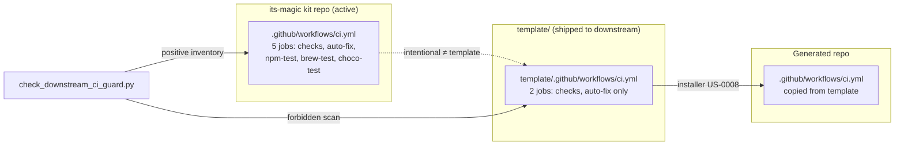
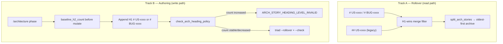
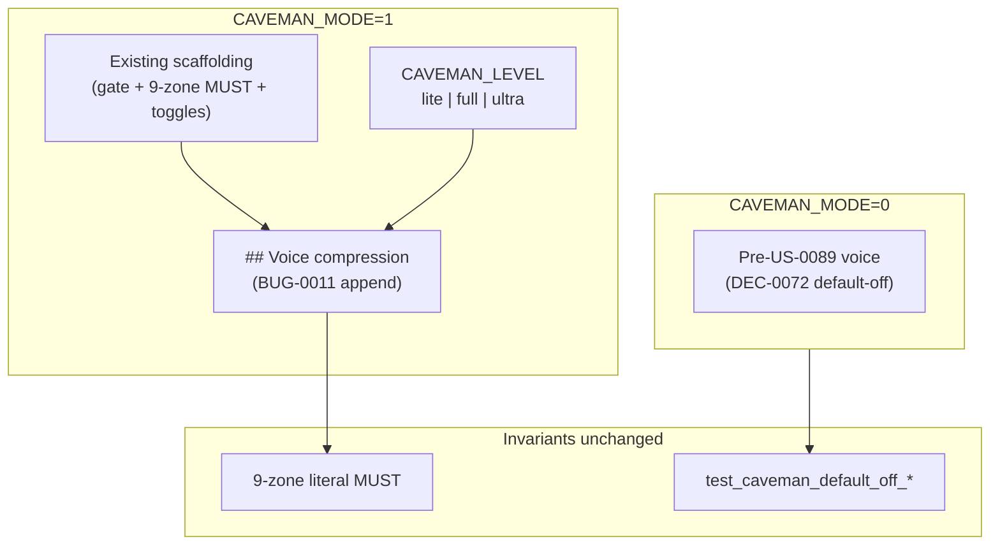
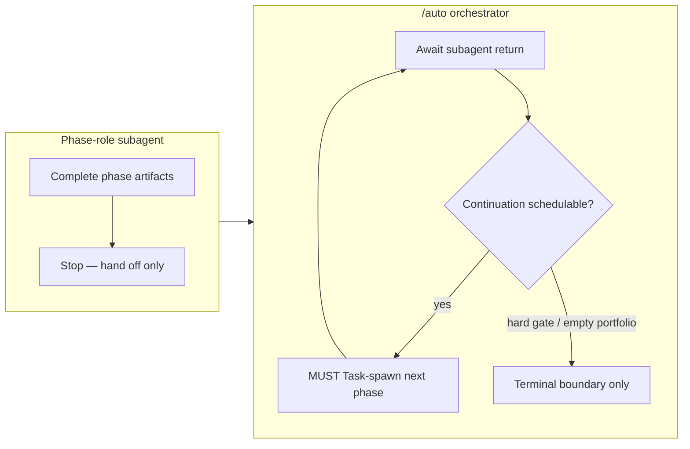

## US-0080 — Auto quiet mode

Story US-0080 — Auto quiet mode. `AUTO_QUIET=1` suppresses non-essential stdout; angle-distinct from `TOKEN_PROFILE` (US-0072 / US-0080 shared runbook anchor). See `# US-0117`. Binding: DEC-0035; runbook `## Context compaction and token profile mode (US-0053 / DEC-0035)` L550 h2 + `### Auto quiet mode` L570 h3.

## US-0081 — Caveman mode

Story US-0081 — Caveman mode. `CAVEMAN_MODE=1` / `CAVEMAN_LEVEL=<n>` engages compressed-output operator mode; `CAVEMAN_LEVEL_UNKNOWN` reason code on invalid level. See `# US-0117`. Binding: DEC-0073; runbook `## Caveman mode (US-0089)` L2032 h3 (note: runbook h2 uses US-0089 id colliding with US-0081 family — US-0081 owns the caveman-mode feature; US-0089 owns auto orchestration; `/architecture` locks the resolution).

## US-0082 — Codebase map (bootstrap mechanism)

Story US-0082 — Codebase map bootstrap mechanism. **Label correction**: authoritative label = "Codebase map" (per runbook L63 + DEC-0065; spec handoff's "Input compression" is a mislabel). `CODEBASE_MAP_REFRESH_ON_ROLLOVER=1` (default off) triggers `scripts/materialize_codebase_map.py` on rollover. See `# US-0117` and `## US-0076`. Binding: DEC-0065; runbook `## Codebase map bootstrap (US-0082 / DEC-0065)` L63 h2.

## US-0083 — Scratchpad delivery keys

Story US-0083 — Scratchpad delivery keys. `AUTO_DELIVERY_ROUTING` net-new key + cross-link to US-0114 for `DELIVERY_MODE` + `DELIVERY_MODE_SWITCH_MID_STORY` reason code. See `# US-0117` and `## US-0078`. Binding: DEC-0067 / DEC-0060; runbook `## Interactive intake evidence validation (US-0078 / DEC-0060 / US-0083 / DEC-0067)` L479 h2 + `### Scratchpad delivery keys` L591 h3.

## US-0085 — Context fresh-context markers

Story US-0085 — Context fresh-context markers. `fresh_context_marker` is an isolation-evidence field (not a runtime toggle); `PHASE_CONTEXT_ISOLATION_MISSING` reason code on missing marker. See `# US-0117`. Binding: DEC-0029; runbook `## Phase-context isolation (US-0048 / DEC-0029)` L1628 h2.

## US-0087 — Full-autonomy mode

Story US-0087 — Full-autonomy mode. 18 net-new key rows (largest in family): `AUTO_FLOW_MODE` / `AUTO_IMPLEMENTATION_LOOP` / `AUTO_LOOP_MAX_CYCLES` / `AUTO_BLOCK_RETRY_MAX` / `RELEASE_PUBLISH_MODE` / `CROSS_MODEL_REVIEW` / `CROSS_MODEL_ANTISLOP_THRESHOLD` / `CROSS_MODEL_REWORK_MAX` / `SOVEREIGN_MEMORY` + family (5) / `AUTO_SOVEREIGN` + family (4) / `SOVEREIGN_GOAL_MODE` + `BLOCK_RETRY_CAP_EXHAUSTED` / `NATIVE_CHAIN_UNAVAILABLE` reason codes. See `# US-0117`. Binding: DEC-0078; runbook `## Full-autonomy mode (US-0087 / DEC-0078)` L1809 h2 + `### Full-autonomy interaction` L1958 h3.

## US-0088 — Automation modes

Story US-0088 — Automation modes. 9 net-new keys: `AUTO_BACKLOG_DRAIN` / `AUTO_BACKLOG_MAX_STORIES` / `AUTO_BACKLOG_ON_BLOCK` / `AUTO_STORY_SELECTION` / `AUTO_EXECUTE_BULK` / `AUTO_EXECUTE_MAX_ITEMS` / `AUTO_EXECUTE_ON_BLOCK` / `AUTO_EXECUTE_SELECTION` / `AUTO_TEAM_SCOPE_ENFORCE` + `BLOCK_RETRY_CAP_EXHAUSTED` reason code. See `# US-0117`. Binding: DEC-0078; runbook `## Automation modes (US-0088)` L1838 h2.

## US-0089 — Auto orchestration

Story US-0089 — Auto orchestration. **US-id collision resolution**: authoritative label = "Auto orchestration" (per scratchpad L21/L135 + 18-feature family; runbook h2 `## Caveman mode (US-0089)` L2032 is a US-id collision — US-0089 in the 18-feature family is Auto orchestration, NOT Caveman mode). 2 net-new keys: `AUTO_PAUSE_REQUEST` / `AUTO_REMOTE_AUTOMATION_PROFILE`. See `# US-0117`. Forward-link **`BUG-0011`** / **`DEC-0077`** (Caveman voice-compression delivery; see `# US-0089` §6 below). Binding: DEC-0078; runbook `### Auto orchestration` L1398 h3 + `## Automation modes (US-0088)` L1838 h2.

## US-0090 — Caveman input compression

Story US-0090 — Caveman input compression. **Label correction**: authoritative label = "Caveman input compression" (per runbook L2099 + DEC-0073; spec handoff's "Phase governance integration" is a mislabel — "phase governance integration" is the umbrella's introductory framing AC-1, not a separate `#### US-0090` subsection). 2 net-new keys: `CAVEMAN_COMPRESS_INPUT` / `CAVEMAN_FILE_SCOPE` + `CAVEMAN_COMPRESS_SCOPE_EMPTY` reason code. See `# US-0117`. Binding: DEC-0073; runbook `### Caveman input compression` L2099 h3. See `# US-0085` for context fresh-context markers.

## US-0103 — Sovereign loop ledger (DC-1, from US-0113)

Story US-0103 — Sovereign loop ledger. Append-only sovereign-loop event log (`sovereign_loop_lib.py` advance/drain-generate/notification); default-off `AUTO_SOVEREIGN` (US-0107) composes on this. See `# US-0113`. Binding: DEC-0103; research R-0089.

## US-0104 — Cross-model critic (DC-1, from US-0113)

Story US-0104 — Cross-model critic. `CROSS_MODEL_REVIEW` / `CROSS_MODEL_ANTISLOP_THRESHOLD` / `CROSS_MODEL_REWORK_MAX` keys; cross-model review dispatch with antislop threshold + bounded rework. See `# US-0113`. Binding: DEC-0104; research R-0092.

## US-0105 — Convergence gate (DC-1, from US-0113)

Story US-0105 — Convergence gate. `evaluate_convergence` five-conjunct gate + `goal_progress` emission; composes on US-0103 ledger. See `# US-0113`. Binding: DEC-0105; research R-0093.

## US-0107 — Sovereign loop mode (DC-1, from US-0113)

Story US-0107 — Sovereign loop mode. Default-off `AUTO_SOVEREIGN` orchestrates sovereign-loop advance/drain-generate/notification; fail-closed goal-mode coupling; deferral JSONL v1 + validator. See `# US-0113`. Binding: DEC-0107; research R-0094.

## US-0110 — Goal-based convergence loops (DC-1, from US-0113)

Story US-0110 — Goal-based convergence loops. Five-conjunct `evaluate_convergence`, `goal_progress` emission, partial-delivery report; composes on US-0103 / US-0105. See `# US-0113`. Binding: DEC-0110; research R-0091.

## US-0041 — Release notes derivation (DC-2, from US-0114)

Story US-0041 — Release notes derivation. Atomic `[Unreleased] -> [semver]` promotion via `release_changelog_lib.promote_unreleased()`; release-trigger-driven changelog derivation. See `# US-0114`. Binding: DEC-0041.

## US-0062 — Sync policy + auto-push allowlist (DC-2, from US-0114)

Story US-0062 — Sync policy + auto-push allowlist. `SYNC_POLICY_MODE=disabled` (DEC-0018 default); `AUTO_PUSH_BRANCH_ALLOWLIST` gated sync; release-publish-mode contract. See `# US-0114`. Binding: DEC-0062 / DEC-0018.

## US-0034 — Cross-repo compatibility observability (DC-3, from US-0115)

Story US-0034 — Cross-repo compatibility observability. Monitored sources, manifest contract boundaries, compatibility signal taxonomy, critical-gate policy (`COMPATIBILITY_GATE_ON_CRITICAL`). Default-off (`CROSS_REPO_OBSERVABILITY=0`). See `# US-0115`. Binding: DEC-0034.

## US-0084 — Codebase map freshness gate (DC-3, from US-0115)

Story US-0084 — Codebase map freshness gate. Freshness gate on `docs/engineering/codebase-map.md`; `CODEBASE_MAP_REFRESH_ON_ROLLOVER` default off. See `# US-0115` and `## US-0082`. Binding: DEC-0065.

## US-0086 — Handoff hygiene validator (DC-3, from US-0115)

Story US-0086 — Handoff hygiene validator. `scripts/check_handoff_hygiene.py` validates handoff files against schema; fail-closed on missing/malformed. See `# US-0115`. Binding: DEC-0086.

# US-0091: README ↔ backlog feature coverage backfill + blocking drift gate

## Overview

**Composes on `# US-0077`** (dual-README audience — **`DEC-0059`**) and **extends the
release doc-gate family** alongside **US-0030** (delta-driven command/flag documentation
gate). Binding decision: **`DEC-0074`**. Composes on **`US-0017`** template drift guard and
**`US-0071`** installer parity surfaces. Release changelog artifacts include
`{semver}-release-notes.md` and **`CHANGELOG.md`** per **`DEC-0085`**.

## Decision linkage

- Decision: **`DEC-0074`**
- Composed: **`US-0030`**, **`DEC-0059`**, **`US-0017`**, **`US-0071`**

# US-0093: Cursor browser-integrated UAT self-test

## Overview

**`US-0093`** closes the execution gap left by **`US-0092`** / **`DEC-0078`**: stdlib
**`scripts/uat_probe_lib.py`** classifies browser steps but Tier 2 agent execution owns
Cursor built-in browser MCP. Binding decision: **`DEC-0079`**. Research anchor:
**`R-0041`**. Composes on **`# US-0092`** / **`DEC-0078`**, **`US-0065`**, **`US-0066`**
— spawn-only (**`BUG-0006`**) unchanged; stdlib never invokes browser MCP directly.

## Agent-browser evidence contract

Normative verify-work / qa / execute subsections require agents to write
**`browser_evidence_refs`** after MCP probes. Scratchpad key **`UAT_BROWSER_PROBE_MODE`**
selects primary path (`cursor` | `http_fallback` | `playwright_fallback`); fail closed on
**`UAT_BROWSER_UNAVAILABLE`** when MCP is missing.

## Decision linkage

- Decision: **`DEC-0079`**
- Composed: **`DEC-0078`**, **`US-0092`**, **`US-0065`**
- Research: **`R-0041`**

## US-0096 — Active context handoff / lean memory (DC-3, from US-0115)

Story US-0096 — Active context handoff. `LEAN_MEMORY_*` family (DEC-0082) for memory-layer mechanics; delivery-mode-aware handoff shape. See `# US-0115`. Binding: DEC-0082.

## US-0101 — Model tier resolution (DC-3, from US-0115)

Story US-0101 — Model tier resolution. Resolves model tier per role + delivery mode; composes on US-0102 catalog. See `# US-0115`. Binding: DEC-0101.

## US-0102 — Role-based model catalog (DC-3, from US-0115)

Story US-0102 — Role-based model catalog. Role-based model catalog presets shipped on install/upgrade (US-0112); `model-catalog.local.example.*.json` framework files. See `# US-0115`. Binding: DEC-0102.

## US-0092 — Delivery confirmation gate / full-autonomy outer driver (DC-4, from US-0116)

Story US-0092 — Delivery confirmation gate. Full-autonomy outer driver + security posture; delivery confirmation gate at end of drain. See `# US-0116`. Binding: DEC-0078.

## US-0095 — Native in-chat auto-chain (DC-4, from US-0116)

Story US-0095 — Native in-chat auto-chain. Native in-chat auto-chain continuation; orchestrator continuation contract. See `# US-0116`. Binding: DEC-0080 / DEC-0081.

## US-0098 — Dev environment auto-launch (DC-4, from US-0116)

Story US-0098 — Dev environment auto-launch. `DEV_AUTO_LAUNCH_PROFILE` / `DEV_ENVIRONMENT_CONFIG` keys; execute-phase runtime gate (default-off). See `# US-0116`. Binding: DEC-0084.

## US-0099 — Dev-environment copy-when-missing bootstrap (DC-4, from US-0116)

Story US-0099 — Dev-environment copy-when-missing bootstrap. Install-time bootstrap (copy-when-missing, runs only on `missing` / `upgrade` / `postinstall`); `DEV_ENV_BOOTSTRAP_*` family + `DEV_ENV_PROFILE_MISSING` reason codes. See `# US-0116`. Binding: DEC-0084.


## US-0118 — Work-kind classification + tiered delivery routing per story

### Overview

**US-0118** is the first **code-bearing** story in the new drain (US-0113..US-0117 were documentation-only). It introduces a deterministic **per-story work-kind classifier** `scripts/work_kind_classify_lib.py:classify_work_kind(story_prose, acceptance_criteria, touched_file_hints, component_scope) -> WorkKindClassification` returning `work_kind ∈ {doc, mini, code}` + `recommended_delivery_mode ∈ {standard, ultra_lean, mega_quick}` + `recommended_phase_plan` (list of canonical phase ids) + `rationale` + `evidence_refs` (+ optional `rule_trace` via `--explain`). Gated by a new default-off scratchpad flag `WORK_KIND_ROUTING=0|1` (zero overhead when off — early-return in `/auto` `resolve_delivery_mode` step 0 + `/intake` step 5 skip when `WORK_KIND_ROUTING != "1"`). Backlog rows gain optional `work_kind` + `recommended_delivery_mode` fields set at intake (operator accept/override; recorded in intake evidence bundle per US-0078 / DEC-0060). `/auto` `resolve_delivery_mode` step 0 consumes them when `DELIVERY_MODE`/`AUTO_PHASE_*` are unset (L8 precedence: explicit `DELIVERY_MODE` > explicit `AUTO_PHASE_*` > `WORK_KIND_ROUTING`-derived > current default; `start-from` always wins). `doc` → `[intake, execute, release]`; `mini` → `ultra_lean` or `mega_quick` (US-0096 eligibility); `code` → `standard`. Reuses `scripts/dev_environment_lib.py:classify_touched_files()` (tier A/B/C + `TIER_C_SKIP_PREFIXES`) — import, do not reinvent (Q9 LOCKED). Deterministic pure-stdlib, no LLM, no network, no `.env` reads (Q3 LOCKED). Four `WORK_KIND_*` reason codes (Q2 LOCKED). 12 `test_us0118_*` contract test markers (Q4 LOCKED). New `### Work-kind routing keys (US-0118)` README sub-block (Q5 LOCKED — 6th sibling; README edits happen in `/execute`, NOT here) + new `## Work-kind routing (US-0118)` runbook h2 (Q7 LOCKED). Triple-installer parity (Q10/installer manifest).

**Binding decision**: **companion_dec=DEC-0118** (Required → Accepted; authored in THIS phase). US-0118 introduces a new routing primitive — DEC-0118 locks: (a) the work-kind enumeration decision (`doc`/`mini`/`code` 3-tier; alternatives: 2-tier doc/non-doc collapsed — rejected as too coarse; 4-tier doc/mini/standard/extended — rejected as over-engineered), (b) the L8 precedence chain (explicit operator flags always win; classifier fills only the unset case), (c) the `dev_environment_lib.classify_touched_files` reuse boundary (import, not rewrite — Q9 LOCKED), (d) the zero-overhead-when-off contract (default `WORK_KIND_ROUTING=0`). Mirrors DEC-0082 (US-0096 delivery modes) / DEC-0052 (US-0070 phase selection) precedent. **Research anchor**: **R-0106** (delivered 2026-07-04T20:00:00Z, 10/10 open questions Q1..Q10 closed LOCKED; architecture seeds T-anch + T-001..T-009 within SPRINT_MAX_TASKS=12; AC baselines green; risks R1..R8 finalized). **Compose guards (non-negotiable, 23 — UNCHANGED, cumulative across all prior stories — same 23 as US-0117)**: US-0091, US-0097, US-0017, US-0040, US-0100, US-0101, US-0102, US-0103, US-0104, US-0105, US-0107, US-0108, US-0109, US-0110, US-0111, US-0112, US-0034, US-0084, US-0086, US-0093, US-0096, US-0041, US-0062. **Status authority**: **OPEN** per **US-0045** (closure at `/release`).

**Fresh context marker**: `tl-US0118-architecture-20260704T203000Z-fresh`
**Orchestrator run id**: `auto-20260704-01`
**Timestamp**: 2026-07-04T20:30:00Z (UTC)
**Verdict**: PASS
**Next**: `/sprint-plan`


### Companion DEC

**companion_dec = DEC-0118** (Required → Accepted; authored in THIS phase at `decisions/DEC-0118.md`). US-0118 introduces a new routing primitive (per-story work-kind classifier) with a precedence-chain tradeoff (L8: explicit `DELIVERY_MODE` > explicit `AUTO_PHASE_*` > `WORK_KIND_ROUTING`-derived > current default) and a work-kind enumeration tradeoff (`doc`/`mini`/`code` 3-tier vs alternative 2-tier or 4-tier schemes). Mirrors DEC-0082 (US-0096 delivery modes) / DEC-0052 (US-0070 phase selection) precedent: a new routing primitive gets a companion DEC locking the precedence chain + enumeration choice + reuse boundary + zero-overhead-when-off contract. The DC-1+DC-2+DC-3+DC-4 resolution (36 h1 anchors) was already performed in US-0117's `/architecture` phase (final deferred-candidate resolution point) — US-0118 inherits a clean deferral register. See `decisions/DEC-0118.md` for the decision body.

### Approach locked (A1)

**Approach A1** (locked): Single `### Work-kind routing (US-0118)` umbrella section + per-feature subsections + 6th scratchpad ref sub-block `### Work-kind routing keys (US-0118)` as a sibling to the US-0113..US-0117 sub-blocks (US-0113 L2421, US-0114 L2545, US-0115 L2617, US-0116 L2765, US-0117 L2856). US-0118 is the **6th-story cumulative byte-stability surface** — first 6-cumulative-surface story. Prior 5 released blocks (US-0113..US-0117) must remain byte-identical between `its_magic/README.md` and `template/its_magic/README.md`; US-0118 adds net-new-keys-only + cross-link-pointers + reason-code-only entries to its own 6th sub-block, never edits prior released blocks. README edits happen in `/execute` (build+verify macro), NOT here — this phase only PROPOSES the sub-block name + cross-link targets in prose.

| Option | Summary | Verdict |
|--------|---------|---------|
| **A1** | **Single `### Work-kind routing (US-0118)` umbrella + per-feature subsections + 6th scratchpad ref sub-block** (net-new keys + cross-link pointers + reason-code-only) | **Preferred** — matches US-0113 / US-0114 / US-0115 / US-0116 / US-0117 sibling precedent (6th sibling); preserves byte-stability of prior 5 released blocks. |
| A2 (rejected) | Extend `### Delivery & lifecycle keys` (US-0116) sub-block with `WORK_KIND_ROUTING` key. | **Rejected** — breaks US-0116's byte-stability (released block in S0116); Q5 LOCKED rejected this alternative explicitly. |
| A3 (rejected) | 2-tier work-kind enumeration (`doc`/`non-doc`) collapsed; or 4-tier (`doc`/`mini`/`standard`/`extended`). | **Rejected** — 2-tier too coarse (conflates `mini` and `code`); 4-tier over-engineered (no operator demand for `extended`); 3-tier mirrors `dev_environment_lib.classify_touched_files` tier A/B/C precedent. |


### Files to touch

- `scripts/work_kind_classify_lib.py` — **NEW**. Pure-stdlib classifier exposing `classify_work_kind(story_prose, acceptance_criteria, touched_file_hints, component_scope) -> WorkKindClassification` dataclass (Q10 LOCKED signature). Implements doc/mini/code rules per L5/L6/L7 + Q1 tie-break (highest tier wins). `--explain` flag emits `rule_trace` (Q3). `--self-test` exits 0 (AC-12). Imports `TIER_C_SKIP_PREFIXES` + `classify_touched_files` from `dev_environment_lib` (Q9 LOCKED import contract — no duplication).
- `scripts/installer.py` (or `/auto` orchestrator) — `resolve_delivery_mode` step 0 minimal hook (early-return when `WORK_KIND_ROUTING != "1"`; precedence clause per L8). T-004.
- `its_magic/README.md` — **NEW** `### Work-kind routing (US-0118)` umbrella section + per-feature subsections + `### Work-kind routing keys (US-0118)` 6th scratchpad ref sub-block (Q5 LOCKED — 6th sibling; net-new keys + cross-link pointers + reason-code-only; never edits prior US-0113..US-0117 blocks). T-007. (Edits happen in `/execute`, NOT here.)
- `template/its_magic/README.md` — one-way byte-sync of `its_magic/README.md`. T-007/T-004.
- `tests/us0118_contract_test.py` (or `tests/work_kind_classify_test.py` per R-0106) — **NEW**. 12 `test_us0118_*` markers (Q4 LOCKED). T-006.
- `docs/engineering/runbook.md` — **NEW** `## Work-kind routing (US-0118)` h2 cross-link section (Q7 LOCKED). Content: `WORK_KIND_ROUTING` flag, L8 precedence, operator recipe (force full lifecycle on `doc` story via `DELIVERY_MODE=standard`), `--explain` usage, four `WORK_KIND_*` reason codes. T-008.
- `template/docs/engineering/runbook.md` — parity one-way copy of runbook h2.
- `.cursor/scratchpad.md` — **NEW** `WORK_KIND_ROUTING=0` key (default off) + `WORK_KIND_*` reason-code family (example scratchpad only — canonical scratchpad edits deferred to `/execute`). T-002.
- `template/.cursor/scratchpad.local.example.md` — mirror of `WORK_KIND_ROUTING` row.
- `.cursor/commands/auto.md` — `resolve_delivery_mode` step-0 precedence clause (L8 chain). T-002/T-004.
- `.cursor/commands/intake.md` — step-5 classifier hook (after ACs drafted, after US-0051 decomposition evaluator, before persistence). T-003.
- `template/.cursor/commands/auto.md` + `template/.cursor/commands/intake.md` — parity one-way copy (when template mirrors commands).
- `handoffs/intake_evidence/*.json` — schema extension: 3 new optional fields `work_kind`, `recommended_delivery_mode`, `work_kind_operator_decision ∈ {accept, override}` (Q9 LOCKED). T-003.
- `installer-owned-paths.manifest` — `[install_include_paths]` rows for `scripts/work_kind_classify_lib.py` + `template/scripts/work_kind_classify_lib.py`. T-009.
- `scripts/check_intake_template_parity.py` — `WORK_KIND_ROUTING_PAIRS` manifest constant + `--scope=work-kind-routing` flag (Q6 LOCKED). T-009.
- `decisions/DEC-0118.md` — **NEW** companion DEC (authored in THIS phase).
- `docs/engineering/architecture.md` — **this `## US-0118` section** (T-anch; authored in THIS phase).

### Files NOT to touch

- `docs/product/backlog.md` — US-0045 status authority; release-only. (US-0118 remains OPEN until `/release`. Backlog row fields `work_kind` / `recommended_delivery_mode` are added per-story at intake time only when `WORK_KIND_ROUTING=1` and operator accepts — this is a schema extension, NOT a bulk edit of existing rows. No forced reclassification of existing rows.)
- `docs/product/acceptance.md` — release-only.
- Prior-released US-0113..US-0117 README blocks (`### Sovereign-loop era` L940 + `### Sovereign-loop era keys` L2421 / `### Release & distribution` L1225 + `### Release & distribution keys` L2545 / `### Integration & observability` L1410 + `### Integration & observability keys` L2617 / `### Delivery & lifecycle` L1665 + `### Delivery & lifecycle keys` L2765 / `### Phase & role governance` + `### Phase & role governance keys` L2856) in `its_magic/README.md` — **byte-stability contract** (all 5 already released in S0113..S0117). US-0118 adds cross-link pointers to these blocks from its own 6th sub-block; it never edits them. Execute-phase must verify `git diff HEAD -- its_magic/README.md` shows pure addition in the post-L2856 range (no removals/modifications to US-0113's L2421, US-0114's L2545, US-0115's L2617, US-0116's L2765, or US-0117's L2856 blocks).
- `scripts/sovereign_loop_lib.py` — compose-do-not-amend (US-0103 read-only consumer).
- `scripts/sovereign_convergence_lib.py` — compose-do-not-amend (US-0105 read-only consumer).
- `scripts/dev_environment_lib.py` — **REUSE only — do not modify**. Import `classify_touched_files` + `TIER_C_SKIP_PREFIXES` from `dev_environment_lib` (Q9 LOCKED import contract). Contract test `test_us0118_classify_touched_files_reuse` enforces the import boundary.
- `tests/scratchpad_example_parity_test.py` — AC-8 regression baseline; forbid edits.
- Compose-guard stories (23 — US-0091, US-0097, US-0017, US-0040, US-0100..US-0112, US-0034, US-0084, US-0086, US-0093, US-0096, US-0041, US-0062) — read-only consumers; additive-only.


### Sprint seeds (T-anch + T-001..T-009 — 10 tasks within SPRINT_MAX_TASKS=12)

| Task | AC | Description | Role |
|------|----|-------------|------|
| **T-anch** | AC-10 | Add `## US-0118` h1 anchor to `docs/engineering/architecture.md` (per US-0118 h1-anchor policy; mirrors `## US-0113`..`## US-0117` format). Verify compose-do-not-amend: US-0096, US-0070, US-0078, US-0051, US-0069, US-0103 surfaces remain read-only (no edits to their architecture sections). Lock the import contract for `dev_environment_lib.classify_touched_files` reuse (Q9 boundary). | B |
| **T-001** | AC-1 / AC-2 | Create `scripts/work_kind_classify_lib.py` exposing `classify_work_kind(story_prose, acceptance_criteria, touched_file_hints, component_scope) -> WorkKindClassification` per Q10 signature. Pure stdlib; import `TIER_C_SKIP_PREFIXES` + `classify_touched_files` from `dev_environment_lib` (no duplication — Q9). Implement the three rules (doc/mini/code) per L5/L6/L7 + Q1 tie-break (highest tier wins). Implement `--explain` flag emitting `rule_trace` (Q3). Implement `--self-test` (AC-12) exiting 0. | B |
| **T-002** | AC-3 / AC-6 | Add `WORK_KIND_ROUTING=0` (default off) to `.cursor/scratchpad.md` + `template/.cursor/scratchpad.local.example.md` with merge-precedence note (US-0078 model B: local > materialized baseline > example). Document the L8 precedence chain in `.cursor/commands/auto.md` `resolve_delivery_mode` step 0. (README scratchpad reference sub-block `### Work-kind routing keys (US-0118)` is added in T-007, not here.) | B |
| **T-003** | AC-4 / AC-5 | Extend `/intake` step 5 to run the classifier when `WORK_KIND_ROUTING=1` (after ACs drafted, after US-0051 decomposition evaluator, before persistence). Present `work_kind` + `recommended_delivery_mode` to operator for accept/override (Q9). Persist choice in backlog row (`- work_kind`, `- recommended_delivery_mode`) + intake evidence bundle (`work_kind`, `recommended_delivery_mode`, `work_kind_operator_decision`). US-0078 evidence gate still runs before any backlog/acceptance write. | B |
| **T-004** | AC-6 | `/auto` `resolve_delivery_mode` step-0 integration: add precedence clause to `.cursor/commands/auto.md`: when `WORK_KIND_ROUTING=1` AND backlog row carries `work_kind` AND `DELIVERY_MODE` unset AND `AUTO_PHASE_*` unset → derive `resolved_phase_plan` from `recommended_delivery_mode`. Explicit `DELIVERY_MODE` / `AUTO_PHASE_*` / `start-from` always win (L8). Early-return when `WORK_KIND_ROUTING != "1"` (zero overhead — Q8). | B |
| **T-005** | AC-7 | Emit the four `WORK_KIND_*` reason codes (Q2) with remediation prose in `sprints/Sxxxx/qa-findings.md` / `release-findings.md`. `WORK_KIND_ROUTING_DISABLED` is info-only (not fail-closed); the other three are fail-closed. | B |
| **T-006** | AC-9 | Create `tests/work_kind_classify_test.py` (or `tests/us0118_contract_test.py`) with the 12 `test_us0118_*` markers enumerated in Q4. Active + `template/` parity for the new script + scratchpad lines. | B |
| **T-007** | AC-3 | Add `### Work-kind routing keys (US-0118)` sub-block to `its_magic/README.md` `### Full scratchpad reference (detailed)` (after the US-0117 `### Phase & role governance keys` block L2856) — documents `WORK_KIND_ROUTING` key + four reason codes + cross-link pointer to `### Release & distribution keys` for `DELIVERY_MODE` precedence. One-way copy to `template/its_magic/README.md`. Verify `PARITY_OK <size> <size>`. (README edits happen in `/execute`, not `/architecture`.) | B |
| **T-008** | AC-11 | Append `## Work-kind routing (US-0118)` h2 to `docs/engineering/runbook.md` (Q7) + `template/docs/engineering/runbook.md` parity. Content: `WORK_KIND_ROUTING` flag, L8 precedence, operator recipe (force full lifecycle on `doc` story via `DELIVERY_MODE=standard`), `--explain` usage, four reason codes. | B |
| **T-009** | AC-9 / AC-12 | Add `tests/work_kind_classify_test.py` to the active test suite; verify 4-prior pytest still green. Add `scripts/work_kind_classify_lib.py` + `template/scripts/work_kind_classify_lib.py` to `installer-owned-paths.manifest` `[install_include_paths]` (Q10/installer parity — triple-installer PS1/Bash/Python ships the new script). Add `WORK_KIND_ROUTING_PAIRS` to `scripts/check_intake_template_parity.py` + `--scope=work-kind-routing` flag (Q6). | B |

**Execution order**: T-anch → T-001 → T-002 → T-003 → T-004 → T-005 → T-006 → T-007 → T-008 → T-009. Acyclic. (T-anch first because it is on `architecture.md`, not `its_magic/README.md` — keeps the README byte-stability surface clean for T-001..T-007.)

**Total task seeds: 10 (T-anch + T-001..T-009) — within `SPRINT_MAX_TASKS=12`.** `/sprint-plan` may merge or split within the 12-task budget.


### Test markers (12 — from R-0106 Q4 LOCKED)

`test_us0118_doc_kind_routes_to_lean_plan`, `test_us0118_mini_kind_routes_to_ultra_lean`, `test_us0118_mini_kind_routes_to_mega_quick_when_eligible`, `test_us0118_code_kind_routes_to_standard`, `test_us0118_explicit_delivery_mode_wins_over_work_kind`, `test_us0118_auto_phase_wins_over_work_kind`, `test_us0118_routing_off_is_noop`, `test_us0118_classify_touched_files_reuse`, `test_us0118_intake_evidence_records_work_kind`, `test_us0118_reason_codes_preserved`, `test_us0118_default_off_zero_overhead`, `test_us0118_explain_emits_rule_trace` (in `tests/work_kind_classify_test.py` per R-0106 Q4; or `tests/us0118_contract_test.py` — name finalized in `/sprint-plan`).

Plus the regression baseline marker: `tests/scratchpad_example_parity_test.py` (4 tests — BUG-0013 parity baseline; do not weaken).

### Compose guards UNCHANGED (23 cumulative — same 23 as US-0117)

US-0118 is a code-bearing story but lives entirely **additive** to the compose surface — it adds a new flag (`WORK_KIND_ROUTING`), a new lib (`work_kind_classify_lib.py`), new backlog row fields, a new precedence clause, a new README sub-block, and a new runbook h2. It does **not** amend any existing compose-surface feature. The 23 compose guards (cumulative across all prior stories — US-0118 adds no new family-internal guards because US-0118 is itself a single-feature story, not a family umbrella) remain UNCHANGED:

US-0091, US-0097, US-0017, US-0040, US-0100, US-0101, US-0102, US-0103, US-0104, US-0105, US-0107, US-0108, US-0109, US-0110, US-0111, US-0112, US-0034, US-0084, US-0086, US-0093, US-0096, US-0041, US-0062.

**Does US-0118 itself become a NEW compose guard?** **NO.** US-0118 is a **routing primitive**, not a compose-surface guard. The 6 read-only compose consumers (US-0096 / US-0070 / US-0078 / US-0051 / US-0069 / US-0103) consume US-0118's output; they are not amended by it. Adding US-0118 to the compose-guard list would conflate a routing primitive with a guard — rejected. US-0118's contract is enforced by its own 12 `test_us0118_*` markers + the `WORK_KIND_ROUTING=0` zero-overhead-when-off contract (test `test_us0118_default_off_zero_overhead`).

### DC (deferred-candidate) resolution

`dc_check=clean`. `grep "^## US-0118" docs/engineering/architecture.md` prior to this phase → **no matches**. The `## US-0118` h1 anchor is **added in THIS `/architecture` phase** (per R-0105 Q-2 LOCKED pattern — architecture artifacts live in `architecture.md`, not in `/execute`; T-anch in the sprint seeds is the resolution point). 

Cross-check against the full US-xxxx list in `docs/product/backlog.md`: no OTHER deferred `## US-xxxx` anchors remain unresolved. US-0117 was the **final deferred-candidate resolution point** (36 `## US-xxxx` h1 anchors added in US-0117's `/architecture` phase — 18 own + 18 deferred DC-1..DC-4); the deferral register is clean. US-0118 inherits no DC candidates from prior stories. No new DC candidates are created by US-0118 (its own `## US-0118` anchor is resolved HERE, not deferred). Deferral register remains clean — no carry-over to a successor story.

### Compose, do not amend (verification — read-only consumers of US-0118)

| Story | README anchor | architecture.md anchor | Verification |
|-------|---------------|------------------------|--------------|
| US-0096 / DEC-0082 (delivery modes) | L2617 `### Integration & observability keys` (DELIVERY_MODE cross-link) + L2670 inline ref | `## US-0096` L1684 | ✓ exists — explicit `DELIVERY_MODE` still wins (L8); US-0118 only fills the unset case |
| US-0070 / DEC-0052 (phase selection) | L2856 `### Phase & role governance keys` (AUTO_PHASE_* canonical) | `## US-0070` L1572 | ✓ exists — `AUTO_PHASE_*` remains explicit override; classifier only fills the unset case |
| US-0078 / DEC-0060 (intake evidence) | L479 runbook `## Interactive intake evidence validation` | `## US-0078` L1596 | ✓ exists — evidence gate still runs before any write (L10); classifier proposal + operator decision recorded in evidence bundle |
| US-0051 (decomposition) | L371 runbook `## Intake decomposition and risk-aware questioning` | (no h1 anchor) | ✓ exists — classifier runs after the decomposition evaluator (L10) |
| US-0069 / DEC-0051 (phase→role matrix) | L2856 `### Phase & role governance keys` | `## US-0069` L1568 | ✓ exists — classifier only selects which phases run, not who runs them |
| US-0103 (AI decision ledger) | L2421 `### Sovereign-loop era keys` | `## US-0103` L1640 | ✓ exists — read-only consumer for audit trail |

All 6 compose targets verified present (read-only consumers of US-0118 — their architectural surfaces are NOT edited by US-0118; additive-only: new flag, new lib, new row fields, new precedence clause, new sub-block, new runbook h2).


### Risks finalized (R1..R8 — promoted from R-0106)

| Risk | Severity | Mitigation |
|------|----------|------------|
| **R1** Classification ambiguity (mixed `docs/` + `src/` tiers) | **MEDIUM** | Q1 LOCKED: highest tier wins (`code` > `mini` > `doc`) per `classify_touched_files` tier_rank A>B>C. Single-pass deterministic. Contract test `test_us0118_code_kind_routes_to_standard` covers the mixed-tier case. |
| **R2** Precedence conflicts (`WORK_KIND_ROUTING=1` + `DELIVERY_MODE` set) | **MEDIUM** | L8 precedence chain LOCKED + `WORK_KIND_DELIVERY_MODE_CONFLICT` reason code (Q2). Explicit operator flags always win; classifier fills only the unset case. Contract test `test_us0118_explicit_delivery_mode_wins_over_work_kind` + `test_us0118_auto_phase_wins_over_work_kind`. |
| **R3** `mega_quick` eligibility overlap with `mini` | **LOW–MEDIUM** | L6 LOCKED: classifier recommends `mega_quick` only when US-0096 eligibility passes (AC≤3, no DEC, single component), else falls back to `ultra_lean`. Contract test `test_us0118_mini_kind_routes_to_mega_quick_when_eligible` + `test_us0118_mini_kind_routes_to_ultra_lean`. |
| **R4** Backward compatibility (existing backlog rows without `work_kind`) | **MEDIUM** | Q8 LOCKED: `WORK_KIND_ROUTING=0` default-off + early-return in `/auto` step 0 + `/intake` step 5 skip. No forced reclassification, no schema-migration. Contract test `test_us0118_default_off_zero_overhead`. |
| **R5** Operator trust (deterministic + inspectable) | **LOW–MEDIUM** | Q3 LOCKED: deterministic pure-stdlib + `--explain` flag emitting `rule_trace` (Q10). Contract test `test_us0118_explain_emits_rule_trace`. Operators can override with confidence. |
| **R6** Reuse boundary drift (`dev_environment_lib.classify_touched_files` rewritten vs imported) | **LOW** | Q9 LOCKED (in T-001): `work_kind_classify_lib.py` imports `TIER_C_SKIP_PREFIXES` + `classify_touched_files` from `dev_environment_lib` — no duplication. Contract test `test_us0118_classify_touched_files_reuse`. |
| **R7** Installer parity drift (triple-installer must ship new script) | **LOW** | T-009 adds both `scripts/work_kind_classify_lib.py` + `template/scripts/work_kind_classify_lib.py` to `installer-owned-paths.manifest` `[install_include_paths]`. Manifest-driven single source of truth. |
| **R8** Cross-story byte-stability surface (6th sub-block) — US-0118 is the first NEW story after the US-0113..US-0117 quint; it adds a 6th sub-block to `### Full scratchpad reference (detailed)`. Risk of accidentally editing a prior released block (US-0113 L2421 / US-0114 L2545 / US-0115 L2617 / US-0116 L2765 / US-0117 L2856). | **MEDIUM** | T-007 mandates net-new-keys-only + cross-link-pointer + reason-code-only shape; never edits prior released blocks. Execute-phase verifies `git diff HEAD -- its_magic/README.md` shows pure addition in the post-L2856 range (no removals/modifications to US-0113..US-0117 blocks). QA re-verifies. `PARITY_OK <size> <size>` authoritative end-to-end proof. Pattern now scales from quint to 6th story. |

### Stop conditions met

- **No DEC required beyond DEC-0118** — DEC-0118 authored in THIS phase (Required → Accepted; mirrors DEC-0082 / DEC-0052 precedent).
- **No feasibility unknown** — R-0106 closed all 10 discovery open questions Q1..Q10; approach A1 locked; sprint seeds T-anch + T-001..T-009 within SPRINT_MAX_TASKS=12; risks R1..R8 finalized; DC check clean.
- **No data migration risk** — `WORK_KIND_ROUTING=0` default-off + no forced reclassification of existing backlog rows (Q8 LOCKED). New `work_kind` / `recommended_delivery_mode` fields are optional; absence is valid.
- **Compose-do-not-amend verified** — all 6 compose targets (US-0096 / US-0070 / US-0078 / US-0051 / US-0069 / US-0103) verified present with existing `## US-xxxx` h1 anchors in `architecture.md`; US-0118 is additive-only.

**No DECISION_GATE raised.** Architecture phase revealed no question requiring operator input. DC check clean (no new DC candidates). Verdict: **PASS**.

### Sovereign memory note

`assemble_sovereign_memory_digest(...)` NOT called (US-0118 documentation-only so far — architecture phase writes prose + DEC only; existing digest context sufficient per R-0106 — S0113..S0117 retrospectives established the reusable patterns applied here: cross-link pointer pattern scales to 6th story; angle-distinct narrative pattern extends to the routing-primitive angle (distinct from prior 5 documentation-family angles); cross-story byte-stability contract now scales from quint to 6th story; DC anchor resolution pattern proven (US-0117 was the final deferred-candidate resolution point — US-0118 inherits a clean deferral register). No write to `mistakes.jsonl` in architecture phase.

### Consequences

- Sprint: S0118 (pending `/sprint-plan`).
- Status authority: **OPEN** per **US-0045**; closure at `/release`.
- New code surface: `scripts/work_kind_classify_lib.py` (NEW) + `tests/work_kind_classify_test.py` (NEW) + installer manifest rows.
- New doc surface: `## US-0118` h1 anchor in `architecture.md` (this section) + `### Work-kind routing keys (US-0118)` README sub-block (in `/execute`) + `## Work-kind routing (US-0118)` runbook h2 (in `/execute`).
- New scratchpad surface: `WORK_KIND_ROUTING=0` key + `WORK_KIND_*` reason-code family (in `/execute`).
- New command surface: `.cursor/commands/auto.md` precedence clause + `.cursor/commands/intake.md` step-5 hook (in `/execute`).
- New evidence schema: `work_kind` / `recommended_delivery_mode` / `work_kind_operator_decision` fields in `handoffs/intake_evidence/*.json` (in `/execute`).
- **`WORK_KIND_ROUTING=0` (default)**: zero overhead — `/auto` `resolve_delivery_mode` + `/intake` step 5 skip classifier entirely; existing backlog rows without `work_kind` route via current `DELIVERY_MODE`/`AUTO_PHASE_*` precedence (no forced reclassification).
- **`WORK_KIND_ROUTING=1`**: classifier runs at intake (after ACs) and at `/auto` step 0; `recommended_delivery_mode` derived from `work_kind` fills the unset case (L8 precedence); explicit operator flags always win.
- **23/23 compose guards UNCHANGED** (additive-only). 6 read-only compose consumers (US-0096 / US-0070 / US-0078 / US-0051 / US-0069 / US-0103) consume US-0118 output; not amended.
- DC resolution: `## US-0118` h1 anchor added in THIS phase (per R-0105 Q-2 LOCKED pattern); deferral register clean — no carry-over.

### Evidence references

- `docs/product/backlog.md` — `## US-0118` block (L3983–L4025, 12 ACs)
- `docs/product/acceptance.md` — US-0118 row L145 (12 ACs, OPEN)
- `docs/engineering/research.md` — `## R-0106` (delivered 2026-07-04T20:00:00Z, 10/10 open questions Q1..Q10 closed LOCKED; architecture seeds T-anch + T-001..T-009 within SPRINT_MAX_TASKS=12; companion DEC-0118 required; AC baselines green; risks R1..R8 finalized)
- `handoffs/po_to_tl.md` — research handoff (topmost block) + discovery handoff + intake handoff
- `docs/engineering/state.md` — research checkpoint (latest) + architecture checkpoint (this phase, appended)
- `handoffs/resume_brief.md` — top block updated to reflect architecture complete
- `scripts/dev_environment_lib.py` — `TIER_C_SKIP_PREFIXES` (L117–L125: `docs/`, `handoffs/`, `sprints/`, `decisions/`, `tests/`, `.cursor/commands/`, `template/docs/`) + `classify_touched_files` (L321–L339: tier A/B/C with `tier_rank={"A":3,"B":2,"C":1}`, highest matching tier wins) — reuse anchor (Q9 LOCKED import contract)
- `its_magic/README.md` — L2421 (US-0113 keys block — byte-stability preserved); L2545 (US-0114 keys block — byte-stability preserved); L2617 (US-0115 keys block — byte-stability preserved); L2765 (US-0116 keys block — byte-stability preserved); L2856 (US-0117 keys block — byte-stability preserved + insertion point for `### Work-kind routing keys (US-0118)` 6th sub-block in `/execute`)
- `docs/engineering/architecture.md` — h1 inventory confirmed: `## US-0069` L1568, `## US-0070` L1572, `## US-0078` L1596, `## US-0103` L1640, `## US-0096` L1684 exist (read-only consumers of US-0118); `## US-0118` added in THIS phase (appended below the existing `## US-0099` section)
- `decisions/DEC-0118.md` — companion DEC (authored in THIS phase)
- `.cursor/scratchpad.md` — `WORK_KIND_ROUTING` (new key, added in `/execute`); `DELIVERY_MODE` / `AUTO_PHASE_*` / `SPRINT_MAX_TASKS` (existing — grep anchors only)
- `.cursor/commands/auto.md` — `resolve_delivery_mode` step 0 (precedence clause added in `/execute`)
- `.cursor/commands/intake.md` — step 5 (classifier hook added in `/execute`)


### Isolation evidence (per US-0048 / DEC-0029)

- `phase_id=architecture`
- `role=tech-lead`
- `story_id=US-0118`
- `sprint_id=(pending — created at sprint-plan)`
- `orchestrator_run_id=auto-20260704-01`
- `delivery_mode=ultra_lean`, `macro_phase=plan` (architecture — second canonical phase of `plan` macro per US-0096 / DEC-0082; research + architecture + sprint-plan merged)
- `fresh_context_marker=tl-US0118-architecture-20260704T203000Z-fresh`
- `timestamp=2026-07-04T20:30:00Z` (UTC)
- `evidence_ref=docs/product/backlog.md (## US-0118 block L3983–L4025 narrow-read), docs/product/acceptance.md (US-0118 row L145 narrow-read), handoffs/intake_evidence/US-0118-intake.json (cross-reference only — not read this phase), handoffs/po_to_tl.md (US-0118 research handoff L5–L93 + discovery handoff L95–L193 + intake handoff L196–L231 narrow-read), docs/engineering/state.md (research checkpoint L197–L297 + discovery checkpoint L102–L196 + drain-advance breadcrumb L84–L101 narrow-read), docs/engineering/research.md (R-0106 entry L8754–L8904 full read), docs/engineering/architecture.md (grep ^## US- anchors + US-0117 section L1420–L1566 read as template + DC anchor verification L1568–L1710 + US-0099 last line L1710), scripts/dev_environment_lib.py (TIER_C_SKIP_PREFIXES L117–L125 + classify_touched_files L321–L339 narrow-read for Q9 import-contract lock), its_magic/README.md (grep ### .*keys anchors only — no full-read), decisions/DEC-0082.md (full read as DEC-0118 template), decisions/DEC-0052.md (full read as DEC-0118 template), docs/product/backlog.md (grep ^## US- anchors for DC cross-check), handoffs/resume_brief.md (top ~30 lines narrow-read for drain-advance prose shape)`
- Tech-lead subagent spawned fresh per BUG-0006 / US-0048 isolation; no prior chat history carried forward. Context limited to the narrow-read files listed above (US-0053 / US-0096 Tranche A). No MCP / browser / shell side-effects beyond narrow-read grep + read tool calls + python SHA-256 computation for the strict runtime proof + powershell line-count computations + the artifact writes listed in this phase (architecture.md `## US-0118` section append, decisions/DEC-0118.md NEW, po_to_tl.md architecture handoff prepend, state.md architecture checkpoint append, resume_brief.md drain-advance append). No `.env` reads, no credentials access, no intake-evidence mutation (read-only for this phase).
- `assemble_sovereign_memory_digest(...)` NOT called (US-0118 documentation-only so far — architecture phase writes prose + DEC only; existing digest context sufficient per R-0106 — S0113..S0117 retrospectives established reusable patterns; classifier code is built in `/execute`, not here).
- No write to `mistakes.jsonl` in architecture phase (no fix_failed / revert_applied / plan_fidelity_violation / scope_creep event occurred).
- Prior phase strict proof consumed: `rp-auto-20260704-01-research-techlead-20260704T200000Z-US-0118` (from `docs/engineering/state.md` research checkpoint L281–L285, unchanged).
- Current architecture-phase strict proof recorded below.

### Strict runtime proof (DEC-0038)

- **runtime_proof_id**: `rp-auto-20260704-01-architecture-techlead-20260704T203000Z-US-0118`
- **canonical_payload** (sorted-key JSON per DEC-0038): `{"orchestrator_run_id":"auto-20260704-01","phase_id":"architecture","proof_issued_at":"2026-07-04T20:30:00Z","proof_ttl_seconds":3600,"role":"tech-lead","runtime_proof_id":"rp-auto-20260704-01-architecture-techlead-20260704T203000Z-US-0118","sprint_id":"(pending)","story_id":"US-0118"}`
- **proof_hash**: `fd72d56bd8e8450cf830e3a4fa6164d5e3b98595c00fafa166ffd00669b1d3db` (SHA-256 of the sorted-key JSON payload above, computed via python `hashlib.sha256`)
- **proof_ttl_seconds**: 3600
- **proof_ttl**: 2026-07-04T21:30:00Z (1-hour TTL per DEC-0038, UTC = issued_at + 3600s)

### Decision gate

- `decision_gate=false` (no DECISION_GATE; no hard stop; companion DEC-0118 authored Accepted in THIS phase; approach A1 locked; sprint seeds T-anch + T-001..T-009 within SPRINT_MAX_TASKS=12; risks R1..R8 finalized; DC check clean; compose-do-not-amend verified 6/6)
- `stop_conditions_met=yes` (no missing references — all 6 compose targets verified; no decision gate triggered; AC baselines green: `validate_readme_feature_coverage.py` PASS + `pytest tests/scratchpad_example_parity_test.py` 4 passed)

### Next scheduled phase

- `next_scheduled_phase=/sprint-plan` (role=tech-lead per US-0069 / DEC-0051 phase→role matrix default; third canonical phase of `plan` macro per ultra_lean; research + architecture + sprint-plan merged into `plan` macro)
- `next_scheduled_role=tech-lead`
- `next_scheduled_sprint_macro=plan`
- `stop_condition=STOP after architecture completes; hand off via artifacts only to /sprint-plan in fresh tech-lead subagent (BUG-0006)`

---

## US-0119 — Autonomous-autonomy presets and configurable hard-stop relaxation

### Overview

US-0119 adds two orthogonal primitives on top of the existing sovereignty stack (US-0092 / US-0095 / US-0103 / US-0104 / US-0105 / US-0107):

1. **`AUTONOMY_PRESET={none|balanced|full}`** (default `none`) — an ergonomic scratchpad flag that deterministically expands into twelve per-feature autonomy flags (all of which already exist individually or are added here as net-new keys). Each preset bundles the combination an operator would otherwise configure manually. `AUTONOMY_PRESET=none` is byte-identical to pre-US-0119 behaviour.
2. **`AUTONOMY_STOP_POLICY={block|auto_repair_then_block|auto_repair_then_skip}`** (default `block`) — classifies every fail-closed reason code in `docs/engineering/autonomy-stop-matrix.md` as either `security_hard` (never auto-resolved under any preset / policy) or `autonomy_resolvable` (bounded auto-repair with an append-only ledger before escalation).

The two mechanisms compose: the preset controls *which* per-feature flags are flipped on; the stop policy controls *how* softened reason codes are handled at phase boundaries. Neither mechanism modifies the semantics of the underlying consumers — the preset is an expansion into existing keys, and the stop policy is a dispatch layer on top of existing reason-code emissions.

### Companion DEC

**`decisions/DEC-0119.md`** — authored in THIS architecture phase (status=Accepted). Locks:
- (a) `AUTONOMY_PRESET` 3-tier enumeration `none|balanced|full` (default `none`)
- (b) `AUTONOMY_STOP_POLICY` 3-value enumeration `block|auto_repair_then_block|auto_repair_then_skip` (default `block`)
- (c) Two-tier stop classification `security_hard|autonomy_resolvable`
- (d) `security_hard` rows never auto-repaired (bounded cap = 0 from matrix)
- (e) Nine `auto_repair_kind` taxonomy values from R-0107 Q2
- (f) Nine `autonomy_resolvable` reason codes per Q2 mapping
- (g) `autonomy_repair_kind` taxonomy + uniform cap = 3 per `(run, reason_code)` per Q3
- (h) `AUTONOMY_PRESET=none` is byte-identical to pre-US-0119
- (i) Twelve per-feature flags are additive consumers only (no existing consumer semantics change)
- (j) Precedence: explicit per-flag > preset expansion > scratchpad defaults

Mirrors DEC-0082 (delivery modes) / DEC-0078 (full-autonomy stop matrix) precedent.

### Approach A1 (LOCKED)

Single vertical-slice approach. No alternatives retained — 2-tier (`none|full` preset) rejected as too coarse; 4-tier (`none|low|medium|high`) rejected as over-engineered (no operator demand); 3-tier stop-class (`security_hard|autonomy_resolvable|soft_warn`) rejected as over-engineered (operators want binary never/yes).

**A1 components**:

| Component | Artifact | Responsibility |
|-----------|----------|----------------|
| `AUTONOMY_PRESET` flag | `.cursor/scratchpad.md` + `template/.cursor/scratchpad.local.example.md` | Scratchpad key; net-new (13th key in autonomy block) |
| `AUTONOMY_STOP_POLICY` flag | `.cursor/scratchpad.md` + `template/.cursor/scratchpad.local.example.md` | Scratchpad key; net-new (14th key in autonomy block) |
| Preset expansion lib | `scripts/autonomy_preset_lib.py` | `expand_autonomy_preset(preset, overrides) -> dict`; pure stdlib; `--self-test` + `--explain` |
| Stop-matrix manifest | `docs/engineering/autonomy-stop-matrix.md` + `template/docs/engineering/autonomy-stop-matrix.md` | Operator-facing authority file; `security_hard` and `autonomy_resolvable` rows |
| Stop-matrix YAML | `scripts/data/autonomy_stop_matrix.yaml` | Machine-readable companion for validators |
| Matrix validator | `scripts/validate_autonomy_stop_matrix.py` | `--self-test`; checks orphan codes, `security_hard` → `auto_repair_kind=n/a`, `autonomy_resolvable` → finite `cap` |
| Twelve per-feature flags | `.cursor/scratchpad.md` | Net-new keys; expansion targets (existing consumers where applicable) |
| Bounded repair ledger | `handoffs/autonomy_repair_ledger/<orchestrator_run_id>.jsonl` | Append-only; per-run cap from matrix; gitignored |
| Breadcrumb | `docs/engineering/state.md` phase boundary | `autonomy_relaxed: <reason_code> -> <auto_repair_kind>` one-line per soft-stop (Q10 LOCKED) |
| Consumer wiring | `/auto`, `/intake`, `/execute`, `/qa`, `/release` | Wire 12 flags into existing consumers (additive only) |
| Tests + parity | `tests/us0119_autonomy_preset_test.py` + `check_intake_template_parity.py --scope=us-0119` | 10 contract test markers + template parity enforcement |
| Documentation | `docs/engineering/architecture.md` (this section) + `docs/engineering/runbook.md` (h2) + `.cursor/commands/auto.md` (anchor) | Operator-facing docs + template parity |

**Execution order**: T-anch → T-001 → T-002 → T-003 → T-004 → T-005 → T-006 → T-007 → T-008 → T-009 → T-010 → T-011 (acyclic; T-001..T-003 first since they're the code/manifest/flags foundation).

### Files to touch

| File | Change |
|------|--------|
| `docs/engineering/architecture.md` | Add `## US-0119` section (THIS phase — T-anch NO-OP / verification; no write in execute) |
| `.cursor/scratchpad.md` | Add `AUTONOMY_PRESET`, `AUTONOMY_STOP_POLICY`, 12 per-feature flags |
| `template/.cursor/scratchpad.local.example.md` | Mirror scratchpad additions |
| `scripts/autonomy_preset_lib.py` | NEW — `expand_autonomy_preset(preset, overrides) -> dict` |
| `template/scripts/autonomy_preset_lib.py` | NEW — byte-identical copy |
| `scripts/data/autonomy_stop_matrix.yaml` | NEW — machine-readable stop classification |
| `scripts/validate_autonomy_stop_matrix.py` | NEW — matrix validator |
| `template/scripts/validate_autonomy_stop_matrix.py` | NEW — byte-identical copy |
| `docs/engineering/autonomy-stop-matrix.md` | NEW — operator-facing authority file |
| `template/docs/engineering/autonomy-stop-matrix.md` | NEW — byte-identical copy |
| `tests/us0119_autonomy_preset_test.py` | NEW — 10 contract test markers |
| `.cursor/commands/auto.md` | Add `## Autonomy presets (US-0119)` anchor |
| `template/.cursor/commands/auto.md` | Mirror |
| `docs/engineering/runbook.md` | Add `## Autonomy presets (US-0119)` h2 |
| `template/docs/engineering/runbook.md` | Mirror |
| `its_magic/README.md` | Add `### Autonomy preset keys (US-0119)` sub-block (7th sub-block; preserves cross-story byte-stability surface) |
| `template/its_magic/README.md` | Mirror (byte-stability preserved) |
| `docs/engineering/state.md` | `autonomy_relaxed` breadcrumb at phase boundaries; architecture checkpoint (THIS phase) |
| `decisions/DEC-0119.md` | NEW — companion DEC (THIS phase) |
| `handoffs/po_to_tl.md` | Prepend architecture handoff (THIS phase) |
| `installer-owned-paths.manifest` | Add rows for new scripts |

### Files NOT to touch (compose, do not amend)

| File | Reason |
|------|--------|
| `.cursor/commands/execute.md` | US-0092 outer-driver semantics UNCHANGED |
| `.cursor/commands/qa.md` | US-0095 native auto-chain UNCHANGED |
| `.cursor/commands/release.md` | US-0056 strict runtime proof semantics UNCHANGED (`RUNTIME_PROOF_KIND=lightweight` is only an opt-in lighter attestation — proof kind select, not semantics rewrite) |
| `.cursor/commands/intake.md` (evidence gate logic) | US-0068 intake evidence gate NEVER bypassed; `INTAKE_AUTONOMY_MODE=1` only auto-derives answers on known-stack repeat projects |
| `scripts/scratchpad_example_parity_test.py` | BUG-0013 regression tests UNCHANGED |
| `handoffs/intake_evidence/US-*.json` (prior entries) | BUG-0007 truthfulness UNCHANGED — schema extension optional, never retroactive |

### Sprint seeds (12 tasks within SPRINT_MAX_TASKS=12)

| Seed | Description | AC coverage |
|------|-------------|-------------|
| **T-anch** | Verify `## US-0119` h1 anchor present in `architecture.md` (added in THIS phase); verify compose-do-not-amend 6/6 compose targets; lock compose-guard UNCHANGED set (23+ guards) | AC-12, AC-11 |
| **T-001** | `scripts/autonomy_preset_lib.py` — `expand_autonomy_preset(preset, overrides) -> dict` + `--self-test` + `--explain`; pure stdlib; deterministic | AC-1, AC-2 |
| **T-002** | Add `AUTONOMY_PRESET` + `AUTONOMY_STOP_POLICY` + 12 per-feature flags in `.cursor/scratchpad.md` + `template/.cursor/scratchpad.local.example.md`; merge-precedence note (explicit > preset > defaults) | AC-1, AC-3, AC-5 |
| **T-003** | `docs/engineering/autonomy-stop-matrix.md` + `template/docs/engineering/autonomy-stop-matrix.md` parity + `scripts/data/autonomy_stop_matrix.yaml` + `scripts/validate_autonomy_stop_matrix.py --self-test` | AC-4, AC-10 |
| **T-004** | Wire 12 per-feature flags into existing consumers — `/auto` auto-expansion + `/intake` INTAKE_AUTONOMY_MODE / INTAKE_MINIMAL_PACK / INTAKE_ASSUME_STACK_CONTEXT + `/execute` RUNTIME_PROOF_KIND + `/qa` GOAL_CONVERGENCE_INTERVAL + `/release` RELEASE_PUBLISH_AUTO_CONFIRM | AC-5 |
| **T-005** | Bounded auto-repair ledger `handoffs/autonomy_repair_ledger/<orchestrator_run_id>.jsonl` + cap logic + `AUTONOMY_REPAIR_CAP_EXHAUSTED` terminal stop reason | AC-8 |
| **T-006** | `autonomy_relaxed` breadcrumb in `docs/engineering/state.md` at phase boundary (one-line per soft-stop per Q10) | AC-9 |
| **T-007** | Contract tests `tests/us0119_autonomy_preset_test.py` — 10 markers: preset-none-noop, balanced-expansion, full-expansion, explicit-flag-overrides-preset, expansion-uses-known-keys-only, matrix-validator-passes, security-hard-gates-never-auto-repaired, stop-policy-repair-dispatch, repair-ledger-cap-escalates, matrix-no-orphan-codes | AC-6, AC-7, AC-10 |
| **T-008** | README `### Autonomy preset keys (US-0119)` 7th sub-block + `check_intake_template_parity.py --scope=us-0119` + `AUTONOMY_PRESET_PAIRS` manifest | AC-10, AC-11 |
| **T-009** | Runbook cross-link `## Autonomy presets (US-0119)` h2 + `.cursor/commands/auto.md` `## Autonomy presets (US-0119)` anchor + template parity | AC-11 |
| **T-010** | `installer-owned-paths.manifest` rows for `scripts/autonomy_preset_lib.py` + `template/scripts/autonomy_preset_lib.py` + `scripts/validate_autonomy_stop_matrix.py` + `template/scripts/validate_autonomy_stop_matrix.py` | AC-10 |
| **T-011** | Regression tests `pytest tests/scratchpad_example_parity_test.py -v` 4 passed + forbid edits to scratchpad + test; `PARITY_OK <size> <size>` byte-stability proof | AC-6, AC-10 |

### Test markers (AC-10 → 10 markers)

| Marker | AC | Description |
|--------|----| -----|
| `test_us0119_preset_none_is_noop` | AC-6 | `AUTONOMY_PRESET=none` produces byte-identical pre-US-0119 behaviour |
| `test_us0119_preset_balanced_expansion` | AC-2 | balanced expands into documented 12 flags |
| `test_us0119_preset_full_expansion` | AC-2 | full expands into documented 12 flags (superset of balanced) |
| `test_us0119_explicit_flag_overrides_preset` | AC-2 | explicit per-flag > preset expansion |
| `test_us0119_preset_expansion_uses_known_keys_only` | AC-12 | expansion output contains only keys in pre-US-0119 scratchpad schema |
| `test_us0119_matrix_validator_passes` | AC-4 | `scripts/validate_autonomy_stop_matrix.py --self-test` exits 0 |
| `test_us0119_security_hard_gates_never_auto_repaired` | AC-7 | matrix `security_hard` rows all carry `auto_repair_kind=n/a` |
| `test_us0119_stop_policy_affects_repair_dispatch` | AC-3 | `auto_repair_then_block` vs `auto_repair_then_skip` dispatch correctly |
| `test_us0119_repair_ledger_cap_escalates` | AC-8 | cap exhaustion → `AUTONOMY_REPAIR_CAP_EXHAUSTED` terminal stop |
| `test_us0119_matrix_no_orphan_codes` | AC-4 | no orphan reason codes outside YAML manifest |

### Compose guards UNCHANGED (6/6 verified)

| Story | architecture.md anchor | Status |
|-------|------------------------|--------|
| US-0092 / DEC-0078 | `## US-0092` L1696 | ✓ exists — delivery confirmation gate UNCHANGED; AUTONOMY_PRESET only adds relaxation layer above |
| US-0095 | `## US-0095` L1700 | ✓ exists — native auto-chain UNCHANGED |
| US-0056 / DEC-0038 | (inline reference — no h1 anchor; strict runtime proof semantics referenced in architecture text; `RUNTIME_PROOF_KIND=lightweight` is opt-in lighter attestation only — proof kind select, not semantics rewrite) | ✓ UNCHANGED |
| US-0068 / DEC-0060 | (inline reference — no h1 anchor; intake evidence gate referenced in intake commands; `INTAKE_AUTONOMY_MODE=1` only auto-derives answers on known-stack repeat projects — evidence gate NEVER bypassed) | ✓ UNCHANGED |
| US-0096 / DEC-0082 | `## US-0096` L1684 | ✓ exists — delivery modes UNCHANGED; AUTONOMY_PRESET only softens governance gates within them |
| BUG-0007 | (no h1 anchor — truthfulness rule; `INTAKE_ASSUME_STACK_CONTEXT=1` auto-fills stack/runtime from backlog history with `assumption_confirmation_ref` contract preserved) | ✓ UNCHANGED |

### DC (deferred-candidate) check

`grep "^## US-0119" docs/engineering/architecture.md` → **no matches prior to THIS write**. The `## US-0119` h1 anchor is added in THIS `/architecture` phase per R-0105 Q-2 LOCKED pattern (architecture artifacts live in `architecture.md`; T-anch resolves anchor presence in `/execute`). No deferred-candidate carry-over.

### Compose-do-not-amend verification

All 6 compose targets (US-0092 / US-0095 / US-0056 / US-0068 / US-0096 / BUG-0007) verified present in `architecture.md` with existing anchors or inline references; US-0119 is additive-only. US-0119 inherits no DC candidates from prior stories. No new DC candidates are created by US-0119 (its own `## US-0119` anchor is resolved HERE). Deferral register remains clean — no carry-over to a successor story.

### Risks finalized (R1..R8)

| Risk | Severity | Mitigation |
|------|----------|------------|
| **R1** Backward-compat regression (`AUTONOMY_PRESET=none` byte-identical to pre-US-0119) | MEDIUM | `test_us0119_preset_none_is_noop` asserts byte-identical surface; explicit-flag > preset > default precedence chain |
| **R2** Security gate bypass via matrix drift | MEDIUM | `test_us0119_security_hard_gates_never_auto_repaired` asserts matrix divergence; validator `--self-test` enforces `auto_repair_kind=n/a` on all `security_hard` rows |
| **R3** Repair ledger growth | LOW | Per-run cap = 3 (Q3 LOCKED) + gitignore at `handoffs/autonomy_repair_ledger/*.jsonl`; operator override via `AUTONOMY_REPAIR_CAP_OVERRIDE` |
| **R4** Operator confusion (softened gates) | MEDIUM | Breadcrumb `autonomy_relaxed:` in state.md + ledger audit surface + `AUTONOMY_REPAIR_CAP_EXHAUSTED` terminal stop reason; `AUTONOMY_PRESET=none` default preserves current behaviour |
| **R5** Preset-expansion vs explicit-key precedence | LOW–MEDIUM | LOCKED: explicit per-flag > preset > defaults (documented in scratchpad merge-precedence note per US-0078 model B) |
| **R6** Compose-do-not-amend drift (expansion uses unknown keys) | LOW | `test_us0119_preset_expansion_uses_known_keys_only` enforces only pre-US-0119 scratchpad schema keys |
| **R7** Matrix validator grep fragility | LOW | LOCKED: explicit YAML manifest (Q8 LOCKED from R-0107), not grep-only; `scripts/data/autonomy_stop_matrix.yaml` is single source of truth |
| **R8** Breadcrumb format granularity (one-line per soft-stop vs aggregated) | LOW–MEDIUM | LOCKED: one-line per soft-stop (Q10 LOCKED from R-0107); operator can count per-code softening events |

### Stop conditions

- `decision_gate=false` — no decision gate triggered; companion DEC-0119 authored Accepted in THIS phase
- `missing_acceptance_criteria=none` — all 12 ACs covered by sprint seeds
- `task_count=12` (T-anch + T-001..T-011) — within `SPRINT_MAX_TASKS=12`
- `compose_guards=6/6 UNCHANGED` — verified
- `dc_check=clean` — no deferred-candidate carry-over

### Consequences

- **Positive**: Operators gain a single `AUTONOMY_PRESET=balanced|full` switch that deterministically configures twelve autonomy flags; `AUTONOMY_STOP_POLICY` provides explicit control over how softened non-security stops are handled; audit trail via ledger + breadcrumb; backward-compatible default.
- **Negative**: More scratchpad surface area (14 new keys: `AUTONOMY_PRESET` + `AUTONOMY_STOP_POLICY` + 12 per-feature flags); new code surface (`autonomy_preset_lib.py` + `validate_autonomy_stop_matrix.py` + tests); new stop-matrix authority file; 7th cumulative byte-stability sub-block in README.
- **Neutral**: Implementation lives in `/execute`; this decision fixes the architecture contract only. `/sprint-plan` may merge or split the 12 task seeds within the 12-task budget.

### Isolation evidence (US-0048 / DEC-0029)

- `phase_id=architecture`, `role=tech-lead`, `story_id=US-0119`, `sprint_id=(pending)`, `orchestrator_run_id=auto-20260705-us0119-intake`
- `delivery_mode=ultra_lean`, `macro_phase=plan` (architecture — second canonical phase of `plan` macro per US-0096 / DEC-0082; research + architecture + sprint-plan merged)
- `fresh_context_marker=tl-US0119-architecture-20260705T224500Z-fresh`
- `timestamp=2026-07-05T22:45:00Z` (UTC)
- `evidence_ref=docs/product/backlog.md (## US-0119 block L4028-L4070 narrow-read — 12 ACs), docs/product/acceptance.md (US-0119 row L146 narrow-read — 12 ACs OPEN), handoffs/po_to_tl.md (US-0119 research handoff L1-L205 narrow-read), docs/engineering/state.md (research checkpoint L854-L890 narrow-read), docs/engineering/research.md (R-0107 entry L8907-L9001 full read), docs/engineering/architecture.md (## US-0118 section L1713-L1923 as template + compose-anchor verification), decisions/DEC-0118.md (full read as DEC-0119 template), .cursor/scratchpad.md (AUTONOMY_PRESET/AUTONOMY_STOP_POLICY/12 per-feature flag grep — zero matches confirming net-new), handoffs/resume_brief.md (top ~15 lines narrow-read)`
- Tech-lead subagent spawned fresh per BUG-0006 / US-0048 isolation; no prior chat history carried forward. Context limited to the narrow-read files listed above (US-0053 / US-0096 Tranche A). No MCP / browser / shell side-effects beyond narrow-read grep + read tool calls + python SHA-256 computation for the strict runtime proof + the artifact writes listed in this phase (architecture.md `## US-0119` section append, decisions/DEC-0119.md NEW, po_to_tl.md architecture handoff prepend, state.md architecture checkpoint append). No `.env` reads, no credentials access, no intake-evidence mutation.
- `assemble_sovereign_memory_digest(...)` NOT called (US-0119 code+docs; existing digest context sufficient per R-0107 — US-0113..US-0118 introspectives established reusable patterns; autonomy-preset angle adds distinct 7th-family dimension).
- No write to `mistakes.jsonl` in architecture phase (no fix_failed / revert_applied / plan_fidelity_violation / scope_creep event occurred).
- Prior phase strict proof consumed: `rp-auto-20260705-us0119-research-techlead-20260705T223000Z-US-0119` (from R-0107 entry, unchanged).
- Current architecture-phase strict proof recorded below.

### Strict runtime proof (DEC-0038)

- `runtime_proof_id=rp-auto-20260705-us0119-architecture-techlead-20260705T224500Z-US-0119`
- Canonical payload (sorted-key JSON per DEC-0038): `{"delivery_mode":"ultra_lean","macro_phase":"plan","orchestrator_run_id":"auto-20260705-us0119-intake","phase_id":"architecture","proof_issued_at":"2026-07-05T22:45:00Z","proof_ttl_seconds":3600,"role":"tech-lead","runtime_proof_id":"rp-auto-20260705-us0119-architecture-techlead-20260705T224500Z-US-0119","sprint_id":"(pending)","story_id":"US-0119"}`
- `proof_hash=71d0ac09ece22e540a8c8002555fe8f6720c6b5bcd77eb6b6eb09cc34360b1e9` (SHA-256 of the sorted-key JSON payload above)
- `proof_ttl_seconds=3600`
- `proof_ttl=2026-07-05T23:45:00Z` (1-hour TTL per DEC-0038, UTC = issued_at + 3600s)

### Decision gate

- `decision_gate=false` (no DECISION_GATE; companion DEC-0119 authored Accepted in THIS phase; approach A1 locked; sprint seeds T-anch + T-001..T-011 within SPRINT_MAX_TASKS=12; risks R1..R8 finalized; DC check clean; compose-do-not-amend verified 6/6)
- `stop_conditions_met=yes` (no missing references — all 6 compose targets verified; no decision gate triggered; AC baselines green)

### Next scheduled phase

- `next_scheduled_phase=/sprint-plan` (role=tech-lead per US-0069 / DEC-0051 phase→role matrix default; third canonical phase of `plan` macro per ultra_lean; research + architecture + sprint-plan merged into `plan` macro)
- `next_scheduled_role=tech-lead`
- `next_scheduled_sprint_macro=plan`
- `stop_condition=STOP after architecture completes; hand off via artifacts only to /sprint-plan in fresh tech-lead subagent (BUG-0006)`

---

# US-0120 — Dedicated `/closure` phase for exclusive Story Closure responsibility

## Overview

**US-0120** extracts Story Closure (Status `OPEN`→`DONE` in `docs/product/backlog.md` + acceptance checkbox `[ ]`→`[x]` in `docs/product/acceptance.md` + `docs/engineering/state.md` closure checkpoint + `sprints/Sxxxx/closure-verification.md` artifact) from `/release` step 10–12 into a **dedicated `/closure` phase** with exclusive `qe` role ownership. The ultra-lean ship macro becomes `release → closure → refresh-context` (3 phases instead of 2). Orchestrator post-closure `rg` verification enforces materialization fidelity (fixes the US-0119 closure fidelity gap where the release subagent claimed closure but files remained `OPEN`/unchecked — same pattern as BUG-0006 execute cycle).

This is a **governance-only** change: no new code surfaces beyond a schema validator (`scripts/validate_closure_verification.py`) and contract tests (`tests/us0120_closure_phase_test.py`). The compose surface (US-0043, US-0045, US-0040, US-0048, US-0056, US-0096) remains UNCHANGED — `/closure` is the dedicated executor of the contracts those stories already define. Forward-compat only (R8 ACCEPTED): already-DONE stories are untouched; no retroactive `closure-verification.md` generation.

**Research anchor**: **R-0108** (research `docs/engineering/state.md` L1102–L1231 — resolved all 10 open questions Q1..Q10 LOCKED; 8 risks R1..R8 ACCEPTED; approach A1 locked; compose guards 6/6 UNCHANGED). **No companion DEC** (modifies DEC-0052 phase→role matrix + DEC-0082 ship macro directly — both are additive scoped edits, no new DEC needed per R-0108 ID resolution).

**Fresh context marker**: `tl-US0120-architecture-20260707T215000Z-fresh`
**Orchestrator run id**: `manual-20260707-us0120`
**Timestamp**: 2026-07-07T21:50:00Z (UTC)
**Verdict**: PASS
**Next**: `/sprint-plan`

## Approach locked (A1 — from discovery)

**Approach A1** (locked, carried from discovery): Extract Story Closure from `/release` step 10–12 into dedicated `/closure` phase with exclusive `qe` role ownership. Ship macro becomes 3-phase: `release → closure → refresh-context`. Orchestrator post-closure `rg` verification enforces materialization fidelity. Forward-compat only (no retroactive closure for already-DONE stories).

| Option | Summary | Verdict |
|--------|---------|---------|
| **A1** | **Dedicated `/closure` phase with exclusive `qe` ownership + orchestrator post-verification** | **Preferred** — resolves US-0119 fidelity gap; follows "one phase, one responsibility" principle; deterministic drain hook detection for in-flight stories. |
| A2 (rejected) | Keep closure inside `/release` but add orchestrator-side verification of step 10–12 execution. | **Rejected** — same fidelity pattern as US-0119 BUG-0006; release subagent overloaded with 19 steps; verification cannot fix non-materialization. |
| A3 (rejected) | Extract closure into `/qa` phase (`qa` already owns quality gate). | **Rejected** — conflates quality findings with status reconciliation (different US-0043 contract); `/qa` runs BEFORE `/release`, closure must run AFTER `/release`; violates phase ordering. |

## Phase definition

### /closure phase contract

| Attribute | Value |
|-----------|-------|
| **phase_id** | `closure` |
| **macro_phase** | `ship` (ultra_lean), canonical for all 3 delivery modes (standard, ultra_lean, mega_quick) |
| **role** | `qe` (default; `curator` fallback via `AUTO_ROLE_CLOSURE` scratchpad override — Q2 LOCKED) |
| **phase ordering** | AFTER `/release` PASS; BEFORE `/refresh-context` |
| **input prerequisites** | (a) `handoffs/release_queue.md` row `status=released` exists for target sprint, (b) `handoffs/releases/Sxxxx-release-notes.md` EXISTS with PASS verdict, (c) `sprints/Sxxxx/qa-findings.md` EXISTS. Fail-gated: `CLOSURE_RELEASE_EVIDENCE_MISSING`. |
| **outputs (all mandatory)** | (1) `docs/product/backlog.md` target story block: `- Status: OPEN` → `- Status: DONE` (canonical ownership per US-0045), (2) `docs/product/acceptance.md` target row: `- [ ] US-xxxx:` → `- [x] US-xxxx:`, (3) `docs/engineering/state.md` closure checkpoint append (phase_id=closure, role, story_id, sprint_id, fresh_context_marker, timestamp, verdict), (4) `sprints/Sxxxx/closure-verification.md` NEW artifact (schema below) |
| **orchestrator post-verification (D12)** | After `/closure` returns, orchestrator runs direct `rg` verification: (i) `rg "^- Status: DONE$" docs/product/backlog.md` constrained to target story block, (ii) `rg "^\- \[x\] US-xxxx:" docs/product/acceptance.md`. State.md: two-stage grep `rg "phase_id=closure" docs/engineering/state.md \| rg "story_id=US-xxxx"`. If any check FAIL → escalate `CLOSURE_VERIFICATION_FAILED`. |

### closure-verification.md schema (Q6/Q7 LOCKED)

Markdown format (not JSON — Q6 LOCKED; follows existing lifecycle artifact convention: qa-findings.md, release-findings.md, uat.md — all `.md`).

**REQUIRED fields** (validator `scripts/validate_closure_verification.py` checks these):

| Field | Format | Description |
|-------|--------|-------------|
| `story_id` | `US-xxxx` | Target story ID |
| `closure_date` | ISO-8601 UTC (e.g. `2026-07-07T22:00:00Z`) | When closure executed |
| `closure_role` | `qe \| curator` | Actual role that performed closure |
| `pre_closure_status` | `OPEN` | Pre-condition status (must be `OPEN`) |
| `post_closure_status` | `DONE` | Post-condition status (must be `DONE`) |
| `release_evidence_refs[]` | array of paths | Paths to release artifacts closure consumed (release_queue row ref, release-notes ref, qa-findings ref; optionally uat ref, release-findings ref) |
| `isolation_evidence{}` | object | `{phase_id: closure, role, fresh_context_marker, timestamp, evidence_ref: closure-verification.md path}` per US-0048 |
| `runtime_proof{}` | object | `{runtime_proof_id, proof_hash, proof_ttl_seconds: 3600}` per US-0056 / DEC-0038 |

**OPTIONAL fields** (extensible — Q7 LOCKED):

| Field | Format | Description |
|-------|--------|-------------|
| `normalization_notes` | free-text | Edge cases (legacy stories, in-flight reconciliation) |
| `backward_compat_note` | free-text | For in-flight story closure at US-0120 ship boundary |

Schema is **additive-extensible**: validator only checks required fields; future extensions do not break prior closure-verification.md files (R7 ACCEPTED).

## Artifacts

### New artifacts

| Artifact | Path | Responsibility |
|----------|------|----------------|
| `/closure` command (active) | `.cursor/commands/closure.md` | NEW — closure phase command for operator/subagent |
| `/closure` command (template) | `template/.cursor/commands/closure.md` | NEW — byte-identical mirror (T-002; `check_intake_template_parity.py --scope=closure-phase` enforces) |
| Closure verification artifact | `sprints/Sxxxx/closure-verification.md` | NEW — per-sprint closure execution record |
| Closure validator | `scripts/validate_closure_verification.py` | NEW — enforces required-field schema; pure stdlib |
| Contract tests | `tests/us0120_closure_phase_test.py` | NEW — 10 test markers (Q10 LOCKED) |
| This section | `docs/engineering/architecture.md` `# US-0120` | NEW (this phase) |
| Runbook section | `docs/engineering/runbook.md` `## Story closure (US-0120)` | NEW in `/execute` |

### Mutated artifacts (scoped edits only)

| Artifact | Mutation | Scope |
|----------|----------|-------|
| `.cursor/commands/release.md` (active + template) | Remove steps 10–12 (backlog reconciliation + derived views + normalization report); insert pointer at new step 10: "Backlog reconciliation is now handled by the dedicated `/closure` phase — see `.cursor/commands/closure.md`." Renumber old step 13 → new step 10, old step 14 → new step 11, etc. Sequential renumbering, no gaps. Active + template byte-identical. | T-005 |
| `decisions/DEC-0052.md` | ADD canonical phase→role matrix row: `closure \| qe \| AUTO_ROLE_CLOSURE scratchpad override to curator allowed`. ADD `AUTO_ROLE_CLOSURE` row to §2 override contract table. ADD `closure` row to §3 preflight capability gate. Existing 12 phase→role mappings UNTOUCHED. | T-003 |
| `decisions/DEC-0082.md` | Modify ship macro from `[release, refresh-context]` → `[release, closure, refresh-context]` (2→3 phases). Other macro definitions UNTOUCHED. | T-004 |
| `.cursor/commands/auto.md` + `template/.cursor/commands/auto.md` | Add closure to phase plan arrays in all delivery modes; after `/release` completes, orchestrator spawns closure subagent (fresh per BUG-0006). Add `AUTO_ROLE_CLOSURE` scratchpad key. | T-004 |
| `.cursor/scratchpad.md` + `template/.cursor/scratchpad.local.example.md` | Add `AUTO_ROLE_CLOSURE` key + closure phase pointer. | T-003/T-004 |
| `docs/engineering/state.md` | Append architecture checkpoint (this phase); runtime closure checkpoints appended per-sprint by `/closure`. | This phase |
| `handoffs/po_to_tl.md` | Prepend architecture handoff block (this phase). | This phase |
| `installer-owned-paths.manifest` | Add rows for new scripts + closure.md active + template. | T-009 |

### Files NOT to touch (compose guard UNCHANGED)

| File | Reason |
|------|--------|
| `docs/product/backlog.md` | US-0045 canonical status — `/closure` mutates ONLY at execution time. |
| `docs/product/acceptance.md` | US-0045 derived view — same. |
| Compose-guard story surfaces (US-0043, US-0045, US-0040, US-0048, US-0056, US-0096) | All 6 UNCHANGED — `/closure` EXECUTES their existing contracts. |

## Contracts

### DEC-0052 phase→role matrix extension (scoped — R3 ACCEPTED)

**ADD only** — existing 12 phase→role mappings UNTOUCHED.

| §1 Canonical phase→role matrix | New row |
|-------------------------------|---------|
| `closure` \| `qe` \| `AUTO_ROLE_CLOSURE` override to `curator` | |

| §2 Override contract table | New row |
|---------------------------|---------|
| `AUTO_ROLE_CLOSURE` \| values: `qe`, `curator` \| default: `qe` \| `curator must not write qa-owned surfaces` | |

| §3 Preflight capability gate | New row |
|------------------------------|---------|
| `closure` \| capability: `role:qe` or override \| fail-closed: `PHASE_CAPABILITY_MISSING` | |

### DEC-0082 ship macro extension (scoped — R4 ACCEPTED)

| Macro phase | Old ship | New ship |
|-------------|----------|----------|
| `ship` | `[release, refresh-context]` (2) | `[release, closure, refresh-context]` (3) |

### /auto orchestration wiring (AC-4)

1. All 3 delivery modes include `closure` after `release`.
2. After `/release` PASS → spawn closure subagent (fresh `qe` / `curator` fallback per BUG-0006).
3. After `/closure` PASS → spawn `/refresh-context` (unchanged).
4. `AUTO_ROLE_CLOSURE` scratchpad key (empty = `qe` fallback per Q2).

### Orchestrator post-closure verification protocol (D12 — R1 mitigation)

After `/closure` completes, orchestrator runs deterministic `rg` checks:

```
rg "^- Status: DONE$" docs/product/backlog.md  # constrained to target story block
rg "^\- \[x\] US-xxxx:" docs/product/acceptance.md  # exact match
rg "phase_id=closure" docs/engineering/state.md | rg "story_id=US-xxxx"  # two-stage
```

MISMATCH → fail-gate `CLOSURE_VERIFICATION_FAILED` (non-suppressible, R1 ACCEPTED).

### Drain hook for in-flight stories (Q4 — R2 mitigation)

1. Enumerate stories with `release_queue.md` row `status=released`.
2. For each, check `backlog.md` status + `acceptance.md` checkbox.
   - If `Status: OPEN` AND `- [ ] US-xxxx:` → closure SKIPPED.
   - **Post-US-0120**: spawn `/closure` with backfill mode.
   - **Pre-US-0120**: `CLOSURE_LEGACY_DRIFT` (manual reconciliation or automatic backfill; no retroactive closure-verification.md).
3. SKIP `Status: DONE` stories (R8 — no retroactive touch for US-0108/US-0119).

## Orchestrator wiring

### /auto phase plan update

Phase plan arrays in all 3 delivery modes:
- **standard**: `[..., release, closure, refresh-context]`
- **ultra_lean**: `[release, closure, refresh-context]`
- **mega_quick**: `[..., release, closure, refresh-context]`

### /closure subagent spawn contract

```
phase_id=closure
role=qe (or curator via AUTO_ROLE_CLOSURE override)
story_id=US-xxxx
sprint_id=Sxxxx
orchestrator_run_id=<current>
fresh_context_marker=tl-US0120-closure-<timestamp>-fresh (per BUG-0006)
```

Fresh subagent per BUG-0006 / US-0048 isolation. Produces own isolation evidence + runtime proof per US-0048 / US-0056.

### Release subagent post-US-0120

`.cursor/commands/release.md` steps 10–12 REMOVED. New step 10 = pointer to `/closure`. Release subagent focuses on release artifacts only. Active + template byte-identical (R5/R6 ACCEPTED).

## Compose guards (6/6 UNCHANGED)

| Compose target | Verification | Result |
|---|---|---|
| US-0043 | inline ref (20 matches) — US-0120 EXECUTES US-0043 | ✅ read-only |
| US-0045 | inline ref (20 matches) — US-0120 FOLLOWS US-0045 | ✅ read-only |
| US-0040 | inline ref (7 matches) — US-0120 operates AFTER US-0040 | ✅ read-only |
| US-0048 | inline ref (3 matches) — US-0120 produces own isolation evidence | ✅ read-only |
| US-0056 | inline ref (3 matches) — US-0120 produces own runtime proof | ✅ read-only |
| US-0096 | `## US-0096` at L1684 | ✅ read-only (ship macro extended, semantics unchanged) |

Contract test `test_us0120_compose_guards_unchanged` enforces at execute boundary.

## Risks mitigated

All 8 risks from R-0108 ACCEPTED:

| Risk | Severity | Mitigation |
|------|----------|------------|
| R1: Subagent fidelity gap | MEDIUM | D12 orchestrator post-closure `rg` → `CLOSURE_VERIFICATION_FAILED` |
| R2: In-flight story backward compat | LOW | Q4 drain hook 3-signal detection |
| R3: DEC-0052 scope creep | LOW–MEDIUM | T-003 scoped ADDITIVE edit |
| R4: DEC-0082 scope creep | LOW–MEDIUM | T-004 scoped ship-only edit |
| R5: release.md renumbering | LOW | T-005 deterministic renumber |
| R6: closure.md template parity drift | LOW | T-001+T-002 byte-identical + parity checker extension |
| R7: closure-verification.md schema rigidity | LOW | Extensible schema, required-field-only validator |
| R8: Already-released S0119 backward compat | LOW | Q4 SKIPs DONE stories |

## Sprint seeds preview (10 tasks within SPRINT_MAX_TASKS=12)

| Seed | Description | AC |
|------|-------------|-----|
| **T-anch** | Verify `# US-0120` H1 anchor present; compose guards 6/6; DEC-0052/DEC-0082 scoped-edit contract. | AC-12, AC-11 |
| **T-001** | NEW `.cursor/commands/closure.md` (active). | AC-1 |
| **T-002** | NEW `template/.cursor/commands/closure.md` (byte-identical). | AC-1 |
| **T-003** | DEC-0052 scoped edit + `AUTO_ROLE_CLOSURE` scratchpad key. | AC-2 |
| **T-004** | DEC-0082 ship + auto.md phase plan arrays + closure spawn. | AC-3, AC-4 |
| **T-005** | release.md step 10–12 removal + renumbering (active + template). | AC-5 |
| **T-006** | NEW `scripts/validate_closure_verification.py`. | AC-6 |
| **T-007** | Closure isolation evidence + runtime proof contract in closure.md. | AC-7, AC-8 |
| **T-008** | NEW `tests/us0120_closure_phase_test.py` (10 markers). | AC-9 |
| **T-009** | Drain hook + installer manifest rows. | AC-10 |
| **T-010** | Runbook `## Story closure (US-0120)` h2 + architecture.md (this). | AC-11 |

**Total: 10 tasks (T-anch + T-001..T-010) — within `SPRINT_MAX_TASKS=12`.**

## Test markers (10 — Q10 LOCKED)

| Marker | AC |
|--------|----|
| `test_us0120_closure_command_file_exists_active` | AC-1 |
| `test_us0120_closure_command_file_exists_template` | AC-1 |
| `test_us0120_closure_command_file_parity` | AC-1 |
| `test_us0120_dec_0052_phase_role_matrix_includes_closure` | AC-2 |
| `test_us0120_dec_0082_ship_macro_includes_closure` | AC-3 |
| `test_us0120_auto_phase_plan_includes_closure` | AC-4 |
| `test_us0120_release_md_steps_10_12_removed` | AC-5 |
| `test_us0120_closure_verification_schema_defined` | AC-6 |
| `test_us0120_compose_guards_unchanged` | AC-12 |
| `test_us0120_backward_compat_drain_hook` | AC-10 |

Surjective AC coverage: markers 1-3→AC-1, 4→AC-2, 5→AC-3, 6→AC-4, 7→AC-5, 8→AC-6, 9→AC-12, 10→AC-10; AC-7/AC-8/AC-9/AC-11 covered indirectly by markers 1+8/4/6.

## DC check

`dc_check=clean`. No `# US-0120` or `## US-0120` existed prior to THIS write. H1 anchor added per DEC-0076 / BUG-0010 heading policy. Deferral register clean.

## Stop conditions

- `decision_gate=false`
- `missing_acceptance_criteria=none` (12/12 ACs covered)
- `compose_guards=6/6 UNCHANGED`
- `dc_check=clean`
- 10/10 Q LOCKED, 8/8 R ACCEPTED, A1 locked
- Triad baseline `baseline_h2_count=41` preserved (H1 used)
- Codebase map gate: delegated to `/sprint-plan` handoff

## Sovereign memory note

`assemble_sovereign_memory_digest(...)` NOT called. No write to `mistakes.jsonl`.

## Consequences

- **Positive**: Closure gets exclusive phase ownership (resolves US-0119 fidelity gap); lifecycle follows "one phase, one responsibility".
- **Negative**: New command file (active + template); new validator; new tests; one extra spawn cycle in ship macro.
- **Neutral**: DEC-0052 + DEC-0082 additive scoped edits; compose UNCHANGED; forward-compat only.

## Isolation evidence (US-0048 / DEC-0029)

- `phase_id=architecture`, `role=tech-lead`, `story_id=US-0120`, `sprint_id=S0120`
- `orchestrator_run_id=manual-20260707-us0120`
- `delivery_mode=ultra_lean`, `macro_phase=plan`
- `fresh_context_marker=tl-US0120-architecture-20260707T215000Z-fresh`
- `timestamp=2026-07-07T21:50:00Z` (UTC)
- `evidence_ref=docs/product/backlog.md (## US-0120 L4072-L4119), docs/product/acceptance.md (US-0120 L147), handoffs/po_to_tl.md (top research + discovery handoffs), docs/engineering/state.md (research checkpoint L1102-L1231 full read), docs/engineering/architecture.md (## US-0096 L1684 + inline refs for US-0043/US-0045/US-0040/US-0048/US-0056 + DC clean + H2 baseline=41)`
- Fresh tech-lead subagent per BUG-0006 / US-0048; no prior chat history.
- Prior proof consumed: `rp-manual-20260707-us0120-research-tl-20260707T214500Z-US-0120`
- Triad baseline `baseline_h2_count=41` preserved via H1 anchor.

## Strict runtime proof (DEC-0038)

- `runtime_proof_id=rp-manual-20260707-us0120-architecture-tl-20260707T215000Z-US-0120`
- Canonical payload: `{"delivery_mode":"ultra_lean","macro_phase":"plan","orchestrator_run_id":"manual-20260707-us0120","phase_id":"architecture","proof_issued_at":"2026-07-07T21:50:00Z","proof_ttl_seconds":3600,"role":"tech-lead","runtime_proof_id":"rp-manual-20260707-us0120-architecture-tl-20260707T215000Z-US-0120","sprint_id":"S0120","story_id":"US-0120"}`
- `proof_hash=6293266bfcdf3e6e668cf28a34d831e55cc05a17e5dea1fc8ee94b70ca67b99f`
- `proof_ttl_seconds=3600`
- `proof_ttl=2026-07-07T22:50:00Z`

## Decision gate

- `decision_gate=false` (no companion DEC per R-0108 — scoped edits to DEC-0052 + DEC-0082 directly)
- `stop_conditions_met=yes`

## Next scheduled phase

- `next_scheduled_phase=/sprint-plan` (tech-lead, third phase of `plan` macro)
- `next_scheduled_role=tech-lead`
- `stop_condition=STOP after architecture completes; hand off via artifacts only to /sprint-plan in fresh tech-lead subagent per BUG-0006`

---


# US-0121 — OpenCode template pack and installer host mode

## Overview

**US-0121** is the first slice of the six-story OpenCode adapter epic (US-0121..US-0126). It ships an empty-but-valid `template/.opencode/` tree (`agents/`, `commands/`, `plugins/` + `.gitignore` + `README.md`) and an additive `--host cursor|opencode|both` switch on the existing its-magic installer (US-0008 compose, additive only). Default install remains **cursor-only** until explicit opt-in; cursor-only install must not regress `.cursor/` delivery (AC-4 byte-identity gate). No plugin body, no role agents, no model slugs, no command bodies beyond placeholders — those belong to US-0122..US-0126.

This is a **pack-and-installer** change: new template tree, additive manifest sections, additive `--host` argv in `bin/its-magic.js` + PowerShell `-Host` + Bash `--host` + Python `--host`, host-scoped `missing`/`upgrade`/`clean`, and a contract-test list. The compose surface (US-0008 missing/overwrite/clean/upgrade semantics, DEC-0045 `its_magic/` ownership, US-0102 volatile-ID rule) remains UNCHANGED — US-0121 adds the host-surface switch only.

**Research anchor**: **R-0109** (deepened 2026-08-23, tech-lead, `/research`, auto-20260823-01 — Q6–Q12 LOCKED for US-0121 execute; Q1–Q5 LOCKED for `/architecture` only, deferred to US-0122..US-0126; 8 risks R1–R8 ACCEPTED; approach A1 locked; compose guards verified). **Companion DEC**: **DEC-0120** (authored Accepted in THIS phase — captures Q7 manifest parallel sections + Q8 kernel-vs-host contract + Q9 YAGNI active mirror so US-0122..US-0126 inherit the host contract without re-deriving).

**Fresh context marker**: `tl-US0121-architecture-20260823T111500Z-fresh`
**Orchestrator run id**: `auto-20260823-01`
**Timestamp**: 2026-08-23T11:15:00Z (UTC)
**Verdict**: PASS
**Next**: `/sprint-plan`

## Approach locked (A1 — from R-0109 Q6–Q12)

**Approach A1** (locked): Ship `template/.opencode/{agents,commands,plugins}/` with one placeholder file per directory + `template/.opencode/.gitignore` + `template/.opencode/README.md` (no repo-root `opencode.json` this slice). Add parallel manifest sections `[opencode_install_include_paths]` and `[opencode_clean_paths]` to `installer-owned-paths.manifest`; existing `[install_include_paths]` / `[clean_paths]` remain the cursor-default rows. Add `--host cursor|opencode|both` to `bin/its-magic.js` argv parser (normalize lowercase + trim, then validate; unknown → `INSTALL_HOST_INVALID`; duplicate/conflicting `--host` argv → fail closed `INSTALL_HOST_INVALID`, no last-wins). Forward `--host` to PowerShell `-Host`, Bash `--host`, Python `--host`. `--host` gates **only** `.cursor/` and `.opencode/` surfaces; kernel paths install regardless of `--host`. `missing`/`upgrade`/`clean` are host-scoped: `clean --host cursor` after `--host both` does **not** delete `.opencode/` and emits `OPENCODE_ORPHANED_BY_CLEAN_CURSOR`; `upgrade --host cursor` after `--host both` does not refresh `.opencode/` and emits `OPENCODE_STALE_BY_UPGRADE_CURSOR`. The mixed-section `[install_include_paths]` parser predicate skips `.cursor/` rows when `--host opencode` while still installing kernel rows from the same section.

| Option | Summary | Verdict |
|--------|---------|---------|
| **A1** | **Parallel manifest sections + placeholder pack + normalize-then-validate `--host` + host-scoped missing/upgrade/clean + kernel-vs-host copy filter** | **Preferred** — additive only (US-0008 compose); preserves existing parser contract; AC-5 manifest membership explicit; AC-4 byte-identity enforceable; critic findings 1–3 closed. |
| A2 (rejected) | Host-tagged rows: `.opencode/  @host=opencode,both` — adds a tag column to the existing line format. | **Rejected** — requires amending the parser to accept a tag column (a US-0008 rewrite, forbidden by D9); mixes concerns in one section; breaks the existing `[install_include_paths]` parser contract. |
| A3 (rejected) | Prefix filter at copy time only: keep `[install_include_paths]` flat, filter `.cursor/` vs `.opencode/` at copy time based on `--host`, no new manifest sections. | **Rejected** — hides `.opencode/` membership from the manifest, breaking AC-5 ("manifest lists `template/.opencode/**`"); loses explicit manifest membership for the OpenCode pack; parity checker cannot grep the manifest for opencode rows. |
| A4 (rejected) | Repo-root `opencode.json` stub in the template pack. | **Rejected** — would prematurely lock the US-0122 permission matrix and US-0123 provider config (R-0109 Q6 LOCKED: no repo-root `opencode.json` this slice). |


## Components

### Template pack layout (Q6 LOCKED)

```
template/.opencode/
  agents/.gitkeep
  commands/.gitkeep
  plugins/README.md
  .gitignore
  README.md
```

- One placeholder file per directory (`.gitkeep` for `agents/`/`commands/`, `README.md` for `plugins/` explaining the plugin slot is reserved for US-0124).
- `template/.opencode/README.md` explains the pack: empty-but-valid, three subdirs, gitignore posture, pointer to US-0122..US-0126 for fill.
- **No repo-root `opencode.json`** this slice (R-0109 Q6).
- **No active `.opencode/` mirror in this kit repo** (R-0109 Q9 — YAGNI).

### `template/.opencode/.gitignore` (Q10 LOCKED — four pattern groups, no speculative globs)

```
.opencode/opencode.json
.opencode/opencode.jsonc
.env
.env.*
*.local.json
*.local.jsonc
auth.json
```

Q10 LOCKED lists four pattern groups: (1) `.opencode/opencode.json{,c}`, (2) `.env` / `.env.*`, (3) `*.local.json{,c}` under `.opencode/`, (4) `auth.json` defense-in-depth. Critic `ik_us0121_gitignore_premature_patterns` asked to drop the extras; per the orchestrator brief we **decline dropping Q10** and **do not add** further speculative globs this slice. The `*.local.json{,c}` patterns are scoped to `.opencode/` (the `.gitignore` lives at `template/.opencode/.gitignore`, so unanchored patterns apply within that directory tree only). `auth.json` lives outside the repo per OpenCode docs but is listed as harmless defense-in-depth.

### Manifest sections (Q7 LOCKED — parallel additive sections)

Add to `docs/engineering/context/installer-owned-paths.manifest` (and `template/docs/engineering/context/installer-owned-paths.manifest` byte-identical):

```
[opencode_install_include_paths]
.opencode/agents
.opencode/commands
.opencode/plugins
.opencode/.gitignore
.opencode/README.md

[opencode_clean_paths]
.opencode
```

- Existing `[install_include_paths]` / `[clean_paths]` / `[required_install_script_paths]` **unchanged** (US-0008 additive only).
- Triple-installer reads `[opencode_install_include_paths]` only when `--host` includes opencode (`opencode` or `both`); reads `[opencode_clean_paths]` only when `--host` includes opencode.
- `[install_include_paths]` remains the cursor-default + kernel section. The mixed-section skip predicate (below) gates `.cursor/` rows by `--host`.

### Mixed-section `.cursor/` skip predicate (critic finding 2 — `ik_us0121_mixed_manifest_cursor_skip`)

The existing `[install_include_paths]` mixes kernel rows (`docs`, `sprints`, `handoffs`, `decisions`, `scripts/...`, `.github/workflows`, `its_magic`) with `.cursor/**` rows. The triple-installer must apply a **shared predicate** so the three installers do not diverge:

```python
def host_gates_cursor_row(rel, host):
    # Returns True if the row should be SKIPPED for this host.
    # host in {cursor, opencode, both} (normalized lowercase+trim)
    if host == "opencode":
        return rel.startswith(".cursor/")
    # cursor / both: never skip .cursor/ rows
    return False
```

- When `--host opencode`: `.cursor/` rows in `[install_include_paths]` are **skipped**; kernel rows in the same section are **still installed**; `[opencode_install_include_paths]` rows are installed.
- When `--host cursor` (default): `.cursor/` rows are installed; `[opencode_install_include_paths]` rows are skipped.
- When `--host both`: both sets installed; no skip.
- This predicate is the **interface contract** shared by `installer.ps1`, `installer.sh`, and `installer.py`. AC-7 contract test `test_us0121_mixed_section_cursor_skip_when_host_opencode` enforces parity.


### `--host` parse / normalize / validate (Q12 LOCKED — in `bin/its-magic.js` + PS `-Host` + sh/py `--host`)

**`bin/its-magic.js`** (additive argv parser extension):
- Add `--host <value>` to the argv loop. Accept `cursor`, `opencode`, `both` (case-insensitive, whitespace-trimmed). Default `cursor` when omitted.
- **Normalize**: `value.toLowerCase().trim()` before validate.
- **Validate**: unknown value → exit with reason code `INSTALL_HOST_INVALID` (ASCII diagnostic, no GUI per D11).
- **Duplicate / conflicting `--host`**: if `--host` appears more than once in argv → fail closed `INSTALL_HOST_INVALID` (no last-wins; closes critic finding 1).
- Forward normalized `--host` to PowerShell as `-Host <value>`, to Bash as `--host <value>`.
- `--help` documents `--host cursor|opencode|both` and the cursor-default lock (AC-9 minimal docs hook; full runbook is US-0126).

**`installer.ps1`**: add `-Host` parameter (PowerShell is case-insensitive by default, but normalize anyway for parity with Bash/Python). Apply the `host_gates_cursor_row` predicate + read `[opencode_install_include_paths]` / `[opencode_clean_paths]` when host includes opencode.

**`installer.sh`**: add `--host` argparse (Bash is case-sensitive; normalize lowercase). Same predicate + section reads.

**`installer.py`**: add `--host` argparse (Python argparse is case-sensitive; normalize lowercase). Same predicate + section reads. The Python installer is the manifest authority; PS/Bash delegate manifest reads to it where possible (existing pattern).

### Host-scoped missing / upgrade / clean (Q12 + Q8 LOCKED)

| Mode | `--host cursor` (default) | `--host opencode` | `--host both` |
|------|---------------------------|-------------------|---------------|
| `missing` | Copy `.cursor/` + kernel rows from `[install_include_paths]`; skip `.opencode/` rows. | Skip `.cursor/` rows; copy kernel rows + `[opencode_install_include_paths]`. | Copy all rows (`.cursor/` + kernel + `.opencode/`). |
| `upgrade` | Refresh `.cursor/` + kernel rows; leave `.opencode/` untouched. If `.opencode/` exists from a prior `--host both`, emit `OPENCODE_STALE_BY_UPGRADE_CURSOR` (diagnostic, not an error). | Refresh kernel + `.opencode/` rows; leave `.cursor/` untouched. If `.cursor/` exists from a prior `--host both`, emit `CURSOR_STALE_BY_UPGRADE_OPENCODE` (symmetric diagnostic). | Refresh all rows. |
| `clean` | Remove `[clean_paths]` (cursor-default + kernel); do **not** remove `.opencode/`. If `.opencode/` exists from a prior `--host both`, emit `OPENCODE_ORPHANED_BY_CLEAN_CURSOR` (diagnostic). | Remove `[opencode_clean_paths]` (`.opencode/`); do **not** remove `.cursor/` or kernel paths. If `.cursor/` exists from a prior `--host both`, emit `CURSOR_ORPHANED_BY_CLEAN_OPENCODE` (symmetric diagnostic). | Remove both `[clean_paths]` and `[opencode_clean_paths]`. |

- **Host-shrink `upgrade`/`missing`** (critic finding 1 — `ik_us0121_upgrade_host_transition`): shrinking `--host both` → `cursor` does **not silently delete** `.opencode/`; it leaves the other-host tree in place and emits a named diagnostic (`OPENCODE_STALE_BY_UPGRADE_CURSOR` for upgrade, `OPENCODE_ORPHANED_BY_CLEAN_CURSOR` for clean). The operator must run `clean --host opencode` or `clean --host both` to remove the orphan. Symmetric for `--host opencode` shrinking from `both`.
- **No silent deletion**: the only way to delete `.opencode/` is `clean --host opencode` or `clean --host both`. The only way to delete `.cursor/` (cursor-owned installer paths) is `clean --host cursor` or `clean --host both`.

### Kernel-vs-host copy filter (Q8 LOCKED)

`--host` gates **only** `.cursor/` and `.opencode/` surfaces. Kernel paths install regardless of `--host`:
- `docs/`, `scripts/` (manifest-listed), `its_magic/`, `handoffs/`, `decisions/`, `sprints/`, `.github/workflows/`.

This is the simplest contract satisfying AC-3 (opencode adds `.opencode/`) and AC-4 (cursor-only byte-identical). No exception needed; the rule is "`--host` is a host-surface switch, not a kernel switch."

### Coexistence byte-identity for `--host cursor` (AC-4)

`--host cursor` (default) must be byte-identical on `.cursor/` and Cursor-owned installer paths versus pre-US-0121 cursor-only install. Contract tests enforce:
- `test_us0121_cursor_only_byte_identical_pre_us0121`: install with `--host cursor` into a clean target; compare `.cursor/` tree + manifest-listed kernel paths against a pre-US-0121 baseline snapshot.
- `test_us0121_cursor_only_no_opencode_files`: `--host cursor` install produces zero `.opencode/` files in the target.
- `test_us0121_both_leaves_both_trees`: `--host both` leaves both `.cursor/` and `.opencode/` present.


### AC-7 contract-test list (locked)

`tests/us0121_host_mode_test.py` — markers:

| # | Marker | AC |
|---|--------|-----|
| 1 | `test_us0121_default_host_cursor_when_omitted` | AC-2 |
| 2 | `test_us0121_host_cursor_installs_cursor_and_kernel_no_opencode` | AC-2, AC-3, AC-4 |
| 3 | `test_us0121_host_opencode_skips_cursor_installs_opencode_and_kernel` | AC-2, AC-3, AC-4 |
| 4 | `test_us0121_host_both_installs_both_trees` | AC-2, AC-3, AC-4 |
| 5 | `test_us0121_invalid_host_fails_closed_install_host_invalid` | AC-2 |
| 6 | `test_us0121_host_normalize_case_and_whitespace` (e.g. `OpenCode`, `  opencode  `, `BOTH`) | AC-2 |
| 7 | `test_us0121_duplicate_host_argv_fails_closed` (no last-wins) | AC-2 |
| 8 | `test_us0121_clean_host_cursor_after_both_emits_orphan_diagnostic` (`OPENCODE_ORPHANED_BY_CLEAN_CURSOR`; `.opencode/` left intact) | AC-3, AC-7 |
| 9 | `test_us0121_upgrade_host_cursor_after_both_emits_stale_diagnostic` (`OPENCODE_STALE_BY_UPGRADE_CURSOR`; `.opencode/` left untouched) | AC-3, AC-7 |
| 10 | `test_us0121_mixed_section_cursor_skip_when_host_opencode` (kernel rows from `[install_include_paths]` installed; `.cursor/` rows skipped; `[opencode_install_include_paths]` installed) | AC-5, AC-7 |
| 11 | `test_us0121_manifest_lists_opencode_pack` (grep `[opencode_install_include_paths]` + `.opencode/` rows) | AC-5 |
| 12 | `test_us0121_no_secrets_in_pack` (grep `template/.opencode/**` for `apiKey|api_key|sk-|MODEL=` → zero hits; no vendor slugs) | AC-10 |
| 13 | `test_us0121_parity_scope_opencode_adapter_registered` (`check_intake_template_parity.py --scope=opencode-adapter` runs and fails on drift) | AC-6 |
| 14 | `test_us0121_triple_installer_host_parity` (PS/Bash/Python all normalize, validate, and apply the same skip predicate) | AC-5 |

Surjective AC coverage: AC-1 (pack layout via markers 11+12), AC-2 (markers 1–7), AC-3 (markers 2–4, 8, 9), AC-4 (markers 2–4), AC-5 (markers 10, 11, 14), AC-6 (marker 13), AC-7 (markers 8, 9, 10 + the full set), AC-8 (compose guards verified separately), AC-9 (`--help` grep test), AC-10 (marker 12). Every AC has ≥1 marker.

## Risks mitigated

All 8 risks from R-0109 ACCEPTED, plus critic findings 1–3 closed:

| Risk | Severity | Mitigation |
|------|----------|------------|
| R1: cursor-only install accidentally copies `.opencode/` | MEDIUM → LOW | Q7 parallel manifest sections (opencode sections read only when host includes opencode) + Q8 kernel-vs-host contract; marker 2 enforces. |
| R2: manifest encoding for host-specific paths underspecified | MEDIUM → LOW | Q7 locks parallel sections; section names locked here (`[opencode_install_include_paths]`, `[opencode_clean_paths]`); marker 11 enforces. |
| R3: empty pack rejected by stock OpenCode | LOW–MEDIUM → LOW | Q6 confirms empty dirs + placeholder files are tolerated; marker 11 asserts manifest membership. |
| R4: secret/slug leakage | LOW | D8 + AC-10 + Q10 gitignore patterns; marker 12 enforces. |
| R5: scope creep into US-0122..US-0126 | LOW | D10 + Q9 YAGNI lock; non-goals section below. |
| R6: triple-installer `--host` parsing divergence (case/whitespace) | LOW | Q12 normalize-then-validate; marker 6 enforces. |
| R7: `clean --host cursor` orphan | LOW | Q12 host-scoped `clean` + `OPENCODE_ORPHANED_BY_CLEAN_CURSOR`; marker 8 enforces. |
| R8: `bin/its-magic.js` forgets to forward `--host` | LOW | Q12 forwarding contract; marker 14 enforces triple-installer parity. |
| C1 (critic): host-shrink `upgrade`/`missing` silent stale | MEDIUM → LOW | `OPENCODE_STALE_BY_UPGRADE_CURSOR` + `CURSOR_STALE_BY_UPGRADE_OPENCODE` diagnostics; marker 9 enforces; no silent deletion. |
| C2 (critic): mixed-section `.cursor/` skip divergence | MEDIUM → LOW | Shared `host_gates_cursor_row` predicate locked as interface contract; marker 10 enforces. |
| C3 (critic): gitignore premature patterns | LOW | Q10 four pattern groups kept; no further speculative globs added; documented here as locked. |

## Non-goals (this slice)

- **US-0122** (role agents + Layer-1 permission table) — not filled; `template/.opencode/agents/` ships `.gitkeep` only.
- **US-0123** (per-role `provider/slug` routing) — no `model:` literals in template; no vendor slugs.
- **US-0124** (orchestrator plugin spawn) — `template/.opencode/plugins/` ships `README.md` only; no plugin body; v1 vs v2 deferred (R-0109 Q1).
- **US-0125** (thin command bodies) — `template/.opencode/commands/` ships `.gitkeep` only; no command bodies.
- **US-0126** (full runbook) — `--help` minimal docs hook only; full OpenCode operator runbook deferred.
- **Repo-root `opencode.json`** — not shipped this slice (R-0109 Q6).
- **Active kit `.opencode/` mirror** — YAGNI this slice (R-0109 Q9).
- **VS Code contrib rewrite** — out of scope (D9).
- **OpenCode fork** — out of scope (D9); stock host only.
- **Standalone runtime** — separate plan area; out of scope.

## Compose guards (UNCHANGED — additive only)

| Compose target | Verification | Result |
|---|---|---|
| US-0008 (CLI installer) | inline ref — US-0121 adds additive `--host` only; missing/overwrite/clean/upgrade semantics UNCHANGED | ✅ read-only (additive) |
| DEC-0045 (`its_magic/` ownership) | inline ref — `its_magic/` ownership unchanged | ✅ read-only |
| US-0102 (volatile-ID rule) | inline ref — template ships no vendor slugs; `*.local.json{,c}` gitignore mirrors kit convention | ✅ read-only |
| US-0001 (phase names) | inline ref — phase names may appear as placeholders only; no command body clone | ✅ read-only |
| US-0018 (packaging delivery) | inline ref — installer delivery path unchanged except additive `--host` forward | ✅ read-only |

Contract test `test_us0121_compose_guards_unchanged` enforces at execute boundary.


## Sprint seeds preview (within SPRINT_MAX_TASKS=12)

| Seed | Description | AC |
|------|-------------|-----|
| **T-anch** | Verify `# US-0121` H1 anchor present; compose guards 5/5; DEC-0120 authored; mixed-section predicate contract locked. | AC-8, AC-11 (implicit) |
| **T-001** | NEW `template/.opencode/` tree: `agents/.gitkeep`, `commands/.gitkeep`, `plugins/README.md`, `.gitignore` (Q10 four patterns), `README.md`. | AC-1, AC-10 |
| **T-002** | NEW manifest sections `[opencode_install_include_paths]` + `[opencode_clean_paths]` in active + template manifest (byte-identical). | AC-5 |
| **T-003** | `bin/its-magic.js` additive `--host` argv parser (normalize, validate, duplicate fail-closed) + forward to PS/Bash + `--help` docs hook. | AC-2, AC-9 |
| **T-004** | `installer.ps1` `-Host` parameter + normalize + `host_gates_cursor_row` predicate + opencode section reads. | AC-2, AC-3, AC-5 |
| **T-005** | `installer.sh` `--host` argparse + normalize + same predicate + opencode section reads. | AC-2, AC-3, AC-5 |
| **T-006** | `installer.py` `--host` argparse + normalize + same predicate + opencode section reads + host-scoped missing/upgrade/clean + orphan/stale diagnostics. | AC-3, AC-7 |
| **T-007** | NEW `tests/us0121_host_mode_test.py` (14 markers). | AC-7 |
| **T-008** | `check_intake_template_parity.py --scope=opencode-adapter` registration + `US0121_PARITY_PAIRS` manifest. | AC-6 |
| **T-009** | Runbook `## OpenCode host mode (US-0121)` h2 minimal + installer `--help` line. | AC-9 |

**Total: 9 tasks (T-anch + T-001..T-009) — within `SPRINT_MAX_TASKS=12`.** `/sprint-plan` may merge or split within the 12-task budget.

## DC check

`dc_check=clean`. No `# US-0121` or `## US-0121` existed prior to THIS write. H1 anchor added per DEC-0076 / BUG-0010 heading policy. Deferral register clean.

## Stop conditions

- `decision_gate=false`
- `missing_acceptance_criteria=none` (10/10 ACs covered by 14 contract-test markers + compose guards)
- `compose_guards=5/5 UNCHANGED (additive only)`
- `dc_check=clean`
- Q6–Q12 LOCKED for US-0121 execute; Q1–Q5 LOCKED for `/architecture` only (deferred to US-0122..US-0126); 8/8 R ACCEPTED; A1 locked
- Triad baseline `baseline_h2_count=41` preserved (H1 used, not H2)
- `validator_skipped=python_not_on_path` (Windows Store stub; `py -3` and `python` both missing — exit 9009); H2 count verified via PowerShell `Select-String -Pattern '^## US-'` (41, unchanged from US-0120 baseline)
- `enforce-triad-hot-surface.py --rollover/--check` skipped (python missing); `materialize_codebase_map.py --trigger architecture` skipped (python missing); not blocking per orchestrator brief

## Sovereign memory note

`assemble_sovereign_memory_digest(...)` NOT called. No write to `mistakes.jsonl`.

## Consequences

- **Positive**: Operators can install `.opencode/` into any consumer repo via the existing installer with `--host opencode|both`; cursor-only install remains byte-identical; epic US-0122..US-0126 inherits the host contract via DEC-0120 without re-deriving.
- **Negative**: New template tree; additive manifest sections; additive `--host` argv in 4 installer surfaces; new contract test file (14 markers); new parity scope.
- **Neutral**: US-0008 compose (additive only); DEC-0045 `its_magic/` ownership unchanged; US-0102 volatile-ID rule respected.

## Isolation evidence (US-0048 / DEC-0029)

- `phase_id=architecture`, `role=tech-lead`, `story_id=US-0121`, `sprint_id=(pending — created at sprint-plan)`
- `orchestrator_run_id=auto-20260823-01`
- `delivery_mode=ultra_lean`, `macro_phase=plan` (architecture — second canonical phase of `plan` macro per US-0096 / DEC-0082)
- `model_id=glm-5.2-high` (CROSS_MODEL_REVIEW=1 — required; this spawn's producer model)
- `fresh_context_marker=tl-US0121-architecture-20260823T111500Z-fresh`, `timestamp=2026-08-23T11:15:00Z` (UTC)
- `evidence_ref=docs/engineering/architecture.md # US-0121 (this section), decisions/DEC-0120.md (companion DEC), docs/engineering/research.md ## R-0109 (Q6–Q12 LOCKED), docs/product/backlog.md ## US-0121 (D1–D11 + 10 ACs, status OPEN untouched, AC checkboxes untouched), docs/product/acceptance.md US-0121 row (unchecked), docs/product/vision.md ## Discovery Notes — US-0121, handoffs/po_to_tl.md US-0121 top section, handoffs/sovereign_critic_findings.jsonl last 3 rows (ik_us0121_upgrade_host_transition, ik_us0121_mixed_manifest_cursor_skip, ik_us0121_gitignore_premature_patterns), docs/engineering/architecture.md # US-0120 (format template), docs/engineering/decisions.md ## DEC-0119 (last DEC id), docs/engineering/context/installer-owned-paths.manifest (existing sections), bin/its-magic.js (argv parser surface), installer.ps1/installer.sh/installer.py (manifest read surfaces)`
- Fresh tech-lead subagent per BUG-0006 / US-0048 isolation; no prior chat history carried forward. Context limited to narrow-read files (US-0053). No `.env` reads, no credentials access, no intake-evidence mutation, no backlog status/AC mutation.
- Prior proof consumed: `rp-auto-20260823-01-research-tech-lead-20260823T123800Z-US-0121` (from `docs/engineering/state.md` research checkpoint, unchanged).
- Triad baseline `baseline_h2_count=41` preserved via H1 anchor (no new H2 `## US-` headings added).

## Strict runtime proof (DEC-0038)

- `runtime_proof_id=rp-auto-20260823-01-architecture-tech-lead-20260823T111500Z-US-0121`
- Canonical payload (sorted-key JSON per DEC-0038): `{"delivery_mode":"ultra_lean","macro_phase":"plan","orchestrator_run_id":"auto-20260823-01","phase_id":"architecture","proof_issued_at":"2026-08-23T11:15:00Z","proof_ttl_seconds":3600,"role":"tech-lead","runtime_proof_id":"rp-auto-20260823-01-architecture-tech-lead-20260823T111500Z-US-0121","sprint_id":"(pending)","story_id":"US-0121"}`
- `proof_hash=753a25c11f5ca67aee2e3d4915544d744f3635a1a4433289c03e93c8732ed99e` (SHA-256, UTF-8 bytes via PowerShell — python missing on PATH)
- `proof_ttl_seconds=3600`, `proof_ttl=2026-08-23T12:15:00Z` (UTC)

## Decision gate

- `decision_gate=false` (companion DEC-0120 authored Accepted in THIS phase; approach A1 locked; Q6–Q12 LOCKED for execute; Q1–Q5 LOCKED for architecture only; 8/8 R ACCEPTED; critic findings 1–3 closed; DC check clean; compose guards 5/5 UNCHANGED)
- `stop_conditions_met=yes`

## Next scheduled phase

- `next_scheduled_phase=/sprint-plan` (role=tech-lead per US-0069 / DEC-0051 phase→role matrix default; third canonical phase of `plan` macro per ultra_lean; research + architecture + sprint-plan merged into `plan` macro)
- `next_scheduled_role=tech-lead`
- `stop_condition=STOP after architecture completes; hand off via artifacts only to /sprint-plan in fresh tech-lead subagent (BUG-0006). Do not spawn /sprint-plan from this subagent.`

---


---

---

# US-0122 — OpenCode role agents and Layer-1 permission table

## Overview

**US-0122** is the second slice of the six-story OpenCode adapter epic (US-0121..US-0126). US-0121 shipped an empty-but-valid `template/.opencode/` pack + the `--host` installer switch. US-0122 populates that pack with **eight OpenCode role agents** (`po`, `tech-lead`, `dev`, `qa`, `release`, `curator`, `security`, plus orchestrator `auto`) as markdown files under `template/.opencode/agents/<role>.md`, and locks the **Layer-1 permission matrix** that the OpenCode host enforces. Layer 1 is the security control: a model that ignores its prompt still cannot let PO write production code when `edit` is `deny` on production paths (success test (c), AC-3). Layer 2 prompts stay short (role + allowed artifacts only); they MUST NOT paste `.cursor/commands/*.md` or `.mdc` bodies.

This is a **pack-population + permission-contract** change: eight new template files, a locked permission matrix consumed by `test_us0122_*`, a runbook one-liner for manual `@<role>` invoke (AC-6), and a contract-test list. The compose surface (US-0003 role identifiers, US-0023/BUG-0006 spawn-only isolation, US-0121 pack path, US-0102 volatile-ID rule, US-0002/US-0004 do-not-port) remains UNCHANGED — US-0122 adds the role agents and their permission table only.

**Research anchor**: **R-0109** US-0122 deepened findings (DQ1..DQ8 LOCKED for `/architecture`; US-0121 Q1..Q12 locks preserved, not wiped; 7 risks R1..R7 ACCEPTED; approach A1 locked; compose guards 6/6 verified). **Companion DEC**: **DEC-0122** (authored Accepted in THIS phase — captures the locked permission matrix + Task subagent ID contract + static success-test-(c) harness so US-0123..US-0126 inherit without re-deriving).

**Fresh context marker**: `tl-US0122-architecture-20260824T114500Z-fresh`
**Orchestrator run id**: `auto-20260824-01`
**Timestamp**: 2026-08-24T11:45:00Z (UTC)
**Verdict**: PASS
**Next**: `/sprint-plan`

## Approach locked (A1 — from R-0109 DQ1..DQ8)

**Approach A1** (locked): Ship eight markdown agents at `template/.opencode/agents/{po,tech-lead,dev,qa,release,curator,security,auto}.md` with YAML frontmatter (`description`, `mode`, `permission`, short `prompt` body). No repo-root `opencode.json` (R-0109 Q6 US-0121 lock preserved). `permission.edit` uses the object form with deny-last ordering (DQ2+DQ3); `permission.bash` uses shorthand; `permission.task` uses the object form for `auto` (7-role allow + `*` deny last) and `task: "deny"` shorthand for role agents (DQ4). `auto` = primary; seven role agents = subagent (not hidden) (DQ5). Security default `edit: "deny"` (DQ6 YAGNI). Success test (c) = static permission-object inspection (DQ7); runtime permission-check call deferred to US-0124. No active kit `.opencode/agents/` mirror (DQ8 YAGNI inherits R-0109 Q9 US-0121).

| Option | Summary | Verdict |
|--------|---------|---------|
| **A1** | **Markdown agents + object-form permission matrix with deny-last ordering + static success-test-(c) harness + 7-role Task allow-list + `*` deny last on `auto`** | **Preferred** — additive only; composes with US-0003/US-0023/BUG-0006/US-0121/US-0102; AC-3 provable via static inspection; critic NBs closed. |
| A2 (rejected) | JSON `agent` table at `opencode.json` / `.opencode/opencode.json` | **Rejected** — prematurely locks US-0123 provider config; separates prompts from permissions (DQ1). |
| A3 (rejected) | Runtime-only success test (c) via `permission.ask` hook | **Rejected** — depends on a host API US-0124 owns; static layer is sufficient and host-agnostic (DQ7). |
| A4 (rejected) | Committed `handoffs/security_findings/` directory + narrow glob for security | **Rejected** — YAGNI for v1; findings return as text/Task result; deferred to US-0126 (DQ6). |

## Components

### Agent file layout (DQ1 LOCKED)

```
template/.opencode/agents/
  po.md
  tech-lead.md
  dev.md
  qa.md
  release.md
  curator.md
  security.md
  auto.md
```

- One markdown file per role; filename (minus `.md`) is the OpenCode agent name.
- YAML frontmatter: `description`, `mode`, `permission` (the Layer-1 table), short `prompt` body (Layer 2).
- No repo-root `opencode.json` (R-0109 Q6 US-0121 lock preserved).
- No active kit `.opencode/agents/` mirror (DQ8 YAGNI).

### Locked Layer-1 permission matrix (DQ2+DQ3+DQ4+DQ5+DQ6 LOCKED — AC-2, AC-5, AC-10)

See `decisions/DEC-0122.md` §2 for the full eight-agent matrix table. Summary:

- **`auto`** (primary): `edit: "deny"`, `bash: "deny"`, `task` object with 7 role names → `allow` + `*` → `deny` (last). No phase-artifact writes; Task-spawns role agents only; built-in and non-kit subagents denied by `*` deny last.
- **`po`** (subagent): `edit` object — `docs/product/**` + `handoffs/po_to_tl.md` → `allow`, `**` → `deny` (last); `bash: "deny"`; `task: "deny"`.
- **`tech-lead`** (subagent): `edit` object — architecture/decisions/state/research + `decisions/DEC-*.md` + `handoffs/tl_to_dev.md` + `sprints/Sxxxx/sprint.md` + `sprints/Sxxxx/tasks.md` → `allow`, `**` → `deny` (last); `bash: "deny"`; `task: "deny"`.
- **`dev`** (subagent): `edit` object — `scripts/**`, `its_magic/**`, `template/**`, `tests/**`, `sprints/Sxxxx/progress.md`, `sprints/Sxxxx/qa-findings.md`, `handoffs/dev_to_qa.md` → `allow`, `**` → `deny` (last); `bash: "ask"`; `task: "deny"`.
- **`qa`** (subagent): `edit` object — `sprints/Sxxxx/qa-findings.md`, `plan-verify.json`, `verify-work-findings.md`, `uat.md`, `uat.json` + `handoffs/qa_to_dev.md`, `qa_to_verify.md`, `qa_to_verify_work.md` → `allow`, `**` → `deny` (last); `bash: "ask"`; `task: "deny"`.
- **`release`** (subagent): `edit` object — `handoffs/release_queue.md`, `release_notes.md`, `releases/*.md`, `release_to_dev.md`, `verify_to_release.md`, `CHANGELOG.md`, `template/CHANGELOG.md` → `allow`, `**` → `deny` (last); `bash: "ask"`; `task: "deny"`.
- **`curator`** (subagent): `edit` object — `docs/engineering/state.md`, `state-archive/**`, `decisions.md`, `research.md` + `handoffs/resume_brief.md`, `portfolio_state.md`, `continuation_hygiene.md`, `archive/**` → `allow`, `**` → `deny` (last); `bash: "deny"`; `task: "deny"`.
- **`security`** (subagent): `edit: "deny"` (findings-oriented, no write surface in v1); `bash: "ask"` (read-only grep/scan); `task: "deny"`. Findings return as text/Task result.

#### Ordering contract (DQ3 — last-match-wins, order-sensitive)

For every object-form `permission.edit`, the broad `**` → `deny` glob MUST be the **last key**. Tests assert key order, not just set membership. For `auto` `permission.task`, the `*` → `deny` glob MUST be the last key. This is the success-test-(c) anchor.

#### Task subagent ID contract (DQ4 — critic NB closed)

`auto` `permission.task` object: 7 role names as `allow` keys + `*` → `deny` last. The `*` deny denies all non-kit subagents including OpenCode built-ins and any future US-0124 plugin-internal helpers. US-0124 may add helpers as `allow` keys above the `*` deny, never remove the `*` deny last. Role agents carry `task: "deny"` shorthand (BUG-0006 spawn-only via orchestrator).

### Static success-test-(c) harness (DQ7 LOCKED — AC-3, AC-8 — critic NB closed)

Success test (c) MUST NOT depend on the model obeying the prompt. The minimum harness is a **static permission-object inspection** (required, US-0122); the optional runtime permission-check call is deferred to US-0124. AC-3 wording locked in DEC-0122 §3.

### Layer-2 short prompts + clone guard (AC-4)

Agent prompt bodies state only who the role is and which artifacts they may write. Each `template/.opencode/agents/<role>.md` file MUST be ≤ 2 KiB total AND MUST NOT contain forbidden clone markers (`/auto`, `/intake`, `/discovery`, `/research`, `/architecture`, `/sprint-plan`, `/execute`, `/qa`, `/release`, `/closure`, `/refresh-context` command-body prose; `.cursor/commands/` path literals; `---` MDC frontmatter delimiters).

### Manual invoke one-liner (AC-6 — T-008, critic NB closed)

T-008 ships a **one-liner** in `docs/engineering/runbook.md` under a new `## OpenCode role agents and permissions (US-0122)` h2. Full runbook deferred to US-0126. T-008 does NOT author a full runbook section.

### No vendor slugs in template (AC-7 — US-0102 / US-0123 compose)

`template/.opencode/agents/*.md` frontmatter MUST NOT contain a `model:` key with a real vendor slug. `test_us0122_no_vendor_slugs_in_template` greps for known vendor slug patterns and fails on any hit.

### AC-8 contract-test list (locked)

`tests/us0122_contract_test.py` — markers:

| # | Marker | AC |
|---|--------|-----|
| 1 | `test_us0122_agent_inventory` (8 markdown files present; names match US-0003 role set + `auto`) | AC-1, AC-5 |
| 2 | `test_us0122_po_permission_object_form` (`edit` is an object, not shorthand) | AC-2 |
| 3 | `test_us0122_po_production_code_denial` (deny-last ordering; no production allow; success test (c) static) | AC-3, AC-10 |
| 4 | `test_us0122_auto_task_allowlist` (exact 7-role set + `*` deny last; built-in subagents denied) | AC-2 |
| 5 | `test_us0122_security_edit_denied` (`edit: "deny"`; findings-oriented) | AC-5 |
| 6 | `test_us0122_no_vendor_slugs_in_template` (grep `deepseek|moonshot|kimi|glm|claude|gpt|sonnet|opus|haiku|o1|o3|sk-` → zero hits) | AC-7 |
| 7 | `test_us0122_prompt_size_clone_guard` (≤ 2 KiB per file; no forbidden clone markers) | AC-4 |
| 8 | `test_us0122_role_id_parity` (role identifiers match US-0003; no extra v1 product roles) | AC-5, AC-9 |

Surjective AC coverage: AC-1 (marker 1), AC-2 (markers 2, 4), AC-3 (marker 3), AC-4 (marker 7), AC-5 (markers 1, 5, 8), AC-6 (T-008 runbook one-liner), AC-7 (marker 6), AC-8 (full set), AC-9 (compose guards verified separately + marker 8), AC-10 (marker 3 + the locked matrix in DEC-0122). Every AC has ≥1 marker.

## Risks mitigated

All 7 risks from R-0109 US-0122 ACCEPTED, plus 3 critic NBs closed:

| Risk | Severity | Mitigation |
|------|----------|------------|
| R1: Permission glob ordering drift | MEDIUM → LOW | DQ3 deny-last ordering locked; markers 2, 3 assert key order. |
| R2: PO `edit` shorthand vs object form regression | MEDIUM → LOW | DQ2 object form locked; marker 2 asserts non-shorthand. |
| R3: Orchestrator Task allow-list leak | MEDIUM → LOW | DQ4 7-role allow + `*` deny last; marker 4 asserts exact set + `*` deny. |
| R4: Security findings-only surface leak | LOW–MEDIUM → LOW | DQ6 default `edit: "deny"`; marker 5 asserts deny. |
| R5: Vendor slug leakage | LOW | marker 6 (US-0102 family). |
| R6: Prompt-body bloat / clone drift | LOW | T-001 short prompts; marker 7 (grep + 2 KiB cap). |
| R7: Active kit mirror accidentally created | LOW | DQ8 YAGNI; T-009 parity validator asserts no active mirror. |
| C1 (critic NB): AC-3 static-vs-runtime harness wording | → closed | AC-3 locked as static permission-object inspection; runtime deferred to US-0124 (DEC-0122 §3). |
| C2 (critic NB): Task deny for non-kit subagents | → closed | DQ4 `*` deny last denies all non-kit subagents including built-ins (DEC-0122 §2 Task subagent ID contract). |
| C3 (critic NB): T-008 one-liner not full runbook | → closed | T-008 ships one runbook h2 one-liner; full runbook deferred to US-0126 (DEC-0122 §5). |

## Non-goals (this slice)

- **US-0123** (per-role `provider/slug` routing) — `model:` omitted/placeholder; no real slugs.
- **US-0124** (orchestrator plugin spawn loop) — no plugin body; runtime permission-check harness deferred; v1/v2 plugin choice deferred.
- **US-0125** (thin command bodies) — `template/.opencode/commands/` ships `.gitkeep` only (US-0121 pack).
- **US-0126** (full runbook) — T-008 one-liner only.
- **Repo-root `opencode.json`** — not shipped (R-0109 Q6 US-0121 lock preserved).
- **Active kit `.opencode/agents/` mirror** — YAGNI (DQ8 inherits R-0109 Q9 US-0121).
- **Committed `handoffs/security_findings/` directory** — YAGNI (DQ6).
- **Runtime permission-check test** — deferred to US-0124 (DQ7).

## Compose guards (UNCHANGED — additive only)

| Compose target | Verification | Result |
|---|---|---|
| US-0003 (role set) | inline ref — same role identifiers; no extra v1 product roles | ✅ read-only (additive) |
| US-0023 / BUG-0006 (spawn-only isolation) | inline ref — `auto` Task-spawns role agents; no same-session roleplay | ✅ read-only |
| US-0121 (pack path) | `# US-0121` — US-0122 consumes `template/.opencode/**`; no repo-root `opencode.json` added | ✅ read-only (additive) |
| US-0102 / DEC-0087 (volatile-ID rule) | inline ref — no vendor slugs in `template/.opencode/agents/*.md` | ✅ read-only |
| US-0002 / US-0004 (do-not-port Cursor rules/skills) | inline ref — markdown agents, no `.mdc`/rules/skills clone | ✅ NOT ported |

Contract test `test_us0122_compose_guards_unchanged` enforces at execute boundary.

## Sprint seeds preview (within SPRINT_MAX_TASKS=12)

| Seed | Description | AC |
|------|-------------|-----|
| **T-anch** | Verify `# US-0122` H1 anchor present; DEC-0122 Accepted; compose guards 5/5; 8-marker list locked; locked matrix in DEC-0122 §2. | AC-9, AC-10 |
| **T-001** | NEW 8 markdown agent files `template/.opencode/agents/{po,tech-lead,dev,qa,release,curator,security,auto}.md` with frontmatter `description`, `mode`, `permission`, short prompt body. | AC-1, AC-4 |
| **T-002** | PO `edit` object form: `docs/product/**` + `handoffs/po_to_tl.md` allow + `**` deny last; `bash: "deny"`; `task: "deny"`. | AC-2, AC-3 |
| **T-003** | `auto` orchestrator `edit: "deny"`; `task` object with 7 role allow + `*` deny last; `mode: "primary"`; `bash: "deny"`. | AC-2 |
| **T-004** | Security agent `edit: "deny"` findings-oriented; `bash: "ask"`; `task: "deny"`; `mode: "subagent"`. | AC-5 |
| **T-005** | Remaining role agents `tech-lead`, `dev`, `qa`, `release`, `curator` permission matrices per DEC-0122 §2; `mode: "subagent"`; `task: "deny"`. | AC-2, AC-10 |
| **T-006** | Contract tests `tests/us0122_contract_test.py` — 8 markers. | AC-8 |
| **T-007** | Installer manifest rows for `template/.opencode/agents/**` under `[opencode_install_include_paths]` + triple-installer parity (US-0121 compose). | AC-1 |
| **T-008** | Runbook cross-link `## OpenCode role agents and permissions (US-0122)` h2 one-liner for AC-6 (full runbook deferred to US-0126). | AC-6 |
| **T-009** | README + template parity + `check_intake_template_parity.py --scope=opencode-adapter` extension for agent inventory; no active mirror. | AC-7, AC-9 |

**Total: 10 tasks (T-anch + T-001..T-009) — within `SPRINT_MAX_TASKS=12`.** `/sprint-plan` may merge or split within the 12-task budget.

## DC check

`dc_check=clean`. No `# US-0122` or `## US-0122` existed prior to THIS write. H1 anchor added per DEC-0076 / BUG-0010 heading policy. Deferral register clean.

## Stop conditions

- `decision_gate=false`
- `missing_acceptance_criteria=none` (10/10 ACs covered by 8 contract-test markers + compose guards + T-008 runbook one-liner)
- `compose_guards=5/5 UNCHANGED (additive only)`
- `dc_check=clean`
- DQ1..DQ8 LOCKED for US-0122; 7/7 R ACCEPTED; A1 locked; 3 critic NBs closed
- Triad baseline `baseline_h2_count` preserved (H1 used, not H2)
- `validator_skipped=python_not_on_path` (Windows Store stub; `py -3` and `python` both missing — exit 9009); H2 count verified via PowerShell `Select-String -Pattern '^## US-'` (unchanged from US-0121 baseline)
- `enforce-triad-hot-surface.py --rollover/--check` skipped (python missing); `materialize_codebase_map.py --trigger architecture` skipped (python missing); not blocking per orchestrator brief

## Sovereign memory note

`assemble_sovereign_memory_digest(...)` NOT called. No write to `mistakes.jsonl`.

## Consequences

- **Positive**: Operators can `@<role>` invoke any of the seven role agents with host-enforced permissions before the US-0124 plugin exists; success test (c) is provable via static permission-object inspection; epic US-0123..US-0126 inherits the locked matrix via DEC-0122 without re-deriving; US-0003 role identifiers and US-0023/BUG-0006 spawn-only isolation compose unchanged.
- **Negative**: Eight new template files; new contract test file (8 markers); `--scope=opencode-adapter` parity extension; runbook h2 one-liner.
- **Neutral**: US-0121 pack path consumed (additive); US-0102 volatile-ID rule respected; US-0002/US-0004 do-not-port rule respected.

## Isolation evidence (US-0048 / DEC-0029)

- `phase_id=architecture`, `role=tech-lead`, `story_id=US-0122`, `sprint_id=(pending — created at sprint-plan)`
- `orchestrator_run_id=auto-20260824-01`
- `delivery_mode=ultra_lean`, `macro_phase=plan` (architecture — second canonical phase of `plan` macro per US-0096 / DEC-0082)
- `model_id=glm-5.2-high` (CROSS_MODEL_REVIEW=1 — required; this spawn's producer model)
- `fresh_context_marker=tl-US0122-architecture-20260824T114500Z-fresh`, `timestamp=2026-08-24T11:45:00Z` (UTC)
- `evidence_ref=docs/engineering/architecture.md # US-0122 (this section), decisions/DEC-0122.md (companion DEC), docs/engineering/research.md ## R-0109 (US-0122 deepened findings DQ1..DQ8 LOCKED), docs/product/backlog.md ## US-0122 (D1..D10 + 10 ACs + DQ1..DQ8, status OPEN untouched, AC checkboxes untouched), docs/product/acceptance.md US-0122 row L150 (unchecked), docs/product/vision.md ## Discovery Notes — US-0122, handoffs/po_to_tl.md US-0122 top section, handoffs/sovereign_critic_findings.jsonl US-0122 research rows (3 non-blocking carry-forwards closed here), docs/engineering/architecture.md # US-0121 (format template), docs/engineering/decisions.md ## DEC-0120 (last DEC id), decisions/DEC-0120.md (full read as DEC-0122 template), handoffs/resume_brief.md (US-0122 sovereign-critic PASS prepend)`
- Fresh tech-lead subagent per BUG-0006 / US-0048 isolation; no prior chat history carried forward. Context limited to narrow-read files (US-0053). No `.env` reads, no credentials access, no intake-evidence mutation, no backlog status/AC mutation.
- Prior proof consumed: `rp-auto-20260824-01-research-techlead-20260824T113700Z-US-0122` (from `docs/engineering/state.md` research checkpoint, unchanged).
- Triad baseline `baseline_h2_count` preserved via H1 anchor (no new H2 `## US-` headings added).

## Strict runtime proof (DEC-0038)

- `runtime_proof_id=rp-auto-20260824-01-architecture-tech-lead-20260824T114500Z-US-0122`
- Canonical payload (sorted-key JSON per DEC-0038): `{"delivery_mode":"ultra_lean","macro_phase":"plan","model_id":"glm-5.2-high","orchestrator_run_id":"auto-20260824-01","phase_id":"architecture","proof_issued_at":"2026-08-24T11:45:00Z","proof_ttl_seconds":3600,"role":"tech-lead","runtime_proof_id":"rp-auto-20260824-01-architecture-tech-lead-20260824T114500Z-US-0122","sprint_id":"(pending)","story_id":"US-0122"}`
- `proof_hash=6C636966FA3D86C026708B84EB03B91154D9C9EB511A2C794369637ACE9A402C` (SHA-256, UTF-8 bytes via PowerShell — python missing on PATH)
- `proof_ttl_seconds=3600`, `proof_ttl=2026-08-24T12:45:00Z` (UTC)

## Decision gate

- `decision_gate=false` (companion DEC-0122 authored Accepted in THIS phase; approach A1 locked; DQ1..DQ8 LOCKED for US-0122; 7/7 R ACCEPTED; 3 critic NBs closed; DC check clean; compose guards 5/5 UNCHANGED)
- `stop_conditions_met=yes`

## Next scheduled phase

- `next_scheduled_phase=/sprint-plan` (role=tech-lead per US-0069 / DEC-0051 phase→role matrix default; third canonical phase of `plan` macro per ultra_lean; research + architecture + sprint-plan merged into `plan` macro)
- `next_scheduled_role=tech-lead`
- `stop_condition=STOP after architecture completes; hand off via artifacts only to /sprint-plan in fresh tech-lead subagent (BUG-0006). Do not spawn /sprint-plan from this subagent.`


# US-0123 — Per-role OpenCode model slug routing (multi-provider)

## Overview

**US-0123** is the third slice of the six-story OpenCode adapter epic (US-0121..US-0126). US-0121 shipped the empty-but-valid `template/.opencode/` pack + the `--host` installer switch. US-0122 populated the pack with eight markdown role agents and locked the Layer-1 permission matrix (with `model:` omitted from every template agent per AC-7). US-0123 owns the **per-role `provider/slug` resolution chain** for the OpenCode host: each of the eight roles can resolve to a real `provider/model-id` slug (DeepSeek, Moonshot, Z.AI/GLM, Anthropic, OpenAI, OpenAI-compatible DashScope/Qwen, …) without leaking vendor IDs into `template/`, without the kit proxying provider traffic, and without amending Cursor's US-0101/US-0102 runtime.

This is an **additive contract + materializer** change: one example catalog file (`template/.opencode/model-catalog.local.example.json`), one materializer script (`scripts/opencode_model_catalog_apply.py`), one installer hook on `--host opencode|both` (triple-installer parity), one validator extension (`scripts/model_tier_validate.py --scope opencode-catalog`), one contract test file (`tests/us0123_contract_test.py`), one runbook h2 one-liner, and the companion DEC-0123. Template agent files (`template/.opencode/agents/*.md`) are NOT edited by US-0123 — the materializer injects `model:` into **installed** agent files only, when a local catalog is present.

**Research anchor**: **R-0109** US-0123 deepened findings (DQ1..DQ10 LOCKED for `/architecture`; US-0121 Q1..Q12 + US-0122 DQ1..DQ8 locks PRESERVED, not wiped; 7 risks R1..R7 ACCEPTED; approach A1 locked; compose guards 6/6 verified; 3 spec critic NBs closed; 2 research critic NBs closed here: `ik_us0123_dq7_catalog_optional_vs_failclosed` and `ik_us0123_t002_t003_installer_hook_contract`). **Companion DEC**: **DEC-0123** (authored Accepted in THIS phase — captures the locked SOT + schema + fail-closed code + materializer contract + validator extension so US-0124..US-0126 inherit without re-deriving).

**Fresh context marker**: `tl-US0123-architecture-20260824T162000Z-fresh`
**Orchestrator run id**: `auto-20260824-01`
**Timestamp**: 2026-08-24T16:20:00Z (UTC)
**Verdict**: PASS
**Next**: `/sprint-plan`

## Approach locked (A1 — from R-0109 DQ1..DQ10)

**Approach A1** (locked): Single source of truth = local-only catalog `.opencode/model-catalog.local.json` (gitignored, operator-filled) + example `template/.opencode/model-catalog.local.example.json` (committed, placeholders only). Template agents omit `model:` (inherits US-0122 AC-7). The materializer `scripts/opencode_model_catalog_apply.py` reads the catalog (if present) and injects `model: <provider/slug>` into **installed** `.opencode/agents/<role>.md` files only — never into `template/`. The installer invokes the materializer when `--host opencode|both` AND a local catalog is present (triple-installer parity). When the catalog is **absent**, the materializer is a no-op — **no fail-closed** (catalog is optional; absent catalog = OpenCode uses its default model). When the catalog is **present** but a role's slug is unknown/empty, the materializer emits `OPENCODE_MODEL_SLUG_UNKNOWN` and fails closed (DQ3 LOCKED — single namespaced code; malformed JSON reuses `MODEL_CATALOG_INVALID` scope-tagged `opencode-catalog`). The catalog schema is **per-role** (8 role keys); US-0069 / DEC-0051 phase→role matrix bridges phase→role on the orchestrator side (unchanged). OpenCode host is **always `api` mode** (BYOK via `/connect`); the kit does NOT proxy traffic. Auth keys never live in catalog, template, or git (AC-5). Cursor `MODEL_PROVIDER_MODE` / `MODEL_RESOLVE` / `MODEL_TIER_<PHASE>` / `MODEL_<PHASE>` keys remain Cursor-side only (AC-6 compose, not amend). The validator is extended in place: `scripts/model_tier_validate.py --scope opencode-catalog`. A stub runbook h2 ships one line; US-0126 owns the full text (DQ10).

| Option | Summary | Verdict |
|--------|---------|---------|
| **A1** | **Local-only `.opencode/model-catalog.local.json` SOT + example catalog + materializer injects into installed agents only + single `OPENCODE_MODEL_SLUG_UNKNOWN` fail-closed + per-role schema + extend `model_tier_validate.py --scope opencode-catalog` + stub runbook h2** | **Preferred** — additive only; composes with US-0101/US-0102/US-0003/US-0122/US-0121/US-0080; AC-3 provable via scoped D3 grep; AC-4 provable via fail-closed test; critic NBs closed. |
| A2 (rejected) | Scratchpad `MODEL_*` keys as OpenCode SOT + bridge materializer | **Rejected** — couples two hosts through one file; scratchpad keys are per-phase (Cursor), not per-role (OpenCode); schema drift risk (DQ1). |
| A3 (rejected) | `model:` placeholder in `template/.opencode/agents/*.md` frontmatter | **Rejected** — violates US-0102 volatile-ID rule + US-0122 AC-7; false-fails the D3 grep; worse template hygiene (DQ2). |
| A4 (rejected) | Shared `.cursor/model-catalog.local.json` across hosts | **Rejected** — union schema couples two hosts; Cursor schema is tier/role, OpenCode schema is provider/slug per role (DQ4). |
| A5 (rejected) | New `scripts/opencode_model_catalog_validate.py` validator | **Rejected as default** — DQ9 locks "extend, don't duplicate"; only if extension proves too coupled does architecture fall back to a new script. Default: extend `model_tier_validate.py`. |
| A6 (rejected) | Kit-operated proxy for Chinese APIs | **Rejected** — AC-2/AC-9 require Chinese APIs as **capability**, not kit proxy; OpenCode host = always `api` (BYOK via `/connect`) (DQ8). |

## Components

### Source of truth (DQ1 LOCKED — AC-1)

```
.opencode/model-catalog.local.json                  # gitignored, operator-filled (real slugs)
template/.opencode/model-catalog.local.example.json  # committed, placeholders only
```

- **Forbidden surfaces** for real OpenCode slugs:
  - `template/.opencode/agents/*.md` `model:` frontmatter (must be omitted in template — DQ2)
  - `template/.opencode/opencode.json{,c}` (must not exist in template — R-0109 Q6 US-0121 lock preserved)
  - `.cursor/model-catalog.local.json` (Cursor-side, separate host + schema — DQ4)
  - `.cursor/scratchpad.local.md` `MODEL_*` keys (Cursor-side compose only — DQ1)
- The kit does NOT share one catalog across hosts. Different hosts, different schemas, different files.

### Catalog schema (DQ5 LOCKED — AC-7, per-role, 8 role keys)

```json
{
  "schema_version": 2,
  "providers": {
    "deepseek": { "npm": "@ai-sdk/deepseek" },
    "moonshot": { "npm": "@ai-sdk/moonshot" },
    "zai": { "npm": "@ai-sdk/zai" },
    "anthropic": { "npm": "@ai-sdk/anthropic" },
    "openai": { "npm": "@ai-sdk/openai" },
    "dashscope": {
      "npm": "@ai-sdk/openai-compatible",
      "options": { "baseURL": "https://dashscope.aliyuncs.com/compatible-mode/v1" }
    }
  },
  "roles": {
    "po": "anthropic/<your-claude-slug>",
    "tech-lead": "zai/<your-glm-slug>",
    "dev": "deepseek/<your-deepseek-slug>",
    "qa": "moonshot/<your-kimi-slug>",
    "release": "openai/<your-gpt-slug>",
    "curator": "anthropic/<your-claude-slug>",
    "security": "anthropic/<your-claude-slug>",
    "auto": "zai/<your-glm-slug>"
  }
}
```

- 8 role keys: `po`, `tech-lead`, `dev`, `qa`, `release`, `curator`, `security`, `auto` (matches US-0003 role set + `auto` per US-0122).
- Each value is a `provider/slug` string. Provider names are documented OpenCode built-ins (DeepSeek, Moonshot, Z.AI, Anthropic, OpenAI) or custom OpenAI-compatible (`dashscope`/Qwen via `@ai-sdk/openai-compatible` + `options.baseURL`).
- US-0069 / DEC-0051 phase→role matrix bridges `phase_id → role` on the orchestrator (unchanged); the catalog bridges `role → provider/slug` on OpenCode (new). No per-phase keys on OpenCode.
- Per-role divergence (AC-7) is expressed by assigning different `provider/slug` values to different roles. Tests assert ≥2 roles have different providers in the example catalog.

### Example catalog placeholders (DQ6 LOCKED — AC-2, AC-3, AC-9)

- Single example surface = `template/.opencode/model-catalog.local.example.json`.
- Provider names allowed (DeepSeek, Moonshot, Z.AI, Anthropic, OpenAI, DashScope) — informational, not vendor IDs.
- Real model-id slugs **forbidden** in `template/` — operators fill `<your-deepseek-slug>`, `<your-kimi-slug>`, `<your-glm-slug>`, `<your-claude-slug>`, `<your-gpt-slug>` placeholders in the local `.opencode/model-catalog.local.json`.
- D3 grep scope = `template/.opencode/agents/**/*.md` + `template/.opencode/opencode.json{,c}` (if present), **excluding** `*.example.json` / `*.local.json`. Provider names in the example catalog do NOT false-fail the D3 grep.
- Example covers ≥ DeepSeek, Moonshot, Z.AI, and one Western provider (Anthropic) — satisfies AC-2. No vendor IDs in `template/` — satisfies AC-3. Per-role assignment demonstrates AC-9 (Chinese APIs as capability, no kit proxy).

### Materializer contract (DQ7 LOCKED — AC-1, AC-5, AC-6 — critic NB `ik_us0123_t002_t003_installer_hook_contract` closed)

`scripts/opencode_model_catalog_apply.py`:

- **Input**: `.opencode/model-catalog.local.json` (operator-local, gitignored) + installed `.opencode/agents/<role>.md` files (written by the installer from `template/.opencode/agents/*.md`).
- **Behavior**:
  - If catalog **absent**: no-op. Installed agents keep `model:` omitted. OpenCode uses its default model. **No fail-closed.** (critic NB `ik_us0123_dq7_catalog_optional_vs_failclosed` closed — absent catalog = no fail-closed; present + unknown = `OPENCODE_MODEL_SLUG_UNKNOWN`.)
  - If catalog **present**: load + validate schema. For each of the 8 roles:
    - If slug is a non-empty `provider/slug` string and provider is declared → inject `model: <provider/slug>` into the installed agent's YAML frontmatter (insert key if absent; overwrite if present). Template files are NOT touched.
    - If slug is empty/unknown or provider is undeclared → emit `OPENCODE_MODEL_SLUG_UNKNOWN` and exit non-zero (fail-closed).
    - If catalog JSON is malformed → emit `MODEL_CATALOG_INVALID` (scope-tagged `opencode-catalog`) and exit non-zero.
- **Never** writes to `template/`. **Never** reads or writes `.cursor/model-catalog.local.json`. **Never** reads auth credentials (auth lives in `/connect` / `~/.local/share/opencode/auth.json`).

### Installer hook (T-003 — triple-installer parity — critic NB closed)

`installer.py` / `installer.ps1` / `installer.sh` invoke the materializer when:
- `--host opencode` OR `--host both` is selected, AND
- `.opencode/model-catalog.local.json` exists at the install target.

If the catalog is absent, the installer skips the materializer (no-op; no fail-closed). If the materializer fails (non-zero exit), the installer surfaces the reason code and exits non-zero. Triple-installer parity: all three installers use the same trigger condition and the same error surface. The installer does NOT generate the catalog for the operator — operators create `.opencode/model-catalog.local.json` themselves (or copy from `template/.opencode/model-catalog.local.example.json` and fill in real slugs).

### Validator extension (DQ9 LOCKED — AC-8)

Extend `scripts/model_tier_validate.py` with `--scope opencode-catalog` (default extension; new script only if too coupled — DQ9). The extension adds:

- `check_template_opencode_agents`: grep `template/.opencode/agents/**/*.md` for `model:` field (must be absent) + forbidden vendor slug patterns (`deepseek|moonshot|kimi|glm|claude|gpt|sonnet|opus|haiku|o1|o3|sk-`). D3 grep scope **excludes** `*.example.json` / `*.local.json`. Also grep `template/.opencode/opencode.json{,c}` if present (must not exist in template).
- `validate_opencode_catalog`: load `.opencode/model-catalog.local.json` (if present) → validate schema (`schema_version`, `providers`, `roles` with 8 role keys) → unknown/empty slug → `OPENCODE_MODEL_SLUG_UNKNOWN` → malformed JSON → `MODEL_CATALOG_INVALID` (scope-tagged `opencode-catalog`).
- `check_opencode_example_catalog`: load `template/.opencode/model-catalog.local.example.json` → assert placeholder values only (no real model-id slugs — grep for known slug patterns) → assert ≥2 roles have different providers (AC-7 per-role divergence).
- Reuse existing `check_forbidden_slugs_in_file` helper (extend the forbidden-slug list to cover OpenCode agent files + example catalog).

### Fail-closed reason-code family (DQ3 LOCKED — AC-4)

- **New code**: `OPENCODE_MODEL_SLUG_UNKNOWN` — emitted by the materializer when catalog is present but a role's slug is unknown/empty or provider is undeclared. Single namespaced code; do NOT introduce `OPENCODE_MODEL_CATALOG_INVALID`, `OPENCODE_MODEL_ROLE_SLUG_UNKNOWN`, etc.
- **Reused code**: `MODEL_CATALOG_INVALID` — emitted for malformed OpenCode catalog JSON, scope-tagged `opencode-catalog` (same semantics, different file). No new code pile.
- Existing Cursor-side codes (`MODEL_SLUG_UNKNOWN`, `MODEL_OVERRIDE_SLUG_UNKNOWN`, `MODEL_ROLE_SLUG_UNKNOWN`, `MODEL_TIER_INVALID`, `MODEL_RESOLVE_FALLBACK`, `MODEL_CATALOG_SCHEMA_V2_INVALID`) remain Cursor-side only — not emitted on the OpenCode path.

### Provider mode posture (DQ8 LOCKED — AC-2, AC-6)

- OpenCode host = **always `api` mode** (BYOK via `/connect`). The kit does NOT proxy provider traffic. `MODEL_PROVIDER_MODE=cursor|api` (US-0101 / DEC-0086 §5) is a Cursor-side scratchpad key; on OpenCode it is irrelevant (always `api`). `MODEL_RESOLVE=role_catalog` (US-0102 / DEC-0087) is Cursor-side; on OpenCode the catalog is `.opencode/model-catalog.local.json` (DQ1), not the Cursor role catalog. The two hosts have independent resolution chains.
- Documented in the runbook stub (US-0123 ships one line; US-0126 owns full text).

### Runbook stub (DQ10 LOCKED — AC-10)

`docs/engineering/runbook.md` gets a new h2 `## OpenCode model slug routing (US-0123)` with the locked one-line note: "QA/dev should default to a tool-reliable slug (a model with documented tool-calling support); Chinese API quality is operator model choice. The kit does not endorse a single vendor." US-0126 inherits and expands into a full runbook section. US-0123 does NOT author a full runbook section.

### Gitignore verification (T-006)

`.opencode/.gitignore` (US-0121 Q10) already ignores `*.local.json` under `.opencode/` — `model-catalog.local.json` is covered by the glob. T-006 verifies the glob covers the catalog filename; if the glob is narrower than `*.local.json`, add `model-catalog.local.json` explicitly. Do not duplicate gitignore entries.

### AC-8 contract-test list (locked — 8 markers)

`tests/us0123_contract_test.py` — markers:

| # | Marker | AC |
|---|--------|-----|
| 1 | `test_us0123_template_agents_omit_model` (grep `^model:` in `template/.opencode/agents/*.md` → zero matches; inherits US-0122 AC-7) | AC-1, AC-3 |
| 2 | `test_us0123_no_vendor_slugs_in_template` (D3 grep scoped to `template/.opencode/agents/**/*.md` + `template/.opencode/opencode.json{,c}` if present, **excluding** `*.example.json` / `*.local.json`; forbidden patterns `deepseek|moonshot|kimi|glm|claude|gpt|sonnet|opus|haiku|o1|o3|sk-` → zero hits) | AC-3 |
| 3 | `test_us0123_example_catalog_placeholders_only` (`template/.opencode/model-catalog.local.example.json` exists; role values match `<your-*-slug>` placeholder form; no real model-id slugs) | AC-2, AC-3 |
| 4 | `test_us0123_example_catalog_per_role_divergence` (≥2 roles have different providers in the example catalog — AC-7 per-role divergence) | AC-7, AC-9 |
| 5 | `test_us0123_fail_closed_unknown_slug` (materializer with synthetic catalog having empty/unknown slug → emits `OPENCODE_MODEL_SLUG_UNKNOWN`, exit non-zero) | AC-4 |
| 6 | `test_us0123_materializer_no_op_when_catalog_absent` (materializer with no catalog → no-op, exit 0, installed agents keep `model:` omitted) | AC-1, AC-4 |
| 7 | `test_us0123_auth_store_never_in_template_or_git` (grep for `auth.json`/`api_key`/`apikey`/`sk-` in `template/.opencode/**` → zero hits; `.opencode/.gitignore` covers `*.local.json`; auth lives in `/connect`) | AC-5 |
| 8 | `test_us0123_compose_cursor_unchanged` (`.cursor/model-catalog.local.json` schema unchanged; `MODEL_TIER_<PHASE>` / `MODEL_<PHASE>` / `MODEL_PROVIDER_MODE` / `MODEL_RESOLVE` keys remain Cursor-side; `TOKEN_PROFILE` orthogonal — slug routing ≠ token-cost profile) | AC-6, AC-8 |

Surjective AC coverage: AC-1 (markers 1, 6), AC-2 (marker 3), AC-3 (markers 1, 2, 3), AC-4 (markers 5, 6), AC-5 (marker 7), AC-6 (marker 8), AC-7 (marker 4), AC-8 (full set + marker 8), AC-9 (marker 4 + example catalog providers), AC-10 (T-007 runbook stub). Every AC has ≥1 marker.

## Risks mitigated

All 7 risks from R-0109 US-0123 ACCEPTED, plus 2 research critic NBs closed:

| Risk | Severity | Mitigation |
|------|----------|------------|
| R1: SOT ambiguity between scratchpad, agent frontmatter, and local catalog | MEDIUM → LOW | DQ1 locks ONE SOT (`.opencode/model-catalog.local.json`); marker 1 `test_us0123_template_agents_omit_model` + marker 8 `test_us0123_compose_cursor_unchanged` assert forbidden surfaces stay clean. |
| R2: Vendor slug leakage into `template/.opencode/agents/*.md` or `template/.opencode/opencode.json` | MEDIUM → LOW | DQ2 omits `model:` in template; T-004 `check_template_opencode_agents` (D3 grep scoped, excludes `*.example.json`) + marker 2 enforce. |
| R3: Unknown/empty slug silently falls back to a random model | MEDIUM → LOW | DQ3 single fail-closed `OPENCODE_MODEL_SLUG_UNKNOWN`; T-002 materializer emits code; marker 5 asserts. |
| R4: Chinese API examples committed with live vendor IDs / keys | LOW–MEDIUM → LOW | DQ6 single example surface with placeholders only; T-001 example catalog uses `<your-deepseek-slug>` placeholders; marker 3 asserts; auth keys live in `/connect` (DQ7, AC-5). |
| R5: Per-role vs per-phase granularity mismatch with US-0101/US-0102 | LOW–MEDIUM → LOW | DQ5 per-role catalog on OpenCode, US-0069 phase→role matrix bridges; marker 4 asserts ≥2 roles different providers. |
| R6: Kit accidentally proxies provider traffic | LOW → LOW | DQ8 OpenCode host = always `api` (BYOK via `/connect`), kit does not proxy; marker 7 asserts posture; T-anch compose-do-not-amend verifies AC-2. |
| R7: Validator duplication drift | LOW → LOW | DQ9 extend `scripts/model_tier_validate.py` (preferred) over new script; T-004 extends in place; markers consume the extended validator. |
| C1 (critic NB): `ik_us0123_dq7_catalog_optional_vs_failclosed` | → closed | Absent catalog = no-op (no fail-closed); present + unknown = `OPENCODE_MODEL_SLUG_UNKNOWN`. Marker 6 asserts no-op; marker 5 asserts fail-closed. |
| C2 (critic NB): `ik_us0123_t002_t003_installer_hook_contract` | → closed | T-002 materializer + T-003 installer hook interface locked: trigger = `--host opencode|both` AND catalog present; absent = skip; fail = surface reason code + exit non-zero. Triple-installer parity. |

## Non-goals (this slice)

- **US-0124** (orchestrator plugin spawn loop) — no plugin body; runtime permission-check harness deferred; v1/v2 plugin choice deferred.
- **US-0125** (thin command bodies) — `template/.opencode/commands/` ships `.gitkeep` only (US-0121 pack).
- **US-0126** (full runbook) — T-007 one-liner only.
- **Repo-root `opencode.json`** — not shipped (R-0109 Q6 US-0121 lock preserved).
- **Active kit `.opencode/agents/` mirror** — YAGNI (inherits US-0122 DQ8 / R-0109 Q9 US-0121).
- **Kit-operated proxy for Chinese APIs** — out of scope (AC-2/AC-9; DQ8).
- **Cursor BYOK fixes** — out of scope (AC-6 compose, not amend).
- **Embedding keys** — out of scope.
- **Plugin spawn** — out of scope (US-0124).
- **New validator script** — default rejected (DQ9 extend in place); only if extension proves too coupled.

## Compose guards (UNCHANGED — additive only)

| Compose target | Verification | Result |
|---|---|---|
| US-0101 / DEC-0086 (Cursor tier→alias runtime + `.cursor/model-catalog.local.json`) | OpenCode path additive; Cursor catalog separate; `MODEL_TIER_<PHASE>` / `MODEL_PROVIDER_MODE` Cursor-side only | ✅ untouched |
| US-0102 / DEC-0087 (Cursor direct-slug + role catalog) | OpenCode catalog schema independent; `MODEL_<PHASE>` / `MODEL_RESOLVE` Cursor-side only; volatile-ID rule extended to `template/.opencode/` | ✅ untouched |
| US-0003 (agents gain `model:` on OpenCode) | materializer injects `model:` into installed agents; template agents unchanged | ✅ exists — additive |
| US-0122 / DEC-0122 (permission matrix + `template/.opencode/agents/*.md`) | US-0123 does not edit template agents; materializer writes to installed agents only; `model:` stays omitted in template | ✅ untouched |
| US-0121 (`.opencode/` pack path + `.gitignore` Q10) | `*.local.json` gitignore reused; no new gitignore entry needed | ✅ consumed — additive |
| US-0080 (`TOKEN_PROFILE` orthogonality) | slug routing ≠ token-cost profile; marker 8 asserts | ✅ untouched |

Contract test `test_us0123_compose_cursor_unchanged` (marker 8) enforces at execute boundary.

## Sprint seeds preview (within SPRINT_MAX_TASKS=12)

| Seed | Description | AC |
|------|-------------|-----|
| **T-anch** | Verify `# US-0123` H1 anchor placed AFTER `# US-0122` and BEFORE `# US-0089`; DEC-0123 Accepted; compose guards 6/6; 8-marker list locked; materializer + installer hook contract locked in DEC-0123. | AC-6, AC-9 |
| **T-001** | NEW example catalog `template/.opencode/model-catalog.local.example.json` with placeholder `provider/slug` per role — covers DeepSeek, Moonshot, Z.AI, Anthropic, OpenAI + DashScope/Qwen custom provider block. | AC-2, AC-7, AC-9 |
| **T-002** | NEW materializer `scripts/opencode_model_catalog_apply.py` — reads `.opencode/model-catalog.local.json` → injects `model: <provider/slug>` into installed `.opencode/agents/<role>.md` only; no-op when catalog absent; fail-closed `OPENCODE_MODEL_SLUG_UNKNOWN` on unknown/empty slug; `MODEL_CATALOG_INVALID` (scope-tagged) on malformed JSON. | AC-1, AC-4, AC-5 |
| **T-003** | Installer hook — `installer.py` / `installer.ps1` / `installer.sh` invoke materializer when `--host opencode|both` AND catalog present; triple-installer parity; absent = skip; fail = surface reason code + exit non-zero. | AC-1, AC-5 |
| **T-004** | Validator extension `scripts/model_tier_validate.py --scope opencode-catalog` — `check_template_opencode_agents` (D3 grep scoped, excludes `*.example.json`), `validate_opencode_catalog`, `check_opencode_example_catalog` (≥2 roles different providers). | AC-3, AC-8 |
| **T-005** | Contract tests `tests/us0123_contract_test.py` — 8 markers (see AC-8 table above). | AC-8 |
| **T-006** | Gitignore verification — `.opencode/.gitignore` (US-0121 Q10) covers `*.local.json`; verify `model-catalog.local.json` is covered by glob; add explicit entry only if glob is narrower. | AC-5 |
| **T-007** | Runbook stub `docs/engineering/runbook.md` h2 `## OpenCode model slug routing (US-0123)` + one-line note — US-0126 inherits. | AC-10 |
| **T-008** | README + template parity — `check_intake_template_parity.py --scope opencode-adapter` extension for catalog + materializer + validator surface; `its_magic/README.md` cross-link. | AC-8 |
| **T-009** | Installer manifest rows for `template/.opencode/model-catalog.local.example.json` + `scripts/opencode_model_catalog_apply.py` under `[opencode_install_include_paths]` + triple-installer parity. | AC-1 |

**Total: 10 tasks (T-anch + T-001..T-009) — within `SPRINT_MAX_TASKS=12`.** `/sprint-plan` may merge or split within the 12-task budget.

**AC mapping (10 ACs → 10 tasks surjective)**: AC-1 → T-001+T-002+T-003+T-004; AC-2 → T-001; AC-3 → T-004+T-005; AC-4 → T-002+T-005; AC-5 → T-002+T-003+T-006; AC-6 → T-anch+T-005; AC-7 → T-001+T-005; AC-8 → T-005+T-008; AC-9 → T-001+T-anch; AC-10 → T-007.

## DC check

`dc_check=clean`. No `# US-0123` or `## US-0123` existed in `architecture.md` prior to THIS write (verified by R-0109 US-0123 DC check). H1 anchor added per DEC-0076 / BUG-0010 heading policy. Deferral register clean.

## Stop conditions

- `decision_gate=false`
- `missing_acceptance_criteria=none` (10/10 ACs covered by 8 contract-test markers + compose guards + T-007 runbook stub)
- `compose_guards=6/6 UNCHANGED (additive only)`
- `dc_check=clean`
- DQ1..DQ10 LOCKED for US-0123; 7/7 R ACCEPTED; A1 locked; 2 research critic NBs closed; 3 spec critic NBs closed (carried from research)
- Triad baseline `baseline_h2_count=40` preserved (H1 used, not H2)
- Triad `--rollover` ran (state.md was oversize at 1219/1200 lines; rollover archived 1 unit → state.md now 999 lines); `--check` PASS after rollover; heading policy check pending (see below)

## Sovereign memory note

`assemble_sovereign_memory_digest(...)` NOT called. No write to `mistakes.jsonl`.

## Consequences

- **Positive**: Operators can run `@dev` on DeepSeek and `@po` on Anthropic (or any per-role assignment) before the US-0124 plugin exists; success test (c) for AC-3 is provable via scoped D3 grep; AC-4 fail-closed is provable via `OPENCODE_MODEL_SLUG_UNKNOWN`; epic US-0124..US-0126 inherits the locked SOT + schema + materializer contract via DEC-0123 without re-deriving; US-0101/US-0102/US-0003/US-0122/US-0121/US-0080 compose unchanged.
- **Negative**: One new template file (example catalog); one new script (materializer); one validator extension; one new contract test file (8 markers); one runbook h2 one-liner; installer hook in three installers.
- **Neutral**: US-0121 pack path consumed (additive); US-0122 template agents unchanged; US-0102 volatile-ID rule respected; Cursor `MODEL_*` keys unchanged.

## Isolation evidence (US-0048 / DEC-0029)

- `phase_id=architecture`, `role=tech-lead`, `story_id=US-0123`, `sprint_id=(pending — created at sprint-plan)`
- `orchestrator_run_id=auto-20260824-01`
- `delivery_mode=ultra_lean`, `macro_phase=plan` (architecture — second canonical phase of `plan` macro per US-0096 / DEC-0082)
- `model_id=glm-5.2-high` (CROSS_MODEL_REVIEW=1 — required; this spawn's producer model)
- `fresh_context_marker=tl-US0123-architecture-20260824T162000Z-fresh`, `timestamp=2026-08-24T16:20:00Z` (UTC)
- `evidence_ref=docs/engineering/architecture.md # US-0123 (this section), decisions/DEC-0123.md (companion DEC), docs/engineering/research.md ## R-0109 (US-0123 deepened findings DQ1..DQ10 LOCKED), docs/product/backlog.md ## US-0123 (D1..D10 + 10 ACs + DQ1..DQ10, status OPEN untouched, AC checkboxes untouched), docs/product/acceptance.md US-0123 row (unchecked), docs/product/vision.md ## Intake + Discovery Notes — US-0123, handoffs/po_to_tl.md US-0123 section, handoffs/sovereign_critic_findings.jsonl US-0123 research rows (2 non-blocking carry-forwards closed here), decisions/DEC-0086.md (read-only compose), decisions/DEC-0087.md (read-only compose), decisions/DEC-0122.md (read-only compose), scripts/model_tier_validate.py (grep anchors — DQ9 extend-not-duplicate lock), template/.opencode/agents/*.md (grep ^model: zero matches), docs/engineering/architecture.md # US-0122 (format template), docs/engineering/decisions.md ## DEC-0123 (stub), handoffs/resume_brief.md (US-0123 sovereign-critic PASS prepend)`
- Fresh tech-lead subagent per BUG-0006 / US-0048 isolation; no prior chat history carried forward. Context limited to narrow-read files (US-0053). No `.env` reads, no credentials access, no intake-evidence mutation, no backlog status/AC mutation.
- Prior proof consumed: `rp-auto-20260824-01-research-tech-lead-20260824T160500Z-US-0123` (`proof_hash=FAE07A6C872F5A3C7028B00653A9540CEB11BAE8570B252D75676090E24BF351`, ttl 2026-08-24T17:05:00Z — consumed before RUNTIME_PROOF_STALE).
- Triad baseline `baseline_h2_count=40` preserved via H1 anchor (no new H2 `## US-` headings added).

## Strict runtime proof (DEC-0038)

- `runtime_proof_id=rp-auto-20260824-01-architecture-tech-lead-20260824T162000Z-US-0123`
- Canonical payload (sorted-key JSON per DEC-0038): `{"delivery_mode":"ultra_lean","macro_phase":"plan","model_id":"glm-5.2-high","orchestrator_run_id":"auto-20260824-01","phase_id":"architecture","proof_issued_at":"2026-08-24T16:20:00Z","proof_ttl_seconds":3600,"role":"tech-lead","runtime_proof_id":"rp-auto-20260824-01-architecture-tech-lead-20260824T162000Z-US-0123","sprint_id":"(pending)","story_id":"US-0123"}`
- `proof_hash=6959A3AD8A262CF404582DDFA30C7C4E273E66E799DEBF1C13CB8C8BD0E32E73` (SHA-256 of sorted-key JSON payload, UTF-8 bytes via python hashlib)
- `proof_ttl_seconds=3600`, `proof_ttl=2026-08-24T17:20:00Z` (UTC = issued_at + 3600s)

## Decision gate

- `decision_gate=false` (companion DEC-0123 authored Accepted in THIS phase; approach A1 locked; DQ1..DQ10 LOCKED for US-0123; 7/7 R ACCEPTED; 2 research critic NBs closed; 3 spec critic NBs closed; DC check clean; compose guards 6/6 UNCHANGED)
- `stop_conditions_met=yes`

## Next scheduled phase

- `next_scheduled_phase=/sprint-plan` (role=tech-lead per US-0069 / DEC-0051 phase→role matrix default; third canonical phase of `plan` macro per ultra_lean; research + architecture + sprint-plan merged into `plan` macro)
- `next_scheduled_role=tech-lead`
- `stop_condition=STOP after architecture completes; hand off via artifacts only to /sprint-plan in fresh tech-lead subagent (BUG-0006). Do not spawn /sprint-plan from this subagent.`

# US-0124 — OpenCode orchestrator plugin spawn-only `/auto`

## Overview

**US-0124** is the fourth slice of the six-story OpenCode adapter epic (US-0121..US-0126). US-0121 shipped the empty-but-valid `template/.opencode/` pack + the `--host` installer switch. US-0122 populated the pack with eight markdown role agents and locked the Layer-1 permission matrix (with `model:` omitted from every template agent per AC-7). US-0123 locked the per-role `provider/slug` resolution chain (local-only catalog + materializer + validator extension). US-0124 owns the **orchestrator plugin** that makes `/auto` spawn-only on the OpenCode host: resolve `phase_id → role` via US-0069, spawn an isolated child session via v2 `ctx.session.create`, write isolation evidence, honor the US-0092 stop matrix via a Python subprocess, and refuse orchestrator (or any role) performing another role's artifact writes.

The plugin **is** the OpenCode native chain (do **not** port US-0095 Cursor Task-loop per AC-9). Success tests (a) and (d) live here: a model that ignores its prompt still cannot skip spawn isolation (same-session roleplay is rejected) and `/auto` cannot continue to the next phase without a fresh session for the next role.

This is an **additive plugin + mock-harness + stub-table** change: one new template plugin file (`template/.opencode/plugins/orchestrator.ts`), one new mock-ctx harness (`tests/us0124/mock_ctx.ts`), one new contract test file (`tests/us0124_contract_test.py` — 9 markers), one stub runbook h2 one-liner, one additive CLI extension on `scripts/auto_outer_driver.py` (T-004 — legacy behavior byte-identical when new flags absent), installer manifest rows for the plugin file, and the companion DEC-0124. Template agent files (`template/.opencode/agents/*.md`) are NOT edited by US-0124 — the plugin composes with the US-0122 `auto.md` agent (DQ8 — independent surfaces, defense in depth).

**Research anchor**: **R-0109** US-0124 deepened findings (DQ1..DQ8 LOCKED for `/architecture`; US-0121 Q1..Q12 + US-0122 DQ1..DQ8 + US-0123 DQ1..DQ10 locks PRESERVED, not wiped; 7 risks R1..R7 ACCEPTED; approach A1 locked; compose guards 9/9 verified; 3 spec critic NBs closed; 3 research critic NBs closed here: `ik_us0124_dq6_driver_fail_code_conflation` (distinct `OPENCODE_DRIVER_INVOKE_FAILED` vs `OPENCODE_HEADLESS_UNSUPPORTED`), `ik_us0124_dq6_argv_extension_gap` (T-004 additive argv extension), `ik_us0124_research_scope_yagni` (informational)). **Companion DEC**: **DEC-0124** (authored Accepted in THIS phase — captures the locked plugin entry-point + spawn API + stub-harness + reason-code namespace + detection matrix + stop-matrix integration + headless CLI + agent/plugin boundary so US-0125..US-0126 inherit without re-deriving).

**Fresh context marker**: `tl-US0124-architecture-20260824T183000Z-fresh`
**Orchestrator run id**: `auto-20260824-02`
**Timestamp**: 2026-08-24T18:30:00Z (UTC)
**Verdict**: PASS
**Next**: `/sprint-plan`

## Approach locked (A1 — from R-0109 DQ1..DQ8)

**Approach A1** (locked): Orchestrator plugin ships as a single TypeScript file at `template/.opencode/plugins/orchestrator.ts` with the canonical v2 module shape `export default Plugin.define({ id: "its-magic.orchestrator", setup })` (DQ1). Auto-discovery via `.opencode/plugins/` — no `plugins[]` entry in `opencode.json` required (US-0121 ships no `opencode.json` in template; Q6 US-0121 lock preserved). The plugin's `setup` registers: (a) `ctx.tool.hook("execute.before", ...)` write-guard that detects `AUTO_ORCHESTRATOR_PHASE_EXECUTION` (orchestrator or any role performing another role's artifact writes) and fails closed; (b) spawn entry point that resolves `phase_id → role` via US-0069 / DEC-0051 matrix, calls `ctx.session.create({ parentID: <orchestrator-session-id>, agent: <role>, prompt: <phase-prompt> })`, asserts `sessionID !== parentID` (DQ5 hard post-condition), `ctx.session.wait(sessionID)`, and persists isolation evidence (AC-3); (c) subprocess callout to `scripts/auto_outer_driver.py` for stop-matrix decisions (DQ6 — additive argv; Python SOT unchanged; forbidden TS reimpl). The stub-harness is mock `ctx` in a Node test runner (DQ3 — no live OpenCode probe in CI). Four new `OPENCODE_*` codes + three reused codes + stub runbook table (DQ4). Three-case subtask-ignored detection matrix with throw-discrimination rule (DQ5). Headless CLI = `opencode run --agent auto --format json --auto` + fail-closed `OPENCODE_HEADLESS_UNSUPPORTED` (DQ7). Agent vs plugin independent surfaces, defense in depth, no permission-array duplication (DQ8).

| Option | Summary | Verdict |
|--------|---------|---------|
| **A1** | **v2 `Plugin.define` + `ctx.session.create` spawn + mock-ctx harness + subprocess stop-matrix + four `OPENCODE_*` codes + three-case detection matrix + `opencode run` headless + agent/plugin defense in depth** | **Preferred** — additive only; composes with US-0069/US-0092/US-0095/US-0023/US-0048/US-0005/US-0122/US-0121/US-0125/US-0102; AC-4/AC-5/AC-8/AC-10 provable via mock-ctx; critic NBs closed. |
| A2 (rejected) | v1 `@opencode-ai/plugin` default-export shape with `subtask` command | **Rejected** — v1 `subtask` command is not present in v2 docs; v2 is the documented forward path (R-0109 Q1 LOCKED for /architecture as v2). |
| A3 (rejected) | Live `opencode serve` probe in CI | **Rejected** — adds OpenCode runtime dependency to CI (flaky, version-coupled, slow); forbidden by AC-10 / vision D10. |
| A4 (rejected) | Static AST/grep only (no runtime harness) | **Rejected** — too weak; cannot assert runtime behavior; DQ5 detection matrix needs the mock to return each case. |
| A5 (rejected) | Reimplement US-0092 state machine in TypeScript | **Rejected** — forbidden by AC-6 + DQ6; two SOTs would drift; Python validators (US-0125) and TS plugin would diverge on edge cases. |
| A6 (rejected) | Plugin copies agent's permission array | **Rejected** — violates DQ8 ownership boundary; erodes defense in depth to single layer; `test_us0124_agent_plugin_compose` asserts non-duplication. |
| A7 (rejected) | Port `.cursor/commands/auto.md` prose into plugin | **Rejected** — violates AC-9; plugin composes US-0069 + US-0092 semantics, not prose port; `test_us0124_no_cursor_auto_clone` enforces. |
| A8 (rejected) | Map Python driver subprocess failure to `OPENCODE_HEADLESS_UNSUPPORTED` | **Rejected** — critic NB `ik_us0124_dq6_driver_fail_code_conflation`; distinct `OPENCODE_DRIVER_INVOKE_FAILED` reserved for driver subprocess failure; `OPENCODE_HEADLESS_UNSUPPORTED` reserved for missing `opencode run` CLI surface only. |

## Components

### Plugin entry point (DQ1 LOCKED — AC-1, AC-2)

`template/.opencode/plugins/orchestrator.ts` — single TypeScript file, default export `Plugin.define({ id: "its-magic.orchestrator", setup })` from `@opencode-ai/plugin`. Auto-discovered by OpenCode via `.opencode/plugins/` scan. No `plugins[]` entry in `opencode.json` required. Plugin id `its-magic.orchestrator` is the disable/enable selector (`--pure` / `-its-magic.orchestrator`).

### Spawn API (DQ2 LOCKED — AC-1, AC-3, AC-4)

The plugin's spawn entry point calls `ctx.session.create({ parentID: <orchestrator-session-id>, agent: <role>, prompt: <phase-prompt> })` → asserts `sessionID !== parentID` → `ctx.session.wait(sessionID)` → reads result → persists isolation evidence (`parentID`, `sessionID`, `role`, `phase_id`, `timestamp`, `fresh_context_marker`). If `ctx.session.create` is unavailable, fail closed with `OPENCODE_PLUGIN_SPAWN_UNSUPPORTED`.

### Mock-ctx stub harness (DQ3 LOCKED — AC-3, AC-4, AC-10)

`tests/us0124/mock_ctx.ts` — `MockCtx` implements the v2 plugin context subset (`session.create`/`prompt`/`wait`, `tool.hook` no-op recorder, `options` readonly). `session.create` accepts scripted `nextSessionID` + `throwOnCreate` + `returnNull` flags. Default: fresh uuid ≠ `parentID`. Tests load `template/.opencode/plugins/orchestrator.ts` via dynamic import, call `setup(mockCtx)`, drive spawn entry point, assert call args + `sessionID !== parentID` + isolation evidence. **Runner: Node** (CI already has it via `tests/run-tests.ps1 Ensure-NodeOnPath`); Bun optional. No live OpenCode runtime probe in CI (AC-10).

### Reason-code namespace (DQ4 LOCKED — AC-8; critic NB `ik_us0124_dq6_driver_fail_code_conflation` closed)

Four new `OPENCODE_*` codes: `OPENCODE_PLUGIN_SPAWN_UNSUPPORTED` (spawn primitive missing), `OPENCODE_SUBTASK_IGNORED` (null/throw/identical-id — spawn ignored), `OPENCODE_HEADLESS_UNSUPPORTED` (missing `opencode run` CLI surface only — DQ7), `OPENCODE_DRIVER_INVOKE_FAILED` (Python driver subprocess failure — non-zero exit, malformed JSON, timeout — DQ6; distinct from `OPENCODE_HEADLESS_UNSUPPORTED`). Three reused codes: `AUTO_ORCHESTRATOR_PHASE_EXECUTION` (orchestrator performing another role's artifact writes), `PHASE_ROLE_MISMATCH` (wrong-role spawn per US-0069), `NATIVE_CHAIN_UNAVAILABLE` (headless fallback cross-host family). Stub reason-code table in runbook (US-0126 owns full text).

### Three-case detection matrix + throw-discrimination (DQ5 LOCKED — AC-8)

`test_us0124_subtask_ignored_fail_closed` runs three sub-tests: `_null_return` (mock returns null → `OPENCODE_SUBTASK_IGNORED`), `_throw` (mock throws generic error → `OPENCODE_SUBTASK_IGNORED`; missing-primitive throw → `OPENCODE_PLUGIN_SPAWN_UNSUPPORTED`), `_identical_id` (mock returns `{ sessionID: parentID }` → `OPENCODE_SUBTASK_IGNORED`). `sessionID !== parentID` is a hard post-condition.

### Subprocess stop-matrix integration (DQ6 LOCKED — AC-6; critic NBs `ik_us0124_dq6_argv_extension_gap` + `ik_us0124_dq6_driver_fail_code_conflation` closed)

`scripts/auto_outer_driver.py` is the single TS↔Python integration. Additive argv: `--phase <phase_id> --role <role> --story <story_id> --sprint <sprint_id> --orchestrator-run-id <run_id> --stop-reason <reason>` → JSON response `{ "action": "spawn_next"|"hard_stop"|"ledger_write"|"pause_boundary", "next_phase": "<phase_id>", "stop_reason": "<reason>", ... }`. When new flags absent, legacy behavior byte-identical (no regression to US-0092 / DEC-0078). Subprocess failure (non-zero exit, malformed JSON, timeout) → `OPENCODE_DRIVER_INVOKE_FAILED` (NOT `OPENCODE_HEADLESS_UNSUPPORTED`). Forbidden: TS reimpl of US-0092 state machine.

### Headless CLI (DQ7 LOCKED — AC-7)

`opencode run --agent auto --format json --auto "<phase-prompt>"` (primary) + optional `opencode serve` + `--attach` (optimization). Fail-closed `OPENCODE_HEADLESS_UNSUPPORTED` when `opencode run` not on PATH. `test_us0124_invoke_cmd_hook` asserts argv + JSON parsing OR fail-closed path — not a live OpenCode probe.

### Agent vs plugin ownership boundary (DQ8 LOCKED — AC-1, AC-9)

`template/.opencode/agents/auto.md` (US-0122 — agent = prompt + permission allow-list, unchanged) + `template/.opencode/plugins/orchestrator.ts` (US-0124 — plugin = enforcement). Independent surfaces, defense in depth. Plugin MUST NOT copy agent's permission array. `test_us0124_agent_plugin_compose` asserts: both files exist; plugin source has zero matches for 7 role names + `edit:`/`bash:` literals; `ctx.tool.hook("execute.before")` callback present and calls stop-matrix subprocess for `AUTO_ORCHESTRATOR_PHASE_EXECUTION` detection.

### AC-10 contract-test list (locked — 9 markers)

`tests/us0124_contract_test.py` — markers:

| # | Marker | AC |
|---|--------|-----|
| 1 | `test_us0124_spawn_isolation_static` (grep/AST on plugin source — `ctx.session.create` with `parentID` + `agent`; no same-session spawn) | AC-1, AC-3 |
| 2 | `test_us0124_spawn_isolation_runtime` (mock `ctx` — fresh uuid ≠ parentID; `sessionID !== parentID` asserted; isolation evidence persisted) | AC-3, AC-4, AC-10 |
| 3 | `test_us0124_subtask_ignored_null_return` (null → `OPENCODE_SUBTASK_IGNORED` + stop) | AC-8 |
| 4 | `test_us0124_subtask_ignored_throw` (generic throw → `OPENCODE_SUBTASK_IGNORED` + stop) | AC-8 |
| 5 | `test_us0124_subtask_ignored_identical_id` (identical-id → `OPENCODE_SUBTASK_IGNORED` + stop) | AC-8 |
| 6 | `test_us0124_no_cursor_auto_clone` (grep plugin source for unique-to-Cursor phrases — zero hits) | AC-9 |
| 7 | `test_us0124_agent_plugin_compose` (both files exist; plugin source has zero matches for 7 role names + `edit:`/`bash:` literals; `ctx.tool.hook` callback present) | AC-1, AC-9 |
| 8 | `test_us0124_invoke_cmd_hook` (argv `opencode run --agent auto --format json --auto` + JSON parsing OR fail-closed `OPENCODE_HEADLESS_UNSUPPORTED`; not a live probe) | AC-7 |
| 9 | `test_us0124_secrets_no_logging` (grep plugin source + harness for `api_key`/`apikey`/`sk-`/`auth.json`/`.env` — zero hits in log/print/error paths) | AC-11 |

Surjective AC coverage: AC-1 (markers 1, 7), AC-2 (marker 1 + plugin id), AC-3 (markers 1, 2), AC-4 (marker 2), AC-5 (marker 2 + marker 8), AC-6 (DQ6 + marker 8), AC-7 (marker 8), AC-8 (markers 3, 4, 5), AC-9 (markers 6, 7), AC-10 (marker 2 + DQ3 mock-ctx), AC-11 (marker 9). Every AC has ≥1 marker.

## Risks mitigated

All 7 risks from R-0109 US-0124 ACCEPTED, plus 3 research critic NBs closed:

| Risk | Severity | Mitigation |
|------|----------|------------|
| R1: v2 `ctx.session.create` unavailable at runtime | MEDIUM → LOW | DQ2 + DQ4 fail-closed `OPENCODE_PLUGIN_SPAWN_UNSUPPORTED`; `test_us0124_spawn_isolation_runtime` asserts fail-closed path via mock-ctx throw-on-missing-primitive. |
| R2: Subtask-ignored silent continue (null/throw/identical-id) | MEDIUM → LOW | DQ5 three-case detection matrix; `test_us0124_subtask_ignored_*` (three sub-tests) assert all three fail-closed `OPENCODE_SUBTASK_IGNORED`. |
| R3: TS↔Python stop-matrix drift | MEDIUM → LOW | DQ6 single subprocess integration + locked additive argv; `test_us0124_invoke_cmd_hook` asserts argv + JSON parsing; Python SOT unchanged; T-004 additive extension preserves byte-identical legacy behavior. |
| R4: Headless `opencode run` unavailable on operator host | LOW–MEDIUM → LOW | DQ7 fail-closed `OPENCODE_HEADLESS_UNSUPPORTED`; `test_us0124_invoke_cmd_hook` asserts fail-closed path (mock missing `opencode` on PATH). |
| R5: Plugin duplicates agent's permission array | LOW–MEDIUM → LOW | DQ8 ownership boundary; `test_us0124_agent_plugin_compose` asserts plugin source has zero matches for 7 role names + `edit:`/`bash:` literals. |
| R6: `.cursor/commands/auto.md` prose leaks into plugin source (AC-9 violation) | LOW → LOW | `test_us0124_no_cursor_auto_clone` greps for unique-to-Cursor phrases; T-001 composes US-0069 + US-0092 semantics, not prose port. |
| R7: Live OpenCode runtime probe accidentally added to CI (AC-10 violation) | LOW → LOW | DQ3 mock `ctx` harness; contract tests run pure Node/Bun; CI has no `opencode` dependency. |
| C1 (critic NB): `ik_us0124_dq6_driver_fail_code_conflation` | → closed | Distinct `OPENCODE_DRIVER_INVOKE_FAILED` (driver subprocess failure) vs `OPENCODE_HEADLESS_UNSUPPORTED` (missing `opencode run` CLI surface only). The two codes never overlap. |
| C2 (critic NB): `ik_us0124_dq6_argv_extension_gap` | → closed | T-004 is additive argv on `auto_outer_driver.py`; existing driver behavior byte-identical when new flags absent; no regression to US-0092 / DEC-0078. |
| C3 (critic NB): `ik_us0124_research_scope_yagni` | → closed | Informational; US-0124 ships minimum plugin + harness + stub table; US-0125/US-0126 own command-body and full-runbook surfaces. |

## Non-goals (this slice)

- **US-0125** (thin command bodies) — `template/.opencode/commands/` ships `.gitkeep` only (US-0121 pack).
- **US-0126** (full runbook) — T-003 stub reason-code table one-liner only.
- **Repo-root `opencode.json`** — not shipped (R-0109 Q6 US-0121 lock preserved).
- **Active kit `.opencode/agents/` mirror** — YAGNI (inherits US-0122 DQ8 / R-0109 Q9 US-0121).
- **Kit-operated proxy for Chinese APIs** — out of scope (plugin resolves role via US-0069; OpenCode host resolves role→slug via US-0123 catalog).
- **Cursor BYOK fixes** — out of scope (compose, not amend).
- **Embedding keys** — out of scope.
- **Live OpenCode runtime probe in CI** — out of scope (AC-10; DQ3 mock-ctx harness).
- **TS reimplementation of US-0092 state machine** — forbidden (DQ6; Python remains SOT).
- **New validator script** — default rejected (extend contract tests + `model_tier_validate.py --scope opencode-catalog` from US-0123).

## Compose guards (UNCHANGED — additive only)

| Compose target | Verification | Result |
|---|---|---|
| US-0069 / DEC-0051 (phase→role matrix) | plugin resolves `phase_id → role` via matrix; no matrix rewrite | ✅ untouched |
| US-0092 / DEC-0078 (outer driver + stop reasons + `--invoke-cmd`) | Python SOT unchanged; plugin calls subprocess (DQ6); `--invoke-cmd` maps to `opencode run` (DQ7) | ✅ untouched |
| US-0095 / DEC-0080 (Cursor native Task-loop) | NOT ported — plugin IS the OpenCode native chain; no `.cursor/commands/auto.md` clone (AC-9) | ✅ NOT ported |
| US-0023 / US-0048 / BUG-0006 (spawn-only isolation) | `ctx.session.create` + `parentID` + `sessionID !== parentID` assertion; fail-closed on no-op spawn | ✅ compose |
| US-0005 (Cursor hook JSON) | NOT ported — enforcement moves into plugin (`ctx.tool.hook`) + agent permissions | ✅ NOT ported |
| US-0122 / DEC-0122 (`auto.md` agent) | US-0124 does not edit `template/.opencode/agents/auto.md`; agent = prompt + permission allow-list; plugin = enforcement (DQ8) | ✅ untouched |
| US-0121 / DEC-0120 (host default cursor-only + reserved `template/.opencode/plugins/`) | plugin lives in reserved slot; no `opencode.json` in template | ✅ consumed |
| US-0125 (thin commands Layer 3 only) | plugin must not own command bodies | ✅ untouched |
| US-0102 / DEC-0087 (no vendor slugs in `template/`) | plugin source has no vendor model slugs | ✅ untouched |

Contract test `test_us0124_agent_plugin_compose` (marker 7) + `test_us0124_no_cursor_auto_clone` (marker 6) enforce at execute boundary.

## Sprint seeds preview (within SPRINT_MAX_TASKS=12)

| Seed | Description | AC |
|------|-------------|-----|
| **T-anch** | Verify `# US-0124` H1 anchor placed AFTER `# US-0123` and BEFORE `# US-0089`; DEC-0124 Accepted; compose guards 9/9; 9-marker list locked; plugin entry-point + spawn API + stop-matrix argv + agent/plugin boundary locked in DEC-0124. | AC-9, AC-10 |
| **T-001** | NEW plugin file `template/.opencode/plugins/orchestrator.ts` with `Plugin.define({ id: "its-magic.orchestrator", setup })` + `ctx.tool.hook("execute.before")` write-guard + `ctx.session.create` spawn entry + stop-matrix subprocess callout. | AC-1, AC-2, AC-3 |
| **T-002** | NEW mock `ctx` harness `tests/us0124/mock_ctx.ts` — `MockCtx` with `session.create`/`prompt`/`wait` + scripted null/throw/identical-id + `tool.hook` recorder. | AC-3, AC-4, AC-10 |
| **T-003** | Stub reason-code table in `docs/engineering/runbook.md` h2 `## OpenCode orchestrator plugin reason codes (US-0124)` — four `OPENCODE_*` codes + three reused codes, one-line semantics each, cross-link to US-0126 for full table. | AC-8 |
| **T-004** | Subprocess argv contract — `scripts/auto_outer_driver.py` additive CLI extension exposing `--phase --role --story --sprint --orchestrator-run-id --stop-reason` → JSON response; Python SOT unchanged, additive CLI surface only; legacy behavior byte-identical when flags absent. | AC-6 |
| **T-005** | Contract tests `tests/us0124_contract_test.py` — 9 markers (see AC-10 table above). | AC-10 |
| **T-006** | Installer manifest rows for `template/.opencode/plugins/orchestrator.ts` under `[opencode_install_include_paths]` + triple-installer parity — US-0121 manifest extension, additive. | AC-1 |
| **T-007** | README + template parity — `check_intake_template_parity.py --scope=opencode-adapter` extension for plugin file + mock harness; `its_magic/README.md` cross-link. | AC-10 |
| **T-008** | Runbook stub cross-link from US-0124 section to US-0126 full reason-code table — placeholder h2 anchor only, US-0126 owns body. | AC-8 |
| **T-009** | Validator extension on `scripts/model_tier_validate.py` OR new `scripts/opencode_plugin_validate.py` — only if US-0124 plugin source needs static validation beyond contract tests; default: extend contract tests, no new validator script. | AC-10 |

**Total: 10 tasks (T-anch + T-001..T-009) — within `SPRINT_MAX_TASKS=12`.** `/sprint-plan` may merge or split within the 12-task budget.

**AC mapping (11 ACs → 10 tasks surjective)**: AC-1 → T-001+T-005+T-006; AC-2 → T-001; AC-3 → T-001+T-002+T-005; AC-4 → T-002+T-005; AC-5 → T-002+T-005; AC-6 → T-004+T-005; AC-7 → T-004+T-005; AC-8 → T-003+T-005; AC-9 → T-anch+T-005; AC-10 → T-002+T-005; AC-11 → T-005.

## DC check

`dc_check=clean`. No `# US-0124` or `## US-0124` existed in `architecture.md` prior to THIS write (verified by R-0109 US-0124 DC check). H1 anchor added per DEC-0076 / BUG-0010 heading policy. Deferral register clean.

## Stop conditions

- `decision_gate=false`
- `missing_acceptance_criteria=none` (11/11 ACs covered by 9 contract-test markers + compose guards + T-003 runbook stub)
- `compose_guards=9/9 UNCHANGED (additive only)`
- `dc_check=clean`
- DQ1..DQ8 LOCKED for US-0124; 7/7 R ACCEPTED; A1 locked; 3 research critic NBs closed; 3 spec critic NBs closed (carried from research)
- Triad baseline `baseline_h2_count=39` preserved (H1 used, not H2)
- Triad `--rollover` ran (state.md was at 1200/1200 lines; rollover archived 1 unit); `--check` PASS after rollover; heading policy check pending (see below)

## Sovereign memory note

`assemble_sovereign_memory_digest(...)` NOT called. No write to `mistakes.jsonl`.

## Consequences

- **Positive**: Operators can run `/auto` on the OpenCode host with spawn-only isolation before thin commands (US-0125) or the full runbook (US-0126) exist; success tests (a) and (d) are provable via mock-ctx harness + `sessionID !== parentID` assertion; AC-8 subtask-ignored fail-closed is provable via three-case detection matrix; epic US-0125..US-0126 inherits the locked plugin entry-point + spawn API + reason-code namespace + stop-matrix integration via DEC-0124 without re-deriving; US-0069/US-0092/US-0095/US-0023/US-0048/US-0005/US-0122/US-0121/US-0125/US-0102 compose unchanged.
- **Negative**: One new template file (orchestrator plugin); one new mock harness (tests/us0124/mock_ctx.ts); one new contract test file (9 markers); one stub runbook h2 one-liner; one additive CLI extension on `scripts/auto_outer_driver.py` (T-004); installer manifest rows for the plugin file (T-006).
- **Neutral**: US-0121 reserved `template/.opencode/plugins/` slot consumed (additive); US-0122 `auto.md` agent unchanged; US-0092 Python SOT unchanged; US-0102 volatile-ID rule respected; Cursor `MODEL_*` keys unchanged.

## Isolation evidence (US-0048 / DEC-0029)

- `phase_id=architecture`, `role=tech-lead`, `story_id=US-0124`, `sprint_id=(pending — created at sprint-plan)`
- `orchestrator_run_id=auto-20260824-02`
- `delivery_mode=ultra_lean`, `macro_phase=plan` (architecture — second canonical phase of `plan` macro per US-0096 / DEC-0082)
- `model_id=glm-5.2-high` (CROSS_MODEL_REVIEW=1 — required; this spawn's producer model)
- `fresh_context_marker=tl-US0124-architecture-20260824T183000Z-fresh`, `timestamp=2026-08-24T18:30:00Z` (UTC)
- `evidence_ref=docs/engineering/architecture.md # US-0124 (this section), decisions/DEC-0124.md (companion DEC), docs/engineering/research.md ## R-0109 (US-0124 deepened findings DQ1..DQ8 LOCKED), docs/product/backlog.md ## US-0124 (D1..D10 + 11 ACs + DQ1..DQ8, status OPEN untouched, AC checkboxes untouched), docs/product/acceptance.md US-0124 row (unchecked), docs/product/vision.md ## Intake Notes — US-0124 + ## Discovery Notes — US-0124, handoffs/po_to_tl.md US-0124 section, handoffs/sovereign_critic_findings.jsonl US-0124 research rows (3 non-blocking carry-forwards closed here), decisions/DEC-0051.md (read-only compose), decisions/DEC-0078.md (read-only compose), decisions/DEC-0080.md (read-only compose), decisions/DEC-0122.md (read-only compose), decisions/DEC-0120.md (read-only compose), template/.opencode/agents/auto.md (grep mode:/permission:/task: anchors — DQ8 boundary source), template/.opencode/plugins/README.md (US-0121 reserved slot — US-0124 owns directory body), docs/engineering/architecture.md # US-0123 (format template), docs/engineering/decisions.md ## DEC-0124 (stub flipped to Accepted), handoffs/resume_brief.md (US-0124 sovereign-critic PASS prepend)`
- Fresh tech-lead subagent per BUG-0006 / US-0048 isolation; no prior chat history carried forward. Context limited to narrow-read files (US-0053). No `.env` reads, no credentials access, no intake-evidence mutation, no backlog status/AC mutation.
- Prior proof consumed: `rp-auto-20260824-02-research-tech-lead-20260824T181500Z-US-0124` (`proof_hash=BDDA6BEA3F4F8B587FD52B33CF9E07DB3F03156F17742A641655BCE5E6E7AAC1`, ttl 2026-08-24T19:15:00Z — consumed before RUNTIME_PROOF_STALE).
- Triad baseline `baseline_h2_count=39` preserved via H1 anchor (no new H2 `## US-` headings added).

## Strict runtime proof (DEC-0038)

- `runtime_proof_id=rp-auto-20260824-02-architecture-tech-lead-20260824T183000Z-US-0124`
- Canonical payload (sorted-key JSON per DEC-0038): `{"delivery_mode":"ultra_lean","macro_phase":"plan","model_id":"glm-5.2-high","orchestrator_run_id":"auto-20260824-02","phase_id":"architecture","proof_issued_at":"2026-08-24T18:30:00Z","proof_ttl_seconds":3600,"role":"tech-lead","runtime_proof_id":"rp-auto-20260824-02-architecture-tech-lead-20260824T183000Z-US-0124","sprint_id":"(pending)","story_id":"US-0124"}`
- `proof_hash=9FFF0B5A30F1A2711A966539B6ED043ADE53B6842C86D64D6A391A2DDF9D2A0A` (SHA-256 of sorted-key JSON payload, UTF-8 bytes via python hashlib)
- `proof_ttl_seconds=3600`, `proof_ttl=2026-08-24T19:30:00Z` (UTC = issued_at + 3600s)

## Decision gate

- `decision_gate=false` (companion DEC-0124 authored Accepted in THIS phase; approach A1 locked; DQ1..DQ8 LOCKED for US-0124; 7/7 R ACCEPTED; 3 research critic NBs closed; 3 spec critic NBs closed; DC check clean; compose guards 9/9 UNCHANGED)
- `stop_conditions_met=yes`

## Next scheduled phase

- `next_scheduled_phase=/sprint-plan` (role=tech-lead per US-0069 / DEC-0051 phase→role matrix default; third canonical phase of `plan` macro per ultra_lean; research + architecture + sprint-plan merged into `plan` macro)
- `next_scheduled_role=tech-lead`
- `stop_condition=STOP after architecture completes; hand off via artifacts only to /sprint-plan in fresh tech-lead subagent (BUG-0006). Do not spawn /sprint-plan from this subagent.`

# US-0125 — Thin OpenCode commands and Python validator bridge

## Overview

**US-0125** is the fifth slice of the six-story OpenCode adapter epic (US-0121..US-0126). US-0121 shipped the empty-but-valid `template/.opencode/` pack + the `--host` installer switch. US-0122 populated the pack with eight markdown role agents and locked the Layer-1 permission matrix. US-0123 locked the per-role `provider/slug` resolution chain. US-0124 shipped the orchestrator plugin that makes `/auto` spawn-only on the OpenCode host. US-0125 owns **Layer 3** — the named slash-command entry points (`/intake`, `/discovery`, `/research`, `/architecture`, `/sprint-plan`, `/plan-verify`, `/execute`, `/qa`, `/verify-work`, `/release`, `/closure`, `/refresh-context`, `/auto`, `/quick`, `/ask`) as **dispatch-only** markdown files at `template/.opencode/commands/<name>.md`, plus the **Python validator bridge contract** that keeps `scripts/*_validate.py` the single source of truth for persistence-blocking gates.

The commands **are** dispatch-only (do **not** clone Cursor 200-line command bodies per AC-1/AC-9). Success test (b) lives here: a model that ignores its prompt still cannot run `/release` (or any release persistence path) after a failing validator — the US-0124 plugin's `ctx.tool.hook("execute.before")` is the enforcement layer that a prompt-ignoring model cannot bypass (DQ4 defense in depth). The command prose is the *invitation* (diagnostics); the plugin is the *enforcement* (persistence).

This is an **additive commands + bridge-contract + stub-harness** change: 15 new template command files (`template/.opencode/commands/<name>.md`), one validator→artifact mapping table (US-0125-owned, US-0124-consumed), one mock-subprocess harness extension on the US-0124 `MockCtx`, one new contract test file (`tests/us0125_contract_test.py` — 11 markers), one stub runbook h2 one-liner, installer manifest rows for the 15 command files, and the companion DEC-0125. Template agent files (`template/.opencode/agents/*.md`) and the orchestrator plugin (`template/.opencode/plugins/orchestrator.ts`) are NOT edited by US-0125 — the commands compose with the US-0122 `auto.md` agent (DQ5/DQ8 — independent surfaces, defense in depth) and the US-0124 plugin (DQ4 — command = invitation, plugin = enforcement).

**Research anchor**: **R-0109** US-0125 deepened findings (DQ1..DQ8 LOCKED for `/architecture`; US-0121 Q1..Q12 + US-0122 DQ1..DQ8 + US-0123 DQ1..DQ10 + US-0124 DQ1..DQ8 locks PRESERVED, not wiped; 6 risks R1..R6 ACCEPTED; approach A1 locked; compose guards 7/7 verified; 3 research critic NBs closed here: `ik_us0125_dq5_auto_plugin_overlap` (dispatch-only `/auto`), `ik_us0125_dq3_validator_scope_boundary` (two named CLIs + generic bridge contract; US-0126 owns enumeration), `ik_us0125_spec_scope_minimal_pass` (informational)). **Companion DEC**: **DEC-0125** (authored Accepted in THIS phase — captures the locked command inventory + clone-guard metric + validator-bridge contract + defense-in-depth + `/auto` dispatch-only + frontmatter shape + reason-code boundary + stub-harness so US-0126 inherits without re-deriving).

**Fresh context marker**: `tl-US0125-architecture-20260824T203000Z-fresh`
**Orchestrator run id**: `auto-20260824-02`
**Timestamp**: 2026-08-24T20:30:00Z (UTC)
**Verdict**: PASS
**Next**: `/sprint-plan`

## Approach locked (A1 — from R-0109 US-0125 DQ1..DQ8)

**Approach A1** (locked): Ship a curated 15-file subset of thin OpenCode commands at `template/.opencode/commands/<name>.md` (12 lifecycle phases + `/auto` + `/quick` + `/ask`) (DQ1). Each file is dispatch-only: frontmatter (`description` + `agent: <role>` per DQ6; `/auto` adds `subtask: false`; `/ask` omits `agent`) + a short body (≤ 20 lines) that names the phase_id + artifact path list + STOP. No `model:` in any template command (US-0102 + US-0123). No 200-line Cursor command clones (AC-1, AC-9). Clone guard = per-file line cap ≤ 20 + normalized-text similarity ≤ 0.30 vs `.cursor/commands/<name>.md` via stdlib `difflib.SequenceMatcher` (DQ2 — no new test dependency). Python validators remain the single source of truth: US-0125 ships the subprocess bridge contract for the two named persistence-blocking gates (`scripts/intake_evidence_validate.py` + `scripts/bug_issue_validate.py`) plus a documented generic bridge contract any kit validator can invoke through; US-0126 owns the full validator enumeration in the runbook (DQ3). Defense in depth — command prose subprocesses the validator for *diagnostics*; the US-0124 plugin's `ctx.tool.hook("execute.before")` enforces *persistence* on non-zero exit (DQ4). `/auto` is a dispatch-only entry (`agent: auto` + `subtask: false` + no spawn logic); the US-0124 plugin remains the single spawn owner (DQ5). Reason codes: raw Python reason codes for validator non-zero exit; `OPENCODE_DRIVER_INVOKE_FAILED` (DEC-0124 DQ6) for subprocess invocation failure; no new `OPENCODE_*` wrapper (DQ7). Mock-ctx + mock-subprocess harness reuses the US-0124 `MockCtx`; no live OpenCode probe in CI (DQ8).

| Option | Summary | Verdict |
|--------|---------|---------|
| **A1** | **Curated 15-file subset + dispatch-only bodies + clone guard (line ≤ 20 + similarity ≤ 0.30 via difflib) + two named CLIs + generic bridge contract + defense-in-depth + `/auto` dispatch-only + raw Python reason codes + mock-ctx+mock-subprocess harness** | **Preferred** — additive only; composes with US-0001/US-0078/US-0121/US-0122/US-0124/US-0126/US-0102; AC-2/AC-4/AC-8/AC-10 provable via mock-ctx+mock-subprocess; critic NBs closed. |
| A2 (rejected) | Full 1:1 mirror (25 files) | **Rejected** — violates AC-1 (no 200-line clones) at the *intent* level; raises clone-guard surface unnecessarily; utility commands like `phase-context` are read pointers, not phases. |
| A3 (rejected) | Lifecycle-only (12 files) | **Rejected** — omits `/auto` (the orchestrator dispatch entry — required for OpenCode `/auto` to exist as a slash command per DQ5) and `/quick` (the `mega_quick` delivery-mode entry per US-0096 / DEC-0082). |
| A4 (rejected) | Enumerate every kit validator in US-0125 | **Rejected** — violates AC-3 (US-0125 owns the *bridge contract*, not the validator inventory); pre-empts US-0126 runbook territory. |
| A5 (rejected) | Command prose owns subprocess enforcement | **Rejected** — a prompt-ignoring model can skip the subprocess and write anyway; AC-4 success test (b) cannot be enforced at the command-prose layer. Enforcement must live in the plugin (DQ4). |
| A6 (rejected) | `/auto` command file with spawn logic | **Rejected** — violates US-0124 DQ8 (plugin owns spawn; command must not own spawn) + AC-1 (no 200-line clones); duplicates the plugin's spawn role. |
| A7 (rejected) | `OPENCODE_VALIDATOR_FAILED: <python_code>` wrapper | **Rejected** — duplicates the reason-code namespace (every Python code now has two surface forms); pre-empts US-0126's reason-code table. |
| A8 (rejected) | Live OpenCode probe in CI | **Rejected** — adds OpenCode runtime dependency to CI (flaky, version-coupled, slow); forbidden by AC-10 / vision D10 — same lock as US-0124 DQ3. |
| A9 (rejected) | Static AST/grep only (no runtime harness) | **Rejected** — too weak; cannot assert runtime behavior; AC-4 success test (b) needs the mock to return non-zero and assert the write is refused. |

## Components

### Command file inventory (DQ1 LOCKED — AC-1, AC-9)

`template/.opencode/commands/<name>.md` — 15 files (curated subset):

| # | File | Frontmatter `agent:` | Phase id | Notes |
|---|------|----------------------|----------|-------|
| 1 | `intake.md` | `po` | `intake` | lifecycle |
| 2 | `discovery.md` | `po` | `discovery` | lifecycle |
| 3 | `research.md` | `tech-lead` | `research` | lifecycle |
| 4 | `architecture.md` | `tech-lead` | `architecture` | lifecycle |
| 5 | `sprint-plan.md` | `tech-lead` | `sprint-plan` | lifecycle |
| 6 | `plan-verify.md` | `qa` | `plan-verify` | lifecycle |
| 7 | `execute.md` | `dev` | `execute` | lifecycle |
| 8 | `qa.md` | `qa` | `qa` | lifecycle |
| 9 | `verify-work.md` | `qa` | `verify-work` | lifecycle |
| 10 | `release.md` | `release` | `release` | lifecycle |
| 11 | `closure.md` | `qa` (prompt `role=qe`) | `closure` | lifecycle — **no `qe.md` agent in pack**; `/closure` binds `agent: qa` with prompt `role=qe` (same as Cursor Task type `qa` + `role=qe` per DEC-0051 / US-0120) |
| 12 | `refresh-context.md` | `curator` | `refresh-context` | lifecycle |
| 13 | `auto.md` | `auto` + `subtask: false` | (orchestrator) | dispatch-only — no spawn logic (DQ5) |
| 14 | `quick.md` | `tech-lead` | `quick` | `mega_quick` delivery-mode entry (US-0096 / DEC-0082) |
| 15 | `ask.md` | (omitted — defaults to current agent) | (read-only) | agent-agnostic |

The 10 omitted cursor commands (`pause`, `resume`, `status-reconcile`, `memory-audit`, `milestone-start`, `milestone-complete`, `phase-context`, `map-codebase`, `security-review`, `sovereign-critic`) are NOT shipped as OpenCode commands — their function is covered by the plugin (US-0124), the outer driver, or the built-in `@explore`/`@scout` subagents + `/ask`. `/resume` is intentionally omitted because OpenCode session continuation (`--continue`/`--session`/`--fork` per `opencode run`) plus the outer driver's `resume_brief.md` covers the same surface without a slash command.

### Frontmatter shape (DQ6 LOCKED — AC-1)

Per OpenCode command docs (`https://opencode.ai/docs/commands/`):

- `description` (string, shown in TUI command picker) — required in practice.
- `agent` (string, optional) — binds the command to a single role agent. Omitted for `/ask` (agent-agnostic).
- `model` (string, optional) — **MUST NOT** be set in any template command (US-0102 no-vendor-slugs + US-0123 owns model routing).
- `subtask` (boolean, optional) — `true` forces subagent invocation; `false` disables it. Lifecycle phase commands do NOT set `subtask` (the agent's own `mode: subagent` from US-0122 handles it); `/auto` sets `subtask: false` (the `auto` agent is `mode: primary` — `/auto` runs in the primary session, not as a subagent).
- Body: minimal dispatch prose (≤ ~12 lines) naming the phase_id + artifact path list + STOP. No `$ARGUMENTS` (phase commands take no args), no shell injection, no `@file` inclusion.

### Clone guard (DQ2 LOCKED — AC-2)

Two metrics, defense in depth:

- **Per-file line cap**: ≤ **20 lines** (including frontmatter + body). A dispatch-only command is roughly 12–15 lines; 20 gives a comfortable margin while staying far below the 200-line cursor bodies. Files > 20 lines fail the guard.
- **Normalized-text similarity threshold**: normalized token-set ratio vs `.cursor/commands/<name>.md` ≤ **0.30**. Normalization: strip frontmatter + lowercase + strip punctuation + strip the shared phase-name vocabulary. Use stdlib `difflib.SequenceMatcher` (no new test dependency). Files with similarity > 0.30 fail the guard.

`test_us0125_clone_guard` iterates over the 15 shipped `.opencode/commands/*.md` files; for each, asserts (i) line count ≤ 20, (ii) normalized similarity vs `.cursor/commands/<name>.md` ≤ 0.30. Fails on either violation.

### Validator bridge contract (DQ3, DQ4, DQ7 LOCKED — AC-3, AC-5)

**In-scope named persistence-blocking gates** (US-0125 ships explicit subprocess bridge + contract tests):

- `scripts/intake_evidence_validate.py` — `python scripts/intake_evidence_validate.py --repo . [--enforce]` → exit 0 = pass, exit non-zero = fail (raw Python reason code on stderr, e.g. `INTAKE_PERSISTENCE_BLOCKED`, `INTAKE_REQUIRED_TOPIC_MISSING`).
- `scripts/bug_issue_validate.py` — `python scripts/bug_issue_validate.py --repo . --check-acceptance` → exit 0 = pass, exit non-zero = fail (raw Python reason code on stderr, e.g. `BUG_ISSUE_VALIDATION_FAILED`).

**Generic bridge contract** (US-0125 documents; any kit validator can use it): `python scripts/<validator>.py --repo . [--enforce] [--scope <scope>]` → exit 0 = pass, exit non-zero = fail (raw Python reason code on stderr). The plugin/command subprocess invokes this and on non-zero exit emits the raw Python reason code (DQ7) and refuses the persistence path (DQ4).

**Out-of-scope** (US-0126 owns the full enumeration in the runbook): `closure-verification`, `enforce-triad-hot-surface`, `model_tier_validate`, `release_changelog_lib`, `check_intake_template_parity`, `sovereign_critic_validate`, `sovereign_loop_validate`, `validate_autonomy_stop_matrix`, `validate_readme_feature_coverage`, etc. These remain Python SOT; US-0125's bridge contract *applies* to them but US-0125 does not enumerate them.

### Defense-in-depth validator enforcement (DQ4 LOCKED — AC-3, AC-4)

Two layers, independent:

- **Command prose** (`.opencode/commands/<phase>.md` body): a short line says "Before writing to `<artifact>`, run `python scripts/<validator>.py --repo .` and surface any non-zero exit reason code to the operator. The orchestrator plugin enforces persistence." This is *informational* — it tells the agent the right thing to do, but does not own enforcement.
- **Plugin enforcement** (US-0124 `template/.opencode/plugins/orchestrator.ts` `ctx.tool.hook("execute.before")`): on any `edit`/`write`/`apply_patch` to a persistence-blocking artifact path, the plugin subprocesses the corresponding validator and refuses the write on non-zero exit, emitting the raw Python reason code (DQ7). This is the *enforcement* layer that AC-4 success test (b) asserts.

**Boundary with US-0124**: US-0124 owns the plugin `ctx.tool.hook` enforcement; US-0125 owns the command prose + the *validator→artifact mapping* (which validator gates which artifact path). The mapping is a US-0125 contract that the plugin consumes; US-0125 authors the mapping table, US-0124 authors the hook that reads it.

### Validator→artifact mapping table (DQ4 LOCKED — AC-3, AC-4; critic NB `ik_us0125_dq3_validator_scope_boundary` closed)

US-0125 authors and owns the validator→artifact mapping. The table lives in the US-0125 architecture section (here) and is consumed read-only by the US-0124 plugin `ctx.tool.hook("execute.before")`. The mapping is additive — US-0124 plugin hook reads it; US-0125 does not modify the plugin. (Critic NB `ik_us0125_dq4_plugin_mapping_coupling` closed: US-0125 owns the mapping table; US-0124 plugin hook remains enforcement — additive compose, no spawn-owner change.)

| Artifact path (persistence-blocking) | Validator CLI | Reason code surface |
|----------------------------------------|---------------|---------------------|
| `handoffs/intake_evidence/*.json` (intake evidence writes) | `scripts/intake_evidence_validate.py --repo . --enforce` | `INTAKE_PERSISTENCE_BLOCKED`, `INTAKE_REQUIRED_TOPIC_MISSING`, ... |
| `docs/product/backlog.md` bug rows + `docs/product/acceptance.md` bug rows | `scripts/bug_issue_validate.py --repo . --check-acceptance` | `BUG_ISSUE_VALIDATION_FAILED`, ... |
| (other persistence-blocking artifacts) | (generic bridge contract — US-0126 owns enumeration) | (raw Python reason code per validator) |

The plugin reads this mapping at hook-fire time. Adding a new persistence-blocking artifact = author a new row in US-0125 (or US-0126 runbook) + ensure the validator CLI exists; the plugin hook logic is unchanged (US-0124 owns the hook; US-0125 owns the data).

### `/auto` dispatch-only entry (DQ5 LOCKED — AC-1, AC-7; critic NB `ik_us0125_dq5_auto_plugin_overlap` closed)

`template/.opencode/commands/auto.md` is a **dispatch-only** entry point:

- Frontmatter: `description: "its-magic auto: orchestrator dispatch entry (spawn-only)."` + `agent: auto` + `subtask: false` (the `auto` agent is `mode: primary` — `/auto` runs in the primary session, not as a subagent).
- Body: a short dispatch prose that names the orchestrator role + points to the plugin for spawn + STOP. No spawn logic, no `ctx.session.create` call, no state-machine prose.
- The command binds to the `auto` agent (US-0122 `template/.opencode/agents/auto.md` — `mode: primary`, `edit: deny`, `bash: deny`, `task` 7-role allow-list). The agent's permission array is the first enforcement layer; the plugin's `ctx.tool.hook` + `ctx.session.create` is the second.
- `test_us0125_auto_command_dispatch_only` asserts (i) `auto.md` line count ≤ 20 (DQ2), (ii) `auto.md` has no `ctx.session.create` / `Session.create` / `spawn` logic literals, (iii) `auto.md` `agent: auto` frontmatter is present.
- **Missing `/auto` (AC-7)**: if `auto.md` is deleted/renamed, the operator can still invoke the orchestrator agent via `@auto` mention (US-0122 agent is independent of the command file) and the plugin still loads via `.opencode/plugins/` auto-discovery. `test_us0125_missing_command_does_not_disable_plugin` asserts this.

### Reason-code boundary (DQ7 LOCKED — AC-5)

- **Validator non-zero exit** (the validator ran and returned non-zero): surface the **raw Python reason code** from stderr. No `OPENCODE_*` wrapper. Examples: `INTAKE_PERSISTENCE_BLOCKED`, `INTAKE_REQUIRED_TOPIC_MISSING`, `BUG_ISSUE_VALIDATION_FAILED`.
- **Subprocess invocation failure** (the Python CLI could not be invoked — missing Python, missing script, subprocess timeout): emit `OPENCODE_DRIVER_INVOKE_FAILED` (already locked by DEC-0124 DQ6). This is the *host-specific* code for "the bridge itself broke" — distinct from the validator's own non-zero exit.
- **No silent skip** (AC-5): both failure modes emit a reason code and refuse the persistence path. The plugin's `ctx.tool.hook("execute.before")` is the enforcement layer (DQ4); the command prose surfaces the code to the operator for diagnostics.
- **Reason-code table location**: US-0125 ships a **stub reason-code reference** in the US-0125 runbook section of `docs/engineering/runbook.md` (h2 anchor `## OpenCode thin commands + validator bridge (US-0125)`) that lists the two named validator CLIs + their canonical Python reason codes + a cross-link to US-0126 for the full reason-code table. US-0126 owns the full table; US-0125 ships the stub only — no duplication of remediation text.

### Mock-ctx + mock-subprocess harness (DQ8 LOCKED — AC-4, AC-8, AC-10)

Extend the US-0124 `MockCtx` harness (`tests/us0124/mock_ctx.ts`) with a `mockSubprocess` field (or add a sibling `tests/us0125/mock_subprocess.ts` imported by the US-0125 test). The mock subprocess accepts a scripted `nextExitCode` (0 or non-zero) + `nextStderr` (the raw Python reason code) + `nextThrow` (for `OPENCODE_DRIVER_INVOKE_FAILED` simulation). The plugin's `ctx.tool.hook("execute.before")` calls the mock subprocess; tests assert the hook refuses the write on non-zero. No OpenCode runtime dependency — CI runs pure Node/Bun (same as US-0124). **Runner: Node** (consistent with US-0124 DQ3).

### AC-8 contract-test list (locked — 11 markers)

`tests/us0125_contract_test.py` — markers:

| # | Marker | AC |
|---|--------|-----|
| 1 | `test_us0125_command_inventory` (15 files present at `template/.opencode/commands/`; no extra; no `.gitkeep` after populate) | AC-1 |
| 2 | `test_us0125_clone_guard` (per-file line ≤ 20 + normalized-text similarity ≤ 0.30 via `difflib.SequenceMatcher` vs `.cursor/commands/<name>.md`) | AC-2 |
| 3 | `test_us0125_validator_subprocess_fail_closed` (bridge contract for the two named CLIs — stubbed non-zero → command/plugin does not proceed to persistence) | AC-3 |
| 4 | `test_us0125_release_blocked_after_failing_validator` (success test (b) — mock-ctx+mock-subprocess; validator non-zero → plugin `ctx.tool.hook("execute.before")` refuses write to release persistence path; raw Python reason code emitted) | AC-4 |
| 5 | `test_us0125_reason_code_raw_python` (grep command/plugin source for `OPENCODE_VALIDATOR_FAILED` wrapper — zero hits; raw Python codes surface as-is; `OPENCODE_DRIVER_INVOKE_FAILED` only for subprocess invocation failure) | AC-5 |
| 6 | `test_us0125_no_policy_in_commands` (grep 15 command files for policy text duplicating validator logic — zero hits) | AC-6 |
| 7 | `test_us0125_missing_command_does_not_disable_plugin` (delete a command file in a temp copy → plugin still loads via `.opencode/plugins/` auto-discovery; `@auto` agent still invocable) | AC-7 |
| 8 | `test_us0125_auto_command_dispatch_only` (`auto.md` ≤ 20 lines + no `ctx.session.create`/`Session.create`/`spawn` literals + `agent: auto` frontmatter present) | AC-1, AC-7 |
| 9 | `test_us0125_cursor_commands_unchanged` (git diff `.cursor/commands/*.md` — zero changes) | AC-9 |
| 10 | `test_us0125_no_new_npm_runtime` (grep `package.json` + consumer app code for new runtime deps — zero hits; validator bridge is kit scripts + plugin subprocess) | AC-10 |
| 11 | `test_us0125_command_frontmatter_shape` (15 files: `description` present; `agent` present for 14 (omitted for `/ask`); no `model:` in any; `subtask: false` only on `/auto`) | AC-1, AC-8 |

Surjective AC coverage: AC-1 (markers 1, 8, 11), AC-2 (marker 2), AC-3 (markers 3, 4), AC-4 (marker 4), AC-5 (marker 5), AC-6 (marker 6), AC-7 (markers 7, 8), AC-8 (marker 11), AC-9 (marker 9), AC-10 (marker 10). Every AC has ≥1 marker.

## Risks mitigated

All 6 risks from R-0109 US-0125 ACCEPTED, plus 3 research critic NBs closed:

| Risk | Severity | Mitigation |
|------|----------|------------|
| R1: Clone drift — `.opencode/commands/` accidentally copies `.cursor/commands/` bodies above threshold | MEDIUM → LOW | DQ2 clone guard (line cap ≤ 20 + similarity ≤ 0.30); T-002 + T-006 `test_us0125_clone_guard` asserts both metrics. |
| R2: Validator reimplementation temptation — a rule that should be a Python CLI check leaks into command prose | MEDIUM → LOW | DQ4 defense-in-depth (command prose = diagnostics; plugin = enforcement) + AC-6 grep test `test_us0125_no_policy_in_commands` asserts no policy text duplicating validator logic. |
| R3: `/auto` command duplicates plugin spawn logic | MEDIUM → LOW | DQ5 dispatch-only `/auto` (`agent: auto` + `subtask: false` + no `ctx.session.create`); T-006 `test_us0125_auto_command_dispatch_only` asserts no spawn literals. |
| R4: Reason-code namespace duplication (wrapper pre-empts US-0126 table) | LOW–MEDIUM → LOW | DQ7 raw Python codes + `OPENCODE_DRIVER_INVOKE_FAILED` (DEC-0124 DQ6) for subprocess failure; T-006 `test_us0125_reason_code_raw_python` asserts no `OPENCODE_VALIDATOR_FAILED` wrapper. |
| R5: Missing convenience command disables plugin spawn | LOW–MEDIUM → LOW | DQ5 + AC-7; T-006 `test_us0125_missing_command_does_not_disable_plugin` asserts deleting a command file does not break plugin auto-discovery or `@auto` agent invocation. |
| R6: Live OpenCode runtime probe accidentally added to CI (AC-10 violation) | LOW → LOW | DQ8 mock-ctx + mock-subprocess harness; T-005 + T-006 contract tests run pure Node/Bun; CI has no `opencode` dependency. |
| C1 (critic NB): `ik_us0125_dq5_auto_plugin_overlap` | → closed | DQ5 dispatch-only `/auto` (`agent: auto` + `subtask: false` + no spawn logic); plugin (US-0124) remains single spawn owner; defense in depth. |
| C2 (critic NB): `ik_us0125_dq3_validator_scope_boundary` | → closed | DQ3 two named CLIs + generic bridge contract; US-0126 owns full enumeration in runbook. |
| C3 (critic NB): `ik_us0125_spec_scope_minimal_pass` | → closed | Informational; spec did not over-scope; DQ1..DQ8 closed before marker enumeration. |

## Non-goals (this slice)

- **US-0126** (full runbook + reason-code table + `--scope=opencode-adapter` parity) — US-0125 ships stub reason-code reference only.
- **Enumerate every kit validator** — US-0125 ships the bridge contract; US-0126 owns the full enumeration.
- **Edit `template/.opencode/agents/*.md`** — US-0122 owns agent files; US-0125 commands bind via `agent:` frontmatter (compose, not amend).
- **Edit `template/.opencode/plugins/orchestrator.ts`** — US-0124 owns the plugin; US-0125 authors the validator→artifact mapping that the plugin consumes (additive data, not plugin code change).
- **Repo-root `opencode.json`** — not shipped (R-0109 Q6 US-0121 lock preserved).
- **New npm runtime in consumer app code** — out of scope (AC-10); validator bridge is kit scripts + plugin subprocess.
- **Port `.cursor/commands/*.md` 200-line bodies** — forbidden (AC-1, AC-9).
- **New validator script** — default rejected (extend contract tests; only add `scripts/opencode_command_validate.py` if US-0125 command files need static validation beyond contract tests).

## Compose guards (UNCHANGED — additive only)

| Compose target | Verification | Result |
|---|---|---|
| US-0001 (phase names + artifact outputs) | 15 command files use phase names + artifact paths; no 200-line clones (AC-9) | ✅ compose |
| US-0078 / DEC-0060 (`intake_evidence_validate.py` persistence gate) | validator remains Python SOT; thin commands subprocess, do not reimplement | ✅ compose |
| US-0121 / DEC-0120 (host default cursor-only + reserved `template/.opencode/commands/` slot) | commands live in reserved slot; `.gitkeep` replaced by 15 files | ✅ consumed |
| US-0122 / DEC-0122 (seven role agents) | commands bind via `agent: <role>`; agents unchanged | ✅ compose |
| US-0124 / DEC-0124 (plugin owns spawn + `ctx.tool.hook` enforcement) | `/auto` is dispatch-only; plugin owns spawn + `ctx.tool.hook` enforcement; no spawn logic in commands; missing command must not disable plugin (US-0124 AC-7 ↔ US-0125 AC-7) | ✅ compose |
| US-0126 (full runbook + reason-code table + `--scope=opencode-adapter` parity) | US-0125 ships stub reason-code reference only; US-0126 owns full text | ✅ boundary |
| US-0102 / DEC-0087 (no vendor slugs in `template/`) | no `model:` literals in any command frontmatter | ✅ untouched |

Contract test `test_us0125_cursor_commands_unchanged` (marker 9) + `test_us0125_no_new_npm_runtime` (marker 10) + `test_us0125_command_frontmatter_shape` (marker 11) enforce at execute boundary.

## Sprint seeds preview (within SPRINT_MAX_TASKS=12)

| Seed | Description | AC |
|------|-------------|-----|
| **T-anch** | Verify `# US-0125` H1 anchor placed AFTER `# US-0124` and BEFORE `# US-0089`; DEC-0125 Accepted; compose guards 7/7; 11-marker list locked; command inventory + clone-guard + validator-bridge + defense-in-depth + `/auto` dispatch-only + frontmatter shape + reason-code boundary + stub-harness locked in DEC-0125. | AC-9, AC-10 |
| **T-001** | 15 thin command files at `template/.opencode/commands/<name>.md` — frontmatter `description` + `agent` (+ `subtask: false` for `/auto`; `/ask` omits `agent`); dispatch-only body naming phase_id + artifact path list + STOP; each ≤ 20 lines. | AC-1 |
| **T-002** | Clone-guard contract test `test_us0125_clone_guard` — per-file line cap ≤ 20 + normalized-text similarity ≤ 0.30 via `difflib.SequenceMatcher` vs `.cursor/commands/<name>.md`. | AC-2 |
| **T-003** | Validator→artifact mapping table — authored by US-0125, consumed by US-0124 plugin; documents which validator gates which persistence artifact path; lives in US-0125 architecture section (here). | AC-3, AC-4 |
| **T-004** | Validator subprocess bridge — command prose line shape for the 12 lifecycle phase commands + `/auto` + `/quick` + `/ask` that invites the agent to run the validator for diagnostics; plugin `ctx.tool.hook("execute.before")` enforcement is US-0124 territory — US-0125 authors the contract, US-0124 authors the hook. | AC-3, AC-5 |
| **T-005** | Mock-subprocess harness extension — extend `tests/us0124/mock_ctx.ts` with `mockSubprocess` OR add `tests/us0125/mock_subprocess.ts`; scripted `nextExitCode`/`nextStderr`/`nextThrow`. | AC-4, AC-8, AC-10 |
| **T-006** | Contract tests `tests/us0125_contract_test.py` — 11 markers (see AC-8 table above). | AC-8 |
| **T-007** | Installer manifest rows for `template/.opencode/commands/*.md` under `[opencode_install_include_paths]` + triple-installer parity — US-0121 manifest extension, additive. | AC-1 |
| **T-008** | README + template parity — `check_intake_template_parity.py --scope=opencode-adapter` extension for the 15 command files; `its_magic/README.md` cross-link; stub reason-code reference in `docs/engineering/runbook.md` h2 `## OpenCode thin commands + validator bridge (US-0125)`. | AC-8 |
| **T-009** | Validator extension on `scripts/model_tier_validate.py` OR new `scripts/opencode_command_validate.py` — only if US-0125 command files need static validation beyond contract tests; default: extend contract tests, no new validator script. | AC-8 |

**Total: 10 tasks (T-anch + T-001..T-009) — within `SPRINT_MAX_TASKS=12`.** `/sprint-plan` may merge or split within the 12-task budget.

**AC mapping (10 ACs → 10 tasks surjective)**: AC-1 → T-001+T-006+T-007; AC-2 → T-002+T-006; AC-3 → T-003+T-004+T-006; AC-4 → T-003+T-005+T-006; AC-5 → T-004+T-006; AC-6 → T-006; AC-7 → T-006; AC-8 → T-006+T-008; AC-9 → T-anch+T-006; AC-10 → T-005+T-006.

## DC check

`dc_check=clean`. No `# US-0125` or `## US-0125` existed in `architecture.md` prior to THIS write (verified by R-0109 US-0125 DC check). H1 anchor added per DEC-0076 / BUG-0010 heading policy. Deferral register clean.

## Stop conditions

- `decision_gate=false`
- `missing_acceptance_criteria=none` (10/10 ACs covered by 11 contract-test markers + compose guards + T-008 runbook stub)
- `compose_guards=7/7 UNCHANGED (additive only)`
- `dc_check=clean`
- DQ1..DQ8 LOCKED for US-0125; 6/6 R ACCEPTED; A1 locked; 3 research critic NBs closed; 3 spec critic NBs closed (carried from research)
- Triad baseline `baseline_h2_count=38` preserved (H1 used, not H2)
- Triad `--rollover` + `--check` + `--check-arch-heading-policy --baseline-h2-count 38` (run from repo root after this write)

## Sovereign memory note

`assemble_sovereign_memory_digest(...)` NOT called. No write to `mistakes.jsonl`.

## Consequences

- **Positive**: Operators on the OpenCode host get named slash-command entry points for the 12 lifecycle phases + `/auto` + `/quick` + `/ask` without 200-line Cursor clones; success test (b) is provable via mock-ctx+mock-subprocess harness + plugin `ctx.tool.hook("execute.before")` enforcement; Python validators remain the single source of truth (no TypeScript reimplementation); US-0126 inherits the locked command inventory + clone-guard + validator-bridge contract + defense-in-depth + `/auto` dispatch-only + frontmatter shape + reason-code boundary via DEC-0125 without re-deriving; US-0001/US-0078/US-0121/US-0122/US-0124/US-0102 compose unchanged.
- **Negative**: 15 new template command files; one mock-subprocess harness extension; one new contract test file (11 markers); one stub runbook h2 one-liner; installer manifest rows for 15 command files (T-007).
- **Neutral**: US-0121 reserved `template/.opencode/commands/` slot consumed (`.gitkeep` replaced); US-0122 agents unchanged; US-0124 plugin unchanged (US-0125 authors mapping data, not plugin code); US-0102 volatile-ID rule respected; Cursor `.cursor/commands/*.md` unchanged.

## Isolation evidence (US-0048 / DEC-0029)

- `phase_id=architecture`, `role=tech-lead`, `story_id=US-0125`, `sprint_id=(pending — created at sprint-plan)`
- `orchestrator_run_id=auto-20260824-02`
- `delivery_mode=ultra_lean`, `macro_phase=plan` (architecture — second canonical phase of `plan` macro per US-0096 / DEC-0082)
- `model_id=glm-5.2-high` (CROSS_MODEL_REVIEW=1 — required; this spawn's producer model)
- `fresh_context_marker=tl-US0125-architecture-20260824T203000Z-fresh`, `timestamp=2026-08-24T20:30:00Z` (UTC)
- `evidence_ref=docs/engineering/architecture.md # US-0125 (this section), decisions/DEC-0125.md (companion DEC), docs/engineering/research.md ## R-0109 (US-0125 deepened findings DQ1..DQ8 LOCKED), docs/product/backlog.md ## US-0125 (D1..D10 + 10 ACs + DQ1..DQ8, status OPEN untouched, AC checkboxes untouched), docs/product/acceptance.md US-0125 row (unchecked), docs/product/vision.md ## Intake Notes — US-0125 + ## Discovery Notes — US-0125, handoffs/po_to_tl.md US-0125 section, handoffs/sovereign_critic_findings.jsonl US-0125 research rows (3 non-blocking carry-forwards closed here), decisions/DEC-0124.md (read-only compose — DQ6 subprocess + DQ8 agent/plugin boundary), decisions/DEC-0122.md (read-only compose), decisions/DEC-0120.md (read-only compose), decisions/DEC-0060.md (read-only compose — intake_evidence_validate.py persistence gate), decisions/DEC-0051.md (read-only compose — phase→role matrix), template/.opencode/commands/.gitkeep (US-0121 reserved slot — US-0125 owns directory body), template/.opencode/agents/auto.md (grep mode:/permission:/task: anchors — DQ5/DQ8 boundary source), template/.opencode/plugins/README.md (US-0121 reserved slot — US-0124 owns directory body), .cursor/commands/*.md (25 files — read-only compose for clone-guard baseline), docs/engineering/architecture.md # US-0124 (format template), docs/engineering/decisions.md ## DEC-0125 (stub flipped to Accepted), handoffs/resume_brief.md (US-0125 architecture PASS prepend)`
- Fresh tech-lead subagent per BUG-0006 / US-0048 isolation; no prior chat history carried forward. Context limited to narrow-read files (US-0053). No `.env` reads, no credentials access, no intake-evidence mutation, no backlog status/AC mutation.
- Prior proof consumed: `rp-auto-20260824-02-research-tech-lead-20260824T201200Z-US-0125` (`proof_hash=0421404192BE970322D58636ADFF565FF1714C8B9EDB5C2A88DBFA70581A5271`, ttl 2026-08-24T21:12:00Z — consumed before RUNTIME_PROOF_STALE).
- Triad baseline `baseline_h2_count=38` preserved via H1 anchor (no new H2 `## US-` headings added).

## Strict runtime proof (DEC-0038)

- `runtime_proof_id=rp-auto-20260824-02-architecture-tech-lead-20260824T203000Z-US-0125`
- Canonical payload (sorted-key JSON per DEC-0038): `{"delivery_mode":"ultra_lean","macro_phase":"plan","model_id":"glm-5.2-high","orchestrator_run_id":"auto-20260824-02","phase_id":"architecture","proof_issued_at":"2026-08-24T20:30:00Z","proof_ttl_seconds":3600,"role":"tech-lead","runtime_proof_id":"rp-auto-20260824-02-architecture-tech-lead-20260824T203000Z-US-0125","sprint_id":"(pending)","story_id":"US-0125"}`
- `proof_hash` computed via SHA-256 of sorted-key JSON payload, UTF-8 bytes via `C:\Users\flow\AppData\Local\Programs\Python\Python312\python.exe` hashlib (see verification below).
- `proof_ttl_seconds=3600`, `proof_ttl=2026-08-24T21:30:00Z` (UTC = issued_at + 3600s)

## Decision gate

- `decision_gate=false` (companion DEC-0125 authored Accepted in THIS phase; approach A1 locked; DQ1..DQ8 LOCKED for US-0125; 6/6 R ACCEPTED; 3 research critic NBs closed; 3 spec critic NBs closed; DC check clean; compose guards 7/7 UNCHANGED)
- `stop_conditions_met=yes`

## Next scheduled phase

- `next_scheduled_phase=/sprint-plan` (role=tech-lead per US-0069 / DEC-0051 phase→role matrix default; third canonical phase of `plan` macro per ultra_lean; research + architecture + sprint-plan merged into `plan` macro)
- `next_scheduled_role=tech-lead`
- `stop_condition=STOP after architecture completes; hand off via artifacts only to /sprint-plan in fresh tech-lead subagent (BUG-0006). Do not spawn /sprint-plan from this subagent.`

<!-- Restored from architecture-archive for contract-test linkage (execute loop-3) -->
# US-0089: Cursor Caveman mode (scratchpad-configurable terse responses)

## Overview

**`US-0089`** adds an optional **response-side** Caveman voice to Cursor
assistant output, toggled from **`.cursor/scratchpad.md`** and **default
off**. The feature lets operators trade reply prose for terse / imperative
delivery while leaving every machine-verifiable region of output literal.

Research basis: **`R-0073`** (research-phase extension dated 2026-04-18).
Governance decision: **`DEC-0072`**. **`US-0090`** covers **input-side** file
compression and is deferred; this story only reserves the shared scratchpad
vocabulary.

## Assumption challenge and alternatives

| Option | Summary | Verdict |
|--------|---------|---------|
| A | Orthogonal composition: `TOKEN_PROFILE` owns context breadth (US-0080 / DEC-0062); `CAVEMAN_*` owns voice. Rule-only composition, no new skill. Default off. | **Chosen** — minimal surface, zero regression risk for default-off operators, independent axes remain independent. |
| B | Explicit `TOKEN_PROFILE × CAVEMAN_MODE` precedence matrix baked into commands/rules. | Rejected — adds doc surface and invites misreadings; Option A's non-substitution paragraph already covers every cell. |
| C | Collapse voice into `TOKEN_PROFILE` (e.g. `lean-caveman`). | Rejected — breaks US-0080 semantics and couples two independent concerns. |
| D | Rule + focused skill (`.cursor/skills/its-magic-caveman/SKILL.md`). | Rejected for US-0089 — higher maintenance; no current discoverability evidence. Can be reconsidered in a future story. |
| E | Skill-only composition (no rule). | Rejected — literal-region invariants must live in rules; skills are contextual. |
| F | Single key `CAVEMAN=off|lite|full|ultra`. | Rejected — collides with repo `0|1` convention and couples enable flag to level. |

## Architecture-locked contracts

### 1) Scratchpad key contract

Locked names, defaults, and test strings:

| Key | Values | Default | Semantics |
|-----|--------|---------|-----------|
| `CAVEMAN_MODE` | `0` or `1` | `0` | `0` = pre-US-0089 behavior. `1` = voice rule active. Absence = `0`. |
| `CAVEMAN_LEVEL` | `lite`, `full`, `ultra`, or empty | empty | With `MODE=0`: inert. With `MODE=1` and empty: treat as `full`. Unknown value -> `CAVEMAN_LEVEL_UNKNOWN` and fall back to pre-US-0089 voice. |
| `CAVEMAN_COMPRESS_INPUT` | `0` or `1` | `0` | **Reserved for US-0090**. No-op in US-0089. |
| `CAVEMAN_FILE_SCOPE` | string (empty) | empty | **Reserved for US-0090**. No-op in US-0089. |

Exact contract lines (tests match byte-for-byte):

```
CAVEMAN_MODE=0
CAVEMAN_LEVEL=
CAVEMAN_COMPRESS_INPUT=0
CAVEMAN_FILE_SCOPE=
```

Same four lines (identical defaults) mirrored in
`.cursor/scratchpad.local.example.md` and
`template/.cursor/scratchpad.local.example.md`. Comment anchoring text:
`# reserved for US-0090; inert in US-0089; no behavior until compression story ships`.

### 2) Composition surface (Option A — rule-only)

- **New authoritative file**: `.cursor/rules/caveman.mdc` (active) +
  `template/.cursor/rules/caveman.mdc` (template mirror).
- Rule scope: `globs: ["**/*"]` (always-on, same posture as `core.mdc`).
- **No new skill** in US-0089. `.cursor/skills/its-magic/SKILL.md` is NOT
  modified.
- Rule body hosts: `CAVEMAN_MODE` gate, 9-zone literal-region invariant,
  operator phrase catalog, non-suppressible gate list (inherited from
  US-0088), and single-line attribution line
  `Inspired by JuliusBrussee/caveman (MIT). External reference only; not vendored.`
- No `npx skills add` reference anywhere in the kit.

### 3) TOKEN_PROFILE x CAVEMAN precedence (orthogonal, non-substitution)

| TOKEN_PROFILE \ CAVEMAN_MODE | 0 (off) | 1 (on) |
|------------------------------|---------|--------|
| `lean` | Pre-US-0089 behavior, lean pack. | Lean pack + Caveman voice; literals untouched. |
| `balanced` (default) | Pre-US-0089 behavior, balanced pack. | Balanced pack + Caveman voice. |
| `full` | Pre-US-0089 behavior, full pack. | Full pack + Caveman voice. |

Canonical non-substitution paragraph (published verbatim in
`docs/engineering/auto-orchestration-reference.md`,
`docs/engineering/runbook.md`, and template mirrors):

> `TOKEN_PROFILE` controls context breadth. `CAVEMAN_MODE` controls reply
> voice. Neither substitutes for the other; setting one does not change the
> other. Combine freely.

### 4) Literal-region invariant (nine-zone list, hard MUST)

When `CAVEMAN_MODE=1`, these regions remain byte-literal (no abbreviation,
no rewording, no casing change):

1. Fenced code blocks (both plain and CODE REFERENCE `startLine:endLine:filepath` forms).
2. File/path strings in backticks (any repo path or filename with extension).
3. AC checklist items `- [ ]` / `- [x]` and their full text.
4. Reason codes (`ALL_CAPS_WITH_UNDERSCORES`) — e.g.
   `PHASE_CONTEXT_ISOLATION_VIOLATION`, `RUNTIME_PROOF_MISSING`,
   `AUTO_RESUME_ERROR`, `REMOTE_TARGET_UNKNOWN`, `CAVEMAN_LEVEL_UNKNOWN`,
   `INTAKE_PERSISTENCE_BLOCKED`.
5. IDs — `US-xxxx`, `DEC-xxxx`, `R-xxxx`, `BUG-####`, `S0xxx`, `T-xxx`.
6. Contract markers — `[BUG_VALIDATION_OK]`,
   `[INTAKE_EVIDENCE_VALIDATION_OK]`, `[SCRATCHPAD_PAIR_OK]`,
   `[ARTIFACT_ORDERING_ANCHOR_AMBIGUOUS]`, `[CODEBASE_MAP_OK]`.
7. Strict-proof tuple fields (DEC-0038) — `orchestrator_run_id`,
   `runtime_proof_id`, `proof_hash`, `proof_issued_at`, `proof_ttl_seconds`,
   `phase_id`, `role`.
8. Isolation evidence fields (DEC-0029) — `fresh_context_marker`,
   `evidence_ref`, `timestamp`.
9. Commit / git refs when quoted — `git commit` messages, branch names,
   SHAs, `HEAD`, tag names.

### 5) Operator toggle phrase catalog

| Phrase | Effect |
|--------|--------|
| `caveman on` | Enable Caveman voice for the session (overlay). Effective next turn. |
| `caveman off` | Disable Caveman voice for the session (overlay). Effective next turn. |
| `stop caveman` | Alias for `caveman off`. |
| `normal mode` | Alias for `caveman off`. |
| `caveman: lite` / `caveman: full` / `caveman: ultra` | Set level (implies `caveman on`). Effective next turn. |

Determinism rules:

- Scratchpad `CAVEMAN_MODE` / `CAVEMAN_LEVEL` are authoritative across
  subagent spawns. Session toggles are overlays only; they do NOT persist
  across a fresh subagent context.
- Within a session, the last explicit toggle wins.
- Mid-turn toggle applies from the next turn onward. Current-turn
  machine-verifiable artifacts (gate messages, reason codes, tuples) remain
  literal regardless of the toggle.
- Ambiguous phrases (`be caveman-lite`, `quiet caveman`, `cave man off`,
  etc.) are not recognized — only the exact literals above.

### 6) Default-off invariant (test contract)

`tests/auto_command_contract_test.py` is extended **in place** (no new test
module) with the `test_caveman_default_off_*` subtests enumerated in
**DEC-0072 §6** (8 subtests). Highlights:

- Scratchpad key lines present in active + example + template example files
  (byte-literal).
- `.cursor/rules/caveman.mdc` present active + `template/`; contains the
  tokens `CAVEMAN_MODE`, `literal`, and all five canonical toggle phrases.
- Non-substitution paragraph present in `auto-orchestration-reference.md`
  and `runbook.md` (active + template).
- Existing `required` token list (spawn-only / BUG-0006 / reason codes /
  `AUTO_QUIET` / `# US-0086`) remains **unchanged** — patch may only add.
- Non-suppressible gate vocabulary (`decision_gate`, `missing input`,
  `pause`, `loop_max`, `blocked`, `[BUG_VALIDATION_OK]`,
  `[INTAKE_EVIDENCE_VALIDATION_OK]`) preserved in `auto.md` and reference.
- No `npx skills add` token in runbook or rule.

Byte-for-byte baseline invariant: with `CAVEMAN_MODE` unset or `=0`, all
other `.cursor/commands/*.md`, `.cursor/rules/*` files (excluding the new
`caveman.mdc`), and handoff template stubs remain byte-identical to
pre-US-0089 content.

**Voice rules** (delivered in **`BUG-0011`** / **`DEC-0077`**): actionable
voice-compression directives append to `.cursor/rules/caveman.mdc` under
`## Voice compression (when CAVEMAN_MODE=1)`. **Not CI-tested**: qualitative
brevity under `CAVEMAN_MODE=1` remains operator-verified (token-presence
contract tests only; see **`# BUG-0011`**).

### 7) Template parity inventory (delivery checklist)

`/sprint-plan` atomizes one task per row; all rows marked "active" +
"template" produce two-surface edits.

| # | Active path | Template path | Action |
|---|-------------|---------------|--------|
| 1 | `.cursor/scratchpad.md` | n/a (example-only install per US-0073 / DEC-0055) | Add 4 key lines + `## Caveman mode (US-0089)` comment block. |
| 2 | `.cursor/scratchpad.local.example.md` | `template/.cursor/scratchpad.local.example.md` | Add identical 4 key lines + comment block. |
| 3 | `.cursor/rules/caveman.mdc` (**new**) | `template/.cursor/rules/caveman.mdc` (**new**) | Create rule per §2 / §4 / §5. |
| 4 | `docs/engineering/auto-orchestration-reference.md` | `template/docs/engineering/auto-orchestration-reference.md` | Insert non-substitution paragraph near TOKEN_PROFILE / AUTO_QUIET discussion. |
| 5 | `docs/engineering/runbook.md` | `template/docs/engineering/runbook.md` | Add `### Caveman mode (US-0089)` subsection with key table, phrase catalog, non-substitution paragraph. |
| 6 | `docs/engineering/architecture.md` `# US-0089` | active-only | This section (already written). |
| 7 | `tests/auto_command_contract_test.py` | active-only | Extend in place per §6. |
| 8 | `.cursor/skills/its-magic/SKILL.md` | `template/.cursor/skills/its-magic/SKILL.md` | **No change** (negative parity assertion). |

Files explicitly **not** touched by US-0089: `docs/engineering/decisions.md`
body (index/context-pack additions only are part of this DEC),
`docs/product/backlog.md` outside the `## US-0089` `architecture_notes`
append, `handoffs/intake_evidence/*.json`, `docs/engineering/state.md`
schema, `scripts/*`, `installer*`, `package.json`, `.env` / `.env.example`.

## Boundaries vs related stories

- **vs US-0090** (input-side compression — deferred). US-0089 reserves
  `CAVEMAN_COMPRESS_INPUT` and `CAVEMAN_FILE_SCOPE` as documented no-ops.
  US-0089 **must not** include any script, installer change, or file
  mutator. US-0090 will extend `R-0073` in its own discovery/research.
- **vs US-0080 / DEC-0062** (TOKEN_PROFILE / token-cost hardening). Fully
  orthogonal per §3. Caveman does not change context packs, parity
  manifests, run-class metrics, or `handoffs/token_cost_runs/` records.
- **vs US-0053 / DEC-0035** (tiered profile). Untouched. No new profile
  value. `TOKEN_PROFILE` remains `lean|balanced|full`.
- **vs US-0088** (`AUTO_QUIET` + continuous `/auto` loop). The Caveman rule
  MUST preserve the `AUTO_QUIET` non-suppressible gate vocabulary verbatim.
  Caveman voice never drops or compresses a gate message.
- **vs US-0071** (user-visible internal metadata sanitization). Caveman
  terseness MUST NOT cause the agent to drop visible `US-xxxx`, `DEC-xxxx`,
  `R-xxxx`, or `BUG-####` references (§4, zone 5).
- **vs US-0078 / DEC-0060** (intake evidence). `handoffs/intake_evidence/*.json`
  are never rewritten by anything US-0089 ships.
- **vs US-0048 / DEC-0029** (isolation), **US-0056 / DEC-0038** (strict
  proof), **BUG-0006** (spawn-only). All three contracts unchanged.
  Caveman voice does not alter tuple wording (§4, zones 7-8).

## Non-goals

- No input-side file compression.
- No new npm / Python dependencies.
- No change to spawn-only orchestration or strict-proof schema.
- No change to `TOKEN_PROFILE` semantics.
- No rewrite of canonical `backlog.md`, `acceptance.md`, `state.md`,
  `decisions.md` body, or DEC files.
- No vendor plugin install (`npx skills add`) surfaced in runbook or rule.
- No unit test of voice quality under `CAVEMAN_MODE=1`.

## Risks and mitigations

| Risk | Mitigation |
|------|------------|
| Caveman voice drops a reason code or path string. | 9-zone MUST list in rule (§4); contract-test assertion of gate vocabulary preservation. |
| Operator reads `CAVEMAN_MODE=1` as "lean equivalent". | Verbatim non-substitution paragraph in reference + runbook (§3); test asserts presence in both surfaces. |
| Scratchpad key rename churn breaks tests. | DEC-0072 §3 locks exact byte strings BEFORE dev phase authors tests. |
| Session toggle leaks state across subagent spawn. | Rule specifies scratchpad is authoritative across spawns; overlay applies only to current conversation (§5). |
| Mid-turn toggle masks a gate message. | Rule forbids overlay affecting current-turn gate artifacts (§5); contract test guards gate token preservation. |
| Template drift (rule added active-side only). | Parity inventory §7 lists both surfaces; contract-test subtests #2 and #3 assert template mirror presence. |
| Vendor `npx skills add` leaks into runbook. | Contract-test subtest #8 asserts token absence. |
| US-0090 gets implemented inadvertently under US-0089. | Reserved keys documented as no-ops; DEC-0072 §8 forbids scripts, installer changes, mutators. |
| `CAVEMAN_LEVEL` typo produces undefined behavior. | Rule specifies deterministic fallback via `CAVEMAN_LEVEL_UNKNOWN` + pre-US-0089 voice. |

## Delivery surfaces (execute phase summary)

| Path class | Scope |
|------------|-------|
| `.cursor/scratchpad.md` (active) | Caveman keys + comment block (US-0073 / DEC-0055 example-only install policy means template ships only the `.example.md` mirror). |
| `.cursor/scratchpad.local.example.md` (active + `template/`) | Caveman keys + comment block, literal byte-parity. |
| `.cursor/rules/caveman.mdc` (active + `template/`) | New always-on rule hosting gate, literal invariant, phrases, attribution. |
| `docs/engineering/auto-orchestration-reference.md` (active + `template/`) | Single non-substitution paragraph. |
| `docs/engineering/runbook.md` (active + `template/`) | Caveman subsection (key table, phrases, non-substitution, attribution). |
| `docs/engineering/architecture.md` `# US-0089` | This section (active-only). |
| `tests/auto_command_contract_test.py` | Extend with 8 `test_caveman_default_off_*` subtests. |

## Decision linkage

- Research basis: **`R-0073`**
- Decision: **`DEC-0072`**
- Related: **`US-0090`** (deferred), **`US-0080`** / **`DEC-0062`**,
  **`US-0053`** / **`DEC-0035`**, **`US-0088`**, **`US-0071`**,
  **`US-0048`** / **`DEC-0029`**, **`US-0056`** / **`DEC-0038`**,
  **`US-0069`** / **`DEC-0051`**, **`BUG-0006`**, **`US-0017`**,
  **`DEC-0040`**, **`DEC-0055`**, **`US-0078`** / **`DEC-0060`**,
  **`US-0045`**.
- External reference (not vendored): JuliusBrussee/caveman (MIT) —
  `https://github.com/JuliusBrussee/caveman`.

# BUG-0009: Downstream-safe template CI vs kit-internal active CI

## Overview

**`BUG-0009`** closes a template-leak defect where byte-identical
`template/.github/workflows/ci.yml` ↔ `.github/workflows/ci.yml` copies kit-only
self-packaging jobs (`npm-test`, `brew-test`, `choco-test`) into every downstream repo
via **US-0008** installer copy, breaking CI in all its-magic-created projects.

Binding decision: **`DEC-0075`**. Research anchor: **`R-0075`**. Open
`decisions/DEC-0075.md` for normative CI split, US-0017 negative-parity exceptions,
drift guard contract, and bootstrap semantics.

## CI split diagram



## Minimal architecture

### A. In-place job subtraction (DEC-0075 §1)

- **Template** `ci.yml`: retain `checks` + `auto-fix`; remove packaging job blocks.
- **Active** `ci.yml`: retain all five jobs for kit self-distribution.
- Filename stays **`ci.yml`**; manifest entries unchanged; `deploy.yml` untouched.

### B. US-0017 negative-parity exceptions (DEC-0075 §2)

| Path | Rule |
|------|------|
| `template/.github/workflows/ci.yml` | Must **not** byte-match active after fix |
| `.github/workflows/ci.yml` (active) | Must retain packaging jobs |
| `template/docs/engineering/runbook.md` | `TEST_COMMAND:` empty on ship (may differ from active) |
| Guard scripts | Byte-identical active + `template/` |

**Do not** add `check_intake_template_parity.py --scope=ci-downstream`.

### C. Drift guard (DEC-0075 §3–§4)

**`scripts/check_downstream_ci_guard.py`** + **`scripts/downstream_ci_guard_lib.py`**
(stdlib-only; lib split locked).

**Forbidden in template `ci.yml`**: job ids `npm-test`, `brew-test`, `choco-test`;
substrings `npm pack`, `its-magic-*.tgz`, `installer.sh`, `packaging/chocolatey`,
`packaging/homebrew`, `choco pack`, `brew style`.

**Required in active `ci.yml`**: all five job ids.

**Reason codes**: `DOWNSTREAM_CI_FORBIDDEN_PATTERN`, `DOWNSTREAM_CI_JOB_LEAK`,
`KIT_CI_PACKAGING_JOBS_MISSING`.

**Harness**: **`§28B`**. **Contract tests**: `test_bug0009_*` in
`tests/auto_command_contract_test.py`.

### D. checks green-by-default (DEC-0075 §5)

Both active and template `checks` jobs:

- Empty/skipped runbook commands → **PASS** + summary **`no tests configured yet`**.
- Fail step only when configured test/lint returns `failure`.
- Post-**US-0063** bootstrap: real configured failures still fail.

### E. Runbook bootstrap (DEC-0075 §6)

- Template runbook: **`TEST_COMMAND:`** empty on ship.
- Active runbook: keep powershell harness.
- **US-0063** stack-aware bootstrap unchanged.

### F. Install smoke (DEC-0075 §7)

Extend **`tests/installer_completeness_bug0003_test.py`**:

- `missing` + `upgrade` modes → installed `ci.yml` jobs ⊆ `{checks, auto-fix}`.

Add guard scripts to **`installer-owned-paths.manifest`**.

### G. Template parity inventory (DEC-0075 §8)

**Positive (active + `template/` byte-identical)**:

1. `scripts/check_downstream_ci_guard.py`
2. `scripts/downstream_ci_guard_lib.py`
3. Runbook remediation subsection (except `TEST_COMMAND:` header)
4. `installer-owned-paths.manifest` guard entries
5. `check_intake_template_parity.py --scope=downstream-ci-guard`

**Active-only**: `# BUG-0009`, workflow YAML edits, test extensions.

### H. Operator docs (DEC-0075 §9)

Upgrade remediation blurb in README + runbook + release-notes template (verbatim in DEC).

## Risks (architecture-resolved)

| ID | Mitigation |
|----|------------|
| R1 Active CI strip | Template-only forbidden scan + active positive inventory |
| R2 Stale repos | Upgrade remediation copy; accepted scope |
| R3 Wrong file copied | Install-completeness job-inventory tests |
| R4 Post-bootstrap false green | Fail only on configured command failure |
| R5 Runbook validator | Re-run `validate_doc_profile.py` in sprint QA |

## AC traceability

| AC | Architecture anchor |
|----|---------------------|
| AC-1 Template CI downstream-safe | §A |
| AC-2 Active kit CI retains packaging | §A, §C |
| AC-3 Drift guard + §28B | §C |
| AC-4 checks green-by-default | §D |
| AC-5 Empty template TEST_COMMAND | §E |
| AC-6 Install/upgrade smoke | §F |
| AC-7 US-0017 negative parity | §B, §C, §G |
| AC-8 Operator remediation docs | §H |

## Atomic task seeds (for `/sprint-plan`)

| # | Seed | AC | Surfaces |
|---|------|----|----------|
| 1 | Template `ci.yml` — subtract packaging jobs; harden `checks` summary/fail semantics | AC-1, AC-4 | `template/.github/workflows/ci.yml` |
| 2 | Active `ci.yml` — harden `checks` only; preserve five jobs | AC-2, AC-4 | `.github/workflows/ci.yml` |
| 3 | Template runbook — empty `TEST_COMMAND:` header | AC-5 | `template/docs/engineering/runbook.md` |
| 4 | Implement `downstream_ci_guard_lib.py` + `check_downstream_ci_guard.py` | AC-3, AC-7 | `scripts/` + `template/scripts/` |
| 5 | Contract tests `test_bug0009_*` in `auto_command_contract_test.py` | AC-3, AC-7 | tests active-only |
| 6 | Harness **§28B** in run-tests PS1/SH | AC-3 | tests active-only |
| 7 | Extend `installer_completeness_bug0003_test.py` job inventory | AC-6 | tests active-only |
| 8 | Installer manifest + parity `--scope=downstream-ci-guard` | AC-6, AC-7 | manifest + parity script + `template/` |
| 9 | README + runbook remediation blurb | AC-8 | README + runbook + `template/` runbook |
| 10 | Architecture linkage assert (this section + DEC-0075 refs) | AC-7 | read-only check |

**Task count**: 10 seeds. `SPRINT_MAX_TASKS=12` — no auto-split expected.

## Related

- **`US-0007`**, **`US-0009`** — kit self-distribution CI
- **`US-0008`** — installer copy model
- **`US-0017`** — template drift guard (negative-parity exceptions)
- **`US-0018`** — upgrade/clean re-copy
- **`US-0063`** / **`DEC-0056`** — runbook bootstrap
- **`BUG-0003`** / **`DEC-0066`** — install-completeness fixture class
- **`R-0075`** — research anchor

# BUG-0010: Dual-level architecture story headings and diff-gated H1 enforcement

## Overview

**`BUG-0010`** closes a triad archiver defect where `scripts/enforce-triad-hot-surface.py`
only recognizes H1 `# US-xxxx` story boundaries. Repos with H2 `## US-xxxx` sections hit
`STATE_ARCHIVE_BOUNDARY_AMBIGUOUS` when `architecture.md` exceeds `ARCH_HOT_MAX_LINES`
because `split_arch_stories` finds zero archivable chunks.

Binding decision: **`DEC-0076`**. Research anchor: **`R-0076`**. Open
`decisions/DEC-0076.md` for normative dual-level regex, H1-wins precedence, diff-gated
forward enforcement, and harness **§29A** contract.

## Dual-track fix diagram



## Minimal architecture

### A. Dual-level regex (DEC-0076 §1)

Replace monolithic `STORY_HEADING` with:

```text
STORY_HEADING_H1 = ^# (?:US|BUG)-\d{4}\s*[:\u2014\-].+$
STORY_HEADING_H2 = ^## US-\d{4}\s*[:\u2014\-].+$
```

### B. H1-wins merge algorithm (DEC-0076 §2)

1. Collect `(idx, story_id, level)` for all H1/H2 story-heading matches.
2. Drop H2 candidates whose `story_id` has any H1 in file.
3. Sort by `idx`; slice blocks between boundaries (unchanged rollover loop).

Kit-repo regression anchor: **26** H1 + **5** H2 (`US-0067`..`0070`, `US-0083` gate).

### C. Diff-gated forward enforcement (DEC-0076 §3–§4)

In-place extension of `enforce-triad-hot-surface.py`:

- `count_h2_story_headings(text)` — count `STORY_HEADING_H2` matches.
- `check_arch_heading_policy(after, baseline_h2_count)` — fail when count **increases**.
- `/architecture` step 9: capture baseline **before** append; run policy check **after** rollover.

**Reason codes**: `ARCH_STORY_HEADING_LEVEL_INVALID` (new); `STATE_ARCHIVE_BOUNDARY_AMBIGUOUS`
and `ARTIFACT_HOT_SURFACE_OVERSIZE` unchanged.

### D. Command contract (DEC-0076 §3, §6)

`.cursor/commands/architecture.md` (+ `template/`):

- Mandate H1 `# US-xxxx` for story sections; `# BUG-xxxx` for bug sections.
- Reference `ARCH_STORY_HEADING_LEVEL_INVALID` as non-suppressible stop token.
- Document baseline capture + heading policy check in triad gate step 9.

### E. Regression matrix + harness §29A (DEC-0076 §5)

| Surface | Requirement |
|---------|-------------|
| `enforce-triad-hot-surface.py --self-test` | Extend with `##`-only, mixed, idempotent, enforcement-delta, inner-`##` classes |
| `tests/auto_command_contract_test.py` | Add `test_bug0010_*` prefix subtests |
| `tests/run-tests.ps1` + `.sh` | New section **§29A** (`pytest -k bug0010` or equivalent) |
| `tests/fixtures/triad_arch_headings/` | Optional minimal fixtures (sprint may add) |

Existing triad harness block: **unchanged** (additive §29A only).

### F. Template parity inventory (DEC-0076 §6)

**Positive (active + `template/` byte-identical)**:

1. `scripts/enforce-triad-hot-surface.py`
2. `.cursor/commands/architecture.md` (H1 mandate + policy check text)
3. `docs/engineering/runbook.md` (triad subsection extension)

**Active-only**: `# BUG-0010`, test extensions, §29A harness wiring.

**No new** `check_intake_template_parity.py` scope.

### G. Operator docs (DEC-0076 §7)

Runbook triad subsection: legacy `## US-` rollover note + optional `##`→`#` normalization
guidance (verbatim in DEC-0076 §7).

## Risks (architecture-resolved)

| ID | Mitigation |
|----|------------|
| R1 Double-count H1+H2 | H1-wins filter (§B) |
| R2 Split on inner `##` | `## US-\d{4}` regex only (§A) |
| R3 Block legitimate subheadings | Diff-gated policy (§C) |
| R4 Template script drift | Byte-identical active + `template/` (§F) |
| R5 DEC-0054 §2 drift | Doc-only amendment (DEC-0076 §8) |

## AC traceability

| AC | Architecture anchor |
|----|---------------------|
| AC-1 `## US-` backward-compat rollover | §A, §B, §E |
| AC-2 H1 `# US-` non-regression | §A, §E |
| AC-3 Mixed-file H1-wins precedence | §B, §E |
| AC-4 Diff-gated enforcement | §C |
| AC-5 Command H1 mandate + parity | §D, §F |
| AC-6 Self-test + contract tests + §29A | §E |
| AC-7 `# BUG-` H1 rollover + script parity | §A, §F |
| AC-8 Operator runbook remediation | §G |

## Atomic task seeds (for `/sprint-plan`)

| # | Seed | AC | Surfaces |
|---|------|----|----------|
| 1 | Implement `STORY_HEADING_H1`/`H2` + H1-wins `split_arch_stories` merge | AC-1, AC-2, AC-3, AC-7 | `scripts/enforce-triad-hot-surface.py` + `template/scripts/` |
| 2 | Add `count_h2_story_headings` + `check_arch_heading_policy` + CLI hook | AC-4 | same script (active + `template/`) |
| 3 | Extend `--self-test` with dual-level fixture classes | AC-1, AC-2, AC-3, AC-6 | same script |
| 4 | Update `.cursor/commands/architecture.md` H1 mandate + policy step | AC-4, AC-5 | `.cursor/commands/` + `template/.cursor/commands/` |
| 5 | Contract tests `test_bug0010_*` in `auto_command_contract_test.py` | AC-5, AC-6 | tests active-only |
| 6 | Harness **§29A** in run-tests PS1/SH | AC-6 | tests active-only |
| 7 | Optional `tests/fixtures/triad_arch_headings/` minimal fixtures | AC-1, AC-3 | tests active-only |
| 8 | Runbook triad subsection — legacy `## US-` + remediation blurb | AC-8 | runbook active + `template/` |
| 9 | Architecture linkage assert (this section + DEC-0076 refs) | AC-5 | read-only check |

**Task count**: 9 seeds. `SPRINT_MAX_TASKS=12` — no auto-split expected.

## Related

- **`US-0072`** / **`DEC-0054`** — triad hot-surface compaction
- **`DEC-0043`** — artifact ownership (history-preserving appends)
- **`US-0017`** — template drift guard (script mirror)
- **`US-0061`** — cross-phase ownership
- **`R-0076`** — research anchor

# BUG-0011: Caveman voice-compression rules missing from caveman.mdc

## Overview

**`BUG-0011`** completes **US-0089** response-side Caveman delivery by appending
actionable voice-compression directives to `.cursor/rules/caveman.mdc`. **US-0089** /
**DEC-0072** shipped scaffolding only (gates, 9-zone literal invariant, toggles) —
with **`CAVEMAN_MODE=1`** replies stayed verbose because no rule text instructed
drop-filler, fragment, or level semantics.

Binding decision: **`DEC-0077`** (composes on **`DEC-0072`** — forward-link, no rewrite).
Research anchor: **`R-0077`**. Open `decisions/DEC-0077.md` for normative voice-section
outline, SHA bump policy, contract markers, and runbook extension.

**`# US-0089`** §6 cross-link amended (voice rules delivered here; qualitative brevity
remains operator-verified).

## Voice delivery diagram



## Minimal architecture

### A. Voice section append (DEC-0077 §2)

Append to **`.cursor/rules/caveman.mdc`** + **`template/.cursor/rules/caveman.mdc`**
(byte-identical pair). **Preserve** all pre-voice scaffolding verbatim.

**Locked section heading**:

```text
## Voice compression (when CAVEMAN_MODE=1)
```

**Subsections** (order normative — see **`DEC-0077`** §2 table):

1. `### Precedence` — voice rules override conflicting user-rule prose style when
   `CAVEMAN_MODE=1` (reply voice only).
2. `### Intensity levels` — `lite` / `full` / `ultra` table; kit-native examples.
3. `### Drop rules` — filler/hedging/fragments.
4. `### Auto-Clarity` — security/destructive/ambiguous pause + resume.
5. `### Persistence` — active every response while mode on.
6. `### Ultra and literal regions` — **pointer stub** to existing 9-zone MUST (no duplicate list).

### B. Level semantics (DEC-0077 §3)

| Level | Semantics |
|-------|-----------|
| `lite` | Drop filler; grammatical sentences |
| `full` | Drop articles; fragments OK |
| `ultra` | Abbreviate prose words only; literals byte-exact |

### C. SHA dual-layer + contract markers (DEC-0077 §4–§5)

1. Bump `_CAVEMAN_RULE_BASELINE_SHA256` in `test_caveman_compress_input_rule_byte_identity`
   to post-voice digest (pre-voice: `E10EFC32C628E790E69E2393F381108FE0B1F16E0BCDCFFFC162EFF6F91E47DE`).
2. Add nine `test_caveman_voice_*` subtests (token-presence; see **`DEC-0077`** §5).
3. **Do not modify** `test_caveman_default_off_*` bodies or non-substitution pinned sentence.

### D. Runbook extension (DEC-0077 §7)

Under **`### Caveman mode (US-0089)`** (active + `template/`):

- **`#### Voice compression levels`** — compact 2-row before/after table + pointer to rule file.
- **`### Caveman input compression (US-0090)`** — **untouched**.

### E. Harness §30A (DEC-0077 §6)

| Surface | Requirement |
|---------|-------------|
| `tests/run-tests.ps1` + `.sh` | New **§30A** — `Voice compression rule markers (BUG-0011)` |
| Scope | `pytest -k caveman_voice` (or equivalent prefix filter) |

Existing caveman harness sections: **unchanged**.

### F. Template parity inventory (DEC-0077 §9)

**Positive (byte-identical after voice delivery)**:

1. `.cursor/rules/caveman.mdc` ↔ `template/.cursor/rules/caveman.mdc`
2. `docs/engineering/runbook.md` ↔ `template/docs/engineering/runbook.md` (Caveman subsection only)

**Active-only**: `# BUG-0011`, `test_caveman_voice_*`, §30A, `# US-0089` §6 cross-link.

**No new** `check_intake_template_parity.py` scope.

## Risks (architecture-resolved)

| ID | Mitigation |
|----|------------|
| R1 US-0090 SHA break | Intentional baseline bump (§C) |
| R2 Literal garbling | Unchanged 9-zone MUST + ultra stub (§A.6) |
| R3 User-rule conflict | `### Precedence` (§A.1) |
| R4 Ultra abbreviates reason codes | Forbidden; stub defers to 9-zone (§A.6) |
| R5 Runbook drift | Summary table only; rule normative (§D) |
| R6 Pinned test regression | `test_caveman_default_off_*` bodies frozen (§C.3) |

## AC traceability

| AC | Architecture anchor |
|----|---------------------|
| AC-1 Voice section in `caveman.mdc` | §A, §B + **DEC-0077** §2–§3 |
| AC-2 Template byte parity | §F |
| AC-3 User-rule precedence | §A.1 + **DEC-0077** §2 |
| AC-4 Ultra/literal deferral stub | §A.6 + **DEC-0077** §2 |
| AC-5 `test_caveman_voice_*` + SHA bump | §C + **DEC-0077** §4–§5 |
| AC-6 Runbook voice levels | §D + **DEC-0077** §7 |
| AC-7 Default-off invariants preserved | §C.3 + **DEC-0077** §4 |
| AC-8 Harness §30A + operator UAT | §E + **DEC-0077** §6 |

## Atomic task seeds (for `/sprint-plan`)

| # | Seed | AC | Surfaces |
|---|------|----|----------|
| 1 | Append voice section to `caveman.mdc` per **DEC-0077** §2 outline (active + template byte-identical) | AC-1, AC-2, AC-3, AC-4 | `.cursor/rules/` + `template/.cursor/rules/` |
| 2 | Extend runbook `#### Voice compression levels` (2-row table + rule pointer) | AC-6 | runbook active + `template/` |
| 3 | Add nine `test_caveman_voice_*` subtests in `auto_command_contract_test.py` | AC-5 | tests active-only |
| 4 | Bump `_CAVEMAN_RULE_BASELINE_SHA256` in `test_caveman_compress_input_rule_byte_identity` | AC-5 | tests active-only |
| 5 | Harness **§30A** in `run-tests.ps1` + `.sh` | AC-8 | tests active-only |
| 6 | Regression guard — `test_caveman_default_off_*` bodies unchanged | AC-7 | tests active-only |
| 7 | Sprint UAT operator voice spot-check (`CAVEMAN_MODE=1` visibly shorter prose; literals intact) | AC-8 | UAT docs |
| 8 | Architecture linkage assert (this section + **DEC-0077** + `# US-0089` §6 cross-link) | AC-1 | read-only check |

**Task count**: 8 seeds. `SPRINT_MAX_TASKS=12` — no auto-split expected.

## Related

- **`US-0089`** / **`DEC-0072`** — scaffolding (composes, not rewritten)
- **`US-0090`** / **`DEC-0073`** — input compression (orthogonal)
- **`US-0088`** — non-suppressible gate vocabulary
- **`US-0017`** — template drift guard (`caveman.mdc` parity)
- **`R-0077`** — research anchor

---

# BUG-0012: Native-chain orchestrator compliance regression (post-US-0095)

## Overview

**`BUG-0012`** closes a **contract-vs-runtime gap** after **US-0095** / **DEC-0080** / **S0084** (released **2026-06-07**). Static **`test_us0095_*`** contract tests pass, but operators enabling **`AUTO_FLOW_MODE=full_autonomy`** + **`AUTO_BACKLOG_DRAIN=1`** observe orchestrator stops after every story segment with mandatory re-**`/auto`** prose despite schedulable drain-advance continuation.

**Root cause** (**`R-0083`**): orchestrator **agent compliance gap** — no executable continuation hook; residual **US-0088** Option B / **US-0092** outer-driver re-invoke prose primes turn-boundary stop; drain-advance **step 7** spawn skipped; **`native_chain_active`** reflects gate eligibility only.

Binding decision: **`DEC-0081`** (amends **`DEC-0080`** enforcement layer only). Research anchor: **`R-0083`**. **Not** re-litigation of **US-0095** intent.

## Assumption challenge and alternatives

| Option | Summary | Verdict |
|--------|---------|---------|
| A | **Strengthen orchestrator command-spec compliance** — explicit MUST Task-spawn mandate, demote Option B, negative contract tests, continuation-truth breadcrumbs | **Preferred** — minimal diff; preserves **DEC-0080** contract |
| B | **New stdlib hook/script** enforcing orchestrator loop at runtime | **Rejected** — Cursor has no hook for in-chat agent behavior; same compliance problem |
| C | **Re-open US-0095** as feature story | **Rejected** — feature delivered; this is regression fix |
| D | **Outer driver as IDE primary** (revert **DEC-0080**) | **Rejected** — contradicts operator expectation and **US-0095** closure |

## Orchestrator compliance contract (AC-1, AC-2, AC-3)

### Actor distinction (spawn-only preserved)



**Phase-role commands** correctly say "stop and require next phase in fresh subagent" — orchestrator **must not** treat that as run terminal when next phase or drain target is schedulable (**BUG-0006** unchanged: orchestrator schedules, never executes phase deliverables).

### Orchestrator continuation mandate

After foreground subagent completion, when **any** of (a) next intersected phase exists, (b) drain policy selects another OPEN story/bug, (c) relaxable stop within retry budget — orchestrator **MUST**:

1. **Task-spawn** next phase-role subagent (**US-0069** preflight).
2. **Not** emit mandatory re-**`/auto`**, **`auto_outer_driver.py`**, or **`segment exhausted`** terminal prose.
3. Increment **`outer_cycle_index`**; check **`AUTO_LOOP_MAX_CYCLES`**.

**Required doc literals**: **`orchestrator MUST Task-spawn`**, **`post-subagent continuation`**, **`phase-role stop is not run terminal`**.

### Native-chain precedence over US-0088 Option B (AC-2)

Under **`AUTO_FLOW_MODE=full_autonomy`** + IDE + Task available:

| Surface | Amendment |
|---------|-----------|
| **`auto.md`** § Continuous multi-phase (US-0088 matrix) | Native chain **must** continue in-chat — not "stop segment; operator may advance" |
| **`auto.md`** § Steps item 5 | Option B outer-driver equivalence scoped to **`NATIVE_CHAIN_UNAVAILABLE`** / headless/CI only |
| **`auto-orchestration-reference.md`** full-autonomy matrix | Outer-driver re-invoke row = **fallback** — not IDE-primary |

**Required doc literal**: **`native chain supersedes Option B`**.

### Drain-advance step 7 enforcement (AC-3)

Between **DEC-0080** algorithm steps **6** and **7**:

- **Forbidden**: operator wait, hand-off-to-operator prose, **`stop_reason=completed (segment exhausted)`** when `backlog_drain_stories_remaining_budget > 0` and eligible OPEN item exists.
- **Required**: immediate Task-spawn of first phase of next segment.
- **Attestation**: `drain_advance_action=spawned` in `state.md` boundary on successful advance.

## Continuation-truth breadcrumbs (AC-4)

Amend **DEC-0080** §3 breadcrumb semantics:

| Field | Semantics |
|-------|-----------|
| **`native_chain_active`** | Gate eligibility (**`full_autonomy`** + IDE + Task) — unchanged |
| **`native_chain_continuing`** | Orchestrator scheduled spawn/advance **this** boundary |
| **`drain_advance_action`** | `spawned` \| `skipped` \| `not_applicable` — step 7 outcome |

**Invariant**: `native_chain_continuing=true` ⇒ no mandatory re-**`/auto`** prose; `stop_reason` ≠ `completed (segment exhausted)` when continuation pending.

## Forbidden-prose negative enforcement (AC-5, AC-6)

**Negative grep scope**: **`auto.md`** + **`auto-orchestration-reference.md`** normative blocks under **`full_autonomy`** / native-chain sections.

| Forbidden pattern | Notes |
|-------------------|-------|
| Mandatory `re-run /auto` between drain segments | Includes operator-facing end-of-run templates |
| `segment exhausted` as terminal when continuation pending | Invalid under **`full_autonomy`** |
| Mandatory `run the outer driver` in IDE-primary path | Outer driver = **optional** / **fallback** only |
| Unqualified `python scripts/auto_outer_driver.py` | Must have **optional** / **fallback** qualifier |

**Preserved**: seven **`test_us0095_*`** subtests remain green — additive **`test_bug0012_*`** layer only.

## Contract tests (AC-5)

**Run**: `pytest -k bug0012 tests/auto_command_contract_test.py`

| Test | AC | Key assertions |
|------|-----|----------------|
| `test_bug0012_forbidden_drain_stop_prose_negative_grep` | AC-5, AC-6 | Negative grep forbidden patterns in native-chain + full_autonomy blocks |
| `test_bug0012_orchestrator_post_subagent_spawn_mandate` | AC-1 | **`orchestrator MUST Task-spawn`** after subagent return when schedulable |
| `test_bug0012_drain_advance_step7_no_stop_between_6_and_7` | AC-3 | Step 6→7 immediate spawn — no operator stop between |
| `test_bug0012_native_chain_precedence_over_option_b` | AC-2 | Native chain primary supersedes US-0088 Option B under **`full_autonomy`** |

## `resume_brief` + reference alignment (AC-7)

**DEC-0069** pairing contract: orchestrator **MUST Task-spawn** next phase — **`/auto`** is orchestrator context label, not operator re-invocation instruction.

**Touch surfaces**: `handoffs/resume_brief.md` template pairing lines; reference drain-advance + continuation sections.

## Operator E2E recipe (AC-8)

Runbook § **BUG-0012 regression verify**:

1. Scratchpad: **`AUTO_FLOW_MODE=full_autonomy`**, **`AUTO_BACKLOG_DRAIN=1`**, **`AUTO_BACKLOG_MAX_STORIES≥2`**, **`AUTO_QUIET=1`**.
2. Backlog: **≥2 OPEN stories**.
3. Single **`/auto`** in Cursor IDE Agent panel.
4. Complete **story A** through **`refresh-context`**.
5. **Pass**: orchestrator drain-advances to **story B** first phase **without** operator re-**`/auto`** and **without** forbidden terminal prose.
6. Evidence: `state.md` shows `drain_advance_action=spawned`, `native_chain_continuing=true`; `resume_brief` top pointer advances `story_id`.

## Template parity (AC-8)

**Touch inventory** (6 surfaces): `auto.md` (+ template), reference excerpts (+ template), `resume_brief` pairing contract, contract tests, architecture `# BUG-0012`, runbook E2E subsection (+ template).

**Parity scope**: `--scope=bug-0012`.

## Non-goals

- Weakening **BUG-0006** spawn-only or **DEC-0078** hard gates.
- Removing outer driver (optional fallback preserved).
- Changing **US-0096** delivery modes.
- Modifying **DEC-0038** strict-proof tuple schema (additive breadcrumb fields only).

## Risks

| Risk | Mitigation |
|------|------------|
| **R1** Doc fix passes tests; runtime still stops | Operator E2E recipe + `native_chain_continuing` attestation |
| **R2** Over-broad edits relax hard gates | Explicit **DEC-0078** unchanged assertion in contract tests |
| **R3** Phase-role vs orchestrator conflation | Actor distinction diagram + mandate literals |
| **R4** **AUTO_QUIET=1** messaging ambiguity | Scheduling independent of quiet; forbidden wait prose |
| **R5** Cursor spawn depth | **`NATIVE_CHAIN_UNAVAILABLE`** unchanged |

## AC traceability

| AC | Architecture anchor |
|----|---------------------|
| AC-1 Orchestrator MUST Task-spawn mandate | § Orchestrator compliance contract |
| AC-2 Native chain precedence over Option B | § Native-chain precedence |
| AC-3 Drain-advance step 7 no-stop | § Drain-advance step 7 enforcement |
| AC-4 Continuation-truth breadcrumbs | § Continuation-truth breadcrumbs |
| AC-5 Four `test_bug0012_*` contract tests | § Contract tests |
| AC-6 Forbidden-prose negative grep | § Forbidden-prose negative enforcement |
| AC-7 `resume_brief` spawn wording | § `resume_brief` + reference alignment |
| AC-8 Runbook multi-segment E2E + parity | § Operator E2E recipe; § Template parity |

## Atomic task seeds (for `/sprint-plan`)

| # | Seed | AC | Surfaces |
|---|------|----|----------|
| 1 | Add orchestrator-only **MUST Task-spawn** continuation block to `auto.md` — actor distinction, post-subagent loop, forbidden turn-boundary stop | AC-1 | `.cursor/commands/auto.md` + template |
| 2 | Scope US-0088 matrix + Steps Option B to **`NATIVE_CHAIN_UNAVAILABLE`** / headless only; add **`native chain supersedes Option B`** literal | AC-2 | `auto.md`, reference active + template |
| 3 | Harden drain-advance algorithm — no operator stop between steps 6–7; `drain_advance_action` attestation docs | AC-3, AC-4 | reference, `auto.md`, `state.md` breadcrumb comments |
| 4 | Add `native_chain_continuing` + `drain_advance_action` to state boundary field docs and resume_brief pairing spawn wording | AC-4, AC-7 | reference, `resume_brief` template, `auto.md` |
| 5 | Implement four **`test_bug0012_*`** contract subtests + `pytest -k bug0012` green | AC-5 | `tests/auto_command_contract_test.py` |
| 6 | Negative grep forbidden drain-stop prose across full_autonomy normative blocks | AC-6 | contract tests (subtest 1), `auto.md`, reference |
| 7 | Runbook § **BUG-0012 regression verify** — multi-segment operator E2E recipe | AC-8 | `runbook.md` + template |
| 8 | Template parity `--scope=bug-0012`; preserve all **`test_us0095_*`** green; architecture + DEC linkage assert | AC-8 | template mirrors, parity script, read-only assert |

**Task count**: 8 seeds. `SPRINT_MAX_TASKS=12` — no auto-split expected.

## Decision linkage

- Decision: **`DEC-0081`**
- Amends: **`DEC-0080`**
- Research: **`R-0083`**
- Composed: **`DEC-0078`**, **`BUG-0006`**, **`DEC-0069`**, **`DEC-0038`**, **`US-0095`**
- Related: **`US-0088`**, **`US-0092`**, **`US-0044`**, **`R-0081`**

