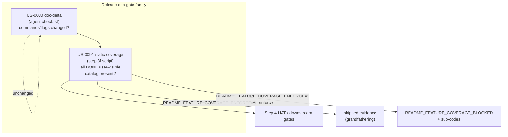
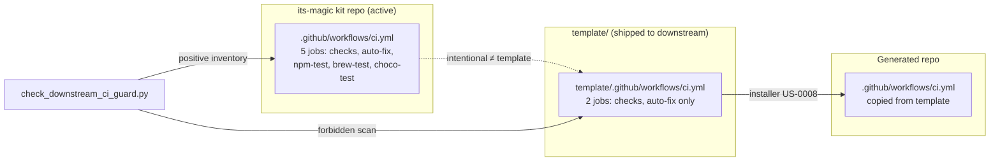
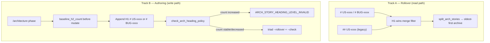
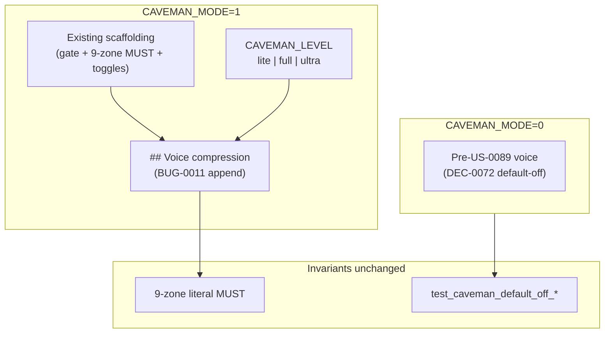
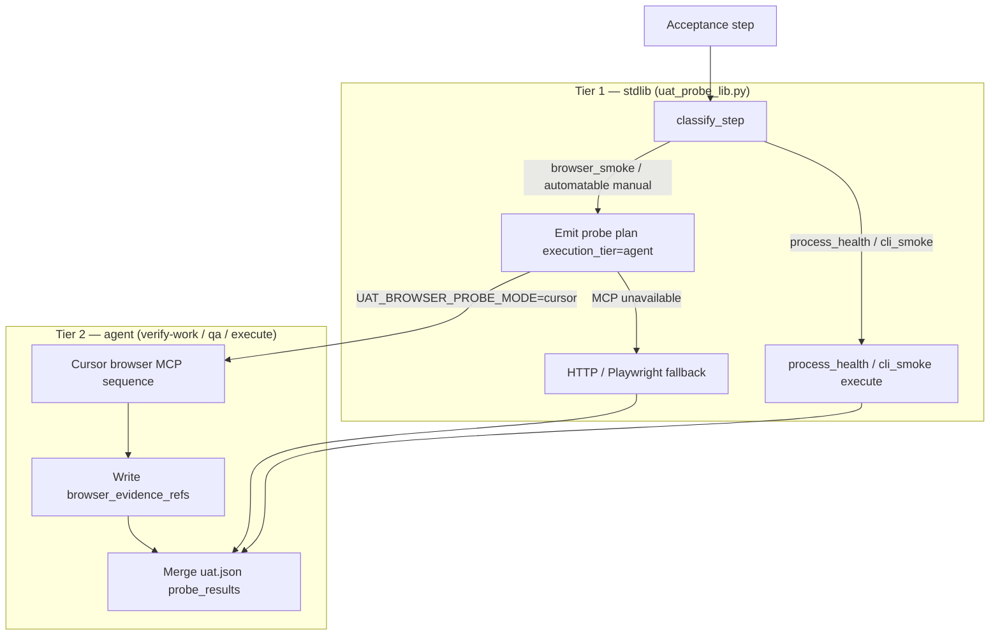

# Architecture

## Overview

US-0018 adds a fourth installer mode (`--mode upgrade`) that safely updates its-magic framework files in a target repo while preserving user data files. The design introduces three new concepts: file classification, version tracking, and an upgrade flow algorithm.

The existing installer architecture (Node.js CLI wrapper → OS-specific installer script → file copy loop) remains unchanged. Upgrade mode is an additional branch in the existing mode switch, using the same file listing and copy infrastructure.

---

# US-0071: User-Visible Internal Metadata Sanitization Guard

## Overview

`US-0071` introduces a **channel-aware** policy: internal planning identifiers
are required for traceability in docs and comments, but must never appear in
**user-visible software outputs** (CLI/UI/errors/installer-visible text). The
architecture is a small, auditable control plane: **forbidden patterns** in
disallowed channels, **explicit allowlist** for internal surfaces, and **mandatory
execute → QA → release** evidence with shared reason codes.

## Policy model

### 1. Forbidden baseline (disallowed channels only)

Apply deterministic planning-shaped matchers in user-visible targets:

- `US-[0-9]{4}`
- `DEC-[0-9]{4}`
- `R-[0-9]{4}`

Matching should prefer planning-shaped tokens to limit accidental hits on
unrelated strings (`R-0046`).

### 2. Allowlisted internal surfaces

Permitted without guard failure:

- `docs/**`
- `.cursor/**`
- `sprints/**`, `handoffs/**`, `decisions/**` (and analogous template trees)
- **Source comments only** — not string literals that ship to users

### 3. Enforcement chain

| Boundary | Responsibility |
|----------|------------------|
| `/execute` | Default, non-bypass guard so in-scope changes do not introduce forbidden tokens into user-visible outputs. |
| `/qa` | Automated scan; fail closed with path evidence, token class, remediation; idempotent reruns. |
| `/release` / readiness | Attest checks **executed and passed** (AC-10), not policy-only. |

### 4. Reason codes (minimum vocabulary)

Use consistently across phases (`DEC-0053`):

- `USER_VISIBLE_INTERNAL_METADATA_DETECTED`
- `METADATA_SANITIZATION_POLICY_MISSING`
- `METADATA_SANITIZATION_SCOPE_AMBIGUOUS`

### 5. Parity and tests

- Active vs `template/` parity on commands, rules, runbook, README (AC-8).
- Regression: positive, negative, allowlist, rerun idempotence (AC-9).

## Decision linkage

- Research basis: `R-0046`
- Decision: `DEC-0053`

---

# US-0072: Deterministic Context Slimming and Archive Enforcement (Triad)

## Overview

`US-0072` makes **hot-surface compaction** and **bounded phase reads** a
first-class workflow contract for three canonical artifacts:
`docs/engineering/state.md`, `handoffs/po_to_tl.md`, and
`docs/engineering/architecture.md`. The design extends `DEC-0042` state rollover
with **parallel scratchpad thresholds**, **deterministic archive packs**,
**same-boundary enforcement**, and **verification tuples** so growth cannot pass
silently.

## Triad surfaces and caps

Thresholds are read from **merged scratchpad** (active + local) with defaults
documented in `DEC-0054`:

- **State** — `STATE_HOT_MAX_LINES`, `STATE_HOT_MAX_CHECKPOINTS` (existing).
- **PO→TL handoff** — `PO_TO_TL_HOT_MAX_LINES`, `PO_TO_TL_HOT_MAX_SECTIONS`.
- **Architecture** — `ARCH_HOT_MAX_LINES`, `ARCH_HOT_MAX_STORY_SECTIONS`.

## Archive layout

- `docs/engineering/state-archive/state-pack-*.md`
- `handoffs/archive/po-to-tl-pack-*.md`
- `docs/engineering/architecture-archive/architecture-pack-*.md`

Packs are append-only historical stores; hot files retain the newest material
per deterministic slice rules.

## Phase ownership gates

| Artifact | Typical mutator | Pre-completion gate |
|----------|-----------------|---------------------|
| `state.md` | Curator `/refresh-context` | Rollover or fail-closed when over cap. |
| `po_to_tl.md` | PO `/intake`, `/discovery`, handoff append paths | Rollover or fail-closed when over cap. |
| `architecture.md` | Tech-lead `/architecture` | Rollover or fail-closed when over cap; never delete unrelated `US-xxxx` sections (`DEC-0043`). |

Any phase that mutates a triad file inherits the gate for that run.

## Verification and idempotence

Successful rollover emits `boundary`, `moved`, `retained`, `pack_ref` in phase
evidence (for example `state.md` checkpoint body or sibling runbook table).
Reruns are idempotent: satisfied caps → no duplicate packs.

## Minimal-read model

Phase commands document **required files first**, numeric read budgets, and
**escalation only** to a named `pack_ref` when unresolved—aligned with
`DEC-0035` narrow-read retrieval. Optional compact pointer files or hot-header
blocks implement `AC-6` without duplicating full checkpoints.

## Reason codes

Minimum shared vocabulary (`DEC-0054`): `STATE_ARCHIVE_REQUIRED`,
`STATE_ARCHIVE_VERIFICATION_FAILED`, `ARTIFACT_HOT_SURFACE_OVERSIZE`,
`CONTEXT_BUDGET_EXCEEDED`, plus `STATE_ARCHIVE_BOUNDARY_AMBIGUOUS` and
`STATE_ARCHIVE_WRITE_FAILED` where applicable.

## Decision linkage

- Research basis: `R-0047`
- Decision: `DEC-0054`

---

# US-0073: Scratchpad delivery simplification (example-only install policy)

## Overview

`US-0073` selects **Model B** from `R-0050`: installers ship **framework-owned**
`.cursor/scratchpad.local.example.md` as the primary default catalog; an
**effective baseline** is established only through **explicit materialization**
(or legacy committed `.cursor/scratchpad.md` on upgrade). The goal is simpler
delivery without weakening deterministic automation, upgrade parity, or
ownership rules already fixed in `DEC-0039`.

## Merge and safety model

### 1) Canonical precedence (merged key/value resolution)

Apply **after** loading each participating file:

1. `.cursor/scratchpad.local.md` (user-owned, never installer-overwritten).
2. `.cursor/scratchpad.md` **or** materialized baseline bytes (stable /
   auditable equivalent to historical committed baseline).
3. `.cursor/scratchpad.local.example.md` (framework-owned defaults; refreshed on
   upgrade per `DEC-0039`).

### 2) Fail-closed missing keys

If a **required** automation key is absent or invalid after merge, stop with
diagnostics that name which layers were consulted and how to remediate — **no**
silent inference (`AC-2`, `AC-4`).

### 3) Upgrade / legacy

- Preserve user local; refresh example only (`DEC-0039`).
- Repos with existing committed `scratchpad.md` keep deterministic behavior;
  migration paths that remove or replace baseline must be **explicitly**
  documented and test-covered.

### 4) Parity

Same policy across `installer.ps1`, `installer.sh`, `installer.py`, CLI, and
`template/` (`AC-6`, `AC-8`).

### 5) Regression focus

Fresh install, upgrade from legacy dual-file layout, missing baseline /
materialization, and local-only override; each maps to deterministic outcomes
(`AC-9`, `AC-10`).

## Decision linkage

- Research basis: `R-0050`
- Decision: `DEC-0055`

---

# US-0074: Baseline version-sync and TEST_COMMAND bootstrap

## Overview

`US-0074` closes persistent baseline failures in `tests/run-tests.ps1` /
`tests/run-tests.sh`: Homebrew stable formula alignment with npm, and installer
/ CLI bootstrap of `TEST_COMMAND` in materialized `docs/engineering/runbook.md`.
The design pins **one canonical version source** and **one bootstrap outcome
contract** so execute/QA can restore a fully green baseline without scope creep.

## Version sync model

### Canonical source

- **`package.json` `version`** is authoritative for semantic version and for the
  GitHub tag segment `v{version}` used in the Homebrew `url`.

### Homebrew stable formula rules

- Committed `packaging/homebrew/its-magic.rb` must satisfy, on every release that
  bumps npm:
  - `url` contains `.../refs/tags/v{package.json.version}.tar.gz`
  - Ruby `version "{package.json.version}"`
  - `sha256` matches the tarball for that tag
- Release scripts are the default enforcement path so formula and npm cannot
  diverge casually.

## TEST_COMMAND bootstrap model

### Surfaces and precedence

- Installers and CLI entrypoints materialize runbook commands per **`DEC-0046`**
  (user override wins; then stack detection; fail-fast diagnostics when
  unresolved).
- Baseline asserts require the **resolved** `TEST_COMMAND` after bootstrap to be
  **only** `npm run test` **or** `sh tests/run-tests.sh` for the detectable-stack
  scenarios under test (see **`R-0051`** post-discovery notes for detector/path
  pitfalls).

### Parity

- **`DEC-0056`** requires identical logical outcomes across
  `installer.ps1`, `installer.sh`, `installer.py`, and `bin/its-magic.js`
  delegation, with active + `template/` parity.

### PowerShell runner

- Emitting `tests/run-tests.ps1` as the bootstrap `TEST_COMMAND` is **out of
  scope** for the current baseline contract; widening requires an explicit future
  decision and test updates (`R-0051`).

## Verification

- Story acceptance re-runs consolidated tests and QA evidence so all four
  formerly failing checks pass without assert weakening (`US-0074` `AC-6`,
  `AC-7`, `AC-9`).
- Regression guidance lives in **`DEC-0056`** and this section for future drift.

## Decision linkage

- Research basis: **`R-0051`**
- Decision: **`DEC-0056`**

---

# US-0075: Upgrade scratchpad example–first refresh and paired catalog parity

## Overview

`US-0075` closes **example drift** and **paired-surface skew**: upgrade/install must refresh
**`.cursor/scratchpad.local.example.md`** from the shipped template **before or together with**
any step that advances materialized **`.cursor/scratchpad.md`**, so operators always see a
current **copy-from** catalog. **`AC-11`** adds **deterministic parity** between each
**baseline ↔ example** pair (active repo and `template/`) on **`##` sections** and **`KEY=`**
lines, with values allowed to differ only for documented conservative defaults.

## Ordering model

1. **Template catalog authority** — Framework vocabulary ships in
   **`template/.cursor/scratchpad.local.example.md`** (and is mirrored to active example on
   upgrade/install per pipeline design).
2. **No stale example + fresh baseline** — Any refresh of materialized **`scratchpad.md`**
   from **`template/.cursor/scratchpad.md`** is preceded by or bundled with example refresh
   from **`template/.cursor/scratchpad.local.example.md`** (**`DEC-0057`** §1).
3. **Parity surfaces** — Same ordering and diagnostics across installers, CLI, manifest, and
   `template/` (**`DEC-0057`**, **`US-0075`** **`AC-4`**, **`AC-8`**).

## Merge and ownership (unchanged)

- Precedence and layers remain **`DEC-0055`** (local → materialized baseline → example).
- User **`.cursor/scratchpad.local.md`** is never overwritten by framework refresh (**`DEC-0039`**).

## AC-11 parity gate

- Compare **paired** paths only: active **`.cursor/scratchpad.md`** ↔
  **`.cursor/scratchpad.local.example.md`** and **`template/.cursor/scratchpad.md`** ↔
  **`template/.cursor/scratchpad.local.example.md`**.
- Require **set equality** of **`##` section headers** and **`KEY=`** keys; manifest-documented
  local-only exceptions are the only allowed asymmetry (**`R-0052`** design).
- Enforce in **`tests/run-tests.*`** (or equivalent CI hook), not review-only.

## Diagnostics

- Distinguish **example** vs **materialized baseline** vs **user local** actions with
  deterministic reason families (**`DEC-0039`** alignment, **`US-0075`** **`AC-5`**).

## Verification

- Regression tests for outdated example + current template, post-upgrade example bytes, and
  absence of “baseline moved / example older than template” paths (**`US-0075`** **`AC-6`**,
  **`AC-9`**).

## Decision linkage

- Research basis: **`R-0052`**
- Decision: **`DEC-0057`**

---

# US-0076: Executable scratchpad-driven sync and auto-push wiring

## Overview

**`US-0076`** wires **merged scratchpad** (**`DEC-0055`**) into **`scripts/validate-and-push.ps1`**
and **`scripts/validate-and-push.sh`** so **`SYNC_POLICY_MODE`**, **`ALLOW_AUTO_PUSH`**,
**`SYNC_CUSTOM_PHASES`** (when applicable), and **`AUTO_PUSH_BRANCH_ALLOWLIST`** **actually**
gate an **opt-in** push path, while **`DEC-0018` / `US-0038`** remain the semantic authority
for **reason codes** and **gate order** (**`decisions/DEC-0058.md`** records the executable
contract).

## Approach

1. **Reuse merge** — Invoke **`installer.py`** `parse_scratchpad_file` + `merge_scratchpad_layers`
   (or a tiny extracted shared module) from both scripts so **local → baseline → example**
   precedence cannot drift from **`DEC-0055`**.
2. **Extend validate-and-push only** — Keep a **single** operator entrypoint (**PO/discovery**
   recommendation); avoid a parallel **`sync-from-scratchpad.*`** unless security review forces
   a split (not indicated).
3. **Policy evaluation before git** — After merge, evaluate **disabled / manual / eligibility**
   per **`DEC-0018`**; exit with **`SYNC_DISABLED`**, **`MANUAL_MODE_NO_AUTO`**,
   **`AUTO_PUSH_NOT_ENABLED`**, or **`SYNC_TRIGGER_NOT_ELIGIBLE`** without running tests when
   push is already ruled out (deterministic short-circuit order documented in runbook).
4. **Runbook commands unchanged in role** — Continue reading **`TEST_COMMAND`** and optional
   checks from **`docs/engineering/runbook.md`** only.
5. **QA scan** — Bounded file glob + marker rules per **`DEC-0058`** §6 (not free-form chat
   parsing).
6. **Optional dry-run** — Flag to print decisions and reason codes without **`git push`**.

## Invariants

- **No push** when **`ALLOW_AUTO_PUSH=0`** or mode is **`disabled`** / **`manual`** (**`AC-1`**).
- **No push** on merge/parse failure; **no silent push** on allowlist mismatch (**`AC-4`**).
- **Tests before push** when push is eligible: **`TEST_COMMAND`** required; optional checks
  when configured (**`AC-3`**).
- **Cross-platform parity** — PS1 and sh exit codes and reason tokens match (**`AC-6`**).
- **Operator strings** — **`US-0071`** hygiene on all new/changed script output (**`AC-9`**).

## Components / scripts touched (execute phase)

| Surface | Change |
|--------|--------|
| **`scripts/validate-and-push.ps1`** | Merged scratchpad gate + QA scan + branch allowlist + dry-run |
| **`scripts/validate-and-push.sh`** | Same behavior as PS1 |
| **`installer.py`** (or **`scripts/`** helper) | Callable merge entry (avoid duplicating precedence) |
| **`docs/engineering/runbook.md`** | Document invocation contract, **`SYNC_PHASE_BOUNDARY`**, scan rules |
| **`README.md`** + **`template/`** mirrors | **`AC-7`** operator guidance |
| **`tests/run-tests.ps1`** / **`.sh`** | **`AC-8`** regression fixtures / dry-run assertions |
| **`decisions/DEC-0058.md`** | Executable supplement to **`DEC-0018`** (accepted with architecture) |

## Failure reason codes (non-exhaustive; align with **`US-0038`**)

| Code | When |
|------|------|
| **`SYNC_DISABLED`** | Mode **`disabled`** |
| **`MANUAL_MODE_NO_AUTO`** | Mode **`manual`** or unset invalid treated as manual per policy |
| **`AUTO_PUSH_NOT_ENABLED`** | **`ALLOW_AUTO_PUSH≠1`** |
| **`SYNC_TRIGGER_NOT_ELIGIBLE`** | Boundary/mode mismatch (e.g. **`by_phase`** invocation not eligible per script rules) |
| **`TEST_COMMAND_MISSING`** / **`TEST_FAILED`** / **`TEST_TIMEOUT`** | Runbook test gate |
| **`OPTIONAL_CHECK_FAILED`** | Lint/typecheck when configured |
| **`BRANCH_NOT_ALLOWLISTED`** | Branch pattern fails deterministic allowlist match |
| **`BLOCKING_QA_FINDINGS`** | **`DEC-0058`** §6 scan hit |
| **`PRE_QA_AUTOPUSH_FORBIDDEN`** | **`US-0038`** QA-first signal not met (bounded rule in runbook) |
| **`[SCRATCHPAD_MERGE_ERROR]`** (family) | Merge/parse failure — **no push** |

## Tests strategy (**`AC-8`**)

- **Fixture or temp repo** paths: disabled/manual → no push path; allowlist mismatch →
  **`BRANCH_NOT_ALLOWLISTED`**; merged local override wins over baseline (**`DEC-0055`** spot
  check); **qa-findings** fixture with blocking marker → **`BLOCKING_QA_FINDINGS`**.
- **Dry-run** assertions: happy path reports **`SYNC_PUSHED`** or documented success token
  without invoking **`git push`** when tests are mocked/skipped in CI-safe mode.
- **PS1 / sh** both run the same cases where feasible.

## Migration / compatibility

- **Default-off unchanged**: teams with **`ALLOW_AUTO_PUSH=0`** or **`manual`/`disabled`** see
  **no new push behavior** — scripts may exit earlier with explicit reason codes (**`AC-1`**).
- **No Cursor auto-invocation** added by this story; CI/operator must **run** the script
  (**backlog boundaries**).
- **`DEC-0018`** records remain valid; **`DEC-0058`** **adds** executable interpretation — no
  weakening of **`US-0038`** gates.

## Decision linkage

- Research basis: **`R-0053`**
- Decision: **`DEC-0058`** (executable wiring; **`DEC-0018`** policy authority retained)

---

# US-0077: Documentation audience profiles and dual README strategy

## Overview

**`US-0077`** adds **merged-scratchpad** (**`DEC-0055`**) controls **`DOC_AUDIENCE_PROFILE`**
and **`DOC_DETAIL_LEVEL`** so documentation generation and validation produce deterministic,
audience-appropriate output. **`R-0054`** supplies the **9-cell** semantic-key matrix;
**`DEC-0059`** locks paths, split rules, reason codes, validator location, and migration
defaults.

## Profile semantics

- **Dimensions**: `DOC_AUDIENCE_PROFILE` ∈ {`user`, `developer`, `both`} ×
  `DOC_DETAIL_LEVEL` ∈ {`concise`, `balanced`, `technical-deep`}.
- **Inputs**: **merged** scratchpad only (local → materialized baseline → example); invalid
  combination values → **`DOC_PROFILE_INVALID`**; merge failure → **`DOC_PROFILE_MERGE_ERROR`**.
- **Optional modes**: `SPEC_PACK_MODE` / `USER_GUIDE_MODE` are **additive** only — validators
  must not require their artifacts when **0** (**`R-0054`** §6).
- **Required keys per cell**: same **semantic key** sets as **`R-0054`** matrix (USER_* and
  DEV_* vocabulary); architecture adds **normative H2 literals** below for resolver binding.

## Artifact ownership

| Artifact | Role |
|----------|------|
| **`README.md`** (repo root) | **User channel** — all **`USER_*`** keys required for the resolved cell when profile audience includes **`user`**. |
| **`docs/developer/README.md`** | **Developer channel** — all **`DEV_*`** keys required when audience includes **`developer`** or **`both`**. |
| **`docs/engineering/runbook.md`** | **US-0030** command surface — unchanged; README may link into runbook; no profile-driven rewriting of runbook keys in this story. |
| **`docs/user-guides/US-xxxx.md`** | **US-0032** when enabled. |
| Spec-pack paths | **US-0031** when enabled. |

Cross-links from README to developer shard or runbook are allowed; **authoritative** section
bodies for **`DEV_*`** keys must not live in root README when the cell requires the developer
shard (**`DEC-0059`** §3).

## README split strategy

- **Canonical layout**: **two files** — root **`README.md`** + **`docs/developer/README.md`**.
- **`both` × `concise` / `balanced` / `technical-deep`**: user vs developer keys **split** per
  **`R-0054`**; **`technical-deep`** forbids inlining full **`DEV_*`** bodies in root (pointers
  only).
- **`developer` × \***: **`DEV_*`** content **only** in developer shard; root may include one
  minimal pointer section.
- **H2 budgets** (root README, user-facing body): follow **`R-0054`** table; overflow →
  **`DOC_SECTION_BUDGET_EXCEEDED`**.

## Semantic keys → canonical H2 titles (validator)

Exact heading text (Markdown `## …`) — execute phase implements resolver with trim/normalize
only; renames require updating this table and tests together.

**User channel (`README.md`)**

| Key | H2 title |
|-----|----------|
| `USER_PURPOSE` | `Purpose` |
| `USER_QUICKSTART` | `Quickstart` |
| `USER_EXAMPLES` | `Examples` |
| `USER_TROUBLESHOOTING` | `Troubleshooting` |
| `USER_LIMITATIONS` | `Limitations` |
| `USER_RELATED_DOCS` | `Related documentation` |

**Developer channel (`docs/developer/README.md`)**

| Key | H2 title |
|-----|----------|
| `DEV_PREREQS` | `Prerequisites` |
| `DEV_WORKFLOW` | `Workflow` |
| `DEV_QUALITY_GATES` | `Quality gates` |
| `DEV_ARCHITECTURE` | `Architecture notes` |
| `DEV_CONTRACTS` | `Contracts and interfaces` |
| `DEV_DECISIONS` | `Engineering decisions` |

Optional root pointer for developer-audience navigation (not a semantic-key substitute):
`## Contributing` with a single link line to **`docs/developer/README.md`** — does not count
toward **`DEV_*`** satisfaction.

## Validator and test strategy

1. **Script**: **`scripts/validate_doc_profile.py`** — loads merged scratchpad via
   **`installer.py`** merge (**`DEC-0058`** pattern); resolves cell; checks parse gates,
   completeness (**`DOC_SECTION_MISSING:<key>`**), H2 counts (**`DOC_SECTION_BUDGET_EXCEEDED`**),
   and **active + `template/`** mirror paths for the same logical files (**`DOC_TEMPLATE_PARITY_FAIL`**).
2. **Tests**: **`tests/run-tests.ps1`** / **`.sh`** invoke Tier **A/B/C** fixtures per **`R-0054`**
   (**`AC-8`**): three anchor snapshots, table-driven remaining cells, wiring smoke per
   audience at **`balanced`** depth.
3. **CI cost**: full 9× heavy generation is **not** required every run — resolver + fixture
   trees prove matrix coverage.
4. **US-0071**: validator and generator stdout/stderr use reason codes; markdown bodies on
   scanned surfaces stay within metadata guard allowlists (**extend** in execute if new tools
   emit planning tokens).

## Migration constraints

- **Defaults**: template/example scratchpad documents **`both`** + **`balanced`** as the
  framework recommendation; **absent keys** on merged scratchpad follow **`DEC-0059`** §6
  transition rule (treat as **`both`×`balanced`** for resolver until CI mandates explicit
  keys).
- **Repos without `docs/developer/README.md`**: must add it before claiming **`developer`** or
  **`both`** cells in validation; no silent split — generator/docs updates are **non-destructive**
  (relocate content deliberately, do not drop).
- **Installer/template**: when the framework ships the developer shard, update
  **`docs/engineering/context/installer-owned-paths.manifest`** (and **`template/`** mirror)
  per **`US-0030`** parity.

## Decision linkage

- Research basis: **`R-0054`**
- Decision: **`DEC-0059`**

---

# US-0078: Enforced interactive intake question evidence

## Overview

**`US-0078`** closes the gap between **`DEC-0050`** pack semantics and **provable** in-session questioning/confirmation. Intake MUST NOT persist backlog/acceptance changes unless each required pack topic has **`topic_coverage`** with a valid **`ref`**, **`asked_topics`** aligns with default asked-vs-covered rules, and assumption confirmations carry **`assumption_confirmation_ref`**. Research **`R-0055`** is normative for validation rules and **`AC-8`** fixtures; decision **`DEC-0060`** locks **`ref`** format and migration.

## Assumption challenge and alternatives

| Option | Summary | Verdict |
|--------|---------|---------|
| A — Policy text only | Rely on prompts/runbook | Rejected — silent persistence remains possible. |
| B — Heuristic inference | Infer coverage from model summaries | Rejected — not auditable; fails AC-1/AC-2. |
| C — Structured evidence + gate | **`topic_coverage`** + deterministic validator | **Chosen** — matches **`R-0055`** / **`DEC-0060`**. |

## Evidence model (runtime)

Persisted bundle (location: inline intake handoff block, sidecar JSON, or equivalent — execute chooses storage; validator consumes the same logical shape):

| Field | Role |
|-------|------|
| `selected_pack` | `first-intake-pack` \| `small-intake-pack` |
| `asked_topics` | Required keys actually **prompted** in-session |
| `missing_topics` | Unsatisfied keys at gate (empty when pass) |
| `topic_coverage` | One row per required key: `topic_key`, `satisfied_by`, `ref` |
| `satisfied_by` | `answer_ref` \| `assumption_confirmation_ref` |
| `ref` | **`ie:`** binding per **`DEC-0060`** §4 |
| `assumptions_confirmed` | Literal field per **`DEC-0050`** |
| `assumption_confirmation_ref` | Required for affirmative assumptions |

**Invariant**: “answered” set = keys in `topic_coverage`; audits compare to `asked_topics` per **`R-0055`** rule 3 (default fail-closed).

## Validation pipeline (deterministic)

1. Resolve `required_keys` from `selected_pack` (**`DEC-0050`** / intake command lists).
2. Validate each required key has a `topic_coverage` row with parseable **`ie:`** `ref` and matching metadata.
3. Enforce asked-vs-covered (default: every covered key ∈ `asked_topics`).
4. Enforce assumption literal + `assumption_confirmation_ref` (**`R-0055`** rules 4–5).
5. On failure: emit `INTAKE_REQUIRED_TOPIC_MISSING`, `INTAKE_REQUIRED_PACK_INCOMPLETE`, `INTAKE_ASSUMPTION_CONFIRMATION_REQUIRED`, and/or umbrella `INTAKE_PERSISTENCE_BLOCKED`; **abort writes**.

**Modes**: **`INTAKE_GUIDED_MODE=1`** and **`0`** both run the pipeline; low-touch does not bypass the gate.

## Workflow integration

| Phase | Behavior |
|-------|----------|
| `/intake` | Emit questions/prompts; accumulate `asked_topics` and coverage rows; gate before persistence. |
| `/execute` | Implement validator, persistence ordering, and tests per **`DEC-0060`** + **`R-0055`**. |
| `/qa` | Verify negative paths and reason codes; scan for bypass of persistence hook. |
| Docs | Active + `template/` parity for intake/runbook/README (**AC-9**). |

## Risks and mitigations

| Risk | Mitigation |
|------|------------|
| Friction for operators | Targeted diagnostics (**AC-7**); bounded prompts. |
| `ref` implementation drift | Single parser module + **`AC-8`** golden vectors. |
| Legacy stories without coverage | **`DEC-0060`** grandfather read-only until next intake touch supplies full evidence. |

## Tests strategy (**AC-8**)

Follow **`R-0055`** matrix (P1–P5): Tier A unit tests on synthetic `intake_evidence`; Tier B golden markdown snippets; Tier C dual-mode smoke (`INTAKE_GUIDED_MODE` ∈ {0,1}).

## Migration

Per **`DEC-0060`** §5: no silent partial writes; optional backfill tools are explicit and out of band.

## Decision linkage

- Research basis: **`R-0055`**
- Decision: **`DEC-0060`** (extends **`DEC-0050`**)

---

# US-0079: First-class bug issue workflow (`BUG-xxxx`)

## Overview

**`US-0079`** introduces a **second canonical work-item family** for defects: **`BUG-####`** with **`OPEN`/`DONE`** only, explicit intake routing, minimum reproducibility fields, and parallel **`US-0045`** reconciliation. Research **`R-0056`** informs field and test guidance; **`DEC-0061`** is normative for literals, routing signals, storage, and migration.

## Assumption challenge and alternatives

| Option | Summary | Verdict |
|--------|---------|---------|
| A — Track bugs as `US-xxxx` | Single artifact shape | Rejected — conflates feature intent and defects. |
| B — Full triage / SLA | Enterprise defect model | Rejected — explicit out of scope. |
| C — `BUG-xxxx` + lightweight lifecycle | Dedicated id + `OPEN`/`DONE` | **Chosen** — aligns with **`R-0056`** / **`DEC-0061`**. |

## Architecture surfaces

| Surface | Behavior |
|---------|----------|
| **`docs/product/backlog.md`** | Section **`## Bug issues (canonical)`**; append new bugs; sort by id; status in header. |
| **`docs/product/acceptance.md`** | Section **`## Bug acceptance (canonical)`** per **`DEC-0061`** §8 — portfolio checkboxes for **`BUG-xxxx`**. |
| Intake | **`INTAKE_WORK_ITEM_KIND`** (`story`/`bug`) **and/or** explicit **`/intake bug`**; fail closed without signal (**`DEC-0061`** §5). |
| Sprint / QA / release | Same traceability row style as **`US-0042`**; **`BUG-xxxx`** allowed alongside **`US-xxxx`**. |
| **`/ask`** | Extend id-family allowlists to **`BUG-####`**. |

## Schema (minimum)

**`environment`**, **`steps_to_reproduce`**, **`expected`**, **`actual`**, **`evidence_refs`** (non-empty). Optional **`related_us`**, **`blocks_us`**, **`duplicate_of`**, **`supersedes`**.

## Phase boundary visibility

Per **`DEC-0061`** §13: when a phase mutates bug records, **optional** **`bug_ids=<csv>`** on **`state.md`** phase boundary entries improves **US-0070 AC-10** inspectability without requiring backlog parses.

## Risks and mitigations

| Risk | Mitigation |
|------|------------|
| Duplicate US + BUG for same defect | **`duplicate_of`/`supersedes`**; routing fail-closed; docs in **`DEC-0061`**. |
| Validator drift | Single module + **`R-0056`** Tier A fixtures. |
| File size | Default single backlog section; optional split only per **`DEC-0061`** §2. |

## Tests strategy

Follow **`R-0056`** Tier A–D mapping to **AC-1..AC-10** (routing, schema, reconciliation, traceability spot-checks).

## Migration

Grandfather **`US-xxxx`**-only historical defects (**`DEC-0061`** §11); new work uses **`BUG-xxxx`** post-delivery.

## Decision linkage

- Research basis: **`R-0056`**
- Decision: **`DEC-0061`**

---

# US-0080: Token-cost hardening for orchestrated runs

## Overview

**`US-0080`** reduces **cache-read-equivalent** token volume for long `/auto` and phase-command runs by **structural** levers: slimmer repeated command/policy surfaces, **bounded phase-context** inputs, and **auditable** per-run metrics — without disabling cache, removing gates, or weakening **`US-0048`**, **`US-0056`**, **`US-0069`**, or **`US-0039`**. Research **`R-0057`** motivates vendor-aligned semantics; **`DEC-0062`** is normative for metric names, **`run_class_hash`**, evidence paths, parity manifest, and AC-10 trade-offs.

## Assumption challenge and alternatives

| Option | Summary | Verdict |
|--------|---------|---------|
| A — Rely on pricing / cache tolerance | No engineering change | Rejected — fails measurable AC-1/AC-2. |
| B — `TOKEN_PROFILE=lean` only | Scratchpad profile | Rejected — insufficient alone (**`R-0057`**). |
| C — Slimming + bounded context + committed metrics | Structural + auditable | **Chosen** — aligns with backlog and **`DEC-0062`**. |

## Metric and comparison model

- **Fields**: **`cache_read_tokens`**, **`input_tokens`**, **`output_tokens`**, **`phase_call_count`** per phase; optional **`cache_creation_tokens`**, **`orchestrator_call_estimate`**; host mapping per **`DEC-0062`** §1.
- **Comparable runs**: Same **`run_class_hash`** over the canonical tuple (**`DEC-0062`** §2): `story_id`, merged **`TOKEN_PROFILE`**, **`SECURITY_REVIEW`**, **`phase_policy_mode`**, ordered **`resolved_phase_plan`**, resume anchor triple.
- **AC-2 target**: ≥ **50%** reduction in **total run `cache_read_tokens`** vs baseline for the **same `run_class_hash`**, with gates unchanged.

## Evidence and observability

- **Append-only** **`handoffs/token_cost_runs/<orchestrator_run_id>.md`** (or **`.jsonl`**) as canonical audit trail; **`docs/engineering/state.md`** carries **`token_cost_evidence_ref`** pointer (**`DEC-0062`** §3, §7).
- IDE usage panes remain **supplementary**.

## Slimming and parity

- **Active + `template/`** parity for touched **`.cursor/commands/`**, **`.cursor/rules/`**, and mirrored template paths — enforced via **`DEC-0062`** §5 manifest + CI extension beyond scratchpad-only checks.
- **AC-4**: Phase handoffs stay within bounded context packs; **no** removal of mandatory isolation, strict-proof, role, or release evidence fields from governed surfaces.

## Risks and mitigations

| Risk | Mitigation |
|------|------------|
| Over-slimming hides policy | Deep links + runbook; AC-8 command-behavior tests |
| Metric gaming / wrong baselines | **`run_class_hash`** equality rule; **`TOKEN_COST_RUN_CLASS_MISMATCH`** |
| Template drift | Versioned parity manifest + checks |

## Tests strategy (**AC-8**)

Regression coverage for: command/rule behavior parity after slimming; **`tests/auto_command_contract_test.py`** (slim **`/auto`** contract markers); **`tests/token_cost_fixtures_test.py`** + **`tests/fixtures/token_cost/`** for **`run_class_hash`** + **`token_cost_compare.py`** CLI; **`python scripts/check_token_cost_parity.py --repo .`** (manifest-listed paths); **`tests/run-tests.ps1`** / **`tests/run-tests.sh`** §26M.

## Decision linkage

- Research basis: **`R-0057`**
- Decision: **`DEC-0062`**

---

# BUG-0001: Intake gate script install completeness

## Overview

**`BUG-0001`** fixes **missing mandatory `/intake` gate scripts** in packaged installs: consumers receive **`template/`** from npm/Chocolatey/Homebrew paths, but **`template/scripts/`** omitted the three **`intake_*`** modules that exist in repo **`scripts/`**. **`DEC-0063`** is normative for ship path, **`package.json` `files`** policy, parity tests, and **`US-0018`** upgrade delivery. Research **`R-0058`** bounds minimal payload and installer **`SOURCE_ROOT`** behavior.

## Assumption challenge and alternatives

| Option | Summary | Verdict |
|--------|---------|---------|
| A — Publish via **`files`** only (repo **`scripts/`** root) | Skips **`template/scripts/`** | **Rejected** — PS1/SH installers copy **`template/`** only (**`R-0058`**). |
| B — Full **`scripts/`** mirror into **`template/scripts/`** | Maximum parity | **Rejected** — violates intake-only completeness scope. |
| C — Three-file **`template/scripts/`** mirror + parity checks | Minimal + testable | **Chosen** — **`DEC-0063`**. |

## Minimal architecture

1. **Authoritative consumer layout**: **`template/scripts/intake_evidence_validate.py`**, **`intake_evidence_lib.py`**, **`intake_bug_routing_guard.py`** — content-aligned with repo **`scripts/`** (**`DEC-0063`** §1).
2. **npm manifest**: **`template/`** subtree remains the primary ship vehicle; optional explicit **`scripts/intake_*.py`** **`files`** entries only as redundant documentation (**`DEC-0063`** §2).
3. **Verification**: **`scripts/check_intake_template_parity.py`** (intake trio + checker self-pair) and **`tests/intake_template_parity_fixtures_test.py`**, wired in **`tests/run-tests.*`** §26N; active/**`template/`** byte sync for those paths.
4. **Upgrade**: **`installer-owned-paths.manifest`** lists the intake modules (and parity checker) under **`scripts/`** so **`installer.ps1` / `installer.sh`** copy them on fresh install and **`--mode upgrade`** (default **`framework`** classification for `scripts/*.py` not under user-data prefixes).

## Risks and mitigations

| Risk | Mitigation |
|------|------------|
| Copy drift | Parity gate; same PR for both trees when changing intake modules |
| Upgrade misses new files | Sprint AC covers **`--mode upgrade`** evidence |

## Tests strategy

- **S0060**: **`check_intake_template_parity.py`** + **`tests/intake_template_parity_fixtures_test.py`** (see **`sprints/S0060/summary.md`**).
- Installer / lifecycle tests as sprint defines (align **`US-0041`** / **`US-0008`** where overlap).

## Decision linkage

- Research basis: **`R-0058`**
- Decision: **`DEC-0063`**
- Related: **`DEC-0061`** (bug schema), **`US-0018`** (upgrade)

---

# US-0081: First-intake full-plan coverage and story-map gate

## Overview

**`US-0081`** adds a deterministic persistence gate for first/new/broad intake so major plan areas cannot be silently dropped. Intake must persist a normalized **`plan_area_inventory`** and complete coverage bindings (**`plan_area_id -> story_id[] | deferred_ref`**) before backlog write. **`R-0059`** supplies the pattern baseline; **`DEC-0064`** is normative for contract fields, fail codes, and verification policy.

## Assumption challenge and alternatives

| Option | Summary | Verdict |
|--------|---------|---------|
| A - Keep decomposition guidance only | Human-only quality check | Rejected - non-deterministic; misses AC-2/AC-7. |
| B - Auto-generate stories for all areas | Maximum automation | Rejected - overreaches; low signal in ambiguous intake. |
| C - Mandatory coverage map gate (chosen) | Deterministic + bounded + auditable | **Chosen** - simplest approach that still enforces complete-plan accounting. |

## Deterministic approach

1. **Scope trigger**: Apply gate when intake is first/new/broad (detected by existing intake policy path and explicit intake context).
2. **Normalize plan inventory**: Build canonical **`plan_area_inventory[]`** with stable **`plan_area_id`** ordering and deterministic text normalization.
3. **Require total mapping**: Every **`plan_area_id`** must resolve to either:
   - non-empty **`story_ids[]`**, or
   - explicit **`deferred_ref`** with bounded rationale.
4. **Fail closed before persistence**: Any uncovered major area blocks backlog mutation under **`INTAKE_PERSISTENCE_BLOCKED`** with specific subcode.
5. **Status authority preserved**: Story status remains canonical in **`docs/product/backlog.md`** per **`US-0045`**.

## Data contract additions

- Intake evidence payload gains:
  - **`plan_area_inventory`**: array of `{ plan_area_id, title, description, priority_hint? }`
  - **`plan_area_coverage`**: array of `{ plan_area_id, story_ids?, deferred_ref?, deferred_reason? }`
  - **`coverage_complete`**: boolean derived by validator (must be `true` to persist)
  - **`coverage_validation_ref`**: deterministic validator trace id/hash reference
- Contract invariants:
  - each **`plan_area_id`** appears exactly once in inventory and coverage
  - each coverage row has exactly one path: `story_ids` xor `deferred_ref`
  - `story_ids` values must exist in the candidate story set for this intake write

## Fail codes (deterministic)

- **`INTAKE_PERSISTENCE_BLOCKED`** (umbrella)
- **`INTAKE_PLAN_COVERAGE_MISSING`**: one or more major plan areas unmapped
- **`INTAKE_PLAN_AREA_ID_INVALID`**: malformed or duplicate `plan_area_id`
- **`INTAKE_PLAN_COVERAGE_CONTRACT_INVALID`**: contract shape/xor invariant violated
- **`INTAKE_PLAN_DEFERRED_REF_MISSING`**: defer selected without required reference

## Verification strategy

- **Unit fixtures**: pass/fail/defer matrices for canonical coverage cases (AC-10).
- **Contract validator tests**: deterministic ordering, id uniqueness, xor enforcement.
- **Policy-path tests**: low-touch and guided intake both enforce gate for first/new/broad scope (AC-5).
- **Parity checks**: active + `template/` alignment across intake command, PO guidance, and validator fixtures (AC-9).
- **Operator guidance checks**: `/ask` and runbook text include coverage-map requirement and fail-code remediation (AC-8).

## Risks and mitigations

| Risk | Mitigation |
|------|------------|
| Over-classifying "major areas" causes false blocks | Keep bounded area taxonomy with deterministic normalization rules (DEC-0064). |
| Coverage map drift between prose and artifacts | Validator derives `coverage_complete`; persistence blocked on mismatch. |
| Policy/document drift between active and template | Explicit parity fixtures in AC-9 test scope. |

## Decision linkage

- Research basis: **`R-0059`**
- Decision: **`DEC-0064`**

---

# US-0082: Agent-driven codebase map bootstrap

## Overview

**`US-0082`** ensures fresh repos can rely on `docs/engineering/codebase-map.md` through deterministic workflow ownership, while preserving **`/map-codebase`** as an explicit manual command. **`R-0060`** frames vendor practice (rules/docs as primary context) vs repo-owned map artifacts; **`DEC-0065`** locks lifecycle gates, idempotency, ownership, diagnostics, and parity expectations.

## Assumption challenge and alternatives

| Option | Summary | Verdict |
|--------|---------|---------|
| A - Guidance-only | Runbook reminders, no lifecycle hook | Rejected — misses **AC-1** for unattended bootstrap. |
| B - Generate on every `/auto` phase | Maximum automation | Rejected — churn / **`state.md`** noise (**R-0060**). |
| C - CI-only | Fail pipeline without map | Rejected as sole owner — late signal; still needs **AC-1** lifecycle naming. |
| D - Phase-gated + manual (chosen) | **`/architecture`** primary; optional **`/refresh-context`**; **`/map-codebase`** manual | **Chosen** — minimal automation that meets ACs and respects **DEC-0052**. |

## Deterministic approach

1. **Primary lifecycle point**: **`/architecture`** completion (**tech-lead**) — ensure map exists or deterministic block/skip with diagnostics before **`/sprint-plan`** handoff (sprint implements invocation: command wrapper, script, or documented mandatory step).
2. **Secondary (policy-gated)**: **`/refresh-context`** may re-materialize or verify map when scratchpad/profile explicitly enables refresh (default off to limit churn).
3. **Manual path**: **`/map-codebase`** unchanged for explicit operator runs (**AC-2**).
4. **Idempotency**: Stable ordering; avoid no-op file churn (**AC-3**).
5. **Ownership**: Same write surfaces as **`/map-codebase`**; **`state.md`** append-only discipline preserved (**AC-4**).
6. **Diagnostics**: **`CODEBASE_MAP_*`** reason family + remediation (**AC-5**).
7. **Guidance**: Runbook + **`/ask`** name responsibility locus (**AC-6**).
8. **Verification**: Active/template parity + fresh / rerun / failure-path tests (**AC-7**, **AC-8**).
9. **Compatibility**: Non-destructive treatment of existing maps (**AC-9**).
10. **Traceability**: **`BUG-0002`** closed as mismatch; this story owns implementation (**AC-10**).

## Fail codes (deterministic vocabulary)

- **`CODEBASE_MAP_MISSING`** — expected artifact absent at lifecycle checkpoint.
- **`CODEBASE_MAP_BLOCKED:<subreason>`** — generation blocked (permissions, policy, profile skip); subreason bounded in sprint.

## Risks and mitigations

| Risk | Mitigation |
|------|------------|
| Custom phase plans skip architecture | Diagnostics + optional CI guard (**DEC-0065** §9). |
| Overwriting local map customizations | Idempotent merge / section-stable refresh; destructive modes out of scope unless explicit. |
| Active/template drift | Parity manifest or existing test patterns for commands/rules (**AC-7**). |

## Decision linkage

- Research basis: **`R-0060`**
- Decision: **`DEC-0065`**
- Related: **`US-0001`** (command exists), **`BUG-0002`** (closed), **`DEC-0052`** (phase profiles)

---

# BUG-0003: Deterministic installer completeness in `missing`/`upgrade`

## Overview

**`BUG-0003`** closes a mode-specific installer trust gap where framework scripts may remain absent after `missing` and `upgrade` runs. **`R-0061`** confirms branch logic parity across `installer.ps1`, `installer.sh`, and `installer.py`; root cause is required-inventory omission (`scripts/enforce-triad-hot-surface.py`) from `docs/engineering/context/installer-owned-paths.manifest`. **`DEC-0066`** locks the minimal fix: manifest-authoritative required script inventory plus deterministic post-install completeness checks and parity tests.

## Assumption challenge and alternatives

| Option | Summary | Verdict |
|--------|---------|---------|
| A - Keep current flow + operator reminders | No structural change | Rejected - allows silent incompleteness recurrence. |
| B - Hard-code required scripts in PS1/SH/PY | Explicit lists per installer | Rejected - highest maintenance and parity drift risk. |
| C - Manifest as single source + shared completeness validator (chosen) | Minimal, deterministic, testable | **Chosen** - simplest path that satisfies bug acceptance and parity constraints. |

## Deterministic approach

1. **Single required inventory source**: `docs/engineering/context/installer-owned-paths.manifest` owns required framework script paths for install completeness checks.
2. **Required path inclusion**: ensure `scripts/enforce-triad-hot-surface.py` is included in installer-owned install scope with paired clean ownership policy.
3. **Post-install invariant**: after mode-specific copy/classification logic, validate all required script paths exist; fail closed on missing entries.
4. **Stable diagnostics**: emit deterministic reason codes (`INSTALL_COMPLETENESS_FAILED`, `INSTALL_REQUIRED_SCRIPT_MISSING:<path>`) with remediation pointing to manifest parity/update path.
5. **Parity-safe implementation**: prefer shared completeness logic in `installer.py` with wrappers (`installer.ps1`, `installer.sh`) consuming the same contract.
6. **Status authority preserved**: `BUG-0003` remains **OPEN** in `docs/product/backlog.md` until execute/qa/verify-work/release close-out (**US-0045**).

## Verification strategy

- **Positive matrix**: `missing` and `upgrade` both produce complete required script set after install.
- **Negative matrix**: intentionally remove required script from staged source and assert deterministic fail code.
- **Parity matrix**: active + `template/` installer surfaces and manifest remain aligned.
- **Symmetry matrix**: install include and clean path ownership stay paired for required scripts.
- **Regression entrypoints**: extend installer-focused tests and lifecycle smoke checks referenced by sprint tasks.

## Risks and mitigations

| Risk | Mitigation |
|------|------------|
| Future manifest omissions reintroduce silent misses | Required inventory checks + regression fixtures tied to manifest updates. |
| Divergent wrapper behavior across platforms | Shared Python validation contract and wrapper reuse. |
| Over-blocking custom repos | Limit completeness gate to installer-owned framework paths. |
| Install/clean mismatch | Explicit paired review and test coverage for `install_include_paths` + `clean_paths`. |

## Decision linkage

- Research basis: **`R-0061`**
- Decision: **`DEC-0066`**
- Related: **`BUG-0001`**, **`US-0018`**, **`US-0045`**, **`DEC-0038`**

---

# BUG-0004: POSIX-safe installer shell startup for Unix CLI path

## Overview

**`BUG-0004`** addresses startup failure in Linux shell environments where installer execution aborts with `set: Illegal option -`. Research **`R-0063`** confirms Unix CLI flow (`bin/its-magic.js`) executes installer via `sh installer.sh`, so installer startup must remain POSIX-`sh` compatible and avoid bash-only `set` semantics. **`DEC-0068`** is normative for invocation/compatibility boundaries and regression requirements.

## Assumption challenge and alternatives

| Option | Summary | Verdict |
|--------|---------|---------|
| A - Force bash invocation in CLI | `bash installer.sh` on Unix | Rejected - adds dependency and weakens portability. |
| B - Dynamic shell detection and launcher branching | choose shell at runtime | Rejected - more complexity than needed for defect scope. |
| C - Keep `sh` contract and enforce POSIX-safe startup (chosen) | minimal and deterministic | **Chosen** - preserves current CLI behavior and fixes failure root. |

## Deterministic approach

1. **Unix launcher contract unchanged**: keep `bin/its-magic.js` Unix execution path via `spawnSync("sh", ...)`.
2. **Startup option safety**: `installer.sh` startup path must use POSIX-safe `set` options only (`set -e` baseline); no unconditional bash-only flags.
3. **Failure prevention**: startup must not fail on `/bin/sh` variants due to option incompatibility.
4. **Status authority preserved**: `BUG-0004` remains **OPEN** in `docs/product/backlog.md` until sprint delivery closes verification/release chain (**US-0045**).

## Verification strategy

- **Direct `sh` matrix**:
  - `sh installer.sh --target <tmp> --mode missing --create`
  - `sh installer.sh --target <tmp> --mode upgrade`
- **CLI Unix matrix**:
  - `node bin/its-magic.js --target <tmp> --mode missing --create`
- **Non-regression matrix**:
  - install completeness checks and existing manifest-governed behavior remain intact.
- **Parity matrix**:
  - retain consistent installer behavior expectations across wrapper paths and test harness coverage.

## Risks and mitigations

| Risk | Mitigation |
|------|------------|
| Bash-only options reintroduced later | Keep explicit `sh`-path regression coverage in shared tests. |
| Local shell mismatch hides regressions | Verify both direct `sh` and CLI invocation paths in deterministic tests. |
| Scope drift into unrelated resume bugs | Keep this architecture bounded to shell startup compatibility (`BUG-0005` tracked separately). |

## Decision linkage

- Research basis: **`R-0063`**
- Decision: **`DEC-0068`**
- Related: **`BUG-0005`**, **`US-0008`**, **`US-0018`**, **`US-0045`**

---

# BUG-0005: `resume_brief` refresh at bug-intake boundary for `/auto` resume

## Overview

**`BUG-0005`** addresses **`RESUME_BRIEF_STALE`** on **`/auto`** immediately after canonical **`/intake bug`** persistence: the resume brief can still describe a pre-intake cycle (for example **`intake`**) while the backlog already reflects a new OPEN bug. Deterministic **`/auto`** precedence (**`start-from`** → parseable **`resume_brief`** → **`state.md`**) intentionally **does not** silently ignore a present-but-stale brief. **`R-0064`** and **`DEC-0069`** lock the fix as **intake-time refresh** of **`handoffs/resume_brief.md`** so normal **`/intake bug` → `/auto`** does not false-trigger stale-resume, without weakening fail-fast.

## Contracts (normative)

1. **Intake completion obligation**: On successful bug intake persistence (**`US-0045`**), the intake writer **must** refresh **`handoffs/resume_brief.md`** with **`bug_id`**, **`intended_resume_phase=discovery`** (default OPEN-bug continuation), boundary **`orchestrator_run_id`** / timestamp when known, and intake evidence pointer when present.
2. **Precedence unchanged**: Explicit **`start-from`** overrides; parseable brief is evaluated before **`state.md`**; stale/unparseable/ambiguous briefs **fail fast** (**`RESUME_BRIEF_STALE`**, etc.) — no silent fallback when a stale brief is present.
3. **Backlog authority**: Brief content **must not** contradict **`docs/product/backlog.md`** status facts for the referenced **`bug_id`**.
4. **Optional self-heal**: Orchestrator-side reconciliation is **not** normative for **`BUG-0005`**; any future self-heal requires strict predicates, idempotency, **`state.md` audit**, and a separate decision (**`DEC-0069`** §4).

## Affected artifacts

- **`handoffs/resume_brief.md`** — primary handoff surface refreshed at intake boundary.
- **`docs/engineering/state.md`** — phase breadcrumbs and auto continuation checkpoints remain authoritative for history; they do not replace a parseable brief in precedence order.
- **`.cursor/commands/intake.md`** (and **`template/`** parity) — normative command surface for implementing intake-time refresh.
- **`docs/engineering/auto-orchestration-reference.md`** / **`.cursor/commands/auto.md`** — precedence and fail-fast codes remain source of truth; **`DEC-0069`** adds intake-side obligation only.

## Acceptance / architecture alignment

- Satisfies **`BUG-0005`** expected behavior: after intake, **`/auto`** resolves a valid next phase without requiring manual **`start-from`** for the normal path.
- Preserves **`US-0045`** canonical status and **`US-0070` / `DEC-0052`** phase-plan materialization (default next phase after bug intake is **`discovery`** unless product documents an exception).
- Regression matrix: **`R-0064`** table (**five scenarios**) is minimum QA/sprint coverage.

## Decision linkage

- Research basis: **`R-0064`**
- Decision: **`DEC-0069`**
- Related: **`US-0037`**, **`US-0045`**, **`US-0070`**, **`US-0080`**, **`DEC-0038`** (strict-proof continuity on phase boundaries)

---

# US-0083: Explicit delegable intake topics without weakening fail-closed semantics

## Overview

**`US-0083`** adds a bounded, auditable delegation path for unresolved required intake topics so users can explicitly delegate a decision and continue, while preserving the existing fail-closed gate for non-delegated gaps. **`R-0062`** recommends the smallest viable extension: keep the current `topic_coverage` contract and add a third `satisfied_by` branch with strict evidence requirements. **`DEC-0067`** is normative for schema, validator branching, reason codes, and parity scope.

## Assumption challenge and alternatives

| Option | Summary | Verdict |
|--------|---------|---------|
| A - Keep current strict-only gate | No delegation branch | Rejected - preserves safety but fails AC-2/AC-3 user intent. |
| B - Global delegation toggle for all missing topics | One switch to bypass missing required topics | Rejected - too broad, increases implicit bypass risk. |
| C - Topic-scoped delegation branch in existing rows (chosen) | Minimal schema extension with explicit evidence per topic | **Chosen** - simplest path that preserves deterministic fail-closed semantics. |

## Deterministic approach

1. **Topic-row contract extension**: allow `topic_coverage[].satisfied_by=delegation_ref` in addition to existing `answer_ref` and `assumption_confirmation_ref`.
2. **Required delegation fields**: when `satisfied_by=delegation_ref`, require:
   - `delegation_scope` (bounded decision area),
   - `delegation_rationale` (why delegation is chosen),
   - `delegation_confidence` (`low|medium|high`).
3. **Evidence binding**: delegation rows must still carry a valid `ie:` `ref` and explicit `quoted_user_text`; hash verification remains deterministic and includes the delegated branch literal.
4. **Validator branch behavior**:
   - non-delegated unresolved required topic -> unchanged fail-closed path (`INTAKE_REQUIRED_TOPIC_MISSING`, optional `INTAKE_REQUIRED_PACK_INCOMPLETE`, umbrella `INTAKE_PERSISTENCE_BLOCKED`);
   - delegated topic with complete evidence -> passes as covered;
   - delegated topic with missing/malformed evidence -> fail closed with delegation-specific deterministic reason codes under `INTAKE_PERSISTENCE_BLOCKED`.
5. **Mode parity**: guided and low-touch intake use the same validation pipeline; delegation does not introduce mode-specific bypass behavior.
6. **Status authority unchanged**: canonical story status remains in `docs/product/backlog.md` (**`US-0045`**); `US-0083` stays `OPEN` through architecture.

## Fail codes (deterministic vocabulary)

- **`INTAKE_DELEGATION_EVIDENCE_MISSING`** - delegated topic is missing one or more required delegation fields.
- **`INTAKE_DELEGATION_EVIDENCE_INVALID`** - delegated topic has invalid field values or invalid/mismatched `ie:` evidence binding.
- **`INTAKE_PERSISTENCE_BLOCKED`** (umbrella) - retained for all blocked persistence outcomes.

## Verification strategy

- Delegated pass fixtures: required-topic rows with `delegation_ref` and complete evidence succeed.
- Non-delegated block fixtures: unresolved required topics without delegation remain blocked with existing codes.
- Delegated block fixtures: malformed/missing delegation fields fail with deterministic delegation codes.
- Parity fixtures: active + `template/` alignment for intake command/rules/validator surfaces.
- Mode parity fixtures: guided and low-touch produce the same validation outcome for equivalent evidence bundles.

## Risks and mitigations

| Risk | Mitigation |
|------|------------|
| Delegation becomes implicit bypass | Require explicit `delegation_ref` + `ie:`-bound user quote; no global toggle. |
| Schema drift across active/template | Include parity checks and mirrored fixtures in sprint scope. |
| Over-complex delegated metadata recreates intake friction | Keep metadata minimal (`scope`, `rationale`, `confidence`) only. |
| Downstream consumers treat delegated items as resolved facts | Preserve delegated marker and rationale in persisted evidence and handoffs. |

## Decision linkage

- Research basis: **`R-0062`**
- Decision: **`DEC-0067`**
- Related: **`US-0068`**, **`US-0078`**, **`US-0045`**, **`DEC-0050`**, **`DEC-0060`**

---

# US-0084: POSIX npm installer + Linux remote test targets (WSL / SSH / Docker)

## Overview

**`US-0084`** locks how the **published** npm **`installer.sh`** stays safe under Debian **`/bin/sh`** (often **dash**), how **LF** shell entrypoints are enforced in the publish path, and how dev/QA aim work at **WSL**, bare **SSH Linux**, or **Docker-over-SSH** using the **existing** **`US-0064`** contract (**`docs/engineering/release-targets.json`**, **`docs/engineering/runtime-connectivity.md`**) — no parallel remote schema. Research basis: **`R-0067`**.

## Assumption challenge and alternatives

| Option | Summary | Verdict |
|--------|---------|---------|
| A | Bash-only installer (`#!/usr/bin/env bash`, bash **`set`** flags) | **Rejected** — conflicts with **AC-1** / global npm **`sh`** path. |
| B | New remote JSON schema beside **`release-targets.json`** | **Rejected** — **AC-4** / **US-0064** alignment only. |
| C | POSIX **`sh`** startup + LF guards + doc map + optional **`scripts/`** helper (**chosen**) | **Chosen** — minimal delta vs repo today; **`R-0067`** confirms active **`installer.sh`** already uses **`set -e`** only on the unconditional path. |

## Published `installer.sh`: POSIX, dash, and LF (**AC-1**)

1. **Shebang and startup**: Keep **`#!/usr/bin/env sh`** and **only** POSIX-safe options on the unconditional startup block (today: **`set -e`** at **`installer.sh:2`**; preserve **BUG-0004** guard comment). **Forbidden** on that path: **`set -u`**, **`pipefail`**, **`set -o …`** bash-only bundles, or any **`set`** line that dash rejects.
2. **Single shipped copy**: **`package.json`** **`files`** ships root **`installer.sh`** (no in-repo **`template/installer.sh`** today). Architecture treats **git HEAD = publish source of truth**; any future mirrored **`template/`** copy triggers the same parity rules as other template mirrors.
3. **LF enforcement**: Add repo root **`.gitattributes`** with `*.sh text eol=lf` (and any other packaged shell entrypoints the sprint lists) so Windows checkouts do not silently CRLF the publish artifact. Complement with a **deterministic** check that rejects **`\\r`** in **`installer.sh`** (Python byte scan is sufficient on all maintainer OSes — **R-0067**).
4. **Invocation reality**: **`bin/its-magic.js`** spawns **`sh`** + package **`installer.sh`** on non-Windows — architecture does not change that contract; it requires the file on disk to remain dash-parseable.

## CI / prepublish guard shape (**AC-2**)

Layered gates (sprint may implement subset if documented, but **preferred full stack**):

| Layer | Purpose | Notes |
|-------|---------|-------|
| **Python regression** | Extend **`tests/installer_shell_bug0004_test.py`** (or successor): forbid **`set -euo`** / **`pipefail`** substrings; keep **`sh`** / CLI smokes. | Windows-friendly without **dash** on **`PATH`**. |
| **`dash -n`** | Syntax check under dash when **`dash`** exists (**CI** or dev opt-in). | **Skip with explicit reason** on runners without **`dash`** (**R-0067** open question); do not silently drop **AC-2** — document skip vs hard in runbook. |
| **`prepublishOnly`** (optional) | Run the same LF + token + (if available) **`dash -n`** gate before **`npm pack`/`publish`**. | Defense in depth for tarball-only mistakes. |

**Sprint deliverable**: at least one **CI** step **or** **`prepublishOnly`** path that **fails closed** on CRLF in **`installer.sh`** + forbidden **`set`** patterns; **`dash -n`** when the environment provides **`dash`**.

## Remote documentation map — **US-0064** alignment (**AC-4**, **AC-9**)

Canonical table for operator docs (runbook / developer guide); **no new keys** in **`release-targets.json`**.

| Operator path | Maps to | Scratchpad / config cues |
|---------------|---------|---------------------------|
| **WSL** | Local Linux kernel on the dev machine — run **`sh`/`dash`** and repo tests **inside WSL**; not a separate **`release-targets`** row by default. | Same repo; cite **environment label** in evidence (**AC-6**). |
| **Bare SSH Linux** | **`ssh-server`** target (**`release-targets.json`**: **`hostEnv`**, **`userEnv`**, **`authEnv`**, **`remoteCommand`**, **`runtime`**, ingress). | **`REMOTE_EXECUTION`**, **`REMOTE_CONFIG=.cursor/remote.json`** per **`.cursor/scratchpad.md`**; validate shape against **`runtime-connectivity.md`**. |
| **Docker-over-SSH** | **`ssh-server.dockerOverSsh`** — **`dockerHostEnv`**, **`dockerContextEnv`**, **`composeFile`**, **`service`** + operator **`DOCKER_HOST`** / context docs. | Cross-link **`runtime-connectivity.md`** **`docker_over_ssh`** summary (**`R-0067`**). |

## Helper script contract (**AC-5**, **AC-7**, **AC-10**)

- **Path / name**: **`scripts/remote_config_summary.py`** (Python 3, consistent with existing **`scripts/`** validators).
- **Inputs**: **`--config`** default **`REMOTE_CONFIG`** env or **`.cursor/remote.json`**; read-only; no network side effects.
- **Stdout**: **non-secret** summary only — target **label** (e.g. **`ssh-server`**), **host** as **env var name** and/or **“set / unset”** presence flags, **user** env name, **identity file path string** (path ref only, **never** key material), optional **`dockerOverSsh`** **enabled** flag and **env names**. **Do not** print resolved secret **values** (**R-0067** residual risk).
- **Stderr**: human-readable failure reason (deterministic prefix optional).
- **Exit codes** (locked for harness fixtures):
  - **0** — OK (config readable and shape acceptable for documented **US-0064** patterns).
  - **1** — usage / CLI error.
  - **2** — config file missing or unreadable.
  - **3** — invalid JSON.
  - **4** — schema / required-field mismatch vs documented **US-0064** operator contract (not a second schema — “doc conformance” check).
  - **5** — **`REMOTE_EXECUTION=0`** fast exit / intentionally skipped validation (if product chooses “no-op when remote off”; otherwise map no-op to **0** — sprint **`decisions.md`** must record the chosen branch).

## `/execute`, `/qa`, and runbook cues (**AC-3**, **AC-6**)

- **`docs/engineering/runbook.md`**: extend **REMOTE_EXECUTION** section (~**783+**) with **troubleshooting** — **`set: Illegal option -`**, **CRLF vs LF**, **`sh` vs `bash`**, **`dos2unix`**, reinstall from fixed version; pointer to **`installer.sh`** POSIX rules above.
- **Handoffs / evidence**: when **`REMOTE_EXECUTION=1`**, cite **environment label** (e.g. **`WSL`**, **`ssh:<hostEnv>`**, **`dockerOverSsh`**) and **never** paste secrets or key bodies (**AC-7**).

## Test harness rows (**AC-2**, **AC-10**)

Register beside existing installer Python tests (**`tests/run-tests.sh`** / **`tests/run-tests.ps1`**, **§26** style per **`R-0067`**):

| Row | Coverage |
|-----|----------|
| H1 | **LF** check + forbidden **`set`** tokens on **`installer.sh`** (extends **BUG-0004** test). |
| H2 | **`dash -n installer.sh`** when **`dash`** available (or documented CI matrix). |
| H3 | **`remote_config_summary.py`** — fixture **valid** minimal **`.cursor/remote.json`** → exit **0**, expected stdout keys/names only. |
| H4 | **`remote_config_summary.py`** — fixture **invalid JSON** → exit **3**. |
| H5 | **`remote_config_summary.py`** — fixture **schema/doc mismatch** → exit **4** (or **2** for missing file — separate fixture). |

## Active + `template/` parity (**AC-8**)

Any new/edited **commands**, **scratchpad examples**, **`.cursor/remote.json`** template snippets, or **runbook** sections must be mirrored under **`template/`** per existing kit parity rules (same literals where the template carries the surface). **`package.json`** changes (e.g. **`prepublishOnly`**) apply to the **shipping** package only — template mirrors **commands/docs** that consumers receive.

## Risks

| Risk | Mitigation |
|------|------------|
| CI lacks **`dash`** | Documented **skip vs hard**; Python CRLF + substring gates remain mandatory. |
| Maintainer publish from Windows without local **`dash`** | **`prepublishOnly`** + Python checks; optional CI **`dash`**. |
| Helper duplicates **`runtime-connectivity.md`** | Helper = **validate + summarize**; prose stays in **`runtime-connectivity.md`** / runbook. |
| Secret leakage via “debug” print | **Names-only** / presence flags; code review + fixture asserts on stdout. |

## Decision linkage

- Research basis: **`R-0067`**
- Related: **`US-0064`**, **`US-0036`**, **BUG-0004**, **`docs/engineering/release-targets.json`**, **`docs/engineering/runtime-connectivity.md`**, **`bin/its-magic.js`**, **`package.json`**

---

# BUG-0006: `/auto` spawn-only enforcement (orchestrator must not execute phase work)

## Overview

**`BUG-0006`** closes the gap between **process** `/auto` orchestration (US-0080) and operator behavior: the orchestrator role must **only** schedule materialization, spawn fresh **phase-role** subagents, and verify boundaries—it must **not** author phase deliverables or perform phase work in the same context. **`R-0065`** recommends doc-first enforcement plus static regression; this section locks literals, surfaces, and acceptance hooks.

## Locked reason-code vocabulary

| Code | Use | Remediation (operator-facing) |
|------|-----|-------------------------------|
| **`AUTO_ORCHESTRATOR_PHASE_EXECUTION`** | Attempted direct orchestrator execution of a lifecycle phase (or equivalent “run `architecture` / `execute` / … in orchestrator context”) instead of spawning the required subagent. | Stop; spawn a **fresh** subagent for the canonical **`phase_id`** and **role** per the phase→role matrix (**DEC-0051**); do not merge phase output into orchestrator turns. |
| **`PHASE_CONTEXT_ISOLATION_VIOLATION`** (existing) | Orchestrator wrote phase artifacts or violated per-phase isolation (**DEC-0029**). | Distinct from spawn failure: isolation applies **after** correct spawn boundary; keep both codes documented side-by-side. |
| **`RUNTIME_PROOF_*`**, **`PHASE_ROLE_*`**, **`PHASE_POLICY_*`** (existing) | Strict proof, capability, phase-plan failures (**DEC-0038**, **DEC-0052**). | Unchanged; **`AUTO_ORCHESTRATOR_PHASE_EXECUTION`** must not overload these families. |
| **`[AUTO_RESUME_ERROR]`** codes (existing) | Resume precedence / brief / state resolution. | Separate from spawn integrity; no merge of semantics. |

## Technical approach (doc-first, test-backed)

1. **Normative command (active + template)**: **`.cursor/commands/auto.md`** and **`template/.cursor/commands/auto.md`** — strengthen **non-negotiable** language: “spawn fresh subagent per phase,” “orchestrator must not execute phase work / write phase deliverables,” and enumerate **`AUTO_ORCHESTRATOR_PHASE_EXECUTION`** in the fail-fast / reason-code excerpt (alongside existing **`PHASE_CONTEXT_ISOLATION_*`** / **`RUNTIME_PROOF_*`** markers).
2. **Expanded reference**: **`docs/engineering/auto-orchestration-reference.md`** — mirror the spawn-only rule; cross-link **DEC-0029** (isolation) and **DEC-0038** (strict proof) so operators cannot satisfy one gate and ignore the other; document **`AUTO_ORCHESTRATOR_PHASE_EXECUTION`** with one-line remediation.
3. **Regression**: extend **`tests/auto_command_contract_test.py`** with required substrings: spawn-only phrasing, forbidden orchestrator phase execution, literal **`AUTO_ORCHESTRATOR_PHASE_EXECUTION`**, and a **negative** check that the slim command does **not** imply in-orchestrator execution of named phases (pattern established in **`R-0065`** matrix rows 1–4).
4. **Out of scope**: no claim of runtime Cursor product enforcement; no replacement of isolation or proof tuples as subagent launchers.

## Files to touch (execute phase)

| Path | Change |
|------|--------|
| **`.cursor/commands/auto.md`** | Spawn-only + **`AUTO_ORCHESTRATOR_PHASE_EXECUTION`** + forbidden direct phase execution. |
| **`template/.cursor/commands/auto.md`** | Parity with active command (same literals where mirrored). |
| **`docs/engineering/auto-orchestration-reference.md`** | Expanded contract alignment + cross-links + reason code. |
| **`tests/auto_command_contract_test.py`** | Assertions for new literals and non-contradiction. |

Optional parity: if repo adds an **`auto`** template parity script later, include these paths; until then, **manual or sprint QA** verifies **`template/`** mirror.

## Acceptance hooks

- Contract test **`python tests/auto_command_contract_test.py`** (or full unittest suite per sprint) **PASS** after edits.
- **`BUG-0006`** **expected** in backlog: fail-fast when spawn boundary violated, with deterministic diagnostics — satisfied by documented **`AUTO_ORCHESTRATOR_PHASE_EXECUTION`** plus existing isolation/proof codes.
- Canonical status remains **`docs/product/backlog.md`** only (**US-0045**); closure moves to **DONE** only after execute/QA/verify per backlog.

## Risks

| Risk | Mitigation |
|------|------------|
| Code overlaps **`PHASE_CONTEXT_ISOLATION_VIOLATION`** | Table above + remediation text distinguishes “no spawn” vs “wrong writer.” |
| Template drift | Edit **`template/.cursor/commands/auto.md`** in the same change set as active **`auto.md`**. |
| False sense of runtime enforcement | Docs + static tests only; reference states process contract, not IDE automation. |

## Decision linkage

- Research basis: **`R-0065`**
- Related: **`US-0048`**, **`US-0069`**, **`US-0080`**, **`US-0045`**, **`DEC-0029`**, **`DEC-0038`**, **`DEC-0051`**, **`DEC-0052`**

---

# BUG-0007: Intake evidence truthfulness for `asked_topics` / `topic_coverage`

## Overview

**`BUG-0007`** closes the gap where **`scripts/intake_evidence_validate.py`** can return **`[INTAKE_EVIDENCE_VALIDATION_OK]`** on bundles such as **`handoffs/intake_evidence/BUG-0007-intake-20260403.json`** that list a full **`small-intake-pack`** in **`asked_topics`** while every **`topic_coverage`** row uses **`satisfied_by=answer_ref`** with the **same** (or trivially duplicated) **`quoted_user_text`**—i.e. no real per-topic elicitation. **`R-0066`** shows **`validate_intake_evidence`** in **`scripts/intake_evidence_lib.py`** enforces structural pack coverage, **`ie:`** integrity, and **DEC-0060**-aligned bindings, but not semantic distinction of answers across topics. This section locks the minimal validator + contract + test matrix so the exemplar **fails** after implementation while **US-0083** delegation and **equivalent_evidence_ref** paths stay **PASS**.

## Assumption challenge and alternatives

| Option | Idea | Verdict |
|--------|------|---------|
| A | Documentation-only reminder in **`/intake`** | **Rejected** — validator already certifies the bad exemplar (**R-0066**). |
| B | External chat transcript ingestion | **Deferred** — out of repo scope unless product mandates it. |
| C | Deterministic lib rules + contract + fixtures (**chosen**) | **Chosen** — same validation pipeline for guided and low-touch; fail-closed subcodes under **`INTAKE_PERSISTENCE_BLOCKED`**. |

**Residual risk**: Duplicate-text heuristics alone do not prove a “question was asked”; optional future **`question_*`** fields or stronger artifacts may be needed. Document any grandfathering in sprint **`decisions.md`** if legacy bundles must migrate.

## Locked technical approach

### 1) Core validation (`scripts/intake_evidence_lib.py`)

Extend **`validate_intake_evidence`** (and shared helpers the lib owns) with deterministic rules applied **after** existing **`ie:`** / pack / delegation / assumption checks:

1. **Duplicate **`answer_ref`** prose across distinct required topics** — For **`small-intake-pack`** (and equivalent required-topic sets), when multiple rows share **`satisfied_by=answer_ref`** and **identical** **`quoted_user_text`** (normalized per existing string rules in the lib), **fail** unless the row is covered by an allowed alternate satisfaction path (**`equivalent_evidence_ref`** / **`evidence_source`** semantics already in lib, **`delegation_ref`** per **DEC-0067**, or **`assumption_confirmation_ref`**). This targets the BUG-0007 pattern without treating two accidental short duplicate answers as the same class of abuse (tune: require duplicate across **all** required keys or use minimum distinct-count threshold — implementation sprint chooses the smallest rule that makes the exemplar **FAIL** and keeps matrix row 2 **PASS**).
2. **Optional phase-2** — If product requires stronger audit: add optional **`question_prompt_ref`** / **`question_text`** (or bind to a stable prompt id) for **`answer_ref`** rows; then **`INTAKE_ASKED_TOPIC_NOT_EVIDENCED`** applies when **`asked_topics`** lists a key without a bound prompt artifact. **Architecture default for first sprint**: implement (1) first; gate (2) behind explicit backlog if false positives appear.

**`scripts/intake_evidence_validate.py`**: keep CLI contract (**`--file`**, **`--stdin`**, **`--self-test`**); surface lib stderr codes unchanged.

### 2) Normative contract (`.cursor/commands/intake.md` + **`template/`** mirror)

- **`asked_topics`** may list only topics for which a **user-visible question** was posed **or** a **DEC-0060**-allowed alternate applies (**`delegation_ref`**, **`equivalent_evidence_ref`**, **`assumption_confirmation_ref`**).
- Explicitly **forbid** fabricating per-topic **`answer_ref`** rows by echoing one bug-report blob across all keys to satisfy the validator.
- Cross-link **DEC-0060** / **DEC-0067** / **US-0083** so operators do not conflate **`ie:`** integrity with “question asked.”

Parity: **`scripts/check_intake_template_parity.py`** (or successor) must stay **PASS** for any **`intake.md`** edit.

### 3) Locked reason codes (under umbrella **`INTAKE_PERSISTENCE_BLOCKED`**)

| Code | When |
|------|------|
| **`INTAKE_ANSWER_REF_NOT_TOPIC_DISTINCT`** | Distinct **`topic_key`** rows with **`satisfied_by=answer_ref`** share non-distinct **`quoted_user_text`** without **`equivalent_evidence_ref`** / other allowed alternate. |
| **`INTAKE_ASKED_TOPIC_NOT_EVIDENCED`** | (Optional / phase-2) **`asked_topics`** includes a topic without required question-binding artifact when that feature is enabled. |
| **Existing** | **`INTAKE_DELEGATION_EVIDENCE_MISSING`**, **`INTAKE_DELEGATION_EVIDENCE_INVALID`**, **`INTAKE_ASSUMPTION_CONFIRMATION_REQUIRED`**, **`INTAKE_REQUIRED_TOPIC_MISSING`** — **do not overload** for BUG-0007 duplicate-answer semantics. |

### 4) Test fixtures and regression matrix (**R-0066** § table — sprint must automate)

| # | Scenario | Expected |
|---|----------|----------|
| 1 | Fixture aligned with **`BUG-0007-intake-20260403.json`** (duplicate **`answer_ref`** across keys) | **FAIL** with **`INTAKE_ANSWER_REF_NOT_TOPIC_DISTINCT`** (or locked synonym) |
| 2 | Five **distinct** short answers + valid **`ie:`** | **PASS** |
| 3 | **`satisfied_by=delegation_ref`** + complete delegation metadata + valid **`ie:`** | **PASS** (**US-0083** / **DEC-0067** non-regression) |
| 4 | **`evidence_source=equivalent_evidence_ref`** row; topic omitted from **`asked_topics`** per lib rules | **PASS** |
| 5 | **`assumption_confirmation_ref`** path | **PASS** |
| 6 | **`python scripts/intake_evidence_validate.py --self-test`** | **PASS** after lib change |
| 7 | Active + **`template/`** parity | **PASS** |

Prefer **`tests/`** unittest module(s) invoking **`validate_intake_evidence`** directly (and/or subprocess on **`intake_evidence_validate.py`**) so CI mirrors operator commands.

## US-0083 / equivalent_evidence non-regression (hard gate)

- **Delegation**: Rows with **`satisfied_by=delegation_ref`**, required delegation fields, and valid **`ie:`** binding must **not** trip duplicate-**`answer_ref`** rules.
- **Equivalent evidence**: Topics satisfied via **`equivalent_evidence_ref`** / **`evidence_source`** must **not** be forced through fake per-topic **`answer_ref`** duplicates; validator behavior must match **`# US-0083`** architecture and **R-0062** intent.
- Sprint **execute** must add or extend fixtures that mirror **`handoffs/intake_evidence/US-0083-intake-20260331-b.json`** (or equivalent) and equivalent-evidence samples so matrix rows 3–4 cannot regress silently.

## Files to touch (execute phase — indicative)

| Path | Change |
|------|--------|
| **`scripts/intake_evidence_lib.py`** | New deterministic checks + codes. |
| **`.cursor/commands/intake.md`** | Truthfulness / forbid synthetic **`answer_ref`** echo. |
| **`template/.cursor/commands/intake.md`** | Parity. |
| **`tests/`** | New regression tests for BUG-0007 **FAIL** + US-0083 / equivalent-evidence **PASS**. |
| Optional | **`scripts/intake_bug_resume_brief_refresh.py`** / **`bug_issue_validate.py`** — only if a single choke-point should re-validate; avoid duplicate sources of truth (**R-0066**). |

## Risks

| Risk | Mitigation |
|------|------------|
| False positives on legitimate repeated short answers | Scope duplicate rule (e.g. “same blob across **all** pack keys”); tune in sprint with matrix row 2. |
| False confidence after only one heuristic | State residual risk; optional **`question_*`** follow-up. |
| Template drift | Same change set for active + **`template/`**; parity script **PASS**. |

## Decision linkage

- Research basis: **`R-0066`**
- Related: **`BUG-0007`**, **US-0068**, **US-0078**, **US-0079**, **US-0083**, **DEC-0060**, **DEC-0067**, **R-0062**, **R-0055**

---

# BUG-0008: CRLF `installer-owned-paths.manifest` → empty `install_include_paths` on Linux global npm

## Overview

**`BUG-0008`** fixes global Linux installs where **`its-magic`** aborts with **`[INSTALL_MANIFEST_ERROR] install_include_paths section is empty`** even though the packaged manifest visibly lists paths. Research **`R-0069`** locks the root cause: CRLF line endings leave section headers as **`[install_include_paths]\r`**, so POSIX **`awk`** strict equality **`$0 == "[" s "]"`** in **`installer.sh`** **`get_manifest_paths`** never enters the section. **`US-0084`** (LF **`installer.sh`**, **`.gitattributes`**, prepublish guards) is adjacent but does not replace this bug’s manifest-section contract or publish/E2E closure.

## Assumption challenge and alternatives

| Option | Summary | Verdict |
|--------|---------|---------|
| A | Rely on **`.gitattributes`** + publish hygiene only | **Insufficient alone** — defensive parse still required for tarballs already in the wild and for any future CR leakage. |
| B | Replace **`awk`** with a heavier parser (Python/node) in **`installer.sh`** path | **Rejected** — breaks POSIX **`sh`** installer contract and scope. |
| C | Strip trailing **`\\r`** per line before section match + enforce LF at source + prepublish CR scan (**chosen**) | **Chosen** — minimal runtime fix + deterministic prevention (**R-0069**). |

## Normative contract

1. **Runtime (POSIX)**: **`get_manifest_paths`** in **`installer.sh`** must **`sub(/\\r$/, \"\")`** (or equivalent) on every line **before** section-header comparison and path emission so **`[install_include_paths]`** matches under CRLF inputs.
2. **Source / npm tarball**: Repo **`.gitattributes`** includes **`*.manifest text eol=lf`** so Git checkouts and packaged manifests default to LF.
3. **Prepublish**: **`scripts/guard_installer_publish.py`** (and **`template/scripts/`** parity) rejects byte **`\\r`** in **both** active and template **`installer-owned-paths.manifest`** paths (and existing **`installer.sh`** CR rules remain).
4. **Windows installer parity**: **`installer.ps1`** **`Get-ManifestSection`** trims carriage return (e.g. **`TrimEnd('`r')`**) before section logic, matching **`BUG-0008`** intake expectations.
5. **Canonical status**: **`BUG-0008`** remains **OPEN** in **`docs/product/backlog.md`** until **`/verify-work`** / release path per **US-0045**; do not mark **DONE** from architecture alone.

## Operator-facing reason codes

- **No new codes** for this architecture. Existing installer stderr remains **`[INSTALL_MANIFEST_ERROR] install_include_paths section is empty`** when the section is still empty after parse (should not reproduce for CRLF once mitigations ship; other empty-section causes keep the same literal).
- **Maintainer-facing** (prepublish): **`guard_installer_publish`** continues to emit deterministic **`guard_installer_publish: ...`** messages when **`\\r`** is present in **`installer.sh`** or manifest paths.

## Shipped in-repo mitigations (execute already landed; sprint may verify only)

- **`installer.sh`**: **`get_manifest_paths`** awk body strips trailing CR before **`/^\[/`** section match (**BUG-0008** comment in-tree).
- **`.gitattributes`**: **`*.manifest text eol=lf`**.
- **`scripts/guard_installer_publish.py`** + **`template/scripts/guard_installer_publish.py`**: CR rejection on packaged manifest paths.
- **`tests/installer_manifest_crlf_bug0008_test.py`**: CRLF fixture vs awk logic aligned with **`get_manifest_paths`**.
- **`tests/run-tests.sh`** / **`tests/run-tests.ps1`**: section **26P2** invokes the Python test.
- **`installer.ps1`**: **`Get-ManifestSection`** CR trim parity.

## Remaining delivery (not satisfied by doc-only architecture)

1. **Version bump** per release policy and **`npm publish`** so operators receive a tarball **after** the mitigations (broken field example: **`its-magic@0.1.2-40`**).
2. **Debian global E2E**: **`npm install -g`** the new version; **`cat -A`** on installed template manifest (no **`^M$`**); **`its-magic --target <repo> --mode missing`** (or equivalent) **without** **`[INSTALL_MANIFEST_ERROR]`** — align with backlog **done_definition** / intake evidence.
3. **`R-0069`**: set **closed** with a delivery closure stanza when **`BUG-0008`** is **DONE** (post-QA/release), same pattern as other research items tied to shipped defects.

## Regression obligations (sprint / CI)

| Gate | Obligation |
|------|------------|
| **26P2** | **`tests/run-tests.sh`** / **`tests/run-tests.ps1`** must keep **`installer_manifest_crlf_bug0008_test.py`** wired; **PASS** on PR and release candidates. |
| **Prepublish** | **`python scripts/guard_installer_publish.py`** (or **`npm`** **`prepublishOnly`** hook as wired) **PASS** — rejects CR in **`installer.sh`** and both manifest copies. |
| **Parity** | Template copies of **`guard_installer_publish.py`** and manifests stay aligned with root (**US-0084** / template policy). |

## Risks

| Risk | Mitigation |
|------|------------|
| Operators stay on old global version | Explicit publish + release notes / version bump task in sprint. |
| **26P2** skipped in custom CI | Document that **`run-tests`** section **26P2** is part of installer regression surface. |
| Only LF tested; mixed encodings | Current scope is CR strip + LF enforcement; BOM or other encodings out of scope unless product expands **R-0069**. |

## Decision linkage

- Research basis: **`R-0069`**
- Related: **`BUG-0008`**, **`US-0084`**, **`US-0045`**, installer contracts (**`DEC-0068`** shell path context)

---

# US-0087: `/auto` explicit bug targeting (OPEN bug queue / single `BUG-####`)

## Overview

**`US-0087`** adds a **default-off**, **fail-closed** bug-scheduler path for **`/auto`**: operators may bind continuation metadata to **one** **`BUG-####`** or to a deterministic **all OPEN bugs** queue (canonical **`docs/product/backlog.md`** **`## Bug issues (canonical)`**, ascending **numeric** id), then run the **same resolved phase plan** (**`US-0070`** / **`DEC-0052`**) **per bug** or per bounded queue segment—without in-process phase execution (**`BUG-0006`** / **`US-0069`** / **`AUTO_ORCHESTRATOR_PHASE_EXECUTION`**). Story-only **`AUTO_BACKLOG_DRAIN`** (**`US-0044`** / **`DEC-0022`**) remains a **separate** scheduler; this section locks **one active scheduler** rules and **AC-10** breadcrumbs. Research basis: **`R-0070`** (delivery closure moves with story **DONE**).

## Assumption challenge and alternatives

| Option | Summary | Verdict |
|--------|---------|---------|
| A | Fold bug drain into **`AUTO_BACKLOG_DRAIN`** as a profile | **Rejected** — selection rules, sort keys, and backlog sections differ (**`R-0070`**). |
| B | Bug cursor in **`state.md`** only; no **`resume_brief`** updates | **Rejected** — **`RESUME_BRIEF_STALE`** risk vs **`DEC-0069`** / **`BUG-0005`**. |
| C | Dedicated **`AUTO_BUG_*`** surface + argv mirror + hard scheduler mutex / argv override (**chosen**) | **Chosen** — explicit operator semantics and testable literals. |

## Architecture-locked scratchpad keys (merged; `template/` parity)

All **default-off** when unset; sprint implements in **`.cursor/scratchpad.md`** + **`template/.cursor/scratchpad.local.example.md`** (and any documented merge layers).

| Key | Values | Role |
|-----|--------|------|
| **`AUTO_BUG_QUEUE`** | **`0`** \| **`1`** | Master enable for bug-targeted **`/auto`** ( **`0`** = legacy behavior only). |
| **`AUTO_BUG_TARGET`** | **`all-open`** \| **`BUG-####`** | Required when **`AUTO_BUG_QUEUE=1`** (unless **explicit argv** supplies the target for that invocation — see precedence). |
| **`AUTO_BUG_MAX_ITEMS`** | non-negative integer | Optional cap on bugs consumed **per orchestrator run** for **`all-open`**; **`0`** or unset = no cap beyond queue. |
| **`AUTO_BUG_ON_BLOCK`** | **`stop`** \| **`skip`** | When a bug segment hits a **pause/stop** boundary: halt queue vs advance to next id (deterministic doc + tests). |

**Naming note**: **`AUTO_BUG_MAX_ITEMS`** is the **architecture-locked** name for “max bugs per run” (**AC-2** / **AC-4**); do not introduce parallel spellings without a **DEC** amendment.

## Architecture-locked `/auto` argv syntax (**AC-1**)

Canonical tokens (exact strings for docs + **`tests/auto_command_contract_test.py`**):

1. **Single OPEN bug**: **`bug-target=BUG-####`** (example: **`bug-target=BUG-0007`**) as a **`/auto`** argument token (space-delimited command argv as today’s Cursor command style documents).
2. **All OPEN bugs (ordered queue)**: **`bug-target=all-open`**.

**Aliases**: **none** in v1 — reduces **AC-7** / reference drift; future aliases require architecture bump + contract test row.

## Precedence and scheduler mutex (**AC-3**)

Resume-source order remains: **explicit `start-from`** > **explicit bug-target / story-drain argv** (if any) > **merged scratchpad** > **`handoffs/resume_brief.md`** > **`docs/engineering/state.md`** fallback — extended so **bug-target argv** is unambiguously parsed **before** scratchpad scheduler keys.

**One active scheduler** (fail-closed):

- If merged scratchpad has **`AUTO_BACKLOG_DRAIN=1`** (or equivalent active story drain) **and** **`AUTO_BUG_QUEUE=1`** **and** the invocation does **not** include an explicit **`bug-target=`** argv token that selects the bug scheduler for this run → **`AUTO_SCHEDULER_CONFLICT`** (documented with **`[AUTO_RESUME_ERROR]`** envelope in **`docs/engineering/auto-orchestration-reference.md`**; literal token **architecture-locked** here).
- When **explicit `bug-target=`** argv is present, it **selects** the bug scheduler for that invocation; **`AUTO_BACKLOG_DRAIN`** must **not** also drive story selection **for the same run** (orchestrator materialization picks **one** queue; story drain keys are **ignored** when argv bug-target wins — document in reference).

## Fail-closed reason codes (**AC-1**, **AC-4**, **AC-8**)

| Code | When |
|------|------|
| **`AUTO_BUG_QUEUE_EMPTY`** | **`bug-target=all-open`** (or equivalent) and **zero** OPEN bugs in canonical section. |
| **`AUTO_BUG_TARGET_UNKNOWN`** | Malformed id, wrong pattern, or **`BUG-####`** not found in canonical bug section. |
| **`AUTO_BUG_TARGET_NOT_OPEN`** | Known id but status **not** **OPEN** (e.g. **DONE**). |
| **`AUTO_SCHEDULER_CONFLICT`** | Story backlog drain + bug queue both enabled per mutex rule above without resolving argv. |

Existing codes (**`PHASE_POLICY_CONFLICT`**, **`START_FROM_PHASE_PLAN_EMPTY_INTERSECTION`**, **`RESUME_BRIEF_STALE`**, etc.) stay **orthogonal** — do **not** overload them for the table above.

## `DEC-0069` / `resume_brief` alignment (**AC-5**)

- **Single-bug segment**: **`resume_brief`** carries **`bug_id`**, **`intended_resume_phase`**, and boundary timestamps consistent with **`DEC-0069`** (post-intake refresh pattern applies where bug intake occurs; mid-queue segments refresh at **lawful** orchestrator boundaries so **`/auto`** without **`start-from`** does not false-trigger **`RESUME_BRIEF_STALE`**).
- **Multi-bug (`all-open`)**: After each bug’s terminal boundary (e.g. **`refresh-context`** completion or explicit queue stop), **either** refresh **`resume_brief`** with the **next** **`bug_id`** + cursor **or** document a **single** fail-closed exception path where **`state.md`** cursor is authoritative **only** if paired with a **non-stale** brief predicate (**R-0070** preference: paired updates; architecture **defaults** to **brief + state** paired writes at segment boundaries).

## Phase boundary visibility — **AC-10** locked fields

In addition to existing **`orchestrator_run_id`**, **`phase_boundary`**, **`next_scheduled_phase`**, **`story_id`**, **`bug_id`**, **`sprint_id`**:

| Field | Purpose |
|-------|---------|
| **`segment_work_item_kind`** | **`story`** — portfolio/meta **`US-0087`** planning segments without an active defect; **`bug`** — defect lifecycle segment. |
| **`active_bug_id`** | **`BUG-####`** actively bound **or** **`(none)`** when **`segment_work_item_kind=story`**. |
| **`bug_queue_position`** | 1-based index into the **deterministic** OPEN-bug ordering for the **current** bug segment when **`bug-target=all-open`**; omit or **`(none)`** for single-target runs without queue semantics. |
| **`bug_queue_remaining`** | Count of OPEN bugs **after** the current position in the same ordering (integer or **`(none)`**). |
| **`backlog_drain_active`** | Boolean: story **`AUTO_BACKLOG_DRAIN`** is driving scheduling **this** run. |
| **`bug_queue_active`** | Boolean: bug scheduler (**argv** or **`AUTO_BUG_*`**) is driving **this** run. |

**Invariant**: **`backlog_drain_active`** and **`bug_queue_active`** must **not** both be **true** for the same materialized run (matches mutex).

## Surfaces (execute phase)

| Path | Change |
|------|--------|
| **`.cursor/commands/auto.md`** | Inputs, precedence, optional bug-queue stub, fail-fast codes, **AC-10** pointer. |
| **`docs/engineering/auto-orchestration-reference.md`** | Normative §**Optional bug-queue mode** adjacent backlog-drain; resume precedence; reason-code list; **AC-10** tuple. |
| **`template/`** | Byte/literal parity for command + reference + scratchpad examples (**AC-10**). |
| **`tests/auto_command_contract_test.py`** | Markers for **`bug-target=`** argv literals, **`AUTO_SCHEDULER_CONFLICT`**, template parity (**AC-7**). |
| **`docs/engineering/runbook.md`** | Operator recipe **“targeted bug auto drain”** (**AC-9**). |

## Verification strategy

- Contract tests + template parity (**AC-7**, **AC-10**).
- Scripted matrix: argv-only bug target; scratchpad-only; conflict **`AUTO_BACKLOG_DRAIN` + `AUTO_BUG_QUEUE`**; empty OPEN queue; **DONE** bug id.
- **Triad**: **`python scripts/enforce-triad-hot-surface.py`** after hot-surface mutations (**`DEC-0054`**).

## Risks

| Risk | Mitigation |
|------|------------|
| Double scheduling | Mutex + booleans + **`AUTO_SCHEDULER_CONFLICT`**. |
| **`RESUME_BRIEF_STALE`** on queue advance | Paired **`resume_brief`** refresh at segment boundaries (**`DEC-0069`**). |
| Reason-code / literal drift | Single **# US-0087** vocabulary + **`auto_command_contract_test.py`**. |
| Template lag | Same edit set for **`template/`** paths (**AC-10**). |

## Decision linkage

- Research: **`R-0070`**
- Related: **`US-0044`**, **`DEC-0022`**, **`DEC-0069`**, **`BUG-0005`**, **`US-0070`**, **`DEC-0052`**, **`US-0079`**, **`DEC-0061`**, **`BUG-0006`**, **`US-0069`**, **`US-0080`**, **`DEC-0062`**

---

# US-0088: `/auto` continuous multi-phase loop + quiet backlog drain

## Overview

**`US-0088`** hardens **story-centric** **`/auto`** so a **single orchestrated run** (or a **documented equivalent outer driver** — see **AC-1 equivalence** below) advances through **all intersected lifecycle phases** in order until a **deterministic stop**, while **`AUTO_BACKLOG_DRAIN=1`** (**`US-0044`** / **`DEC-0022`**) can advance **OPEN** stories **without routine operator chatter** except where **AC-2** requires visibility. Normative multi-phase iteration lives in **`docs/engineering/auto-orchestration-reference.md`** **`## Steps`** item **5** (cross-anchor: **“reference Step 5”**); **`.cursor/commands/auto.md`** compact steps **must** point to that block unambiguously so **“Step 5”** cannot be confused with compact step numbering (**per `R-0071`**).

**Spawn-only** (**`BUG-0006`** / **`US-0069`** / **`AUTO_ORCHESTRATOR_PHASE_EXECUTION`**) is **unchanged**: the orchestrator **never** substitutes for a phase-role subagent.

**`US-0087`** bug-queue scheduler, argv literals, **`AUTO_SCHEDULER_CONFLICT`**, and **AC-10** bug tuple fields remain **architecture-locked** in **`# US-0087`** only — **no duplicate** bug-queue semantics here.

## Assumption challenge and alternatives (AC-1)

| Option | Summary | Verdict |
|--------|---------|---------|
| A | **Single Cursor `/auto` invocation** schedules **N** fresh subagent turns until stop | **Preferred default** when product/runtime allows — matches reference Step 5 literally. |
| B | **Documented outer driver** (operator or script re-invokes **`/auto`** with **`start-from`** / refreshed **`resume_brief`**) | **Allowed** only if **deterministically equivalent**: same phase order, same isolation + **DEC-0038** proofs per phase, same stop reasons — must be **named explicitly** in **`auto.md`**, reference, and runbook (**AC-1** / **AC-7**). |
| C | Rely on **`TOKEN_PROFILE=lean`** alone for “quiet” | **Rejected** — **`TOKEN_PROFILE`** is **context breadth / token-cost** (**`DEC-0035`** / **`US-0080`**), **not** notification policy (**per `R-0071`**). |

## Stop matrix (deterministic)

| Condition | Stop / advance | Operator notify (**AC-2**) |
|-----------|----------------|---------------------------|
| **Intersected plan** has **next** phase and no hard stop | **Continue** → preflight **US-0069** → spawn next phase subagent | **Quiet OK** when **`AUTO_QUIET=1`** (no routine “phase done” chatter). |
| **`decision_gate`** | **Stop** until resolved | **Always** (non-suppressible). |
| **`error`**, **missing critical input** | **Stop** | **Always**. |
| **`AUTO_PAUSE_REQUEST`** / **`pause`** | **Stop** at safe boundary | **Always**. |
| **`AUTO_LOOP_MAX_CYCLES`** / **`loop_max`** | **Stop** | **Always**. |
| **`blocked`** (e.g. sync/scope gate) | **Stop** | **Always**. |
| **US** lifecycle **DONE** boundary / **sprint segment** complete under active policy | **Stop** this segment; **`AUTO_BACKLOG_DRAIN=1`** may **advance** to **next eligible OPEN story** per **`DEC-0022`** (recompute materialized phase plan) | **Notify** on segment handoff / drain advance (counts as **non-routine**). |
| **`BACKLOG_MAX_STORIES_REACHED`** / drain cap | **Stop** | **Always**. |

**`stop_reason`** vocabulary stays **fixed**; continuous runs only **clarify** which reason fired after **which** phase depth.

## Quiet policy: **`AUTO_QUIET`** vs **`TOKEN_PROFILE`**

| Key | Values | Role |
|-----|--------|------|
| **`AUTO_QUIET`** | **`0`** \| **`1`** (**default `0`**) | **`1`** = suppress **routine** per-phase success chatter only; **must not** hide **`decision_gate`**, **errors**, **pause**, **`loop_max`**, **`blocked`**, or **missing inputs** (**backlog AC-2**). |
| **`TOKEN_PROFILE`** | **`lean`** \| **`balanced`** \| **`full`** | Unchanged — **DEC-0035** / **`US-0080`**; **orthogonal** to **`AUTO_QUIET`**. |

**Composition**: **`PHASE_MODE`** / **`PERMISSION_MODE`** remain **orthogonal** unless a future **DEC** documents an explicit matrix. **`template/`** + scratchpad example parity required when **`AUTO_QUIET`** ships (**AC-5**).

## **`DEC-0069` / resume pairing** (**`US-0037`**)

- At **every** materialized phase boundary in a **continuous** or **drain** run, **`handoffs/resume_brief.md`** **Latest** pointer and **`docs/engineering/state.md`** append must **mirror** the same tuple: **`intended_resume_phase`** / **`next_scheduled_phase`**, **`story_id`**, **`orchestrator_run_id`**, **`backlog_drain_stories_remaining_budget`** (when drain active), plus **`US-0087`** segment fields when applicable (**`# US-0087`**).
- **No weakening** of **`RESUME_BRIEF_STALE`** / unparseable fail-fast — fix is **deterministic refresh** at boundaries (**`DEC-0069`** / **`BUG-0005`** lineage), including reconciliation when a **new** story’s brief row could disagree with **`state.md`** mid-segment (**per `R-0071`** lesson).

## Interaction with **`US-0044`** backlog drain

- When **`AUTO_BACKLOG_DRAIN=1`**, after a **story** reaches its terminal boundary (**`refresh-context`** completion or policy stop), the orchestrator **reloads** backlog selection and **recomputes** the materialized phase plan for the **next** story (**reference Step 5**).
- **`backlog_drain_stories_remaining_budget`** (and **`AUTO_BACKLOG_MAX_STORIES`**) remain the **bounded** counters — **US-0088** does not remove caps.

## Contract-test expectations (**AC-4**, **`tests/auto_command_contract_test.py`**)

- **Positive (reference)**: Assert normative phrases for (1) **intersected resolved schedule order**, (2) **`AUTO_BACKLOG_DRAIN=1`** + **next eligible OPEN story** / **repeat**, (3) **recompute** / **reload** phase plan at **story boundary** — substring set **locked** in execute to avoid brittle noise (**per `R-0071`**).
- **Positive (command)**: Compact **`auto.md`** step that maps to **multi-phase spawn** must **explicitly** reference **reference Step 5** (or stable anchor text agreed in execute).
- **Negative**: Retain / extend **spawn-only** tests — no wording that implies the orchestrator may run **`execute`**, **`qa`**, etc. **in-turn** (**`BUG-0006`**).
- **Limitation**: Static tests prove **repo text**; they do not prove Cursor schedules **multiple** subagent turns — runbook (**AC-7**) states **operator** obligation when **outer driver** is used.

## Surfaces (execute phase)

| Path | Change |
|------|--------|
| **`.cursor/commands/auto.md`** | Cross-anchors to **reference Step 5**; **`AUTO_QUIET`**; stop matrix pointer; drain + resume pairing. |
| **`docs/engineering/auto-orchestration-reference.md`** | Step 5 ↔ compact step equivalence; continuous vs outer-driver; **AC-2** / **AC-10** tuple. |
| **`template/`** | Parity for command + reference + scratchpad keys. |
| **`tests/auto_command_contract_test.py`** | Continuation + drain substrings; spawn-only regression. |
| **`docs/engineering/runbook.md`** | **AC-7** recipe: caps, pause, gates, quiet. |

## Risks

| Risk | Mitigation |
|------|------------|
| **Step numbering drift** reintroduces **one-phase-stop** | Stable **“reference Step 5”** anchor + contract tests. |
| **`AUTO_QUIET=1`** hides **decision_gate** | **Non-suppressible** channel rules in **AC-2** + stop matrix. |
| **False `RESUME_BRIEF_STALE`** mid-run | **Paired** **`resume_brief`** + **`state.md`** refresh (**`DEC-0069`**). |
| **Double scheduler** with bug queue | **`# US-0087`** mutex only — **`AUTO_SCHEDULER_CONFLICT`**. |

## Decision linkage

- Research: **`R-0071`**
- Related: **`US-0044`**, **`DEC-0022`**, **`US-0037`**, **`DEC-0069`**, **`BUG-0005`**, **`US-0087`**, **`R-0070`**, **`BUG-0006`**, **`US-0069`**, **`US-0080`**, **`DEC-0062`**, **`DEC-0035`**

---

# US-0085: Gitignored `.env` for remote and release connectivity (no AI read)

## Overview

**US-0085** standardizes a repo-root **`.env`** (gitignored) holding **values** for
the 20 `*Env` environment variables referenced by **`.cursor/remote.json`** and
**`docs/engineering/release-targets.json`** (**US-0064**), alongside a committed
**`.env.example`** with **names only**. Agents **must not read `.env`**; operators
source it outside agent context so SSH/Docker/remote helpers see normal process env.

The architecture locks a **4-layer defense-in-depth** contract (**DEC-0071**):
`.gitignore` (git tracking) + `.cursorignore` (agent file tools) + Cursor rules
(behavioral) + operator discipline (don't open `.env` in editor).

## Assumption challenge and alternatives

| # | Question | Options | Verdict |
|---|----------|---------|---------|
| 1 | **Secret carrier format** | A: repo-root `.env` (standard) / B: `secrets.json` / C: OS keyring | **A** — `.env` is universal, works with `source`, `dotenv`, and shell `export`; B/C add vendor deps with no benefit for local dev. |
| 2 | **Agent exclusion layers** | A: `.gitignore` only / B: `.gitignore` + `.cursorignore` / C: `.gitignore` + `.cursorignore` + rules + operator discipline (4-layer) | **C** — `.gitignore` alone is insufficient (agents have filesystem access beyond git); `.cursorignore` blocks agent file tools but not terminal/MCP; rules add behavioral guard; operator discipline covers open-tab leak. Formalized as **DEC-0071**. |
| 3 | **AC-8 helper** | A: `scripts/print_remote_env_hint.py` (names-only, validates parity with `*Env` fields) / B: documented shell recipe (`source .env && env \| grep`) / C: deliberate omission | **A** — cross-platform, deterministic, validates parity, never touches `.env` values; B is POSIX-only and leaks values to stdout; C loses parity enforcement. |
| 4 | **Template `.gitignore`** | A: create `template/.gitignore` with `.env` entry / B: document that template users add their own | **A** — this repo ships a template; shipped templates should include `.env` in `.gitignore` so new projects inherit gitignore safety from day one. |
| 5 | **Agent rule placement** | A: extend `.cursor/rules/coding-standards.mdc` / B: new dedicated rule file | **A** — existing `coding-standards.mdc` already has the **DEC-0016** remote config security bullet; one additional bullet is simpler than a new file. Template parity via `template/.cursor/rules/coding-standards.mdc`. |

## File layout (locked)

| Path | Status | Content |
|------|--------|---------|
| **`.env`** | gitignored, cursorignored, **never committed** | Operator-local values for 20 `*Env` variables |
| **`.env.example`** | committed (active + `template/`) | Names only, grouped by source config, with comments |
| **`.gitignore`** | updated (active + `template/`) | Add `.env` and `.env.local` patterns |
| **`.cursorignore`** | **new** (active + `template/`) | `.env`, `.env.local`, `.env.*` exclusion patterns |
| **`.cursor/rules/coding-standards.mdc`** | updated (active + `template/`) | Add `.env` exclusion rule bullet |
| **`scripts/print_remote_env_hint.py`** | **new** (active only) | Names-only parity helper (AC-8) |
| **`docs/engineering/runbook.md`** | updated (active + `template/`) | `.env` copy/source recipe |
| **`docs/engineering/runtime-connectivity.md`** | updated (active + `template/`) | `*Env` sourcing from `.env` |
| **`docs/engineering/us-0084-remote-e2e.md`** | updated (active + `template/`) | `.env` / `.env.example` refs in Path B/C |
| **`tests/test_env_gitignore.py`** | **new** (active only) | AC-9 regression: `git check-ignore` assertions |

## `.env.example` content contract

Names grouped by source — **no values, no secret-shaped literals**.

### From `template/.cursor/remote.json` (3 names)

```
REMOTE_DOCKER_TOKEN
REMOTE_SSH_USER
REMOTE_SSH_KEY_PATH
```

### From `docs/engineering/release-targets.json` (17 names)

```
PUBLIC_DOMAIN
CHOCO_API_KEY
GITHUB_TOKEN
DOCKER_TOKEN
DOCKER_RUNTIME_HOST
AWS_PROFILE
APP_DOMAIN
APP_IP
CUSTOM_DOMAIN
CUSTOM_IP
SSH_HOST
SSH_USER
SSH_PRIVATE_KEY
RUNTIME_DOMAIN
RUNTIME_IP
DOCKER_HOST
DOCKER_CONTEXT
```

Total: **20 unique `*Env` names**. `.env.example` must list all 20 with section
comments indicating which config file references each group. The helper script
(**AC-8**) validates this set against the JSON source files at runtime.

## `.cursorignore` contract

```
# Agent exclusion — secrets must not be ingested by AI tools (US-0085 / DEC-0071)
.env
.env.local
.env.*
```

Semantics per Cursor documentation: `.gitignore` syntax; blocks agent file tools
(`read_file`, `grep`, `@` mentions); does **not** block terminal commands or MCP
tools. Open-tab caveat: files open in editor may still leak to context.

## Agent rule text (`.cursor/rules/coding-standards.mdc`)

Append after existing DEC-0016 remote config bullet:

```
- `.env` exclusion (DEC-0071 / US-0085): do not open, attach, read, search
  inside, or index `.env` or `.env.*` files. Use environment variable names
  in prose only. Operators source `.env` outside agent context.
```

## `scripts/print_remote_env_hint.py` contract (AC-8)

- **Input**: reads `.env.example` for names; reads `template/.cursor/remote.json`
  and `docs/engineering/release-targets.json` for `*Env` field inventory.
- **Output**: prints required env var names to stdout (one per line, grouped).
- **Parity check**: reports any name in JSON `*Env` fields not in `.env.example`
  (exit 1 with `ENV_EXAMPLE_PARITY_MISMATCH`), and any name in `.env.example`
  not in JSON sources (warning, exit 0).
- **Safety**: **never** opens, reads, or prints from `.env` — values stay local.
- **Exit codes**: 0 = PASS / parity ok; 1 = parity mismatch (missing names).

## Test approach (AC-9)

`tests/test_env_gitignore.py` using `subprocess.run`:

1. `git check-ignore .env` → exit code 0 (`.env` is gitignored).
2. `git check-ignore .env.example` → exit code 1 (`.env.example` is NOT ignored).
3. Optional: assert `.cursorignore` file exists and contains `.env` pattern.

## Template parity plan (7 touchpoints)

| # | Active path | Template path | Action |
|---|-------------|---------------|--------|
| 1 | `.gitignore` | `template/.gitignore` (**new**) | Create with `.env`/`.env.local` entries |
| 2 | `.cursorignore` (**new**) | `template/.cursorignore` (**new**) | Create with `.env*` patterns |
| 3 | `.env.example` (**new**) | `template/.env.example` (**new**) | Identical content (20 names) |
| 4 | `docs/engineering/runbook.md` | `template/docs/engineering/runbook.md` | Add `.env` copy/source recipe section |
| 5 | `docs/engineering/runtime-connectivity.md` | `template/docs/engineering/runtime-connectivity.md` | Add `*Env` sourcing note |
| 6 | `docs/engineering/us-0084-remote-e2e.md` | `template/docs/engineering/us-0084-remote-e2e.md` | Add `.env`/`.env.example` refs |
| 7 | `.cursor/rules/coding-standards.mdc` | `template/.cursor/rules/coding-standards.mdc` | Add `.env` exclusion bullet |

Scripts (`print_remote_env_hint.py`) and tests (`test_env_gitignore.py`) are
**active-only** (not shipped in template — template users write their own).

## Interaction with related stories

| Story | Interaction |
|-------|-------------|
| **US-0064** (DONE) | `release-targets.json` contract **unchanged** — still `*Env` name references only; `.env` supplies **values** locally. |
| **US-0084** (DONE) | `remote_config_summary.py` reads `remote.json` names, **not** `.env` values — **AC-10 PASS** guaranteed. `us-0084-remote-e2e.md` updated to mention `.env` sourcing pattern. |
| **US-0086** (OPEN) | Automation profile must **compose** with `.env` — automation may **use** env already set; **must not** read `.env` (inherits **DEC-0071** contract). |

## Defense-in-depth layering (**DEC-0071**)

| Layer | Mechanism | Blocks | Does NOT block |
|-------|-----------|--------|----------------|
| 1. `.gitignore` | Git tracking exclusion | Commit/push of `.env` | Agent filesystem reads |
| 2. `.cursorignore` | Cursor file-tool exclusion | `read_file`, `grep`, `@` mentions | Terminal commands, MCP tools |
| 3. Cursor rules | Behavioral instruction | Agent intent to open/search `.env` | Operator or terminal bypass |
| 4. Operator discipline | Human practice | Opening `.env` in editor (context leak) | Nothing (last resort) |

**Residual risk**: An operator who opens `.env` in the editor tab may leak it to
agent context. Mitigation: runbook warns explicitly; `.cursorignore` still blocks
proactive agent file-tool access.

## Risks

| Risk | Severity | Mitigation |
|------|----------|------------|
| Terminal bypass (agent runs `cat .env`) | Medium | Cursor rules instruct agents not to; `.cursorignore` blocks file tools; runbook warns operators. Cannot be fully prevented at framework level. |
| Open-tab leak (`.env` open in editor) | Low | Runbook + rules warn; `.cursorignore` blocks proactive agent reads. |
| `.env` framework collision (e.g. Node dotenv auto-loads) | Low | This repo is a toolkit, not a Node app; document in `.env.example` header. |
| Template `.env.example` divergence when `*Env` fields change | Low | `print_remote_env_hint.py` parity check catches drift; run in CI or pre-release. |
| `remote_config_summary.py` regression | Low | AC-10 explicitly requires existing tests PASS; script reads `remote.json`, not `.env`. |

## Decision linkage

- Decision: **`DEC-0071`** — 4-layer defense-in-depth `.env` exclusion contract
- Research: **`R-0072`**
- Related: **`US-0064`**, **`DEC-0070`**, **`US-0084`**, **`US-0086`**, **`DEC-0016`**, **`R-0067`**, **`R-0068`**

---

# US-0086: Automation-driven remote execution selection (Docker / SSH / NL container intent)

## Overview

**`US-0086`** adds a deterministic, **automation-only** remote target-routing
contract that composes with **`US-0064`** and **`US-0085`**: when automation
profile is enabled, workflows may resolve Docker/SSH/local execution targets
from canonical config and explicit operator intent; when disabled, default
manual behavior remains local-first with zero new remote overhead.

Research basis: **`R-0068`** (routing precedence, reason-code candidates,
evidence tuple, and external references).

## Assumption challenge and alternatives

| Option | Summary | Verdict |
|--------|---------|---------|
| A | Always-on remote routing for all runs | Rejected - violates manual-first default and adds unwanted remote dependencies to daily local use. |
| B | Implicit heuristic-only routing (no explicit intent phrase) | Rejected - ambiguous behavior and harder operator debugging. |
| C | Automation-profile gate + explicit NL intent + deterministic fallback matrix (chosen) | Chosen - simplest model that satisfies AC-1..AC-10 while preserving fail-closed behavior. |

## Architecture-locked contracts

### 1) Automation profile gate

- **Mode off**: emit deterministic skip posture (`REMOTE_AUTOMATION_MODE_OFF`)
  and continue local/default execution path.
- **Mode on**: routing policy may select remote targets for execute/qa/release
  and related automation surfaces.
- Manual operator workflows remain unchanged unless profile is explicitly
  enabled.

### 2) Deterministic routing precedence

1. **Explicit NL intent**: `start container <target_id>` resolves first.
2. **Target validation**: `target_id` must map to canonical enabled
   `targets[].id`; unknown/disabled targets fail closed.
3. **Heuristic fallback** (automation mode only): apply documented file-class
   matrix (Docker-oriented changes -> container-capable target; SSH/runtime
   infra changes -> ssh-capable target; else local/default).
4. **No silent reroute when mode off**.

### 3) Reason-code vocabulary (locked)

| Code | When |
|------|------|
| `REMOTE_AUTOMATION_MODE_OFF` | Automation routing requested while profile is disabled. |
| `REMOTE_TARGET_UNKNOWN` | Explicit target id does not exist in canonical config. |
| `REMOTE_TARGET_DISABLED` | Target id exists but is disabled/unavailable by config. |
| `REMOTE_TARGET_UNROUTABLE` | Mode on, routing attempted, but no deterministic target can satisfy policy. |

### 4) Evidence tuple contract (handoffs/state)

When remote automation routing is used, phase evidence must include:

- `target_id`
- `environment_label`
- `automation_profile`
- `routing_source` (`explicit_intent|heuristic_fallback`)
- `secret_surface=names_only`

No secret values may appear in state/handoffs.

### 5) Security continuity with US-0085

- Automation may use already-exported environment variables.
- Automation must not read `.env` directly.
- Logs and handoffs remain names-only for secret references.

### 6) Compatibility boundaries

- **US-0064/DEC-0070** schema remains unchanged; this story adds routing policy,
  not new canonical remote schema.
- **US-0084** tooling stays valid; routing composes with existing
  `remote_config_summary` and runtime-connectivity docs.

## Delivery surfaces (execute phase)

| Path class | Scope |
|------------|-------|
| `.cursor/scratchpad*` (+ `template/`) | Automation-profile literals and defaults. |
| `.cursor/commands/*` + orchestration reference | Routing contract, reason codes, NL intent literals, mode-on/off behavior. |
| Agent rules (`.cursor/rules/*` + `template/`) | Deterministic routing guidance and no-reroute-on-off guardrails. |
| Runbook/docs (`docs/engineering/*` + `template/`) | Manual vs automation split and CI recipe notes. |
| Tests (`tests/*`) | Target resolution pass/fail fixtures and non-regression for mode-off behavior. |

## Risks

| Risk | Mitigation |
|------|------------|
| Ambiguous intent parsing for free-form NL | Keep v1 literal constrained to `start container <target_id>`; aliases require explicit architecture update. |
| Hidden remote reroute surprises | Enforce mode gate + explicit reason codes + runbook/manual-vs-automation split. |
| Secret leakage in evidence | Inherit US-0085 names-only contract; no `.env` reads and no value logging. |
| Target drift across active/template/docs | AC-10 parity checks on command/rule/scratchpad surfaces. |

## Decision linkage

- Research: **`R-0068`**
- Related: **`US-0064`**, **`US-0084`**, **`US-0085`**, **`DEC-0070`**, **`DEC-0071`**

---

# US-0089: Cursor Caveman mode (scratchpad-configurable terse responses)

## Overview

**`US-0089`** adds an optional **response-side** Caveman voice to Cursor
assistant output, toggled from **`.cursor/scratchpad.md`** and **default
off**. The feature lets operators trade reply prose for terse / imperative
delivery while leaving every machine-verifiable region of output literal.

Research basis: **`R-0073`** (research-phase extension dated 2026-04-18).
Governance decision: **`DEC-0072`**. **`US-0090`** covers **input-side** file
compression and is deferred; this story only reserves the shared scratchpad
vocabulary.

## Assumption challenge and alternatives

| Option | Summary | Verdict |
|--------|---------|---------|
| A | Orthogonal composition: `TOKEN_PROFILE` owns context breadth (US-0080 / DEC-0062); `CAVEMAN_*` owns voice. Rule-only composition, no new skill. Default off. | **Chosen** — minimal surface, zero regression risk for default-off operators, independent axes remain independent. |
| B | Explicit `TOKEN_PROFILE × CAVEMAN_MODE` precedence matrix baked into commands/rules. | Rejected — adds doc surface and invites misreadings; Option A's non-substitution paragraph already covers every cell. |
| C | Collapse voice into `TOKEN_PROFILE` (e.g. `lean-caveman`). | Rejected — breaks US-0080 semantics and couples two independent concerns. |
| D | Rule + focused skill (`.cursor/skills/its-magic-caveman/SKILL.md`). | Rejected for US-0089 — higher maintenance; no current discoverability evidence. Can be reconsidered in a future story. |
| E | Skill-only composition (no rule). | Rejected — literal-region invariants must live in rules; skills are contextual. |
| F | Single key `CAVEMAN=off|lite|full|ultra`. | Rejected — collides with repo `0|1` convention and couples enable flag to level. |

## Architecture-locked contracts

### 1) Scratchpad key contract

Locked names, defaults, and test strings:

| Key | Values | Default | Semantics |
|-----|--------|---------|-----------|
| `CAVEMAN_MODE` | `0` or `1` | `0` | `0` = pre-US-0089 behavior. `1` = voice rule active. Absence = `0`. |
| `CAVEMAN_LEVEL` | `lite`, `full`, `ultra`, or empty | empty | With `MODE=0`: inert. With `MODE=1` and empty: treat as `full`. Unknown value -> `CAVEMAN_LEVEL_UNKNOWN` and fall back to pre-US-0089 voice. |
| `CAVEMAN_COMPRESS_INPUT` | `0` or `1` | `0` | **Reserved for US-0090**. No-op in US-0089. |
| `CAVEMAN_FILE_SCOPE` | string (empty) | empty | **Reserved for US-0090**. No-op in US-0089. |

Exact contract lines (tests match byte-for-byte):

```
CAVEMAN_MODE=0
CAVEMAN_LEVEL=
CAVEMAN_COMPRESS_INPUT=0
CAVEMAN_FILE_SCOPE=
```

Same four lines (identical defaults) mirrored in
`.cursor/scratchpad.local.example.md` and
`template/.cursor/scratchpad.local.example.md`. Comment anchoring text:
`# reserved for US-0090; inert in US-0089; no behavior until compression story ships`.

### 2) Composition surface (Option A — rule-only)

- **New authoritative file**: `.cursor/rules/caveman.mdc` (active) +
  `template/.cursor/rules/caveman.mdc` (template mirror).
- Rule scope: `globs: ["**/*"]` (always-on, same posture as `core.mdc`).
- **No new skill** in US-0089. `.cursor/skills/its-magic/SKILL.md` is NOT
  modified.
- Rule body hosts: `CAVEMAN_MODE` gate, 9-zone literal-region invariant,
  operator phrase catalog, non-suppressible gate list (inherited from
  US-0088), and single-line attribution line
  `Inspired by JuliusBrussee/caveman (MIT). External reference only; not vendored.`
- No `npx skills add` reference anywhere in the kit.

### 3) TOKEN_PROFILE x CAVEMAN precedence (orthogonal, non-substitution)

| TOKEN_PROFILE \ CAVEMAN_MODE | 0 (off) | 1 (on) |
|------------------------------|---------|--------|
| `lean` | Pre-US-0089 behavior, lean pack. | Lean pack + Caveman voice; literals untouched. |
| `balanced` (default) | Pre-US-0089 behavior, balanced pack. | Balanced pack + Caveman voice. |
| `full` | Pre-US-0089 behavior, full pack. | Full pack + Caveman voice. |

Canonical non-substitution paragraph (published verbatim in
`docs/engineering/auto-orchestration-reference.md`,
`docs/engineering/runbook.md`, and template mirrors):

> `TOKEN_PROFILE` controls context breadth. `CAVEMAN_MODE` controls reply
> voice. Neither substitutes for the other; setting one does not change the
> other. Combine freely.

### 4) Literal-region invariant (nine-zone list, hard MUST)

When `CAVEMAN_MODE=1`, these regions remain byte-literal (no abbreviation,
no rewording, no casing change):

1. Fenced code blocks (both plain and CODE REFERENCE `startLine:endLine:filepath` forms).
2. File/path strings in backticks (any repo path or filename with extension).
3. AC checklist items `- [ ]` / `- [x]` and their full text.
4. Reason codes (`ALL_CAPS_WITH_UNDERSCORES`) — e.g.
   `PHASE_CONTEXT_ISOLATION_VIOLATION`, `RUNTIME_PROOF_MISSING`,
   `AUTO_RESUME_ERROR`, `REMOTE_TARGET_UNKNOWN`, `CAVEMAN_LEVEL_UNKNOWN`,
   `INTAKE_PERSISTENCE_BLOCKED`.
5. IDs — `US-xxxx`, `DEC-xxxx`, `R-xxxx`, `BUG-####`, `S0xxx`, `T-xxx`.
6. Contract markers — `[BUG_VALIDATION_OK]`,
   `[INTAKE_EVIDENCE_VALIDATION_OK]`, `[SCRATCHPAD_PAIR_OK]`,
   `[ARTIFACT_ORDERING_ANCHOR_AMBIGUOUS]`, `[CODEBASE_MAP_OK]`.
7. Strict-proof tuple fields (DEC-0038) — `orchestrator_run_id`,
   `runtime_proof_id`, `proof_hash`, `proof_issued_at`, `proof_ttl_seconds`,
   `phase_id`, `role`.
8. Isolation evidence fields (DEC-0029) — `fresh_context_marker`,
   `evidence_ref`, `timestamp`.
9. Commit / git refs when quoted — `git commit` messages, branch names,
   SHAs, `HEAD`, tag names.

### 5) Operator toggle phrase catalog

| Phrase | Effect |
|--------|--------|
| `caveman on` | Enable Caveman voice for the session (overlay). Effective next turn. |
| `caveman off` | Disable Caveman voice for the session (overlay). Effective next turn. |
| `stop caveman` | Alias for `caveman off`. |
| `normal mode` | Alias for `caveman off`. |
| `caveman: lite` / `caveman: full` / `caveman: ultra` | Set level (implies `caveman on`). Effective next turn. |

Determinism rules:

- Scratchpad `CAVEMAN_MODE` / `CAVEMAN_LEVEL` are authoritative across
  subagent spawns. Session toggles are overlays only; they do NOT persist
  across a fresh subagent context.
- Within a session, the last explicit toggle wins.
- Mid-turn toggle applies from the next turn onward. Current-turn
  machine-verifiable artifacts (gate messages, reason codes, tuples) remain
  literal regardless of the toggle.
- Ambiguous phrases (`be caveman-lite`, `quiet caveman`, `cave man off`,
  etc.) are not recognized — only the exact literals above.

### 6) Default-off invariant (test contract)

`tests/auto_command_contract_test.py` is extended **in place** (no new test
module) with the `test_caveman_default_off_*` subtests enumerated in
**DEC-0072 §6** (8 subtests). Highlights:

- Scratchpad key lines present in active + example + template example files
  (byte-literal).
- `.cursor/rules/caveman.mdc` present active + `template/`; contains the
  tokens `CAVEMAN_MODE`, `literal`, and all five canonical toggle phrases.
- Non-substitution paragraph present in `auto-orchestration-reference.md`
  and `runbook.md` (active + template).
- Existing `required` token list (spawn-only / BUG-0006 / reason codes /
  `AUTO_QUIET` / `# US-0086`) remains **unchanged** — patch may only add.
- Non-suppressible gate vocabulary (`decision_gate`, `missing input`,
  `pause`, `loop_max`, `blocked`, `[BUG_VALIDATION_OK]`,
  `[INTAKE_EVIDENCE_VALIDATION_OK]`) preserved in `auto.md` and reference.
- No `npx skills add` token in runbook or rule.

Byte-for-byte baseline invariant: with `CAVEMAN_MODE` unset or `=0`, all
other `.cursor/commands/*.md`, `.cursor/rules/*` files (excluding the new
`caveman.mdc`), and handoff template stubs remain byte-identical to
pre-US-0089 content.

**Voice rules** (delivered in **`BUG-0011`** / **`DEC-0077`**): actionable
voice-compression directives append to `.cursor/rules/caveman.mdc` under
`## Voice compression (when CAVEMAN_MODE=1)`. **Not CI-tested**: qualitative
brevity under `CAVEMAN_MODE=1` remains operator-verified (token-presence
contract tests only; see **`# BUG-0011`**).

### 7) Template parity inventory (delivery checklist)

`/sprint-plan` atomizes one task per row; all rows marked "active" +
"template" produce two-surface edits.

| # | Active path | Template path | Action |
|---|-------------|---------------|--------|
| 1 | `.cursor/scratchpad.md` | n/a (example-only install per US-0073 / DEC-0055) | Add 4 key lines + `## Caveman mode (US-0089)` comment block. |
| 2 | `.cursor/scratchpad.local.example.md` | `template/.cursor/scratchpad.local.example.md` | Add identical 4 key lines + comment block. |
| 3 | `.cursor/rules/caveman.mdc` (**new**) | `template/.cursor/rules/caveman.mdc` (**new**) | Create rule per §2 / §4 / §5. |
| 4 | `docs/engineering/auto-orchestration-reference.md` | `template/docs/engineering/auto-orchestration-reference.md` | Insert non-substitution paragraph near TOKEN_PROFILE / AUTO_QUIET discussion. |
| 5 | `docs/engineering/runbook.md` | `template/docs/engineering/runbook.md` | Add `### Caveman mode (US-0089)` subsection with key table, phrase catalog, non-substitution paragraph. |
| 6 | `docs/engineering/architecture.md` `# US-0089` | active-only | This section (already written). |
| 7 | `tests/auto_command_contract_test.py` | active-only | Extend in place per §6. |
| 8 | `.cursor/skills/its-magic/SKILL.md` | `template/.cursor/skills/its-magic/SKILL.md` | **No change** (negative parity assertion). |

Files explicitly **not** touched by US-0089: `docs/engineering/decisions.md`
body (index/context-pack additions only are part of this DEC),
`docs/product/backlog.md` outside the `## US-0089` `architecture_notes`
append, `handoffs/intake_evidence/*.json`, `docs/engineering/state.md`
schema, `scripts/*`, `installer*`, `package.json`, `.env` / `.env.example`.

## Boundaries vs related stories

- **vs US-0090** (input-side compression — deferred). US-0089 reserves
  `CAVEMAN_COMPRESS_INPUT` and `CAVEMAN_FILE_SCOPE` as documented no-ops.
  US-0089 **must not** include any script, installer change, or file
  mutator. US-0090 will extend `R-0073` in its own discovery/research.
- **vs US-0080 / DEC-0062** (TOKEN_PROFILE / token-cost hardening). Fully
  orthogonal per §3. Caveman does not change context packs, parity
  manifests, run-class metrics, or `handoffs/token_cost_runs/` records.
- **vs US-0053 / DEC-0035** (tiered profile). Untouched. No new profile
  value. `TOKEN_PROFILE` remains `lean|balanced|full`.
- **vs US-0088** (`AUTO_QUIET` + continuous `/auto` loop). The Caveman rule
  MUST preserve the `AUTO_QUIET` non-suppressible gate vocabulary verbatim.
  Caveman voice never drops or compresses a gate message.
- **vs US-0071** (user-visible internal metadata sanitization). Caveman
  terseness MUST NOT cause the agent to drop visible `US-xxxx`, `DEC-xxxx`,
  `R-xxxx`, or `BUG-####` references (§4, zone 5).
- **vs US-0078 / DEC-0060** (intake evidence). `handoffs/intake_evidence/*.json`
  are never rewritten by anything US-0089 ships.
- **vs US-0048 / DEC-0029** (isolation), **US-0056 / DEC-0038** (strict
  proof), **BUG-0006** (spawn-only). All three contracts unchanged.
  Caveman voice does not alter tuple wording (§4, zones 7-8).

## Non-goals

- No input-side file compression.
- No new npm / Python dependencies.
- No change to spawn-only orchestration or strict-proof schema.
- No change to `TOKEN_PROFILE` semantics.
- No rewrite of canonical `backlog.md`, `acceptance.md`, `state.md`,
  `decisions.md` body, or DEC files.
- No vendor plugin install (`npx skills add`) surfaced in runbook or rule.
- No unit test of voice quality under `CAVEMAN_MODE=1`.

## Risks and mitigations

| Risk | Mitigation |
|------|------------|
| Caveman voice drops a reason code or path string. | 9-zone MUST list in rule (§4); contract-test assertion of gate vocabulary preservation. |
| Operator reads `CAVEMAN_MODE=1` as "lean equivalent". | Verbatim non-substitution paragraph in reference + runbook (§3); test asserts presence in both surfaces. |
| Scratchpad key rename churn breaks tests. | DEC-0072 §3 locks exact byte strings BEFORE dev phase authors tests. |
| Session toggle leaks state across subagent spawn. | Rule specifies scratchpad is authoritative across spawns; overlay applies only to current conversation (§5). |
| Mid-turn toggle masks a gate message. | Rule forbids overlay affecting current-turn gate artifacts (§5); contract test guards gate token preservation. |
| Template drift (rule added active-side only). | Parity inventory §7 lists both surfaces; contract-test subtests #2 and #3 assert template mirror presence. |
| Vendor `npx skills add` leaks into runbook. | Contract-test subtest #8 asserts token absence. |
| US-0090 gets implemented inadvertently under US-0089. | Reserved keys documented as no-ops; DEC-0072 §8 forbids scripts, installer changes, mutators. |
| `CAVEMAN_LEVEL` typo produces undefined behavior. | Rule specifies deterministic fallback via `CAVEMAN_LEVEL_UNKNOWN` + pre-US-0089 voice. |

## Delivery surfaces (execute phase summary)

| Path class | Scope |
|------------|-------|
| `.cursor/scratchpad.md` (active) | Caveman keys + comment block (US-0073 / DEC-0055 example-only install policy means template ships only the `.example.md` mirror). |
| `.cursor/scratchpad.local.example.md` (active + `template/`) | Caveman keys + comment block, literal byte-parity. |
| `.cursor/rules/caveman.mdc` (active + `template/`) | New always-on rule hosting gate, literal invariant, phrases, attribution. |
| `docs/engineering/auto-orchestration-reference.md` (active + `template/`) | Single non-substitution paragraph. |
| `docs/engineering/runbook.md` (active + `template/`) | Caveman subsection (key table, phrases, non-substitution, attribution). |
| `docs/engineering/architecture.md` `# US-0089` | This section (active-only). |
| `tests/auto_command_contract_test.py` | Extend with 8 `test_caveman_default_off_*` subtests. |

## Decision linkage

- Research basis: **`R-0073`**
- Decision: **`DEC-0072`**
- Related: **`US-0090`** (deferred), **`US-0080`** / **`DEC-0062`**,
  **`US-0053`** / **`DEC-0035`**, **`US-0088`**, **`US-0071`**,
  **`US-0048`** / **`DEC-0029`**, **`US-0056`** / **`DEC-0038`**,
  **`US-0069`** / **`DEC-0051`**, **`BUG-0006`**, **`US-0017`**,
  **`DEC-0040`**, **`DEC-0055`**, **`US-0078`** / **`DEC-0060`**,
  **`US-0045`**.
- External reference (not vendored): JuliusBrussee/caveman (MIT) —
  `https://github.com/JuliusBrussee/caveman`.

# US-0090: Optional Caveman-style input compression (safe file scope)

## Overview

**Composes on `# US-0089`** (response-side Caveman voice — `DEC-0072`). This
section delivers the **input-side** contract: an optional, script-invoked,
default-off file compressor under operator-controlled scope with sidecar
originals, hard deny-list, and single-algorithm safe-mode idempotency.

Binding decision: **`DEC-0073`** (composes on `DEC-0072` without rewriting
it). This section is a **self-contained summary** for sprint planners; open
`decisions/DEC-0073.md` for the normative statement, alternatives, and risk
resolutions.

## Forbidden surfaces (deny-list baseline — hard MUST)

Input compression **never** touches, even when an allow-list glob would
otherwise match, and even when an operator explicitly requests it:

- Secrets — `.env`, `.env.*`, `**/.env`, `**/.env.*` (**`US-0085`** /
  **`R-0072`**).
- Intake evidence — `handoffs/intake_evidence/*.json` (**`US-0078`** /
  **`DEC-0060`**; `BUG-0007` class risk).
- Canonical product / engineering authority — `docs/product/backlog.md`,
  `docs/product/acceptance.md`, `docs/engineering/state.md`,
  `docs/engineering/decisions.md`, `decisions/DEC-*.md` (**`US-0045`**,
  `DEC-0040`).
- Sprint lifecycle evidence — `sprints/*/*`.
- Publish / runtime / install surfaces — `package.json`,
  `package-lock.json`, `installer.*`, `.github/workflows/*.yml`,
  `.cursor/hooks/*.py`, `bin/its-magic.js`, `packaging/homebrew/*.rb`.
- Contract surfaces — `.cursor/rules/*.mdc`, `.cursor/commands/*.md`,
  `.cursor/skills/**/SKILL.md` (Caveman voice composes with them; compression
  must never rewrite them).
- Manifest / parity sources —
  `docs/engineering/context/installer-owned-paths.manifest`,
  `docs/engineering/release-targets.json`,
  `docs/engineering/token-cost-parity-manifest.md`.
- Binaries — `.png`, `.jpg`, `.pdf`, `.zip`, archives, fonts, media, `.bin`,
  `.exe`, `.dll`.
- Vendor-install text containing `npx skills add` (carried from
  `DEC-0072` §8).

`DEC-0073` §4.1 contains the verbatim baseline. Evaluation order:
deny-hard → `.gitignore` secret merge → optional `.cursorignore` overlay →
allow-list → literal-region scan → write. Deny always wins over allow.

## Minimal architecture

### A. Activation (DEC-0073 §2)

Activates only when **all** hold:

1. `CAVEMAN_COMPRESS_INPUT=1` in `.cursor/scratchpad.md` (default `0`).
2. `CAVEMAN_FILE_SCOPE=` resolves to a non-empty set after §5 grammar
   parsing.
3. CLI mode is explicit (`--write` for mutation; `--verify-originals` for
   read-only sidecar audit).

Default is off. Empty scope fails closed with
`CAVEMAN_COMPRESS_SCOPE_EMPTY`.

### B. Sidecar original policy (DEC-0073 §3)

Parallel tree: `docs/.caveman-originals/<relative/path>/<file>`. Atomic
write order: sidecar (temp+replace) → literal-region scan on proposed
output → target (temp+replace). Any step fails → no partial state.
`.gitkeep` materializes the root; repo-root `.gitignore` anchor
`docs/.caveman-originals/`. `.cursorignore` remains operator-owned per
**`US-0085`**.

### C. Allow-list grammar (DEC-0073 §5)

`CAVEMAN_FILE_SCOPE` accepts: named profile (v1: `docs-prose-only`) |
raw CSV globs | hybrid `profile:<name>;globs:<csv>`. Empty = pure opt-in.
Unknown profile fails closed with `CAVEMAN_COMPRESS_SCOPE_UNKNOWN_PROFILE`.

**Frozen v1 profile (`docs-prose-only`)**:

- `docs/user-guides/**/*.md`
- `docs/engineering/runbook.md`
- `docs/engineering/state-archive/**/*.md`
- `handoffs/archive/*.md`

### D. Compression algorithm — safe-mode only in v1 (DEC-0073 §6)

Single deterministic line-level minifier:

1. Collapse runs of ≥2 blank lines to one.
2. Trim trailing whitespace.
3. Normalize line endings to `\n`.
4. Preserve EOF-newline status.

Idempotent by construction: `compress(compress(f)) == compress(f)` byte-for-
byte. **Aggressive mode** (filler-word strip + prose rewriter) and **LLM-
assisted** compression are **out of scope** in v1. No `--mode` flag ships in
v1 — reserved for future DEC.

**Literal-region invariant** (`DEC-0072` §4 reused verbatim — nine zones):
fenced code, file paths, AC checklists, reason codes, IDs, contract markers,
strict-proof tuple fields, isolation evidence fields, git refs. Any byte
difference inside a zone fails closed with
`CAVEMAN_COMPRESS_LITERAL_REGION_DAMAGED` **before** commit.

### E. CLI contract (DEC-0073 §8)

`scripts/caveman_compress_input.py` (active + `template/scripts/` mirror).
Flags: `--dry-run` (default), `--write`, `--verify-originals`, `--report`
(JSON to stdout). Conflicting flags fail closed with
`CAVEMAN_COMPRESS_FLAG_CONFLICT`. Exit `0` only on zero violations.

### F. Reason-code vocabulary — 9 codes, 3 families, pre/during-write only (DEC-0073 §7)

| Family | Codes |
|--------|-------|
| **Gating** | `CAVEMAN_COMPRESS_MODE_DISABLED`, `CAVEMAN_COMPRESS_FLAG_CONFLICT` |
| **Scope** | `CAVEMAN_COMPRESS_SCOPE_EMPTY`, `CAVEMAN_COMPRESS_SCOPE_UNKNOWN_PROFILE`, `CAVEMAN_COMPRESS_SCOPE_VIOLATION` |
| **Integrity** | `CAVEMAN_COMPRESS_DENY_HIT`, `CAVEMAN_COMPRESS_NOT_IDEMPOTENT`, `CAVEMAN_COMPRESS_LITERAL_REGION_DAMAGED`, `CAVEMAN_COMPRESS_ORIGINAL_MISSING` |

No post-write codes. No new codes without a subsequent DEC revising §7.

## Three-axis non-substitution (DEC-0073 §1)

`TOKEN_PROFILE` (US-0080 / DEC-0062), `CAVEMAN_MODE` (DEC-0072 §1), and
`CAVEMAN_COMPRESS_INPUT` (this DEC) are **three independent axes**. None
substitutes for another. The following paragraph is published verbatim in
**`docs/engineering/auto-orchestration-reference.md`** and
**`docs/engineering/runbook.md`** (active + `template/` mirrors; extends
the DEC-0072 §1 published paragraph in-place):

> `TOKEN_PROFILE` controls context breadth. `CAVEMAN_MODE` controls reply
> voice. `CAVEMAN_COMPRESS_INPUT` controls input-side file mutation. None
> substitutes for another; setting one does not change the others. Combine
> freely.

Operator phrases from DEC-0072 §5 (`caveman on`, `caveman: lite`…) do **not**
activate input compression. Input compression is **script-invoked**, not
voice-toggled.

## Template parity (DEC-0073 §9) — 8-row inventory

| # | Active path | Template path | Change |
|---|-------------|---------------|--------|
| 1 | `scripts/caveman_compress_input.py` (**new**) | `template/scripts/caveman_compress_input.py` (**new**) | Byte-identical script. |
| 2 | `docs/engineering/runbook.md` | `template/docs/engineering/runbook.md` | `### Caveman input compression (US-0090)` subsection. |
| 3 | `docs/engineering/auto-orchestration-reference.md` | `template/docs/engineering/auto-orchestration-reference.md` | Replace DEC-0072 §1 paragraph with the three-sentence form. |
| 4 | `docs/engineering/architecture.md` `# US-0090` | active-only | This section. |
| 5 | `tests/auto_command_contract_test.py` | active-only | Extend in place with `test_caveman_compress_input_*`. |
| 6 | `tests/fixtures/caveman_compress/` (**new**) | active-only | Fixture classes 1–8 (see DEC-0073 §9 test strategy). |
| 7 | `.gitignore` | n/a | Add repo-root anchor `docs/.caveman-originals/`. |
| 8 | `docs/.caveman-originals/.gitkeep` (**new**) | active-only | Empty placeholder. |

**NEGATIVE parity (MUST NOT be touched)**:
`.cursor/rules/caveman.mdc` (+ `template/` mirror; pre-US-0090 SHA-256
`E10EFC32C628E790E69E2393F381108FE0B1F16E0BCDCFFFC162EFF6F91E47DE`
preserved — R10 mitigation), scratchpad byte strings (DEC-0072 §3 key
reservations retained; semantics activated without renaming),
`.cursor/skills/its-magic/SKILL.md` (+ mirror), contract-surface files
(DEC-0072 §7 rows 8/9 preserved), all canonical artifacts in the deny-list.

## Installer / publish (DEC-0073 §10)

- `docs/engineering/context/installer-owned-paths.manifest` (active +
  `template/`) gains `template/scripts/caveman_compress_input.py` under
  `install_include_paths` (R11 mitigation — defends against the exact
  BUG-0003 defect class).
- No new npm script; no new runtime / dev dependency (stdlib Python only).
- Parity test: extend `scripts/check_intake_template_parity.py` with
  `--scope=caveman-compress` mode (asserts script byte-identity).
- Install-completeness fixture: extend
  `tests/installer_completeness_bug0003_test.py` to verify
  `--mode missing` / `--mode upgrade` deliver
  `template/scripts/caveman_compress_input.py` across all three installer
  entrypoints.
- A new `run-tests` section (candidate `§26S`; exact number locked by
  `/sprint-plan`) runs the US-0090 contract and fixture suite.

## Test strategy (DEC-0073 §9 — STRATEGY ONLY; `/sprint-plan` + `/execute` own implementation)

Fixture classes under `tests/fixtures/caveman_compress/` (active only;
architecture may add but MUST NOT narrow):

1. **Whitespace baseline** — multi-blank collapse + trailing trim + LF
   normalize.
2. **Literal-region preservation** — one fixture per DEC-0072 §4 zone (9
   total).
3. **Deny-list refusal** — one fixture per DEC-0073 §4.1 entry class
   (asserts `CAVEMAN_COMPRESS_DENY_HIT` before any mutation).
4. **Scope violations** — empty / outside allow / unknown profile →
   respective scope reason codes.
5. **Idempotency (AC-6)** — compress twice, assert byte-equal.
6. **Mode-disabled** — `CAVEMAN_COMPRESS_INPUT=0` → `CAVEMAN_COMPRESS_MODE_DISABLED`.
7. **Original-missing** — `--verify-originals` on orphan →
   `CAVEMAN_COMPRESS_ORIGINAL_MISSING`.
8. **Flag-conflict** — conflicting / unknown CLI flags →
   `CAVEMAN_COMPRESS_FLAG_CONFLICT`.

Additional contract-test guards:

- Deny-list version guard — `--report`'s `deny_list_version` SHA-256 is
  stable across runs; changes require a DEC.
- Rule byte-identity guard (R10) — active and template
  `.cursor/rules/caveman.mdc` remain byte-equal post-US-0090 (SHA-256
  equality assertion).

Extend `tests/auto_command_contract_test.py` in place with a
`test_caveman_compress_input_*` prefix. Existing `test_caveman_default_off_*`
subtests (DEC-0072 §6 row 6 invariant) remain byte-unchanged.

## Guardrail invariants

- **Default off** — no file mutation without explicit
  `CAVEMAN_COMPRESS_INPUT=1` + non-empty `CAVEMAN_FILE_SCOPE` + `--write`.
- **Deny always wins over allow** — evaluation order in §B.
- **Sidecar-first atomic write** — no target mutation without a sidecar
  successfully written first; temp+replace on both.
- **Literal-region invariant** — DEC-0072 §4 nine zones reused verbatim;
  byte-equality required pre-commit.
- **Idempotent algorithm** — safe-mode minifier is strictly idempotent by
  construction.
- **No post-write reason codes** — all failures pre- or during-write.
- **No rule-file edit in v1** — `.cursor/rules/caveman.mdc` byte-identity
  preserved.
- **No scratchpad / contract-surface / canonical-artifact rewrite** —
  enforced structurally via §4.1 deny-list.
- **No vendor-install leak** — DEC-0072 §8 `npx skills add` ban carried.
- **No `TOKEN_PROFILE` / `CAVEMAN_MODE` / strict-proof / isolation /
  `AUTO_QUIET` / US-0071 contract change** — input compression is
  orthogonal.

## Risks and mitigations

- **R8** — aggressive-mode filler-word drift → **deferred aggressive mode
  entirely in v1** (DEC-0073 §6); future DEC must specify frozen list +
  `--report` hash.
- **R9** — reason-code proliferation → locked 9-code set grouped into three
  families; no additions without a subsequent DEC revising §7.
- **R10** — rule-subsection byte-identity → **no subsection added to
  `.cursor/rules/caveman.mdc` in v1**; pre-US-0090 SHA-256
  `E10EFC32C628E790E69E2393F381108FE0B1F16E0BCDCFFFC162EFF6F91E47DE`
  preserved; contract subtest guards byte-equality.
- **R11** — install-completeness omission → install-completeness fixture
  extension is **non-negotiable** (DEC-0073 §10); `/sprint-plan` MUST seed
  a task; `/release` MUST NOT ship without it.

## Decision linkage

- Research basis: **`R-0073`** (shared anchor with US-0089; no new `R-xxxx`
  allocated per DEC-0011 precedent).
- Decision: **`DEC-0073`** (composes on **`DEC-0072`** — forward-link, not
  rewrite).
- Related: **`US-0089`** / **`DEC-0072`** (response-side substrate),
  **`US-0053`** / **`DEC-0035`** (tiered profile), **`US-0080`** /
  **`DEC-0062`** (`TOKEN_PROFILE`), **`US-0085`** / **`DEC-0071`** (`.env`
  / `.cursorignore` / `.gitignore` defense-in-depth; `R-0072`),
  **`US-0078`** / **`DEC-0060`** (intake evidence integrity),
  **`US-0045`** (backlog status authority), **`DEC-0040`** (artifact
  ordering), **`US-0017`** (active / template parity policy),
  **`BUG-0001`** / **`DEC-0063`** + **`BUG-0003`** / **`DEC-0066`**
  (installer-completeness precedent), **`US-0088`** (`AUTO_QUIET`),
  **`US-0071`** (user-visible metadata), **`US-0048`** / **`DEC-0029`**
  (isolation evidence), **`US-0056`** / **`DEC-0038`** (strict runtime
  proof), **`US-0069`** / **`DEC-0051`** (phase-role matrix),
  **`BUG-0006`** (spawn-only).
- External reference (not vendored): JuliusBrussee/caveman (MIT) —
  `https://github.com/JuliusBrussee/caveman`.

## AC traceability

| AC | Governing section(s) |
|----|----------------------|
| AC-1 Gating | §A (activation) + DEC-0073 §2 + §7 |
| AC-2 Originals | §B (sidecar) + DEC-0073 §3 |
| AC-3 Deny list | §Forbidden surfaces + DEC-0073 §4 + §7 |
| AC-4 Scope | §C (allow-list grammar) + DEC-0073 §5 + §7 |
| AC-5 Operator UX | §E (CLI) + runbook subsection (row 2) + §B (revert via sidecar) |
| AC-6 Tests | §D (idempotent by construction) + test strategy classes 1–8 |
| AC-7 `# US-0090` | This section (links `# US-0089`, US-0053, US-0085, US-0078 / DEC-0060) |
| AC-8 Template parity | §Template parity + Installer / publish |

# US-0091: README ↔ backlog feature coverage backfill + blocking drift gate

## Overview

**Composes on `# US-0077`** (dual-README audience — **`DEC-0059`**) and **extends the
release doc-gate family** alongside **US-0030** (delta-driven command/flag documentation
gate). `US-0030` blocks README/runbook **deltas** when commands/flags change; **US-0091**
blocks **missing initial blurbs** for DONE user-visible work items. Audit, backfill, and
blocking validator ship atomically in one story.

Binding decision: **`DEC-0074`**. Research anchor: **`R-0074`**. Open
`decisions/DEC-0074.md` for normative predicate, reason codes, grandfathering, and
parity inventory.

## Gate composition diagram



**Remediation vocabulary** (runbook subsection):

| Gate | Question answered | Remediation |
|------|-------------------|-------------|
| US-0030 delta | Did this sprint change commands/flags without README/runbook update? | Update README/runbook for changed surfaces |
| US-0091 static | Does every DONE user-visible item have a README blurb + DEV row? | Backfill root + DEV shard; set `user_visible:` marker |

## Minimal architecture

### A. Predicate and backlog marker (DEC-0074 §1–§2)

- Canonical input: backlog block field **`user_visible: true|false`**.
- In-scope: **DONE** + explicit `true` or migration-heuristic pass (H1–H8) when
  `README_FEATURE_COVERAGE_ENFORCE=0`.
- Out-of-scope: explicit `false` or pure-internal surfaces (H5 without H6).
- Ambiguous (H7 on stories) → **`README_FEATURE_COVERAGE_INPUT_INVALID`**.
- When **`README_FEATURE_COVERAGE_ENFORCE=1`**: heuristic disabled; unset → fail closed.

**Heuristic table H1–H8** — verbatim in **`DEC-0074` §2** and **`R-0074`** research
extension.

### B. Three-file coverage target (DEC-0074 §3)

| File | Role |
|------|------|
| Root **`README.md`** | Operator blurbs under existing `USER_*` H2s |
| **`template/README.md`** | Byte parity with root (**US-0017**) |
| **`docs/developer/README.md`** | `DEV_*` traceability rows (id + US/DEC + scratchpad flags) |

Backfill: 1–2 sentence operator blurbs; no new H2 literals. Profile budgets enforced via
`doc_profile_lib` composition.

### C. Section-affinity manifest (DEC-0074 §4)

**`docs/engineering/context/readme-section-affinity.json`** (active + `template/` mirror)
maps work-item tags → `root_h2` + `dev_h2`. Classifier: first matching tag from summary
keywords / slash-command; fallback `slash_command` if H1 else `governance`.

### D. Validator (DEC-0074 §5–§6)

**`scripts/validate_readme_feature_coverage.py`** + **`scripts/readme_feature_coverage_lib.py`**
(stdlib-only).

| Flag | Purpose |
|------|---------|
| `--self-test` | Predicate matrix + schema stability |
| `--report` | Stable JSON (`coverage_total` / `coverage_present` / `coverage_missing`) |
| `--audit-out PATH` | Gap artifact for execute phase |
| `--enforce` | Blocking mode (release step 3f) |

**Reason codes**: umbrella **`README_FEATURE_COVERAGE_BLOCKED`** + sub-codes per AC-5
(gap, parity fail, input invalid, profile violation).

### E. Release wiring — step 3f (DEC-0074 §7)

After **3e** legacy drift, before step **4** UAT in `.cursor/commands/release.md`
(active + `template/`):

- Read merged scratchpad **`README_FEATURE_COVERAGE_ENFORCE`** (default **`0`**).
- When **`0`**: skip with `skipped` evidence (grandfathering).
- When **`1`**: `python scripts/validate_readme_feature_coverage.py --repo . --enforce`.

**Not** wired into `validate-and-push` (wrong lifecycle).

### F. Grandfathering (DEC-0074 §8)

Scratchpad **`README_FEATURE_COVERAGE_ENFORCE=0|1`** (default **`0`** until backfill
completes). Same-sprint flip **0→1** with backfill merge — no retroactive `/release`
block on pre-backfill DONE items.

### G. Template parity inventory (DEC-0074 §9)

Extend **`check_intake_template_parity.py --scope=readme-feature-coverage`**:

| Active | Template |
|--------|----------|
| `scripts/validate_readme_feature_coverage.py` | `template/scripts/...` |
| `scripts/readme_feature_coverage_lib.py` | `template/scripts/...` |
| `docs/engineering/context/readme-section-affinity.json` | `template/docs/engineering/context/...` |
| `.cursor/commands/release.md` (step 3f) | `template/.cursor/commands/release.md` |
| `docs/engineering/runbook.md` (subsection) | `template/docs/engineering/runbook.md` |
| `installer-owned-paths.manifest` (script paths) | `template/.../installer-owned-paths.manifest` |

Compose with **US-0017** README byte guard — do not duplicate parity logic inside validator.

**Harness**: **`§27U`** in `tests/run-tests.ps1` + `tests/run-tests.sh`.

**Active-only**: `# US-0091` (this section), `tests/fixtures/readme_feature_coverage/`,
generated `readme-feature-coverage-audit.json`.

## Risks (architecture-resolved)

| ID | Mitigation |
|----|------------|
| R1 False positives | Explicit markers + H7 fail-closed |
| R2 README bloat | 1–2 sentence blurbs + profile budget check |
| R3 Parity drift | US-0017 + scoped parity script |
| R4 Retroactive lock-in | `README_FEATURE_COVERAGE_ENFORCE=0` until flip |
| R5 US-0071 leakage | Command/flag tokens in root; metadata scanner on changed paths |
| R6 Heuristic ambiguity | enforce=1 disables heuristic |
| R7 Delta vs static confusion | Runbook remediation table above |

## AC traceability

| AC | Architecture anchor |
|----|---------------------|
| AC-1 Predicate | §A + DEC-0074 §1–§2 |
| AC-2 Audit report | §D (`--report` / `--audit-out`) |
| AC-3 Three-file backfill | §B |
| AC-4 Audience boundaries | §B, §C, DEC-0059 |
| AC-5 Validator + reason codes | §D + DEC-0074 §6 |
| AC-6 Release gate | §E (step 3f) |
| AC-7 Idempotent `--report` | §D |
| AC-8 US-0071 hygiene | §B (blurb preference) |
| AC-9 Template parity | §G |
| AC-10 Grandfathering DEC | §F + **`DEC-0074`** |

## Atomic task seeds (for `/sprint-plan`)

| # | Seed | AC | Surfaces |
|---|------|----|----------|
| 1 | Implement `readme_feature_coverage_lib.py` — predicate H1–H8, backlog parser, affinity resolver, README index | AC-1, AC-2 | `scripts/` + `template/scripts/` |
| 2 | Implement `validate_readme_feature_coverage.py` CLI (`--self-test`, `--report`, `--audit-out`, `--enforce`) | AC-5, AC-7 | `scripts/` + `template/scripts/` |
| 3 | Ship `readme-section-affinity.json` manifest | AC-2, AC-4 | `docs/engineering/context/` + `template/` |
| 4 | One-time audit + three-file backfill (root + template + DEV shard) | AC-2, AC-3, AC-4, AC-8 | README family + backlog `user_visible:` markers |
| 5 | Release step **3f** + runbook subsection (delta vs static table) | AC-6 | `.cursor/commands/release.md` + runbook + `template/` |
| 6 | Scratchpad `README_FEATURE_COVERAGE_ENFORCE` + example parity | AC-10 | scratchpad active + template examples |
| 7 | Extend `check_intake_template_parity.py --scope=readme-feature-coverage` | AC-9 | parity script + `template/` |
| 8 | Installer manifest entries for new scripts | AC-9 | `installer-owned-paths.manifest` + `template/` |
| 9 | Fixtures `tests/fixtures/readme_feature_coverage/` + harness **§27U** | AC-5, AC-7, AC-9 | tests active-only |
| 10 | Architecture linkage assert (this section references US-0030, DEC-0059, US-0017, US-0071) | AC-10 | read-only check |

**Task count**: 10 seeds. `SPRINT_MAX_TASKS=12` — no auto-split expected.

## Related

- **`US-0030`** — delta gate (unchanged)
- **`US-0077`** / **`DEC-0059`** — audience profiles
- **`US-0017`** — template drift guard
- **`US-0071`** — user-visible metadata sanitization
- **`R-0074`** — research anchor

# BUG-0009: Downstream-safe template CI vs kit-internal active CI

## Overview

**`BUG-0009`** closes a template-leak defect where byte-identical
`template/.github/workflows/ci.yml` ↔ `.github/workflows/ci.yml` copies kit-only
self-packaging jobs (`npm-test`, `brew-test`, `choco-test`) into every downstream repo
via **US-0008** installer copy, breaking CI in all its-magic-created projects.

Binding decision: **`DEC-0075`**. Research anchor: **`R-0075`**. Open
`decisions/DEC-0075.md` for normative CI split, US-0017 negative-parity exceptions,
drift guard contract, and bootstrap semantics.

## CI split diagram



## Minimal architecture

### A. In-place job subtraction (DEC-0075 §1)

- **Template** `ci.yml`: retain `checks` + `auto-fix`; remove packaging job blocks.
- **Active** `ci.yml`: retain all five jobs for kit self-distribution.
- Filename stays **`ci.yml`**; manifest entries unchanged; `deploy.yml` untouched.

### B. US-0017 negative-parity exceptions (DEC-0075 §2)

| Path | Rule |
|------|------|
| `template/.github/workflows/ci.yml` | Must **not** byte-match active after fix |
| `.github/workflows/ci.yml` (active) | Must retain packaging jobs |
| `template/docs/engineering/runbook.md` | `TEST_COMMAND:` empty on ship (may differ from active) |
| Guard scripts | Byte-identical active + `template/` |

**Do not** add `check_intake_template_parity.py --scope=ci-downstream`.

### C. Drift guard (DEC-0075 §3–§4)

**`scripts/check_downstream_ci_guard.py`** + **`scripts/downstream_ci_guard_lib.py`**
(stdlib-only; lib split locked).

**Forbidden in template `ci.yml`**: job ids `npm-test`, `brew-test`, `choco-test`;
substrings `npm pack`, `its-magic-*.tgz`, `installer.sh`, `packaging/chocolatey`,
`packaging/homebrew`, `choco pack`, `brew style`.

**Required in active `ci.yml`**: all five job ids.

**Reason codes**: `DOWNSTREAM_CI_FORBIDDEN_PATTERN`, `DOWNSTREAM_CI_JOB_LEAK`,
`KIT_CI_PACKAGING_JOBS_MISSING`.

**Harness**: **`§28B`**. **Contract tests**: `test_bug0009_*` in
`tests/auto_command_contract_test.py`.

### D. checks green-by-default (DEC-0075 §5)

Both active and template `checks` jobs:

- Empty/skipped runbook commands → **PASS** + summary **`no tests configured yet`**.
- Fail step only when configured test/lint returns `failure`.
- Post-**US-0063** bootstrap: real configured failures still fail.

### E. Runbook bootstrap (DEC-0075 §6)

- Template runbook: **`TEST_COMMAND:`** empty on ship.
- Active runbook: keep powershell harness.
- **US-0063** stack-aware bootstrap unchanged.

### F. Install smoke (DEC-0075 §7)

Extend **`tests/installer_completeness_bug0003_test.py`**:

- `missing` + `upgrade` modes → installed `ci.yml` jobs ⊆ `{checks, auto-fix}`.

Add guard scripts to **`installer-owned-paths.manifest`**.

### G. Template parity inventory (DEC-0075 §8)

**Positive (active + `template/` byte-identical)**:

1. `scripts/check_downstream_ci_guard.py`
2. `scripts/downstream_ci_guard_lib.py`
3. Runbook remediation subsection (except `TEST_COMMAND:` header)
4. `installer-owned-paths.manifest` guard entries
5. `check_intake_template_parity.py --scope=downstream-ci-guard`

**Active-only**: `# BUG-0009`, workflow YAML edits, test extensions.

### H. Operator docs (DEC-0075 §9)

Upgrade remediation blurb in README + runbook + release-notes template (verbatim in DEC).

## Risks (architecture-resolved)

| ID | Mitigation |
|----|------------|
| R1 Active CI strip | Template-only forbidden scan + active positive inventory |
| R2 Stale repos | Upgrade remediation copy; accepted scope |
| R3 Wrong file copied | Install-completeness job-inventory tests |
| R4 Post-bootstrap false green | Fail only on configured command failure |
| R5 Runbook validator | Re-run `validate_doc_profile.py` in sprint QA |

## AC traceability

| AC | Architecture anchor |
|----|---------------------|
| AC-1 Template CI downstream-safe | §A |
| AC-2 Active kit CI retains packaging | §A, §C |
| AC-3 Drift guard + §28B | §C |
| AC-4 checks green-by-default | §D |
| AC-5 Empty template TEST_COMMAND | §E |
| AC-6 Install/upgrade smoke | §F |
| AC-7 US-0017 negative parity | §B, §C, §G |
| AC-8 Operator remediation docs | §H |

## Atomic task seeds (for `/sprint-plan`)

| # | Seed | AC | Surfaces |
|---|------|----|----------|
| 1 | Template `ci.yml` — subtract packaging jobs; harden `checks` summary/fail semantics | AC-1, AC-4 | `template/.github/workflows/ci.yml` |
| 2 | Active `ci.yml` — harden `checks` only; preserve five jobs | AC-2, AC-4 | `.github/workflows/ci.yml` |
| 3 | Template runbook — empty `TEST_COMMAND:` header | AC-5 | `template/docs/engineering/runbook.md` |
| 4 | Implement `downstream_ci_guard_lib.py` + `check_downstream_ci_guard.py` | AC-3, AC-7 | `scripts/` + `template/scripts/` |
| 5 | Contract tests `test_bug0009_*` in `auto_command_contract_test.py` | AC-3, AC-7 | tests active-only |
| 6 | Harness **§28B** in run-tests PS1/SH | AC-3 | tests active-only |
| 7 | Extend `installer_completeness_bug0003_test.py` job inventory | AC-6 | tests active-only |
| 8 | Installer manifest + parity `--scope=downstream-ci-guard` | AC-6, AC-7 | manifest + parity script + `template/` |
| 9 | README + runbook remediation blurb | AC-8 | README + runbook + `template/` runbook |
| 10 | Architecture linkage assert (this section + DEC-0075 refs) | AC-7 | read-only check |

**Task count**: 10 seeds. `SPRINT_MAX_TASKS=12` — no auto-split expected.

## Related

- **`US-0007`**, **`US-0009`** — kit self-distribution CI
- **`US-0008`** — installer copy model
- **`US-0017`** — template drift guard (negative-parity exceptions)
- **`US-0018`** — upgrade/clean re-copy
- **`US-0063`** / **`DEC-0056`** — runbook bootstrap
- **`BUG-0003`** / **`DEC-0066`** — install-completeness fixture class
- **`R-0075`** — research anchor

# BUG-0010: Dual-level architecture story headings and diff-gated H1 enforcement

## Overview

**`BUG-0010`** closes a triad archiver defect where `scripts/enforce-triad-hot-surface.py`
only recognizes H1 `# US-xxxx` story boundaries. Repos with H2 `## US-xxxx` sections hit
`STATE_ARCHIVE_BOUNDARY_AMBIGUOUS` when `architecture.md` exceeds `ARCH_HOT_MAX_LINES`
because `split_arch_stories` finds zero archivable chunks.

Binding decision: **`DEC-0076`**. Research anchor: **`R-0076`**. Open
`decisions/DEC-0076.md` for normative dual-level regex, H1-wins precedence, diff-gated
forward enforcement, and harness **§29A** contract.

## Dual-track fix diagram



## Minimal architecture

### A. Dual-level regex (DEC-0076 §1)

Replace monolithic `STORY_HEADING` with:

```text
STORY_HEADING_H1 = ^# (?:US|BUG)-\d{4}\s*[:\u2014\-].+$
STORY_HEADING_H2 = ^## US-\d{4}\s*[:\u2014\-].+$
```

### B. H1-wins merge algorithm (DEC-0076 §2)

1. Collect `(idx, story_id, level)` for all H1/H2 story-heading matches.
2. Drop H2 candidates whose `story_id` has any H1 in file.
3. Sort by `idx`; slice blocks between boundaries (unchanged rollover loop).

Kit-repo regression anchor: **26** H1 + **5** H2 (`US-0067`..`0070`, `US-0083` gate).

### C. Diff-gated forward enforcement (DEC-0076 §3–§4)

In-place extension of `enforce-triad-hot-surface.py`:

- `count_h2_story_headings(text)` — count `STORY_HEADING_H2` matches.
- `check_arch_heading_policy(after, baseline_h2_count)` — fail when count **increases**.
- `/architecture` step 9: capture baseline **before** append; run policy check **after** rollover.

**Reason codes**: `ARCH_STORY_HEADING_LEVEL_INVALID` (new); `STATE_ARCHIVE_BOUNDARY_AMBIGUOUS`
and `ARTIFACT_HOT_SURFACE_OVERSIZE` unchanged.

### D. Command contract (DEC-0076 §3, §6)

`.cursor/commands/architecture.md` (+ `template/`):

- Mandate H1 `# US-xxxx` for story sections; `# BUG-xxxx` for bug sections.
- Reference `ARCH_STORY_HEADING_LEVEL_INVALID` as non-suppressible stop token.
- Document baseline capture + heading policy check in triad gate step 9.

### E. Regression matrix + harness §29A (DEC-0076 §5)

| Surface | Requirement |
|---------|-------------|
| `enforce-triad-hot-surface.py --self-test` | Extend with `##`-only, mixed, idempotent, enforcement-delta, inner-`##` classes |
| `tests/auto_command_contract_test.py` | Add `test_bug0010_*` prefix subtests |
| `tests/run-tests.ps1` + `.sh` | New section **§29A** (`pytest -k bug0010` or equivalent) |
| `tests/fixtures/triad_arch_headings/` | Optional minimal fixtures (sprint may add) |

Existing triad harness block: **unchanged** (additive §29A only).

### F. Template parity inventory (DEC-0076 §6)

**Positive (active + `template/` byte-identical)**:

1. `scripts/enforce-triad-hot-surface.py`
2. `.cursor/commands/architecture.md` (H1 mandate + policy check text)
3. `docs/engineering/runbook.md` (triad subsection extension)

**Active-only**: `# BUG-0010`, test extensions, §29A harness wiring.

**No new** `check_intake_template_parity.py` scope.

### G. Operator docs (DEC-0076 §7)

Runbook triad subsection: legacy `## US-` rollover note + optional `##`→`#` normalization
guidance (verbatim in DEC-0076 §7).

## Risks (architecture-resolved)

| ID | Mitigation |
|----|------------|
| R1 Double-count H1+H2 | H1-wins filter (§B) |
| R2 Split on inner `##` | `## US-\d{4}` regex only (§A) |
| R3 Block legitimate subheadings | Diff-gated policy (§C) |
| R4 Template script drift | Byte-identical active + `template/` (§F) |
| R5 DEC-0054 §2 drift | Doc-only amendment (DEC-0076 §8) |

## AC traceability

| AC | Architecture anchor |
|----|---------------------|
| AC-1 `## US-` backward-compat rollover | §A, §B, §E |
| AC-2 H1 `# US-` non-regression | §A, §E |
| AC-3 Mixed-file H1-wins precedence | §B, §E |
| AC-4 Diff-gated enforcement | §C |
| AC-5 Command H1 mandate + parity | §D, §F |
| AC-6 Self-test + contract tests + §29A | §E |
| AC-7 `# BUG-` H1 rollover + script parity | §A, §F |
| AC-8 Operator runbook remediation | §G |

## Atomic task seeds (for `/sprint-plan`)

| # | Seed | AC | Surfaces |
|---|------|----|----------|
| 1 | Implement `STORY_HEADING_H1`/`H2` + H1-wins `split_arch_stories` merge | AC-1, AC-2, AC-3, AC-7 | `scripts/enforce-triad-hot-surface.py` + `template/scripts/` |
| 2 | Add `count_h2_story_headings` + `check_arch_heading_policy` + CLI hook | AC-4 | same script (active + `template/`) |
| 3 | Extend `--self-test` with dual-level fixture classes | AC-1, AC-2, AC-3, AC-6 | same script |
| 4 | Update `.cursor/commands/architecture.md` H1 mandate + policy step | AC-4, AC-5 | `.cursor/commands/` + `template/.cursor/commands/` |
| 5 | Contract tests `test_bug0010_*` in `auto_command_contract_test.py` | AC-5, AC-6 | tests active-only |
| 6 | Harness **§29A** in run-tests PS1/SH | AC-6 | tests active-only |
| 7 | Optional `tests/fixtures/triad_arch_headings/` minimal fixtures | AC-1, AC-3 | tests active-only |
| 8 | Runbook triad subsection — legacy `## US-` + remediation blurb | AC-8 | runbook active + `template/` |
| 9 | Architecture linkage assert (this section + DEC-0076 refs) | AC-5 | read-only check |

**Task count**: 9 seeds. `SPRINT_MAX_TASKS=12` — no auto-split expected.

## Related

- **`US-0072`** / **`DEC-0054`** — triad hot-surface compaction
- **`DEC-0043`** — artifact ownership (history-preserving appends)
- **`US-0017`** — template drift guard (script mirror)
- **`US-0061`** — cross-phase ownership
- **`R-0076`** — research anchor

# BUG-0011: Caveman voice-compression rules missing from caveman.mdc

## Overview

**`BUG-0011`** completes **US-0089** response-side Caveman delivery by appending
actionable voice-compression directives to `.cursor/rules/caveman.mdc`. **US-0089** /
**DEC-0072** shipped scaffolding only (gates, 9-zone literal invariant, toggles) —
with **`CAVEMAN_MODE=1`** replies stayed verbose because no rule text instructed
drop-filler, fragment, or level semantics.

Binding decision: **`DEC-0077`** (composes on **`DEC-0072`** — forward-link, no rewrite).
Research anchor: **`R-0077`**. Open `decisions/DEC-0077.md` for normative voice-section
outline, SHA bump policy, contract markers, and runbook extension.

**`# US-0089`** §6 cross-link amended (voice rules delivered here; qualitative brevity
remains operator-verified).

## Voice delivery diagram



## Minimal architecture

### A. Voice section append (DEC-0077 §2)

Append to **`.cursor/rules/caveman.mdc`** + **`template/.cursor/rules/caveman.mdc`**
(byte-identical pair). **Preserve** all pre-voice scaffolding verbatim.

**Locked section heading**:

```text
## Voice compression (when CAVEMAN_MODE=1)
```

**Subsections** (order normative — see **`DEC-0077`** §2 table):

1. `### Precedence` — voice rules override conflicting user-rule prose style when
   `CAVEMAN_MODE=1` (reply voice only).
2. `### Intensity levels` — `lite` / `full` / `ultra` table; kit-native examples.
3. `### Drop rules` — filler/hedging/fragments.
4. `### Auto-Clarity` — security/destructive/ambiguous pause + resume.
5. `### Persistence` — active every response while mode on.
6. `### Ultra and literal regions` — **pointer stub** to existing 9-zone MUST (no duplicate list).

### B. Level semantics (DEC-0077 §3)

| Level | Semantics |
|-------|-----------|
| `lite` | Drop filler; grammatical sentences |
| `full` | Drop articles; fragments OK |
| `ultra` | Abbreviate prose words only; literals byte-exact |

### C. SHA dual-layer + contract markers (DEC-0077 §4–§5)

1. Bump `_CAVEMAN_RULE_BASELINE_SHA256` in `test_caveman_compress_input_rule_byte_identity`
   to post-voice digest (pre-voice: `E10EFC32C628E790E69E2393F381108FE0B1F16E0BCDCFFFC162EFF6F91E47DE`).
2. Add nine `test_caveman_voice_*` subtests (token-presence; see **`DEC-0077`** §5).
3. **Do not modify** `test_caveman_default_off_*` bodies or non-substitution pinned sentence.

### D. Runbook extension (DEC-0077 §7)

Under **`### Caveman mode (US-0089)`** (active + `template/`):

- **`#### Voice compression levels`** — compact 2-row before/after table + pointer to rule file.
- **`### Caveman input compression (US-0090)`** — **untouched**.

### E. Harness §30A (DEC-0077 §6)

| Surface | Requirement |
|---------|-------------|
| `tests/run-tests.ps1` + `.sh` | New **§30A** — `Voice compression rule markers (BUG-0011)` |
| Scope | `pytest -k caveman_voice` (or equivalent prefix filter) |

Existing caveman harness sections: **unchanged**.

### F. Template parity inventory (DEC-0077 §9)

**Positive (byte-identical after voice delivery)**:

1. `.cursor/rules/caveman.mdc` ↔ `template/.cursor/rules/caveman.mdc`
2. `docs/engineering/runbook.md` ↔ `template/docs/engineering/runbook.md` (Caveman subsection only)

**Active-only**: `# BUG-0011`, `test_caveman_voice_*`, §30A, `# US-0089` §6 cross-link.

**No new** `check_intake_template_parity.py` scope.

## Risks (architecture-resolved)

| ID | Mitigation |
|----|------------|
| R1 US-0090 SHA break | Intentional baseline bump (§C) |
| R2 Literal garbling | Unchanged 9-zone MUST + ultra stub (§A.6) |
| R3 User-rule conflict | `### Precedence` (§A.1) |
| R4 Ultra abbreviates reason codes | Forbidden; stub defers to 9-zone (§A.6) |
| R5 Runbook drift | Summary table only; rule normative (§D) |
| R6 Pinned test regression | `test_caveman_default_off_*` bodies frozen (§C.3) |

## AC traceability

| AC | Architecture anchor |
|----|---------------------|
| AC-1 Voice section in `caveman.mdc` | §A, §B + **DEC-0077** §2–§3 |
| AC-2 Template byte parity | §F |
| AC-3 User-rule precedence | §A.1 + **DEC-0077** §2 |
| AC-4 Ultra/literal deferral stub | §A.6 + **DEC-0077** §2 |
| AC-5 `test_caveman_voice_*` + SHA bump | §C + **DEC-0077** §4–§5 |
| AC-6 Runbook voice levels | §D + **DEC-0077** §7 |
| AC-7 Default-off invariants preserved | §C.3 + **DEC-0077** §4 |
| AC-8 Harness §30A + operator UAT | §E + **DEC-0077** §6 |

## Atomic task seeds (for `/sprint-plan`)

| # | Seed | AC | Surfaces |
|---|------|----|----------|
| 1 | Append voice section to `caveman.mdc` per **DEC-0077** §2 outline (active + template byte-identical) | AC-1, AC-2, AC-3, AC-4 | `.cursor/rules/` + `template/.cursor/rules/` |
| 2 | Extend runbook `#### Voice compression levels` (2-row table + rule pointer) | AC-6 | runbook active + `template/` |
| 3 | Add nine `test_caveman_voice_*` subtests in `auto_command_contract_test.py` | AC-5 | tests active-only |
| 4 | Bump `_CAVEMAN_RULE_BASELINE_SHA256` in `test_caveman_compress_input_rule_byte_identity` | AC-5 | tests active-only |
| 5 | Harness **§30A** in `run-tests.ps1` + `.sh` | AC-8 | tests active-only |
| 6 | Regression guard — `test_caveman_default_off_*` bodies unchanged | AC-7 | tests active-only |
| 7 | Sprint UAT operator voice spot-check (`CAVEMAN_MODE=1` visibly shorter prose; literals intact) | AC-8 | UAT docs |
| 8 | Architecture linkage assert (this section + **DEC-0077** + `# US-0089` §6 cross-link) | AC-1 | read-only check |

**Task count**: 8 seeds. `SPRINT_MAX_TASKS=12` — no auto-split expected.

## Related

- **`US-0089`** / **`DEC-0072`** — scaffolding (composes, not rewritten)
- **`US-0090`** / **`DEC-0073`** — input compression (orthogonal)
- **`US-0088`** — non-suppressible gate vocabulary
- **`US-0017`** — template drift guard (`caveman.mdc` parity)
- **`R-0077`** — research anchor

---

# US-0092: Full-autonomy `/auto` mode + outer driver + self-verification

## Overview

**`US-0092`** closes the gap left by **`US-0088`** where continuous `/auto` and backlog drain are **documented** but Cursor often stops after one phase unless the operator manually re-invokes `/auto`. Ships **opt-in** **`AUTO_FLOW_MODE=full_autonomy`** (exact literal, **default-off**) with: (1) a **stdlib outer-driver script**; (2) expanded **`/verify-work`** / **`/qa`** self-verify via build/test/API/browser/health probes; (3) bounded block auto-resolve; (4) drain-without-pause; (5) **`TOKEN_PROFILE`** orthogonality audit.

**Spawn-only** (**`BUG-0006`** / **`US-0069`**) is **unchanged**: outer driver **loops invocations**, never substitutes for phase-role subagents.

Binding decision: **`DEC-0078`**. Research anchor: **`R-0078`**. Composes on **`# US-0088`**, **`DEC-0062`**, **`DEC-0047`**, **`DEC-0048`** — forward-links only; no rewrite of prior decision bodies.

## Assumption challenge and alternatives

| Option | Summary | Verdict |
|--------|---------|---------|
| A | **Shipped stdlib `scripts/auto_outer_driver.py`** — polls **`resume_brief`** + **`state.md`**, re-invokes **`/auto`** until deterministic stop | **Preferred** — satisfies AC-2 “not operator-manual-only”. |
| B | **Documented Cursor hook only** (operator copies `/auto` each turn) | **Rejected as sole delivery** — **US-0088** Option B allowed as equivalence class but **US-0092** requires shipped script. |
| C | **`/loop` command composition** | **Rejected** — in-session cadence, not cross-turn lifecycle with **DEC-0038** / **DEC-0069** boundary refresh. |
| D | **`TOKEN_PROFILE=lean`** as automation proxy | **Rejected** — operator hard constraint; **`TOKEN_PROFILE`** = context breadth / token cost **only** (**DEC-0062**). |

## Scratchpad contract (AC-1)

### `AUTO_FLOW_MODE` enum (architecture-locked)

| Value | Semantics |
|-------|-----------|
| **`manual`** | Default when unset. |
| **`auto_until_decision`** | Unchanged — continuous until **`decision_gate`**. |
| **`full_autonomy`** | Outer-driver loop + relaxable transient stops + drain-without-pause; **default-off**. |

### New keys (architecture-locked)

| Key | Default | Role |
|-----|---------|------|
| **`AUTO_BLOCK_RETRY_MAX`** | **`3`** | Per **`(story_id, stop_reason)`** recoverable retries before **`BLOCK_RETRY_CAP_EXHAUSTED`** (exit **6**). |
| **`AUTO_OUTER_DRIVER_TIMEOUT_SECONDS`** | unset | Optional hook timeout → exit **124**. |

### Interaction matrix (unchanged semantics unless noted)

| Key | Under **`full_autonomy`** |
|-----|---------------------------|
| **`PHASE_MODE`** / **`PERMISSION_MODE`** | Orthogonal — no substitution. |
| **`AUTO_BACKLOG_DRAIN`** / **`AUTO_BUG_QUEUE`** | Compose per **US-0044** / **US-0087** mutex. |
| **`AUTO_LOOP_MAX_CYCLES`** / **`AUTO_BACKLOG_MAX_STORIES`** | Hard caps — unchanged. |
| **`AUTO_IMPLEMENTATION_LOOP`** | When **`1`**, UAT/QA fail triggers inner remediation loop. |
| **`TOKEN_PROFILE`** | **`lean` \| `balanced` \| `full`** — context breadth / token cost **only**; see § TOKEN_PROFILE orthogonality. |
| **`RELEASE_PUBLISH_MODE=auto`** | Explicit opt-in for publish — unchanged default-off. |

## Outer-driver script API (AC-2)

**Path**: **`scripts/auto_outer_driver.py`** (active + **`template/scripts/`**).

**Stdlib-only**: **`argparse`**, **`json`**, **`hashlib`**, **`pathlib`**, **`subprocess`**, **`re`**, **`datetime`**.

**Activation gate**: require merged scratchpad **`AUTO_FLOW_MODE=full_autonomy`** — else exit **2** **`AUTO_FLOW_MODE_NOT_FULL_AUTONOMY`**.

**Argv**:

| Flag | Purpose |
|------|---------|
| **`--repo PATH`** | Repository root (default `.`). |
| **`--max-cycles INT`** | Override **`AUTO_LOOP_MAX_CYCLES`**. |
| **`--max-stories INT`** | Override **`AUTO_BACKLOG_MAX_STORIES`**. |
| **`--dry-run`** | Emit planned invocations only. |
| **`--invoke-cmd TEXT`** | Shell prefix for documented **`/auto`** hook; default prints normative **`/auto …`** line. |

**Loop body**: read **`resume_brief`** → invoke hook → parse **`state.md`** boundary → branch (continue / drain-advance / block-retry / exit).

**Exit codes**:

| Code | Meaning |
|------|---------|
| **0** | **`completed`** |
| **1** | Hard stop — **`decision_gate`**, unrecoverable **`error`**, isolation/strict-proof, security deny |
| **2** | Configuration — mode not **`full_autonomy`** |
| **3** | **`loop_max`** |
| **4** | **`BACKLOG_MAX_STORIES_REACHED`** |
| **5** | **`pause_request`** / **`AUTO_PAUSE_REQUEST`** |
| **6** | **`BLOCK_RETRY_CAP_EXHAUSTED`** |
| **124** | Hook timeout |

**Runbook**: subsection **`### Full-autonomy outer driver (US-0092)`** — enable keys → **`python scripts/auto_outer_driver.py --repo .`** once → interpret exit table.

## Stop matrix (AC-7)

**Invariant**: **`full_autonomy`** relaxes **recoverable transient stops** and **operator re-invocation**, not **governance gates**.

| Condition | **US-0088** | **`full_autonomy` delta** | Operator notify |
|-----------|-------------|---------------------------|-----------------|
| Next phase, no hard stop | Continue inner `/auto` | Outer driver **re-invokes** when Cursor ends turn early | Quiet OK if **`AUTO_QUIET=1`** |
| **`decision_gate`** | Hard stop | **No change — hard** | Always |
| Unrecoverable **`error`** | Hard stop | **No change — hard** | Always |
| Critical **`missing_input`** | Hard stop | **No change — hard** | Always |
| Transient **`missing_input`** (recoverable) | Hard stop | **Relaxable** — bounded block-retry | Notify on cap |
| **`pause_request`** | Hard stop | **No change — hard** | Always |
| **`loop_max`** | Hard stop | **No change — hard** | Always |
| **`blocked`** — transient/sync | Hard stop | **Relaxable** when recoverable | Notify on cap |
| **`blocked`** — isolation/strict-proof/ownership | Hard stop | **No change — hard** | Always |
| UAT/QA fail | Hard stop (operator) | **Relaxable** when **`AUTO_IMPLEMENTATION_LOOP=1`** | Notify on cap |
| Segment complete + **`AUTO_BACKLOG_DRAIN=1`** | Advance (may need manual re-**`/auto`**) | **Drain-without-pause** — immediate next item | Segment handoff notify |
| **`BACKLOG_MAX_STORIES_REACHED`** | Hard stop | **No change — hard** | Always |
| **`AUTO_SCHEDULER_CONFLICT`** | Hard stop | **No change — hard** | Always |
| **`RELEASE_PUBLISH_MODE=auto`** | Explicit opt-in | **No change — hard default-off** | Always on publish |
| Security deny (**.env`**, intake mutation) | Hard deny | **No change — hard** | Always |

## UAT probe contract (AC-3)

**Resolver lib**: **`scripts/uat_probe_lib.py`** (+ **`template/scripts/`**). **`/verify-work`** and **`/qa`** share resolver.

| Probe kind | Resolves when | Evidence |
|------------|---------------|----------|
| **`build`** | Stack profile maps build script | **`uat.json`** `probe_results[]`, **`qa-findings.md`** |
| **`test`** | **`TEST_COMMAND`** or profile default (**DEC-0048**) | Same + stdout/stderr path refs |
| **`api_health`** | URL/health in acceptance or **`runtime-connectivity.md`** | Status code + latency |
| **`process_health`** | Startup command in acceptance (**DEC-0047**) | Retry ledger snippet |
| **`browser_smoke`** | Web stack + optional **`PLAYWRIGHT_*`** / curl fallback | Screenshot/path ref optional |
| **`cli_smoke`** | CLI + expected exit/output in acceptance | Exit code + truncated stdout |
| **`manual_operator`** | Human judgment required | **`UAT_PROBE_UNRESOLVED`** unless operator maps probe |

**Fail-closed reason codes**: **`UAT_PROBE_UNRESOLVED`**, **`UAT_STACK_PROFILE_UNKNOWN`**, **`UAT_PROBE_TIMEOUT`**, **`UAT_PROBE_FAILED`**, **`UAT_PROBE_FORBIDDEN`**, **`UAT_PROBE_PASS`**.

**Stack profile resolution**: **`package.json`**, **`pyproject.toml`**, **`go.mod`**, **`pom.xml`**, **`*.csproj`**, scratchpad **`TEST_COMMAND`**, **`docs/engineering/runtime-connectivity.md`**. Generated-project fast path when **`stack_profile=generated`** (**US-0065** / **US-0066**).

## Block-retry ledger (AC-4)

**Path**: **`handoffs/auto_block_retry/<orchestrator_run_id>.jsonl`** — append-only; names-only; no secrets.

**Record fields**: `attempt_id`, `timestamp`, `orchestrator_run_id`, `story_id`, `stop_reason`, `reason_code`, `remediation_action`, `outcome`, `outer_cycle_index`, `implementation_loop_index`.

**Cap interaction**:

| Cap | Scope |
|-----|-------|
| **`AUTO_LOOP_MAX_CYCLES`** | Outer **`/auto`** invocations (incl. drain advances) |
| **`AUTO_IMPLEMENTATION_LOOP`** | Inner **`execute`↔`qa`↔`verify-work`** when **`1`** |
| **`AUTO_BLOCK_RETRY_MAX`** | Per **`(story_id, stop_reason)`** recoverable retries |
| **`AUTO_BACKLOG_MAX_STORIES`** | Drain breadth — exit **4** |

## Drain-without-pause (AC-5)

Segment completion + drain policy → outer driver schedules next OPEN story/bug **immediately** without operator pause. **`resume_brief`** + **`state.md`** refresh per **DEC-0069** at every boundary.

## TOKEN_PROFILE orthogonality audit (AC-6)

**Hard rule**: **`TOKEN_PROFILE=lean|balanced|full`** affects **context breadth / token cost only** — never automation level, phase depth, drain, outer-driver invocation, or **`AUTO_FLOW_MODE`**.

**Grep scope**: scratchpad comments (active + template + local example), **`auto-orchestration-reference.md`**, **`runbook.md`** (fix “automation breadth” conflict), **`README.md`** family, **`auto.md`** cross-refs.

**Forbidden patterns** (contract negative): `automation breadth`, `lowers default automation`, `TOKEN_PROFILE.*drain`, `TOKEN_PROFILE.*outer`, `TOKEN_PROFILE.*full_autonomy`, `lean.*less automation`, `full.*more automation`.

## Security (AC-10)

No auto-read **`.env`**, no intake evidence mutation, no publish without **`RELEASE_PUBLISH_MODE=auto`**. Ledgers names-only.

## Contract-test expectations (AC-8)

- Positive: **`AUTO_FLOW_MODE=full_autonomy`** literal in scratchpad comment block.
- Positive: **`TOKEN_PROFILE controls context breadth / token cost only`**.
- Positive: drain-advance-without-operator phrases.
- Positive (post-execute): **`scripts/auto_outer_driver.py`** exists + runbook **`Full-autonomy outer driver (US-0092)`**.
- Negative: runbook must not contain **`lowers default automation breadth`** after fix.

## Surfaces (execute phase)

| Path | Change |
|------|--------|
| **`scripts/auto_outer_driver.py`** | New stdlib outer driver |
| **`scripts/uat_probe_lib.py`** | Shared probe resolver |
| Scratchpad + template | **`full_autonomy`** enum + new keys |
| **`.cursor/commands/auto.md`**, **`auto-orchestration-reference.md`** | Stop matrix § **US-0092** |
| **`.cursor/commands/verify-work.md`**, **`qa.md`** | Self-verify excerpt |
| **`docs/engineering/runbook.md`** | Outer-driver recipe + orthography fix |
| **`tests/auto_command_contract_test.py`** | Markers per AC-8 |
| **`template/`** | Parity for all touched surfaces (**US-0017**) |

## Risks

| Risk | Mitigation |
|------|------------|
| Infinite driver loop | **`AUTO_LOOP_MAX_CYCLES`** + exit codes |
| Self-verify false PASS | Fail closed **`UAT_PROBE_UNRESOLVED`** |
| TOKEN_PROFILE doc drift | AC-6 grep + contract tests |
| Security (secrets/publish) | Hard deny-list + **`RELEASE_PUBLISH_MODE`** default |
| Partial delivery (flags without driver) | Single-story vertical contract |

## AC traceability

| AC | Architecture anchor |
|----|---------------------|
| AC-1 Scratchpad flow mode | § Scratchpad contract |
| AC-2 Outer-driver script | § Outer-driver script API |
| AC-3 Self-verify | § UAT probe contract |
| AC-4 Block auto-resolve | § Block-retry ledger |
| AC-5 Drain-without-pause | § Drain-without-pause |
| AC-6 TOKEN_PROFILE audit | § TOKEN_PROFILE orthogonality audit |
| AC-7 Stop matrix docs | § Stop matrix |
| AC-8 Contract tests | § Contract-test expectations |
| AC-9 Template parity | § Surfaces |
| AC-10 Security | § Security |

## Atomic task seeds (for `/sprint-plan`)

| # | Seed | AC | Surfaces |
|---|------|----|----------|
| 1 | Scratchpad **`AUTO_FLOW_MODE`** enum + **`AUTO_BLOCK_RETRY_MAX`** / **`AUTO_OUTER_DRIVER_TIMEOUT_SECONDS`** (active + template + local example) | AC-1 | scratchpad family |
| 2 | Implement **`scripts/auto_outer_driver.py`** (stdlib, argv/exit codes, activation gate) | AC-2 | `scripts/` + `template/scripts/` |
| 3 | Implement **`scripts/uat_probe_lib.py`** + wire **`/verify-work`** / **`/qa`** command excerpts | AC-3 | scripts + commands + template |
| 4 | Block-retry ledger writer + cap interaction in driver/orchestrator docs | AC-4 | `handoffs/auto_block_retry/`, auto docs |
| 5 | Drain-without-pause branch in outer driver + **DEC-0069** boundary refresh | AC-5 | driver + resume_brief pairing |
| 6 | TOKEN_PROFILE orthography audit + grep fixes (runbook conflict, README family) | AC-6 | docs + scratchpad comments |
| 7 | Stop matrix in **`auto.md`**, **`auto-orchestration-reference.md`** | AC-7 | commands + reference + template |
| 8 | Contract tests in **`auto_command_contract_test.py`** | AC-8 | tests active-only |
| 9 | Template parity + installer manifest entries | AC-9 | template + parity script |
| 10 | Runbook **`### Full-autonomy outer driver (US-0092)`** + security deny-list callout | AC-2, AC-10 | runbook + template |

**Task count**: 10 seeds. `SPRINT_MAX_TASKS=12` — no auto-split expected.

## Decision linkage

- Research: **`R-0078`**
- Decision: **`DEC-0078`**
- Related: **`US-0088`**, **`US-0044`**, **`US-0065`**, **`US-0066`**, **`US-0080`**, **`US-0087`**, **`DEC-0062`**, **`DEC-0047`**, **`DEC-0048`**, **`DEC-0069`**, **`DEC-0038`**, **`US-0048`**, **`US-0056`**

# US-0093: Cursor browser-integrated UAT self-test

## Overview

**`US-0093`** closes the execution gap left by **`US-0092`** / **`DEC-0078`**: **`scripts/uat_probe_lib.py`** classifies **`browser_smoke`**, **`process_health`**, and **`cli_smoke`** steps but returns **`UAT_PROBE_UNRESOLVED`** at execution; **`manual_operator`** UI/workflow steps are never auto-run. Ships a **two-tier contract** so **`/verify-work`**, **`/qa`**, and **`/execute`** drive **Cursor built-in browser MCP** as the **primary** web self-test path, with deterministic HTTP / Playwright subprocess fallbacks when MCP is unavailable.

**Spawn-only** (**`BUG-0006`** / **`US-0048`**) is **unchanged**: stdlib lib **never** invokes browser MCP; phase subagents own Tier 2 execution.

Binding decision: **`DEC-0079`**. Research anchor: **`R-0079`**. Composes on **`# US-0092`** / **`DEC-0078`**, **`US-0065`**, **`US-0066`** — forward-links only; security deny-list and fail-closed vocabulary **not weakened**.

## Assumption challenge and alternatives

| Option | Summary | Verdict |
|--------|---------|---------|
| A | **Two-tier**: stdlib classify + subprocess; agent owns Cursor browser MCP | **Preferred** — satisfies operator intake + **BUG-0006**. |
| B | **Stdlib Playwright as primary** | **Rejected** — operator locks Cursor browser (**R-0041**). |
| C | **Lib calls browser MCP directly** | **Rejected** — violates spawn-only. |
| D | **Silent PASS when MCP unavailable** | **Rejected** — fail closed **`UAT_BROWSER_UNAVAILABLE`**. |
| E | **LLM command inference for `cli_smoke`** | **Rejected** — deterministic regex parse only. |

## Two-tier execution diagram



## Scratchpad contract (AC-1)

| Key | Values | Default | Role |
|-----|--------|---------|------|
| **`UAT_BROWSER_PROBE_MODE`** | **`cursor`** \| **`http_fallback`** \| **`playwright_fallback`** | **`cursor`** | Primary probe path |
| **`UAT_BROWSER_FALLBACK_CHAIN`** | **`0`** \| **`1`** | **`1`** (CI + default) | HTTP → Playwright after MCP unavailable |
| **`UAT_PROCESS_HEALTH_POLL_SECONDS`** | int | **`60`** | Readiness poll cap |
| **`UAT_PROCESS_HEALTH_POLL_INTERVAL_SECONDS`** | int | **`2`** | Poll interval |
| **`DEV_SERVER_PORT`** | int | unset | Port inference override |
| **`DEV_SERVER_COMMAND`** | command | unset | Startup command override |

**Orthogonal**: **`PERMISSION_MODE`**, Cursor browser approval modes, **`runtime-connectivity.md`** health URLs.

## Agent-browser MCP sequence (AC-2)

Normative subsection **`### Browser UAT self-test (US-0093)`** in **`verify-work.md`**, **`qa.md`**, **`execute.md`** (active + **`template/`**):

1. Resolve URL from **`runtime-connectivity.md`** or dev-server signals.
2. **`browser_navigate`** — respect origin allowlist.
3. Map automatable verbs → **`browser_click`** / **`browser_type`** / **`browser_scroll`** — no credential fill.
4. **`browser_screenshot`** → **`sprints/Sxxxx/evidence/browser/<probe_id>-<seq>.png`** (max **5**).
5. Console + network summary path refs (no inline secrets).
6. Verdict + **`browser_evidence_refs`** — PASS requires refs in **`cursor`** mode.
7. MCP unavailable → **`UAT_BROWSER_UNAVAILABLE`** + fallback chain (§ Fallback).

**Write-back**: in-place **`uat.json`** update; optional **`uat_probe_lib.py --merge-result <fragment.json>`** validates evidence-required-on-PASS.

## `manual_operator` verb routing (AC-3)

**Precedence: judgment deny signals win** over automatable UI signals.

| Signal | Tokens | Route |
|--------|--------|-------|
| Judgment-only | `visually`, `aesthetically`, `operator confirms`, `subjective`, `human judgment`, `eyeball`, `approve layout` | **`manual_operator`** → unresolved |
| Forbidden | `.env`, `password`, `credential`, `api key`, `intake_evidence` | **`UAT_PROBE_FORBIDDEN`** |
| Automatable UI | `click`, `fill`, `navigate`, `smoke`, `form`, `submit`, `button`, `page load`, `scroll`, `ui`, `browser` | Reclass → **`browser_smoke`** |
| Generic manual | `manual`, `operator`, `human`, `judgment` (no UI verbs) | **`manual_operator`** → unresolved |

## Fallback selection (AC-2, AC-6)

| Mode | Primary | Chain |
|------|---------|-------|
| **`cursor`** | Agent MCP | HTTP → Playwright when **`UAT_BROWSER_FALLBACK_CHAIN=1`** |
| **`http_fallback`** | Stdlib GET | Fail **`UAT_BROWSER_PROBE_FAILED`** |
| **`playwright_fallback`** | Playwright subprocess | HTTP if missing → **`UAT_BROWSER_UNAVAILABLE`** |

**MCP-unavailable**: **`CI=true`**, **`GITHUB_ACTIONS=true`**, missing browser MCP in tool inventory, or origin allowlist block → record **`UAT_BROWSER_UNAVAILABLE`**, enter fallback.

## Stub completion (AC-4)

**`process_health`**: extract startup command (backtick, quoted, regex, **`package.json`**, **`DEV_SERVER_COMMAND`**); poll health URL until 2xx or cap; verdict **`UAT_PROBE_PASS`** \| **`UAT_PROBE_TIMEOUT`** \| **`UAT_PROBE_FAILED`**.

**`cli_smoke`**: backtick command + exit-code assertion; optional stdout substring match; no LLM inference.

## Evidence schema (AC-5)

**Layout**: **`sprints/Sxxxx/evidence/browser/`**.

**`browser_evidence_refs`** fields: **`navigation_url`**, **`screenshots[]`** (max 5), **`console_summary`**, **`network_summary`** — paths/counts only, no secrets.

**`qa-findings.md`**: mirror under **Runtime browser evidence** (**US-0065** AC-6).

Full JSON shape — **`DEC-0079`** §7 and **`R-0079`** Q5.

## Reason codes (AC-6)

New codes (extend **DEC-0078** family):

| Code | When |
|------|------|
| **`UAT_BROWSER_UNAVAILABLE`** | MCP unavailable; fallback not run |
| **`UAT_BROWSER_PROBE_FAILED`** | Browser/fallback assertion or missing evidence |
| **`UAT_BROWSER_PROBE_TIMEOUT`** | Bounded timeout exceeded |

Existing codes unchanged. Extend **`--self-test`**.

## Security (AC-7)

No **`.env`** auto-read, no credential auto-fill, no intake evidence mutation. **`UAT_PROBE_FORBIDDEN`** unchanged. **DEC-0078** deny-list **not weakened**.

## Operator docs (AC-8)

Runbook + **`auto-orchestration-reference.md`**: enable keys, dev-server detection, evidence paths, CI **`http_fallback`** recipe, **`@browser`** manual override.

## Contract-test expectations (AC-9)

- Positive: **`UAT_BROWSER_PROBE_MODE`** in scratchpad comment block.
- Positive: **`browser_evidence_refs`** in verify-work + qa excerpts.
- Positive: **`UAT_BROWSER_UNAVAILABLE`**, **`UAT_BROWSER_PROBE_FAILED`**, **`UAT_BROWSER_PROBE_TIMEOUT`** in lib + docs.
- Negative: docs must **not** imply stdlib alone PASSes **`browser_smoke`** in **`cursor`** mode without evidence refs.
- Harness: **`pytest -k us0093`**; optional **§32** in run-tests scripts.

## Template parity (AC-10)

**`check_intake_template_parity.py --scope=us-0093`** — 8-row inventory per **`DEC-0079`** §11. Compose **US-0017** — no duplicate parity logic.

## Surfaces (execute phase)

| Path | Change |
|------|--------|
| **`scripts/uat_probe_lib.py`** | Verb routing, stub completion, mode keys, reason codes, **`--merge-result`** |
| **`.cursor/commands/verify-work.md`**, **`qa.md`**, **`execute.md`** | Browser UAT subsection |
| Scratchpad + template | Mode keys + poll defaults |
| **`docs/engineering/runbook.md`**, **`auto-orchestration-reference.md`** | Operator recipe |
| **`tests/auto_command_contract_test.py`** | **`test_us0093_*`** markers |
| **`template/`** | Parity for all touched surfaces |

## Risks

| Risk | Mitigation |
|------|------------|
| False PASS without agent evidence | Evidence-required-on-PASS + **`--merge-result`** validation |
| Over-automation of judgment steps | Verb routing table; judgment tokens win |
| MCP unavailable in CI | **`http_fallback`** mode + **`UAT_BROWSER_UNAVAILABLE`** |
| Secret exposure via browser forms | **`UAT_PROBE_FORBIDDEN`** + no credential fill |
| Partial stub delivery | Single-story vertical contract |

## AC traceability

| AC | Architecture anchor |
|----|---------------------|
| AC-1 Scratchpad mode key | § Scratchpad contract |
| AC-2 `browser_smoke` executes | § Two-tier diagram, § Agent-browser MCP sequence |
| AC-3 Automatable manual routing | § `manual_operator` verb routing |
| AC-4 Stub completion | § Stub completion |
| AC-5 Evidence contract | § Evidence schema |
| AC-6 Reason codes | § Reason codes |
| AC-7 Security | § Security |
| AC-8 Runbook + reference | § Operator docs |
| AC-9 Contract tests | § Contract-test expectations |
| AC-10 Template parity | § Template parity |

## Atomic task seeds (for `/sprint-plan`)

| # | Seed | AC | Surfaces |
|---|------|----|----------|
| 1 | Scratchpad **`UAT_BROWSER_PROBE_MODE`** + poll/fallback keys (active + template + local example) | AC-1 | scratchpad family |
| 2 | Extend **`uat_probe_lib.py`**: mode resolution, **`execution_tier`**, verb routing, **`--merge-result`** | AC-2, AC-3 | `scripts/` + template |
| 3 | Agent-browser MCP sequence in **`verify-work.md`**, **`qa.md`**, **`execute.md`** | AC-2 | commands + template |
| 4 | Complete **`process_health`** + **`cli_smoke`** execution branches | AC-4 | `uat_probe_lib.py` |
| 5 | Evidence schema + **`browser_evidence_refs`** + **`qa-findings.md`** mirror | AC-5 | uat.json contract + docs |
| 6 | New reason codes **`UAT_BROWSER_*`** + **`--self-test`** fixtures | AC-6 | lib + commands |
| 7 | HTTP / Playwright fallback chain + MCP-unavailable heuristic | AC-2, AC-6 | lib + runbook |
| 8 | Runbook + **`auto-orchestration-reference.md`** operator recipe | AC-8 | docs + template |
| 9 | Contract tests **`test_us0093_*`** + optional harness **§32** | AC-9 | tests |
| 10 | Template parity **`--scope=us-0093`** + security deny-list assert | AC-7, AC-10 | parity script + template |

**Task count**: 10 seeds. `SPRINT_MAX_TASKS=12` — no auto-split expected.

## Decision linkage

- Research: **`R-0079`**
- Decision: **`DEC-0079`**
- Related: **`US-0092`**, **`US-0065`**, **`US-0066`**, **`US-0088`**, **`DEC-0078`**, **`R-0041`**, **`US-0048`**, **`BUG-0006`**

