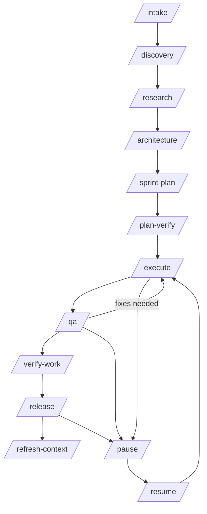
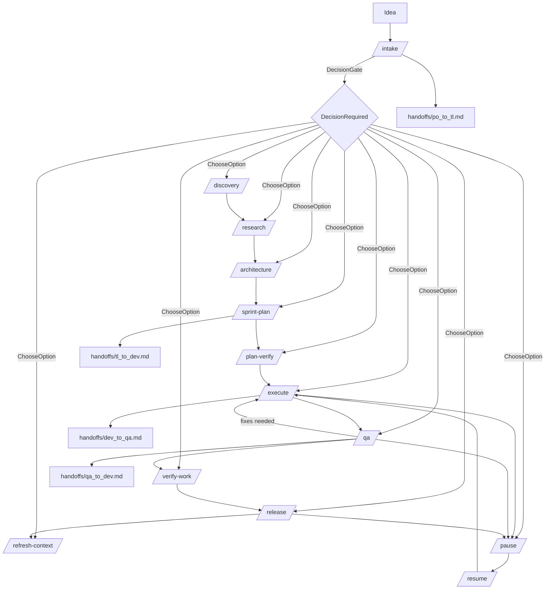
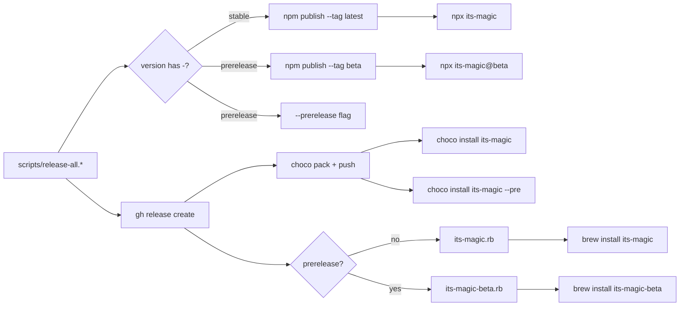
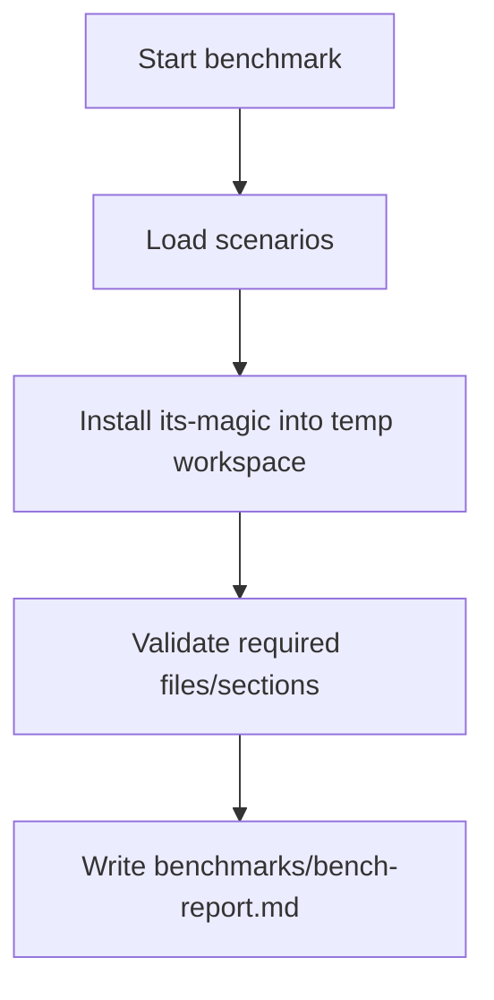
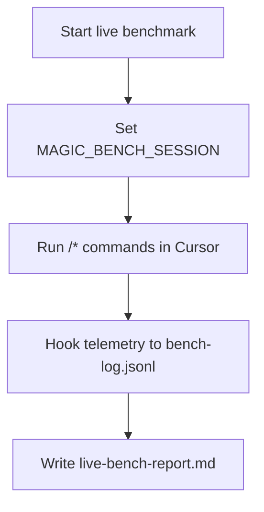
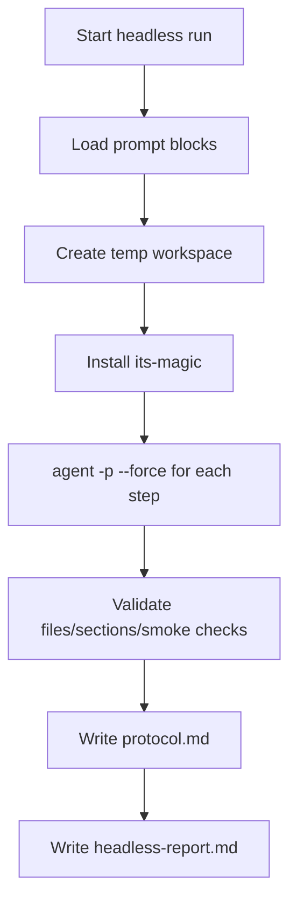

# its-magic — AI dev team

[GitHub Repository](https://github.com/fl0wm0ti0n/its-magic)

You bring the idea; its-magic is your structured **AI dev team** in Cursor — PO, Tech
Lead, Dev, QA, Release, and Curator — that turns ideas into shipped software through
explicit phases and handoff artifacts.

State lives in repo files (`docs/product`, `handoffs`, `sprints`, `decisions`) — not
chat-only memory. Run `/intake` with your idea, then follow intake → discovery →
architecture → sprint plan → execute → QA → release; pause/resume and decision gates
keep you in control when you want to steer. Implementers: see `docs/developer/README.md`
for the DEV shard.

When you want hands-off delivery, enable **`AUTO_FLOW_MODE=full_autonomy`**
(default-off), run **`/auto` once in Cursor**, and let the native in-chat auto-chain
drain your backlog — self-verify UAT, bounded block retry, and advance to the next OPEN
story or bug without re-invoking each phase manually. The outer driver is **optional**
(**fallback** for headless/CI or when native chain is unavailable). Guided and
decision-gated modes remain the default.

## Features (what its-magic can do)

### Autonomous AI workflow

- Run `/intake` through `/release` with explicit phase handoffs and fresh subagent contexts.
- Use `/pause` and `/resume` with checkpoints when you want to steer; escalate blocking
  choices to `decisions/DEC-xxxx.md`.
- Enable **`AUTO_FLOW_MODE=full_autonomy`** (default-off), run **`/auto` once in Cursor**,
  and drain backlog in-chat; outer driver is **optional** / **fallback** for headless/CI.
- Team mode routes work across PO, Tech Lead, Dev, QA, Release, and Curator roles.
- Backlog and bug drain advance OPEN items without re-invoking each phase manually.
- See the catalog in **Commands and workflow** for phase commands and orchestration details.

### Quality & verification gates

- 3-layer quality chain: AI execute/QA loop → local `validate-and-push` → CI auto-fix.
- Phase gates include `/plan-verify`, `/qa`, `/verify-work`, and `/uat` with fail-closed stops.
- `/acceptance` blocks README ↔ backlog drift; user-visible metadata guard on operator scripts.
- Browser UAT probes with structured fallback when live browser checks are unavailable.
- Release gates enforce coverage, parity, and evidence before publish.
- See the catalog in **Features** (`/acceptance`) and **Commands and workflow** for gate commands.

### Distribution & install

- Global install via npm, npx, Chocolatey, or Homebrew; apply to any repo with
  `its-magic --target`.
- Modes: `missing` (safe merge), `overwrite` (+ `--backup`), `upgrade` (framework only),
  and `--clean-repo`.
- Lifecycle QA matrix validates fresh install, upgrade, backup, and clean-repo paths.
- Multi-target release publish with confirmation gates for npm/choco/brew.
- See the **Feature coverage catalog** below for distribution-tagged items.

### Operator control & ergonomics

- Scratchpad flags and `scratchpad.local.md` tune behavior without rewriting framework files.
- Guided intake packs structure your first `/intake` conversation.
- Caveman voice mode and optional input compression for terse operator UX.
- `TOKEN_PROFILE` cost profiles slim context packs without changing workflow semantics.
- Voice input shortcuts and permissions/runtime connectivity for remote execution.
- See the catalog in **Other useful capabilities** for scratchpad and governance flags.

<!-- readme-feature-coverage-catalog -->

### Feature coverage catalog (US-0091)

- `/acceptance` — README ↔ backlog/acceptance feature coverage backfill + blocking drift gate (`US-0091`).
- `README.md` — Visionary intro + tiered feature hierarchy (autonomous AI dev team positioning, root/template parity) (`US-0094`).
- `/auto` — Native in-chat auto-chain + full-autonomy mode (`US-0095`, `US-0092`).
- `/bin` — POSIX npm installer + Linux remote test targets (WSL / SSH / Docker) (`US-0084`).
- `/choco` — Configurable Multi-Target Release Publish with Confirmation Gate (`US-0054`).
- `/devops` — First-Class Bug Issue Workflow (Open/Closed) (`US-0079`).
- `/engineering` — Agent-Driven Codebase Map Bootstrap (`US-0082`).
- `/engineering` — Remote Runtime Connectivity Contract for QA/Release/Publish (`US-0064`).
- `/install` — Template/install payload omits intake gate scripts (`BUG-0001`).
- `/installed` — its-magic ships its OWN packaging CI into generated repos, breaking CI in every created project (`BUG-0009`).
- `/intake` — Optional Caveman-style input compression (safe file scope) (`US-0090`).
- `/lint` — CI/CD Workflows (`US-0007`).
- `/or` — Cursor Caveman mode (scratchpad-configurable terse responses) (`US-0089`).
- `/push` — Multiplatform Distribution (`US-0009`).
- `/run-tests` — Baseline Regression Cleanup for Installer and Version Sync Checks (`US-0074`).
- `/template` — End-to-End Lifecycle QA for `its-magic` Install/Upgrade/Clean (`US-0041`).
- `/upgrade` — Missing scripts still occur on install modes missing/upgrade (`BUG-0003`).
- `/usr` — Global Linux install fails: empty `install_include_paths` when manifest is CRLF (`BUG-0008`).
- `/workdir` — installer.sh fails in shell path with `set: Illegal option -` (`BUG-0004`).
- `MIGRATION` scratchpad flag — Smart Upgrade Mode (`US-0018`).
- `US-0016` scratchpad flag — Homebrew Version Sync (`US-0016`).
- `/release` — Self-Healing Deploy Loop (post-deploy smoke probe + bounded repair) (`US-0109`).

## Setup

its-magic is an installer you run once per repo. It copies the AI dev team
workflow files (`.cursor/` commands, rules, agents, hooks, skills, plus `docs/`,
`sprints/`, `handoffs/`, etc.) into your project.

Starter artifacts are shipped as clean placeholders (no preloaded sprint/demo
history), so `/intake` starts from your own idea.

### 1) Install its-magic (once)

Pick one method:

| Method | Install command |
|--------|----------------|
| npm    | `npm install -g its-magic` |
| npx    | `npx its-magic --target . --mode missing` |
| Chocolatey | `choco install its-magic` (Admin shell) |
| Homebrew | `brew tap USER/tap && brew install its-magic` |

### Global Linux install: empty `install_include_paths` (CRLF manifest)

If **`its-magic --target <repo> --mode missing`** fails with **`[INSTALL_MANIFEST_ERROR] install_include_paths section is empty`** on Debian/Linux while the packaged manifest still lists paths, the global install likely has **CRLF** line endings in **`installer-owned-paths.manifest`** (visible as **`^M$`** with **`cat -A`**). **Fix in-tree** from **`0.1.2-41`**: **`installer.sh`** strips trailing carriage returns before section matching; **`.gitattributes`** keeps **`*.manifest`** LF; **`prepublishOnly`** runs **`guard_installer_publish`**. **Upgrade**: install a build **≥ `0.1.2-41`** (or reinstall from a fresh **`npm pack`** tarball after pull). Older tarballs such as **`its-magic@0.1.2-40`** may remain broken until republished — see **`docs/engineering/architecture.md`** **`# BUG-0008`**.

### 2) Apply to a repo

New repo:

```bash
mkdir my-project && cd my-project
git init
its-magic --target . --mode missing --create
```

Existing repo (safe merge):

```bash
its-magic --target . --mode missing
```

Existing repo (overwrite + backup):

```bash
its-magic --target . --mode overwrite --backup
```

### Upgrading an existing repo

When you update its-magic to a newer version (`npm update -g its-magic`), run
upgrade mode to update framework files while preserving your project data:

```bash
its-magic --target . --mode upgrade
```

What upgrade does:

- **Framework files** (commands, rules, agents, hooks, skills, CI, scripts) are
  updated to the latest version.
- **User data** (docs, sprints, handoffs, decisions, runbook) is never touched.
- **Mixed files** (`README.md`) are preserved. If the template version has new
  content, a review notice is printed.
- **Scratchpad baseline (DEC-0055 / US-0073, Model B):** `.cursor/scratchpad.md`
  is not copied as a manifest file; the installer **materializes** it from the
  packaged template when missing and validates required merged keys (Python
  required). Legacy repos that already committed `.cursor/scratchpad.md` keep it on
  upgrade (not overwritten).
- A canonical version marker is stored at `its_magic/.its-magic-version` in your repo.
- Installer bootstrap is OS-aware + stack-aware for runbook command defaults
  (`TEST_COMMAND`, optional `LINT_COMMAND`/`TYPECHECK_COMMAND`) and preserves
  explicit user overrides.

Upgrade with backup (backs up framework files before updating):

```bash
its-magic --target . --mode upgrade --backup
```

### 3) Open in Cursor

1. Open the project folder
2. Run `/intake` with your idea
3. Follow the workflow

### CLI quick commands

```bash
# Show banner + help
its-magic

# Show version only
its-magic --version

# Install workflow files into current repo
its-magic --target . --mode missing

# Clean previously installed workflow artifacts
its-magic --clean-repo --target .
```

### Installer options

**Install options**

| Flag | Description |
|------|-------------|
| `--target <path>` | Path to the repository where workflow files are installed. If omitted you are prompted interactively. |
| `--mode missing` | **Default.** Only copy files that do not exist yet. Safe for repos that already have some workflow files. |
| `--mode overwrite` | Replace every file, even if it already exists. Combine with `--backup` to keep a snapshot first. |
| `--mode interactive` | Ask per file whether to overwrite or skip. Useful when you want to cherry-pick updates. |
| `--mode upgrade` | Update framework files (commands, rules, agents, hooks, skills, CI, scripts) while preserving user data (docs, sprints, handoffs, decisions). Use after updating its-magic to a newer version. |
| `--backup` | Before overwriting, save existing files to `backups/<timestamp>/`. Ignored in `missing` mode (nothing gets replaced). |
| `--create` | Create the target directory if it does not exist. |

**Clean options**

| Flag | Description |
|------|-------------|
| `--clean-repo` | Remove installer-owned its-magic workflow artifacts from the target repo (manifest-owned paths including `.cursor`, `docs/product`, `docs/engineering`, `docs/user-guides`, `sprints`, `handoffs`, `decisions`, workflow scripts, CI files, installer metadata in `its_magic/`, and legacy `.its-magic-version`). Your own source code is never touched. |
| `--yes` | Skip the confirmation prompt when cleaning. |

**Info**

| Flag | Description |
|------|-------------|
| `--help`, `-h` | Show banner, version, repo URL, and full usage reference. |
| `--version`, `-v` | Print the installed its-magic version and exit. |

### Lifecycle QA matrix (US-0041)

`its-magic` lifecycle behavior is validated in both installer and CLI paths.
Primary coverage:

| Scenario | Local coverage | CI coverage | Expected evidence |
|---|---|---|---|
| Fresh install (`missing`) | `tests/run-tests.ps1`, `tests/run-tests.sh` | npm/brew/choco jobs | Required files + `its_magic/.its-magic-version` |
| Overwrite + backup | `tests/run-tests.ps1`, `tests/run-tests.sh` | lifecycle subset in CI jobs | Backup snapshot contains overwritten framework file |
| Upgrade lifecycle | `tests/run-tests.ps1`, `tests/run-tests.sh`, npm local package tests | lifecycle subset in CI jobs | Framework file restored, user-data preserved |
| Clean-repo safety | `tests/run-tests.ps1`, `tests/run-tests.sh`, npm local package tests | lifecycle subset in CI jobs | Framework artifacts removed, non-framework marker preserved |
| Negative-path invalid mode/args | `tests/run-tests.ps1`, `tests/run-tests.sh` | lifecycle subset in CI jobs | Non-zero fail-fast behavior |

Run locally:

```bash
sh tests/run-tests.sh
powershell -ExecutionPolicy Bypass -File tests/run-tests.ps1
```

## How-to

### Command usage pattern

- Best practice: use `/<command>` + 1-3 lines context.
- For quick ops (`/pause`, `/resume`, `/refresh-context`) command-only is fine.

### What gets installed

```text
your-project/
  .cursor/commands/          Cursor slash commands
  .cursor/rules/             AI behavior rules
  .cursor/agents/            Subagent definitions
  .cursor/skills/            Reusable skills
  .cursor/hooks/             Automation hooks
  .cursor/scratchpad.md      Materialized shared defaults (Model B; not manifest-copied)
  .cursor/scratchpad.local.example.md   Framework default key catalog
  docs/                      Engineering & product docs, runbook
  sprints/                   Sprint tracking artifacts
  handoffs/                  Phase handoff artifacts
  decisions/                 Decision records
  scripts/validate-and-push.ps1   Local test-fix-push loop (Windows)
  scripts/validate-and-push.sh    Local test-fix-push loop (Linux/Mac)
  .github/workflows/         CI with auto-fix loop
  README.md
```

### Team mode local overrides (recommended)

Use three layers (merge precedence: **local > materialized baseline > example**,
`DEC-0055`):

- Framework catalog: `.cursor/scratchpad.local.example.md` (installed; refreshed on upgrade)
- Shared team baseline: `.cursor/scratchpad.md` (materialized on install when missing; commit as you prefer)
- Personal overrides: `.cursor/scratchpad.local.md` (gitignored; never overwritten by install/upgrade)

Setup:

1. Run `its-magic` — baseline is materialized and merged validation runs (requires Python on PATH for `installer.ps1` / `installer.sh`).
2. Optionally copy `.cursor/scratchpad.local.example.md` to `.cursor/scratchpad.local.md` for personal values (`TEAM_MEMBER`, `ACTIVE_TASK_IDS`, …).

Recovery if `.cursor/scratchpad.md` is missing or merge validation fails:

```bash
python installer.py --scratchpad-postinstall --target . --mode missing
```

Upgrade behavior (US-0057 / DEC-0057):
- Aligns with **DEC-0039** (example vs local ownership), **DEC-0057** (example-first
  ordering relative to baseline materialization), and Model B baseline rules below.

- `.cursor/scratchpad.local.example.md` is framework-owned and always refreshed from
  the shipped template during post-install **before** baseline handling (`DEC-0057` **AC-1..AC-3**).
- `.cursor/scratchpad.local.md` is user-owned and preserved on `--mode upgrade`.
- Existing `.cursor/scratchpad.md` is left untouched on upgrade unless missing (then
  materialized) or `overwrite` / fresh materialize paths apply (Model B).
- Installer output uses `[SCRATCHPAD_LAYER]` lines to distinguish example refresh,
  baseline materialize/skip, and user-local preservation (`DEC-0057` **AC-5**).
- Paired catalog parity (baseline vs `.cursor/scratchpad.local.example.md`, active and
  `template/`): `python scripts/check-scratchpad-pair-parity.py --repo .` (wired into
  `tests/run-tests.ps1` / `tests/run-tests.sh`; **AC-11**).

Deterministic ordering behavior (US-0058):
- Mutable artifacts follow `docs/engineering/artifact-ordering-policy.md`.
- `state.md` checkpoints are append-bottom; `backlog.md` and `acceptance.md`
  remain sorted-canonical by story ID.
- Commands fail closed on ambiguous placement anchors using
  `ARTIFACT_ORDERING_ANCHOR_AMBIGUOUS`.
- Commands fail closed on non-monotonic state checkpoint timestamps using
  `STATE_TIMESTAMP_NON_MONOTONIC`.

Intake runtime safety behavior (US-0059):
- `/intake` requires role-specific `po` capability by default and fails fast with
  `SUBAGENT_CAPABILITY_UNAVAILABLE` when unavailable.
- Silent in-band fallback is disabled by default and only allowed with explicit
  `INTAKE_SUBAGENT_FALLBACK=allow`.
- Drift detection distinguishes self-write updates from external concurrent
  writers; true conflicting external writes fail safe with
  `INTAKE_CONCURRENT_WRITER_DETECTED`.

Runtime QA autopilot behavior (US-0065):
- Generated-project QA must include runtime proof chain:
  `startup -> readiness/connectivity -> log scan -> bounded retry -> verdict`.
- Deterministic runtime fail codes:
  `RUNTIME_STARTUP_FAILED`, `RUNTIME_ENDPOINT_UNREACHABLE`,
  `RUNTIME_LOG_CRITICAL_DETECTED`, `RUNTIME_RETRY_BUDGET_EXHAUSTED`,
  `RUNTIME_STACK_PROFILE_UNRESOLVED`.
- Runtime evidence must include startup command/profile, runtime mode
  (`local|remote`), health result, retry ledger, and log severity summary.
- Stack-aware runtime profile resolution is required for Node/Python/Go/Java/.NET;
  unresolved stacks fail closed (no generic silent PASS fallback).
- For webapp contexts, QA includes browser-surface verification with
  console/network error signals.

Generated test scaffolding + auto-run behavior (US-0066):
- `/execute` resolves stack profile (`node|python|go|java|dotnet`) and generates
  missing baseline unit/integration/acceptance tests only.
- Generation is non-destructive by default: preserve user-authored tests/config,
  fill only missing baseline assets, keep reruns idempotent.
- `TEST_COMMAND` wiring is deterministic:
  - preserve existing non-empty user command,
  - set stack baseline only when command is missing/unset.
- `/qa` automatically runs the generated baseline tests and records deterministic
  evidence (`command`, `result`, `output ref`, `generated paths ref`).
- Fail-closed scaffold diagnostics:
  `TEST_SCAFFOLD_STACK_UNRESOLVED`,
  `TEST_SCAFFOLD_UNSUPPORTED_STACK`,
  `TEST_SCAFFOLD_GENERATION_FAILED`.
- Static baseline test pass does not bypass runtime autopilot; runtime verdict
  remains mandatory for QA PASS.

## Commands and workflow

### Core commands

- `/ask`: ask questions using project context (read-only, no artifacts created).
- `/intake`: capture idea, backlog, acceptance.
- `/discovery`: collect UX/product references.
- `/research`: risks, patterns, dependencies.
- `/architecture`: technical approach and decisions.
- `/sprint-plan`: sprint and task list.
- `/plan-verify`: acceptance coverage check.
- `/execute`: implement tasks.
- `/qa`: test and report findings.
- `/verify-work`: UAT.
- `/release`: release notes + runbook updates.
- `/memory-audit`: read-only memory drift check with advisory report.
- `/pause`, `/resume`, `/refresh-context`.
- `/auto`: orchestration mode that spawns a fresh subagent per phase.

### Guided intake behavior (US-0033)

`/intake` supports two PO interaction modes via `.cursor/scratchpad.md`:

- `INTAKE_GUIDED_MODE=1` (default)
  - asks targeted follow-up only when needed for concrete acceptance
  - presents options/alternatives before recommendation
  - preserves user decision authority
  - runs intake-time research and persists R-xxxx evidence
- `INTAKE_GUIDED_MODE=0` (low-touch)
  - skips proactive follow-up/options/research overhead unless user requests it
  - still performs duplicate/overlap check against backlog

### Intake decomposition + risk-aware questioning (US-0051)

When guided mode is enabled, `/intake` now supports bounded decomposition for
broad/high-risk requests:

- runs deterministic breadth/risk heuristics (feature/workflow count,
  cross-cutting impact, acceptance breadth, unknown dependencies)
- proposes bounded multi-story decomposition when heuristics indicate broad
  scope; keeps single-story default for narrow scope
- enforces vertical-slice/workflow-step split quality (independently valuable,
  testable stories; avoid technical-layer-only splits by default)
- preserves user control before persistence: accept, merge, or adjust split
- asks additional targeted questions on high-risk/high-impact intake (not
  ambiguity-only), but keeps rounds bounded and concise
- keeps low-touch compatibility: no forced decomposition when
  `INTAKE_GUIDED_MODE=0` unless explicitly requested
- records decomposition/questioning evidence in intake artifacts
  (`docs/product/backlog.md`, `docs/product/acceptance.md`,
  `handoffs/po_to_tl.md`)

### Mandatory intake question packs (US-0068)

`/intake` now enforces deterministic minimum questionnaire packs before
backlog/acceptance persistence:

- `first-intake-pack` for first/new/broad requests
- `small-intake-pack` for narrow follow-up requests

Fail-closed coverage behavior:

- required topic answers must be covered for the selected pack before write
- unknown/ambiguous stack cues fail closed to `first-intake-pack`
- persistence blocks with deterministic reason codes when required coverage is
  incomplete and assumptions are not explicitly confirmed

Deterministic reason codes:

- `INTAKE_REQUIRED_TOPIC_MISSING`
- `INTAKE_REQUIRED_PACK_INCOMPLETE`
- `INTAKE_ASSUMPTION_CONFIRMATION_REQUIRED`
- `INTAKE_PERSISTENCE_BLOCKED`

Intake artifacts must persist coverage evidence fields:

- `asked_topics`
- `missing_topics`
- `assumptions_confirmed`

### Interactive intake evidence + validator (US-0078 / DEC-0060)

**US-0078** closes silent persistence: every intake that mutates backlog/acceptance must pass the
deterministic **`intake_evidence`** gate — **`topic_coverage`** with valid **`ie:`** refs,
asked-vs-covered alignment, and **`assumption_confirmation_ref`** when assumptions are affirmative.

- Run `python scripts/intake_evidence_validate.py --self-test` (also exercised via `tests/run-tests.*` §26k).
- **Packaged installs (BUG-0001 / DEC-0063)**: the intake gate modules (`intake_evidence_validate.py`, `intake_evidence_lib.py`, `intake_bug_routing_guard.py`) ship under **`template/scripts/`** and hydrate consumer repos at **`scripts/`** (npm **`files`**, Chocolatey/Homebrew **`template/`** tree, **`installer.ps1` / `installer.sh`** + **`installer-owned-paths.manifest`**). **`--mode upgrade`** treats them as framework files (added/updated like other shipped scripts). CI parity: **`python scripts/check_intake_template_parity.py --repo .`** (`tests/run-tests.*` §26N).
- Operator docs: **`decisions/DEC-0060.md`**, **`docs/engineering/architecture.md`** **`# US-0078`**, runbook section **Interactive intake evidence validation (US-0078 / DEC-0060)**.
- **Guided** and **low-touch** share the **same pre-persistence validation pipeline**; low-touch does not bypass mandatory pack coverage.

### Bug issues + intake routing (US-0079 / DEC-0061)

Defects use **`BUG-####`** under **`docs/product/backlog.md`** **`## Bug issues (canonical)`** with **`OPEN`/`DONE`** only and minimum reproducibility fields. Intake must not silently file defect prose as **`US-xxxx`**: set merged scratchpad **`INTAKE_WORK_ITEM_KIND=bug`** and/or use **`/intake bug`**, then run **`python scripts/intake_bug_routing_guard.py --kind story --file <prose.txt>`** before story allocation when in doubt.

- Validators: `python scripts/bug_issue_validate.py --self-test`; `python scripts/bug_issue_validate.py --backlog docs/product/backlog.md --check-acceptance`.
- Operator docs: **`decisions/DEC-0061.md`**, **`docs/engineering/architecture.md`** **`# US-0079`**, runbook **Bug issues (US-0079 / DEC-0061)**.

### Optional ID namespace bootstrap (US-0052)

Fresh-project ID bootstrap behavior is explicit and default-off:

- `ID_NAMESPACE_BOOTSTRAP=0|1` in `.cursor/scratchpad.md` (default `0`)

When enabled (`1`), workflows use deterministic freshness checks before first ID
creation:

- no `US-` IDs in `docs/product/backlog.md`
- no `DEC-` IDs in `docs/engineering/decisions.md` / `decisions/DEC-*.md`
- no `R-` IDs in `docs/engineering/research.md`

If eligible, first IDs start at `US-0001`, `DEC-0001`, and `R-0001`. If not
eligible (or mode is off), generation continues from highest existing IDs.
Historical IDs are never rewritten or renumbered. Ineligible bootstrap requests
emit deterministic diagnostic `ID_BOOTSTRAP_NOT_FRESH`.

### Context compaction + tiered token profile (US-0053)

Token-cost behavior is controlled by `.cursor/scratchpad.md`:

- `TOKEN_PROFILE=lean|balanced|full` (default `balanced`)

Profile behavior:

- `lean`: reduce non-critical overhead defaults (automation/research/context
  breadth) while keeping mandatory quality gates intact.
- `balanced`: preserve current capabilities with moderate overhead.
- `full`: maximize context breadth/autonomy for high-uncertainty work.

Manual override precedence:

- Explicit scratchpad flag values override profile defaults for that flag.
- Profile mode never disables mandatory `/qa` -> `/verify-work` -> `/release`
  gate semantics.

Compaction behavior:

- `docs/engineering/state.md` is the active hot surface.
- Historical checkpoints move to append-only packs under
  `docs/engineering/state-archive/`.
- `docs/engineering/decisions.md` stays a compact index with bounded summaries
  and canonical links to `decisions/DEC-xxxx.md`.
- Enforced rollover thresholds:
  - `STATE_HOT_MAX_LINES` (default `1200`)
  - `STATE_HOT_MAX_CHECKPOINTS` (default `80`)
  - `PO_TO_TL_HOT_MAX_LINES` (default `800`)
  - `PO_TO_TL_HOT_MAX_SECTIONS` (default `60`)
  - `ARCH_HOT_MAX_LINES` (default `3500`)
  - `ARCH_HOT_MAX_STORY_SECTIONS` (default `120`)
  Triad hot surfaces (`state.md`, `handoffs/po_to_tl.md`,
  `docs/engineering/architecture.md`) must stay within merged scratchpad caps.

### Token-cost measurement and low-cache patterns (US-0080 / DEC-0062)

- Prefer **fresh subagent/chat boundaries** per `/auto` phase spawn (see `.cursor/commands/auto.md`).
- Use explicit **`/auto start-from=<phase>`** when resuming so **`resolved_phase_plan`**
  intersection stays deterministic (**`DEC-0052`**).
- Select **`TOKEN_PROFILE=lean`** when compatible with your work to reduce scratchpad-driven
  breadth; mandatory gates (**`US-0048`**, **`US-0056`**, **`US-0069`**, **`US-0039`**) stay on.
- **Comparable** cache-read baselines require identical **`run_class_hash`**; otherwise
  **`TOKEN_COST_RUN_CLASS_MISMATCH`** (no cross-plan gaming).
- Committed metrics: **`handoffs/token_cost_runs/<orchestrator_run_id>.md`**; link from
  **`docs/engineering/state.md`** via **`token_cost_evidence_ref`**.
- Tooling: **`scripts/token_cost_lib.py`**, **`scripts/token_cost_compare.py`**,
  **`python scripts/check_token_cost_parity.py --repo .`**.
  Use `python scripts/enforce-triad-hot-surface.py --check` before completing a
  phase that mutates them; use `--rollover` to archive oldest material into
  deterministic packs when over cap (DEC-0054).
  Archive verification mismatch fails with
  `STATE_ARCHIVE_VERIFICATION_FAILED`.

### Cross-phase artifact ownership guard (US-0061)

To prevent accidental history loss across workflow phases:

- canonical ownership policy: `docs/engineering/artifact-ownership-policy.md`
- non-authorized phases must not delete or rewrite other-phase owned sections
- `docs/engineering/architecture.md` is history-preserving (append or
  target-section-only mutation)
- deterministic fail-safe diagnostics:
  `PHASE_OWNERSHIP_VIOLATION`,
  `PHASE_OVERRIDE_EVIDENCE_MISSING`,
  `ARCH_HISTORY_DELETION_DETECTED`

`/ask` policy (read-only):

- question-scoped retrieval first
- targeted sections before broad file reads
- bounded expansion only when unresolved
- explicit "not found in artifacts" when still unresolved

### Configurable multi-target publish + confirmation gate (US-0054)

Post-release publish behavior is configurable per repository:

- `RELEASE_PUBLISH_MODE=disabled|confirm|auto` (default `confirm`)
- `RELEASE_TARGETS_FILE=docs/engineering/release-targets.json`
- `RELEASE_TARGETS_DEFAULT=` optional comma-separated default targets

Supported target types include:

- `npm`, `choco`, `brew`, `git`, `docker`, `cloud`
- `custom` (generic command target)
- `ssh` (generic server deployment over SSH)
- Connectivity metadata for remote/local operator context:
  - `runtime.mode` (`local|remote`)
  - endpoint fields (`domainEnv|ipEnv|hostEnv`, `port`, `protocol`)
  - optional Traefik/ingress metadata
  - optional `dockerOverSsh` contract for remote Docker execution over SSH

Safety defaults:

- Mandatory `/release` gates are unchanged and must pass first.
- `confirm` mode enforces explicit operator approval before publish execution.
- Sensitive values are env-referenced (for example `tokenEnv`, `authEnv`), not
  inline literals.
- Remote connectivity config errors fail fast with
  `REMOTE_CONNECTIVITY_CONFIG_INVALID`.
- Release/QA outputs use canonical operator connectivity doc:
  `docs/engineering/runtime-connectivity.md`.

### Deterministic status reconciliation command (US-0055)

Use `/status-reconcile` to normalize status drift between canonical and derived
workflow artifacts before continuation:

- canonical source: `docs/product/backlog.md` story status
- derived targets: `docs/product/acceptance.md`, `docs/engineering/state.md`,
  `handoffs/resume_brief.md`
- deterministic outcomes: apply/no-op/fail-safe reason codes with audit evidence
  in `docs/engineering/status-normalization-report.md`

This command is the bounded repair counterpart to `/memory-audit`
(read-only detection).

### Optional cross-repo observability (US-0034)

Use optional compatibility visibility with default-safe off behavior:

- `CROSS_REPO_OBSERVABILITY=0|1` (default `0`)
- `COMPATIBILITY_GATE_ON_CRITICAL=0|1` (default `1`)
- `COMPATIBILITY_SOURCES=` monitored `repo/module/contract/docs` declarations

When disabled (`0`), workflow adds zero required compatibility overhead.

When enabled (`1`), compatibility signals/findings are tracked in:

- `docs/engineering/compatibility-signals.md`
- `docs/engineering/compatibility-report.md`
- `docs/engineering/manifests/registry.manifest.yaml`
- `docs/engineering/manifests/repo.manifest.yaml`

If unresolved critical findings remain and
`COMPATIBILITY_GATE_ON_CRITICAL=1`, release progression must stop for a
decision gate (`COMPATIBILITY_CRITICAL_OPEN`).

### Optional component-scoped execution (US-0035)

Enable scoped workflow behavior with:

- `COMPONENT_SCOPE_MODE=0|1` (default `0`)
- `TARGET_COMPONENTS=<comma-separated-component-ids>`

When disabled (`0`), workflow adds zero required scope overhead.

When enabled (`1`):

- Scope declaration is tracked in `docs/engineering/component-scope.md`.
- Sprint tasks should declare target components and expected impacted interfaces.
- QA records unaffected-component protection checks in
  `docs/engineering/component-scope-report.md`.
- Unapproved out-of-scope impact must block release via decision gate
  (`COMPONENT_SCOPE_VIOLATION_UNAPPROVED`).

### Optional spec-pack documentation (US-0031)

Optional Design Concept, CRS, and Technical Specification artifacts are
controlled by:

- `SPEC_PACK_MODE=0|1` (default `0`)

When disabled (`0`), intake/architecture/execute/qa/release add no required
spec-pack steps (zero overhead).

When enabled (`1`):

- Canonical paths per story: `docs/engineering/spec-pack/<story_id>-design-concept.md`,
  `docs/engineering/spec-pack/<story_id>-crs.md`,
  `docs/engineering/spec-pack/<story_id>-technical-specification.md`.
- Minimum required sections and ownership are in `docs/engineering/runbook.md`.
- Release gate validates completeness and blocks with `SPEC_PACK_INCOMPLETE` when
  required sections are missing.

### Optional user-guide documentation (US-0032)

Optional per-feature user guides (end-user how-to docs) are controlled by:

- `USER_GUIDE_MODE=0|1` (default `0`)

When disabled (`0`), intake/architecture/sprint-plan/execute/qa/release add no
required user-guide steps or blocking checks (zero overhead).

When enabled (`1`):

- Canonical path per feature story: `docs/user-guides/US-xxxx.md`.
- Minimum required sections: Purpose, Prerequisites, Usage steps, Example,
  Limitations, Troubleshooting (see `docs/engineering/runbook.md` and
  `docs/user-guides/README.md`).
- Release gate validates guide completeness and blocks with `USER_GUIDE_INCOMPLETE`
  when enabled and required sections are missing.
- User guides are end-user only; they do not duplicate spec-pack (US-0031) content.

### Release notes model (US-0040)

Release history is sprint-scoped and queue-backed:

- Canonical sprint notes: `handoffs/releases/Sxxxx-release-notes.md`
- Canonical queue tracker: `handoffs/release_queue.md`
- Legacy compatibility pointer: `handoffs/release_notes.md`

Deterministic release semantics:
- Only target sprint artifacts/queue row may be mutated during one `/release` run.
- Entering release flow sets target row to `unreleased`.
- Successful finalization transitions same row to `released`.
- Unresolved sprint identity or queue/notes mismatch fails closed with reason
  codes and remediation guidance; no destructive reconciliation by default.

### Post-QA release issue workflow (US-0042)

Release gate chain (US-0039): `/release` enforces mandatory gates in order — check-in test, QA completion, UAT completion — then finalization. Blank optional runbook keys (`LINT_COMMAND`, `TYPECHECK_COMMAND`) do not block release; they are reported as skipped.

If a problem appears **after QA** (during `/release`), record it separately from
QA findings:

- Release findings artifact: `sprints/Sxxxx/release-findings.md`
- Release-to-dev handoff: `handoffs/release_to_dev.md`

Boundary:
- QA-phase issues -> `sprints/Sxxxx/qa-findings.md`
- Post-QA release-gate issues -> `sprints/Sxxxx/release-findings.md`

Each blocked release finding should include reason code, evidence refs,
remediation, and rerun criteria.

### Backlog reconciliation invariant (US-0043)

Release completion must not leave stale backlog status for target sprint stories.
At release finalization:

- reconcile target story status to `DONE` using canonical release evidence;
- reconcile target story acceptance checkboxes to checked state;
- mutate only target sprint stories (never unrelated backlog entries);
- fail safe with `BACKLOG_STATUS_DRIFT` if contradiction remains (e.g. released
  sprint but backlog still `OPEN`/unchecked).

### Canonical story status + normalization guard (US-0045)

- `docs/product/backlog.md` is canonical for story `OPEN|DONE` status.
- `docs/product/acceptance.md` and `docs/engineering/state.md` are derived views
  reconciled from canonical backlog status plus release evidence.
- One-time normalization baseline is recorded in
  `docs/engineering/status-normalization-report.md`.
- Contradictory resolution at release/reconciliation boundaries fails safe with:
  - `BACKLOG_STATUS_DRIFT`
  - `CANONICAL_STATUS_CONFLICT`

### Agent isolation model

- Every phase command runs in a fresh agent/subagent context.
- Handoff files are the only cross-phase memory (`handoffs/*.md` + artifact
  files).
- Never rely on "ignore prior chat"; use a new context boundary instead.
- `/auto` is orchestration only: it calls phase subagents and transfers context
  through artifacts.

#### Per-phase isolation evidence (US-0048 / DEC-0029)

Isolation is enforced with auditable evidence written to `docs/engineering/state.md`.
Each phase run appends:

- `phase_id`, `role`, `fresh_context_marker`, `timestamp`, `evidence_ref`

Missing/invalid/stale evidence fails closed with reason codes:
`PHASE_CONTEXT_ISOLATION_MISSING`, `PHASE_CONTEXT_ISOLATION_VIOLATION`,
`ISOLATION_EVIDENCE_STALE`, `ISOLATION_EVIDENCE_INVALID`.

#### Strict runtime proof (US-0056 / DEC-0038)

Per-phase isolation also requires strict runtime attestation tuples at
boundaries (not artifact fields alone):

- `orchestrator_run_id`, `runtime_proof_id`, `phase_id`, `role`
- `proof_issued_at`, `proof_ttl_seconds`, `proof_hash`

Fail-closed reason codes:
`RUNTIME_PROOF_MISSING`, `RUNTIME_PROOF_INVALID`, `RUNTIME_PROOF_REUSED`,
`RUNTIME_PROOF_STALE`, `RUNTIME_PROOF_AMBIGUOUS_LINK`.

`/auto`, `/verify-work`, and `/release` must validate these tuples before
continuation/finalization.

#### `/auto` phase→role enforcement (US-0069 / DEC-0051)

`/auto` uses a deterministic **phase→role matrix** plus scratchpad alternates
(`AUTO_ROLE_RESEARCH`, `AUTO_ROLE_PLAN_VERIFY`, `AUTO_ROLE_REFRESH_CONTEXT`).
Before each phase spawn it runs a **preflight capability gate**; missing
capability stops with `PHASE_ROLE_CAPABILITY_MISSING` (no unrelated-role
substitution). After each phase, isolation `role` and strict-proof `role` must
match the same expected role or the run stops with `PHASE_ROLE_MISMATCH`.
`execute` defaults to `dev`; non-`dev` requires
`AUTO_EXECUTE_ROLE_OVERRIDE=allowed_non_dev_execute` **and**
`EXECUTE_OVERRIDE_GOVERNANCE_REF` pointing to a parseable approved waiver. See
`docs/engineering/runbook.md` and `decisions/DEC-0051.md`.

#### `/auto` phase selection policy (US-0070 / DEC-0052)

`/auto` builds a **resolved phase plan** from scratchpad before spawning phases:
exactly one of `AUTO_PHASE_PLAN` (default `full`), `AUTO_PHASE_EXCLUDE`,
`AUTO_PHASE_INCLUDE`, or `AUTO_PHASE_PROFILE` applies; conflicting selectors
stop with `PHASE_POLICY_CONFLICT`. Non-skippable safety gates (`qa`,
`verify-work`, `release`) and evidence-chain closure reinstate omitted phases
with breadcrumb reasons such as `non_skippable_gate`. `start-from` and resume
anchors **intersect** with the plan (`START_FROM_PHASE_PLAN_EMPTY_INTERSECTION`
when empty). Backlog-drain, bulk execute, and team-mode runs **recompute** the
plan each boundary. See `/auto`, `docs/engineering/runbook.md`, and
`decisions/DEC-0052.md`.

### Lightweight interaction

Use `/ask` when you want to query the project without triggering the workflow:

- "What's the current sprint status?"
- "Which stories are still open?"
- "How does the upgrade mode work?"
- "What decision was made about X?"

`/ask` reads the project artifacts (state, backlog, architecture, decisions, sprint
progress) and answers from them. It never creates or modifies files. If your question
reveals a bug or feature idea, it will suggest running `/intake`.

### Memory drift auditing

Use `/memory-audit` to check whether project memory artifacts still match
repository reality. This is a read-only, non-blocking command that produces an
advisory report at `docs/engineering/memory-drift-report.md`.

**When to run:**

- **Pre-handoff**: before writing any role handoff artifact.
- **Pre-QA**: before `/qa` or `/verify-work`.
- **Pre-release**: before `/release`.
- **Ad-hoc**: after external code changes, long pauses, or whenever artifacts
  feel stale.

**How to interpret output:**

The report contains a severity summary (`high` / `medium` / `low`) and a
findings table with concrete evidence for each inconsistency. High-severity
findings should be resolved before the next handoff or release. Medium and low
findings can be addressed during `/refresh-context` or the next sprint.

The report also includes a reference-only "Template drift" section. Template
drift remediation belongs to US-0017 — `/memory-audit` only flags it for
awareness.

**Follow-up commands:**

- `/refresh-context` — update stale artifacts.
- `/sprint-plan` — if new work is discovered.
- `/verify-work` — if acceptance status needs re-validation.
- `/intake` — if findings reveal a new story or bug.

### Workflow diagrams





### Automation modes

Configure in `.cursor/scratchpad.md`:

- `AUTO_FLOW_MODE=manual|auto_until_decision`  
  - `manual`: you trigger each phase/command yourself.  
  - `auto_until_decision`: `/auto` continues by spawning fresh phase subagents until a decision gate, blocker, or pause boundary.
- `PHASE_MODE=interactive|auto`  
  - `interactive`: agent asks clarifying questions more often.  
  - `auto`: agent minimizes prompts and proceeds with best effort.
- `PERMISSION_MODE=interactive|auto`  
  - `interactive`: ask before routine actions.  
  - `auto`: reduce routine permission prompts.
- `RUN_TESTS_ON_EDIT=0|1`  
  - `1`: runs configured tests after meaningful edits.  
  - `0`: tests only when you explicitly run QA/test phases.
- `LOOP_UNTIL_GREEN=0|1`  
  - `1`: keep iterating fix -> test until green (bounded).  
  - `0`: run one pass and report failures.
- `AUTO_IMPLEMENTATION_LOOP=0|1`  
  - `1`: enables execute -> QA -> execute loop automatically with new Dev/QA subagent instances on each cycle.
- `AUTO_LOOP_MAX_CYCLES=<n>`  
  - safety cap for auto loops (recommended `3-7`, default `5`).
- `AUTO_PAUSE_REQUEST=0|1`  
  - `1`: request graceful stop at next safe boundary.
- `AUTO_PAUSE_POLICY=after_task|after_phase`  
  - `after_task`: faster stop, more frequent boundaries.  
  - `after_phase`: cleaner checkpoints, fewer interruptions.

### Sync policy (US-0038)

Phase-triggered sync is policy-controlled and safe by default.

Scratchpad controls:

- `SYNC_POLICY_MODE=disabled|manual|by_phase|by_milestone|custom_phase_list`
- `SYNC_CUSTOM_PHASES=<comma-separated canonical phases>`
- `ALLOW_AUTO_PUSH=0|1`
- `AUTO_PUSH_BRANCH_ALLOWLIST=<comma-separated branches/patterns>`

Default-safe behavior:

- Default mode is `manual` with `ALLOW_AUTO_PUSH=0` (no automatic push).
- `disabled` and `manual` add near-zero overhead and preserve manual workflows.
- Sync policy is evaluated only at completed phase boundaries.

Guarded auto-push conditions (all must pass):

1. Boundary matches configured mode.
2. Auto-push is explicitly enabled (`ALLOW_AUTO_PUSH=1`).
3. QA-first safety holds (feature work cannot auto-push pre-QA).
4. No unresolved blocking QA findings/critical issues.
5. Branch safety holds (protected/default branches denied unless allowlisted).
6. Check chain passes (`TEST_COMMAND` required; optional lint/typecheck only if configured).

Deterministic reason codes include:
`SYNC_DISABLED`, `MANUAL_MODE_NO_AUTO`, `PRE_QA_AUTOPUSH_FORBIDDEN`,
`BLOCKING_QA_FINDINGS`, `BRANCH_NOT_ALLOWLISTED`, `TEST_COMMAND_MISSING`,
`TEST_FAILED`, `TEST_TIMEOUT`, `OPTIONAL_CHECK_FAILED`, `SYNC_PUSHED`.

### Sovereign-loop era (US-0103–US-0112) umbrella section

The sovereign-loop era features form an opt-in orchestration layer that adds
institutional memory, adversarial review, deferral drain, parallel dev
arbitrage, self-healing deploy, and goal-based convergence on top of the base
`/auto` chain. Every feature in this family is **default-off** — when its master
enable flag is `0` (or `phase_driven` for US-0110), the framework is
byte-identical to the pre-sovereign-loop baseline (zero overhead, no schema
changes, no extra spawns, no extra file writes).

**Recommended enable order** (each gate builds on the previous):

1. `AI_DECISION_LEDGER=1` (`US-0103`) — foundation audit ledger; every other
   sovereign-loop feature reads or appends to it.
2. `SOVEREIGN_MEMORY=1` (`US-0105`) — bounded institutional memory injection.
3. `CROSS_MODEL_REVIEW=1` (`US-0104`) — adversarial critic before QA.
4. `SOVEREIGN_GOAL_MODE=goal_convergence` (`US-0110`) — terminal predicate.
5. `AUTO_SOVEREIGN=1` (`US-0107`) — orchestrator deferral drain + notifications
   (requires `SOVEREIGN_GOAL_MODE=goal_convergence` — fail-closed
   `SOVEREIGN_LOOP_GOAL_MODE_REQUIRED`).
6. `SOVEREIGN_PARALLEL_DEV=1` (`US-0108`) — parallel dev arbitrage (cost
   multiplier; enable only for high-stakes execute cycles).
7. `AUTO_SOVEREIGN_SELF_HEALING_DEPLOY=1` (`US-0109`) — post-deploy smoke probe
   + bounded retry (requires a deployed surface —
   `AUTO_SOVEREIGN_DEPLOY_HEALTH_ENDPOINT` must resolve via US-0085 compose).
8. `RELEASE_TRIGGER_SOURCE=github|npm|git_tag|auto` (`US-0111`) —
   release-trigger adapter dispatch (default `manual` = byte-identical to
   pre-US-0111 path).
9. Model-catalog example presets (`US-0112`) — passive payload; opt in by
   copying an example file to `.cursor/model-catalog.local.json`.

**Runbook pointer:** See the per-feature runbook sections (cross-linked in
each subsection below) for reason-code inventories, troubleshooting recipes,
and compose-guard matrices.

**Zero-overhead-when-off contract:** When all master enable flags are at their
defaults (`AI_DECISION_LEDGER=0`, `CROSS_MODEL_REVIEW=0`, `SOVEREIGN_MEMORY=0`,
`AUTO_SOVEREIGN=0`, `SOVEREIGN_PARALLEL_DEV=0`,
`AUTO_SOVEREIGN_SELF_HEALING_DEPLOY=0`, `SOVEREIGN_GOAL_MODE=phase_driven`,
`RELEASE_TRIGGER_SOURCE=manual`), the framework is byte-identical to the
pre-sovereign-loop era baseline.

#### US-0103 — AI Decision Ledger + Plan Fidelity

Per-run audit ledger (`handoffs/sovereign_decisions/<run_id>.jsonl`) recording
every phase-level decision tuple (`decision_type`, `payload`, `timestamp`,
`orchestrator_run_id`, ...). When enabled, plan-fidelity policy enforces that
the producer phase does not drop, reorder, or scope-add tasks against the
locked sprint plan without an explicit ledger entry. Sovereign-loop foundation
— every other sovereign-loop feature reads or appends to this ledger.

- `AI_DECISION_LEDGER=0|1` (default `0`) — master enable. When `0`: no ledger
  reads/writes/schema checks.
- `AUTO_PLAN_FIDELITY=strict|relaxed|extended` (default `strict`) — active only
  when ledger enabled. `strict` = any unapproved drop/reorder/scope-add →
  `PLAN_FIDELITY_VIOLATION` hard stop. `relaxed` = drop/reorder allowed
  (ledger entry); scope-add still hard stop. `extended` = scope-add allowed
  (extension report); drop/reorder allowed.

When `AI_DECISION_LEDGER=0`, no ledger reads/writes/schema checks — zero
overhead.

Runbook cross-link: `docs/engineering/runbook.md` § AI Decision Ledger
(US-0103 / DEC-0103).

#### US-0104 — Cross-Model Adversarial Critic

Spawns a second model instance (the "critic") with one of three review lenses
(security / perf / correctness) to adversarially review the producer's artifact
before QA. Emits `sovereign_critic_findings.jsonl` with an aggregate
anti-slop score (0–10) and per-lens findings. If the aggregate falls below the
threshold, the producer is re-spawned up to the rework cap. Optional degraded
fallback when the second model is unavailable.

- `CROSS_MODEL_REVIEW=0|1` (default `0`) — master enable.
- `CROSS_MODEL_ANTISLOP_THRESHOLD=int 0-10` (default `6`) — aggregate floor.
- `CROSS_MODEL_REWORK_MAX=int >=0` (default `2`) — producer re-spawn cap per
  (run, phase).

When `CROSS_MODEL_REVIEW=0`, zero overhead — no critic spawn, no findings
writes, no anti-slop gate.

Runbook cross-link: `docs/engineering/runbook.md` § Cross-Model Adversarial
Critic (US-0104).

#### US-0105 — Sovereign Memory

Project-level institutional memory substrate — four JSONL families (patterns,
mistakes, decisions, retrospectives) read by
`sovereign_memory_lib.assemble_sovereign_memory_digest(...)` at phase-context
narrow-read time. Bounded injection into producer prompts (hard char cap).
Default-off; when off, no JSONL writes/reads, no digest assembly, no
injection.

- `SOVEREIGN_MEMORY=0|1` (default `0`) — master enable.
- `SOVEREIGN_MEMORY_TOP_N=int >=0` (default `5`) — global recent pool (all four
  JSONL families).
- `SOVEREIGN_MEMORY_TOP_K=int >=0` (default `3`) — high-impact pool (patterns
  + mistakes only).
- `SOVEREIGN_MEMORY_MAX_CHARS=int >=0` (default `2048`) — hard cap on
  assembled digest text.
- `SOVEREIGN_MEMORY_JSONL_MAX_LINES=int >=1` (default `500`) — active JSONL
  line cap before archive rollover.

When `SOVEREIGN_MEMORY=0`, zero overhead — no JSONL writes, no injection
reads, no spawn digest assembly.

Runbook cross-link: `docs/engineering/runbook.md` § Sovereign Memory
(US-0105).

#### US-0107 — Sovereign Loop Mode (AUTO_SOVEREIGN)

Project-level orchestration loop that maintains a deferral register
(`handoffs/sovereign_deferrals.jsonl`), drains open deferrals via
`advance_sovereign_loop(...)`, and emits operator notifications. When enabled,
requires `SOVEREIGN_GOAL_MODE=goal_convergence` (fail-closed
`SOVEREIGN_LOOP_GOAL_MODE_REQUIRED`). The orchestrator continues per the
deferral policy when deferrals are present — it does NOT halt.

- `AUTO_SOVEREIGN=0|1` (default `0`) — master enable.
- `AUTO_SOVEREIGN_DEFERRAL_MAX=int >=1` (default `50`) — max open deferral
  rows.
- `AUTO_SOVEREIGN_DRAIN_GENERATE_MAX=int >=0` (default `3`) — drain-generate
  iterations per run.
- `AUTO_SOVEREIGN_DEFERRAL_POLICY=stop|skip|resolve_first` (default
  `resolve_first`) — orchestrator behavior when deferrals present.
- `SOVEREIGN_NOTIFY_TARGET=off|ntfy|email|hook` (default `off`).
- `SOVEREIGN_NOTIFY_NTFY_TOPIC`, `SOVEREIGN_NOTIFY_NTFY_BASE`,
  `SOVEREIGN_NOTIFY_HOOK_URL`, `SOVEREIGN_NOTIFY_EMAIL_TO` (default empty —
  local-only).

When `AUTO_SOVEREIGN=0`, zero overhead — no deferral reads/writes, no advance,
no notifications.

Runbook cross-link: `docs/engineering/runbook.md` § Sovereign Loop Mode
(US-0107).

#### US-0108 — Parallel Instance Arbitrage for dev phase

Under `SOVEREIGN_PARALLEL_DEV=1`, the execute phase spawns N dev subagents in
isolated git worktrees for the same task, runs a parallel QA cross-review
across all N, selects a winner deterministically (PASS → highest anti-slop →
earliest proof), and merges the winner to main. A system-wide resource guard
caps total parallel instances. Loser worktrees are cleaned up unless retention
is enabled.

- `SOVEREIGN_PARALLEL_DEV=0|1` (default `0`) — global enable gate.
- `AUTO_SOVEREIGN_PARALLEL_N=int >=1` (default `3`) — instances per execute
  cycle.
- `AUTO_SOVEREIGN_PARALLEL_MAX_TOTAL=int >=1` (default `6`) — system-wide
  instance cap.
- `AUTO_SOVEREIGN_MERGE_RESOLVE=first_pass_wins|last_pass_wins|winner_takes_all|manual`
  (default `first_pass_wins`).
- `AUTO_SOVEREIGN_WORKTREE_KEEP=0|1` (default `0`) — retain loser worktrees
  for debugging.
- `AUTO_SOVEREIGN_PARALLEL_QA=0|1` (default `0`) — enable parallel QA
  cross-review (v2).
- `AUTO_SOVEREIGN_PARALLEL_QA_ARBITER=critic_first_pass|majority_vote`
  (default `critic_first_pass`).
- `AUTO_SOVEREIGN_PARALLEL_ANTI_SLOP_THRESHOLD=int 0-10` (default `6`) —
  anti-slop floor.
- `AUTO_SOVEREIGN_PARALLEL_REWORK_MAX=int >=0` (default `2`) — per-instance
  rework cap.
- `AUTO_SOVEREIGN_PARALLEL_MERGE_TIMEOUT_SEC=int >=10` (default `60`) —
  merge timeout.
- `AUTO_SOVEREIGN_PARALLEL_MODEL_<idx>`, `AUTO_SOVEREIGN_PARALLEL_LENS_<idx>`
  (optional, per-instance overrides).

When `SOVEREIGN_PARALLEL_DEV=0`, zero overhead — no worktrees, no parallel QA,
no pick JSON, no resource guard.

Runbook cross-link: `docs/engineering/runbook.md` § Parallel Instance
Arbitrage (US-0108).

#### US-0109 — Self-Healing Deploy Loop

Post-publish smoke probe + bounded retry loop layered on top of the publish
chain. After the publish step succeeds, a two-stage smoke probe (health HTTP
GET + acceptance smoke runner) validates the deployed artifact. On probe FAIL,
the publish path is re-entered idempotently up to the retry cap. After
retry-cap exhaustion, a `DEPLOY_DEFERRED` tuple is written to the US-0107
deferral register.

- `AUTO_SOVEREIGN_SELF_HEALING_DEPLOY=0|1` (default `0`) — global gate.
- `AUTO_SOVEREIGN_DEPLOY_RETRY_MAX=int >=1` (default `3`) — max retry
  attempts after probe FAIL.
- `AUTO_SOVEREIGN_DEPLOY_SMOKE_TIMEOUT_SEC=int >=1` (default `30`) —
  per-stage probe HTTP timeout.
- `AUTO_SOVEREIGN_DEPLOY_PROBE_KIND=health_endpoint|acceptance_smoke|both`
  (default `both`).
- `SOVEREIGN_DEPLOY_ACCEPTANCE_SMOKE_PATH=repo-relative path` (default
  `tests/deploy_smoke/`).
- `AUTO_SOVEREIGN_DEPLOY_HEALTH_ENDPOINT=names-only env ref` (default empty
  = unresolvable; US-0085 compose).

When `AUTO_SOVEREIGN_SELF_HEALING_DEPLOY=0`, zero overhead, byte-identical
publish path — no probe, no retry, no deferral, no execute healing steps.

Runbook cross-link: `docs/engineering/runbook.md` § Self-Healing Deploy Loop
(US-0109 / DEC-0109).

#### US-0110 — Goal-Based Convergence Loops

Sovereign-loop terminal predicate. When `SOVEREIGN_GOAL_MODE=goal_convergence`,
the orchestrator evaluates an explicit or auto-derived goal at phase
boundaries and emits a `goal_progress` block. Iteration-count cap bounds the
loop; `0` = disabled (not wall-clock). When `SOVEREIGN_GOAL_MODE=phase_driven`,
zero overhead — no evaluation, no `goal_progress` block, no partial-delivery
write.

- `SOVEREIGN_GOAL_MODE=phase_driven|goal_convergence` (default
  `phase_driven`) — master enable (mode-gated).
- `SOVEREIGN_GOAL=explicit goal text` (default empty; wins over vision
  auto-derive).
- `SOVEREIGN_GOAL_TOP_N=int >=1` (default `3`) — vision paragraph count for
  auto-derive.
- `SOVEREIGN_GOAL_MAX_CHARS=int >=64` (default `512`) — truncation cap.
- `SOVEREIGN_GOAL_TIMEOUT_MAX=int >=0` (default `0` = disabled;
  iteration-count cap, not wall-clock).

When `SOVEREIGN_GOAL_MODE=phase_driven`, zero overhead — no evaluation, no
`goal_progress` block, no partial-delivery write.

Runbook cross-link: `docs/engineering/runbook.md` § Goal-Based Convergence
(US-0110 / DEC-0110).

#### US-0111 — Release Trigger Adapters (sovereign-loop angle)

Extends version-scoped changelog generation with an adapter registry that
dispatches by release trigger source (GitHub webhook, npm publish, git tag
push, manual `/release`). Sovereign-loop angle: the adapter dispatch emits a
release event tuple to the US-0103 ledger (consumer-only append), and
`SOVEREIGN_NOTIFY_TARGET=hook` can be wired so release-trigger events surface
as sovereign-loop notifications. See US-0114 for release-workflow operator
docs on this feature (trigger-source dispatch + changelog derivation
mechanics).

- `RELEASE_TRIGGER_SOURCE=manual|github|npm|git_tag|auto` (default `manual`)
  — adapter dispatch selector. `manual` = byte-identical to pre-US-0111
  `/release` path.
- `RELEASE_TRIGGER_TIMEOUT_SEC=int >=1` (default `10`) — adapter subprocess
  timeout.
- `RELEASE_TRIGGER_FALLBACK_TO_LOCAL=0|1` (default `0`) — npm adapter offline
  fallback.

Default source is `manual` — byte-identical to pre-US-0111 `/release` path
(zero behavior change when not configured).

Runbook cross-link: `docs/engineering/runbook.md` § Release Trigger Adapters
(US-0111 / DEC-0111).

#### US-0112 — Ship Model-Catalog Example Presets on install/upgrade (sovereign-loop angle)

Ships a curated set of model-catalog example presets in the installer payload,
so operators can bootstrap a local catalog without hand-authoring JSON.
Sovereign-loop angle: presets tune `MODEL_TIER`, `TOKEN_PROFILE`,
`DELIVERY_MODE`, `ID_NAMESPACE_BOOTSTRAP` — values that the sovereign loop
reads at phase boundaries (model-tier resolver, sovereign-loop spawn,
convergence predicate). US-0112 is the only in-scope sovereign-era feature
without a dedicated sovereign-loop scratchpad block. See US-0114 for
release-workflow operator docs on this feature (installer payload + version
sync mechanics).

US-0112 has no dedicated sovereign-loop scratchpad block. Operators tune the
sovereign loop's behavior via the existing delivery/catalog keys documented in
the **Delivery & lifecycle** region of `.cursor/scratchpad.md`:

- `DELIVERY_MODE=ultra_lean|mega_quick|balanced|highend` (default `balanced`)
  — sovereign loop reads at phase-context narrow-read.
- `TOKEN_PROFILE=lean|balanced|rich` (default `balanced`) — context-pack
  slimming.
- `ID_NAMESPACE_BOOTSTRAP=0|1` (default `0`) — ID namespace fresh-start
  policy.
- `MODEL_TIER=...` — per-phase model tier.

US-0112 itself is a passive payload — there is no master enable flag.
Presets are written to `template/.cursor/model-catalog.local.example.*.json`
on install/upgrade; operators opt in by copying an example to
`.cursor/model-catalog.local.json`. When no preset is copied to the active
catalog path, the sovereign loop reads its existing resolver defaults — zero
behavior change.

Runbook cross-link: `docs/engineering/runbook.md` § Model-catalog example
preset delivery (US-0112 / DEC-0112).

### Release & distribution (US-0041 / US-0062 / US-0111 / US-0112) umbrella section

The release & distribution family covers installer lifecycle QA (`US-0041`), the
installer-owned `its_magic/` metadata boundary (`US-0062`), release-trigger
adapters (`US-0111`), and model-catalog example preset delivery (`US-0112`).
Every runtime feature in this family is **default-off or passive** —
`RELEASE_TRIGGER_SOURCE=manual` is byte-identical to pre-`US-0111`, `US-0112` is
a passive payload until an operator opts in, `US-0041` is a quality-gate invoked
only by `tests/run-tests.*` or CI, and `US-0062`'s `PROJECT_README_ENFORCE=1` is
post-bootstrap default but the gate only fires at `/release` step 3g.

**Recommended enable order** (each step composes with the previous):

1. `PROJECT_README_ENFORCE=1` (`US-0062`) — installer-owned boundary; verify
   the project README coverage gate is enabled post-bootstrap.
2. `tests/run-tests.ps1` / `tests/run-tests.sh` (`US-0041`) — validate the
   installer/CLI lifecycle on your environment.
3. Model-catalog example presets (`US-0112`) — browse
   `template/.cursor/model-catalog.local.example*.json`, copy a preset to
   `.cursor/model-catalog.local.json` if desired.
4. `RELEASE_TRIGGER_SOURCE=github|npm|git_tag|auto` (`US-0111`) — release
   trigger adapter dispatch; default `manual` is byte-identical to pre-`US-0111`.

**Runbook pointer:** See the per-feature runbook sections (cross-linked in each
subsection below) for reason-code inventories, troubleshooting recipes, and
compose-guard matrices. Runbook anchors: `## Lifecycle QA matrix (US-0041)`,
`## Project README coverage validation (US-0097 / DEC-0083)` (US-0062 boundary),
`## Release Trigger Adapters (US-0111 / DEC-0111)`, `## Model-catalog example
preset delivery (US-0112 / DEC-0112)`.

**Zero-overhead-when-off contract:** When the release & distribution master
flags are at their defaults (`RELEASE_TRIGGER_SOURCE=manual`,
`RELEASE_PUBLISH_MODE=disabled` (kit repo) or `confirm` (consumer default),
`PROJECT_README_ENFORCE=1` post-bootstrap with `FRAMEWORK_KIT_REPO=0` in
consumer repos, and no preset copied to `.cursor/model-catalog.local.json`),
the framework is byte-identical to the pre-release-distribution baseline for
runtime behavior — `US-0041` adds no runtime path; `US-0062`'s gate only fires
at `/release`; `US-0111` spawns no adapter subprocess; `US-0112` ships as passive
installer payload. Zero overhead, no schema changes, no extra spawns, no extra
file writes.

#### US-0041 — End-to-End Lifecycle QA for `its-magic` install/upgrade/clean

Validates end-to-end installer/CLI lifecycle behavior across fresh install
(`missing`), overwrite+backup, upgrade, clean-repo, and negative-path invalid
mode/args scenarios. Coverage lives in `tests/run-tests.ps1` and
`tests/run-tests.sh` (local) plus npm/brew/choco CI jobs. Post-install invariant
checks every path in `[required_install_script_paths]` from
`docs/engineering/context/installer-owned-paths.manifest`; missing paths fail
closed with `INSTALL_COMPLETENESS_FAILED` / `INSTALL_REQUIRED_SCRIPT_MISSING:<path>`.

`US-0041` has no dedicated lifecycle-QA scratchpad block — lifecycle QA is
runbook-anchored + test-marker-anchored + installer-completeness-reason-code
anchored. The cross-cutting scratchpad keys that govern the shared release /
install surface are:

- `AUTO_INSTALL_DEPS=0|1` (default `1`) — when `0`, the agent will not
  auto-install deps/runtimes. Operators running lifecycle QA on a clean
  environment may flip to `0` to validate the no-deps path.
- `AUTO_RELEASE_NOTES=0|1` (default `1`) — when `0`, skip auto-generation of
  `handoffs/release_notes.md`. Lifecycle QA on the release path tests both
  states.

`US-0041` adds zero runtime overhead — lifecycle QA runs only when an operator
or CI invokes `tests/run-tests.ps1` / `tests/run-tests.sh` or when the
installer completeness gate triggers post-install. The default `/auto` chain
does not invoke lifecycle QA on every phase.

Runbook cross-link: `docs/engineering/runbook.md` § Lifecycle QA matrix
(US-0041). Secondary cross-link: installer completeness gate reason codes
(`INSTALL_COMPLETENESS_FAILED`, `INSTALL_REQUIRED_SCRIPT_MISSING:<path>`,
`INSTALL_MANIFEST_ERROR`) documented under the runbook's packaged-installs
section.

#### US-0062 — Installer-Owned `its_magic/` folder for framework metadata

Establishes `its_magic/` as the installer-owned canonical metadata boundary —
the framework-version marker (`.its-magic-version`), the framework README, and
the installer-owned-paths manifest entries all live under `its_magic/` rather
than at the repo root. `DEC-0045` declared the boundary; `DEC-0083` (`US-0097`)
amended `DEC-0045` to separate the framework catalog gate (`US-0091`,
`its_magic/README.md`) from the project root README gate (`US-0097`, project
`README.md` bootstrap + per-story growth).

- `PROJECT_README_ENFORCE=0|1` (default `1` post-bootstrap) — master enforce
  flag for `US-0097`'s project-README coverage gate (`/release` step 3g). When
  `0`: `/release` step 3g skips (migration/grandfathering only). When `1`:
  blocking. Flip `0`→`1` only after `validate_project_readme_coverage.py
  --report` shows `coverage_missing: []`.
- `FRAMEWORK_KIT_REPO=0|1` (default `0`; kit-repo exception) — when `1`
  (its-magic dev kit repo only): skip execute 23a/23b and the project
  validator root check. Consumer repos never set `FRAMEWORK_KIT_REPO=1`.

When `PROJECT_README_ENFORCE=0` and `FRAMEWORK_KIT_REPO=0` (consumer repo
defaults), the installer-owned `its_magic/` boundary exists passively — no gate
runs at release unless the project README coverage check (`US-0097` step 3g)
is invoked. `FRAMEWORK_KIT_REPO=1` is the kit-repo-only exception; consumer
repos never set it. Zero runtime overhead for consumer repos.

Runbook cross-link: `docs/engineering/runbook.md` § Project README coverage
validation (US-0097 / DEC-0083) (US-0062 installer ownership boundary amended
by US-0097 / DEC-0083; original DEC-0045 referenced from
`docs/engineering/decisions.md` § DEC-0045).

#### US-0111 — Release Trigger Adapters (release-workflow angle)

Extends version-scoped changelog generation with an adapter registry that
dispatches by release trigger source (GitHub webhook, npm publish, git tag
push, manual `/release`). Release-workflow angle: the adapter's `TriggerContext`
flows into `release_changelog_lib` without modification, so changelog
derivation mechanics are trigger-source-agnostic. The 5 trigger sources:

- `manual` (default) — local-only / safe default; byte-identical to pre-`US-0111`
  `/release` path.
- `github` — webhook-driven CI release.
- `npm` — publish-event-driven release.
- `git_tag` — tag-push-driven release.
- `auto` — auto-detect from environment.

The master dispatch selector and operator controls are:

- `RELEASE_TRIGGER_SOURCE=manual|github|npm|git_tag|auto` (default `manual`) —
  adapter dispatch selector.
- `RELEASE_TRIGGER_TIMEOUT_SEC=int >=1` (default `10`) — adapter subprocess
  timeout. Lower = fail-fast on slow networks; higher = tolerant of GitHub/npm
  latency.
- `RELEASE_TRIGGER_FALLBACK_TO_LOCAL=0|1` (default `0`) — npm adapter offline
  fallback. When `0`: hard fail on npm registry unreachable. When `1`: fall
  back to local `package-lock.json` last-known-published version (tradeoff:
  local lockfile may be stale vs hard-fail).

Publish-mode composition (cross-link to the existing `### Configurable
multi-target publish + confirmation gate (US-0054)` section above for the
canonical key rows of `RELEASE_PUBLISH_MODE` / `RELEASE_TARGETS_FILE` /
`RELEASE_TARGETS_DEFAULT` — `US-0114` does not duplicate those rows here).

Default source is `manual` — byte-identical to pre-`US-0111` `/release` path
(zero behavior change when not configured). When `RELEASE_TRIGGER_SOURCE=manual`,
no adapter subprocess spawns, no GitHub/npm/git-tag network calls fire, no
fallback path evaluates. When `RELEASE_PUBLISH_MODE=disabled`, no post-release
publish target execution.

See `### Sovereign-loop era (US-0103–US-0112)` → `#### US-0111 — Release
Trigger Adapters (sovereign-loop angle)` above for the sovereign-loop angle on
this feature (release-trigger adapter as a sovereign-loop notification/hook
surface).

Runbook cross-link: `docs/engineering/runbook.md` § Release Trigger Adapters
(US-0111 / DEC-0111). Secondary cross-link: `### Configurable multi-target
publish + confirmation gate (US-0054)` (above) for publish-controls composition.

#### US-0112 — Ship Model-Catalog Example Presets on install/upgrade (release-workflow angle)

Ships a curated set of model-catalog example presets in the installer payload,
so operators can bootstrap a local catalog without hand-authoring JSON.
Release-workflow angle: presets ship as 8 committed
`model-catalog.local.example*.json` files (role-based-balanced /
role-based-highend / role-based-budget, etc.) delivered via
`docs/engineering/context/installer-owned-paths.manifest`
`[install_include_paths]`. Presets are tagged to the framework version in
`its_magic/.its-magic-version`; `its-magic --mode upgrade` syncs presets to the
framework's current version. Operators bootstrap a local catalog by copying an
example to `.cursor/model-catalog.local.json` — opt-in, no runtime behavior
change when no preset is copied.

`US-0112` is a passive installer payload — there is no master enable flag for
the preset shipping mechanic; the installer manifest delivers the example files
unconditionally, and operator opt-in happens by copying an example to the
active catalog path. For `DELIVERY_MODE` / `TOKEN_PROFILE` /
`ID_NAMESPACE_BOOTSTRAP` / `MODEL_TIER` keys that presets tune, see
`### Sovereign-loop era keys (US-0103–US-0112)` above.

When no preset is copied to `.cursor/model-catalog.local.json`, the framework
reads its existing resolver defaults (no preset loaded, no runtime behavior
change). The example presets add zero runtime overhead until an operator
explicitly opts in by copying one to the active catalog path.

See `### Sovereign-loop era (US-0103–US-0112)` → `#### US-0112 — Ship
Model-Catalog Example Presets on install/upgrade (sovereign-loop angle)` above
for the sovereign-loop angle on this feature (presets as a sovereign-loop
bootstrap aid tuning `MODEL_TIER` / `TOKEN_PROFILE` / `DELIVERY_MODE`).

Runbook cross-link: `docs/engineering/runbook.md` § Model-catalog example
preset delivery (US-0112 / DEC-0112).

### Integration & observability (US-0034 / US-0084 / US-0086 / US-0093 / US-0096 / US-0101 / US-0102) umbrella section

The integration & observability family covers cross-repo compatibility
observability (`US-0034`), the codebase map freshness gate (`US-0084`), the
handoff hygiene validator (`US-0086`), the scratchpad drift detector
(`US-0093`), active context handoff (`US-0096`), model tier resolution
(`US-0101`), and the role-based model catalog (`US-0102`). The family splits
into two postures: **optional features** that are default-off and impose zero
overhead when disabled (`US-0034` cross-repo observability, `US-0096` active
context handoff, `US-0101` model tier resolution, `US-0102` role-based model
catalog), and **always-on machinery** that fires automatically at its
triggering lifecycle event — publish, `/qa`, or `/verify-work` (`US-0084`
codebase map freshness gate at `npm publish`, `US-0086` handoff hygiene
validator routing, `US-0093` scratchpad drift detector during `/qa` and
`/verify-work`). Always-on guards are framed as "automatic when running
`npm publish` / `/qa` / `/verify-work`" rather than "enable to turn on".

**Recommended enable order** (each step composes with the previous; optional
master toggles first in dependency order, always-on guards last — the latter
need no enable and are listed for the operator narrative):

1. `CROSS_REPO_OBSERVABILITY=1` (`US-0034`) — opt in to compatibility
   visibility; default `0` is byte-identical to the pre-`US-0034` baseline.
2. `DELIVERY_MODE=ultra_lean` (`US-0096`) — select a delivery mode (default
   `standard`); then layer `LEAN_MEMORY_READ` / `LEAN_MEMORY_WRITE` and
   `AUTO_DELIVERY_ROUTING` for active-context-handoff routing.
3. `MODEL_TIER_DEFAULT=balanced` (`US-0101`) — set the model tier baseline;
   then `MODEL_CATALOG` / `MODEL_RESOLVE` / `MODEL_FALLBACK` /
   `MODEL_PROVIDER_MODE` configure the resolver chain.
4. `MODEL_SLUG_<PHASE_ID>=<slug>` (`US-0102`) — compose per-phase role-based
   slug overrides on top of `US-0101`'s `MODEL_CATALOG`.
5. `tests/run-tests.ps1` / `tests/run-tests.sh` (`US-0084`) — the
   publish-time freshness gate fires automatically via
   `guard_installer_publish.py` (`npm publish` `prepublishOnly`); no scratchpad
   enable needed.
6. `/qa` + `/verify-work` (`US-0086`) — the handoff hygiene validator runs
   automatically inside the QA pipeline; `REMOTE_EXECUTION=1` +
   `AUTO_REMOTE_AUTOMATION_PROFILE=deterministic_v1` opt into deterministic-CI
   routing.
7. `/qa` + `/verify-work` (`US-0093`) — the scratchpad drift detector runs
   automatically via the `browser_smoke` probe; no scratchpad enable needed.

**Runbook pointer:** See the per-feature runbook sections (cross-linked in
each subsection below) for reason-code inventories, troubleshooting recipes,
and compose-guard matrices. Parent runbook umbrella: `## Runtime QA autopilot
contract (US-0065 / DEC-0047)`. Per-feature anchors: `## Optional cross-repo
observability mode (US-0034)`, `### Published npm installer.sh / POSIX dash
(US-0084)` + `### Automated checks (US-0084)`, `### Manual vs automation
routing (US-0086)` + `### Optional deterministic CI routing recipe (US-0086)`,
`### Browser UAT self-test (US-0093)`, `### Delivery modes (US-0096 /
DEC-0082)`, `## Per-phase model tier selection (US-0101 / DEC-0086)`,
`## Direct per-phase model slug override + role catalog (US-0102 / DEC-0087)`.

**Zero-overhead-when-off contract:** When the optional master flags are at
their defaults (`CROSS_REPO_OBSERVABILITY=0`, `DELIVERY_MODE=standard`,
`LEAN_MEMORY_READ=1` / `LEAN_MEMORY_WRITE=1` with no pack/active-context
paths present, no `MODEL_TIER_DEFAULT` override, no `MODEL_SLUG_<PHASE_ID>`
overrides), the framework's runtime behavior is byte-identical to the
pre-integration-observability baseline — `US-0034` adds no compatibility
probing; `US-0096` falls back to standard cold reads; `US-0101` falls back
to the framework default tier; `US-0102` falls back to `MODEL_TIER_DEFAULT`
(`US-0101`). Always-on guards (`US-0084` / `US-0086` / `US-0093`) only fire
at their triggering lifecycle event (`npm publish` / `/qa` / `/verify-work`)
and add no runtime cost outside those phases. Zero overhead, no schema
changes, no extra spawns, no extra file writes when optional features are off.

#### US-0034 — Cross-repo compatibility observability

See `### Optional cross-repo observability (US-0034)` above for the operator
guide on compatibility visibility (master enable, gate posture, monitored
sources, signals/reports, decision-gate rule). This entry records the
integration & observability family angle: `US-0034` is the **default-off
master toggle** for the optional-features wing of the family — flipping
`CROSS_REPO_OBSERVABILITY=0`→`1` activates compatibility signal tracking and
the optional release-blocking gate (`COMPATIBILITY_GATE_ON_CRITICAL=1`,
default `1`); the `COMPATIBILITY_SOURCES=` semicolon-separated
`repo=/module=/contract=/docs=` declarations select which sources are probed.

When `CROSS_REPO_OBSERVABILITY=0` (default), the workflow adds zero required
compatibility overhead — no source probing, no gate evaluation, no release
block. The feature composes cleanly with the rest of the integration &
observability family: enabling it first (step 1 of the recommended enable
order) is purely informational for the operator narrative — none of the
other family features depend on it.

Runbook cross-link: `docs/engineering/runbook.md` § Optional cross-repo
observability mode (US-0034).

#### US-0084 — Codebase map freshness gate

`US-0084` is an **always-on publish-time guard**, not a default-off optional
feature. It enforces two invariants when an operator or CI invokes
`npm publish`: (1) the shipped POSIX `installer.sh` uses LF line endings and
portable `set` tokens (no bash-only `pipefail` / `-o errexit` / `-u` bundles
on the unconditional startup path) so the script runs cleanly under
`/bin/sh` → dash on Debian/Ubuntu; (2) the agent-driven codebase map surface
stays fresh at publish time. The guard runs via `scripts/guard_installer_publish.py`
wired into npm `prepublishOnly`, and the test counterpart lives at
`tests/installer_shell_bug0004_test.py`.

Failure mode: the publish aborts with the shared `INSTALL_MANIFEST_ERROR`
reason code (also surfaced by `US-0062` / `US-0041` per the release &
distribution reference extension). `US-0084` has no dedicated scratchpad key
block — its normative surface is runbook-anchored plus the shared reason code.
No "enable to turn on" wording applies: the guard fires automatically whenever
`npm publish` runs; outside that lifecycle event it adds zero runtime cost.

Runbook cross-links: `docs/engineering/runbook.md` § Published npm
`installer.sh` / POSIX dash (US-0084) (L1441) + § Automated checks (US-0084)
(L1459).

#### US-0086 — Handoff hygiene validator

`US-0086` is an **always-on routing guard** for the handoff hygiene
validator. It selects between three routing modes: (1) manual operator
terminal (default — `AUTO_REMOTE_AUTOMATION_PROFILE=off`), (2) automation CI
(`AUTO_REMOTE_AUTOMATION_PROFILE=deterministic_v1` with `REMOTE_EXECUTION=1`),
and (3) the optional deterministic-CI recipe (the same keys with a
`.cursor/remote.json` target). The routing decision is recorded as the
`AUTO_REMOTE_ENVIRONMENT_LABEL` names-only evidence label
(`local`/`docker`/`ssh`).

The remote-execution keys governing this routing — `REMOTE_EXECUTION=0|1`
(default `0`), `REMOTE_CONFIG=.cursor/remote.json`,
`AUTO_REMOTE_AUTOMATION_PROFILE=off|deterministic_v1` (default `off`),
`AUTO_REMOTE_ENVIRONMENT_LABEL=local|docker|ssh` — are already documented in
the main scratchpad reference list above (pre-`US-0113` reference surface).
`US-0115` adds a grouped cross-link pointer only, no duplicate rows (mirrors
`US-0114`'s `AUTO_INSTALL_DEPS` / `AUTO_RELEASE_NOTES` grouped cross-link
pattern). When `REMOTE_EXECUTION=0` (default) and
`AUTO_REMOTE_AUTOMATION_PROFILE=off` (default), the workflow adds zero
remote-execution overhead — no Docker/SSH probing, no environment-label
injection. Manual operator terminal is the default routing.

Runbook cross-links: `docs/engineering/runbook.md` § Manual vs automation
routing (US-0086) (L1398) + § Optional deterministic CI routing recipe
(US-0086) (L1471).

#### US-0093 — Scratchpad drift detector

`US-0093` is an **always-on QA-time guard**. It runs the `browser_smoke`
probe during `/qa` and `/verify-work` invocations to detect two drift
classes: (1) scratchpad header drift (the canonical scratchpad header is
out of sync with the active/template example mirrors) and (2) backlog status
drift (a story's backlog status diverges from its state.md checkpoint).
Outside `/qa` and `/verify-work`, the detector adds no runtime cost.

The `probe_kind=browser_smoke` used here is distinct from the
post-deploy `two_stage` smoke probe used by the self-healing deploy loop
family — `browser_smoke` is a read-only UAT-class probe, not a publish-path
probe. Failure modes surface as the `SCRATCHPAD_HEADER_DRIFT` and
`BACKLOG_STATUS_DRIFT` reason codes. `US-0093` has no dedicated scratchpad key
block — its normative surface is runbook-anchored plus the two reason codes.
No "enable to turn on" wording applies.

Runbook cross-link: `docs/engineering/runbook.md` § Browser UAT self-test
(US-0093) (L1999; parent h2 = `## Runtime QA autopilot contract (US-0065 /
DEC-0047)` L1486).

#### US-0096 — Active context handoff (lean memory)

`US-0096` is the **default-off** master surface for active-context-handoff
routing. It exposes three delivery modes — `standard` (default),
`ultra_lean`, `mega_quick` — that shape the lifecycle and artifact surfaces
per story. This repo dogfoods `ultra_lean`; the documentation default remains
`standard` so consumer repos see no behavior change until they opt in. On
top of the delivery mode, layered per-story lean memory keys bound the
active-context paths:

- `LEAN_MEMORY_READ=0|1` (default `1` when pack/active-context paths exist)
  — toggle the lean pack / active-context read paths.
- `LEAN_MEMORY_WRITE=0|1` (default `1`) — toggle the lean pack / active-
  context write paths.
- `LEAN_COLD_READ_MAX_SECTIONS` (default `4`) — bound cold reads to a
  section-count cap.
- `LEAN_STATE_INDEX_ROWS` (default `80`) — bound the state.md index rows
  retained on the hot surface.
- `AUTO_DELIVERY_ROUTING=scratchpad_only|backlog_then_scratchpad` (default
  `scratchpad_only`) — select scratchpad-only vs backlog-then-scratchpad
  routing for the active-context handoff.

The canonical `DELIVERY_MODE` row lives in `### Release & distribution keys
(US-0041 / US-0062 / US-0111 / US-0112)` above (owned by `US-0114` per
byte-stability); `US-0096` documents the active-context-handoff angle here,
not the release-workflow angle. When `LEAN_MEMORY_READ=0` and
`LEAN_MEMORY_WRITE=0`, the lean pack / active-context paths are disabled
and the workflow falls back to standard cold reads.

Runbook cross-link: `docs/engineering/runbook.md` § Delivery modes (US-0096 /
DEC-0082) (L591).

#### US-0101 — Model tier resolution (resolver mechanics angle)

`US-0101` is the **default-off** model-tier resolver. Five keys configure
the resolution chain:

- `MODEL_TIER_DEFAULT=cheap|balanced|strong` (default `balanced`) — the
  fallback tier when no per-phase override applies.
- `MODEL_CATALOG=<path>` (default `.cursor/model-catalog.local.json`) —
  path to the local slug catalog consulted when `MODEL_RESOLVE` is
  `local_catalog` or `role_catalog`.
- `MODEL_RESOLVE=alias_only|local_catalog|role_catalog` (default
  `alias_only`) — resolution strategy. `alias_only` uses Cursor-stable
  aliases (`cheap`→`fast`, `balanced`→`inherit`, `strong`→omit `model:`);
  `local_catalog` looks up vendor slugs from `MODEL_CATALOG`; `role_catalog`
  opts into the `US-0102` phase→role→catalog lookup and falls through on
  miss.
- `MODEL_FALLBACK=<strategy>` (default `inherit`) — fallback when a catalog
  lookup fails.
- `MODEL_PROVIDER_MODE=cursor|api` (default `cursor`) — `cursor` routes
  subagents through Cursor-managed infrastructure; `api` opts into BYOK via
  Cursor Settings → Models → API Key (known limitation: subagents do NOT
  inherit custom API keys / base URLs).

`US-0101` is independent of `TOKEN_PROFILE` (context breadth) and
`DELIVERY_MODE` (lifecycle shape) — none substitutes for the other. When no
`MODEL_TIER_DEFAULT` override is set, the resolver falls back to the
framework default tier. See `### Release & distribution` → `#### US-0112 —
Ship Model-Catalog Example Presets on install/upgrade (release-workflow
angle)` for the installer-payload angle on `US-0112` preset shipping
(angle-distinct narrative: `US-0115` owns resolver mechanics; `US-0114` owns
installer payload + version sync).

Runbook cross-link: `docs/engineering/runbook.md` § Per-phase model tier
selection (US-0101 / DEC-0086) (L653).

#### US-0102 — Role-based model catalog (role catalog angle)

`US-0102` is the **default-off** role-based model catalog overlay. It
composes on `US-0101` / `DEC-0086` — set `MODEL_CATALOG` first (the catalog
path), then layer per-phase role-based slug overrides:

- `MODEL_SLUG_<PHASE_ID>=<your-vendor-slug>` — direct vendor slug override
  for a canonical phase id (`ask`, `refresh-context`, `memory-audit`,
  `status-reconcile`, `pause`, `intake`, `discovery`, `research`, `release`,
  `plan-verify`, `architecture`, `execute`, `quick`, `qa`, `verify-work`,
  `security-review`, `auto`). Set in `.cursor/scratchpad.local.md` only —
  use `<your-vendor-slug>` placeholders in committed files. `MODEL_ASK`
  participates in step 1 like any other phase (no special-case bypass).

The precedence chain (deterministic, per canonical `phase_id`) is:
`MODEL_<PHASE>` (direct slug, highest) → `MODEL_TIER_<PHASE>` (DEC-0086
tier→alias / `local_catalog` chain) → `role_catalog` lookup (only when
`MODEL_RESOLVE=role_catalog`; miss falls through) → `MODEL_TIER_DEFAULT`
(DEC-0086 tier chain) → Cursor stable alias (DEC-0086 built-in mapping).
When no `MODEL_SLUG_<PHASE_ID>` overrides are set, the catalog falls back
to `MODEL_TIER_DEFAULT` (`US-0101`). See `### Release & distribution` →
`#### US-0112 — Ship Model-Catalog Example Presets on install/upgrade
(release-workflow angle)` for the installer-payload angle on `US-0112`
preset shipping (angle-distinct narrative: `US-0115` owns the role catalog
DEC-0087; `US-0114` owns installer payload + version sync).

Runbook cross-link: `docs/engineering/runbook.md` § Direct per-phase model
slug override + role catalog (US-0102 / DEC-0087) (L771).

### Delivery & lifecycle (US-0092 / US-0095 / US-0098 / US-0099) umbrella section

The delivery & lifecycle family covers the full-autonomy outer driver
(`US-0092`), the native in-chat auto-chain (`US-0095`), the dev environment
auto-launch gate (`US-0098`), and the install-time dev-environment
copy-when-missing bootstrap (`US-0099`). The family splits into two
postures: **optional runtime features** that are default-off and impose zero
overhead when disabled (`US-0092` full-autonomy outer driver and `US-0095`
native in-chat auto-chain, both opt-in via `AUTO_FLOW_MODE=full_autonomy`
which defaults to `manual`; `US-0098` dev environment auto-launch opt-in via
`DEV_AUTO_LAUNCH_PROFILE` which defaults to `off`), and an **install-time
bootstrap** that runs automatically on `missing` / `upgrade` / npm
`postinstall` (`US-0099` copy-when-missing bootstrap — zero runtime cost
because it only fires at install/upgrade time). Install-time bootstraps are
framed as "automatic at install time" rather than "enable to turn on".

**Recommended enable order** (each step composes with the previous;
install-time baseline first → runtime auto-launch layered on top → primary
IDE recipe → optional fallback last):

1. `US-0099` install-time bootstrap — the copy-when-missing baseline runs
   automatically on `missing` / `upgrade` / npm `postinstall`; no scratchpad
   enable needed (zero runtime cost).
2. `DEV_AUTO_LAUNCH_PROFILE=deterministic_v1` (`US-0098`) — opt in to
   execute-phase bounded rebuild/relaunch of dev stacks layered on the
   `US-0099` bootstrap baseline; default `off` is byte-identical to the
   pre-`US-0098` baseline.
3. `AUTO_FLOW_MODE=full_autonomy` + `/auto` once in Cursor (`US-0095`) — the
   primary IDE recipe for hands-off delivery; orchestrator self-chains
   in-chat across phases and drain segments.
4. `python scripts/auto_outer_driver.py --repo .` (`US-0092`) — the
   **optional fallback** outer driver for headless/CI or when the native
   in-chat chain is unavailable (`NATIVE_CHAIN_UNAVAILABLE`); not required
   for IDE drain.

**Runbook pointer:** See the per-feature runbook sections (cross-linked in
each subsection below) for reason-code inventories, troubleshooting recipes,
and compose-guard matrices. Parent runbook umbrella: `## Auto continuation
resume contract` (L1587). Per-feature anchors: `### Native in-chat auto-chain
(US-0095)` (L1900), `### Full-autonomy outer driver (US-0092) — fallback`
(L1958) + `#### Security (US-0092 / DEC-0078)` (L1989), `## Dev environment
auto-launch (US-0098 / DEC-0084)` (L244) with the `US-0099` install-time
bootstrap paragraph at L250 + normative contract anchor at L301.

**Zero-overhead-when-off contract:** When the optional runtime master
flags are at their defaults (`AUTO_FLOW_MODE=manual` so both `US-0092` and
`US-0095` are inert, and `DEV_AUTO_LAUNCH_PROFILE=off` so `US-0098` is
disabled), the framework's runtime behavior is byte-identical to the
pre-delivery-lifecycle baseline — `US-0092` spawns no outer-driver
subprocess; `US-0095` runs no native in-chat chain; `US-0098` skips execute
step 24 with zero overhead. `US-0099` is install-time only and adds no
runtime cost outside `missing` / `upgrade` / npm `postinstall`. Zero
overhead, no schema changes, no extra spawns, no extra file writes when
optional features are off.

#### US-0092 — Full-autonomy outer driver (security posture + fallback)

`US-0092` is the **default-off** full-autonomy outer driver. Opt-in
`AUTO_FLOW_MODE=full_autonomy` (exact literal, default-off per `US-0092` /
`DEC-0078`) also enables the shipped stdlib outer driver
(`scripts/auto_outer_driver.py`) as **optional** / **fallback** for
headless/CI or when the native in-chat chain (`US-0095`) is unavailable
(`NATIVE_CHAIN_UNAVAILABLE`). Spawn-only preserved per `BUG-0006` — the
driver loops hook invocations; it never performs phase-role work.

Security posture (`DEC-0078`): no auto-read `.env` or secret paths; no
intake evidence mutation under automation; no publish without explicit
`RELEASE_PUBLISH_MODE=auto` opt-in (default-off); the block-retry ledger
(`handoffs/auto_block_retry/<orchestrator_run_id>.jsonl`) is names-only —
no secrets, no file contents. Hard caps: `AUTO_LOOP_MAX_CYCLES` (loop
safety guard, default `5`), `AUTO_BACKLOG_MAX_STORIES` (drain cap, default
`10`), `AUTO_BLOCK_RETRY_MAX` (default `3`). The `AUTO_FLOW_MODE`,
`AUTO_IMPLEMENTATION_LOOP`, `AUTO_PAUSE_REQUEST`, `AUTO_PAUSE_POLICY`,
`AUTO_LOOP_MAX_CYCLES`, and `AUTO_BACKLOG_MAX_STORIES` rows already live in
the main `### Automation modes` (L880) and main reference list above
(pre-`US-0113` reference surface); the `ALLOW_AUTO_PUSH` and
`AUTO_PUSH_BRANCH_ALLOWLIST` rows live in `### Sync policy (US-0038)`
(L909). `US-0116` adds a grouped cross-link pointer only — no duplicate key
rows in the `### Delivery & lifecycle keys` sub-block below.

Relationship to native in-chat chain: `US-0095` is **primary** in the
Cursor IDE; `US-0092` is **optional fallback** for headless/CI or when the
native chain is unavailable. The primary/fallback boundary mirrors runbook
L1921–L1926 (see `#### US-0095` below). When `AUTO_FLOW_MODE` is at its
default `manual`, both `US-0092` and `US-0095` are inert and the framework
is byte-identical to the pre-`US-0092` baseline — zero overhead, no
subprocess spawns, no extra file writes.

Runbook cross-links: `docs/engineering/runbook.md` § Full-autonomy outer
driver (US-0092) — fallback (L1958) + § Security (US-0092 / DEC-0078)
(L1989; parent h2 = `## Auto continuation resume contract` L1587).

#### US-0095 — Native in-chat auto-chain (primary IDE recipe)

`US-0095` is the **primary IDE recipe** for hands-off delivery when
`AUTO_FLOW_MODE=full_autonomy` (default-off). Run `/auto` once in Cursor —
the orchestrator self-chains in-chat across phases and drain segments via
a **foreground sequential** Task loop in the **same `/auto` orchestrator
session**, without mandatory outer-driver re-invocation between segments.

Distinct from `US-0092` (outer-driver fallback): `US-0095` is **primary** in
the Cursor IDE; `US-0092` is **optional fallback** for headless/CI or when
the native chain is unavailable (`NATIVE_CHAIN_UNAVAILABLE`). The
primary/fallback boundary mirrors runbook L1921–L1926:

| Context | Native in-chat chain | Outer driver |
|---------|----------------------|--------------|
| Cursor IDE + `full_autonomy` | **Primary** | Optional fallback |
| Headless / CI | Unavailable | Recommended |
| `--invoke-cmd` | N/A | Required bridge |
| `NATIVE_CHAIN_UNAVAILABLE` | Stops | Suggested (optional tone) |

Compose-on-`US-0044`: `AUTO_BACKLOG_DRAIN=1` enables drain (grouped
cross-link pointer to `### Optional /auto backlog-drain mode (US-0044)`
L2370 — no duplicate rows in the `### Delivery & lifecycle keys` sub-block
below). The `AUTO_BACKLOG_DRAIN`, `AUTO_BACKLOG_MAX_STORIES`,
`AUTO_STORY_SELECTION`, `AUTO_BACKLOG_ON_BLOCK`, `AUTO_BUG_QUEUE`,
`AUTO_BUG_TARGET`, `AUTO_BUG_MAX_ITEMS`, and `AUTO_BUG_ON_BLOCK` rows already
live in the pre-`US-0116` README surfaces (`### Optional /auto
backlog-drain mode (US-0044)` L2370 + `US-0087` / `US-0088` catalog
one-liners at L2261 / L2263). Drain-advance routine prose is suppressed
when `AUTO_QUIET=1` (the `AUTO_QUIET` row lives in the main reference list
above). `US-0095` is angle-distinct from `US-0096`'s `LEAN_MEMORY_*`
family: `US-0095` owns the process angle (orchestrator self-chain
mechanism), `US-0096` owns the memory angle (the `LEAN_MEMORY_*` family
documented in `### Integration & observability keys` above). When
`AUTO_FLOW_MODE` is at its default `manual`, `US-0095` is inert and the
framework is byte-identical to the pre-`US-0095` baseline — zero overhead,
no in-chat chain, no extra spawns.

Runbook cross-link: `docs/engineering/runbook.md` § Native in-chat
auto-chain (US-0095) (L1900; parent h2 = `## Auto continuation resume
contract` L1587).

#### US-0098 — Dev environment auto-launch

`US-0098` is the **default-off** execute-phase bounded rebuild/relaunch of
dev stacks plus **Connect** surfacing after implementation changes. It is
distinct from `US-0065` phase QA, `US-0086` test routing, and `US-0067`
release hints, and orthogonal to `AUTO_REMOTE_AUTOMATION_PROFILE` (remote
execution — `US-0086` remote wins over docker-host-local per `DEC-0084` §3
detection precedence). When `DEV_AUTO_LAUNCH_PROFILE=off` (default),
execute step 24 is skipped with zero overhead. Flip
`DEV_AUTO_LAUNCH_PROFILE=off`→`deterministic_v1` to activate the gate; the
profile path is selected by `DEV_ENVIRONMENT_CONFIG` (repo-relative path,
default `.cursor/dev-environment.json`).

The `DEV_AUTO_LAUNCH_PROFILE` and `DEV_ENVIRONMENT_CONFIG` rows are the
**only true net-new scratchpad key rows** in the `### Delivery & lifecycle
keys` sub-block below (per R-0104 grep — no pre-`US-0116` README
documentation of these keys). The `DEV_ENV_*` profile and relaunch
reason-code families (`DEV_ENV_PROFILE_DISABLED`, `DEV_ENV_PROFILE_INVALID`,
`DEV_ENV_DETECT_AMBIGUOUS`, `DEV_ENV_COMPOSE_UNRESOLVED`,
`DEV_ENV_TARGET_DISABLED`, `DEV_ENV_SECRET_SURFACE_VIOLATION`,
`DEV_ENV_RELAUNCH_SKIPPED_NO_SURFACE`,
`DEV_ENV_RELAUNCH_SKIPPED_PROFILE_OFF`, `DEV_ENV_RELAUNCH_FAILED`,
`DEV_ENV_RELAUNCH_RETRY_EXHAUSTED`, `DEV_ENV_RELAUNCH_TIMEOUT`,
`DEV_ENV_CONNECT_UNAVAILABLE`) are runbook-anchored (L280–L286) and are
not re-documented as scratchpad key rows here — `US-0116` documents the
auto-launch operator angle in this subsection, not the reason-code
inventory. Compose-with-`US-0099`: the install-time bootstrap
(`US-0099`) seeds the profile baseline; `US-0098` layers the execute-phase
runtime gate on top.

Runbook cross-link: `docs/engineering/runbook.md` § Dev environment
auto-launch (US-0098 / DEC-0084) (L244 — top-level h2).

#### US-0099 — Dev-environment copy-when-missing bootstrap

`US-0099` is the **install-time copy-when-missing bootstrap** for the dev
environment profile. On `missing` / `upgrade` / npm `postinstall`, the
framework copies `template/.cursor/dev-environment.json.example` → resolved
profile path (`.cursor/dev-environment.json` by default) **only when the
target file is absent** — it never overwrites operator-customized profiles.
Customize **after** bootstrap (compose `service` and `*Env` connect refs in
the copied profile); manual copy is no longer a prerequisite to enable the
`US-0098` gate.

`US-0099` has no dedicated scratchpad key block — its normative surface is
runbook-anchored plus the `DEV_ENV_BOOTSTRAP_*` reason-code family (5
codes: `DEV_ENV_BOOTSTRAP_COPIED`, `DEV_ENV_BOOTSTRAP_SKIPPED_EXISTS`,
`DEV_ENV_BOOTSTRAP_PATH_INVALID`, `DEV_ENV_BOOTSTRAP_SOURCE_MISSING`) and
the `DEV_ENV_PROFILE_MISSING` remediation code (if bootstrap skipped or
profile deleted — re-run install/upgrade or
`python scripts/dev_environment_lib.py --bootstrap --target <repo>` then
customize). The 5 reason codes are surfaced as reason-code-only entries in
the `### Delivery & lifecycle keys` sub-block below (mirrors `US-0114`'s
`INSTALL_MANIFEST_ERROR` and `US-0115`'s `SCRATCHPAD_HEADER_DRIFT` /
`BACKLOG_STATUS_DRIFT` reason-code-only pattern). No "enable to turn on"
wording applies: the bootstrap fires automatically at install/upgrade
time; outside that lifecycle event it adds zero runtime cost. Compose-with
`US-0098`: the bootstrap seeds the profile baseline; `US-0098` layers the
execute-phase runtime gate on top.

Runbook cross-links: `docs/engineering/runbook.md` § Dev environment
auto-launch (US-0098 / DEC-0084) (L244 — parent h2) with the install-time
bootstrap paragraph at L250 + the normative contract anchor at L301
(`# US-0098` / `# US-0099` bootstrap posture).

### Phase & role governance (US-0069 / US-0070 / US-0071 / US-0072 / US-0075 / US-0076 / US-0077 / US-0078 / US-0079 / US-0080 / US-0081 / US-0082 / US-0083 / US-0085 / US-0087 / US-0088 / US-0089 / US-0090) umbrella section

The phase & role governance family closes the operator-documentation gap for
the largest family in the 5-story drain: the phase→role matrix and phase
selection policy (`US-0069` / `US-0070`), context governance validators and
concepts (`US-0071` metadata sanitization, `US-0072` context slimming,
`US-0075` scratchpad example-first refresh, `US-0076` codebase map freshness
gate, `US-0077` delegation policy, `US-0078` env file bootstrap, `US-0085`
fresh-context markers), bug queue and quiet-mode operators (`US-0079`,
`US-0080`), caveman voice + codebase map bootstrap + delivery keys
(`US-0081`, `US-0082`, `US-0083`), and the automation-modes cluster
(`US-0087` full-autonomy mode, `US-0088` automation modes, `US-0089` auto
orchestration, `US-0090` caveman input compression). The "phase governance
integration" concept lives at this umbrella level — it is the introductory
framing that ties the 18 features into a single governance surface, not a
separate feature subsection. The family splits into three postures:
**always-on validators** that are static gates with zero runtime cost
(`US-0071` metadata sanitization, `US-0077` delegation policy, `US-0085`
fresh-context markers), **install-time bootstraps** that run only on
`missing` / `upgrade` / npm `postinstall` and add zero runtime cost outside
that lifecycle event (`US-0075` scratchpad example-first refresh, `US-0078`
env file bootstrap), and **optional runtime features** that are default-off
and impose zero overhead when disabled (`US-0087` via `AUTO_FLOW_MODE`,
`US-0088` via `AUTO_BACKLOG_DRAIN` / `AUTO_EXECUTE_BULK`, `US-0081` via
`CAVEMAN_MODE`, `US-0090` via `CAVEMAN_COMPRESS_INPUT`).

**Recommended enable order** (each step composes with the previous; phase
governance + selection first → sanitization + slimming + example-first +
codebase map + delegation + env file + bug queue + quiet mode + caveman
voice + codebase map bootstrap + delivery keys + fresh-context markers +
full-autonomy + automation modes + auto orchestration + caveman input
compression last):

1. `AUTO_ROLE_RESEARCH` / `AUTO_ROLE_PLAN_VERIFY` / `AUTO_ROLE_REFRESH_CONTEXT`
   (`US-0069`) — pin a role per canonical `/auto` phase; empty defaults let
   the orchestrator pick the role catalog default per `US-0102`.
2. `AUTO_PHASE_PLAN` + `AUTO_PHASE_INCLUDE` / `AUTO_PHASE_EXCLUDE` +
   `AUTO_PHASE_PROFILE` (`US-0070`) — override the resolved phase plan per
   story; empty defaults keep the ultra_lean / standard / minimal macro
   schedule.
3. `US-0071` metadata sanitization — always-on validator gate (no scratchpad
   key; runs in `/acceptance` + intake evidence validation).
4. `US-0072` context slimming — concept only; runtime toggle is `TOKEN_PROFILE`
   (owned by `US-0080` step 10 + main reference list); `LEAN_MEMORY_*` family
   mechanics owned by `US-0115` (cross-link only).
5. `US-0075` scratchpad example-first refresh — install-time bootstrap (runs
   on `missing` / `upgrade` / npm `postinstall`; no scratchpad key).
6. `US-0076` codebase map freshness gate — always-on validator gate (no
   scratchpad key; toggle `CODEBASE_MAP_REFRESH_ON_ROLLOVER` owned by
   `US-0082` step 12).
7. `US-0077` delegation policy — always-on validator gate (no scratchpad key;
   runs in intake evidence validation).
8. `US-0078` env file bootstrap — install-time bootstrap (runs on `missing` /
   `upgrade` / npm `postinstall`; no scratchpad key).
9. `AUTO_BUG_QUEUE=1` + `AUTO_BUG_TARGET=<bug-id>` + `AUTO_BUG_MAX_ITEMS=N` +
   `AUTO_BUG_ON_BLOCK=skip|drain` (`US-0079`) — bug queue routing; default
   `AUTO_BUG_QUEUE=0` is byte-identical to the pre-`US-0079` baseline.
10. `AUTO_QUIET=0|1` + `TOKEN_PROFILE=lean|full|cheap` (`US-0080`) — auto
    quiet mode + token-cost profile (DEC-0035); `AUTO_QUIET` default `0` and
    `TOKEN_PROFILE` default per main reference list.
11. `CAVEMAN_MODE=1` + `CAVEMAN_LEVEL=terse|full|off` (`US-0081`) — caveman
    voice mode; default `CAVEMAN_MODE=0` is byte-identical to the
    pre-`US-0081` baseline.
12. `CODEBASE_MAP_REFRESH_ON_ROLLOVER=1` (`US-0082`) — codebase map bootstrap
    mechanism (rolls the map on `/refresh-context`); default `0` is
    byte-identical to the pre-`US-0082` baseline.
13. `AUTO_DELIVERY_ROUTING=scratchpad_only|backlog_then_scratchpad`
    (`US-0083`) — scratchpad delivery keys extension; default
    `scratchpad_only` preserves the pre-`US-0083` delivery posture.
    `DELIVERY_MODE` is owned by `US-0114` (cross-link only).
14. `US-0085` fresh-context markers — always-on validator gate (no scratchpad
    key; enforced in every phase checkpoint per `US-0048` / `DEC-0029`).
15. `AUTO_FLOW_MODE=full_autonomy` + `AUTO_IMPLEMENTATION_LOOP=1` +
    `AUTO_LOOP_MAX_CYCLES=N` + `AUTO_BLOCK_RETRY_MAX=N` + sovereign-memory +
    cross-model critic + goal-mode family (`US-0087`) — full-autonomy mode
    cluster; default `AUTO_FLOW_MODE=manual` is byte-identical to the
    pre-`US-0087` baseline.
16. `AUTO_BACKLOG_DRAIN=1` + `AUTO_BACKLOG_MAX_STORIES=N` +
    `AUTO_BACKLOG_ON_BLOCK=skip|drain` + `AUTO_STORY_SELECTION=<policy>` +
    `AUTO_EXECUTE_BULK=0|1` + `AUTO_EXECUTE_MAX_ITEMS=N` +
    `AUTO_EXECUTE_ON_BLOCK=skip|drain` + `AUTO_EXECUTE_SELECTION=<policy>` +
    `AUTO_TEAM_SCOPE_ENFORCE=1` (`US-0088`) — automation modes (backlog drain
    + bulk execute); all default-off, byte-identical to the pre-`US-0088`
    baseline when disabled.
17. `AUTO_PAUSE_REQUEST=0|1` + `AUTO_REMOTE_AUTOMATION_PROFILE=off|<profile>`
    (`US-0089`) — auto orchestration (pause/resume + remote automation
    profile); defaults `0` and `off` are byte-identical to the pre-`US-0089`
    baseline.
18. `CAVEMAN_COMPRESS_INPUT=0|1` + `CAVEMAN_FILE_SCOPE=<glob>` (`US-0090`) —
    caveman input compression; default `CAVEMAN_COMPRESS_INPUT=0` is
    byte-identical to the pre-`US-0090` baseline.

**Runbook pointer:** See the per-feature runbook sections (cross-linked in
each subsection below) for reason-code inventories, troubleshooting recipes,
and compose-guard matrices. Parent runbook anchors: `## Strict /auto
phase→role enforcement (US-0069 / DEC-0051)` (L1711), `## Configurable
/auto phase plan (US-0070 / DEC-0052)` (L1753), `## User-visible internal
metadata guard (US-0071 / DEC-0053)` (L303), `## Context compaction and
token profile mode (US-0053 / DEC-0035)` (L550), `### Scratchpad example
parity` (L1949) + `## Scratchpad example upgrade contract (US-0057 /
DEC-0039 / DEC-0057)` (L2535), `## Codebase map bootstrap (US-0082 /
DEC-0065)` (L63), `## Documentation profile validation (US-0077 /
DEC-0059)` (L98), `## Interactive intake evidence validation (US-0078 /
DEC-0060 / US-0083 / DEC-0067)` (L479), `## Bug issues (US-0079 /
DEC-0061)` (L512), `### Token-cost evidence + comparability (US-0080 /
DEC-0062)` (L570), `### Caveman mode (US-0089)` (L2032 — note: runbook
h2 US-id collides with `US-0089` in this 18-feature family; the caveman
voice/level narrative is owned by `US-0081` here, and `US-0089` owns auto
orchestration — see the per-feature subsections below), `### Caveman input
compression (US-0090)` (L2099), `## Per-phase subagent isolation evidence
(US-0048 / DEC-0029)` (L1628), `## Targeted bug auto drain (US-0087)`
(L1809) + `### Full-autonomy outer driver (US-0092) — fallback` (L1958),
`## Continuous /auto + backlog drain (US-0088)` (L1838), `### Manual vs
automation routing (US-0086)` (L1398), `### Scratchpad delivery keys`
(L591, under `## Interactive intake evidence validation`).

**Zero-overhead-when-off contract:** When the optional runtime master
flags are at their defaults (`AUTO_FLOW_MODE=manual` so `US-0087` is inert,
`AUTO_BACKLOG_DRAIN=0` and `AUTO_EXECUTE_BULK=0` so `US-0088` is disabled,
`CAVEMAN_MODE=0` so `US-0081` is disabled, `CAVEMAN_COMPRESS_INPUT=0` so
`US-0090` is disabled, `AUTO_BUG_QUEUE=0` so `US-0079` is disabled,
`AUTO_PAUSE_REQUEST=0` and `AUTO_REMOTE_AUTOMATION_PROFILE=off` so
`US-0089` is disabled, `AUTO_DELIVERY_ROUTING=scratchpad_only` so `US-0083`
preserves the pre-feature delivery posture), the framework's runtime
behavior is byte-identical to the pre-phase-role-governance baseline.
Always-on validators (`US-0071`, `US-0077`, `US-0085`, `US-0076` freshness
gate) are static gates with zero runtime cost. Install-time bootstraps
(`US-0075`, `US-0078`) run only at `missing` / `upgrade` / npm `postinstall`
and add zero runtime cost outside that lifecycle event. Zero overhead, no
schema changes, no extra spawns, no extra file writes when optional features
are off.

#### US-0069 — Phase→role matrix

`US-0069` pins a producing role to each canonical `/auto` phase so the
orchestrator spawns the right subagent fresh per phase (BUG-0006 / US-0048
isolation). The three scratchpad keys — `AUTO_ROLE_RESEARCH`,
`AUTO_ROLE_PLAN_VERIFY`, `AUTO_ROLE_REFRESH_CONTEXT` — override the role
catalog default (`US-0102`) for the research, plan-verify, and
refresh-context phases respectively; empty values (the default) keep the
catalog default. The matrix is consultative: setting a key never spawns a
phase that the resolved phase plan excludes.

Default-off posture does not apply here — the matrix is always consulted
during `/auto`, but empty defaults mean zero behavior change relative to the
pre-`US-0069` baseline (the catalog default wins). There is no runtime cost
when the keys are empty; the matrix is a static lookup, not a runtime gate.

Runbook: § `## Strict /auto phase→role enforcement (US-0069 / DEC-0051)`
(`docs/engineering/runbook.md` L1711 h2).

#### US-0070 — Phase selection policy

`US-0070` lets the operator override the resolved phase plan per story via
four scratchpad keys: `AUTO_PHASE_PLAN` (custom macro schedule),
`AUTO_PHASE_INCLUDE` (force-include phases), `AUTO_PHASE_EXCLUDE`
(force-exclude phases), and `AUTO_PHASE_PROFILE` (named profile such as
`ultra_lean` / `standard` / `minimal`). Empty defaults keep the
story-boundary macro recomputed per `US-0044` / `DEC-0022`. Exactly one
active mode after merge; a conflict emits `PHASE_POLICY_CONFLICT` (no plan)
and an unknown phase name emits `PHASE_PLAN_UNKNOWN_PHASE`.

Default-off posture: empty values (the default) keep the catalog-computed
macro, so the framework's runtime behavior is byte-identical to the
pre-`US-0070` baseline. There is no runtime cost when the keys are empty;
the policy is resolved at sprint-plan time, not at every phase spawn.

Runbook: § `## Configurable /auto phase plan (US-0070 / DEC-0052)`
(`docs/engineering/runbook.md` L1753 h2).

#### US-0071 — Metadata sanitization

`US-0071` is an always-on validator gate that strips internal IDs
(`DEC-xxxx`, `R-xxxx`, reason codes, internal breadcrumbs) from
user-visible narrative before publishing framework surfaces. It has no
scratchpad key block — it is a static validator (`scripts/check-user-visible-metadata.py`
+ `scripts/validate_doc_profile.py`) that runs in `/acceptance` and intake
evidence validation. Always-on framing: zero runtime cost because it is a
static check; the gate fires on the documentation surface, not on the
runtime workflow.

The gate is non-bypassable in CI (per `US-0091` coverage gate +
`US-0097` project README parity guard); a leak fails the validator and
blocks release. Operators never toggle it — it is part of the framework's
permanent hygiene contract.

Runbook: § `## User-visible internal metadata guard (US-0071 / DEC-0053)`
(`docs/engineering/runbook.md` L303 h2).

#### US-0072 — Context slimming

`US-0072` is the context-slimming concept: the framework can pack a
narrower context per phase to reduce token cost without changing workflow
semantics. The runtime toggle is `TOKEN_PROFILE` (owned by `US-0080`
below + the main reference list — grouped cross-link, not re-documented
here). The `LEAN_MEMORY_*` family mechanics (read/write gating, cold-read
max sections, state-index rows) are owned by `US-0115`'s integration &
observability keys block (L2077 in this README) — `US-0072` adds the
cross-link pointer only, default omit per R-0105 (angle-distinct: `US-0072`
owns the concept, `US-0080` owns the `TOKEN_PROFILE` runtime toggle,
`US-0115` owns the memory-layer mechanics).

No scratchpad key block for `US-0072` — it is a prose-only / concept
subsection. The default `TOKEN_PROFILE` (per main reference list) preserves
the pre-`US-0072` baseline; flipping to `lean` slims context packs but
does not change the workflow phases or role assignments.

Runbook: § `## Context compaction and token profile mode (US-0053 /
DEC-0035)` (`docs/engineering/runbook.md` L550 h2 — shared with `US-0080`).

#### US-0075 — Scratchpad example-first refresh

`US-0075` is an install-time bootstrap: on `missing` / `upgrade` / npm
`postinstall`, the installer refreshes the shipped
`template/.cursor/scratchpad.local.example.md` to match the canonical
`.cursor/scratchpad.md` shape, applying the example-first parity contract
(BUG-0013 ownership). It has no scratchpad key block — it is runbook-anchored
and fires only at install/upgrade time, so it adds zero runtime cost
outside that lifecycle event. The bootstrap is framed as "automatic at
install time" rather than "enable to turn on"; operators never toggle a
flag to invoke it.

The parity contract is enforced by `tests/scratchpad_example_parity_test.py`
(4 tests) in CI; a drift fails the test and blocks release. `US-0075`
governs the install-time refresh surface; `US-0057` (BUG-0013) owns the
example upgrade contract.

Runbook: § `### Scratchpad example parity` (`docs/engineering/runbook.md`
L1949 h3) + `## Scratchpad example upgrade contract (US-0057 / DEC-0039 /
DEC-0057)` (L2535 h2).

#### US-0076 — Codebase map freshness gate

`US-0076` is an always-on validator gate that checks the codebase map
(`docs/engineering/codebase-map.md` + `dependencies.json`) is fresh before
sprint-plan and architecture phases. It has no scratchpad key block — the
freshness gate is a static check (`scripts/materialize_codebase_map.py
--check`). The toggle `CODEBASE_MAP_REFRESH_ON_ROLLOVER` (owned by `US-0082`
below — grouped cross-link, not re-documented here) controls whether the
map is rolled on `/refresh-context`; default `0` keeps the gate
non-refreshing and byte-identical to the pre-`US-0076` baseline.

Always-on framing: zero runtime cost because the gate is a static check; a
stale map emits `CODEBASE_MAP_STALE` and blocks the phase. Operators never
toggle the gate itself — only the refresh-on-rollover behavior (via
`US-0082`'s key).

Runbook: § `## Codebase map bootstrap (US-0082 / DEC-0065)`
(`docs/engineering/runbook.md` L63 h2 — shared with `US-0082`).

#### US-0077 — Delegation policy

`US-0077` is an always-on validator gate that enforces the intake evidence
delegation policy: when an operator delegates a story to a subagent, the
delegated required-topic path must produce intake evidence
(`handoffs/intake_evidence/US-xxxx-intake.json`). It has no scratchpad key
block — it is a static validator that runs in intake evidence validation
(per `US-0078` / `DEC-0060`). The gate emits
`INTAKE_DELEGATION_EVIDENCE_MISSING` when delegation evidence is absent.

Always-on framing: zero runtime cost because the gate is a static check;
the validator fires on the intake artifact surface, not on the runtime
workflow. The gate is non-bypassable in intake evidence validation.

Runbook: § `## Documentation profile validation (US-0077 / DEC-0059)`
(`docs/engineering/runbook.md` L98 h2).

#### US-0078 — Env file bootstrap

`US-0078` is an install-time bootstrap: on `missing` / `upgrade` / npm
`postinstall`, the installer copies the shipped
`template/.cursor/.env.example` (if present) to `.cursor/.env` only when the
target is absent (copy-when-missing, mirroring `US-0099`). It has no
scratchpad key block — the bootstrap is runbook-anchored and fires only at
install/upgrade time, so it adds zero runtime cost outside that lifecycle
event. The bootstrap is framed as "automatic at install time" rather than
"enable to turn on"; operators never toggle a flag to invoke it.

No `.env` reads happen at runtime unless `US-0085` operator `.env` setup is
explicitly enabled (`DEC-0071`); `US-0078` only seeds the file at install
time. Compose-with `US-0083`: the bootstrap seeds the env baseline; `US-0083`
layers the delivery-routing keys on top.

Runbook: § `## Interactive intake evidence validation (US-0078 / DEC-0060 /
US-0083 / DEC-0067)` (`docs/engineering/runbook.md` L479 h2 — shared with
`US-0083`).

#### US-0079 — Bug queue routing

`US-0079` routes the orchestrator to drain bug issues alongside stories
when the backlog is empty. Four scratchpad keys: `AUTO_BUG_QUEUE`
(default `0` — opt-in master enable), `AUTO_BUG_TARGET` (default empty —
optional bug-id pin), `AUTO_BUG_MAX_ITEMS` (default `0` — unlimited when
enabled), `AUTO_BUG_ON_BLOCK` (default `skip` — also `drain` to continue
draining after a bug block). Default `AUTO_BUG_QUEUE=0` is byte-identical
to the pre-`US-0079` baseline (no bug queue drain).

Default-off / zero-overhead-when-off: when `AUTO_BUG_QUEUE=0` (default),
the workflow adds zero runtime overhead — no bug scan, no bug routing, no
bug drain. Flip `0`→`1` to activate the bug queue drain; the orchestrator
then drains OPEN bugs in priority order interleaved with stories.

Runbook: § `## Bug issues (US-0079 / DEC-0061)`
(`docs/engineering/runbook.md` L512 h2).

#### US-0080 — Auto quiet mode

`US-0080` is the auto quiet mode + token-cost profile runtime toggle. One
scratchpad key: `AUTO_QUIET` (default `0` — verbose; `1` suppresses
non-essential narrator prose). The `TOKEN_PROFILE` runtime toggle (per
`DEC-0035` / `US-0053`) is grouped here: `lean` (default per main reference
list) packs a narrower context, `full` preserves the full context, `cheap`
selects the cheapest model tier. `AUTO_QUIET` is orthogonal to
`TOKEN_PROFILE` — quiet mode controls narrator prose, not context breadth.

Default-off / zero-overhead-when-off: when `AUTO_QUIET=0` (default), the
narrator prose is unchanged; when `TOKEN_PROFILE` is at its default (per
main reference list), the context breadth is unchanged. Both keys compose
without interference; flipping either to a non-default value activates the
respective behavior.

Runbook: § `## Context compaction and token profile mode (US-0053 /
DEC-0035)` (`docs/engineering/runbook.md` L550 h2 — shared with `US-0072`)
+ `### Token-cost evidence + comparability (US-0080 / DEC-0062)` (L570 h3).

#### US-0081 — Caveman mode

`US-0081` is the caveman voice mode — terse operator UX. Two scratchpad
keys: `CAVEMAN_MODE` (default `0` — off; `1` enables caveman voice) and
`CAVEMAN_LEVEL` (default `full`; also `terse` / `off`). An unknown
`CAVEMAN_LEVEL` value emits `CAVEMAN_LEVEL_UNKNOWN` and falls back to the
pre-`US-0089` voice. `US-0081` owns the caveman voice/level narrative; the
runbook h2 `## Caveman mode (US-0089)` (L2032) collides with `US-0089` in
this 18-feature family — the caveman-mode runbook section is the
`US-0081` cross-link target here, and `US-0089` owns auto orchestration
(see below). This is the locked US-id collision resolution per
`/architecture`.

Default-off / zero-overhead-when-off: when `CAVEMAN_MODE=0` (default), the
operator UX is byte-identical to the pre-`US-0081` baseline. Flip `0`→`1`
to activate caveman voice; `CAVEMAN_LEVEL` tunes the terseness. The voice
mode is purely a narrator-prose toggle; it does not change workflow phases
or role assignments.

Runbook: § `### Caveman mode (US-0089)`
(`docs/engineering/runbook.md` L2032 h3 — runbook US-id collides with
`US-0089`; `US-0081` owns the caveman voice/level narrative, `US-0089`
owns auto orchestration).

#### US-0082 — Codebase map

`US-0082` is the codebase map bootstrap mechanism — the install-time +
rollover surface that materializes `docs/engineering/codebase-map.md` and
`dependencies.json`. One scratchpad key:
`CODEBASE_MAP_REFRESH_ON_ROLLOVER` (default `0` — no rollover; `1` rolls
the map on `/refresh-context`). The bootstrap runs on `missing` / `upgrade`
/ npm `postinstall` regardless of this toggle; the toggle only controls
whether `/refresh-context` performs a rollover refresh. Default `0` is
byte-identical to the pre-`US-0082` baseline.

`US-0082` owns the bootstrap-mechanism narrative; `US-0076` (same
umbrella, above) owns the freshness-gate narrative — the two are
angle-distinct (bootstrap mechanism vs freshness gate). The
`CODEBASE_MAP_REFRESH_ON_ROLLOVER` toggle is documented here, not in
`US-0076` (grouped cross-link from `US-0076` to here). Labeling
correction: `US-0082` = "Codebase map" per runbook L63 + DEC-0065 +
architecture `## US-0082 — Codebase map (bootstrap mechanism)` L1612; the
spec handoff's "Input compression" is a mislabel — the input-compression
surface is owned by `US-0090`.

Runbook: § `## Codebase map bootstrap (US-0082 / DEC-0065)`
(`docs/engineering/runbook.md` L63 h2 — shared with `US-0076`).

#### US-0083 — Scratchpad delivery keys

`US-0083` extends the scratchpad delivery keys with one net-new key:
`AUTO_DELIVERY_ROUTING` (default `scratchpad_only` — delivery hints written
to the scratchpad only; also `backlog_then_scratchpad` to mirror delivery
hints to the backlog). The `DELIVERY_MODE` key is owned by `US-0114`'s
release & distribution keys block (L2005 in this README) — grouped
cross-link, not re-documented here. The reason code
`DELIVERY_MODE_SWITCH_MID_STORY` is emitted when the operator switches
`DELIVERY_MODE` mid-story (per `DEC-0067`).

Default-off posture does not apply — `AUTO_DELIVERY_ROUTING` always has a
value; the default `scratchpad_only` preserves the pre-`US-0083` delivery
posture (delivery hints in the scratchpad only, no backlog mirroring).
Flip `scratchpad_only`→`backlog_then_scratchpad` to mirror delivery hints
to the backlog; the framework's runtime behavior changes only in where the
hints are written, not in workflow phases.

Runbook: § `## Interactive intake evidence validation (US-0078 / DEC-0060 /
US-0083 / DEC-0067)` (`docs/engineering/runbook.md` L479 h2 — shared with
`US-0078`) + `### Scratchpad delivery keys` (L591 h3, under the same parent
h2).

#### US-0085 — Context fresh-context markers

`US-0085` is an always-on validator gate that enforces the per-phase
fresh-context isolation contract per `US-0048` / `DEC-0029`: every phase
checkpoint must record a `fresh_context_marker`,
`phase_id`, `role`, `timestamp`, and `evidence_ref` in
`docs/engineering/state.md`. It has no scratchpad key block — it is a
static validator that runs in every phase checkpoint. The gate emits
`PHASE_CONTEXT_ISOLATION_MISSING` when a phase checkpoint omits the
isolation evidence tuple.

Always-on framing: zero runtime cost because the gate is a static check;
the validator fires on the state.md checkpoint surface, not on the runtime
workflow. The gate is non-bypassable in CI; a missing isolation evidence
tuple fails the validator and blocks phase progression. Operators never
toggle it — it is part of the framework's permanent isolation contract.

Runbook: § `## Per-phase subagent isolation evidence (US-0048 / DEC-0029)`
(`docs/engineering/runbook.md` L1628 h2) + `## Operator .env setup
(US-0085 / DEC-0071)` (L2643 h2).

#### US-0087 — Full-autonomy mode

`US-0087` is the full-autonomy mode cluster — the largest key surface in
the family (18 net-new key rows). The master enable is `AUTO_FLOW_MODE`
(default `manual` — also `full_autonomy` to enable hands-off drain). When
`AUTO_FLOW_MODE=manual` (default), the framework's runtime behavior is
byte-identical to the pre-`US-0087` baseline: no implementation loop, no
block retry cap, no cross-model critic, no sovereign-memory auto-advance,
no goal-mode convergence. The 18 keys span the implementation loop
(`AUTO_IMPLEMENTATION_LOOP`, `AUTO_LOOP_MAX_CYCLES`, `AUTO_BLOCK_RETRY_MAX`),
release publish (`RELEASE_PUBLISH_MODE`), cross-model critic
(`CROSS_MODEL_REVIEW`, `CROSS_MODEL_ANTISLOP_THRESHOLD`,
`CROSS_MODEL_REWORK_MAX`), sovereign memory (`SOVEREIGN_MEMORY`,
`SOVEREIGN_MEMORY_TOP_N`, `SOVEREIGN_MEMORY_TOP_K`,
`SOVEREIGN_MEMORY_MAX_CHARS`, `SOVEREIGN_MEMORY_JSONL_MAX_LINES`), and the
auto-sovereign + goal-mode family (`AUTO_SOVEREIGN`,
`AUTO_SOVEREIGN_DEFERRAL_MAX`, `AUTO_SOVEREIGN_DRAIN_GENERATE_MAX`,
`AUTO_SOVEREIGN_DEFERRAL_POLICY`, `SOVEREIGN_GOAL_MODE`). The reason codes
`BLOCK_RETRY_CAP_EXHAUSTED` and `NATIVE_CHAIN_UNAVAILABLE` are emitted by
this cluster.

Default-off / zero-overhead-when-off: when `AUTO_FLOW_MODE=manual` (default),
all 18 keys are inert; the workflow adds zero runtime overhead. Flip
`manual`→`full_autonomy` to activate the cluster; the orchestrator then
runs the implementation loop with bounded retry, cross-model critic, and
sovereign-memory auto-advance. The outer driver (`US-0092` in `US-0116`'s
family, already released) is the optional fallback for headless/CI or
when the native chain is unavailable — cross-link only.

Runbook: § `## Targeted bug auto drain (US-0087)`
(`docs/engineering/runbook.md` L1809 h2) + `### Full-autonomy outer driver
(US-0092) — fallback` (L1958 h3 — cross-link to `US-0092` for the
outer-driver fallback angle; `US-0087` owns the full-autonomy mode + hard
caps, `US-0092` owns the security-posture + outer-driver fallback —
`US-0092` in `US-0116`'s family, already released, cross-link only).

#### US-0088 — Automation modes

`US-0088` is the automation-modes cluster — backlog drain + bulk execute.
Nine scratchpad keys: `AUTO_BACKLOG_DRAIN` (default `0` — opt-in master
enable for backlog drain), `AUTO_BACKLOG_MAX_STORIES` (default `10`),
`AUTO_BACKLOG_ON_BLOCK` (default `skip` — also `drain`),
`AUTO_STORY_SELECTION` (default `priority_then_backlog_order`),
`AUTO_EXECUTE_BULK` (default `0` — opt-in master enable for bulk execute),
`AUTO_EXECUTE_MAX_ITEMS` (default `1`), `AUTO_EXECUTE_ON_BLOCK` (default
`skip`), `AUTO_EXECUTE_SELECTION` (default `planned_then_priority`),
`AUTO_TEAM_SCOPE_ENFORCE` (default `1`). When `AUTO_BACKLOG_DRAIN=0` and
`AUTO_EXECUTE_BULK=0` (defaults), the framework's runtime behavior is
byte-identical to the pre-`US-0088` baseline.

Default-off / zero-overhead-when-off: when both master enables are `0`
(defaults), the workflow adds zero runtime overhead — no backlog scan, no
bulk execute, no story selection policy evaluation. Flip
`AUTO_BACKLOG_DRAIN` `0`→`1` to activate backlog drain; flip
`AUTO_EXECUTE_BULK` `0`→`1` to activate bulk execute. The two clusters
compose; the selection policies apply only when the respective master
enable is on.

Runbook: § `## Continuous /auto + backlog drain (US-0088)`
(`docs/engineering/runbook.md` L1838 h2).

#### US-0089 — Auto orchestration

`US-0089` is the auto-orchestration cluster — pause/resume + remote
automation profile. Two scratchpad keys: `AUTO_PAUSE_REQUEST` (default `0`
— no pause requested; `1` requests the orchestrator pause after the
current phase) and `AUTO_REMOTE_AUTOMATION_PROFILE` (default `off` — no
remote profile; a profile name enables remote automation via
`/scripts/auto_remote.py --profile <name>`). When both are at defaults
(`0` and `off`), the framework's runtime behavior is byte-identical to
the pre-`US-0089` baseline. The `AUTO_PAUSE_REQUEST` table is in the
runbook at L1873 under `## Continuous /auto + backlog drain (US-0088)`.

US-id collision resolution (locked in `/architecture`): the runbook h2
`## Caveman mode (US-0089)` at L2032 covers caveman voice/level (which is
`US-0081` family content, cross-linked above). The 18-feature family
`US-0089` = **Auto orchestration** (per scratchpad L21
`AUTO_PAUSE_REQUEST` + L135 `AUTO_REMOTE_AUTOMATION_PROFILE` + 18-feature
family decomposition in backlog.md US-0117 block). The `#### US-0089`
subsection title here is "Auto orchestration" (NOT "Caveman mode"); the
caveman-mode narrative is owned by `#### US-0081` above.

Default-off / zero-overhead-when-off: when `AUTO_PAUSE_REQUEST=0` and
`AUTO_REMOTE_AUTOMATION_PROFILE=off` (defaults), the workflow adds zero
runtime overhead — no pause check, no remote profile subprocess. Flip
either to a non-default value to activate the respective behavior.

Runbook: § `### Manual vs automation routing (US-0086)`
(`docs/engineering/runbook.md` L1398 h3 — parent h2 covering remote
execution / automation routing; `US-0089` owns auto-orchestration,
`US-0086` owns manual-vs-automation routing — `US-0086` in `US-0115`'s
family, already released, cross-link only) + secondary anchor
`## Continuous /auto + backlog drain (US-0088)` (L1838 h2 —
`AUTO_PAUSE_REQUEST` table at L1873).

#### US-0090 — Caveman input compression

`US-0090` is the caveman input compression — optional terse-input UX that
compresses operator file scope before the agent reads it. Two scratchpad
keys: `CAVEMAN_COMPRESS_INPUT` (default `0` — off; `1` enables input
compression) and `CAVEMAN_FILE_SCOPE` (default empty — repo-relative glob
or file list to compress; required when `CAVEMAN_COMPRESS_INPUT=1`). An
empty `CAVEMAN_FILE_SCOPE` with `CAVEMAN_COMPRESS_INPUT=1` emits
`CAVEMAN_COMPRESS_SCOPE_EMPTY` (fail-closed on `--write`). When
`CAVEMAN_COMPRESS_INPUT=0` (default), the framework's runtime behavior is
byte-identical to the pre-`US-0090` baseline.

Default-off / zero-overhead-when-off: when `CAVEMAN_COMPRESS_INPUT=0`
(default), the workflow adds zero runtime overhead — no input compression,
no file-scope scan. Flip `0`→`1` and set `CAVEMAN_FILE_SCOPE` to activate
input compression; the agent reads a compressed representation of the
scoped files, not the raw files. Labeling correction: `US-0090` = "Caveman
input compression" per runbook L2099 + DEC-0073 + architecture `## US-0090
— Caveman input compression` L1636; the spec handoff's "Phase governance
integration" is a mislabel — "phase governance integration" is the
umbrella-level introductory framing (AC-1), not a separate `#### US-0090`
subsection.

Runbook: § `### Caveman input compression (US-0090)`
(`docs/engineering/runbook.md` L2099 h3 — parent h2 `## Caveman mode
(US-0089)` L2032; `US-0090` owns input compression, `US-0081` owns
caveman voice/level).

### Work-kind routing (US-0118) umbrella section

Per-story work-kind classification + tiered delivery routing. The
`work_kind` enum `{doc, mini, code}` derives `(delivery_mode,
phase_plan)` from the story shape so that small items skip
architecture / qa / verify-work overhead. Gated by the default-off
`WORK_KIND_ROUTING` scratchpad flag (zero overhead when off —
byte-identical to pre-US-0118 baseline; the classifier is not invoked
and `/auto` `resolve_delivery_mode` step 0 + `/intake` step 5
early-return). When `WORK_KIND_ROUTING=1`, the classifier runs at
`/intake` step 5 (after ACs drafted, after US-0051 decomposition
evaluator, before persistence) and `/auto` step 0 consumes the
recommended delivery mode under the L8 precedence chain.

| work_kind | recommended_delivery_mode | recommended_phase_plan |
|-----------|---------------------------|------------------------|
| `doc`     | `ultra_lean`              | `[intake, execute, release]` |
| `mini`    | `ultra_lean` or `mega_quick` (US-0096 eligibility) | `[spec, plan, build+verify, ship]` or `[quick]` |
| `code`    | `standard`                | Full canonical lifecycle (DEC-0052 chain) |

**L8 precedence chain**: `start-from` (always wins) > explicit
`DELIVERY_MODE` (US-0114) > explicit `AUTO_PHASE_*` (US-0070) >
`WORK_KIND_ROUTING`-derived > current default. Explicit operator flags
always win; the classifier fills only the unset case. Conflict (work-kind
recommends `X` but explicit `DELIVERY_MODE=Y` set) →
`WORK_KIND_DELIVERY_MODE_CONFLICT` (fail-closed; explicit wins).

**Zero-overhead-when-off contract:** when `WORK_KIND_ROUTING=0` (default),
`/auto` `resolve_delivery_mode` step 0 returns the pre-US-0118 result
without invoking `classify_work_kind`, and `/intake` step 5 skips the
classifier proposal entirely. Existing backlog rows without `work_kind` /
`recommended_delivery_mode` route via current `DELIVERY_MODE` /
`AUTO_PHASE_*` precedence (no forced reclassification, no schema
migration). Mirrors the US-0034 / US-0035 / US-0089 zero-overhead-when-off
contract pattern.

**Runbook pointer:** see `## Work-kind routing (US-0118 / DEC-0118)` in
`docs/engineering/runbook.md` for the work-kind enumeration, L8 precedence
chain, operator recipe (force full lifecycle on a `doc` story via
`DELIVERY_MODE=standard`), `--explain` flag usage, and the four
`WORK_KIND_*` reason codes with remediation prose.

#### US-0118 — Work-kind classification + tiered delivery routing

Classifier signature (R-0106 Q10 LOCKED):
`scripts/work_kind_classify_lib.py:classify_work_kind(story_prose,
acceptance_criteria, touched_file_hints, component_scope) ->
WorkKindClassification` returning `work_kind ∈ {doc, mini, code}`,
`recommended_delivery_mode ∈ {standard, ultra_lean, mega_quick}`,
`recommended_phase_plan` (list of canonical phase ids), `rationale`
(string), `evidence_refs` (names-only), and optional `rule_trace`
(populated by `--explain`). Pure stdlib, no network, no `.env` reads, no
LLM calls (Q3 LOCKED). Reuses
`scripts/dev_environment_lib.classify_touched_files` (tier A/B/C +
`TIER_C_SKIP_PREFIXES`) — import, do not reinvent (Q9 LOCKED).

| work_kind | recommended_delivery_mode | recommended_phase_plan | Rule |
|-----------|---------------------------|------------------------|------|
| `doc`     | `ultra_lean`              | `[intake, execute, release]` | All touched files match `TIER_C_SKIP_PREFIXES` or are `*.md`/`README*` under skip prefixes. |
| `mini`    | `ultra_lean` or `mega_quick` | `[spec, plan, build+verify, ship]` or `[quick]` | Single component, ACs ≤ 3, no companion DEC required. `mega_quick` only when US-0096 eligibility passes. |
| `code`    | `standard`                | Full canonical lifecycle | Otherwise (tier A or any non-skip-prefix source path). |

Tie-break (Q1 LOCKED): mixed-tier stories (e.g. both `docs/` and `src/`)
resolve by **highest tier wins** (`code` > `mini` > `doc`) per
`classify_touched_files` tier_rank A>B>C.

Precedence chain (L8 LOCKED): `start-from` (always wins) > explicit
`DELIVERY_MODE` (US-0114) > explicit `AUTO_PHASE_*` (US-0070) >
`WORK_KIND_ROUTING`-derived > current default. Conflict →
`WORK_KIND_DELIVERY_MODE_CONFLICT` (fail-closed; explicit wins). Mid-story
`DELIVERY_MODE` switch forbidden (`DELIVERY_MODE_SWITCH_MID_STORY`).

Reason-code family (R-0106 Q2 LOCKED): `WORK_KIND_ROUTING_OFF` (info),
`WORK_KIND_DELIVERY_MODE_CONFLICT` (fail-closed),
`WORK_KIND_CLASSIFY_FAILED` (fail-closed), `WORK_KIND_UNKNOWN_ROUTE`
(fail-closed), `WORK_KIND_PLAN_COVERAGE_MISSING` (fail-closed),
`WORK_KIND_TIE_BREAK_APPLIED` (info). Each emits remediation guidance in
`sprints/Sxxxx/qa-findings.md` / `release-findings.md`.

Intake evidence schema extension (AC-9): when `WORK_KIND_ROUTING=1` and
the classifier runs at `/intake` step 5, the intake evidence JSON gains
three optional fields — `work_kind`, `recommended_delivery_mode`,
`work_kind_operator_decision ∈ {accept, override}`. US-0078 evidence gate
still runs before any backlog/acceptance write (L10 unchanged).

Runbook: § `## Work-kind routing (US-0118 / DEC-0118)`
(`docs/engineering/runbook.md` h2 — covers `WORK_KIND_ROUTING` flag, L8
precedence, operator recipe, `--explain` usage, four reason codes,
intake evidence schema extension, compose-do-not-amend verification).

### Full scratchpad reference (detailed)

- `MAGIC_CONTEXT_STRICT=0|1`  
  - `1`: enforces context refresh discipline after code edits.
- `DONE=0|1`  
  - `1`: stop hook reminder loops when session is complete.
- `MAGIC_BENCH_SESSION=<id>`  
  - enables live benchmark event logging under one session id.
- `AUTO_INSTALL_DEPS=0|1`  
  - `1`: agent may install dependencies/runtimes automatically.
- `AUTO_RELEASE_NOTES=0|1`  
  - `1`: auto-generate `handoffs/release_notes.md`.
- `REMOTE_EXECUTION=0|1`  
  - `1`: allow remote/docker execution if configured.
- `REMOTE_CONFIG=.cursor/remote.json`  
  - path to remote execution server config.

### Sovereign-loop era keys (US-0103–US-0112)

The sovereign-loop era keys are default-off: when each master enable flag is
`0` (or `phase_driven` for US-0110), the framework is byte-identical to the
pre-sovereign-loop baseline. Order mirrors `.cursor/scratchpad.md` sovereign
block (US-0103 → US-0110 → US-0104 → US-0105 → US-0107 → US-0108 → US-0109
→ US-0111 → US-0112).

#### US-0103 — AI Decision Ledger + Plan Fidelity

- `AI_DECISION_LEDGER=0|1` (default `0`) — when `0`: no ledger
  reads/writes/schema checks.
- `AUTO_PLAN_FIDELITY=strict|relaxed|extended` (default `strict`) — active
  only when ledger enabled.
- Default-off / zero-overhead-when-off: when `AI_DECISION_LEDGER=0`, no
  ledger reads/writes/schema checks — zero overhead.

#### US-0110 — Goal-Based Convergence

- `SOVEREIGN_GOAL_MODE=phase_driven|goal_convergence` (default
  `phase_driven`).
- `SOVEREIGN_GOAL=explicit goal text` (default empty).
- `SOVEREIGN_GOAL_TOP_N=int >=1` (default `3`).
- `SOVEREIGN_GOAL_MAX_CHARS=int >=64` (default `512`).
- `SOVEREIGN_GOAL_TIMEOUT_MAX=int >=0` (default `0` = disabled).
- Default-off / zero-overhead-when-off: when
  `SOVEREIGN_GOAL_MODE=phase_driven`, zero overhead — no evaluation, no
  `goal_progress` block, no partial-delivery write.

#### US-0104 — Cross-Model Adversarial Critic

- `CROSS_MODEL_REVIEW=0|1` (default `0`).
- `CROSS_MODEL_ANTISLOP_THRESHOLD=int 0-10` (default `6`).
- `CROSS_MODEL_REWORK_MAX=int >=0` (default `2`).
- Default-off / zero-overhead-when-off: when `CROSS_MODEL_REVIEW=0`, zero
  overhead — no critic spawn, no findings writes, no anti-slop gate.

#### US-0105 — Sovereign Memory

- `SOVEREIGN_MEMORY=0|1` (default `0`).
- `SOVEREIGN_MEMORY_TOP_N=int >=0` (default `5`).
- `SOVEREIGN_MEMORY_TOP_K=int >=0` (default `3`).
- `SOVEREIGN_MEMORY_MAX_CHARS=int >=0` (default `2048`).
- `SOVEREIGN_MEMORY_JSONL_MAX_LINES=int >=1` (default `500`).
- Default-off / zero-overhead-when-off: when `SOVEREIGN_MEMORY=0`, zero
  overhead — no JSONL writes, no injection reads, no spawn digest assembly.

#### US-0107 — Sovereign Loop Mode

- `AUTO_SOVEREIGN=0|1` (default `0`).
- `AUTO_SOVEREIGN_DEFERRAL_MAX=int >=1` (default `50`).
- `AUTO_SOVEREIGN_DRAIN_GENERATE_MAX=int >=0` (default `3`).
- `AUTO_SOVEREIGN_DEFERRAL_POLICY=stop|skip|resolve_first` (default
  `resolve_first`).
- `SOVEREIGN_NOTIFY_TARGET=off|ntfy|email|hook` (default `off`).
- `SOVEREIGN_NOTIFY_NTFY_TOPIC`, `SOVEREIGN_NOTIFY_NTFY_BASE`,
  `SOVEREIGN_NOTIFY_HOOK_URL`, `SOVEREIGN_NOTIFY_EMAIL_TO` (default empty —
  local-only).
- Default-off / zero-overhead-when-off: when `AUTO_SOVEREIGN=0`, zero
  overhead — no deferral reads/writes, no advance, no notifications.

#### US-0108 — Parallel Instance Arbitrage

- `SOVEREIGN_PARALLEL_DEV=0|1` (default `0`).
- `AUTO_SOVEREIGN_PARALLEL_N=int >=1` (default `3`).
- `AUTO_SOVEREIGN_PARALLEL_MAX_TOTAL=int >=1` (default `6`).
- `AUTO_SOVEREIGN_MERGE_RESOLVE=first_pass_wins|last_pass_wins|winner_takes_all|manual`
  (default `first_pass_wins`).
- `AUTO_SOVEREIGN_WORKTREE_KEEP=0|1` (default `0`).
- `AUTO_SOVEREIGN_PARALLEL_QA=0|1` (default `0`).
- `AUTO_SOVEREIGN_PARALLEL_QA_ARBITER=critic_first_pass|majority_vote`
  (default `critic_first_pass`).
- `AUTO_SOVEREIGN_PARALLEL_ANTI_SLOP_THRESHOLD=int 0-10` (default `6`).
- `AUTO_SOVEREIGN_PARALLEL_REWORK_MAX=int >=0` (default `2`).
- `AUTO_SOVEREIGN_PARALLEL_MERGE_TIMEOUT_SEC=int >=10` (default `60`).
- `AUTO_SOVEREIGN_PARALLEL_MODEL_<idx>`,
  `AUTO_SOVEREIGN_PARALLEL_LENS_<idx>` (optional, per-instance overrides).
- Default-off / zero-overhead-when-off: when `SOVEREIGN_PARALLEL_DEV=0`,
  zero overhead — no worktrees, no parallel QA, no pick JSON, no resource
  guard.

#### US-0109 — Self-Healing Deploy Loop

- `AUTO_SOVEREIGN_SELF_HEALING_DEPLOY=0|1` (default `0`).
- `AUTO_SOVEREIGN_DEPLOY_RETRY_MAX=int >=1` (default `3`).
- `AUTO_SOVEREIGN_DEPLOY_SMOKE_TIMEOUT_SEC=int >=1` (default `30`).
- `AUTO_SOVEREIGN_DEPLOY_PROBE_KIND=health_endpoint|acceptance_smoke|both`
  (default `both`).
- `SOVEREIGN_DEPLOY_ACCEPTANCE_SMOKE_PATH=repo-relative path` (default
  `tests/deploy_smoke/`).
- `AUTO_SOVEREIGN_DEPLOY_HEALTH_ENDPOINT=names-only env ref` (default empty
  = unresolvable).
- Default-off / zero-overhead-when-off: when
  `AUTO_SOVEREIGN_SELF_HEALING_DEPLOY=0`, zero overhead, byte-identical
  publish path — no probe, no retry, no deferral, no execute healing steps.

#### US-0111 — Release Trigger Adapters

- `RELEASE_TRIGGER_SOURCE=manual|github|npm|git_tag|auto` (default
  `manual`).
- `RELEASE_TRIGGER_TIMEOUT_SEC=int >=1` (default `10`).
- `RELEASE_TRIGGER_FALLBACK_TO_LOCAL=0|1` (default `0`).
- Default-off / zero-overhead-when-off: default source is `manual` —
  byte-identical to pre-US-0111 `/release` path (zero behavior change when
  not configured).

#### US-0112 — Model-catalog example presets

US-0112 has no dedicated sovereign-loop scratchpad block. Operators tune the
sovereign loop's behavior via the existing delivery/catalog keys documented in
the **Delivery & lifecycle** region of `.cursor/scratchpad.md`:

- `DELIVERY_MODE=ultra_lean|mega_quick|balanced|highend` (default
  `balanced`).
- `TOKEN_PROFILE=lean|balanced|rich` (default `balanced`).
- `ID_NAMESPACE_BOOTSTRAP=0|1` (default `0`).
- `MODEL_TIER=...` — per-phase model tier.

Presets themselves ship as example JSON files under
`template/.cursor/model-catalog.local.example.*.json`; opt in by copying an
example to `.cursor/model-catalog.local.json`. When no preset is copied to the
active catalog path, the sovereign loop reads its existing resolver defaults —
zero behavior change.

### Release & distribution keys (US-0041 / US-0062 / US-0111 / US-0112)

The release & distribution keys are default-off or passive: when each master
flag is at its default (`RELEASE_TRIGGER_SOURCE=manual`,
`RELEASE_PUBLISH_MODE=disabled` for the kit repo / `confirm` for consumer repos,
`PROJECT_README_ENFORCE=1` post-bootstrap with `FRAMEWORK_KIT_REPO=0` in
consumer repos, and no preset copied to `.cursor/model-catalog.local.json`),
the framework's runtime behavior is byte-identical to the pre-release-
distribution baseline. Order mirrors `.cursor/scratchpad.md` release &
distribution regions (US-0062 → US-0054 publish controls → US-0041/US-0062
shared release/install surface → US-0111 → US-0112 cross-link).

#### US-0062 — Installer-Owned `its_magic/` folder for framework metadata

- `PROJECT_README_ENFORCE=0|1` (default `1` post-bootstrap) — master enforce
  flag for `US-0097`'s project-README coverage gate (`/release` step 3g). When
  `0`: step 3g skips (migration/grandfathering only). When `1`: blocking. Flip
  `0`→`1` only after `validate_project_readme_coverage.py --report` shows
  `coverage_missing: []`.
- `FRAMEWORK_KIT_REPO=0|1` (default `0`; kit-repo exception) — when `1`
  (its-magic dev kit repo only): skip execute 23a/23b and the project validator
  root check. Consumer repos never set `FRAMEWORK_KIT_REPO=1`.
- Default-off / zero-overhead-when-off: when `PROJECT_README_ENFORCE=0` and
  `FRAMEWORK_KIT_REPO=0` (consumer repo defaults), no gate runs at release
  unless the project README coverage check is invoked. Zero runtime overhead
  for consumer repos.

#### US-0111 (release-workflow angle) — Publish controls composition

`US-0111`'s release-workflow operator surface composes with the existing
`US-0054` publish controls. The canonical key rows for
`RELEASE_PUBLISH_MODE=disabled|confirm|auto` (default `confirm`; the kit repo
runs `disabled`), `RELEASE_TARGETS_FILE=docs/engineering/release-targets.json`,
and `RELEASE_TARGETS_DEFAULT=` (comma-separated default target IDs) are
documented in `### Configurable multi-target publish + confirmation gate
(US-0054)` above. `US-0114` does not duplicate those rows here — see that
section for the canonical defaults and flip guidance.

#### US-0041 / US-0062 — Shared release/install surface

- `AUTO_INSTALL_DEPS=0|1` (default `1`) — when `0`, the agent will not
  auto-install dependencies/runtimes. Already documented in the main reference
  list above; `US-0114` adds the grouped cross-link, no duplicate row.
- `AUTO_RELEASE_NOTES=0|1` (default `1`) — when `0`, skip auto-generation of
  `handoffs/release_notes.md`. Already documented in the main reference list
  above; `US-0114` adds the grouped cross-link, no duplicate row.
- Default-off / zero-overhead-when-off: when both remain at default `1`, the
  release path runs the standard auto-install + auto-release-notes flow; no
  extra runtime cost. Flipping either to `0` only suppresses that one
  automatic step.

#### US-0041 — Lifecycle QA surface (no dedicated scratchpad block)

`US-0041` has no dedicated release-distribution scratchpad key block. Its
normative surface is the runbook `## Lifecycle QA matrix (US-0041)` anchor +
installer completeness reason codes (`INSTALL_COMPLETENESS_FAILED`,
`INSTALL_REQUIRED_SCRIPT_MISSING:<path>`, `INSTALL_MANIFEST_ERROR`) + the
shared `AUTO_INSTALL_DEPS` / `AUTO_RELEASE_NOTES` keys above. See the runbook
anchor and the `US-0041` operator subsection above for the canonical surface;
no key rows are added here.

#### US-0111 / US-0112 — Cross-link to Sovereign-loop era keys

For `RELEASE_TRIGGER_SOURCE` / `RELEASE_TRIGGER_TIMEOUT_SEC` /
`RELEASE_TRIGGER_FALLBACK_TO_LOCAL` (`US-0111`) and `DELIVERY_MODE` /
`TOKEN_PROFILE` / `ID_NAMESPACE_BOOTSTRAP` / `MODEL_TIER` (`US-0112`) keys, see
`### Sovereign-loop era keys (US-0103–US-0112)` above for the canonical key
rows. `US-0114` documents these from the release-workflow operator angle in
the narrative subsections above; the canonical key rows remain in the
sovereign-loop era block for byte-stability (US-0113 byte-stability preserved;
no duplicate key rows).

### Integration & observability keys (US-0034 / US-0084 / US-0086 / US-0093 / US-0096 / US-0101 / US-0102)

The integration & observability keys are default-off for optional features
and runbook-anchored for always-on guards. When each optional master flag is
at its default (`CROSS_REPO_OBSERVABILITY=0`, `DELIVERY_MODE=standard`,
`LEAN_MEMORY_READ=1` / `LEAN_MEMORY_WRITE=1` with no pack/active-context
paths present, no `MODEL_TIER_DEFAULT` override, no `MODEL_SLUG_<PHASE_ID>`
overrides), the framework's runtime behavior is byte-identical to the
pre-integration-observability baseline. Always-on guards (`US-0084` /
`US-0086` / `US-0093`) carry no scratchpad key rows — their normative surface
is runbook-anchored + reason-coded.

#### US-0034 — Cross-repo compatibility observability keys

- `CROSS_REPO_OBSERVABILITY=0|1` (default `0`) — master enable for
  compatibility visibility. When `0` (default): no source probing, no gate
  evaluation, no release block. Flip `0`→`1` to activate compatibility
  signal tracking under `docs/engineering/compatibility-signals.md` and
  `docs/engineering/compatibility-report.md`.
- `COMPATIBILITY_GATE_ON_CRITICAL=0|1` (default `1`) — gate posture when
  observability is on. When `1` (default): unresolved critical findings
  trigger a release decision gate (`COMPATIBILITY_CRITICAL_OPEN`). Flip
  `1`→`0` only for advisory-mode observability without the release block.
- `COMPATIBILITY_SOURCES=` (default empty) — semicolon-separated
  `repo=/module=/contract=/docs=` declarations. Empty default means no
  sources are probed (effective zero-overhead-when-off even when
  `CROSS_REPO_OBSERVABILITY=1`).
- Default-off / zero-overhead-when-off: when `CROSS_REPO_OBSERVABILITY=0`
  (default), the workflow adds zero required compatibility overhead — no
  source probing, no gate evaluation, no release block.

#### US-0096 — Active context handoff keys

- `LEAN_MEMORY_READ=0|1` (default `1` when pack/active-context paths exist)
  — toggle the lean pack / active-context read paths. When `0`: standard
  cold reads run instead.
- `LEAN_MEMORY_WRITE=0|1` (default `1` when pack/active-context paths exist)
  — toggle the lean pack / active-context write paths. When `0`: standard
  artifact emission runs instead.
- `LEAN_COLD_READ_MAX_SECTIONS` (int `>= 1`; default `4`) — bound cold reads
  to a section-count cap. Lower values reduce context cost at the risk of
  missing late sections; raise cautiously.
- `LEAN_STATE_INDEX_ROWS` (int `>= 30`; default `80`) — bound the state.md
  index rows retained on the hot surface. Lower values trigger archival
  rollover sooner; raise to keep more history hot.
- `AUTO_DELIVERY_ROUTING=scratchpad_only|backlog_then_scratchpad` (default
  `scratchpad_only`) — select scratchpad-only vs
  backlog-then-scratchpad routing for the active-context handoff.
  `scratchpad_only` keeps the handoff fully on the scratchpad surface;
  `backlog_then_scratchpad` routes via the backlog authority first.
- Default-off / zero-overhead-when-off: when `LEAN_MEMORY_READ=0` and
  `LEAN_MEMORY_WRITE=0`, the lean pack / active-context paths are disabled
  and the workflow falls back to standard cold reads. The canonical
  `DELIVERY_MODE` row is documented in `### Release & distribution keys
  (US-0041 / US-0062 / US-0111 / US-0112)` above (owned by `US-0114` per
  byte-stability); `US-0096` documents the active-context-handoff operator
  angle in the narrative subsection above, not the release-workflow angle.

#### US-0101 — Model tier resolution keys

- `MODEL_TIER_DEFAULT=cheap|balanced|strong` (default `balanced`) — fallback
  tier when no per-phase override applies. Flip to `cheap` for cost-sensitive
  runs or `strong` for complex phases.
- `MODEL_CATALOG=<path>` (default `.cursor/model-catalog.local.json`) —
  path to the local slug catalog consulted when `MODEL_RESOLVE` is
  `local_catalog` or `role_catalog`. Copy one of the shipped
  `.cursor/model-catalog.local.example*.json` presets to activate.
- `MODEL_RESOLVE=alias_only|local_catalog|role_catalog` (default
  `alias_only`) — resolution strategy. `alias_only` uses Cursor-stable
  aliases; `local_catalog` looks up vendor slugs from `MODEL_CATALOG`;
  `role_catalog` opts into the `US-0102` phase→role→catalog lookup.
- `MODEL_FALLBACK=<strategy>` (default `inherit`) — fallback when a catalog
  lookup fails. Common values: `inherit`, `cheap`, `balanced`, `strong`.
- `MODEL_PROVIDER_MODE=cursor|api` (default `cursor`) — `cursor` routes
  subagents through Cursor-managed infrastructure; `api` opts into BYOK via
  Cursor Settings → Models → API Key (known limitation: subagents do NOT
  inherit custom API keys / base URLs).
- Default-off / zero-overhead-when-off: when no `MODEL_TIER_DEFAULT`
  override is set and `MODEL_RESOLVE=alias_only` (default), the resolver
  falls back to the framework default tier with no catalog read. The
  canonical `MODEL_TIER` row is documented in `### Sovereign-loop era keys
  (US-0103–US-0112)` above (owned by `US-0113` per byte-stability);
  `US-0101` documents the resolver-mechanics operator angle in the
  narrative subsection above, not the sovereign-loop-bootstrap angle.

#### US-0102 — Role-based model catalog keys

- `MODEL_SLUG_<PHASE_ID>=<your-vendor-slug>` — direct vendor slug override
  for a canonical phase id (`ask`, `refresh-context`, `memory-audit`,
  `status-reconcile`, `pause`, `intake`, `discovery`, `research`, `release`,
  `plan-verify`, `architecture`, `execute`, `quick`, `qa`, `verify-work`,
  `security-review`, `auto`). Set in `.cursor/scratchpad.local.md` only —
  use `<your-vendor-slug>` placeholders in committed files. `MODEL_ASK`
  participates in step 1 like any other phase (no special-case bypass).
- Composition-on-US-0101 note: set `MODEL_CATALOG` (US-0101) first, then
  layer per-phase slug overrides. Precedence chain (deterministic, per
  canonical `phase_id`): `MODEL_<PHASE>` (direct slug, highest) →
  `MODEL_TIER_<PHASE>` (DEC-0086 tier→alias / `local_catalog` chain) →
  `role_catalog` lookup (only when `MODEL_RESOLVE=role_catalog`; miss falls
  through) → `MODEL_TIER_DEFAULT` (DEC-0086 tier chain) → Cursor stable
  alias (DEC-0086 built-in mapping).
- Default-off / zero-overhead-when-off: when no `MODEL_SLUG_<PHASE_ID>`
  overrides are set, the catalog falls back to `MODEL_TIER_DEFAULT`
  (`US-0101`) with no role-catalog lookup overhead.

#### US-0086 — Grouped cross-link (REMOTE_EXECUTION family)

For `REMOTE_EXECUTION` / `REMOTE_CONFIG` / `AUTO_REMOTE_AUTOMATION_PROFILE` /
`AUTO_REMOTE_ENVIRONMENT_LABEL`, see the main reference list above
(pre-`US-0113` reference surface; mirrors `US-0114`'s
`AUTO_INSTALL_DEPS` / `AUTO_RELEASE_NOTES` grouped cross-link pattern).
`US-0115` adds the grouped cross-link pointer only — no duplicate key rows
(byte-stability preserved).

#### US-0084 — Reason-code-only entry

`US-0084` has no dedicated scratchpad key block — its normative surface is
runbook-anchored (`### Published npm installer.sh / POSIX dash (US-0084)`
L1441 + `### Automated checks (US-0084)` L1459) plus the shared
`INSTALL_MANIFEST_ERROR` reason code (also surfaced by `US-0062` / `US-0041`
per the release & distribution reference extension). No key rows are added
here.

#### US-0093 — Reason-code-only entry

`US-0093` has no dedicated scratchpad key block — its normative surface is
runbook-anchored (`### Browser UAT self-test (US-0093)` L1999) plus the
`SCRATCHPAD_HEADER_DRIFT` and `BACKLOG_STATUS_DRIFT` reason codes. No key
rows are added here.

#### Cross-link to Release & distribution keys (DELIVERY_MODE overlap)

For the canonical `DELIVERY_MODE` row (US-0096 overlap), see `### Release &
distribution keys (US-0041 / US-0062 / US-0111 / US-0112)` above. `US-0096`
documents the active-context-handoff operator angle in the narrative
subsection above; the canonical key row remains in the release & distribution
keys block for byte-stability (US-0114 byte-stability preserved; no
duplicate key rows).

#### Cross-link to Sovereign-loop era keys (MODEL_TIER overlap)

For the canonical `MODEL_TIER` row (US-0101 / US-0102 overlap), see
`### Sovereign-loop era keys (US-0103–US-0112)` above. `US-0101` /
`US-0102` document the resolver-mechanics + role-catalog operator angle in
the narrative subsections above; the canonical key row remains in the
sovereign-loop era keys block for byte-stability (US-0113 byte-stability
preserved; no duplicate key rows).

### Delivery & lifecycle keys (US-0092 / US-0095 / US-0098 / US-0099)

The delivery & lifecycle keys are default-off for optional runtime features
(`US-0092`, `US-0095`, `US-0098`) and runbook-anchored for the install-time
bootstrap (`US-0099`). When each optional master flag is at its default
(`AUTO_FLOW_MODE=manual` so `US-0092` / `US-0095` are inert,
`DEV_AUTO_LAUNCH_PROFILE=off` so `US-0098` is disabled), the framework's
runtime behavior is byte-identical to the pre-delivery-lifecycle baseline.
`US-0099` is install-time only and carries no scratchpad key rows — its
normative surface is runbook-anchored + reason-coded.

#### US-0098 — Dev environment auto-launch keys

- `DEV_AUTO_LAUNCH_PROFILE=off|deterministic_v1` (default `off`) — master
  enable for execute-phase bounded rebuild/relaunch of dev stacks plus
  Connect surfacing. When `off` (default): execute step 24 skipped with
  zero overhead. Flip `off`→`deterministic_v1` to activate the gate; the
  profile path is selected by `DEV_ENVIRONMENT_CONFIG`.
- `DEV_ENVIRONMENT_CONFIG=<repo-relative path>` (default
  `.cursor/dev-environment.json`) — path to the dev environment profile
  consulted by the auto-launch gate. Copy the shipped
  `template/.cursor/dev-environment.json.example` to this path (or rely on
  the `US-0099` install-time bootstrap below) and customize the compose
  `service` + `*Env` connect refs.
- Default-off / zero-overhead-when-off: when
  `DEV_AUTO_LAUNCH_PROFILE=off` (default), the workflow adds zero
  runtime overhead — execute step 24 is skipped, no compose inspection,
  no relaunch, no Connect surfacing.

#### US-0099 — Reason-code-only entries

`US-0099` has no dedicated scratchpad key block — its normative surface is
runbook-anchored (`## Dev environment auto-launch (US-0098 / DEC-0084)`
L244 § Install-time bootstrap (US-0099) L250 + normative contract anchor
L301) plus the `DEV_ENV_BOOTSTRAP_*` reason-code family + the
`DEV_ENV_PROFILE_MISSING` remediation code. The 5 reason codes:

- `DEV_ENV_BOOTSTRAP_COPIED` — bootstrap copied the example profile to the
  resolved target path (informational; emitted on `missing` / `upgrade` /
  npm `postinstall` when the target was absent).
- `DEV_ENV_BOOTSTRAP_SKIPPED_EXISTS` — bootstrap skipped because the
  target profile already exists (operator-customized profile preserved).
- `DEV_ENV_BOOTSTRAP_PATH_INVALID` — bootstrap target path failed
  validation (malformed or non-repo-relative).
- `DEV_ENV_BOOTSTRAP_SOURCE_MISSING` — bootstrap source
  (`template/.cursor/dev-environment.json.example`) is missing from the
  install payload.
- `DEV_ENV_PROFILE_MISSING` — runtime profile not found after bootstrap was
  skipped or the profile was deleted post-install; remediate by re-running
  install/upgrade or
  `python scripts/dev_environment_lib.py --bootstrap --target <repo>` then
  customizing.

#### US-0092 / US-0095 — Grouped cross-link (auto-chain + drain keys)

For `AUTO_FLOW_MODE`, `AUTO_IMPLEMENTATION_LOOP`, `AUTO_PAUSE_REQUEST`,
`AUTO_PAUSE_POLICY`, `AUTO_LOOP_MAX_CYCLES`, `AUTO_BACKLOG_MAX_STORIES`,
`AUTO_BACKLOG_DRAIN`, `AUTO_STORY_SELECTION`, `AUTO_BACKLOG_ON_BLOCK`,
`AUTO_BUG_QUEUE`, `AUTO_BUG_TARGET`, `AUTO_BUG_MAX_ITEMS`,
`AUTO_BUG_ON_BLOCK`, and `AUTO_QUIET`, see the pre-`US-0116` README
surfaces above: `### Automation modes` (L880), `### Sync policy (US-0038)`
(L909), `### Optional /auto backlog-drain mode (US-0044)` (L2370), and the
main reference list above (pre-`US-0113` reference surface). `US-0116` adds
the grouped cross-link pointer only — no duplicate key rows
(byte-stability preserved; mirrors `US-0114`'s `AUTO_INSTALL_DEPS` /
`AUTO_RELEASE_NOTES` grouped cross-link pattern and `US-0115`'s
`REMOTE_EXECUTION` family grouped cross-link pattern). The
`ALLOW_AUTO_PUSH` and `AUTO_PUSH_BRANCH_ALLOWLIST` rows (US-0092 security
posture) live in `### Sync policy (US-0038)` (L909).

#### Cross-link to Release & distribution keys (DELIVERY_MODE / AUTO_INSTALL_DEPS / AUTO_RELEASE_NOTES overlap)

For the canonical `DELIVERY_MODE`, `AUTO_INSTALL_DEPS`, and
`AUTO_RELEASE_NOTES` rows (US-0096 / US-0041 / US-0062 overlap), see
`### Release & distribution keys (US-0041 / US-0062 / US-0111 / US-0112)`
above. `US-0116` documents the auto-chain lifecycle-shape / enablement
angle in the narrative subsections above; the canonical key rows remain in
the release & distribution keys block for byte-stability (`US-0114`
byte-stability preserved; no duplicate key rows).

#### Cross-link to Integration & observability keys (LEAN_MEMORY_* overlap)

For the canonical `LEAN_MEMORY_READ`, `LEAN_MEMORY_WRITE`,
`LEAN_COLD_READ_MAX_SECTIONS`, `LEAN_STATE_INDEX_ROWS`, and
`AUTO_DELIVERY_ROUTING` rows (US-0096 / US-0115 overlap), see
`### Integration & observability keys (US-0034 / US-0084 / US-0086 /
US-0093 / US-0096 / US-0101 / US-0102)` above. `US-0095` is angle-distinct
from `US-0096`'s `LEAN_MEMORY_*` family (process angle vs memory angle per
R-0104 open question #2); `US-0116` adds the cross-link pointer only — no
duplicate key rows (`US-0115` byte-stability preserved).

### Phase & role governance keys (US-0069 / US-0070 / US-0071 / US-0072 / US-0075 / US-0076 / US-0077 / US-0078 / US-0079 / US-0080 / US-0081 / US-0082 / US-0083 / US-0085 / US-0087 / US-0088 / US-0089 / US-0090)

The phase & role governance keys split across three postures: optional
runtime features that are default-off and impose zero overhead when
disabled (`US-0069`, `US-0070`, `US-0079`, `US-0080`, `US-0081`,
`US-0082`, `US-0083`, `US-0087`, `US-0088`, `US-0089`, `US-0090`), always-on
validators that are static gates with zero runtime cost (`US-0071`,
`US-0076`, `US-0077`, `US-0085`), and install-time bootstraps that run only
at `missing` / `upgrade` / npm `postinstall` (`US-0075`, `US-0078`). When
each optional master flag is at its default, the framework's runtime
behavior is byte-identical to the pre-phase-role-governance baseline.
Order mirrors `.cursor/scratchpad.md` (US-0069 → US-0070 → US-0079 →
US-0080 → US-0081 → US-0083 → US-0087 → US-0088 → US-0089 → US-0090;
US-0082 owns the codebase-map toggle; the rest are prose-only /
runbook-cross-link-only entries). 5th-story cumulative byte-stability
surface — US-0113 L1881, US-0114 L2005, US-0115 L2077, US-0116 L2225
blocks are byte-stable; US-0117 adds net-new key rows + cross-link
pointers + reason-code-only entries + prose-only entries only, never
edits prior released blocks.

#### US-0069 — Phase→role matrix keys

- `AUTO_ROLE_RESEARCH=<role>` (default empty) — overrides the role catalog
  default (`US-0102`) for the research phase; empty keeps the catalog default.
- `AUTO_ROLE_PLAN_VERIFY=<role>` (default empty) — overrides the role
  catalog default for the plan-verify phase; empty keeps the catalog
  default.
- `AUTO_ROLE_REFRESH_CONTEXT=<role>` (default empty) — overrides the role
  catalog default for the refresh-context phase; empty keeps the catalog
  default.
- Default-off posture: empty defaults keep the catalog default; the
  matrix is always consulted during `/auto` but empty values mean zero
  behavior change relative to the pre-`US-0069` baseline.

#### US-0070 — Phase selection policy keys

- `AUTO_PHASE_PLAN=<macro>` (default empty) — custom macro schedule
  (e.g., `["spec","plan","build+verify","ship"]`); empty keeps the
  story-boundary macro recomputed per `US-0044` / `DEC-0022`.
- `AUTO_PHASE_INCLUDE=<phase-id-list>` (default empty) — force-include
  phases; empty keeps the resolved plan.
- `AUTO_PHASE_EXCLUDE=<phase-id-list>` (default empty) — force-exclude
  phases; empty keeps the resolved plan.
- `AUTO_PHASE_PROFILE=<profile>` (default empty) — named profile such as
  `ultra_lean` / `standard` / `minimal`; empty keeps the
  story-boundary recomputed macro.
- Reason codes: `PHASE_POLICY_CONFLICT` (exactly one active mode after
  merge; conflict emits no plan), `PHASE_PLAN_UNKNOWN_PHASE` (unknown
  phase name in `AUTO_PHASE_INCLUDE` / `AUTO_PHASE_EXCLUDE`).
- Default-off posture: empty values keep the catalog-computed macro; the
  framework's runtime behavior is byte-identical to the pre-`US-0070`
  baseline.

#### US-0079 — Bug queue routing keys

- `AUTO_BUG_QUEUE=0|1` (default `0`) — opt-in master enable for bug queue
  drain; `0` is byte-identical to the pre-`US-0079` baseline.
- `AUTO_BUG_TARGET=<bug-id>` (default empty) — optional bug-id pin; empty
  drains all OPEN bugs in priority order.
- `AUTO_BUG_MAX_ITEMS=<int>` (default `0` — unlimited when enabled) —
  max bugs to drain per `/auto` invocation.
- `AUTO_BUG_ON_BLOCK=skip|drain` (default `skip`) — `skip` halts the bug
  drain on a bug block; `drain` continues draining after a bug block.
- Default-off / zero-overhead-when-off: when `AUTO_BUG_QUEUE=0` (default),
  the workflow adds zero runtime overhead — no bug scan, no bug routing.

#### US-0080 — Auto quiet mode key

- `AUTO_QUIET=0|1` (default `0`) — `1` suppresses non-essential narrator
  prose; `0` (default) is byte-identical to the pre-`US-0080` baseline.
- `TOKEN_PROFILE=lean|full|cheap` (default per main reference list above
  L1864) — grouped cross-link: `lean` (default per main reference list)
  packs a narrower context, `full` preserves the full context, `cheap`
  selects the cheapest model tier. `AUTO_QUIET` is orthogonal to
  `TOKEN_PROFILE` (quiet mode controls narrator prose, not context
  breadth per `DEC-0035` / `US-0053`).
- Default-off / zero-overhead-when-off: when `AUTO_QUIET=0` (default) and
  `TOKEN_PROFILE` is at its default (per main reference list), the
  framework's runtime behavior is byte-identical to the pre-`US-0080`
  baseline.

#### US-0081 — Caveman mode keys

- `CAVEMAN_MODE=0|1` (default `0`) — `1` enables caveman voice mode;
  `0` (default) is byte-identical to the pre-`US-0081` baseline.
- `CAVEMAN_LEVEL=terse|full|off` (default `full`) — tunes the terseness
  when `CAVEMAN_MODE=1`; unknown value emits `CAVEMAN_LEVEL_UNKNOWN` and
  falls back to the pre-`US-0089` voice.
- Default-off / zero-overhead-when-off: when `CAVEMAN_MODE=0` (default),
  the operator UX is byte-identical to the pre-`US-0081` baseline.

#### US-0082 — Codebase map bootstrap toggle

- `CODEBASE_MAP_REFRESH_ON_ROLLOVER=0|1` (default `0`) — `1` rolls the
  codebase map on `/refresh-context`; `0` (default) is byte-identical to
  the pre-`US-0082` baseline. The bootstrap itself runs on `missing` /
  `upgrade` / npm `postinstall` regardless of this toggle; the toggle
  only controls the `/refresh-context` rollover refresh.
- Cross-link: `US-0076` (freshness gate, same umbrella, above) — the
  toggle is documented here, not in `US-0076` (grouped cross-link from
  `US-0076` to here).
- Default-off / zero-overhead-when-off: when
  `CODEBASE_MAP_REFRESH_ON_ROLLOVER=0` (default), `/refresh-context`
  does not roll the map; the framework's runtime behavior is
  byte-identical to the pre-`US-0082` baseline.

#### US-0083 — Scratchpad delivery routing key

- `AUTO_DELIVERY_ROUTING=scratchpad_only|backlog_then_scratchpad` (default
  `scratchpad_only`) — `scratchpad_only` writes delivery hints to the
  scratchpad only (preserves the pre-`US-0083` delivery posture);
  `backlog_then_scratchpad` mirrors delivery hints to the backlog.
- Cross-link: `DELIVERY_MODE` (US-0083 overlap) → see `### Release &
  distribution keys (US-0041 / US-0062 / US-0111 / US-0112)` above (L2005)
  which owns the canonical `DELIVERY_MODE` row (US-0114 byte-stability
  preserved; `DELIVERY_MODE` is NOT re-documented here).
- Reason code: `DELIVERY_MODE_SWITCH_MID_STORY` (emitted when the operator
  switches `DELIVERY_MODE` mid-story per `DEC-0067`).
- Default-off posture does not apply — `AUTO_DELIVERY_ROUTING` always has
  a value; the default `scratchpad_only` preserves the pre-`US-0083`
  delivery posture.

#### US-0087 — Full-autonomy mode keys (18 keys)

- `AUTO_FLOW_MODE=manual|full_autonomy` (default `manual`) — master enable
  for full-autonomy mode; `manual` (default) is byte-identical to the
  pre-`US-0087` baseline.
- `AUTO_IMPLEMENTATION_LOOP=0|1` (default `1`) — enables the
  implementation loop in full-autonomy mode.
- `AUTO_LOOP_MAX_CYCLES=<int>` (default `5`) — max cycles per
  implementation loop.
- `AUTO_BLOCK_RETRY_MAX=<int>` (default `5`; per `(story_id, stop_reason)`
  recoverable retries before `BLOCK_RETRY_CAP_EXHAUSTED`) — max retries
  per block.
- `RELEASE_PUBLISH_MODE=disabled|snapshot|...` (default `disabled`) —
  release publish mode (cross-link to `US-0114` for the canonical
  semantics).
- `CROSS_MODEL_REVIEW=0|1` (default `1`) — enables the cross-model critic
  in full-autonomy mode.
- `CROSS_MODEL_ANTISLOP_THRESHOLD=<int>` (default `6`) — antislop
  threshold for the cross-model critic.
- `CROSS_MODEL_REWORK_MAX=<int>` (default `2`) — max rework cycles for
  the cross-model critic.
- `SOVEREIGN_MEMORY=0|1` (default `1`) — enables the sovereign-memory
  auto-advance hook.
- `SOVEREIGN_MEMORY_TOP_N=<int>` (default `5`) — top-N digest entries.
- `SOVEREIGN_MEMORY_TOP_K=<int>` (default `3`) — top-K digest entries.
- `SOVEREIGN_MEMORY_MAX_CHARS=<int>` (default `2048`) — max chars per
  digest entry.
- `SOVEREIGN_MEMORY_JSONL_MAX_LINES=<int>` (default `500`) — max lines
  per `mistakes.jsonl` rollover.
- `AUTO_SOVEREIGN=0|1` (default `1`) — enables the auto-sovereign
  deferral drain.
- `AUTO_SOVEREIGN_DEFERRAL_MAX=<int>` (default `50`) — max deferred
  candidates.
- `AUTO_SOVEREIGN_DRAIN_GENERATE_MAX=<int>` (default `3`) — max
  drain-generate cycles.
- `AUTO_SOVEREIGN_DEFERRAL_POLICY=resolve_first|...` (default
  `resolve_first`) — deferral policy.
- `SOVEREIGN_GOAL_MODE=goal_convergence|...` (default `goal_convergence`)
  — sovereign goal mode.
- Reason codes: `BLOCK_RETRY_CAP_EXHAUSTED` (per `(story_id, stop_reason)`
  recoverable retries exhausted), `NATIVE_CHAIN_UNAVAILABLE` (native
  in-chat chain unavailable; outer driver fallback per `US-0092`).
- Default-off / zero-overhead-when-off: when `AUTO_FLOW_MODE=manual`
  (default), all 18 keys are inert; the workflow adds zero runtime
  overhead.

#### US-0088 — Automation modes keys (9 keys)

- `AUTO_BACKLOG_DRAIN=0|1` (default `0`) — opt-in master enable for
  backlog drain; `0` (default) is byte-identical to the pre-`US-0088`
  baseline.
- `AUTO_BACKLOG_MAX_STORIES=<int>` (default `10`) — max stories to drain
  per `/auto` invocation.
- `AUTO_BACKLOG_ON_BLOCK=skip|drain` (default `skip`) — `skip` halts the
  backlog drain on a story block; `drain` continues draining.
- `AUTO_STORY_SELECTION=<policy>` (default `priority_then_backlog_order`)
  — story selection policy for backlog drain.
- `AUTO_EXECUTE_BULK=0|1` (default `0`) — opt-in master enable for bulk
  execute; `0` (default) is byte-identical to the pre-`US-0088` baseline.
- `AUTO_EXECUTE_MAX_ITEMS=<int>` (default `1`) — max items to execute
  per bulk execute invocation.
- `AUTO_EXECUTE_ON_BLOCK=skip|drain` (default `skip`) — `skip` halts the
  bulk execute on a block; `drain` continues.
- `AUTO_EXECUTE_SELECTION=<policy>` (default `planned_then_priority`) —
  selection policy for bulk execute.
- `AUTO_TEAM_SCOPE_ENFORCE=0|1` (default `1`) — enforces team scope
  (PO/Tech Lead/Dev/QA/Release/Curator) in bulk execute.
- Default-off / zero-overhead-when-off: when `AUTO_BACKLOG_DRAIN=0` and
  `AUTO_EXECUTE_BULK=0` (defaults), the workflow adds zero runtime
  overhead — no backlog scan, no bulk execute.

#### US-0089 — Auto orchestration keys

- `AUTO_PAUSE_REQUEST=0|1` (default `0`) — `1` requests the orchestrator
  pause after the current phase; `0` (default) is byte-identical to the
  pre-`US-0089` baseline.
- `AUTO_REMOTE_AUTOMATION_PROFILE=off|<profile>` (default `off`) —
  enables remote automation via `scripts/auto_remote.py --profile
  <name>`; `off` (default) is byte-identical to the pre-`US-0089`
  baseline.
- Default-off / zero-overhead-when-off: when `AUTO_PAUSE_REQUEST=0` and
  `AUTO_REMOTE_AUTOMATION_PROFILE=off` (defaults), the workflow adds zero
  runtime overhead — no pause check, no remote profile subprocess.

#### US-0090 — Caveman input compression keys

- `CAVEMAN_COMPRESS_INPUT=0|1` (default `0`) — `1` enables input
  compression; `0` (default) is byte-identical to the pre-`US-0090`
  baseline.
- `CAVEMAN_FILE_SCOPE=<glob>` (default empty) — repo-relative glob or
  file list to compress; required when `CAVEMAN_COMPRESS_INPUT=1`. Empty
  with `CAVEMAN_COMPRESS_INPUT=1` emits `CAVEMAN_COMPRESS_SCOPE_EMPTY`
  (fail-closed on `--write`).
- Default-off / zero-overhead-when-off: when `CAVEMAN_COMPRESS_INPUT=0`
  (default), the workflow adds zero runtime overhead — no input
  compression, no file-scope scan.

#### Prose-only / runbook-cross-link-only entries (US-0071 / US-0072 / US-0075 / US-0076 / US-0077 / US-0078 / US-0085)

The following seven features have no scratchpad key block in this
sub-block — they are prose-only / runbook-cross-link-only entries
(always-on validators or install-time bootstraps or concept-only features).
Their operator-facing narrative lives in the per-feature subsections above
under `### Phase & role governance (...) umbrella section`:

- `US-0071` (Metadata sanitization) — always-on validator gate; runbook
  cross-link `## User-visible internal metadata guard (US-0071 /
  DEC-0053)` (L303 h2).
- `US-0072` (Context slimming) — concept only; runtime toggle
  `TOKEN_PROFILE` is grouped cross-link to `US-0080` subsection above +
  main reference list above L1864; `LEAN_MEMORY_*` family mechanics are
  cross-link to `### Integration & observability keys (US-0034 / US-0084 /
  US-0086 / US-0093 / US-0096 / US-0101 / US-0102)` above (L2077, default
  omit — angle-distinct per R-0105: `US-0072` owns the concept, `US-0080`
  owns the `TOKEN_PROFILE` runtime toggle, `US-0115` owns the
  memory-layer mechanics).
- `US-0075` (Scratchpad example-first refresh) — install-time bootstrap;
  runbook cross-link `### Scratchpad example parity` (L1949 h3) + `##
  Scratchpad example upgrade contract (US-0057 / DEC-0039 / DEC-0057)`
  (L2535 h2).
- `US-0076` (Codebase map freshness gate) — always-on validator gate;
  toggle `CODEBASE_MAP_REFRESH_ON_ROLLOVER` is grouped cross-link to
  `US-0082` subsection above (US-0082 owns the bootstrap-mechanism
  narrative); runbook cross-link `## Codebase map bootstrap (US-0082 /
  DEC-0065)` (L63 h2).
- `US-0077` (Delegation policy) — always-on validator gate; runbook
  cross-link `## Documentation profile validation (US-0077 / DEC-0059)`
  (L98 h2); reason code `INTAKE_DELEGATION_EVIDENCE_MISSING`.
- `US-0078` (Env file bootstrap) — install-time bootstrap; runbook
  cross-link `## Interactive intake evidence validation (US-0078 /
  DEC-0060 / US-0083 / DEC-0067)` (L479 h2 — shared with `US-0083`).
- `US-0085` (Context fresh-context markers) — always-on validator gate;
  runbook cross-link `## Per-phase subagent isolation evidence (US-0048 /
  DEC-0029)` (L1628 h2); reason code `PHASE_CONTEXT_ISOLATION_MISSING`.

#### Cross-link pointers (no duplicate key rows)

- `DELIVERY_MODE` (US-0083 overlap) → see `### Release & distribution keys
  (US-0041 / US-0062 / US-0111 / US-0112)` above (L2005) which owns the
  canonical `DELIVERY_MODE` row (US-0114 byte-stability preserved; not
  re-documented here).
- `LEAN_MEMORY_*` family (US-0072 / US-0087 angle) → see `### Integration
  & observability keys (US-0034 / US-0084 / US-0086 / US-0093 / US-0096 /
  US-0101 / US-0102)` above (L2077) which owns the canonical
  `LEAN_MEMORY_*` family rows per `US-0096` / `DEC-0082` (US-0115
  byte-stability preserved; default omit per R-0105 — `US-0087` owns
  full-autonomy mode, `US-0115` owns memory-layer mechanics).
- `TOKEN_PROFILE` (US-0072 / US-0080 overlap) → grouped cross-link to
  main reference list above L1864 + `US-0080` subsection above (US-0080
  owns the `TOKEN_PROFILE` runtime toggle narrative; not re-documented as
  a net-new row here).
- `CODEBASE_MAP_REFRESH_ON_ROLLOVER` (US-0076 / US-0082 overlap) → see
  `US-0082 — Codebase map bootstrap toggle` subsection above (US-0082
  owns the bootstrap-mechanism narrative; not re-documented as a net-new
  row here).

### Work-kind routing keys (US-0118)

The work-kind routing keys are default-off: when `WORK_KIND_ROUTING=0`
(default), the framework is byte-identical to the pre-US-0118 baseline —
`/auto` `resolve_delivery_mode` step 0 + `/intake` step 5 skip the
classifier entirely (zero overhead). 6th-story cumulative byte-stability
surface — US-0113 L2421, US-0114 L2545, US-0115 L2617, US-0116 L2765,
US-0117 L2856 blocks are byte-stable; US-0118 adds net-new-keys-only +
cross-link pointers + reason-code-only entries, never edits prior
released blocks.

- `WORK_KIND_ROUTING=0|1` (default `0`) — master enable for per-story
  work-kind classification. When `0`: no classifier invocation, no
  `/auto` step-0a hook, no `/intake` step-5 proposal (zero overhead).
- `WORK_KIND_TIE_BREAK=highest_tier_wins` (default `highest_tier_wins`;
  Q1 LOCKED) — tie-break policy when a story touches both `docs/` and
  `src/` (mixed tier). `highest_tier_wins` resolves to `code` > `mini` >
  `doc` per `classify_touched_files` tier_rank A>B>C.
- Default-off / zero-overhead-when-off: when `WORK_KIND_ROUTING=0`, no
  classifier reads/writes — zero overhead; byte-identical to pre-US-0118
  baseline (contract test `test_us0118_default_off_zero_overhead`).

Reason codes (R-0106 Q2 LOCKED; fail-closed unless marked info):

- `WORK_KIND_ROUTING_OFF` (info) — `WORK_KIND_ROUTING=0`; current
  behavior unchanged.
- `WORK_KIND_DELIVERY_MODE_CONFLICT` — work-kind recommends `X` but
  explicit `DELIVERY_MODE=Y` set and they differ; explicit wins per L8.
- `WORK_KIND_CLASSIFY_FAILED` — classifier raised an exception or
  returned malformed `WorkKindClassification`.
- `WORK_KIND_UNKNOWN_ROUTE` — `work_kind` value not in `{doc, mini, code}`.
- `WORK_KIND_PLAN_COVERAGE_MISSING` — classifier returned an empty/invalid
  `recommended_phase_plan`.
- `WORK_KIND_TIE_BREAK_APPLIED` (info) — mixed-tier story resolved by
  the highest-tier-wins tie-break.

#### Cross-link pointers (no duplicate key rows)

- `DELIVERY_MODE` (US-0096 / US-0114 overlap) → see `### Release &
  distribution keys (US-0041 / US-0062 / US-0111 / US-0112)` above
  (L2545) which owns the canonical `DELIVERY_MODE` row (US-0114
  byte-stability preserved; explicit `DELIVERY_MODE` wins per L8
  precedence — not re-documented as a net-new row here).
- `AUTO_PHASE_*` family (US-0070 overlap) → see `### Phase & role
  governance keys (US-0069 / ... / US-0090)` above (L2856) which owns
  the canonical `AUTO_PHASE_PLAN` / `AUTO_PHASE_EXCLUDE` /
  `AUTO_PHASE_INCLUDE` / `AUTO_PHASE_PROFILE` rows (US-0117
  byte-stability preserved; explicit `AUTO_PHASE_*` wins over
  `WORK_KIND_ROUTING`-derived per L8 — not re-documented as net-new
  rows here).
- `LEAN_MEMORY_*` family (US-0115 overlap) → see `### Integration &
  observability keys` above (L2617) which owns the canonical
  `LEAN_MEMORY_*` family rows (US-0115 byte-stability preserved; not
  re-documented here).

### Autonomy preset keys (US-0119)

The autonomy preset keys are default-off: when `AUTONOMY_PRESET=none` (default),
the framework is byte-identical to the pre-US-0119 baseline — 7th-story cumulative
byte-stability surface. US-0113..US-0118 blocks are byte-stable; US-0119 adds
net-new-keys-only + cross-link pointers + reason-code-only entries, never edits
prior released blocks.

**Preset enum** (`AUTONOMY_PRESET` — 3-tier):
- `AUTONOMY_PRESET=none` (default) — empty expansion; byte-identical pre-US-0119.
- `AUTONOMY_PRESET=balanced` — moderate autonomy: 8 flags expanded per DEC-0119 §7.
- `AUTONOMY_PRESET=full` — maximum autonomy: all 12 flags expanded per DEC-0119 §7.

**Stop-policy enum** (`AUTONOMY_STOP_POLICY` — 3-value):
- `AUTONOMY_STOP_POLICY=block` (default) — all fail-closed stops block; byte-identical pre-US-0119.
- `AUTONOMY_STOP_POLICY=auto_repair_then_block` — bounded auto-repair for
  `autonomy_resolvable` codes; cap exhaustion → `AUTONOMY_REPAIR_CAP_EXHAUSTED` terminal.
- `AUTONOMY_STOP_POLICY=auto_repair_then_skip` — same as above but skip on cap exhaustion.

**Per-feature flags** (12 flags; precedence: explicit > preset > default):
- `INTAKE_AUTONOMY_MODE=0|1` — auto-derive intake answers on known-stack repeat projects (`balanced`: `—`; `full`: `1`).
- `INTAKE_MINIMAL_PACK=0|1` — shrink follow-up intake on established projects (`balanced`: `—`; `full`: `1`).
- `INTAKE_ASSUME_STACK_CONTEXT=0|1` — auto-fill stack/runtime from backlog with `assumption_confirmation_ref` contract preserved (BUG-0007 compose) (`balanced`: `—`; `full`: `1`).
- `WORK_KIND_AUTO_ACCEPT=0|1` — auto-accept classifier output when `WORK_KIND_ROUTING=1` (`balanced`: `1`; `full`: `1`).
- `CROSS_MODEL_REWORK_EXHAUSTED_POLICY=block|downgrade` — critic rework cap exhausted policy (`balanced`: `downgrade`; `full`: `downgrade`).
- `CROSS_MODEL_SKIP_PHASES=` (csv) — skip critic for low-risk phases (`balanced`: csv; `full`: csv).
- `RESUME_BRIEF_AUTO_REFRESH=0|1` — auto-refresh stale brief (`balanced`: `1`; `full`: `1`).
- `RUNTIME_PROOF_KIND=strict|lightweight` — counter+ts attestation instead of SHA-256 (`balanced`: `lightweight`; `full`: `lightweight`).
- `GOAL_CONVERGENCE_INTERVAL=3|1` — evaluate every N phases (`balanced`: `3`; `full`: `1`).
- `SOVEREIGN_DRAIN_AUTO_ACCEPT=0|1` — auto-accept drain candidates below medium risk (`balanced`: `1`; `full`: `1`).
- `RELEASE_PUBLISH_AUTO_CONFIRM=0|1` — auto-confirm publish targets in allowlist (`balanced`: `1`; `full`: `1`).
- `AUTONOMY_REPAIR_CAP_OVERRIDE=` (optional int) — operator override per-run cap.

**Stop-class taxonomy** (DEC-0119 §4; matrix at `docs/engineering/autonomy-stop-matrix.md`):
- `security_hard` — never auto-resolved; block immediately; `auto_repair_kind=n/a`; cap=0.
- `autonomy_resolvable` — bounded auto-repair permitted when policy != `block`; cap per (run, code) from matrix (default 3).

**auto_repair_kind values** (9 values): `reorder_anchors`, `fix_timestamp`, `truncate_hot_surface`, `reset_retry_counter`, `disambiguate_state`, `auto_refresh_brief`, `approve_plan_deviation`, `regenerate_isolation_evidence`, `skip_confirmation_gate`.

**Terminal stop reason**: `AUTONOMY_REPAIR_CAP_EXHAUSTED` — distinct from `BLOCK_RETRY_CAP_EXHAUSTED` (run-level vs story-level).

#### Cross-link pointers (no duplicate key rows)

- `AUTONOMY_PRESET` / `AUTONOMY_STOP_POLICY` / 12 per-feature flags → canonical scratchpad schema at `.cursor/scratchpad.md` (T-002); expansion logic at `scripts/autonomy_preset_lib.py` (T-001); stop-matrix manifest at `docs/engineering/autonomy-stop-matrix.md` (T-003); repair ledger at `handoffs/autonomy_repair_ledger/` (T-005).
- `WORK_KIND_AUTO_ACCEPT` (US-0118 overlap) → see `### Work-kind routing keys (US-0118)` above (L3224) which owns the canonical `WORK_KIND_ROUTING` rows (US-0118 byte-stability preserved; explicit `WORK_KIND_AUTO_ACCEPT` is an additive US-0119 relaxation layer — not a re-documentation of US-0118).
- `CROSS_MODEL_REWORK_EXHAUSTED_POLICY` / `CROSS_MODEL_SKIP_PHASES` (US-0104 overlap) → see `### Integration & observability keys` above (L2617) which owns the canonical `CROSS_MODEL_REVIEW` / `CROSS_MODEL_REWORK_MAX` rows (US-0117 byte-stability preserved; US-0119 only adds `downgrade` expansion values).
- `INTAKE_ASSUME_STACK_CONTEXT` (BUG-0007 compose) → see `### Intake & evidence keys (US-0068 / ...)` above which owns the canonical `INTAKE_*` rows; US-0119 preserves `assumption_confirmation_ref` contract unchanged.
- `RELEASE_PUBLISH_AUTO_CONFIRM` (US-0054 overlap) → see `### Release & distribution keys (US-0041 / ...)` above which owns the canonical `RELEASE_PUBLISH_MODE` rows; US-0119 only adds auto-confirm relaxation layer.

### Remote execution config (`.cursor/remote.json`)

Remote config is optional and mode-aware:

- `REMOTE_EXECUTION=0` (default): skip remote config checks entirely.
- `REMOTE_EXECUTION=1`: validate `.cursor/remote.json` first and fail fast on
  missing/malformed/invalid or insecure config.

Canonical contract (DEC-0016):

- Required root fields:
  - `version` (integer)
  - `defaultTarget` (string)
  - `targets` (array)
- Required target fields:
  - `id` (string)
  - `type` (`docker|ssh|vm`)
  - `enabled` (boolean)
  - `host` (string)
  - `port` (integer `1..65535`)
  - `workspaceRoot` (string)
- Optional:
  - `auth.mode` (`none|env`)
  - If `auth.mode=env`, use env-var references only (`tokenEnv`,
    `passwordEnv`, `privateKeyPathEnv`, ...).

Two safe target examples are shipped in:

- `.cursor/remote.json` (active repo)
- `template/.cursor/remote.json` (template parity copy)

The examples include:

- `local-docker`: local network/docker-like endpoint.
- `remote-vm-ssh`: remote VM/SSH-like endpoint.

No secrets policy:

- Never commit inline tokens/passwords/private keys in `remote.json`.
- Commit env-var reference names only.

Fail-fast error format:

- `[REMOTE_CONFIG_ERROR] <path>: expected <rule>, got <actual>. Fix: <hint>.`

Troubleshooting quick guide:

- Missing file in remote mode:
  - Create `.cursor/remote.json` from the template copy, or set
    `REMOTE_EXECUTION=0`.
- Invalid enum/type/range:
  - Update the failing field to match allowed values/ranges.
- Malformed JSON:
  - Fix JSON syntax and retry.
- Secret-like inline value detected:
  - Replace literal secret with an env-var reference field.
- **CI still runs its-magic packaging jobs?** Your project received a pre-fix workflow.
  Run **`its-magic --target <repo> --mode upgrade`** (or **`--mode clean`** then reinstall)
  to refresh `.github/workflows/ci.yml` from the corrected template. After upgrade, GitHub
  Actions should show only **`checks`** and **`auto-fix`** jobs — not `npm-test`,
  `brew-test`, or `choco-test`. Fix applies to new installs/upgrades; stale repos heal on
  next upgrade (**US-0018**).

Team/local (recommended in `.cursor/scratchpad.local.md`):

- `TEAM_MODE=0|1`
- `TEAM_MEMBER=<your-id>`
- `ACTIVE_TASK_IDS=T-12,T-13`

### Automated feature loop (optional)

Enable:

- `AUTO_FLOW_MODE=auto_until_decision`
- `PHASE_MODE=auto`
- `PERMISSION_MODE=auto`
- `RUN_TESTS_ON_EDIT=1`
- `LOOP_UNTIL_GREEN=1`
- `AUTO_IMPLEMENTATION_LOOP=1`
- `AUTO_LOOP_MAX_CYCLES=5`

Then run `/auto`.

Graceful stop (for shutdown/end of day):

1. Set `AUTO_PAUSE_REQUEST=1`
2. Flow stops at next configured boundary (`AUTO_PAUSE_POLICY`)
3. `/pause` artifacts are written
4. Next day run `/resume` or `/auto`

### Recommended profiles

**Max automation (high autonomy):**

- `AUTO_FLOW_MODE=auto_until_decision`
- `PHASE_MODE=auto`
- `PERMISSION_MODE=auto`
- `RUN_TESTS_ON_EDIT=1`
- `LOOP_UNTIL_GREEN=1`
- `AUTO_IMPLEMENTATION_LOOP=1`
- `AUTO_LOOP_MAX_CYCLES=5`
- `AUTO_INSTALL_DEPS=1` (optional, if you trust auto installs)
- `AUTO_PAUSE_POLICY=after_phase`

**Safer automation (recommended for most teams):**

- same as above, but keep:
  - `PERMISSION_MODE=interactive`
  - `AUTO_INSTALL_DEPS=0`
  - `AUTO_PAUSE_POLICY=after_task`

### Quality chain (3-layer auto-fix)

its-magic provides a complete quality chain that catches issues at three levels.
Each layer catches problems the previous layer missed:

```text
┌─────────────────────────────────────────────────────────────────┐
│ Layer 1: Cursor AI loop (in-editor)              OFF by default │
│   AUTO_IMPLEMENTATION_LOOP + LOOP_UNTIL_GREEN                   │
│   execute → QA → fix → execute (bounded by AUTO_LOOP_MAX_CYCLES)│
└──────────────────────────┬──────────────────────────────────────┘
                           │ code ready to push
┌──────────────────────────▼──────────────────────────────────────┐
│ Layer 2: validate-and-push (local pre-push)      MANUAL (run it)│
│   scripts/validate-and-push.sh / .ps1                           │
│   test → format → lint-fix → test → commit + push               │
└──────────────────────────┬──────────────────────────────────────┘
                           │ pushed to GitHub
┌──────────────────────────▼──────────────────────────────────────┐
│ Layer 3: CI auto-fix (GitHub Actions)            OFF by default │
│   .github/workflows/ci.yml                                      │
│   test/lint → auto-fix → commit → re-run (up to 3 retries)     │
└─────────────────────────────────────────────────────────────────┘
```

| Layer | Default | Enable |
|-------|---------|--------|
| 1 - Cursor AI loop | off | Set `AUTO_IMPLEMENTATION_LOOP=1` + `LOOP_UNTIL_GREEN=1` in scratchpad |
| 2 - validate-and-push | manual | Run `scripts/validate-and-push.sh` or `.ps1` before pushing |
| 3 - CI auto-fix | off | Set `CI_AUTO_FIX: true` in `docs/engineering/runbook.md` |

CI itself (tests, lint, typecheck) always runs on push/PR. Only the **auto-fix
retry loop** is gated behind `CI_AUTO_FIX`. When disabled, CI still reports
failures -- it just won't try to fix and commit automatically.

All commands are read from `docs/engineering/runbook.md`. Fill in your
project-specific commands once and every layer uses them:

```text
TEST_COMMAND: npm test
LINT_COMMAND: npx eslint .
LINT_FIX_COMMAND: npx eslint --fix .
FORMAT_COMMAND: npx prettier --write .
CI_AUTO_FIX: true
```

#### Layer 1: Cursor AI loop

Enabled via scratchpad flags (see [Automation modes](#automation-modes)).
The AI runs execute → QA → fix cycles inside Cursor until tests pass or
the safety cap (`AUTO_LOOP_MAX_CYCLES`) is reached.

#### Layer 2: Local validate-and-push

Run before pushing to catch anything the AI loop missed. **Merged scratchpad** (see
`docs/engineering/runbook.md`, **Executable validate-and-push wiring (DEC-0058)**) gates
**`git push`**: default **`SYNC_POLICY_MODE=manual`** and **`ALLOW_AUTO_PUSH=0`** exit early
with a **reason code** (no push). Opt-in push requires an eligible mode, **`ALLOW_AUTO_PUSH=1`**,
a non-empty **branch allowlist** match, passing **runbook** checks, and bounded **QA** rules.

```bash
# Bash (Linux / macOS; bash required for this script)
bash scripts/validate-and-push.sh

# PowerShell (Windows)
powershell scripts/validate-and-push.ps1
powershell scripts/validate-and-push.ps1 -MaxAttempts 3
powershell scripts/validate-and-push.ps1 -DryRun
```

The script:
1. Evaluates merged scratchpad policy via **`python scripts/sync_push_gates.py`** (Python 3 on PATH)
2. Runs `FORMAT_COMMAND` and `LINT_FIX_COMMAND` to auto-fix what it can
3. Runs `LINT_COMMAND`, optional `TYPECHECK_COMMAND`, and `TEST_COMMAND` to verify (with `TEST_TIMEOUT_SECONDS` when `timeout`/`gtimeout` is available on Unix)
4. If checks fail, pauses and waits for you to fix
5. Re-runs (up to 5 attempts, configurable)
6. When green, re-checks allowlist + QA scan, then commits and pushes automatically (unless dry-run / no-commit)

Use `-NoCommit` (PowerShell), **`--dry-run`** first arg (Bash), or `false` as third arg (Bash) to skip **push**.
**Policy-only** interpretation of scratchpad sync flags is **deprecated** for these scripts; see **`decisions/DEC-0058.md`** (policy semantics remain **`DEC-0018`** / **`US-0038`**).

#### Layer 3: CI auto-fix (GitHub Actions)

**Disabled by default.** Set `CI_AUTO_FIX: true` in `docs/engineering/runbook.md`
to enable. When enabled and CI fails after a push, the auto-fix job kicks in:

```text
push / PR  ──>  checks  ──>  PASS  ──>  done
                   │
                  FAIL
                   │
             auto-fix job
                   │
          run LINT_FIX_COMMAND
          run FORMAT_COMMAND
                   │
             changes found?
            ╱              ╲
         yes                no
          │                  │
    commit + push       report failure
          │             (manual fix needed)
     CI re-runs
     (up to 3x)
```

Auto-fix commits appear as `ci: auto-fix attempt N/3`. After 3 retries the
workflow stops and points you to `scripts/validate-and-push` for local fixing.

<!-- readme-feature-coverage-catalog -->

### Feature coverage catalog (US-0091)

- `/acceptance` — Mandatory Intake Question Packs for First and Small Intakes (`US-0068`).
- `/ask` — /ask Command: Context-Aware Questions Without Workflow (`US-0020`).
- `/ask` — Context Compaction and Tiered Token-Cost Optimization Mode (`US-0053`).
- `/auto` — Architecture triad archiver ignores `## US-xxxx` headings, blocking `/auto` with `STATE_ARCHIVE_BOUNDARY_AMBIGUOUS` (`BUG-0010`).
- `/auto` — Configurable Auto Phase Selection Policy (`US-0070`).
- `/auto` — Continuous `/auto` Backlog-Drain Mode with Fine-Tune Switches (`US-0044`).
- `/auto` — Fresh Subagent Context Per Phase and /auto Orchestration (`US-0023`).
- `/auto` — Mid-Process `/auto` Continuation with Deterministic Resume Point (`US-0037`).
- `/auto` — Strict Phase Role Enforcement in /auto Orchestration (`US-0069`).
- `/auto` — Strict Runtime Proof for Per-Phase Subagent Isolation (`US-0056`).
- `/auto` — Token-Cost Hardening for Orchestrated Runs (`US-0080`).
- `/auto` — `/auto` continuous multi-phase loop + quiet drain (close one-phase-stop gap) (`US-0088`).
- `/auto` — `/auto` executes phases without spawning required subagents (`BUG-0006`).
- `/auto` — `/auto` explicit bug targeting (fix all OPEN bugs / fix `BUG-####`) (`US-0087`).
- `/auto` — `/auto` fails with stale resume target after bug intake (`BUG-0005`).
- `/check` — Optional Documentation Pack (Design Concept, CRS, Technical Spec) (`US-0031`).
- `/confirmation` — Enforced Interactive Intake Question Evidence (`US-0078`).
- `/connectivity` — Release Operator Run/Connect/Verify Hints Contract (`US-0067`).
- `/decision` — Optional Fresh-Project ID Namespace Bootstrap (`US-0052`).
- `/derived` — Deterministic Status Reconciliation Command (`US-0055`).
- `/developer-dense` — Documentation Audience Profiles and Dual README Strategy (`US-0077`).
- `/docs` — Installer-Owned `its_magic/` Folder for Framework Metadata (`US-0062`).
- `/engineering` — Deterministic Context Slimming and Archive Enforcement Across Core Artifacts (`US-0072`).
- `/engineering` — Deterministic State Hot-Surface Rollover and Archive Enforcement (`US-0060`).
- `/engineering` — OS-Aware Runbook Command Auto-Bootstrap with Verified Quality Gates (`US-0063`).
- `/flag` — Release Gate for Command/Flag Documentation Delta (`US-0030`).
- `/intake` — Critical Evaluation in Intake and Architecture (`US-0021`).
- `/intake` — Deterministic Intake Runtime Capability Guard and Single-Writer Drift Safety (`US-0059`).
- `/intake` — Multi-Repo and Contract Compatibility Observability (`US-0034`).
- `/intake` — intake evidence records asked questions that were never asked (`BUG-0007`).
- `/integration` — Generated Test Scaffolding and Auto-Run Contract (`US-0066`).
- `/managed` — Runtime QA Autopilot for Generated Projects (`US-0065`).
- `/new` — First-Intake Full-Plan Coverage and Story-Map Gate (`US-0081`).
- `/order` — Deterministic Artifact Ordering and Write Discipline (`US-0058`).
- `/phases` — Cross-Phase Artifact Ownership Guard and Deterministic Archive Control (`US-0061`).
- `/planning` — User-Visible Internal Metadata Sanitization Guard (`US-0071`).
- `/product` — Backlog Reconciliation Gate for Released Sprints (`US-0043`).
- `/push` — Phase-Triggered Sync Policy with Guarded Auto-Push (`US-0038`).
- `/release` — Enforced Per-Phase Subagent Isolation with Audit Gate (`US-0048`).
- `/release` — Legacy DONE-Story Acceptance/Traceability Backfill Guard (`US-0049`).
- `/release` — Per-Sprint Release Notes and Release Queue Tracker (`US-0040`).
- `/release` — Release Findings Artifact and Post-QA Issue Workflow (`US-0042`).
- `/release` — Release Gate Tightening for Check-In Tests and QA/UAT Completion (`US-0039`).
- `/remote` — Automation-driven remote execution selection (Docker / SSH / NL container intent) (`US-0086`).
- `/remote` — Gitignored `.env` for remote and release connectivity (no AI read) (`US-0085`).
- `/repetitive` — Delegable Intake Clarification Without Hard Blocks (`US-0083`).
- `/research` — Knowledge Curation & Early Research (`US-0029`).
- `/risk` — Intelligent Intake Decomposition and Risk-Aware PO Questioning (`US-0051`).
- `/scratchpad` — Caveman mode missing voice compression rules (US-0089 incomplete delivery) (`BUG-0011`).
- `/scratchpad` — Executable Scratchpad-Driven Sync and Auto-Push Wiring (`US-0076`).
- `/scratchpad` — Scratchpad Delivery Simplification (Example-Only Install Policy) (`US-0073`).
- `/scratchpad` — Upgrade Scratchpad Example–First Refresh (Fix Example Drift vs Materialized Baseline) (`US-0075`).
- `/scratchpad` — Upgrade-Safe Scratchpad Example Refresh and Parity (`US-0057`).
- `/scratchpad` — Scratchpad example stale: template example missing features written to canonical scratchpad (`BUG-0013`).
- `/auto` — AI Decision Ledger + Plan Fidelity policy (`US-0103`).
- `/sovereign-critic` — Cross-Model Adversarial Critic (`US-0104`).
- `/refresh-context` — Sovereign Memory (`US-0105`).
- `/auto` — Sovereign Role-Behavior Manifest (`US-0106`).
- `/auto` — Sovereign Loop Mode (AUTO_SOVEREIGN) (`US-0107`).
- `/execute` — Parallel Instance Arbitrage for dev phase (`US-0108`).
- `/auto` — Goal-Based Convergence Loops (`US-0110`).
- `/release` — Release-trigger-driven version changelog derivation (`US-0111`).
- `/upgrade` — Ship model-catalog example presets on install/upgrade (`US-0112`).
- `/sprint-plan` — Explicit `/sprint-plan --bulk` Mode (`US-0046`).
- `/sprint-plan` — Sprint Sizing Rules and Configurable Sprint Planning (`US-0022`).
- `/story` — Optional Feature User Guide Generation (`US-0032`).
- `/uat` — Cursor browser-integrated UAT self-test (browser_smoke + automatable manual UI) (`US-0093`).
- `/uat` — UAT Artifact Lifecycle and Ownership (`US-0027`).
- `SKILL` scratchpad flag — Skill and Templates (`US-0004`).
- `US-0001` scratchpad flag — Core Workflow Commands (`US-0001`).

## Walkthrough examples

### Example 1: New feature from idea

1. `/intake`
2. `/research`
3. `/architecture`
4. `/sprint-plan`
5. `/plan-verify`
6. `/execute`
7. `/qa`
8. `/verify-work`
9. `/release`
10. `/refresh-context`

### Example 2: Mid-flight idea change

1. Set `AUTO_PAUSE_REQUEST=1`
2. Run `/intake` to update story/acceptance
3. Re-run `/sprint-plan` + `/plan-verify`
4. Resume via `/auto`

### Example 3: Pause/resume

1. `/pause`
2. Close work
3. `/resume` next session

### Deterministic `/auto` continuation

When resuming mid-process, `/auto` resolves start phase deterministically:

1. explicit `/auto start-from=<phase>`
2. `handoffs/resume_brief.md`
3. conservative `docs/engineering/state.md` fallback
4. fail-fast (no guessing)

Canonical phases:
`intake`, `discovery`, `research`, `architecture`, `sprint-plan`,
`plan-verify`, `execute`, `qa`, `verify-work`, `release`, `refresh-context`.

Fail-fast message format:
`[AUTO_RESUME_ERROR] <code>: <summary>. Source=<source>. Fix: <action>.`

Compatibility and safety:
- Manual/interactive workflow stays unchanged unless `/auto` continuation is used.
- Existing stop conditions remain enforced (decision gate, missing input,
  pause request, loop max).

### Optional `/auto` backlog-drain mode (US-0044)

If you want `/auto` to continue across multiple planned stories in one run,
enable backlog-drain switches in `.cursor/scratchpad.md`:

- `AUTO_BACKLOG_DRAIN=1`
- `AUTO_BACKLOG_MAX_STORIES=<n>`
- `AUTO_BACKLOG_ON_BLOCK=stop|skip`
- `AUTO_STORY_SELECTION=priority_then_backlog_order`

Default-safe behavior remains unchanged with `AUTO_BACKLOG_DRAIN=0`.

### Explicit `/sprint-plan --bulk` mode (US-0046)

By default, `/sprint-plan` plans one scope at a time. For multi-story planning,
run explicit bulk mode:

- `/sprint-plan --bulk`

Bulk planning remains bounded and deterministic via `.cursor/scratchpad.md`:

- `SPRINT_BULK_MAX_STORIES=<n>`
- `SPRINT_BULK_MAX_SPRINTS=<n>`
- `SPRINT_BULK_SELECTION=priority_then_backlog_order`

Bounded stop reason codes:
`SPRINT_BULK_MAX_STORIES_REACHED`, `SPRINT_BULK_MAX_SPRINTS_REACHED`,
`SPRINT_BULK_NO_ELIGIBLE_STORIES`, `SPRINT_BULK_MISSING_ACCEPTANCE`.

### Explicit `/auto --execute-bulk` mode (US-0047)

Bulk execution is explicit-mode only. Default `/auto` behavior remains unchanged.

Enable either way:

- one-run explicit argument: `/auto --execute-bulk`
- scratchpad switch: `AUTO_EXECUTE_BULK=1`

Deterministic controls in `.cursor/scratchpad.md`:

- `AUTO_EXECUTE_MAX_ITEMS=<n>`
- `AUTO_EXECUTE_ON_BLOCK=stop|skip`
- `AUTO_EXECUTE_SELECTION=planned_then_priority`
- `AUTO_TEAM_SCOPE_ENFORCE=0|1`

Deterministic reason codes:
`EXEC_BULK_MAX_ITEMS_REACHED`, `EXEC_BULK_NO_ELIGIBLE_ITEMS`,
`EXEC_BULK_ITEM_BLOCKED_STOP`, `EXEC_BULK_ITEM_BLOCKED_SKIPPED`,
`EXEC_TEAM_SCOPE_BLOCKED`, `EXEC_TEAM_SCOPE_SKIPPED`.

Team-mode safety:
- In `TEAM_MODE=1`, bulk execute records `TEAM_MODE`, `TEAM_MEMBER`,
  `ACTIVE_TASK_IDS` in state breadcrumbs.
- With `AUTO_TEAM_SCOPE_ENFORCE=1`, out-of-scope tasks are blocked/skipped
  deterministically and never mutated.

### Example 4: Existing project onboarding

1. `/map-codebase`
2. Review generated mapping artifacts
3. Continue with `/intake` or `/architecture`

## Other useful capabilities

### Voice input (multilingual)

Voice is an input layer only; it feeds normal slash commands.

- OS dictation
- Cursor voice (if available)
- Local STT tooling

Reliable pattern:

- bind `/intake ` insertion shortcut
- dictate only the content after the command

### Repository layout (quick orientation)

- `.cursor/`: commands, rules, agents, hooks, skills, scratchpad.
- `docs/`: product + engineering docs.
- `sprints/`: sprint planning/tracking.
- `handoffs/`: role-to-role transfers.
- `decisions/`: decision records.
- `.github/workflows/`: CI/CD templates.

<!-- readme-feature-coverage-catalog -->

### Feature coverage catalog (US-0091)

- `/evidence` — Backlog-to-Sprint Traceability Contract (`US-0025`).
- `/exit` — Milestone Lifecycle Definition and Exit Criteria (`US-0026`).
- `/field` — Official Remote Config Template, Docs, and Fail-Fast Validation (`US-0036`).
- `/installer` — Runbook Completion (`US-0015`).
- `/intake` — Component-Scoped Execution Mode with Protection Guards (`US-0035`).
- `/intake` — Configurable Guided Intake Behavior (`US-0033`).
- `/map-codebase` — map-codebase does not write codebase-map in fresh repos (`BUG-0002`).
- `/memory-audit` — Memory Drift Audit Command (`US-0024`).
- `/product` — Canonical Story Status Source + Global Drift Guard (`US-0045`).
- `/product` — Clean Install Hygiene and Complete Clean-Repo Coverage (`US-0050`).
- `/security-review` — Security & Compliance Review Agent (`US-0028`).
- `/skip` — Explicit Bulk Execute Orchestration Mode (`US-0047`).
- `/strings` — Clean Placeholder Content from Templates and Active Files (`US-0019`).
- `/write` — Artifact Templates and Starter Docs (`US-0006`).
- `AUTO_FLOW_MODE` scratchpad flag — Automation Modes (`US-0011`).
- `README` scratchpad flag — Voice Input Documentation (`US-0010`).
- `TEAM_MODE` scratchpad flag — Team Mode (`US-0013`).
- `US-0002` scratchpad flag — AI Behavior Rules (`US-0002`).
- `US-0003` scratchpad flag — Subagent Definitions (`US-0003`).
- `US-0005` scratchpad flag — Hook System (`US-0005`).
- `US-0008` scratchpad flag — CLI Installer (`US-0008`).
- `US-0012` scratchpad flag — Benchmark Suite (`US-0012`).
- `US-0014` scratchpad flag — Quality Chain (3-Layer) (`US-0014`).
- `US-0017` scratchpad flag — Template Drift Guard (`US-0017`).

## Developer and release deep-dive

### CI/CD via runbook

Workflows read keys from `docs/engineering/runbook.md`:

- `TEST_COMMAND`
- `LINT_COMMAND`
- `TYPECHECK_COMMAND`
- `DEPLOY_STAGING_COMMAND`
- `DEPLOY_PROD_COMMAND`

Unset keys are skipped. The template ships with empty values for `LINT_COMMAND`,
`FORMAT_COMMAND`, and `TYPECHECK_COMMAND` -- this is intentional. its-magic is a
template/installer project; fill in your project-specific commands after setup.

US-0015 intent contract:
- Empty optional runbook keys are valid defaults for this repository type.
- They must not be treated as missing required configuration.

### Installer internals

- `installer.ps1` (Windows)
- `installer.sh` (macOS/Linux)
- `installer.py` (fallback)

Modes: `missing`, `overwrite`, `interactive`, `upgrade` (+ optional backup).

### Release automation

Unified release scripts:

- Windows: `scripts/release-all.ps1`
- macOS/Linux: `scripts/release-all.sh`

NPM helpers:

- `npm run release:all`
- `npm run release:all:patch|minor|major|beta|dry`
- `npm run release:npm-only|choco-only|brew-only`

Release script flow:

1. bump `package.json` version
2. publish npm
3. create GitHub release
4. update/publish Chocolatey package
5. update/push Homebrew formula (stable or beta)



Prereqs:

- `npm login`
- `gh auth login`
- Chocolatey API key (if choco publish)
- Homebrew tap repo for formula distribution

### Package manager installation matrix

| Manager    | Stable                                    | Beta / Pre-release                          |
|------------|-------------------------------------------|---------------------------------------------|
| npm/npx    | `npx its-magic --target . --mode missing` | `npx its-magic@beta --target . --mode missing` |
| Chocolatey | `choco install its-magic`                 | `choco install its-magic --pre`             |
| Homebrew   | `brew install USER/tap/its-magic`         | `brew install USER/tap/its-magic-beta`      |

### Release package contents

Published npm package includes runtime content only (commands/rules/agents/docs/installers).

Excluded from npm package:

- `benchmarks/`
- `tests/`
- `packaging/`
- `Plan.md`

### Benchmarks

- Main benchmark: `benchmarks/run-bench.ps1` or `benchmarks/run-bench.sh`
- Live benchmark: `benchmarks/live/run-live-bench.*`
- Prompted benchmark: `benchmarks/prompts/run-prompts.*`
- Headless benchmark: `benchmarks/headless/run-headless.*`

Reports:

- `benchmarks/bench-report.md`
- `benchmarks/live/live-bench-report.md`
- `benchmarks/headless/headless-report.md`
- `benchmarks/headless/protocol.md`







### Rules

- `core.mdc`: phase flow, context pack, pause/resume, remote usage.
- `quality.mdc`: small steps, tests/quality, optional auto-install.
- `coding-standards.mdc`: strict language best practices and code quality rules.
- `handoffs.mdc`: handoffs + state updates required.
- `escalation.mdc`: decision gate and stop conditions.

### Hooks

- `beforeShellExecution`: blocks dangerous commands.
- `beforeReadFile`: warns on secret-like files.
- `afterFileEdit`: tracks code edits vs context refresh.
- `stop`: reminds context refresh when needed.

### Artifacts (single source of truth)

- `docs/product/*`: vision, backlog, acceptance.
- `docs/engineering/*`: architecture, decisions, state, runbook.
- `sprints/Sxxxx/*`: sprint scope, tasks, progress, QA findings, summary.
- `decisions/*`: decision records.
- `handoffs/*`: role-to-role transfer notes.

## Purpose

This repository publishes the **its-magic** workflow kit: commands, rules, skills, and
documentation templates that teams install into their own repositories. The goal is a
repeatable, file-backed lifecycle from intake through release.

## Quickstart

Use [Setup](#setup) for install commands. First-time install:

```bash
npx its-magic --target . --mode missing --create
```

## Examples

- Upgrade an existing repo: `its-magic --target . --mode upgrade`
- Run check-in tests: use `TEST_COMMAND` from `docs/engineering/runbook.md` (often `sh tests/run-tests.sh`).

## Related documentation

- Operator commands and gates: `docs/engineering/runbook.md`
- Architecture and story contracts: `docs/engineering/architecture.md`
- Product backlog and acceptance: `docs/product/backlog.md`, `docs/product/acceptance.md`
- Optional spec-pack mode (`SPEC_PACK_MODE=1`): engineering design artifacts under `docs/engineering/` when your team enables it
- Optional user guides (`USER_GUIDE_MODE=1`): `docs/user-guides/` when enabled

## Limitations

- its-magic is a **process and documentation** framework; it does not replace your
  application runtime, hosting, or product-specific compliance work.
- Mixed files such as `README.md` are preserved on upgrade; review notices may appear when
  the template adds new sections.
- Documentation profile validation (`scripts/validate_doc_profile.py`) enforces audience and
  depth choices from the merged scratchpad (`DOC_AUDIENCE_PROFILE`, `DOC_DETAIL_LEVEL`).

## Contributing

Contributor-focused workflow and guardrails live in
[`docs/developer/README.md`](docs/developer/README.md).
