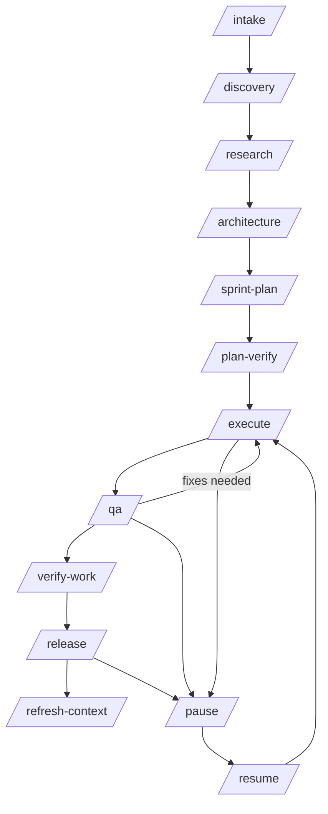
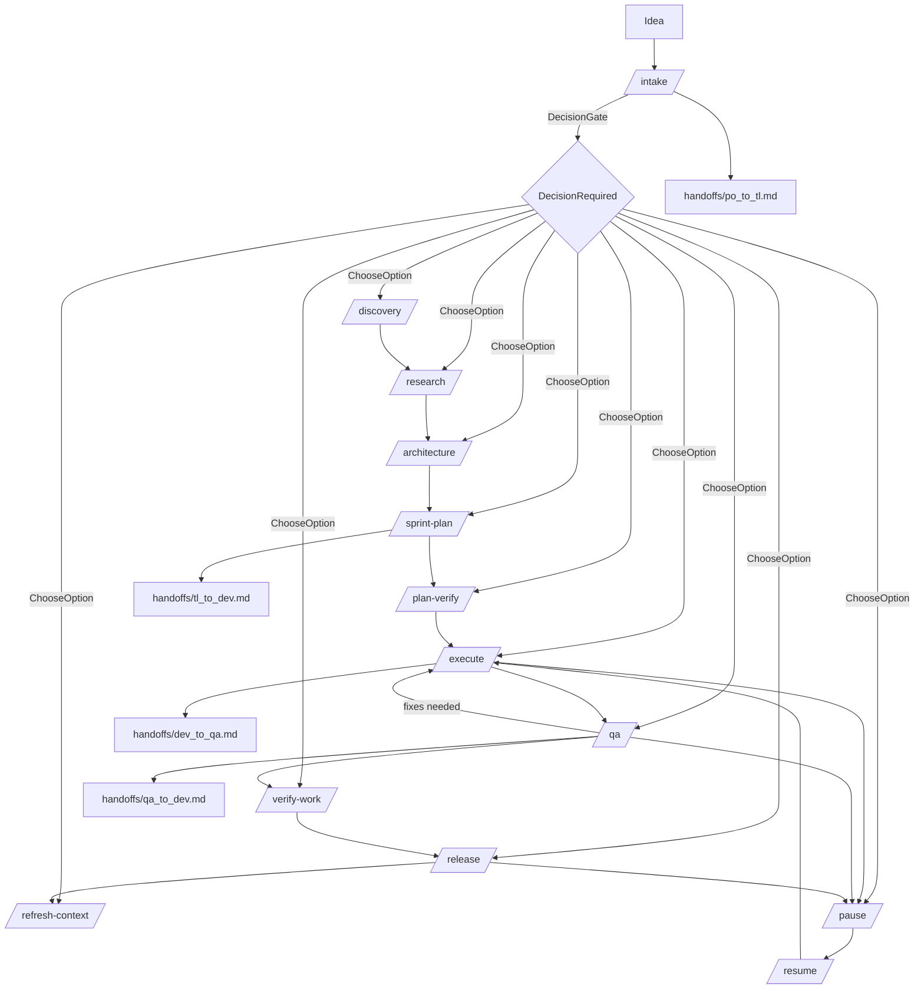
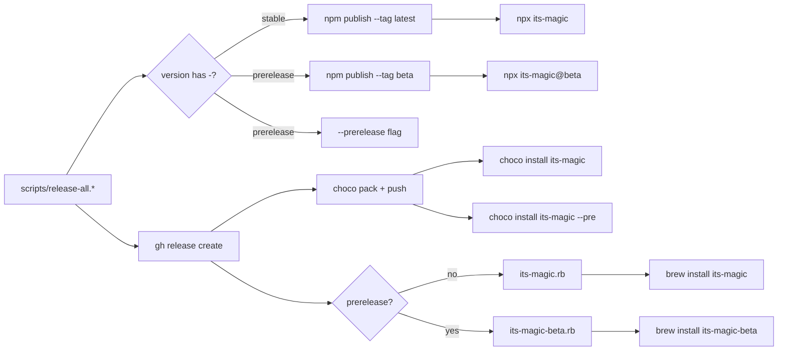
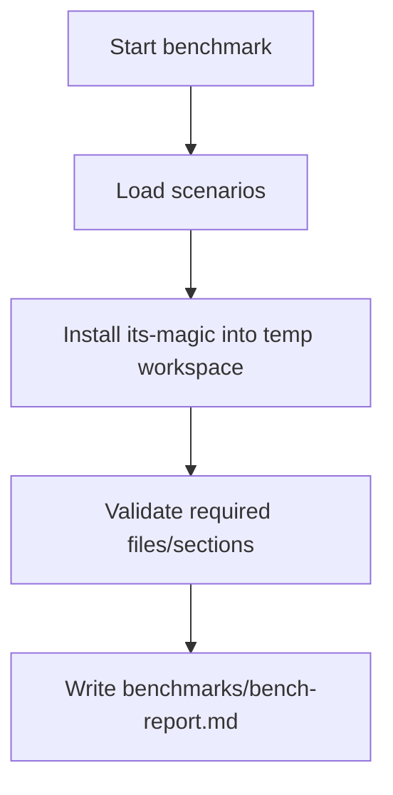
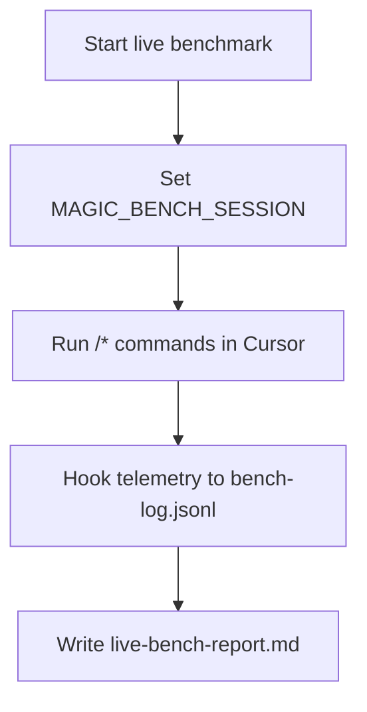
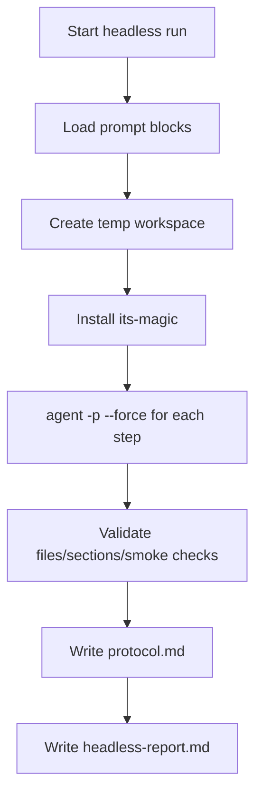

# its-magic — AI dev team

[GitHub Repository](https://github.com/fl0wm0ti0n/its-magic)

Happy coding! Build something awesome.

Drop-in template repo that implements a structured its-magic workflow in Cursor:
intake -> discovery -> architecture -> sprint plan -> execute -> QA -> release,
with pause/resume, decision gates, and persistent artifacts.

## Features (what its-magic can do)

- Structured phase workflow with explicit artifacts.
- Artifact-first memory (state in files, not chat only).
- Decision gate + escalation (`decisions/DEC-xxxx.md`).
- Pause/resume with checkpoints (`handoffs/resume_brief.md`).
- Automated execute/QA loop with safety caps (optional).
- 3-layer quality chain: AI loop → local validate-and-push → CI auto-fix.
- CI/CD templates driven by `docs/engineering/runbook.md`.
- Team-friendly local overrides (`scratchpad.local.md`).
- Optional remote/docker execution and autonomous installs.
- Built-in benchmarks (live, prompted, headless).
- Multiplatform distribution (npm, Chocolatey, Homebrew).

## Setup

its-magic is an installer you run once per repo. It copies the AI dev team
workflow files (`.cursor/` commands, rules, agents, hooks, skills, plus `docs/`,
`sprints/`, `handoffs/`, etc.) into your project.

Starter artifacts are shipped as clean placeholders (no preloaded sprint/demo
history), so `/intake` starts from your own idea.

### 1) Install its-magic (once)

Pick one method:

| Method | Install command |
|--------|----------------|
| npm    | `npm install -g its-magic` |
| npx    | `npx its-magic --target . --mode missing` |
| Chocolatey | `choco install its-magic` (Admin shell) |
| Homebrew | `brew tap USER/tap && brew install its-magic` |

### 2) Apply to a repo

New repo:

```bash
mkdir my-project && cd my-project
git init
its-magic --target . --mode missing --create
```

Existing repo (safe merge):

```bash
its-magic --target . --mode missing
```

Existing repo (overwrite + backup):

```bash
its-magic --target . --mode overwrite --backup
```

### 3) Open in Cursor

1. Open the project folder
2. Run `/intake` with your idea
3. Follow the workflow

### CLI quick commands

```bash
# Show banner + help
its-magic

# Show version only
its-magic --version

# Install workflow files into current repo
its-magic --target . --mode missing

# Clean previously installed workflow artifacts
its-magic --clean-repo --target .
```

### Installer options

**Install options**

| Flag | Description |
|------|-------------|
| `--target <path>` | Path to the repository where workflow files are installed. If omitted you are prompted interactively. |
| `--mode missing` | **Default.** Only copy files that do not exist yet. Safe for repos that already have some workflow files. |
| `--mode overwrite` | Replace every file, even if it already exists. Combine with `--backup` to keep a snapshot first. |
| `--mode interactive` | Ask per file whether to overwrite or skip. Useful when you want to cherry-pick updates. |
| `--backup` | Before overwriting, save existing files to `backups/<timestamp>/`. Ignored in `missing` mode (nothing gets replaced). |
| `--create` | Create the target directory if it does not exist. |

**Clean options**

| Flag | Description |
|------|-------------|
| `--clean-repo` | Remove all its-magic workflow artifacts from the target repo (`.cursor`, `docs/product`, `docs/engineering`, `sprints`, `handoffs`, `decisions`). Your own source code is never touched. |
| `--yes` | Skip the confirmation prompt when cleaning. |

**Info**

| Flag | Description |
|------|-------------|
| `--help`, `-h` | Show banner, version, repo URL, and full usage reference. |
| `--version`, `-v` | Print the installed its-magic version and exit. |

## How-to

### Command usage pattern

- Best practice: use `/<command>` + 1-3 lines context.
- For quick ops (`/pause`, `/resume`, `/refresh-context`) command-only is fine.

### What gets installed

```text
your-project/
  .cursor/commands/          Cursor slash commands
  .cursor/rules/             AI behavior rules
  .cursor/agents/            Subagent definitions
  .cursor/skills/            Reusable skills
  .cursor/hooks/             Automation hooks
  .cursor/scratchpad.md      Shared configuration flags
  .cursor/scratchpad.local.example.md
  docs/                      Engineering & product docs, runbook
  sprints/                   Sprint tracking artifacts
  handoffs/                  Phase handoff artifacts
  decisions/                 Decision records
  scripts/validate-and-push.ps1   Local test-fix-push loop (Windows)
  scripts/validate-and-push.sh    Local test-fix-push loop (Linux/Mac)
  .github/workflows/         CI with auto-fix loop
  README.md
```

### Team mode local overrides (recommended)

Use two layers:

- Shared defaults: `.cursor/scratchpad.md` (committed)
- Personal overrides: `.cursor/scratchpad.local.md` (gitignored)

Setup:

1. Copy `.cursor/scratchpad.local.example.md` to `.cursor/scratchpad.local.md`
2. Set personal values there (`TEAM_MEMBER`, `ACTIVE_TASK_IDS`, automation style)
3. Hook merges shared + local (local wins)

## Workflow

### Core commands

- `/intake`: capture idea, backlog, acceptance.
- `/discovery`: collect UX/product references.
- `/research`: risks, patterns, dependencies.
- `/architecture`: technical approach and decisions.
- `/sprint-plan`: sprint and task list.
- `/plan-verify`: acceptance coverage check.
- `/execute`: implement tasks.
- `/qa`: test and report findings.
- `/verify-work`: UAT.
- `/release`: release notes + runbook updates.
- `/pause`, `/resume`, `/refresh-context`.
- `/auto`: sequential automation until decision/boundary.

### Workflow diagrams





### Automation modes

Configure in `.cursor/scratchpad.md`:

- `AUTO_FLOW_MODE=manual|auto_until_decision`  
  - `manual`: you trigger each phase/command yourself.  
  - `auto_until_decision`: `/auto` continues phases until a decision gate, blocker, or pause boundary.
- `PHASE_MODE=interactive|auto`  
  - `interactive`: agent asks clarifying questions more often.  
  - `auto`: agent minimizes prompts and proceeds with best effort.
- `PERMISSION_MODE=interactive|auto`  
  - `interactive`: ask before routine actions.  
  - `auto`: reduce routine permission prompts.
- `RUN_TESTS_ON_EDIT=0|1`  
  - `1`: runs configured tests after meaningful edits.  
  - `0`: tests only when you explicitly run QA/test phases.
- `LOOP_UNTIL_GREEN=0|1`  
  - `1`: keep iterating fix -> test until green (bounded).  
  - `0`: run one pass and report failures.
- `AUTO_IMPLEMENTATION_LOOP=0|1`  
  - `1`: enables execute -> QA -> execute loop automatically.
- `AUTO_LOOP_MAX_CYCLES=<n>`  
  - safety cap for auto loops (recommended `3-7`, default `5`).
- `AUTO_PAUSE_REQUEST=0|1`  
  - `1`: request graceful stop at next safe boundary.
- `AUTO_PAUSE_POLICY=after_task|after_phase`  
  - `after_task`: faster stop, more frequent boundaries.  
  - `after_phase`: cleaner checkpoints, fewer interruptions.

### Full scratchpad reference (detailed)

- `MAGIC_CONTEXT_STRICT=0|1`  
  - `1`: enforces context refresh discipline after code edits.
- `DONE=0|1`  
  - `1`: stop hook reminder loops when session is complete.
- `MAGIC_BENCH_SESSION=<id>`  
  - enables live benchmark event logging under one session id.
- `AUTO_INSTALL_DEPS=0|1`  
  - `1`: agent may install dependencies/runtimes automatically.
- `AUTO_RELEASE_NOTES=0|1`  
  - `1`: auto-generate `handoffs/release_notes.md`.
- `REMOTE_EXECUTION=0|1`  
  - `1`: allow remote/docker execution if configured.
- `REMOTE_CONFIG=.cursor/remote.json`  
  - path to remote execution server config.

Team/local (recommended in `.cursor/scratchpad.local.md`):

- `TEAM_MODE=0|1`
- `TEAM_MEMBER=<your-id>`
- `ACTIVE_TASK_IDS=T-12,T-13`

### Automated feature loop (optional)

Enable:

- `AUTO_FLOW_MODE=auto_until_decision`
- `PHASE_MODE=auto`
- `PERMISSION_MODE=auto`
- `RUN_TESTS_ON_EDIT=1`
- `LOOP_UNTIL_GREEN=1`
- `AUTO_IMPLEMENTATION_LOOP=1`
- `AUTO_LOOP_MAX_CYCLES=5`

Then run `/auto`.

Graceful stop (for shutdown/end of day):

1. Set `AUTO_PAUSE_REQUEST=1`
2. Flow stops at next configured boundary (`AUTO_PAUSE_POLICY`)
3. `/pause` artifacts are written
4. Next day run `/resume` or `/auto`

### Recommended profiles

**Max automation (high autonomy):**

- `AUTO_FLOW_MODE=auto_until_decision`
- `PHASE_MODE=auto`
- `PERMISSION_MODE=auto`
- `RUN_TESTS_ON_EDIT=1`
- `LOOP_UNTIL_GREEN=1`
- `AUTO_IMPLEMENTATION_LOOP=1`
- `AUTO_LOOP_MAX_CYCLES=5`
- `AUTO_INSTALL_DEPS=1` (optional, if you trust auto installs)
- `AUTO_PAUSE_POLICY=after_phase`

**Safer automation (recommended for most teams):**

- same as above, but keep:
  - `PERMISSION_MODE=interactive`
  - `AUTO_INSTALL_DEPS=0`
  - `AUTO_PAUSE_POLICY=after_task`

### Quality chain (3-layer auto-fix)

its-magic provides a complete quality chain that catches issues at three levels.
Each layer catches problems the previous layer missed:

```text
┌─────────────────────────────────────────────────────────────────┐
│ Layer 1: Cursor AI loop (in-editor)              OFF by default │
│   AUTO_IMPLEMENTATION_LOOP + LOOP_UNTIL_GREEN                   │
│   execute → QA → fix → execute (bounded by AUTO_LOOP_MAX_CYCLES)│
└──────────────────────────┬──────────────────────────────────────┘
                           │ code ready to push
┌──────────────────────────▼──────────────────────────────────────┐
│ Layer 2: validate-and-push (local pre-push)      MANUAL (run it)│
│   scripts/validate-and-push.sh / .ps1                           │
│   test → format → lint-fix → test → commit + push               │
└──────────────────────────┬──────────────────────────────────────┘
                           │ pushed to GitHub
┌──────────────────────────▼──────────────────────────────────────┐
│ Layer 3: CI auto-fix (GitHub Actions)            OFF by default │
│   .github/workflows/ci.yml                                      │
│   test/lint → auto-fix → commit → re-run (up to 3 retries)     │
└─────────────────────────────────────────────────────────────────┘
```

| Layer | Default | Enable |
|-------|---------|--------|
| 1 - Cursor AI loop | off | Set `AUTO_IMPLEMENTATION_LOOP=1` + `LOOP_UNTIL_GREEN=1` in scratchpad |
| 2 - validate-and-push | manual | Run `scripts/validate-and-push.sh` or `.ps1` before pushing |
| 3 - CI auto-fix | off | Set `CI_AUTO_FIX: true` in `docs/engineering/runbook.md` |

CI itself (tests, lint, typecheck) always runs on push/PR. Only the **auto-fix
retry loop** is gated behind `CI_AUTO_FIX`. When disabled, CI still reports
failures -- it just won't try to fix and commit automatically.

All commands are read from `docs/engineering/runbook.md`. Fill in your
project-specific commands once and every layer uses them:

```text
TEST_COMMAND: npm test
LINT_COMMAND: npx eslint .
LINT_FIX_COMMAND: npx eslint --fix .
FORMAT_COMMAND: npx prettier --write .
CI_AUTO_FIX: true
```

#### Layer 1: Cursor AI loop

Enabled via scratchpad flags (see [Automation modes](#automation-modes)).
The AI runs execute → QA → fix cycles inside Cursor until tests pass or
the safety cap (`AUTO_LOOP_MAX_CYCLES`) is reached.

#### Layer 2: Local validate-and-push

Run before pushing to catch anything the AI loop missed:

```bash
# Bash (Linux / macOS)
sh scripts/validate-and-push.sh

# PowerShell (Windows)
powershell scripts/validate-and-push.ps1
powershell scripts/validate-and-push.ps1 -MaxAttempts 3
```

The script:
1. Runs `FORMAT_COMMAND` and `LINT_FIX_COMMAND` to auto-fix what it can
2. Runs `LINT_COMMAND` and `TEST_COMMAND` to verify
3. If checks fail, pauses and waits for you to fix
4. Re-runs (up to 5 attempts, configurable)
5. When green, commits and pushes automatically

Use `-NoCommit` (PowerShell) or `false` as third arg (Bash) to skip auto-push.

#### Layer 3: CI auto-fix (GitHub Actions)

**Disabled by default.** Set `CI_AUTO_FIX: true` in `docs/engineering/runbook.md`
to enable. When enabled and CI fails after a push, the auto-fix job kicks in:

```text
push / PR  ──>  checks  ──>  PASS  ──>  done
                   │
                  FAIL
                   │
             auto-fix job
                   │
          run LINT_FIX_COMMAND
          run FORMAT_COMMAND
                   │
             changes found?
            ╱              ╲
         yes                no
          │                  │
    commit + push       report failure
          │             (manual fix needed)
     CI re-runs
     (up to 3x)
```

Auto-fix commits appear as `ci: auto-fix attempt N/3`. After 3 retries the
workflow stops and points you to `scripts/validate-and-push` for local fixing.

## Examples

### Example 1: New feature from idea

1. `/intake`
2. `/research`
3. `/architecture`
4. `/sprint-plan`
5. `/plan-verify`
6. `/execute`
7. `/qa`
8. `/verify-work`
9. `/release`
10. `/refresh-context`

### Example 2: Mid-flight idea change

1. Set `AUTO_PAUSE_REQUEST=1`
2. Run `/intake` to update story/acceptance
3. Re-run `/sprint-plan` + `/plan-verify`
4. Resume via `/auto`

### Example 3: Pause/resume

1. `/pause`
2. Close work
3. `/resume` next session

### Example 4: Existing project onboarding

1. `/map-codebase`
2. Review generated mapping artifacts
3. Continue with `/intake` or `/architecture`

## Other useful capabilities

### Voice input (multilingual)

Voice is an input layer only; it feeds normal slash commands.

- OS dictation
- Cursor voice (if available)
- Local STT tooling

Reliable pattern:

- bind `/intake ` insertion shortcut
- dictate only the content after the command

### Repository layout (quick orientation)

- `.cursor/`: commands, rules, agents, hooks, skills, scratchpad.
- `docs/`: product + engineering docs.
- `sprints/`: sprint planning/tracking.
- `handoffs/`: role-to-role transfers.
- `decisions/`: decision records.
- `.github/workflows/`: CI/CD templates.

## Developer and release deep-dive

### CI/CD via runbook

Workflows read keys from `docs/engineering/runbook.md`:

- `TEST_COMMAND`
- `LINT_COMMAND`
- `TYPECHECK_COMMAND`
- `DEPLOY_STAGING_COMMAND`
- `DEPLOY_PROD_COMMAND`

Unset keys are skipped.

### Installer internals

- `installer.ps1` (Windows)
- `installer.sh` (macOS/Linux)
- `installer.py` (fallback)

Modes: `missing`, `overwrite`, `interactive` (+ optional backup).

### Release automation

Unified release scripts:

- Windows: `scripts/release-all.ps1`
- macOS/Linux: `scripts/release-all.sh`

NPM helpers:

- `npm run release:all`
- `npm run release:all:patch|minor|major|beta|dry`
- `npm run release:npm-only|choco-only|brew-only`

Release script flow:

1. bump `package.json` version
2. publish npm
3. create GitHub release
4. update/publish Chocolatey package
5. update/push Homebrew formula (stable or beta)



Prereqs:

- `npm login`
- `gh auth login`
- Chocolatey API key (if choco publish)
- Homebrew tap repo for formula distribution

### Package manager installation matrix

| Manager    | Stable                                    | Beta / Pre-release                          |
|------------|-------------------------------------------|---------------------------------------------|
| npm/npx    | `npx its-magic --target . --mode missing` | `npx its-magic@beta --target . --mode missing` |
| Chocolatey | `choco install its-magic`                 | `choco install its-magic --pre`             |
| Homebrew   | `brew install USER/tap/its-magic`         | `brew install USER/tap/its-magic-beta`      |

### Release package contents

Published npm package includes runtime content only (commands/rules/agents/docs/installers).

Excluded from npm package:

- `benchmarks/`
- `tests/`
- `packaging/`
- `Plan.md`

### Benchmarks

- Main benchmark: `benchmarks/run-bench.ps1` or `benchmarks/run-bench.sh`
- Live benchmark: `benchmarks/live/run-live-bench.*`
- Prompted benchmark: `benchmarks/prompts/run-prompts.*`
- Headless benchmark: `benchmarks/headless/run-headless.*`

Reports:

- `benchmarks/bench-report.md`
- `benchmarks/live/live-bench-report.md`
- `benchmarks/headless/headless-report.md`
- `benchmarks/headless/protocol.md`







### Rules

- `core.mdc`: phase flow, context pack, pause/resume, remote usage.
- `quality.mdc`: small steps, tests/quality, optional auto-install.
- `coding-standards.mdc`: strict language best practices and code quality rules.
- `handoffs.mdc`: handoffs + state updates required.
- `escalation.mdc`: decision gate and stop conditions.

### Hooks

- `beforeShellExecution`: blocks dangerous commands.
- `beforeReadFile`: warns on secret-like files.
- `afterFileEdit`: tracks code edits vs context refresh.
- `stop`: reminds context refresh when needed.

### Artifacts (single source of truth)

- `docs/product/*`: vision, backlog, acceptance.
- `docs/engineering/*`: architecture, decisions, state, runbook.
- `sprints/Sxxxx/*`: sprint scope, tasks, progress, QA findings, summary.
- `decisions/*`: decision records.
- `handoffs/*`: role-to-role transfer notes.
